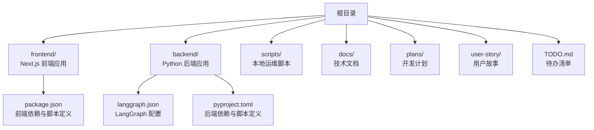
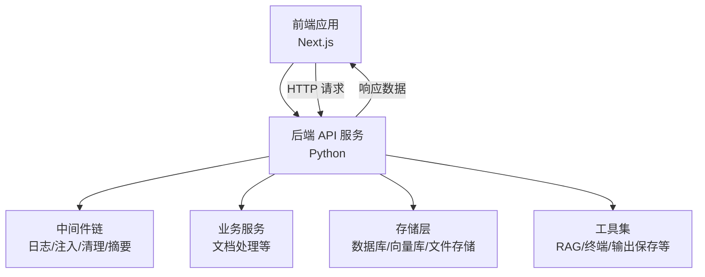
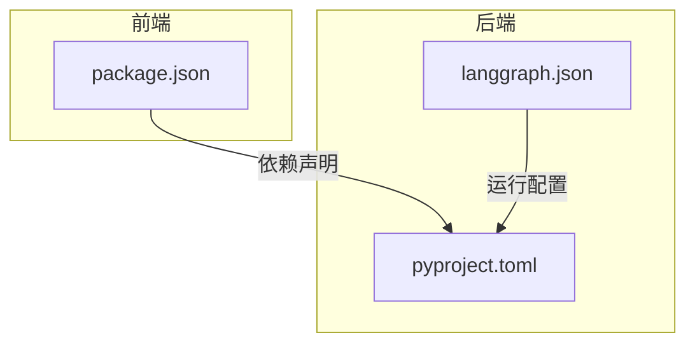

# 开发流程

<cite>
**本文引用的文件**
- [README.md](file://README.md)
- [backend/pyproject.toml](file://backend/pyproject.toml)
- [frontend/package.json](file://frontend/package.json)
- [scripts/start.sh](file://scripts/start.sh)
- [scripts/stop.sh](file://scripts/stop.sh)
- [scripts/restart.sh](file://scripts/restart.sh)
- [scripts/doctor.sh](file://scripts/doctor.sh)
- [backend/langgraph.json](file://backend/langgraph.json)
- [docs/backend-architecture.md](file://docs/backend-architecture.md)
- [docs/debug-guides.md](file://docs/debug-guides.md)
- [TODO.md](file://TODO.md)
- [plans/2026-05-27-train-agent-implementation.md](file://plans/2026-05-27-train-agent-implementation.md)
- [user-story/04-ppt-command.md](file://user-story/04-ppt-command.md)
- [user-story/07-download-output.md](file://user-story/07-download-output.md)
- [user-story/10-thread-recovery.md](file://user-story/10-thread-recovery.md)
</cite>

## 目录
1. [简介](#简介)
2. [项目结构](#项目结构)
3. [核心组件](#核心组件)
4. [架构总览](#架构总览)
5. [详细组件分析](#详细组件分析)
6. [依赖关系分析](#依赖关系分析)
7. [性能考虑](#性能考虑)
8. [故障排查指南](#故障排查指南)
9. [结论](#结论)
10. [附录](#附录)

## 简介
本文件面向 Train Agent 项目的开发者与维护者，系统化梳理从需求到发布的完整开发流程，覆盖分支管理、Issue 与 PR 工作流、CI/CD 配置建议、开发环境搭建、版本发布等关键环节。内容基于仓库现有文件与脚本进行归纳总结，并在缺乏明确配置处提供可操作的最佳实践建议。

## 项目结构
项目采用前后端分离架构：前端 Next.js 应用位于 frontend/，后端 Python 应用位于 backend/，根目录提供通用说明与计划文档。scripts/ 提供本地启动、停止、重启与健康检查脚本；docs/ 包含后端架构与调试指南；plans/ 与 user-story/ 记录规划与用户故事；TODO.md 汇总待办事项。

图表来源
- [backend/langgraph.json](file://backend/langgraph.json)
- [backend/pyproject.toml](file://backend/pyproject.toml)
- [frontend/package.json](file://frontend/package.json)

章节来源
- [README.md](file://README.md)
- [frontend/package.json](file://frontend/package.json)
- [backend/pyproject.toml](file://backend/pyproject.toml)

## 核心组件
- 前端应用：Next.js 应用，包含聊天、文档、任务、工作区等页面与组件，通过 API 层与后端交互。
- 后端服务：基于 Python 的 API 服务，包含中间件、解析器、存储与工具模块，以及 LangGraph 配置。
- 运维脚本：提供一键启动、停止、重启与健康检查能力，便于本地快速验证。
- 文档与计划：后端架构、调试指南、开发计划与用户故事，支撑需求到实现的闭环。

章节来源
- [docs/backend-architecture.md](file://docs/backend-architecture.md)
- [docs/debug-guides.md](file://docs/debug-guides.md)
- [backend/langgraph.json](file://backend/langgraph.json)
- [scripts/start.sh](file://scripts/start.sh)
- [scripts/stop.sh](file://scripts/stop.sh)
- [scripts/restart.sh](file://scripts/restart.sh)
- [scripts/doctor.sh](file://scripts/doctor.sh)

## 架构总览
下图展示从前端到后端的数据与控制流概览，体现本地开发时的典型交互路径。

图表来源
- [docs/backend-architecture.md](file://docs/backend-architecture.md)
- [backend/langgraph.json](file://backend/langgraph.json)

## 详细组件分析

### 分支管理策略
- 主分支保护：建议将 main 或 master 设为主保护分支，禁止直接推送，强制通过 PR 合并。
- 功能分支命名：建议采用 feature/<issue-id>-短描述 的格式，如 feature/123-add-auth。
- 修复分支：hotfix/<issue-id>-短描述，用于紧急修复。
- 发布分支：release/vX.Y.Z，用于预发布与回归测试。
- 合并与删除：PR 合并后建议删除功能分支，保持仓库整洁。

### Issue 提交流程
- 模板使用：建议在仓库中启用 Issue 模板，至少包含“标题、类型、优先级、影响范围、复现步骤、期望结果”等字段。
- 标签分类：按类型（bug、enhancement、documentation）、优先级（P0/P1/P2）、模块（backend/frontend）等维度打标。
- 优先级评估：P0 为阻塞性问题，需立即修复；P1 为高优；P2 为常规优化或小问题。
- 关联与追踪：每个 PR 应关联对应 Issue，并在提交信息中引用 #issue-number。

### Pull Request 流程
- 提交要求：PR 描述必须清晰说明背景、变更点与测试方法；关联 Issue 与相关文档。
- 代码审查标准：逻辑正确性、边界条件、安全性、性能影响、可维护性与一致性。
- 合并条件：获得至少一名维护者批准；所有 CI 检查通过；无未解决评论。
- 冲突解决：在合并前解决冲突，必要时 rebase 保持线性历史。

### 持续集成配置（建议）
- 触发条件：push 到非保护分支与 PR 打开/更新时触发。
- 自动化测试：后端运行 pytest；前端运行测试命令；静态检查（lint、type check）。
- 构建验证：打包/构建产物校验，确保可运行。
- 部署预览：为 PR 创建临时部署环境，便于端到端验证。
- 审阅与合并：CI 通过后方可合并，避免破坏主分支。

### 开发环境设置指南
- 克隆与初始化
  - 前端：进入 frontend/，安装依赖并启动开发服务器。
  - 后端：进入 backend/，根据依赖配置启动服务。
- 依赖安装
  - 前端：使用包管理器安装依赖。
  - 后端：使用项目定义的依赖管理工具安装。
- 环境变量
  - 在本地创建 .env 文件，配置数据库连接、模型服务地址、存储路径等。
- 本地调试
  - 使用调试脚本或 IDE 断点调试；结合日志中间件定位问题。
  - 参考调试指南文档进行端到端排障。

章节来源
- [frontend/package.json](file://frontend/package.json)
- [backend/pyproject.toml](file://backend/pyproject.toml)
- [scripts/start.sh](file://scripts/start.sh)
- [scripts/stop.sh](file://scripts/stop.sh)
- [scripts/restart.sh](file://scripts/restart.sh)
- [scripts/doctor.sh](file://scripts/doctor.sh)
- [docs/debug-guides.md](file://docs/debug-guides.md)

### 版本发布流程（建议）
- 版本号管理：遵循语义化版本（MAJOR.MINOR.PATCH），依据破坏性变更、新增功能与修复确定版本号。
- 变更日志：自动生成每次变更的变更记录，按类别汇总。
- 发布检查清单
  - 所有测试通过
  - 文档同步更新
  - 环境变量与配置核对
  - 回滚方案准备
  - 正式发布与通知

## 依赖关系分析
- 前后端解耦：前端通过 HTTP 接口调用后端 API，中间件与服务层负责请求处理与数据流转。
- 存储与工具：后端存储层支持数据库、向量库与文件存储；工具模块提供检索、终端执行与输出保存等能力。
- 脚本与运维：scripts/ 提供统一的启动/停止/重启/诊断入口，便于本地验证与问题排查。

图表来源
- [frontend/package.json](file://frontend/package.json)
- [backend/pyproject.toml](file://backend/pyproject.toml)
- [backend/langgraph.json](file://backend/langgraph.json)

章节来源
- [frontend/package.json](file://frontend/package.json)
- [backend/pyproject.toml](file://backend/pyproject.toml)
- [backend/langgraph.json](file://backend/langgraph.json)

## 性能考虑
- 后端中间件链：日志、注入上下文、消息清理与摘要中间件可能引入额外开销，应关注关键路径性能。
- 存储访问：数据库与向量库查询需注意索引与缓存策略，避免热点数据阻塞。
- 前端渲染：组件拆分与懒加载有助于降低首屏压力。
- CI 并行化：测试与构建任务尽量并行执行，缩短流水线时间。

## 故障排查指南
- 启动失败
  - 使用 doctor 脚本检查环境与依赖状态。
  - 检查端口占用与数据库连接。
- 接口异常
  - 查看后端日志中间件输出，定位请求处理阶段。
  - 结合调试指南逐层排查中间件、服务与存储。
- 数据不一致
  - 对照 LangGraph 配置与状态机逻辑，确认消息历史与技能执行顺序。
- 回归问题
  - 使用最小复现步骤，隔离问题范围；必要时回滚最近变更。

章节来源
- [scripts/doctor.sh](file://scripts/doctor.sh)
- [docs/debug-guides.md](file://docs/debug-guides.md)
- [backend/langgraph.json](file://backend/langgraph.json)

## 结论
本文件提供了 Train Agent 项目的开发流程框架，涵盖分支、Issue/PR、CI/CD、环境与发布等关键环节。建议团队在现有脚本与文档基础上，补充 CI 配置与 Issue/PR 模板，形成标准化的工作流，提升协作效率与交付质量。

## 附录
- 计划与故事
  - 开发计划与用户故事可用于需求评审与迭代排期。
- 待办清单
  - 结合作业故事与计划，将 TODO.md 作为每日站会与迭代回顾的输入。

章节来源
- [TODO.md](file://TODO.md)
- [plans/2026-05-27-train-agent-implementation.md](file://plans/2026-05-27-train-agent-implementation.md)
- [user-story/04-ppt-command.md](file://user-story/04-ppt-command.md)
- [user-story/07-download-output.md](file://user-story/07-download-output.md)
- [user-story/10-thread-recovery.md](file://user-story/10-thread-recovery.md)