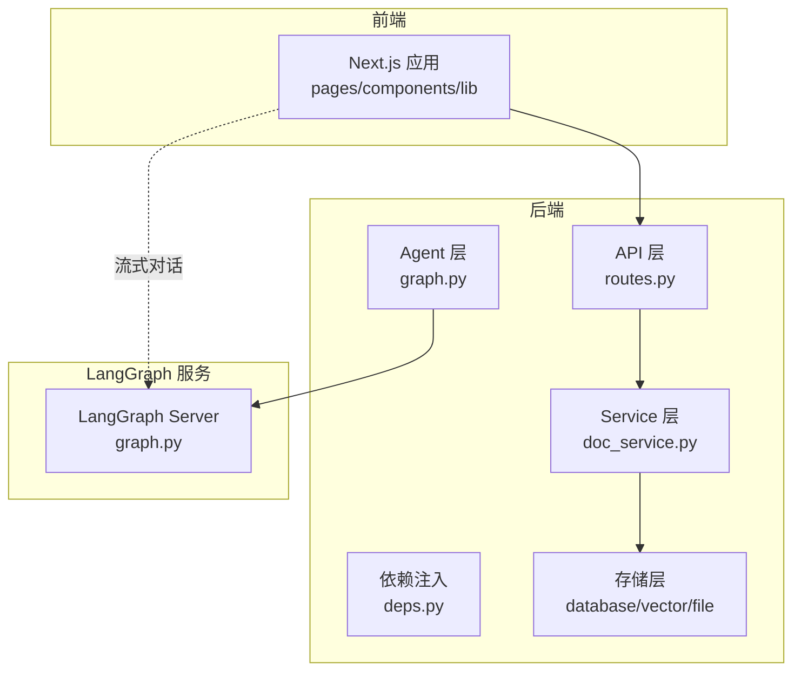
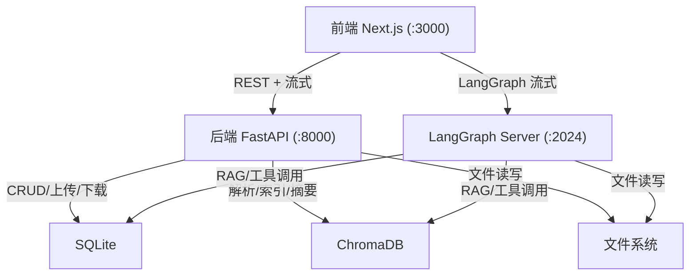
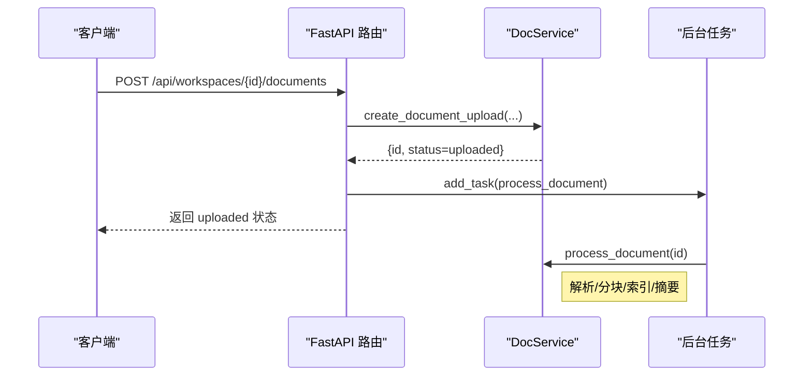
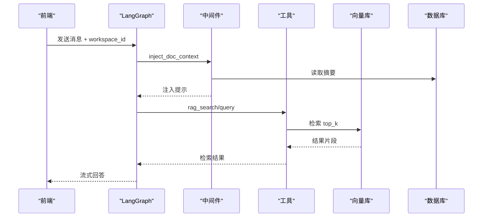
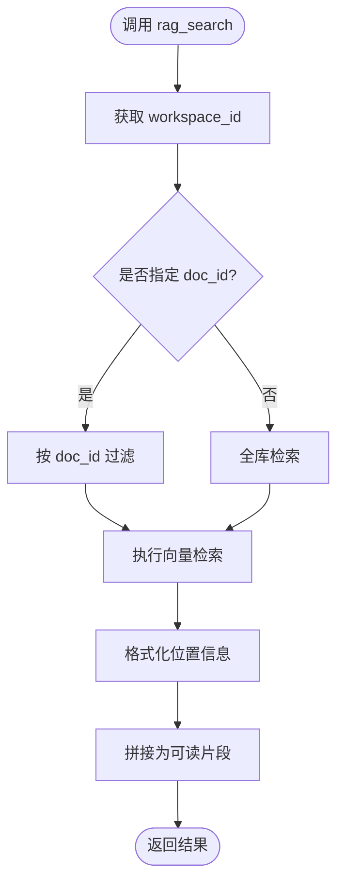
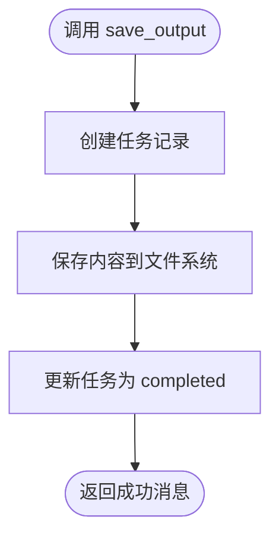
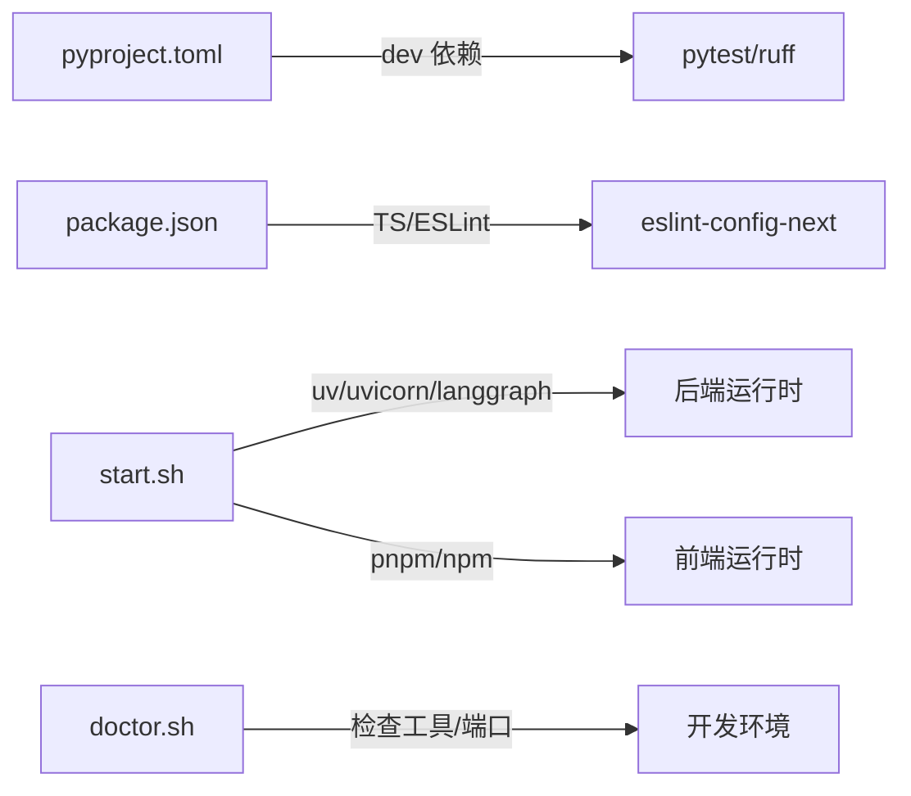
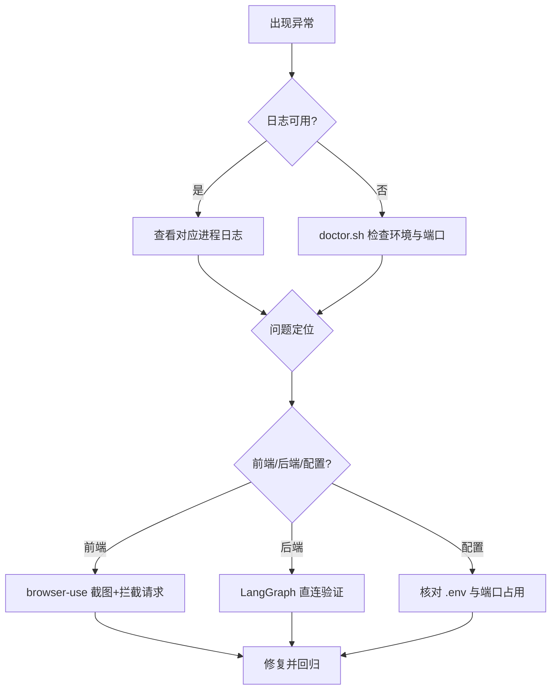

# 开发者指南

<cite>
**本文引用的文件**
- [README.md](file://README.md)
- [backend-architecture.md](file://docs/backend-architecture.md)
- [debug-guides.md](file://docs/debug-guides.md)
- [pyproject.toml](file://backend/pyproject.toml)
- [package.json](file://frontend/package.json)
- [eslint.config.mjs](file://frontend/eslint.config.mjs)
- [tsconfig.json](file://frontend/tsconfig.json)
- [start.sh](file://scripts/start.sh)
- [doctor.sh](file://scripts/doctor.sh)
- [routes.py](file://backend/src/api/routes.py)
- [graph.py](file://backend/src/agent/graph.py)
- [rag_search.py](file://backend/src/tools/rag_search.py)
- [save_output.py](file://backend/src/tools/save_output.py)
- [test_message_history.py](file://backend/tests/test_message_history.py)
- [test_summarization_middleware.py](file://backend/tests/test_summarization_middleware.py)
- [TODO.md](file://TODO.md)
</cite>

## 目录
1. [简介](#简介)
2. [项目结构](#项目结构)
3. [核心组件](#核心组件)
4. [架构总览](#架构总览)
5. [详细组件分析](#详细组件分析)
6. [依赖分析](#依赖分析)
7. [性能考虑](#性能考虑)
8. [故障排查指南](#故障排查指南)
9. [结论](#结论)
10. [附录](#附录)

## 简介
本指南面向 Train Agent 项目的开发者，目标是帮助团队建立一致的代码规范与最佳实践，完善开发流程（分支管理、提交规范、代码审查、CI）、测试策略（单元/集成/端到端）、贡献流程（Issue/Pull Request）、版本与发布管理，并提供调试与性能优化建议。项目采用前后端分离架构：后端为 FastAPI + LangGraph 的双进程服务，前端为 Next.js 应用。

## 项目结构
- 后端 backend
  - 三层 API 层（FastAPI 路由与依赖注入）、Agent 层（LangGraph/LangChain 编排）、Service 层（业务编排）、Storage 层（SQLite/ChromaDB/文件系统）
  - 测试位于 backend/tests
- 前端 frontend
  - Next.js 应用，TypeScript + ESLint + TailwindCSS
- 文档 docs
  - 后端架构设计、调试指南
- 脚本 scripts
  - 开发与健康检查脚本（启动、停止、重启、诊断）

图表来源
- [routes.py:1-189](file://backend/src/api/routes.py#L1-L189)
- [graph.py:1-49](file://backend/src/agent/graph.py#L1-L49)
- [backend-architecture.md:1-465](file://docs/backend-architecture.md#L1-L465)

章节来源
- [README.md:24-40](file://README.md#L24-L40)
- [backend-architecture.md:65-118](file://docs/backend-architecture.md#L65-L118)

## 核心组件
- 后端 API 层：提供 REST API（工作区/文档/任务 CRUD、文件上传下载），采用异步后台任务处理文档解析与索引，支持 CORS 全开放与静态资源挂载。
- Agent 层：基于 LangChain/LangGraph 的 ReAct Agent，注册工具与中间件，通过中间件注入当前工作区的文档摘要，实现上下文增强与工具调用。
- Service 层：文档处理流水线（上传→解析→分块→索引→摘要），状态机驱动，错误回退与清理。
- 存储层：SQLite（aiosqlite）、ChromaDB、文件系统，按 workspace 隔离。
- 前端：Next.js 应用，React 组件与 Zustand 状态管理，与后端 API 与 LangGraph 交互。

章节来源
- [backend-architecture.md:137-178](file://docs/backend-architecture.md#L137-L178)
- [backend-architecture.md:181-246](file://docs/backend-architecture.md#L181-L246)
- [backend-architecture.md:289-337](file://docs/backend-architecture.md#L289-L337)
- [backend-architecture.md:339-366](file://docs/backend-architecture.md#L339-L366)

## 架构总览
双进程架构：FastAPI 处理 REST API 与文件操作，LangGraph 专注 Agent 流式推理与工具调用。两者共享存储层，通过 workspace_id 实现数据隔离。

图表来源
- [backend-architecture.md:11-44](file://docs/backend-architecture.md#L11-L44)
- [README.md:7-13](file://README.md#L7-L13)

## 详细组件分析

### 后端 API 层（FastAPI）
- 路由前缀 /api/，提供工作区、文档、任务、文件下载等接口
- 文档上传采用异步后台任务，立即返回上传状态，前端轮询追踪进度
- CORS 全开放，静态资源挂载 /ppt-assets 与 /ppt-templates

图表来源
- [routes.py:112-128](file://backend/src/api/routes.py#L112-L128)
- [backend-architecture.md:295-329](file://docs/backend-architecture.md#L295-L329)

章节来源
- [routes.py:1-189](file://backend/src/api/routes.py#L1-L189)
- [backend-architecture.md:137-178](file://docs/backend-architecture.md#L137-L178)

### Agent 层（LangGraph/LangChain）
- Agent 图：ChatOpenAI + 工具 + 中间件，状态包含 workspace_id
- 中间件：
  - 注入当前工作区文档摘要（动态提示）
  - 修复 tool_call id 空值问题
- 工具：
  - rag_search：知识库检索，返回带位置信息的片段
  - load_skill：技能加载（渐进式披露）
  - save_output：产出物保存（PPT/报告），创建任务并写入文件
  - clarify_form：表单中断，支持 text/select/multiselect
  - terminal：Shell 命令执行（预留）

图表来源
- [graph.py:16-37](file://backend/src/agent/graph.py#L16-L37)
- [rag_search.py:40-75](file://backend/src/tools/rag_search.py#L40-L75)

章节来源
- [graph.py:1-49](file://backend/src/agent/graph.py#L1-L49)
- [rag_search.py:1-76](file://backend/src/tools/rag_search.py#L1-L76)
- [save_output.py:1-99](file://backend/src/tools/save_output.py#L1-L99)
- [backend-architecture.md:181-246](file://docs/backend-architecture.md#L181-L246)

### 工具：rag_search
- 输入：query、top_k、doc_id（可选）
- 输出：结构化检索片段（含文件名、章节、页码等位置信息）
- workspace 隔离：通过 runtime.state["workspace_id"] 定位 collection

图表来源
- [rag_search.py:40-75](file://backend/src/tools/rag_search.py#L40-L75)

章节来源
- [rag_search.py:1-76](file://backend/src/tools/rag_search.py#L1-L76)

### 工具：save_output
- 作用：创建任务记录、保存文件到 outputs 目录、更新任务状态
- 支持类型：ppt（HTML）、report（Markdown）
- 前端联动：任务列表轮询展示新产出

图表来源
- [save_output.py:13-59](file://backend/src/tools/save_output.py#L13-L59)

章节来源
- [save_output.py:1-99](file://backend/src/tools/save_output.py#L1-L99)

### 存储层（SQLite/ChromaDB/文件系统）
- SQLite：aiosqlite 异步，三张表（workspace/document/task），外键级联删除
- ChromaDB：DashscopeEmbeddingFunction，按 workspace 隔离 collection，支持按 doc_id 过滤
- 文件系统：按 workspace_id 组织目录，支持同步/异步写入与批量删除

章节来源
- [backend-architecture.md:341-366](file://docs/backend-architecture.md#L341-L366)

### 前端（Next.js + TypeScript）
- 严格类型：tsconfig.json 启用 strict，路径别名 @/*
- 代码质量：ESLint 配置基于 eslint-config-next，覆盖 core-web-vitals 与 TS 规则
- 依赖管理：package.json 指定 Next.js、React、LangChain 相关依赖与开发依赖

章节来源
- [tsconfig.json:1-35](file://frontend/tsconfig.json#L1-L35)
- [eslint.config.mjs:1-19](file://frontend/eslint.config.mjs#L1-L19)
- [package.json:1-39](file://frontend/package.json#L1-L39)

## 依赖分析
- 后端依赖管理：pyproject.toml 使用 hatchling 构建，dev 依赖包含 pytest 与 ruff
- 前端依赖管理：package.json 指定生产与开发依赖，TypeScript 与 ESLint
- 运行时脚本：start.sh 启动后端 API、LangGraph、前端，doctor.sh 进行健康检查

图表来源
- [pyproject.toml:1-41](file://backend/pyproject.toml#L1-L41)
- [package.json:1-39](file://frontend/package.json#L1-L39)
- [start.sh:1-128](file://scripts/start.sh#L1-L128)
- [doctor.sh:1-99](file://scripts/doctor.sh#L1-L99)

章节来源
- [pyproject.toml:1-41](file://backend/pyproject.toml#L1-L41)
- [package.json:1-39](file://frontend/package.json#L1-L39)
- [start.sh:1-128](file://scripts/start.sh#L1-L128)
- [doctor.sh:1-99](file://scripts/doctor.sh#L1-L99)

## 性能考虑
- 文档处理异步化：上传立即返回，后台完成解析/分块/索引/摘要，降低前端等待时间
- 向量检索：ChromaDB 按 workspace 隔离 collection，检索时可按 doc_id 过滤，减少无关匹配
- Agent 上下文压缩：中间件支持摘要消息隐藏与冷却策略，避免频繁压缩导致的 token 消耗
- 前端构建与类型检查：严格 tsconfig 与 ESLint 配置有助于早期发现潜在性能问题

章节来源
- [backend-architecture.md:295-337](file://docs/backend-architecture.md#L295-L337)
- [backend-architecture.md:456-465](file://docs/backend-architecture.md#L456-L465)
- [test_summarization_middleware.py:1-59](file://backend/tests/test_summarization_middleware.py#L1-L59)

## 故障排查指南
- 日志定位：每次重启清空日志，查看 logs/backend.log、logs/langgraph.log、logs/frontend.log
- 前端问题：使用 browser-use 打开页面、截图、注入 fetch 拦截器观察请求
- 后端验证：LangGraph resume 接口直连验证，判断问题在前端还是后端
- 健康检查：doctor.sh 检查工具链、项目文件、环境变量与端口占用

图表来源
- [debug-guides.md:1-79](file://docs/debug-guides.md#L1-L79)
- [doctor.sh:1-99](file://scripts/doctor.sh#L1-L99)

章节来源
- [debug-guides.md:1-79](file://docs/debug-guides.md#L1-L79)
- [doctor.sh:1-99](file://scripts/doctor.sh#L1-L99)

## 结论
本指南总结了 Train Agent 的整体架构、核心组件、开发流程与测试策略，并提供了调试与性能优化建议。建议团队在后续迭代中补充 CI/CD 配置、完善贡献流程与版本发布规范，持续改进测试覆盖率与文档质量。

## 附录

### 代码规范与最佳实践

- Python 后端
  - 语言版本：≥ 3.12，使用 match 等新语法特性
  - 依赖管理：uv + hatchling，dev 依赖包含 pytest 与 ruff
  - 命名约定：类名使用 PascalCase，函数与变量使用 snake_case，常量使用 UPPER_CASE
  - 注释规范：模块与复杂函数添加 docstring，内部注释简洁明了
  - 错误处理：工具与中间件捕获异常并返回可读错误信息，避免泄露敏感细节
  - 日志记录：统一使用 logging，包含关键上下文（如 workspace_id、thread_id）

- TypeScript 前端
  - 类型严格：启用 strict，合理使用类型别名与接口
  - 命名约定：组件文件使用 PascalCase，Hook 使用 use 前缀，工具函数使用小驼峰
  - 注释规范：公共 API 与复杂逻辑添加注释，遵循 ESLint 规则
  - 代码组织：按功能域划分目录（app/components/lib），使用路径别名 @/*

章节来源
- [backend-architecture.md:48-62](file://docs/backend-architecture.md#L48-L62)
- [pyproject.toml:1-41](file://backend/pyproject.toml#L1-L41)
- [tsconfig.json:1-35](file://frontend/tsconfig.json#L1-L35)
- [eslint.config.mjs:1-19](file://frontend/eslint.config.mjs#L1-L19)

### 开发流程与规范

- 分支管理策略
  - 主分支保护：master/main 仅允许通过 PR 合并
  - 功能分支：feature/<issue-id>-短描述，完成后清理
  - 修复分支：fix/<issue-id>-短描述，聚焦单一问题
  - 预发布分支：release/<版本号>，用于发布前集成测试

- 提交规范
  - 标题：类型(作用域): 描述（不超过 50 字）
  - 类型：feat、fix、docs、style、refactor、perf、test、chore
  - 正文：简述动机与影响，必要时附带变更摘要
  - 关联 Issue：在正文末尾添加 Closes #编号 或 Related #编号

- 代码审查流程
  - 至少一名 reviewer，关注安全性、可维护性与测试覆盖
  - 审查清单：命名一致性、错误处理、日志完整性、性能影响、安全风险
  - 通过 CI 后方可合并

- 持续集成配置
  - 建议在 CI 中执行：Python 依赖安装、pytest（含 asyncio_mode）、Ruff 检查、前端 Lint/Build
  - 建议缓存 uv 与 pnpm/npx 缓存，提升构建速度

章节来源
- [pyproject.toml:28-36](file://backend/pyproject.toml#L28-L36)
- [package.json:5-10](file://frontend/package.json#L5-L10)

### 测试策略

- 单元测试
  - 后端：pytest + pytest-asyncio，覆盖存储层、中间件、工具与服务层
  - 示例：消息历史持久化与分页、摘要中间件触发与冷却逻辑

- 集成测试
  - 覆盖 API 与 Agent 的端到端流程：上传文档→解析→索引→检索→回答
  - 建议使用临时数据库与向量库，模拟真实工作区隔离

- 端到端测试
  - 前端：使用浏览器自动化工具（如 playwright/cypress）验证 UI 交互
  - 后端：LangGraph 直连测试 resume、interrupt、工具调用链路

章节来源
- [test_message_history.py:1-65](file://backend/tests/test_message_history.py#L1-L65)
- [test_summarization_middleware.py:1-59](file://backend/tests/test_summarization_middleware.py#L1-L59)

### 贡献指南

- Issue 提交规范
  - 标题：简洁描述问题
  - 类型：bug、enhancement、question、task
  - 内容：重现步骤、期望结果、实际结果、日志与截图（debug/ 目录）

- Pull Request 流程
  - 关联 Issue，简述改动动机与方案
  - 通过本地测试与 Lint，确保 CI 通过
  - 审查通过后合并，清理分支

- 文档更新要求
  - 新增/修改核心流程需同步更新 docs/backend-architecture.md 与 README.md
  - API 变更需更新路由与数据模型说明

章节来源
- [README.md:126-133](file://README.md#L126-L133)
- [debug-guides.md:16-24](file://docs/debug-guides.md#L16-L24)

### 版本管理策略

- 语义化版本控制
  - 主版本：破坏性变更
  - 次版本：向下兼容的功能新增
  - 修订版本：向下兼容的问题修复

- 发布流程
  - 在 release/<版本号> 分支进行最终验证
  - 更新 CHANGELOG，打标签并推送
  - 生成发布说明，同步更新前端与后端版本号

- 变更日志维护
  - 每次提交记录关键变更，按类别归档（新增、修复、优化、重构）
  - 发布前汇总为正式变更日志

章节来源
- [pyproject.toml:3-4](file://backend/pyproject.toml#L3-L4)
- [package.json:2-4](file://frontend/package.json#L2-L4)

### 调试技巧与工具

- 断点调试
  - 后端：在工具与中间件关键节点设置断点，结合日志定位状态变化
  - 前端：在组件渲染与 API 调用处设置断点，观察 props 与状态

- 性能分析
  - 后端：对长耗时工具（向量检索、LLM 调用）增加计时日志
  - 前端：使用 React DevTools Profiler 分析重渲染热点

- 内存泄漏检测
  - 前端：定期清理事件监听与定时器，避免闭包持有大对象
  - 后端：关闭数据库连接与向量客户端，避免循环引用

章节来源
- [debug-guides.md:1-79](file://docs/debug-guides.md#L1-L79)

### 常见问题与最佳实践

- 问题：LangGraph 无法 resume
  - 排查：使用 curl 直连 /threads/{thread_id}/runs，确认后端可达
  - 处理：若后端通，检查前端 resume 调用与中断状态

- 问题：RAG 检索无结果
  - 排查：确认 workspace_id 与 doc_id 是否正确，向量库是否写入
  - 处理：重新上传文档或检查分块/索引流程

- 问题：前端样式异常
  - 排查：运行 pnpm lint 与 pnpm build，检查 Tailwind 配置与路径别名
  - 处理：修复 ESLint 规则冲突与 TS 类型错误

章节来源
- [debug-guides.md:70-79](file://docs/debug-guides.md#L70-L79)
- [tsconfig.json:21-23](file://frontend/tsconfig.json#L21-L23)
- [eslint.config.mjs:5-16](file://frontend/eslint.config.mjs#L5-L16)