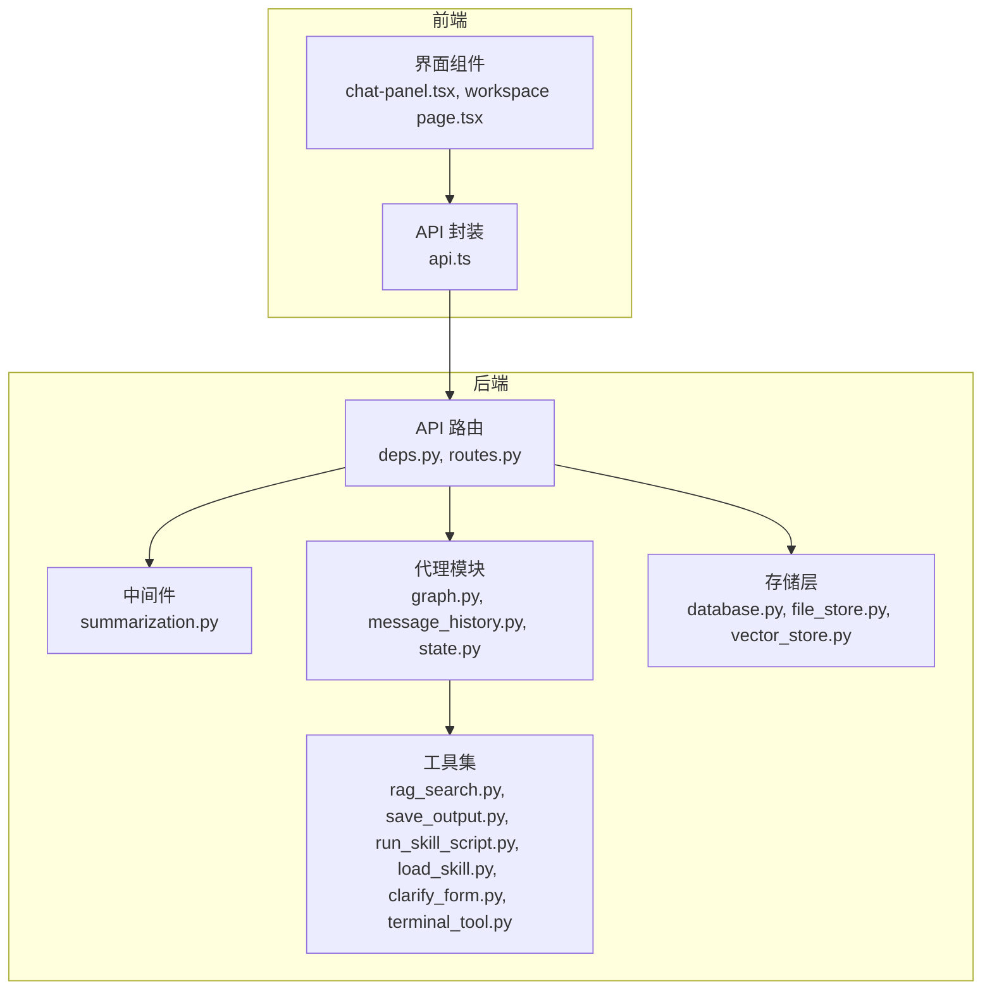
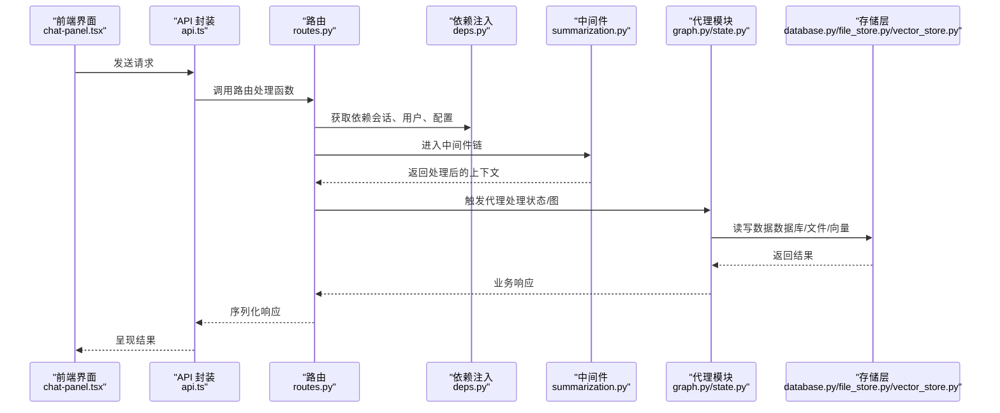
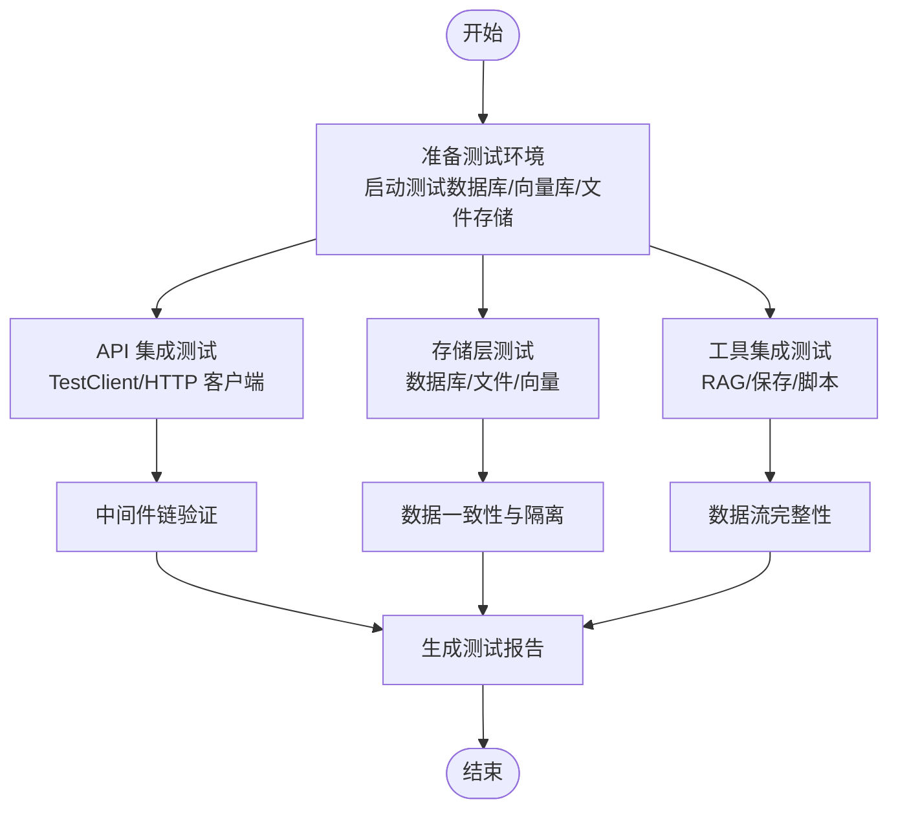
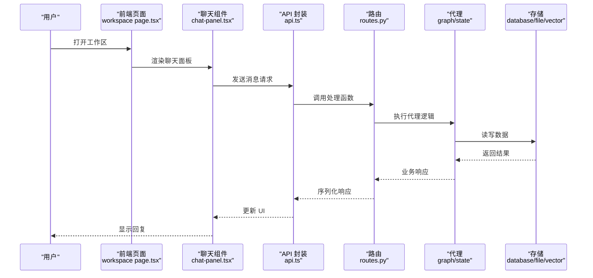
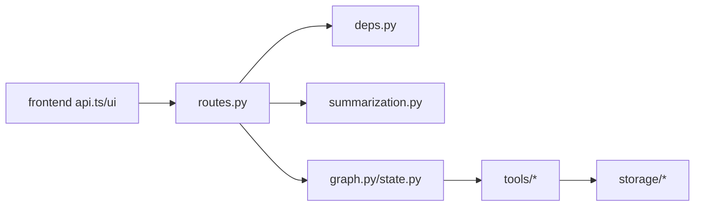

# 测试策略

<cite>
**本文引用的文件**
- [backend/tests/test_message_history.py](file://backend/tests/test_message_history.py)
- [backend/tests/test_message_history_callback.py](file://backend/tests/test_message_history_callback.py)
- [backend/tests/test_summarization_middleware.py](file://backend/tests/test_summarization_middleware.py)
- [backend/src/agent/graph.py](file://backend/src/agent/graph.py)
- [backend/src/agent/message_history.py](file://backend/src/agent/message_history.py)
- [backend/src/agent/state.py](file://backend/src/agent/state.py)
- [backend/src/middlewares/summarization.py](file://backend/src/middlewares/summarization.py)
- [backend/src/storage/database.py](file://backend/src/storage/database.py)
- [backend/src/storage/file_store.py](file://backend/src/storage/file_store.py)
- [backend/src/storage/vector_store.py](file://backend/src/storage/vector_store.py)
- [backend/src/api/deps.py](file://backend/src/api/deps.py)
- [backend/src/api/routes.py](file://backend/src/api/routes.py)
- [backend/src/tools/rag_search.py](file://backend/src/tools/rag_search.py)
- [backend/src/tools/save_output.py](file://backend/src/tools/save_output.py)
- [backend/src/tools/run_skill_script.py](file://backend/src/tools/run_skill_script.py)
- [backend/src/tools/load_skill.py](file://backend/src/tools/load_skill.py)
- [backend/src/tools/clarify_form.py](file://backend/src/tools/clarify_form.py)
- [backend/src/tools/terminal_tool.py](file://backend/src/tools/terminal_tool.py)
- [backend/pyproject.toml](file://backend/pyproject.toml)
- [frontend/package.json](file://frontend/package.json)
- [frontend/src/lib/api.ts](file://frontend/src/lib/api.ts)
- [frontend/src/components/chat/chat-panel.tsx](file://frontend/src/components/chat/chat-panel.tsx)
- [frontend/src/app/workspace/[id]/page.tsx](file://frontend/src/app/workspace/[id]/page.tsx)
- [scripts/start.sh](file://scripts/start.sh)
- [scripts/stop.sh](file://scripts/stop.sh)
- [scripts/restart.sh](file://scripts/restart.sh)
- [README.md](file://README.md)
</cite>

## 目录
1. [引言](#引言)
2. [项目结构](#项目结构)
3. [核心组件](#核心组件)
4. [架构总览](#架构总览)
5. [详细组件分析](#详细组件分析)
6. [依赖关系分析](#依赖关系分析)
7. [性能考虑](#性能考虑)
8. [故障排查指南](#故障排查指南)
9. [结论](#结论)
10. [附录](#附录)

## 引言
本测试策略文档面向 Train Agent 项目的后端与前端，系统化地定义单元测试、集成测试、端到端测试与性能测试的实施方法，覆盖测试文件组织、用例设计、Mock 使用、覆盖率要求、测试数据管理、测试环境与 CI/CD 集成以及测试失败调试流程。文档以现有代码库为基础，结合实际模块职责与接口边界，给出可落地的实践建议。

## 项目结构
- 后端采用 Python + FastAPI 架构，核心模块包括代理状态机与图编排、消息历史、中间件、存储层（数据库、文件、向量）、工具集（RAG 搜索、输出保存、脚本执行等）以及 API 路由与依赖注入。
- 前端基于 Next.js，包含聊天面板、工作区页面、API 封装与用户相关逻辑。
- 测试已覆盖消息历史、回调与摘要中间件，后续应扩展至路由、存储、工具与端到端场景。

**图表来源**
- [backend/src/api/routes.py](file://backend/src/api/routes.py)
- [backend/src/api/deps.py](file://backend/src/api/deps.py)
- [backend/src/middlewares/summarization.py](file://backend/src/middlewares/summarization.py)
- [backend/src/agent/graph.py](file://backend/src/agent/graph.py)
- [backend/src/agent/message_history.py](file://backend/src/agent/message_history.py)
- [backend/src/agent/state.py](file://backend/src/agent/state.py)
- [backend/src/storage/database.py](file://backend/src/storage/database.py)
- [backend/src/storage/file_store.py](file://backend/src/storage/file_store.py)
- [backend/src/storage/vector_store.py](file://backend/src/storage/vector_store.py)
- [backend/src/tools/rag_search.py](file://backend/src/tools/rag_search.py)
- [backend/src/tools/save_output.py](file://backend/src/tools/save_output.py)
- [backend/src/tools/run_skill_script.py](file://backend/src/tools/run_skill_script.py)
- [backend/src/tools/load_skill.py](file://backend/src/tools/load_skill.py)
- [backend/src/tools/clarify_form.py](file://backend/src/tools/clarify_form.py)
- [backend/src/tools/terminal_tool.py](file://backend/src/tools/terminal_tool.py)
- [frontend/src/lib/api.ts](file://frontend/src/lib/api.ts)
- [frontend/src/components/chat/chat-panel.tsx](file://frontend/src/components/chat/chat-panel.tsx)
- [frontend/src/app/workspace/[id]/page.tsx](file://frontend/src/app/workspace/[id]/page.tsx)

**章节来源**
- [backend/src/api/routes.py](file://backend/src/api/routes.py)
- [backend/src/api/deps.py](file://backend/src/api/deps.py)
- [backend/src/middlewares/summarization.py](file://backend/src/middlewares/summarization.py)
- [backend/src/agent/graph.py](file://backend/src/agent/graph.py)
- [backend/src/agent/message_history.py](file://backend/src/agent/message_history.py)
- [backend/src/agent/state.py](file://backend/src/agent/state.py)
- [backend/src/storage/database.py](file://backend/src/storage/database.py)
- [backend/src/storage/file_store.py](file://backend/src/storage/file_store.py)
- [backend/src/storage/vector_store.py](file://backend/src/storage/vector_store.py)
- [backend/src/tools/rag_search.py](file://backend/src/tools/rag_search.py)
- [backend/src/tools/save_output.py](file://backend/src/tools/save_output.py)
- [backend/src/tools/run_skill_script.py](file://backend/src/tools/run_skill_script.py)
- [backend/src/tools/load_skill.py](file://backend/src/tools/load_skill.py)
- [backend/src/tools/clarify_form.py](file://backend/src/tools/clarify_form.py)
- [backend/src/tools/terminal_tool.py](file://backend/src/tools/terminal_tool.py)
- [frontend/src/lib/api.ts](file://frontend/src/lib/api.ts)
- [frontend/src/components/chat/chat-panel.tsx](file://frontend/src/components/chat/chat-panel.tsx)
- [frontend/src/app/workspace/[id]/page.tsx](file://frontend/src/app/workspace/[id]/page.tsx)

## 核心组件
- 代理与状态：负责对话状态管理、消息历史与图编排，是业务逻辑的核心。
- 中间件：对请求进行预处理与摘要，影响下游处理链路。
- 存储层：数据库、文件与向量存储，支撑数据持久化与检索。
- 工具集：封装 RAG、输出保存、脚本执行、技能加载等能力。
- API 层：路由与依赖注入，对外提供服务入口。
- 前端：通过 API 封装与界面组件交互，承载用户场景测试。

**章节来源**
- [backend/src/agent/graph.py](file://backend/src/agent/graph.py)
- [backend/src/agent/message_history.py](file://backend/src/agent/message_history.py)
- [backend/src/agent/state.py](file://backend/src/agent/state.py)
- [backend/src/middlewares/summarization.py](file://backend/src/middlewares/summarization.py)
- [backend/src/storage/database.py](file://backend/src/storage/database.py)
- [backend/src/storage/file_store.py](file://backend/src/storage/file_store.py)
- [backend/src/storage/vector_store.py](file://backend/src/storage/vector_store.py)
- [backend/src/tools/rag_search.py](file://backend/src/tools/rag_search.py)
- [backend/src/tools/save_output.py](file://backend/src/tools/save_output.py)
- [backend/src/tools/run_skill_script.py](file://backend/src/tools/run_skill_script.py)
- [backend/src/tools/load_skill.py](file://backend/src/tools/load_skill.py)
- [backend/src/tools/clarify_form.py](file://backend/src/tools/clarify_form.py)
- [backend/src/tools/terminal_tool.py](file://backend/src/tools/terminal_tool.py)
- [backend/src/api/routes.py](file://backend/src/api/routes.py)
- [backend/src/api/deps.py](file://backend/src/api/deps.py)
- [frontend/src/lib/api.ts](file://frontend/src/lib/api.ts)
- [frontend/src/components/chat/chat-panel.tsx](file://frontend/src/components/chat/chat-panel.tsx)
- [frontend/src/app/workspace/[id]/page.tsx](file://frontend/src/app/workspace/[id]/page.tsx)

## 架构总览
下图展示从前端到后端的关键调用路径与测试关注点：

**图表来源**
- [frontend/src/components/chat/chat-panel.tsx](file://frontend/src/components/chat/chat-panel.tsx)
- [frontend/src/lib/api.ts](file://frontend/src/lib/api.ts)
- [backend/src/api/routes.py](file://backend/src/api/routes.py)
- [backend/src/api/deps.py](file://backend/src/api/deps.py)
- [backend/src/middlewares/summarization.py](file://backend/src/middlewares/summarization.py)
- [backend/src/agent/graph.py](file://backend/src/agent/graph.py)
- [backend/src/agent/state.py](file://backend/src/agent/state.py)
- [backend/src/storage/database.py](file://backend/src/storage/database.py)
- [backend/src/storage/file_store.py](file://backend/src/storage/file_store.py)
- [backend/src/storage/vector_store.py](file://backend/src/storage/vector_store.py)

## 详细组件分析

### 单元测试编写规范
- 测试文件组织
  - 后端：按功能模块分目录或按源文件命名对应测试文件，如 test_message_history.py、test_summarization_middleware.py 等。
  - 前端：按组件或功能模块组织，例如 chat-panel.test.tsx 或 workspace.test.tsx。
- 测试用例设计
  - 正向用例：验证正常输入与预期输出。
  - 边界用例：空值、超长字符串、特殊字符、时间戳边界。
  - 异常用例：异常输入、缺失参数、权限不足、网络错误。
  - 回归用例：修复缺陷后保留回归用例。
- Mock 对象使用
  - 使用 unittest.mock 或 pytest-mock，对第三方服务（如 LLM、向量库）与外部依赖进行替换。
  - 对存储层使用内存数据库或临时文件，确保可重复性与隔离性。
- 断言策略
  - 结构化断言：检查响应字段、状态码、头信息。
  - 行为断言：验证调用次数、调用顺序、调用参数。
  - 状态断言：验证代理状态变化、消息历史记录。

**章节来源**
- [backend/tests/test_message_history.py](file://backend/tests/test_message_history.py)
- [backend/tests/test_message_history_callback.py](file://backend/tests/test_message_history_callback.py)
- [backend/tests/test_summarization_middleware.py](file://backend/tests/test_summarization_middleware.py)

### 集成测试策略
- API 测试
  - 使用 FastAPI TestClient 或 httpx 客户端，覆盖所有路由端点，包括鉴权、参数校验、业务逻辑分支。
  - 关注中间件链对请求的影响，如摘要中间件在不同输入下的行为。
- 数据库测试
  - 使用内存数据库或 Docker 化的测试数据库实例，确保事务隔离与回滚。
  - 验证 CRUD 操作、索引查询、并发写入一致性。
- 外部服务模拟
  - 使用 Mock 对 LLM 接口、向量检索接口、文件上传接口进行模拟，保证测试稳定与可控。
  - 对 RAG 搜索与输出保存工具进行集成验证，确保数据流完整。

**图表来源**
- [backend/src/api/routes.py](file://backend/src/api/routes.py)
- [backend/src/api/deps.py](file://backend/src/api/deps.py)
- [backend/src/middlewares/summarization.py](file://backend/src/middlewares/summarization.py)
- [backend/src/storage/database.py](file://backend/src/storage/database.py)
- [backend/src/storage/file_store.py](file://backend/src/storage/file_store.py)
- [backend/src/storage/vector_store.py](file://backend/src/storage/vector_store.py)
- [backend/src/tools/rag_search.py](file://backend/src/tools/rag_search.py)
- [backend/src/tools/save_output.py](file://backend/src/tools/save_output.py)

**章节来源**
- [backend/src/api/routes.py](file://backend/src/api/routes.py)
- [backend/src/api/deps.py](file://backend/src/api/deps.py)
- [backend/src/middlewares/summarization.py](file://backend/src/middlewares/summarization.py)
- [backend/src/storage/database.py](file://backend/src/storage/database.py)
- [backend/src/storage/file_store.py](file://backend/src/storage/file_store.py)
- [backend/src/storage/vector_store.py](file://backend/src/storage/vector_store.py)
- [backend/src/tools/rag_search.py](file://backend/src/tools/rag_search.py)
- [backend/src/tools/save_output.py](file://backend/src/tools/save_output.py)

### 端到端测试框架与实现
- 用户场景测试
  - 基于前端组件与页面，模拟真实用户操作，如发起对话、切换工作区、查看线程恢复等。
  - 使用 Playwright 或 Cypress，支持跨浏览器与 Headless 执行。
- UI 自动化
  - 以页面元素定位与交互为核心，验证渲染正确性、事件触发与状态更新。
- 端到端数据流
  - 从前端发起请求，经 API、中间件、代理与存储，最终返回 UI 更新，全程监控数据一致性与错误传播。

**图表来源**
- [frontend/src/app/workspace/[id]/page.tsx](file://frontend/src/app/workspace/[id]/page.tsx)
- [frontend/src/components/chat/chat-panel.tsx](file://frontend/src/components/chat/chat-panel.tsx)
- [frontend/src/lib/api.ts](file://frontend/src/lib/api.ts)
- [backend/src/api/routes.py](file://backend/src/api/routes.py)
- [backend/src/agent/graph.py](file://backend/src/agent/graph.py)
- [backend/src/agent/state.py](file://backend/src/agent/state.py)
- [backend/src/storage/database.py](file://backend/src/storage/database.py)
- [backend/src/storage/file_store.py](file://backend/src/storage/file_store.py)
- [backend/src/storage/vector_store.py](file://backend/src/storage/vector_store.py)

**章节来源**
- [frontend/src/app/workspace/[id]/page.tsx](file://frontend/src/app/workspace/[id]/page.tsx)
- [frontend/src/components/chat/chat-panel.tsx](file://frontend/src/components/chat/chat-panel.tsx)
- [frontend/src/lib/api.ts](file://frontend/src/lib/api.ts)
- [backend/src/api/routes.py](file://backend/src/api/routes.py)
- [backend/src/agent/graph.py](file://backend/src/agent/graph.py)
- [backend/src/agent/state.py](file://backend/src/agent/state.py)
- [backend/src/storage/database.py](file://backend/src/storage/database.py)
- [backend/src/storage/file_store.py](file://backend/src/storage/file_store.py)
- [backend/src/storage/vector_store.py](file://backend/src/storage/vector_store.py)

### 测试覆盖率要求与报告生成
- 覆盖率目标
  - 语句覆盖率：≥ 80%
  - 分支覆盖率：≥ 70%
  - 行为覆盖率：关键路径与异常分支 100%
- 报告生成
  - 后端：使用 pytest-cov 输出 HTML/Coverage XML，集成到 CI/CD。
  - 前端：使用 Jest 的覆盖率报告，结合 SonarQube 或 Coveralls。
- 报告解读
  - 关注未覆盖的分支与异常路径，补充测试用例。
  - 对高风险模块（存储、代理、工具）优先补齐。

**章节来源**
- [backend/pyproject.toml](file://backend/pyproject.toml)
- [frontend/package.json](file://frontend/package.json)

### 测试数据管理策略
- 数据准备
  - 使用工厂模式或 fixtures 生成测试数据，确保字段完整与类型正确。
  - 对向量存储使用小规模嵌入向量，避免资源占用。
- 数据隔离
  - 每个测试使用独立的数据库实例或表前缀，避免交叉污染。
  - 文件存储使用临时目录，测试结束后清理。
- 数据清理
  - 在 teardown 阶段删除临时文件与数据库记录。
  - 对外部服务的缓存与会话进行重置。

**章节来源**
- [backend/src/storage/database.py](file://backend/src/storage/database.py)
- [backend/src/storage/file_store.py](file://backend/src/storage/file_store.py)
- [backend/src/storage/vector_store.py](file://backend/src/storage/vector_store.py)

### 性能测试与压力测试
- 场景设计
  - 并发用户数：10、50、100、200。
  - 请求类型：高频短请求（聊天）、低频长请求（RAG 搜索）。
  - 负载组合：纯 API、API+代理、API+代理+存储。
- 工具选择
  - 后端：Locust 或 Artillery，针对 FastAPI 路由与工具链路。
  - 前端：Lighthouse 或 Web Vitals，评估首屏与交互性能。
- 指标监控
  - 响应时间（P50/P95/P99）、吞吐量、错误率、CPU/内存占用。
  - 存储层慢查询与连接池饱和度。

**章节来源**
- [backend/src/api/routes.py](file://backend/src/api/routes.py)
- [backend/src/agent/graph.py](file://backend/src/agent/graph.py)
- [backend/src/tools/rag_search.py](file://backend/src/tools/rag_search.py)
- [backend/src/storage/database.py](file://backend/src/storage/database.py)

### 测试环境配置与 CI/CD 集成
- 环境变量
  - 测试数据库连接串、向量库地址、外部服务 Mock 开关。
  - 日志级别与覆盖率阈值。
- CI/CD 集成
  - 分阶段执行：单元测试 → 集成测试 → 端到端测试 → 性能测试。
  - 失败即停，保留日志与覆盖率 artifacts。
  - 使用 Docker 化测试环境，确保一致性。

**章节来源**
- [backend/pyproject.toml](file://backend/pyproject.toml)
- [scripts/start.sh](file://scripts/start.sh)
- [scripts/stop.sh](file://scripts/stop.sh)
- [scripts/restart.sh](file://scripts/restart.sh)
- [README.md](file://README.md)

### 调试测试失败的方法与工具
- 日志与追踪
  - 启用详细日志，定位中间件、代理与存储层的异常。
  - 使用结构化日志标记测试 ID，便于回溯。
- 断点与单测调试
  - 在 pytest 中使用 --pdb 或 IDE 断点，逐步检查状态与数据流。
- Mock 与隔离
  - 逐步放开 Mock，确认问题是否由外部依赖引起。
- 回归与对比
  - 对比历史运行结果，识别变更引入的问题。

**章节来源**
- [backend/src/middlewares/summarization.py](file://backend/src/middlewares/summarization.py)
- [backend/src/agent/state.py](file://backend/src/agent/state.py)
- [backend/src/storage/database.py](file://backend/src/storage/database.py)

## 依赖关系分析
- 组件耦合
  - API 路由依赖依赖注入模块提供上下文；中间件对请求进行统一处理；代理模块依赖存储层；工具集依赖代理与存储。
- 外部依赖
  - LLM、向量库、文件系统与数据库构成主要外部依赖，需通过 Mock 与容器化服务保障稳定性。
- 循环依赖
  - 当前结构清晰，无明显循环导入；若后续扩展需严格控制模块边界。

**图表来源**
- [backend/src/api/routes.py](file://backend/src/api/routes.py)
- [backend/src/api/deps.py](file://backend/src/api/deps.py)
- [backend/src/middlewares/summarization.py](file://backend/src/middlewares/summarization.py)
- [backend/src/agent/graph.py](file://backend/src/agent/graph.py)
- [backend/src/agent/state.py](file://backend/src/agent/state.py)
- [backend/src/tools/rag_search.py](file://backend/src/tools/rag_search.py)
- [backend/src/tools/save_output.py](file://backend/src/tools/save_output.py)
- [backend/src/storage/database.py](file://backend/src/storage/database.py)
- [backend/src/storage/file_store.py](file://backend/src/storage/file_store.py)
- [backend/src/storage/vector_store.py](file://backend/src/storage/vector_store.py)
- [frontend/src/lib/api.ts](file://frontend/src/lib/api.ts)

**章节来源**
- [backend/src/api/routes.py](file://backend/src/api/routes.py)
- [backend/src/api/deps.py](file://backend/src/api/deps.py)
- [backend/src/middlewares/summarization.py](file://backend/src/middlewares/summarization.py)
- [backend/src/agent/graph.py](file://backend/src/agent/graph.py)
- [backend/src/agent/state.py](file://backend/src/agent/state.py)
- [backend/src/tools/rag_search.py](file://backend/src/tools/rag_search.py)
- [backend/src/tools/save_output.py](file://backend/src/tools/save_output.py)
- [backend/src/storage/database.py](file://backend/src/storage/database.py)
- [backend/src/storage/file_store.py](file://backend/src/storage/file_store.py)
- [backend/src/storage/vector_store.py](file://backend/src/storage/vector_store.py)
- [frontend/src/lib/api.ts](file://frontend/src/lib/api.ts)

## 性能考虑
- 合理拆分测试粒度，避免单测承担过多职责。
- 使用内存型存储与 Mock 降低 I/O 开销。
- 并发测试时注意数据库连接池与外部服务限流。
- 前端测试启用 Headless 模式，减少资源消耗。

## 故障排查指南
- 快速定位
  - 依据日志与断点，先确认请求是否到达路由与中间件。
  - 检查代理状态与消息历史是否符合预期。
- 常见问题
  - 数据库连接失败：检查测试数据库容器与凭据。
  - 向量检索超时：调整 Mock 延迟或禁用真实外部服务。
  - 前端组件渲染异常：核对 props 与异步数据加载时机。
- 工具推荐
  - 后端：pytest + coverage + pytest-xdist。
  - 前端：Jest + Playwright + Lighthouse。

**章节来源**
- [backend/tests/test_message_history.py](file://backend/tests/test_message_history.py)
- [backend/tests/test_message_history_callback.py](file://backend/tests/test_message_history_callback.py)
- [backend/tests/test_summarization_middleware.py](file://backend/tests/test_summarization_middleware.py)

## 结论
本测试策略以现有模块为基础，构建了从单元到端到端的全栈测试体系，并明确了覆盖率、数据管理与性能测试要求。建议尽快完善路由与工具的单元测试，扩展 E2E 覆盖关键用户场景，并在 CI/CD 中强制执行覆盖率阈值与失败即停策略，持续提升质量与交付效率。

## 附录
- 参考配置文件位置
  - 后端：[backend/pyproject.toml](file://backend/pyproject.toml)
  - 前端：[frontend/package.json](file://frontend/package.json)
- 启动与停止脚本
  - [scripts/start.sh](file://scripts/start.sh)
  - [scripts/stop.sh](file://scripts/stop.sh)
  - [scripts/restart.sh](file://scripts/restart.sh)
- 项目说明
  - [README.md](file://README.md)