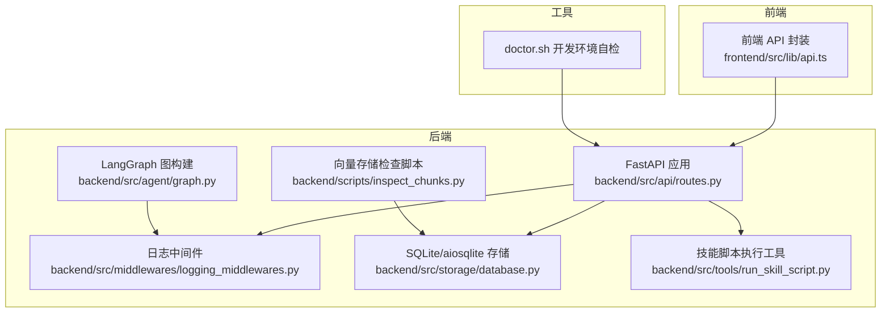
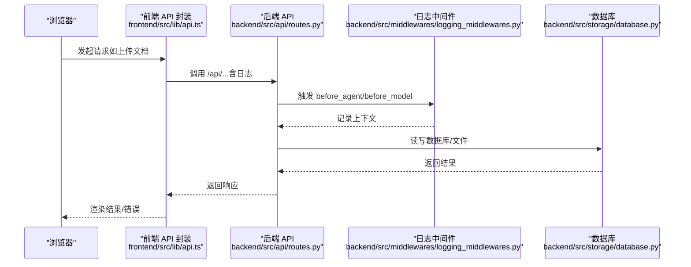
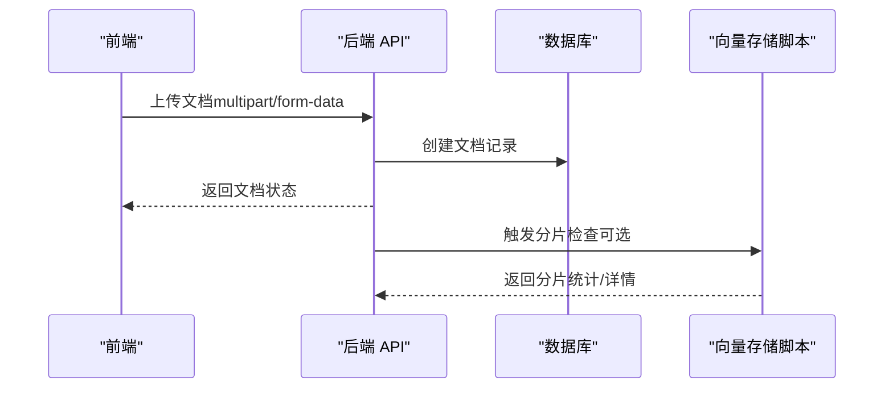

# 调试工具

<cite>
**本文引用的文件**
- [scripts/doctor.sh](file://scripts/doctor.sh)
- [docs/debug-guides.md](file://docs/debug-guides.md)
- [backend/pyproject.toml](file://backend/pyproject.toml)
- [backend/src/api/routes.py](file://backend/src/api/routes.py)
- [backend/src/middlewares/logging_middlewares.py](file://backend/src/middlewares/logging_middlewares.py)
- [backend/src/storage/database.py](file://backend/src/storage/database.py)
- [backend/src/tools/run_skill_script.py](file://backend/src/tools/run_skill_script.py)
- [backend/src/agent/graph.py](file://backend/src/agent/graph.py)
- [backend/scripts/inspect_chunks.py](file://backend/scripts/inspect_chunks.py)
- [frontend/package.json](file://frontend/package.json)
- [frontend/src/lib/api.ts](file://frontend/src/lib/api.ts)
</cite>

## 目录
1. [简介](#简介)
2. [项目结构](#项目结构)
3. [核心组件](#核心组件)
4. [架构总览](#架构总览)
5. [详细组件分析](#详细组件分析)
6. [依赖分析](#依赖分析)
7. [性能考虑](#性能考虑)
8. [故障排查指南](#故障排查指南)
9. [结论](#结论)
10. [附录](#附录)

## 简介
本指南面向 Train Agent 项目的开发与运维人员，系统性地介绍后端与前端的调试方法、内置诊断工具与脚本使用方式、数据库调试要点、API 调试流程，以及容器化环境下的日志与指标监控建议。目标是帮助你在本地或生产环境中快速定位问题、分析性能瓶颈，并形成可复现的排障记录。

## 项目结构
- 后端采用 FastAPI + LangGraph 架构，提供工作区、消息、文档、任务等 API，并通过中间件与日志记录关键链路。
- 前端基于 Next.js，封装统一的 API 请求与错误处理逻辑，便于在浏览器控制台与网络面板中进行调试。
- 顶层提供 doctor.sh 用于开发环境自检，确保工具链、配置文件与端口可用。
- 后端提供 inspect_chunks.py 用于检查向量库分片情况，辅助 RAG 查询与索引分析。

图表来源
- [frontend/src/lib/api.ts:1-196](file://frontend/src/lib/api.ts#L1-L196)
- [backend/src/api/routes.py:1-189](file://backend/src/api/routes.py#L1-L189)
- [backend/src/middlewares/logging_middlewares.py:1-59](file://backend/src/middlewares/logging_middlewares.py#L1-L59)
- [backend/src/storage/database.py:1-379](file://backend/src/storage/database.py#L1-L379)
- [backend/scripts/inspect_chunks.py:1-86](file://backend/scripts/inspect_chunks.py#L1-L86)
- [backend/src/tools/run_skill_script.py:1-143](file://backend/src/tools/run_skill_script.py#L1-L143)
- [backend/src/agent/graph.py:1-49](file://backend/src/agent/graph.py#L1-L49)
- [scripts/doctor.sh:1-99](file://scripts/doctor.sh#L1-L99)

章节来源
- [scripts/doctor.sh:1-99](file://scripts/doctor.sh#L1-L99)
- [docs/debug-guides.md:1-79](file://docs/debug-guides.md#L1-L79)
- [backend/src/api/routes.py:1-189](file://backend/src/api/routes.py#L1-L189)
- [frontend/src/lib/api.ts:1-196](file://frontend/src/lib/api.ts#L1-L196)

## 核心组件
- 后端 API 层：提供工作区、消息、文档、任务等接口，启动时初始化数据库，统一记录请求日志。
- 日志中间件：在 Agent 前置/后置与模型调用前后记录上下文信息，便于回溯链路。
- 数据库层：基于 aiosqlite 的异步 ORM 化封装，包含工作区、文档、任务、消息表及索引。
- 技能脚本工具：安全沙箱式执行技能目录下的脚本，支持多种语言解释器，具备超时与输出截断。
- 前端 API 封装：统一请求、错误处理与日志输出，便于在浏览器控制台与网络面板中定位问题。
- 诊断脚本：doctor.sh 自检工具链与端口占用；inspect_chunks.py 检查向量库分片与元数据。

章节来源
- [backend/src/api/routes.py:1-189](file://backend/src/api/routes.py#L1-L189)
- [backend/src/middlewares/logging_middlewares.py:1-59](file://backend/src/middlewares/logging_middlewares.py#L1-L59)
- [backend/src/storage/database.py:1-379](file://backend/src/storage/database.py#L1-L379)
- [backend/src/tools/run_skill_script.py:1-143](file://backend/src/tools/run_skill_script.py#L1-L143)
- [frontend/src/lib/api.ts:1-196](file://frontend/src/lib/api.ts#L1-L196)
- [scripts/doctor.sh:1-99](file://scripts/doctor.sh#L1-L99)
- [backend/scripts/inspect_chunks.py:1-86](file://backend/scripts/inspect_chunks.py#L1-L86)

## 架构总览
以下序列图展示了从前端到后端的关键调用链，以及日志中间件如何贯穿 Agent 执行周期。

图表来源
- [frontend/src/lib/api.ts:14-42](file://frontend/src/lib/api.ts#L14-L42)
- [backend/src/api/routes.py:30-35](file://backend/src/api/routes.py#L30-L35)
- [backend/src/middlewares/logging_middlewares.py:15-59](file://backend/src/middlewares/logging_middlewares.py#L15-L59)
- [backend/src/storage/database.py:14-24](file://backend/src/storage/database.py#L14-L24)

## 详细组件分析

### 后端 API 调试要点
- 启动日志：应用启动时初始化数据库，可在日志中确认数据库是否成功连接。
- 请求日志：每个路由均记录请求参数与返回状态，便于快速定位异常。
- CORS：跨域已放开，便于前端直连后端。
- 文件下载：静态资源挂载与下载接口可用于验证文件路径与权限。

章节来源
- [backend/src/api/routes.py:14-27](file://backend/src/api/routes.py#L14-L27)
- [backend/src/api/routes.py:30-35](file://backend/src/api/routes.py#L30-L35)
- [backend/src/api/routes.py:84-96](file://backend/src/api/routes.py#L84-L96)
- [backend/src/api/routes.py:163-174](file://backend/src/api/routes.py#L163-L174)

### 日志中间件与链路追踪
- 在 Agent 运行前后与模型调用前后记录工作区 ID、消息数量、工具调用等信息，有助于串联一次对话的完整轨迹。
- 建议结合后端日志与浏览器控制台输出，交叉验证前后端行为一致性。

章节来源
- [backend/src/middlewares/logging_middlewares.py:15-59](file://backend/src/middlewares/logging_middlewares.py#L15-L59)

### 数据库调试与索引优化
- 表结构：包含工作区、文档、任务、消息表，消息表带有复合索引以加速按线程检索。
- 迁移：自动迁移新增列，避免因版本升级导致的字段缺失。
- 查询建议：按线程 ID 降序分页查询消息时，注意 limit 边界与游标使用；对高频查询字段建立合适索引。
- 连接池：使用 aiosqlite 异步连接，避免阻塞；确保在高并发场景下合理设置超时与重试策略。

章节来源
- [backend/src/storage/database.py:25-78](file://backend/src/storage/database.py#L25-L78)
- [backend/src/storage/database.py:230-262](file://backend/src/storage/database.py#L230-L262)
- [backend/src/storage/database.py:73-75](file://backend/src/storage/database.py#L73-L75)

### 技能脚本执行工具
- 安全边界：仅允许执行指定技能目录下的脚本，防止路径穿越。
- 解释器映射：支持 bash、python、node、npx tsx。
- 输出截断与超时：防止超长输出污染上下文，超时后主动终止进程。
- 错误记录：失败时记录标准错误与命令，便于定位问题。

章节来源
- [backend/src/tools/run_skill_script.py:20-26](file://backend/src/tools/run_skill_script.py#L20-L26)
- [backend/src/tools/run_skill_script.py:60-82](file://backend/src/tools/run_skill_script.py#L60-L82)
- [backend/src/tools/run_skill_script.py:93-115](file://backend/src/tools/run_skill_script.py#L93-L115)
- [backend/src/tools/run_skill_script.py:124-134](file://backend/src/tools/run_skill_script.py#L124-L134)

### 前端 API 调试要点
- 统一请求封装：集中处理 Content-Type、错误响应与日志输出，便于在浏览器控制台快速定位失败请求。
- 错误类型：定义 ApiError 类型，包含状态码与详情，便于前端统一处理。
- 上传流程：上传接口使用 FormData，日志中包含文件名与大小，便于核对后端接收与后台任务触发。

章节来源
- [frontend/src/lib/api.ts:15-42](file://frontend/src/lib/api.ts#L15-L42)
- [frontend/src/lib/api.ts:3-13](file://frontend/src/lib/api.ts#L3-L13)
- [frontend/src/lib/api.ts:146-164](file://frontend/src/lib/api.ts#L146-L164)

### 诊断脚本与内置工具
- doctor.sh：检查工具链（uv、node、pnpm/npm）、项目文件存在性、环境变量、后端环境文件、前端 node_modules、端口占用等，适合启动前自检。
- inspect_chunks.py：检查向量库集合中的分片总数与元数据，支持概览与详情两种模式，便于排查 RAG 索引问题。

章节来源
- [scripts/doctor.sh:20-28](file://scripts/doctor.sh#L20-L28)
- [scripts/doctor.sh:44-52](file://scripts/doctor.sh#L44-L52)
- [scripts/doctor.sh:68-72](file://scripts/doctor.sh#L68-L72)
- [scripts/doctor.sh:75-80](file://scripts/doctor.sh#L75-L80)
- [scripts/doctor.sh:84-90](file://scripts/doctor.sh#L84-L90)
- [backend/scripts/inspect_chunks.py:20-37](file://backend/scripts/inspect_chunks.py#L20-L37)
- [backend/scripts/inspect_chunks.py:53-60](file://backend/scripts/inspect_chunks.py#L53-L60)
- [backend/scripts/inspect_chunks.py:62-82](file://backend/scripts/inspect_chunks.py#L62-L82)

## 依赖分析
- 后端依赖：FastAPI、Uvicorn、LangChain/LangGraph、ChromaDB、aiosqlite、httpx、dotenv、PyYAML 等。
- 前端依赖：Next.js、React、@langchain/* 生态、assistant-ui 等。
- 测试与开发：pytest、ruff 等。

章节来源
- [backend/pyproject.toml:6-26](file://backend/pyproject.toml#L6-L26)
- [frontend/package.json:11-26](file://frontend/package.json#L11-L26)
- [backend/pyproject.toml:28-33](file://backend/pyproject.toml#L28-L33)

## 性能考虑
- 异步 I/O：数据库与文件操作采用异步，减少阻塞；注意在高并发场景下设置合理的超时与限流。
- 日志开销：中间件日志包含工具调用与消息计数，建议在生产环境根据需要调整日志级别。
- 向量化查询：inspect_chunks.py 可用于评估分片规模与元数据完整性，避免过多小分片导致查询放大。
- 前端渲染：大列表分页加载与懒加载策略，减少首屏压力。

[本节为通用指导，不直接分析特定文件]

## 故障排查指南

### 通用排查步骤
- 使用 doctor.sh 快速检查工具链、配置文件与端口占用，确保开发环境满足要求。
- 查看后端日志与前端控制台输出，确认请求是否到达后端、后端是否抛出异常。
- 对照文档中的“问题定位指南”，将截图与日志片段归档至 debug 目录对应工作区。

章节来源
- [scripts/doctor.sh:18-28](file://scripts/doctor.sh#L18-L28)
- [docs/debug-guides.md:3-24](file://docs/debug-guides.md#L3-L24)

### 前端问题定位（浏览器与 React DevTools）
- 使用浏览器开发者工具观察网络面板，确认请求 URL、请求体与响应状态。
- 注入 fetch 拦截器记录请求 URL、Body 与状态，便于复现问题。
- 结合前端 API 封装中的日志输出，定位错误类型与错误详情。

章节来源
- [docs/debug-guides.md:26-68](file://docs/debug-guides.md#L26-L68)
- [frontend/src/lib/api.ts:19-41](file://frontend/src/lib/api.ts#L19-L41)

### 后端问题定位（断点调试、日志、中间件）
- 断点调试：在 FastAPI 路由与工具函数中设置断点，观察入参与返回值。
- 日志分析：关注启动日志、请求日志与中间件日志，定位 Agent 前后与模型调用阶段的异常。
- 中间件：利用 before_agent/before_model/after_model 等钩子，补充关键上下文信息。

章节来源
- [backend/src/api/routes.py:14-19](file://backend/src/api/routes.py#L14-L19)
- [backend/src/middlewares/logging_middlewares.py:15-59](file://backend/src/middlewares/logging_middlewares.py#L15-L59)

### 数据库问题定位（查询、索引、迁移）
- 表结构与索引：确认消息表的复合索引是否命中查询条件，避免全表扫描。
- 迁移：若字段缺失，检查迁移逻辑是否执行成功。
- 连接池：在高并发下观察连接状态与超时，必要时增加超时与重试。

章节来源
- [backend/src/storage/database.py:25-78](file://backend/src/storage/database.py#L25-L78)
- [backend/src/storage/database.py:230-262](file://backend/src/storage/database.py#L230-L262)

### API 调试（请求/响应、错误追踪、性能瓶颈）
- 绕过前端验证后端：使用 curl 直接调用 LangGraph 相关接口，判断问题出现在前端还是后端。
- 错误追踪：结合前端 ApiError 与后端 HTTP 异常，定位具体错误来源。
- 性能瓶颈：关注消息分页查询、文档处理后台任务与向量库查询耗时。

章节来源
- [docs/debug-guides.md:70-79](file://docs/debug-guides.md#L70-L79)
- [frontend/src/lib/api.ts:3-13](file://frontend/src/lib/api.ts#L3-L13)
- [backend/src/api/routes.py:118-128](file://backend/src/api/routes.py#L118-L128)

### 容器化环境调试（日志、指标、追踪）
- 日志聚合：将后端、前端与 LangGraph 的日志输出到标准输出，配合容器编排收集。
- 指标监控：在 API 层增加请求耗时、错误率等指标埋点，结合外部监控系统。
- 分布式追踪：在请求链路中注入 trace_id，串联前端、后端与外部服务调用。

[本节为通用指导，不直接分析特定文件]

### 常见问题与快速修复
- 端口冲突：doctor.sh 会提示端口占用，释放或修改端口后重试。
- 缺少依赖：doctor.sh 提示缺少 pnpm/npm 或 node_modules，安装后重试。
- 环境变量：未设置 DASHSCOPE_API_KEY 等，按提示在 shell 或 .env 中补齐。
- 向量库为空：inspect_chunks.py 显示分片数为 0，检查文档处理与索引流程。

章节来源
- [scripts/doctor.sh:84-90](file://scripts/doctor.sh#L84-L90)
- [scripts/doctor.sh:34-41](file://scripts/doctor.sh#L34-L41)
- [scripts/doctor.sh:68-72](file://scripts/doctor.sh#L68-L72)
- [backend/scripts/inspect_chunks.py:30-45](file://backend/scripts/inspect_chunks.py#L30-L45)

## 结论
通过 doctor.sh 的环境自检、前端统一 API 封装的日志输出、后端中间件与数据库的可观测性，以及向量库分片检查脚本，可以形成一套覆盖全栈的调试闭环。建议在日常开发中养成“先自检、再抓日志、后断点”的习惯，并将问题产物归档至 debug 目录，以便复盘与回归。

[本节为总结性内容，不直接分析特定文件]

## 附录

### API 调用流程（序列图）

图表来源
- [frontend/src/lib/api.ts:146-164](file://frontend/src/lib/api.ts#L146-L164)
- [backend/src/api/routes.py:112-128](file://backend/src/api/routes.py#L112-L128)
- [backend/scripts/inspect_chunks.py:20-37](file://backend/scripts/inspect_chunks.py#L20-L37)