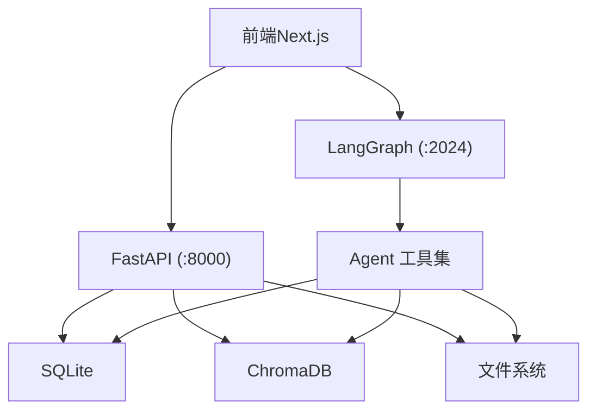
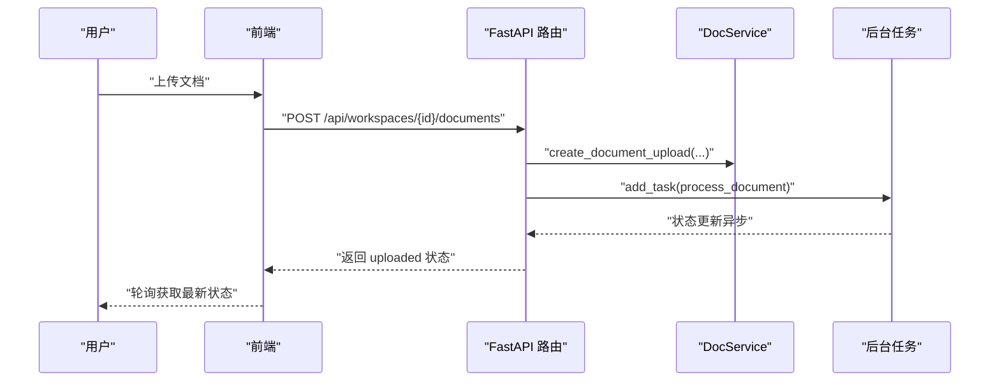
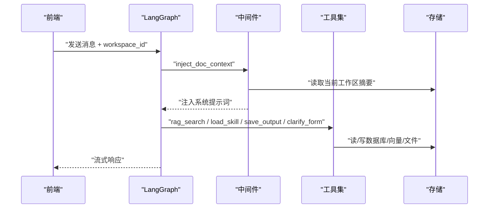
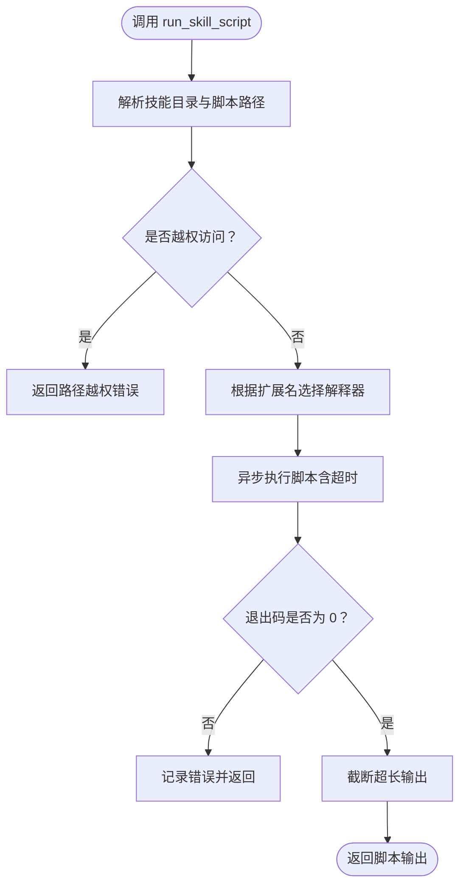
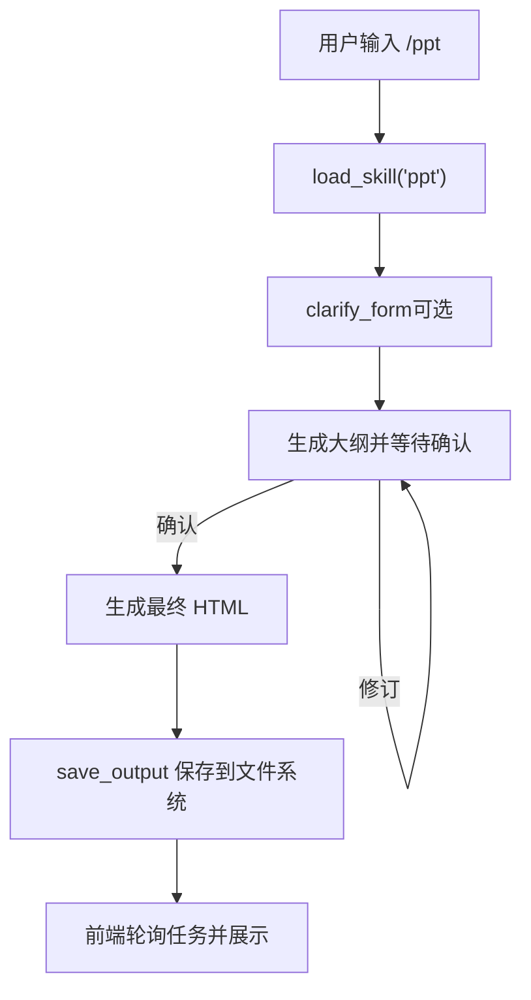
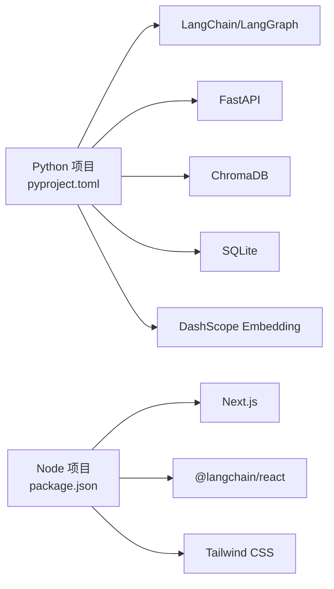

# 贡献指南

<cite>
**本文引用的文件**
- [README.md](file://README.md)
- [AGENTS.md](file://AGENTS.md)
- [docs/backend-architecture.md](file://docs/backend-architecture.md)
- [docs/debug-guides.md](file://docs/debug-guides.md)
- [backend/pyproject.toml](file://backend/pyproject.toml)
- [backend/src/api/routes.py](file://backend/src/api/routes.py)
- [backend/src/agent/graph.py](file://backend/src/agent/graph.py)
- [backend/src/tools/run_skill_script.py](file://backend/src/tools/run_skill_script.py)
- [backend/skills/ppt/SKILL.md](file://backend/skills/ppt/SKILL.md)
- [scripts/start.sh](file://scripts/start.sh)
- [frontend/package.json](file://frontend/package.json)
- [frontend/README.md](file://frontend/README.md)
- [TODO.md](file://TODO.md)
- [user-story/04-ppt-command.md](file://user-story/04-ppt-command.md)
</cite>

## 目录
1. [简介](#简介)
2. [项目结构](#项目结构)
3. [核心组件](#核心组件)
4. [架构总览](#架构总览)
5. [详细组件分析](#详细组件分析)
6. [依赖分析](#依赖分析)
7. [性能考虑](#性能考虑)
8. [故障排查指南](#故障排查指南)
9. [结论](#结论)
10. [附录](#附录)

## 简介
本指南面向希望参与 Train Agent 项目的开源贡献者，涵盖从 Fork 项目到提交 PR 的完整流程，以及代码质量、测试、文档与 Issue 管理的要求。同时提供新贡献者的入门建议、社区行为准则与沟通规范，并说明贡献者认可机制与角色权限。

## 项目结构
Train Agent 采用前后端分离与双进程架构：后端由 FastAPI（REST API）与 LangGraph（Agent 运行时）组成，前端为 Next.js 应用。项目还包含文档、计划与用户故事等辅助材料。

```mermaid
graph TB
subgraph "前端Next.js :3000"
FE_App["应用页面<br/>chat/panel/task/workspace"]
FE_API["REST 客户端<br/>api.ts"]
end
subgraph "后端Python"
API["FastAPI 服务 (:8000)<br/>routes.py"]
LG["LangGraph 服务 (:2024)<br/>graph.py"]
DB["SQLite 数据库"]
VDB["ChromaDB 向量库"]
FS["文件存储"]
end
subgraph "技能与工具"
SK["技能目录<br/>skills/ppt/"]
TOOLS["Agent 工具<br/>rag_search/load_skill/save_output/..."]
end
FE_App --> FE_API
FE_API --> API
FE_App --> LG
API <- --> DB
API <- --> VDB
API <- --> FS
LG --> TOOLS
TOOLS --> DB
TOOLS --> VDB
TOOLS --> FS
SK --> LG
```

图表来源
- [docs/backend-architecture.md:18-44](file://docs/backend-architecture.md#L18-L44)
- [backend/src/api/routes.py:14-27](file://backend/src/api/routes.py#L14-L27)
- [backend/src/agent/graph.py:16-37](file://backend/src/agent/graph.py#L16-L37)

章节来源
- [README.md:24-40](file://README.md#L24-L40)
- [docs/backend-architecture.md:65-117](file://docs/backend-architecture.md#L65-L117)

## 核心组件
- 后端 API 层：提供工作区、文档、任务与文件下载的 REST 接口，负责数据持久化与异步任务编排。
- Agent 层：基于 LangGraph 的 ReAct Agent，注册工具与中间件，实现 RAG、技能加载与产出保存。
- 服务层：文档处理流水线（解析→分块→索引→摘要），贯穿存储层。
- 存储层：SQLite、ChromaDB、文件系统，按 workspace_id 隔离。
- 技能与工具：技能以渐进式披露方式加载，工具围绕 RAG、表单澄清、脚本执行与产出保存。

章节来源
- [docs/backend-architecture.md:137-286](file://docs/backend-architecture.md#L137-L286)
- [backend/src/api/routes.py:40-188](file://backend/src/api/routes.py#L40-L188)
- [backend/src/agent/graph.py:16-48](file://backend/src/agent/graph.py#L16-L48)

## 架构总览
双进程架构与分层设计确保职责清晰、边界明确。前端通过 REST 与流式 API 与后端交互，Agent 在 LangGraph 进程中执行推理与工具调用。



图表来源
- [docs/backend-architecture.md:11-16](file://docs/backend-architecture.md#L11-L16)
- [docs/backend-architecture.md:137-178](file://docs/backend-architecture.md#L137-L178)

## 详细组件分析

### API 路由与数据流
- 工作区：创建、查询、绑定 thread_id、删除（级联清理）。
- 文档：上传（异步后台处理）、列表、删除（清理向量与文件）。
- 任务：列出、删除。
- 文件：通用下载接口，支持输出文件与原始文档。
- 静态资源：PPT 资产与模板挂载。



图表来源
- [backend/src/api/routes.py:112-128](file://backend/src/api/routes.py#L112-L128)
- [docs/backend-architecture.md:295-329](file://docs/backend-architecture.md#L295-L329)

章节来源
- [backend/src/api/routes.py:37-188](file://backend/src/api/routes.py#L37-L188)
- [docs/backend-architecture.md:137-178](file://docs/backend-architecture.md#L137-L178)

### Agent 图与工具调用
- Agent 使用 ChatOpenAI，开启流式与思考开关。
- 注册工具：RAG 检索、技能加载、产出保存、表单澄清、终端工具。
- 中间件：动态注入文档摘要、修复工具调用 ID。
- 状态：包含 workspace_id，贯穿调用链实现工作区隔离。



图表来源
- [backend/src/agent/graph.py:16-37](file://backend/src/agent/graph.py#L16-L37)
- [docs/backend-architecture.md:181-246](file://docs/backend-architecture.md#L181-L246)

章节来源
- [backend/src/agent/graph.py:16-48](file://backend/src/agent/graph.py#L16-L48)
- [docs/backend-architecture.md:181-246](file://docs/backend-architecture.md#L181-L246)

### 技能与脚本执行
- 技能以渐进式披露加载，支持按需加载参考文件与脚本。
- run_skill_script 工具限制脚本执行范围，支持多种脚本类型，具备超时与输出截断保护。



图表来源
- [backend/src/tools/run_skill_script.py:31-142](file://backend/src/tools/run_skill_script.py#L31-L142)

章节来源
- [backend/src/tools/run_skill_script.py:1-143](file://backend/src/tools/run_skill_script.py#L1-L143)
- [backend/skills/ppt/SKILL.md:1-269](file://backend/skills/ppt/SKILL.md#L1-L269)

### PPT 技能工作流
- 通过斜杠命令触发，先进行内容发现与风格选择，再确认大纲，最后生成单文件 HTML 并保存到任务面板。
- 严格遵循视口适配与内容密度限制，强调一次性交付最终产物。



图表来源
- [backend/skills/ppt/SKILL.md:66-259](file://backend/skills/ppt/SKILL.md#L66-L259)
- [docs/backend-architecture.md:414-427](file://docs/backend-architecture.md#L414-L427)

章节来源
- [backend/skills/ppt/SKILL.md:1-269](file://backend/skills/ppt/SKILL.md#L1-L269)
- [user-story/04-ppt-command.md:1-36](file://user-story/04-ppt-command.md#L1-L36)

## 依赖分析
- 后端依赖：LangChain/LangGraph、FastAPI、ChromaDB、SQLite、DashScope Embedding、PyMuPDF/python-docx 等。
- 前端依赖：Next.js、@langchain/react、Tailwind CSS、Assistant UI 等。
- 包管理：后端使用 uv + hatchling，前端使用 pnpm。



图表来源
- [backend/pyproject.toml:1-41](file://backend/pyproject.toml#L1-L41)
- [frontend/package.json:1-39](file://frontend/package.json#L1-L39)

章节来源
- [backend/pyproject.toml:1-41](file://backend/pyproject.toml#L1-L41)
- [frontend/package.json:1-39](file://frontend/package.json#L1-L39)

## 性能考虑
- 异步文档处理：上传立即返回，后台完成解析、分块、索引与摘要，降低前端等待时间。
- 向量检索：ChromaDB 按 workspace_id 隔离 collection，提升检索效率与安全性。
- Agent 中间件：动态注入摘要，避免重复传递大段上下文。
- 前端构建与运行：使用现代包管理器与构建工具，保证开发体验与生产性能。

章节来源
- [docs/backend-architecture.md:295-331](file://docs/backend-architecture.md#L295-L331)
- [docs/backend-architecture.md:351-365](file://docs/backend-architecture.md#L351-L365)

## 故障排查指南
- 日志：服务重启后日志清空，建议在 debug 目录按 workspace_id 归档截图与日志片段。
- 前端调试：可使用 browser-use 观察 DOM 与网络请求，注入 fetch 拦截器记录实际请求。
- 后端验证：绕过前端直接调用 LangGraph resume 接口，判断问题所在。

章节来源
- [docs/debug-guides.md:1-79](file://docs/debug-guides.md#L1-L79)

## 结论
本指南提供了从开发环境搭建、贡献流程、代码与文档质量要求，到 Issue 管理与社区协作的完整实践路径。建议贡献者在提交变更前，充分阅读相关架构与调试文档，确保改动符合项目设计原则与安全约束。

## 附录

### 贡献流程（Fork → 分支 → 提交 → PR）
- Fork 仓库到个人账号。
- 创建功能分支（建议以 issue 编号命名，如 feature/issue-xxx）。
- 遵循代码与文档规范，提交前运行本地验证脚本与测试。
- 提交 PR，填写模板化的变更说明与影响评估。

章节来源
- [README.md:62-125](file://README.md#L62-L125)

### 代码质量与测试
- 后端：使用 pytest 与 ruff，确保测试覆盖率与代码风格一致。
- 前端：使用 ESLint、构建与打包检查。
- 提交流程中应包含本地健康检查与最小可验证场景。

章节来源
- [backend/pyproject.toml:28-33](file://backend/pyproject.toml#L28-L33)
- [frontend/package.json:5-10](file://frontend/package.json#L5-L10)
- [scripts/start.sh:1-129](file://scripts/start.sh#L1-L129)

### 文档贡献
- 技术文档：后端架构、调试指南、用户故事与计划文档。
- 用户手册：结合用户故事与技能说明，完善使用流程与最佳实践。
- API 文档：随接口变更同步更新，保持与实现一致。

章节来源
- [docs/backend-architecture.md:1-465](file://docs/backend-architecture.md#L1-L465)
- [docs/debug-guides.md:1-79](file://docs/debug-guides.md#L1-L79)
- [user-story/04-ppt-command.md:1-36](file://user-story/04-ppt-command.md#L1-L36)

### Issue 跟踪与管理
- Bug 报告：包含环境信息、复现步骤、期望与实际结果、日志与截图。
- 功能请求：描述背景、场景、验收标准与优先级。
- 标签使用：按类型（bug/feature/enhancement）、优先级（P0/P1/P2）、模块（backend/frontend/skills）分类。

章节来源
- [TODO.md:1-10](file://TODO.md#L1-L10)
- [user-story/04-ppt-command.md:24-36](file://user-story/04-ppt-command.md#L24-L36)

### 社区行为准则与沟通规范
- 基于项目核心准则：简单、稳定、好用。
- 修改范围小而精确，避免破坏性变更；变更需向后兼容或明确标注。
- 遵守安全规则：不提交敏感信息，不暴露运行时数据与密钥。

章节来源
- [AGENTS.md:7-13](file://AGENTS.md#L7-L13)
- [AGENTS.md:72-80](file://AGENTS.md#L72-L80)

### 新贡献者入门
- 开发环境：复制 .env 示例文件，安装依赖，使用提供的启动脚本。
- 第一次贡献建议：从最小可验证修复入手，阅读相关模块文档与测试用例。
- 导师制度：建议通过 Issue 或讨论区寻找维护者指导。

章节来源
- [README.md:41-125](file://README.md#L41-L125)
- [frontend/README.md:1-37](file://frontend/README.md#L1-L37)

### 贡献者认可与角色权限
- 贡献者认可：PR 被合并即计入贡献；重大贡献可列入致谢。
- 角色权限：默认为维护者与审阅者权限；对核心模块有特殊贡献者可申请相应权限。

章节来源
- [AGENTS.md:1-123](file://AGENTS.md#L1-L123)