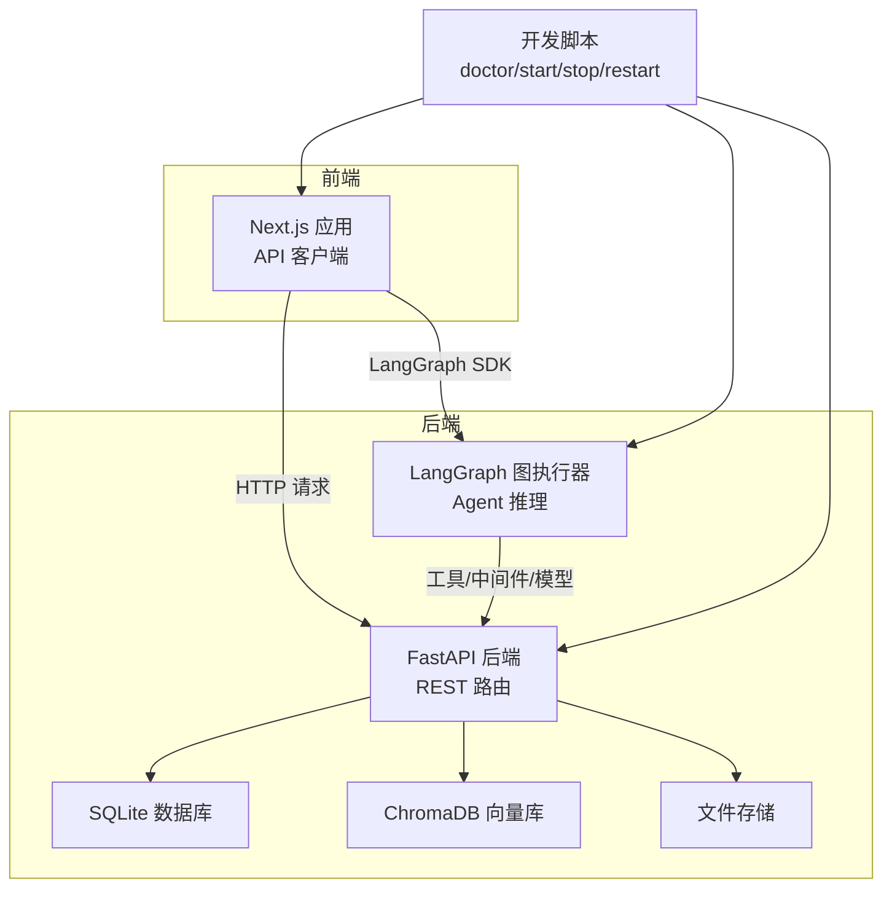
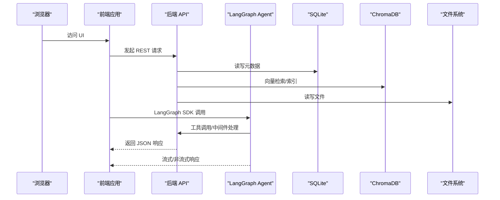
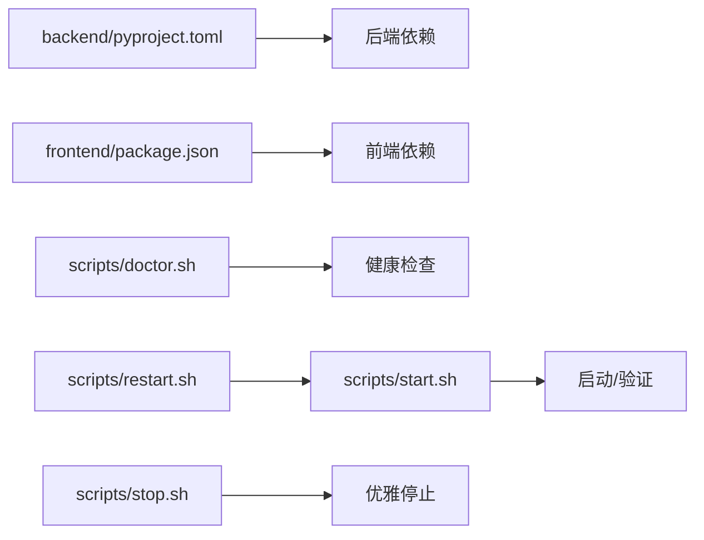

# 故障排除与常见问题

<cite>
**本文档引用的文件**
- [README.md](file://README.md)
- [doctor.sh](file://scripts/doctor.sh)
- [start.sh](file://scripts/start.sh)
- [stop.sh](file://scripts/stop.sh)
- [restart.sh](file://scripts/restart.sh)
- [pyproject.toml](file://backend/pyproject.toml)
- [package.json](file://frontend/package.json)
- [routes.py](file://backend/src/api/routes.py)
- [graph.py](file://backend/src/agent/graph.py)
- [database.py](file://backend/src/storage/database.py)
- [logging_middlewares.py](file://backend/src/middlewares/logging_middlewares.py)
- [api.ts](file://frontend/src/lib/api.ts)
- [layout.tsx](file://frontend/src/app/layout.tsx)
- [langgraph.json](file://backend/langgraph.json)
- [debug-guides.md](file://docs/debug-guides.md)
- [TODO.md](file://TODO.md)
</cite>

## 目录
1. [简介](#简介)
2. [项目结构](#项目结构)
3. [核心组件](#核心组件)
4. [架构总览](#架构总览)
5. [详细组件分析](#详细组件分析)
6. [依赖关系分析](#依赖关系分析)
7. [性能考虑](#性能考虑)
8. [故障排除指南](#故障排除指南)
9. [结论](#结论)
10. [附录](#附录)

## 简介
本指南面向开发与运维人员，系统性梳理 Train Agent 在本地开发与运行过程中的常见问题与解决方案，覆盖环境配置、依赖冲突、端口占用、权限问题、后端服务异常、前端页面加载失败、Agent 推理错误、数据库连接问题、网络连通性与资源监控等。同时提供日志分析方法、错误追踪技巧、性能瓶颈识别路径，并给出紧急恢复操作与预防措施。

## 项目结构
- 后端采用 FastAPI + LangGraph 架构，提供 REST API、向量检索与技能执行能力。
- 前端基于 Next.js，通过 API 客户端与后端交互，渲染工作区、文档、任务与聊天面板。
- 开发脚本负责健康检查、启动/停止/重启服务与日志输出，便于快速定位问题。

图表来源
- [routes.py:1-189](file://backend/src/api/routes.py#L1-L189)
- [graph.py:1-49](file://backend/src/agent/graph.py#L1-L49)
- [api.ts:1-196](file://frontend/src/lib/api.ts#L1-L196)
- [start.sh:1-128](file://scripts/start.sh#L1-L128)

章节来源
- [README.md:1-133](file://README.md#L1-L133)
- [start.sh:1-128](file://scripts/start.sh#L1-L128)

## 核心组件
- 后端 API：负责工作区、文档、任务与文件下载接口，启动时初始化数据库。
- LangGraph Agent：封装模型、工具与中间件，驱动推理与技能执行。
- 存储层：SQLite 管理元数据，ChromaDB 管理向量索引，文件系统保存源文件与产出。
- 前端 API 客户端：统一封装请求与错误处理，暴露工作区/文档/任务/消息相关接口。
- 中间件与日志：记录 Agent 生命周期与模型调用轨迹，辅助问题定位。

章节来源
- [routes.py:1-189](file://backend/src/api/routes.py#L1-L189)
- [graph.py:1-49](file://backend/src/agent/graph.py#L1-L49)
- [database.py:1-379](file://backend/src/storage/database.py#L1-L379)
- [logging_middlewares.py:1-59](file://backend/src/middlewares/logging_middlewares.py#L1-L59)
- [api.ts:1-196](file://frontend/src/lib/api.ts#L1-L196)

## 架构总览
下图展示从浏览器到后端、LangGraph 与存储的完整链路，以及开发脚本对各组件的生命周期管理。

图表来源
- [routes.py:1-189](file://backend/src/api/routes.py#L1-L189)
- [graph.py:1-49](file://backend/src/agent/graph.py#L1-L49)
- [api.ts:1-196](file://frontend/src/lib/api.ts#L1-L196)
- [start.sh:1-128](file://scripts/start.sh#L1-L128)

## 详细组件分析

### 后端 API（FastAPI）常见故障与修复
- 症状：启动即退出或无法访问端口 8000
  - 可能原因：缺少依赖、端口被占用、环境变量未设置
  - 处理步骤：
    - 运行健康检查脚本，确认工具链与端口可用
    - 检查后端依赖安装与 Python 版本要求
    - 清理占用端口进程或修改监听地址
- 症状：上传文档后无进度或报错
  - 可能原因：文件类型解析失败、向量化/索引异常、数据库写入失败
  - 处理步骤：
    - 查看后端日志与数据库迁移记录
    - 确认向量库与文件存储目录存在且可写
- 症状：消息列表为空或分页异常
  - 可能原因：索引缺失、查询参数越界
  - 处理步骤：
    - 检查消息表索引是否存在
    - 限制分页参数范围，避免过大 limit

章节来源
- [routes.py:1-189](file://backend/src/api/routes.py#L1-L189)
- [database.py:1-379](file://backend/src/storage/database.py#L1-L379)
- [doctor.sh:1-99](file://scripts/doctor.sh#L1-L99)
- [start.sh:1-128](file://scripts/start.sh#L1-L128)

### LangGraph Agent 常见故障与修复
- 症状：LangGraph 无法启动或无响应
  - 可能原因：端口占用、Python 版本不匹配、环境变量缺失
  - 处理步骤：
    - 使用健康检查脚本确认端口 2024 状态
    - 按脚本提示切换 Node.js 版本以适配包管理器
    - 确认模型与 API 密钥环境变量正确
- 症状：推理卡住或工具调用失败
  - 可能原因：中间件异常、模型回调未注册、工具未正确注册
  - 处理步骤：
    - 检查中间件顺序与回调注册
    - 确认工具工厂函数返回有效工具集合
    - 查看模型调用前后日志，定位具体工具名称

章节来源
- [graph.py:1-49](file://backend/src/agent/graph.py#L1-L49)
- [logging_middlewares.py:1-59](file://backend/src/middlewares/logging_middlewares.py#L1-L59)
- [start.sh:1-128](file://scripts/start.sh#L1-L128)

### 前端页面与 API 客户端常见故障与修复
- 症状：页面空白或白屏
  - 可能原因：静态资源未构建、跨域未配置、API 基础地址错误
  - 处理步骤：
    - 确认前端依赖安装与构建成功
    - 检查 NEXT_PUBLIC_API_BASE 与 NEXT_PUBLIC_LANGGRAPH_API_URL
    - 关闭 CORS 限制仅用于本地调试
- 症状：上传/消息/任务接口报错
  - 可能原因：HTTP 状态码非 2xx、后端抛出异常、前端未捕获错误
  - 处理步骤：
    - 使用浏览器网络面板查看请求与响应体
    - 捕获并打印 ApiError 的状态与 detail 字段
    - 对照后端路由定义核对路径与参数

章节来源
- [api.ts:1-196](file://frontend/src/lib/api.ts#L1-L196)
- [layout.tsx:1-34](file://frontend/src/app/layout.tsx#L1-L34)
- [routes.py:1-189](file://backend/src/api/routes.py#L1-L189)

### 存储与数据一致性常见故障与修复
- 症状：工作区/文档/任务查询异常
  - 可能原因：表结构未迁移、外键约束导致删除失败
  - 处理步骤：
    - 触发数据库初始化与迁移逻辑
    - 检查外键开关与事务提交
- 症状：消息重复或冲突
  - 可能原因：冲突更新策略不当
  - 处理步骤：
    - 使用 ON CONFLICT 更新策略合并消息
    - 校验唯一键组合是否正确

章节来源
- [database.py:1-379](file://backend/src/storage/database.py#L1-L379)

### 中间件与日志记录常见故障与修复
- 症状：日志缺失或不完整
  - 可能原因：日志级别过滤、异步写入未落盘
  - 处理步骤：
    - 提升日志级别或临时调整格式
    - 在关键节点增加自定义日志
- 症状：Agent 生命周期日志不显示
  - 可能原因：回调未注册、中间件顺序错误
  - 处理步骤：
    - 确认回调已加入模型 callbacks 列表
    - 检查中间件注册顺序与命名空间

章节来源
- [logging_middlewares.py:1-59](file://backend/src/middlewares/logging_middlewares.py#L1-L59)
- [graph.py:1-49](file://backend/src/agent/graph.py#L1-L49)

## 依赖关系分析
- 后端依赖：LangChain/LangGraph、FastAPI/Uvicorn、ChromaDB、aiosqlite、DashScope/OpenAI SDK 等。
- 前端依赖：Next.js、@langchain/*、@assistant-ui/*、React 生态等。
- 开发脚本：doctor 检查工具链与端口；start 启动三端并验证；stop/graceful 停止；restart 组合操作。

图表来源
- [pyproject.toml:1-41](file://backend/pyproject.toml#L1-L41)
- [package.json:1-39](file://frontend/package.json#L1-L39)
- [doctor.sh:1-99](file://scripts/doctor.sh#L1-L99)
- [start.sh:1-128](file://scripts/start.sh#L1-L128)
- [stop.sh:1-40](file://scripts/stop.sh#L1-L40)

章节来源
- [pyproject.toml:1-41](file://backend/pyproject.toml#L1-L41)
- [package.json:1-39](file://frontend/package.json#L1-L39)
- [doctor.sh:1-99](file://scripts/doctor.sh#L1-L99)
- [start.sh:1-128](file://scripts/start.sh#L1-L128)
- [stop.sh:1-40](file://scripts/stop.sh#L1-L40)

## 性能考虑
- 日志滚动与持久化：当前日志为当次启动日志，建议在生产环境引入日志轮转与集中收集。
- 上下文压缩：中间件具备按 token 数阈值与消息数阈值的压缩策略，避免上下文过长影响延迟与成本。
- 并发与后台任务：文档处理使用后台任务，需确保队列与资源充足。
- 端口与进程：多端口并发运行时注意 CPU/内存占用峰值，必要时拆分部署。

章节来源
- [debug-guides.md:1-79](file://docs/debug-guides.md#L1-L79)
- [logging_middlewares.py:1-59](file://backend/src/middlewares/logging_middlewares.py#L1-L59)

## 故障排除指南

### 环境与依赖问题
- 症状：命令找不到或版本不兼容
  - 处理：运行健康检查脚本，确认 uv、node、pnpm/npm 可用；根据提示安装缺失工具。
- 症状：LLM/Embedding 无法调用
  - 处理：检查 DASHSCOPE_API_KEY、OPENAI_API_BASE、LLM_MODEL、EMBEDDING_MODEL 等环境变量是否正确设置。

章节来源
- [doctor.sh:1-99](file://scripts/doctor.sh#L1-L99)
- [README.md:40-61](file://README.md#L40-L61)

### 端口占用与服务状态
- 症状：端口被占用导致启动失败
  - 处理：使用健康检查脚本查看端口占用；使用停止脚本清理残留进程；更换端口或释放占用。
- 症状：部分服务启动后立即退出
  - 处理：查看对应 PID 文件与日志尾部，定位错误堆栈；确认依赖安装与配置文件存在。

章节来源
- [doctor.sh:83-90](file://scripts/doctor.sh#L83-L90)
- [start.sh:85-127](file://scripts/start.sh#L85-L127)
- [stop.sh:15-39](file://scripts/stop.sh#L15-L39)

### 权限与数据目录
- 症状：向量库或文件存储写入失败
  - 处理：确认 DATA_DIR 或默认 backend/data 目录存在且具备写权限；检查 ChromaDB 与 SQLite 文件权限。

章节来源
- [README.md:126-132](file://README.md#L126-L132)
- [database.py:1-379](file://backend/src/storage/database.py#L1-L379)

### 后端服务异常
- 症状：API 报 404/409/5xx
  - 处理：对照路由定义检查路径与参数；关注数据库约束与异常分支；查看日志定位具体异常。
- 症状：数据库初始化失败
  - 处理：确认数据库文件可写；检查迁移逻辑与外键开关；重试初始化。

章节来源
- [routes.py:1-189](file://backend/src/api/routes.py#L1-L189)
- [database.py:1-379](file://backend/src/storage/database.py#L1-L379)

### 前端页面加载失败
- 症状：页面空白或样式缺失
  - 处理：确认前端依赖安装与构建；检查静态资源挂载与跨域配置；核对 API 基础地址。
- 症状：网络请求失败
  - 处理：使用浏览器开发者工具查看请求与响应；捕获并记录 ApiError 的状态与 detail。

章节来源
- [api.ts:1-196](file://frontend/src/lib/api.ts#L1-L196)
- [layout.tsx:1-34](file://frontend/src/app/layout.tsx#L1-L34)

### Agent 推理错误
- 症状：推理无响应或卡死
  - 处理：检查 LangGraph 端口与服务状态；查看模型调用前后日志；确认工具注册与回调链完整。
- 症状：工具调用失败
  - 处理：核对工具工厂函数返回值；检查工具入参与返回格式；查看工具内部异常日志。

章节来源
- [graph.py:1-49](file://backend/src/agent/graph.py#L1-L49)
- [logging_middlewares.py:1-59](file://backend/src/middlewares/logging_middlewares.py#L1-L59)

### 数据库连接问题
- 症状：查询超时或连接失败
  - 处理：确认数据库文件存在且可读写；检查连接池与并发；优化查询索引与分页参数。
- 症状：迁移失败或字段缺失
  - 处理：执行迁移逻辑；确认外键与列存在性；回滚并重试。

章节来源
- [database.py:1-379](file://backend/src/storage/database.py#L1-L379)

### 文档上传失败
- 症状：上传成功但状态停留在 processing/parsing/chunking/indexing
  - 处理：查看后台任务日志；确认解析器支持的文件类型；检查向量库与文件存储可用性。
- 症状：上传后无文件或无法下载
  - 处理：确认存储路径与静态资源挂载；检查下载接口与文件存在性。

章节来源
- [routes.py:112-128](file://backend/src/api/routes.py#L112-L128)
- [debug-guides.md:70-79](file://docs/debug-guides.md#L70-L79)

### 问答无响应
- 症状：前端发送消息后无响应
  - 处理：使用浏览器网络拦截器观察 fetch 请求；绕过前端直连 LangGraph 验证后端通断；核对线程 ID 与工作区上下文。

章节来源
- [debug-guides.md:46-78](file://docs/debug-guides.md#L46-L78)
- [api.ts:1-196](file://frontend/src/lib/api.ts#L1-L196)

### PPT 生成错误
- 症状：PPT 产出失败或样式异常
  - 处理：确认 PPT 技能资产与模板挂载；检查技能执行日志；核对输出文件路径与权限。

章节来源
- [routes.py:177-189](file://backend/src/api/routes.py#L177-L189)
- [TODO.md:1-10](file://TODO.md#L1-L10)

### 紧急恢复与预防
- 紧急恢复：使用停止脚本进行优雅关闭，清理残留 PID 文件；必要时强制终止进程；重新启动服务并查看日志。
- 预防措施：定期备份数据库与向量库；保持依赖版本一致；完善健康检查与告警；规范日志采集与归档。

章节来源
- [stop.sh:15-39](file://scripts/stop.sh#L15-L39)
- [start.sh:85-127](file://scripts/start.sh#L85-L127)
- [debug-guides.md:1-79](file://docs/debug-guides.md#L1-L79)

## 结论
通过系统化的健康检查、日志分析与组件级排查，大多数开发与运行期问题均可快速定位与修复。建议在团队内固化“先 doctor、再 start、后验证”的标准流程，并持续完善日志与监控体系，提升稳定性与可维护性。

## 附录

### 常用命令与入口
- 健康检查：./scripts/doctor.sh
- 启动服务：./scripts/start.sh
- 停止服务：./scripts/stop.sh
- 重启服务：./scripts/restart.sh
- 后端测试：cd backend && uv run --extra dev pytest
- 前端检查：cd frontend && pnpm lint && pnpm build

章节来源
- [README.md:73-124](file://README.md#L73-L124)

### 环境变量参考
- DASHSCOPE_API_KEY：后端大模型与嵌入调用密钥
- OPENAI_API_BASE：兼容 OpenAI 协议的 API 基础地址
- LLM_MODEL/EMBEDDING_MODEL：模型名称
- DATA_DIR：数据目录（含 SQLite、向量库、文件存储）
- NEXT_PUBLIC_API_BASE/NEXT_PUBLIC_LANGGRAPH_API_URL：前端 API 与 LangGraph 地址

章节来源
- [README.md:50-61](file://README.md#L50-L61)