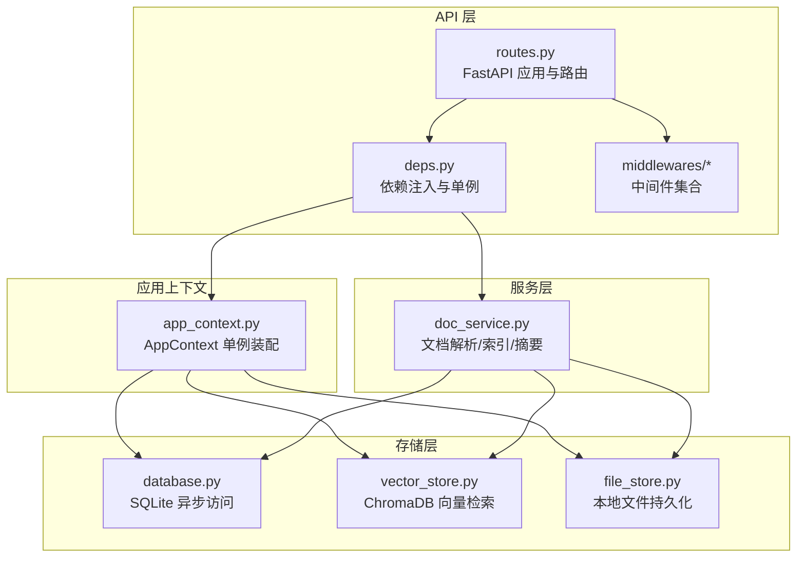
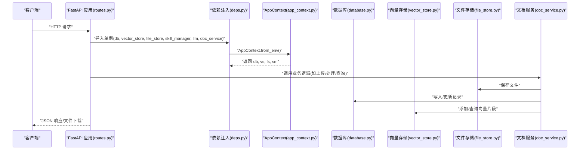
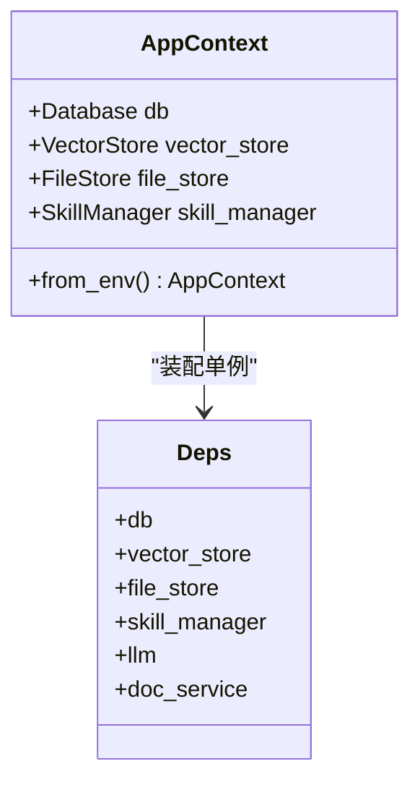
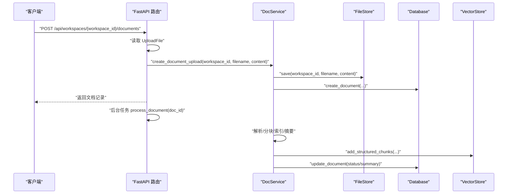
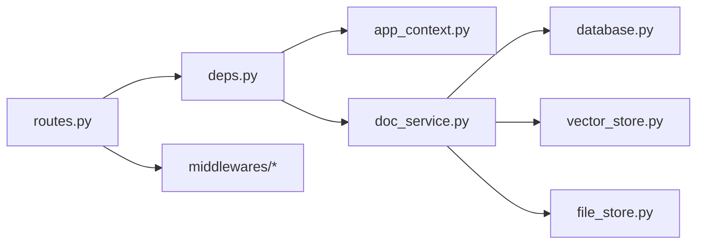

# API 层设计

<cite>
**本文引用的文件**
- [backend/src/api/deps.py](file://backend/src/api/deps.py)
- [backend/src/api/routes.py](file://backend/src/api/routes.py)
- [backend/src/app_context.py](file://backend/src/app_context.py)
- [backend/src/storage/database.py](file://backend/src/storage/database.py)
- [backend/src/storage/vector_store.py](file://backend/src/storage/vector_store.py)
- [backend/src/storage/file_store.py](file://backend/src/storage/file_store.py)
- [backend/src/services/doc_service.py](file://backend/src/services/doc_service.py)
- [backend/src/middlewares/__init__.py](file://backend/src/middlewares/__init__.py)
- [backend/src/middlewares/logging_middlewares.py](file://backend/src/middlewares/logging_middlewares.py)
- [backend/src/middlewares/inject_doc_context.py](file://backend/src/middlewares/inject_doc_context.py)
- [backend/pyproject.toml](file://backend/pyproject.toml)
</cite>

## 目录
1. [简介](#简介)
2. [项目结构](#项目结构)
3. [核心组件](#核心组件)
4. [架构总览](#架构总览)
5. [详细组件分析](#详细组件分析)
6. [依赖关系分析](#依赖关系分析)
7. [性能考虑](#性能考虑)
8. [故障排查指南](#故障排查指南)
9. [结论](#结论)
10. [附录](#附录)

## 简介
本文件面向 Train Agent 项目的 API 层，系统性阐述基于 FastAPI 的服务设计与实现细节，覆盖 RESTful 路由定义、HTTP 方法与 URL 规范、请求/响应数据结构、依赖注入机制（单例初始化）、CORS 配置、静态资源挂载、文件上传与下载处理、错误处理策略以及性能优化建议。读者可据此快速理解 API 的职责边界、调用流程与扩展方式。

## 项目结构
API 层位于 backend/src/api 目录，主要由两条主线构成：
- 依赖注入与全局单例：通过 deps.py 初始化 AppContext，并导出 db、vector_store、file_store、skill_manager、llm、doc_service 等单例，供路由模块按需使用。
- 路由与中间件：routes.py 定义所有 RESTful 接口、CORS 中间件、静态资源挂载；同时在启动事件中完成数据库初始化；中间件在 Agent 执行链路中提供日志、消息清洗、文档上下文注入与摘要等能力。

图表来源
- [backend/src/api/routes.py:1-189](file://backend/src/api/routes.py#L1-L189)
- [backend/src/api/deps.py:1-30](file://backend/src/api/deps.py#L1-L30)
- [backend/src/app_context.py:1-31](file://backend/src/app_context.py#L1-L31)
- [backend/src/storage/database.py:1-379](file://backend/src/storage/database.py#L1-L379)
- [backend/src/storage/vector_store.py:1-177](file://backend/src/storage/vector_store.py#L1-L177)
- [backend/src/storage/file_store.py:1-39](file://backend/src/storage/file_store.py#L1-L39)
- [backend/src/services/doc_service.py:1-218](file://backend/src/services/doc_service.py#L1-L218)

章节来源
- [backend/src/api/routes.py:1-189](file://backend/src/api/routes.py#L1-L189)
- [backend/src/api/deps.py:1-30](file://backend/src/api/deps.py#L1-L30)
- [backend/src/app_context.py:1-31](file://backend/src/app_context.py#L1-L31)

## 核心组件
- FastAPI 应用与路由
  - 创建应用实例，配置开发环境日志格式。
  - 在启动事件中初始化数据库连接。
  - 提供工作区、文档、任务、消息、文件下载、静态资源等接口。
- 依赖注入与单例
  - 从环境变量读取配置，构建 AppContext，产出 db、vector_store、file_store、skill_manager、llm、doc_service 等全局单例。
- 存储与服务
  - 数据库：异步 SQLite 访问，支持表迁移与消息记录。
  - 向量存储：ChromaDB 持久化客户端，DashScope 文本嵌入。
  - 文件存储：本地目录结构化保存，支持异步写入与工作区级清理。
  - 文档服务：统一处理上传、解析、分块、索引、摘要与状态更新。
- 中间件
  - 日志中间件：在 Agent 前后与模型前后打印关键指标。
  - 文档上下文注入：动态拼接当前工作区已摘要文档，增强系统提示词。
  - 其他：消息清洗、训练代理摘要中间件等。

章节来源
- [backend/src/api/routes.py:1-189](file://backend/src/api/routes.py#L1-L189)
- [backend/src/api/deps.py:1-30](file://backend/src/api/deps.py#L1-L30)
- [backend/src/app_context.py:1-31](file://backend/src/app_context.py#L1-L31)
- [backend/src/storage/database.py:1-379](file://backend/src/storage/database.py#L1-L379)
- [backend/src/storage/vector_store.py:1-177](file://backend/src/storage/vector_store.py#L1-L177)
- [backend/src/storage/file_store.py:1-39](file://backend/src/storage/file_store.py#L1-L39)
- [backend/src/services/doc_service.py:1-218](file://backend/src/services/doc_service.py#L1-L218)
- [backend/src/middlewares/__init__.py:1-41](file://backend/src/middlewares/__init__.py#L1-L41)

## 架构总览
下图展示 API 层与各子系统的交互关系，强调依赖注入、数据流与控制流：

图表来源
- [backend/src/api/routes.py:1-189](file://backend/src/api/routes.py#L1-L189)
- [backend/src/api/deps.py:1-30](file://backend/src/api/deps.py#L1-L30)
- [backend/src/app_context.py:1-31](file://backend/src/app_context.py#L1-L31)
- [backend/src/storage/database.py:1-379](file://backend/src/storage/database.py#L1-L379)
- [backend/src/storage/vector_store.py:1-177](file://backend/src/storage/vector_store.py#L1-L177)
- [backend/src/storage/file_store.py:1-39](file://backend/src/storage/file_store.py#L1-L39)
- [backend/src/services/doc_service.py:1-218](file://backend/src/services/doc_service.py#L1-L218)

## 详细组件分析

### 依赖注入与单例初始化（deps.py）
- 设计要点
  - 使用环境变量加载配置，构造 AppContext，产出 db、vector_store、file_store、skill_manager 等单例。
  - 通过 ChatOpenAI 构造 LLM 实例，用于文档摘要等场景。
  - 统一装配 DocService，注入 db、vector_store、file_store、llm。
- 关键行为
  - 单例在进程内共享，避免重复初始化。
  - backward-compatible 别名便于历史代码平滑过渡。
- 复杂度与性能
  - 初始化成本低，运行时开销可忽略。
  - 建议在应用启动阶段完成初始化，确保后续路由调用可用。

图表来源
- [backend/src/app_context.py:1-31](file://backend/src/app_context.py#L1-L31)
- [backend/src/api/deps.py:1-30](file://backend/src/api/deps.py#L1-L30)

章节来源
- [backend/src/api/deps.py:1-30](file://backend/src/api/deps.py#L1-L30)
- [backend/src/app_context.py:1-31](file://backend/src/app_context.py#L1-L31)

### CORS 配置与静态资源挂载
- CORS
  - 允许任意源、方法与头，便于前端联调与跨域访问。
- 静态资源
  - 将 PPT 技能所需的资源目录挂载到 /ppt-assets 与 /ppt-templates，若目录不存在则跳过并记录告警。
- 安全建议
  - 生产环境建议限制允许的源与方法，仅开放必要端点。

章节来源
- [backend/src/api/routes.py:21-27](file://backend/src/api/routes.py#L21-L27)
- [backend/src/api/routes.py:177-189](file://backend/src/api/routes.py#L177-L189)

### 文件上传与下载处理
- 上传
  - 接收 multipart/form-data，读取文件内容，调用 DocService 进行入库与异步处理。
  - 后台任务触发文档处理流程，包括解析、分块、向量化与摘要生成。
- 下载
  - 通过 /api/files/{file_path:path} 提供文件下载，校验路径存在性，返回二进制流。
- 错误处理
  - 未找到文件返回 404；上传失败在 DocService 内捕获异常并回写错误状态。

图表来源
- [backend/src/api/routes.py:112-128](file://backend/src/api/routes.py#L112-L128)
- [backend/src/services/doc_service.py:29-130](file://backend/src/services/doc_service.py#L29-L130)
- [backend/src/storage/file_store.py:11-16](file://backend/src/storage/file_store.py#L11-L16)
- [backend/src/storage/database.py:285-311](file://backend/src/storage/database.py#L285-L311)
- [backend/src/storage/vector_store.py:91-122](file://backend/src/storage/vector_store.py#L91-L122)

章节来源
- [backend/src/api/routes.py:112-128](file://backend/src/api/routes.py#L112-L128)
- [backend/src/api/routes.py:163-174](file://backend/src/api/routes.py#L163-L174)
- [backend/src/services/doc_service.py:29-130](file://backend/src/services/doc_service.py#L29-L130)

### 数据模型与请求/响应结构
- 工作区
  - 创建：请求体包含 user_id 与 name；返回新建工作区的 id、user_id、name。
  - 列表：按 user_id 查询，返回工作区列表。
  - 获取：根据 workspace_id 返回工作区详情。
  - 更新线程：PATCH /api/workspaces/{workspace_id}/thread，请求体包含 thread_id。
  - 删除：删除工作区内所有文档、向量与文件记录，再删除工作区本身。
- 文档
  - 上传：multipart/form-data，返回文档记录（含状态、摘要等）。
  - 列表：按 workspace_id 查询文档列表。
  - 删除：删除指定文档及其向量与文件。
- 任务
  - 列表：按 workspace_id 查询任务列表。
  - 删除：删除指定任务。
- 消息
  - 分页查询线程消息：支持 limit（默认 10，范围 1..100）与 before 游标。
- 文件下载
  - 路径参数 file_path，返回二进制文件流。

章节来源
- [backend/src/api/routes.py:40-53](file://backend/src/api/routes.py#L40-L53)
- [backend/src/api/routes.py:56-59](file://backend/src/api/routes.py#L56-L59)
- [backend/src/api/routes.py:62-70](file://backend/src/api/routes.py#L62-L70)
- [backend/src/api/routes.py:77-81](file://backend/src/api/routes.py#L77-L81)
- [backend/src/api/routes.py:98-96](file://backend/src/api/routes.py#L98-L96)
- [backend/src/api/routes.py:112-128](file://backend/src/api/routes.py#L112-L128)
- [backend/src/api/routes.py:131-134](file://backend/src/api/routes.py#L131-L134)
- [backend/src/api/routes.py:137-141](file://backend/src/api/routes.py#L137-L141)
- [backend/src/api/routes.py:147-150](file://backend/src/api/routes.py#L147-L150)
- [backend/src/api/routes.py:153-157](file://backend/src/api/routes.py#L153-L157)
- [backend/src/api/routes.py:84-96](file://backend/src/api/routes.py#L84-L96)
- [backend/src/api/routes.py:163-174](file://backend/src/api/routes.py#L163-L174)

### 错误处理策略
- HTTP 异常
  - 工作区重名：创建时抛出 409。
  - 资源不存在：工作区/文件下载返回 404。
- 业务异常
  - 文档处理异常：在 DocService 中捕获并回写 error_message，状态置为 error。
- 日志与可观测性
  - 路由层与中间件均输出结构化日志，便于定位问题。

章节来源
- [backend/src/api/routes.py:48-51](file://backend/src/api/routes.py#L48-L51)
- [backend/src/api/routes.py:66-69](file://backend/src/api/routes.py#L66-L69)
- [backend/src/api/routes.py:168-169](file://backend/src/api/routes.py#L168-L169)
- [backend/src/services/doc_service.py:121-128](file://backend/src/services/doc_service.py#L121-L128)
- [backend/src/middlewares/logging_middlewares.py:1-59](file://backend/src/middlewares/logging_middlewares.py#L1-L59)

### 中间件与 Agent 集成
- 中间件顺序
  - 日志前 Agent → 消息历史中间件 → 日志前模型 → 消息清洗 → 注入文档上下文 → 日志后模型 → 日志后 Agent → 训练代理摘要中间件。
- 文档上下文注入
  - 动态拼接当前工作区已摘要文档，增强系统提示词，提升对话质量。
- 性能与稳定性
  - 日志中间件提供轻量观测；摘要中间件按令牌数阈值进行周期性摘要，降低上下文长度。

章节来源
- [backend/src/middlewares/__init__.py:18-40](file://backend/src/middlewares/__init__.py#L18-L40)
- [backend/src/middlewares/inject_doc_context.py:11-40](file://backend/src/middlewares/inject_doc_context.py#L11-L40)
- [backend/src/middlewares/logging_middlewares.py:1-59](file://backend/src/middlewares/logging_middlewares.py#L1-L59)

## 依赖关系分析
- 组件耦合
  - routes.py 通过 deps.py 间接依赖 AppContext，从而解耦具体实现。
  - DocService 与存储层强关联，但通过接口抽象（数据库、向量、文件）隔离实现细节。
- 外部依赖
  - FastAPI、Uvicorn、LangChain、ChromaDB、DashScope、aiosqlite、PyMuPDF、python-docx 等。
- 可能的循环依赖
  - 采用单例注入与模块化组织，未见直接循环依赖迹象。

图表来源
- [backend/src/api/routes.py:1-189](file://backend/src/api/routes.py#L1-L189)
- [backend/src/api/deps.py:1-30](file://backend/src/api/deps.py#L1-L30)
- [backend/src/app_context.py:1-31](file://backend/src/app_context.py#L1-L31)
- [backend/src/services/doc_service.py:1-218](file://backend/src/services/doc_service.py#L1-L218)
- [backend/src/storage/database.py:1-379](file://backend/src/storage/database.py#L1-L379)
- [backend/src/storage/vector_store.py:1-177](file://backend/src/storage/vector_store.py#L1-L177)
- [backend/src/storage/file_store.py:1-39](file://backend/src/storage/file_store.py#L1-L39)
- [backend/src/middlewares/__init__.py:1-41](file://backend/src/middlewares/__init__.py#L1-L41)

章节来源
- [backend/src/api/routes.py:1-189](file://backend/src/api/routes.py#L1-L189)
- [backend/src/api/deps.py:1-30](file://backend/src/api/deps.py#L1-L30)
- [backend/src/app_context.py:1-31](file://backend/src/app_context.py#L1-L31)
- [backend/src/services/doc_service.py:1-218](file://backend/src/services/doc_service.py#L1-L218)
- [backend/src/storage/database.py:1-379](file://backend/src/storage/database.py#L1-L379)
- [backend/src/storage/vector_store.py:1-177](file://backend/src/storage/vector_store.py#L1-L177)
- [backend/src/storage/file_store.py:1-39](file://backend/src/storage/file_store.py#L1-L39)
- [backend/src/middlewares/__init__.py:1-41](file://backend/src/middlewares/__init__.py#L1-L41)
- [backend/pyproject.toml:6-26](file://backend/pyproject.toml#L6-L26)

## 性能考虑
- I/O 与并发
  - 文件写入提供异步版本（FileStore.save_async），避免阻塞事件循环。
  - 文档处理采用后台任务，避免阻塞上传接口。
- 向量索引
  - 批量插入与分批处理，减少单次写入压力；ChromaDB 使用余弦相似度空间，适合语义检索。
- 数据库
  - 使用 aiosqlite 异步连接；消息查询带游标分页，限制最大返回条数。
- LLM 调用
  - 摘要中间件按令牌数阈值触发摘要，减少上下文长度；DocService 在 LLM 失败时降级为截断文本。
- 建议
  - 生产部署启用更严格的 CORS 策略；
  - 对大文件上传增加大小限制与进度反馈；
  - 对向量检索设置 top_k 上限与过滤条件；
  - 对高频接口增加缓存或限流策略。

## 故障排查指南
- 上传失败
  - 检查 DATA_DIR 权限与磁盘空间；查看 DocService 的错误回写与日志。
- 向量检索为空
  - 确认文档是否成功索引；检查 DashScope 嵌入 API 配置；确认工作区集合是否存在。
- 文件下载 404
  - 确认存储路径正确且文件存在；检查静态资源挂载目录。
- Agent 输出异常
  - 查看日志中间件输出；确认注入的文档摘要是否正确拼接；调整摘要中间件阈值。

章节来源
- [backend/src/services/doc_service.py:121-128](file://backend/src/services/doc_service.py#L121-L128)
- [backend/src/storage/vector_store.py:138-142](file://backend/src/storage/vector_store.py#L138-L142)
- [backend/src/api/routes.py:168-169](file://backend/src/api/routes.py#L168-L169)
- [backend/src/middlewares/logging_middlewares.py:1-59](file://backend/src/middlewares/logging_middlewares.py#L1-L59)
- [backend/src/middlewares/inject_doc_context.py:17-26](file://backend/src/middlewares/inject_doc_context.py#L17-L26)

## 结论
API 层以 FastAPI 为核心，结合依赖注入与单例模式，将存储与服务层清晰解耦；通过中间件体系提供可观测性与上下文增强；在上传、索引、检索与下载等关键路径上具备完善的错误处理与性能优化策略。建议在生产环境中进一步收紧安全策略与容量规划，持续完善监控与告警。

## 附录
- 环境变量与配置
  - SUMMARIZATION_MODEL、SUMMARIZATION_API_KEY、SUMMARIZATION_API_BASE：摘要 LLM 配置。
  - MAIN_MODEL、DEEPSEEK_API_KEY、DEEPSEEK_API_BASE：Agent 摘要中间件配置。
  - EMBEDDING_MODEL、EMBEDDING_API_KEY、EMBEDDING_API_BASE：向量嵌入配置。
  - DATA_DIR：数据根目录，默认 ./data。
- 依赖清单（部分）
  - FastAPI、Uvicorn、LangChain、LangGraph、ChromaDB、DashScope、aiosqlite、PyMuPDF、python-docx 等。

章节来源
- [backend/src/api/deps.py:21-25](file://backend/src/api/deps.py#L21-L25)
- [backend/src/middlewares/__init__.py:31-39](file://backend/src/middlewares/__init__.py#L31-L39)
- [backend/src/storage/vector_store.py:20-24](file://backend/src/storage/vector_store.py#L20-L24)
- [backend/src/app_context.py:22-30](file://backend/src/app_context.py#L22-L30)
- [backend/pyproject.toml:6-26](file://backend/pyproject.toml#L6-L26)