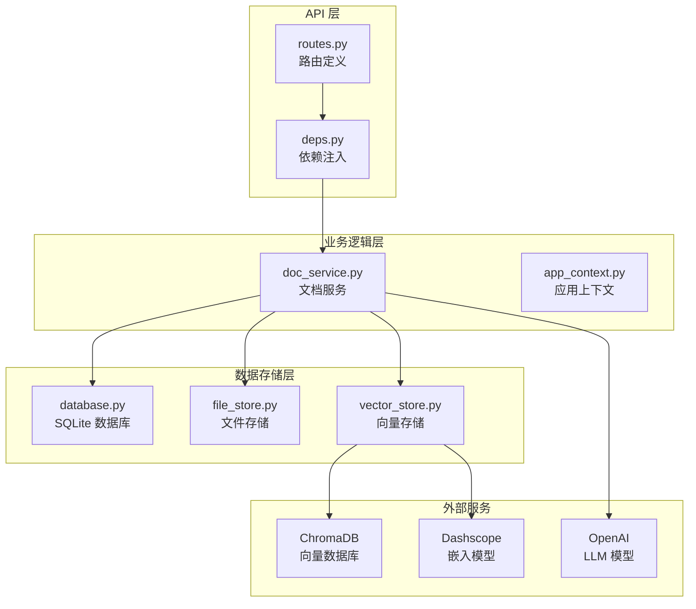
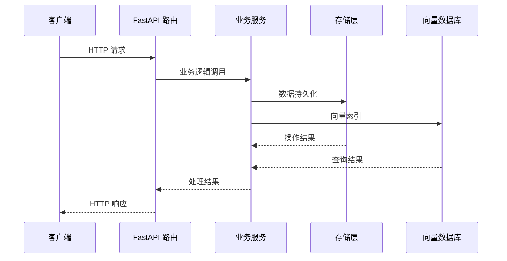
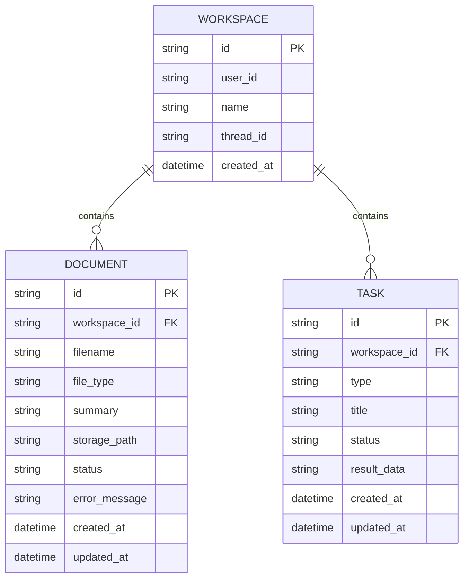
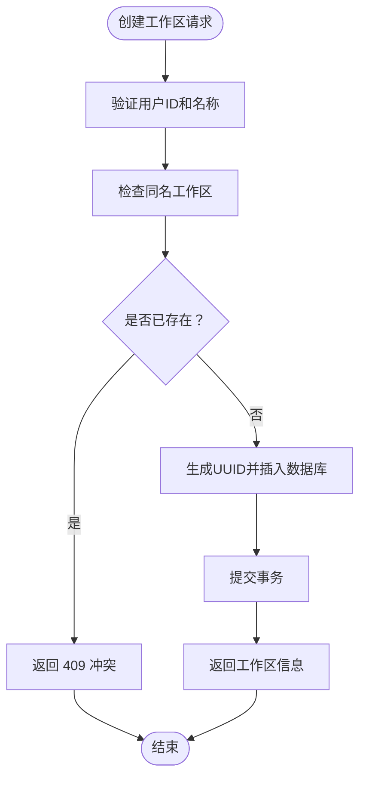
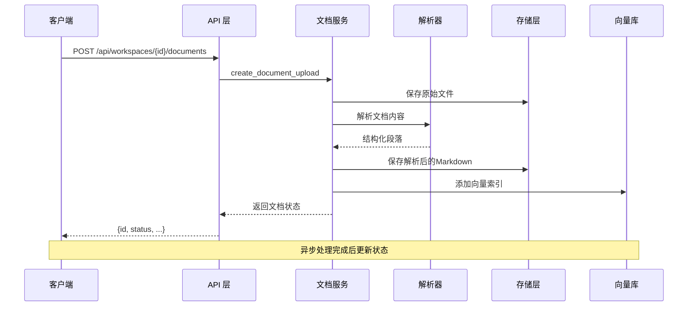
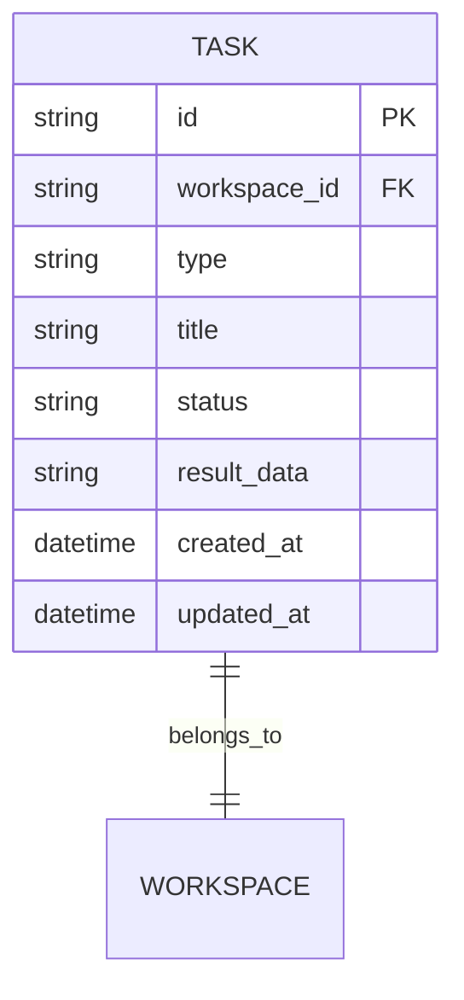
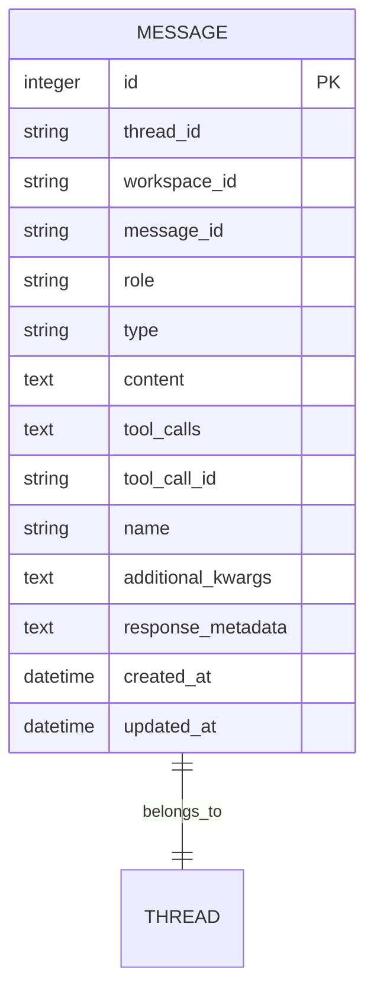
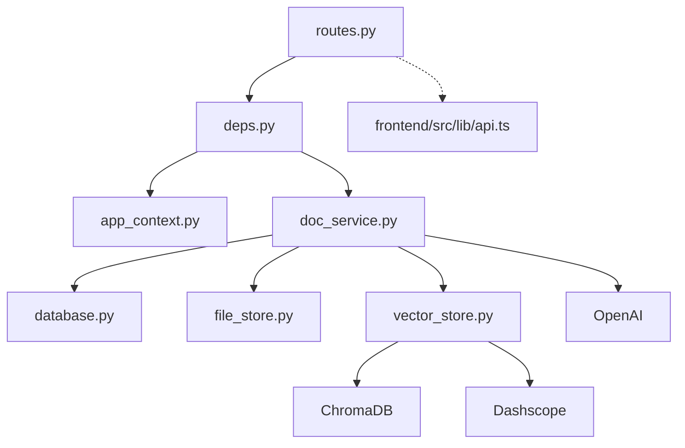

# REST API 设计规范

<cite>
**本文档引用的文件**
- [routes.py](file://backend/src/api/routes.py)
- [deps.py](file://backend/src/api/deps.py)
- [database.py](file://backend/src/storage/database.py)
- [doc_service.py](file://backend/src/services/doc_service.py)
- [file_store.py](file://backend/src/storage/file_store.py)
- [vector_store.py](file://backend/src/storage/vector_store.py)
- [api.ts](file://frontend/src/lib/api.ts)
- [app_context.py](file://backend/src/app_context.py)
- [backend-architecture.md](file://docs/backend-architecture.md)
- [pyproject.toml](file://backend/pyproject.toml)
</cite>

## 目录
1. [简介](#简介)
2. [项目结构](#项目结构)
3. [核心组件](#核心组件)
4. [架构概览](#架构概览)
5. [详细组件分析](#详细组件分析)
6. [依赖关系分析](#依赖关系分析)
7. [性能考虑](#性能考虑)
8. [故障排除指南](#故障排除指南)
9. [结论](#结论)

## 简介

Train Agent 项目是一个基于 FastAPI 的训练代理系统，提供了完整的工作区管理、文档处理、任务管理和文件下载功能。该系统的 REST API 设计遵循现代 Web 服务的最佳实践，采用清晰的 URL 模式和一致的 HTTP 方法约定，为前端应用提供稳定可靠的数据接口。

本设计规范详细阐述了 API 路由定义规范、HTTP 方法使用原则、URL 模式设计、请求响应数据结构，以及各个核心功能模块的实现细节和最佳实践指导。

## 项目结构

后端采用模块化的架构设计，主要分为以下几个层次：

**图表来源**
- [routes.py:1-21](file://backend/src/api/routes.py#L1-L21)
- [deps.py:15-29](file://backend/src/api/deps.py#L15-L29)
- [app_context.py:12-30](file://backend/src/app_context.py#L12-L30)

**章节来源**
- [routes.py:1-189](file://backend/src/api/routes.py#L1-L189)
- [deps.py:1-30](file://backend/src/api/deps.py#L1-L30)
- [app_context.py:1-31](file://backend/src/app_context.py#L1-L31)

## 核心组件

### API 应用实例

应用使用 FastAPI 构建，配置了 CORS 中间件和启动事件处理器：

- **应用名称**: Train Agent API
- **CORS 配置**: 允许所有源、方法和头部（开发环境）
- **启动事件**: 初始化数据库连接
- **日志配置**: 开发环境下的详细日志记录

### 依赖注入系统

通过 `AppContext` 类统一管理所有服务依赖：

- **Database**: SQLite 数据库连接
- **VectorStore**: ChromaDB 向量存储
- **FileStore**: 文件系统存储
- **SkillManager**: 技能管理器
- **LLM**: OpenAI Chat 模型

**章节来源**
- [routes.py:21-34](file://backend/src/api/routes.py#L21-L34)
- [deps.py:15-29](file://backend/src/api/deps.py#L15-L29)
- [app_context.py:12-30](file://backend/src/app_context.py#L12-L30)

## 架构概览

系统采用分层架构，各层职责明确，耦合度低：

**图表来源**
- [routes.py:45-53](file://backend/src/api/routes.py#L45-L53)
- [doc_service.py:29-55](file://backend/src/services/doc_service.py#L29-L55)
- [database.py:111-127](file://backend/src/storage/database.py#L111-L127)

## 详细组件分析

### 工作区管理 API

工作区是系统的核心概念，代表用户的独立工作空间。

#### 路由定义

| 方法 | 路径 | 功能 | 参数 | 响应 |
|------|------|------|------|------|
| POST | `/api/workspaces` | 创建新工作区 | `user_id`, `name` | 工作区对象 |
| GET | `/api/workspaces` | 列出用户的所有工作区 | `user_id` | 工作区数组 |
| GET | `/api/workspaces/{workspace_id}` | 获取工作区详情 | `workspace_id` | 工作区对象或 404 |
| PATCH | `/api/workspaces/{workspace_id}/thread` | 更新关联的线程 ID | `thread_id` | `{ok: true}` |
| DELETE | `/api/workspaces/{workspace_id}` | 删除工作区 | `workspace_id` | `{ok: true}` |

#### 数据模型

**图表来源**
- [database.py:27-76](file://backend/src/storage/database.py#L27-L76)
- [database.py:111-155](file://backend/src/storage/database.py#L111-L155)

#### 实现细节

工作区创建时进行同名检测，避免重复命名：

**图表来源**
- [routes.py:45-53](file://backend/src/api/routes.py#L45-L53)
- [database.py:111-127](file://backend/src/storage/database.py#L111-L127)

**章节来源**
- [routes.py:45-106](file://backend/src/api/routes.py#L45-L106)
- [database.py:111-155](file://backend/src/storage/database.py#L111-L155)

### 文档管理 API

文档管理功能支持多种文件类型的上传、解析和检索。

#### 路由定义

| 方法 | 路径 | 功能 | 参数 | 响应 |
|------|------|------|------|------|
| POST | `/api/workspaces/{workspace_id}/documents` | 上传文档 | `file` (multipart) | 文档对象 |
| GET | `/api/workspaces/{workspace_id}/documents` | 列出文档 | 无 | 文档数组 |
| DELETE | `/api/workspaces/{workspace_id}/documents/{doc_id}` | 删除文档 | `doc_id` | `{ok: true}` |

#### 文档处理流程

**图表来源**
- [routes.py:112-128](file://backend/src/api/routes.py#L112-L128)
- [doc_service.py:35-55](file://backend/src/services/doc_service.py#L35-L55)
- [doc_service.py:57-130](file://backend/src/services/doc_service.py#L57-L130)

#### 文档状态管理

文档处理采用多阶段状态机：

| 状态 | 描述 | 用途 |
|------|------|------|
| uploaded | 已上传 | 初始状态，文件已保存 |
| parsing | 解析中 | 正在提取文本内容 |
| parsed | 已解析 | 文本提取完成，生成Markdown |
| chunking | 分块中 | 将内容分割为可索引的块 |
| indexing | 索引中 | 向量嵌入和索引建立 |
| sumarizing | 摘要中 | 生成文档摘要 |
| ready | 准备就绪 | 所有处理完成 |
| error | 处理错误 | 发生异常 |

**章节来源**
- [routes.py:112-141](file://backend/src/api/routes.py#L112-L141)
- [doc_service.py:57-130](file://backend/src/services/doc_service.py#L57-L130)
- [database.py:285-339](file://backend/src/storage/database.py#L285-L339)

### 任务管理 API

任务管理用于跟踪各种处理任务的状态。

#### 路由定义

| 方法 | 路径 | 功能 | 参数 | 响应 |
|------|------|------|------|------|
| GET | `/api/workspaces/{workspace_id}/tasks` | 列出任务 | 无 | 任务数组 |
| DELETE | `/api/workspaces/{workspace_id}/tasks/{task_id}` | 删除任务 | `task_id` | `{ok: true}` |

#### 任务数据模型

**图表来源**
- [database.py:46-55](file://backend/src/storage/database.py#L46-L55)
- [database.py:342-378](file://backend/src/storage/database.py#L342-L378)

**章节来源**
- [routes.py:147-157](file://backend/src/api/routes.py#L147-L157)
- [database.py:342-378](file://backend/src/storage/database.py#L342-L378)

### 消息管理 API

消息管理用于维护对话历史和相关元数据。

#### 路由定义

| 方法 | 路径 | 功能 | 参数 | 响应 |
|------|------|------|------|------|
| GET | `/api/threads/{thread_id}/messages` | 获取消息列表 | `limit`, `before` | 消息页面对象 |

#### 查询参数

- `limit`: 最大返回数量，默认 10，范围 1-100
- `before`: 时间游标，用于分页获取更早的消息

#### 消息数据模型

**图表来源**
- [database.py:56-72](file://backend/src/storage/database.py#L56-L72)
- [database.py:230-280](file://backend/src/storage/database.py#L230-L280)

**章节来源**
- [routes.py:84-96](file://backend/src/api/routes.py#L84-L96)
- [database.py:230-280](file://backend/src/storage/database.py#L230-L280)

### 文件下载 API

通用文件下载接口，支持输出文件和文档文件。

#### 路由定义

| 方法 | 路径 | 功能 | 参数 | 响应 |
|------|------|------|------|------|
| GET | `/api/files/{file_path:path}` | 下载文件 | `file_path` | 文件流 |

#### 实现特性

- 支持任意路径的文件下载
- 自动设置正确的媒体类型
- 404 错误处理
- 安全的路径解析

**章节来源**
- [routes.py:163-174](file://backend/src/api/routes.py#L163-L174)

## 依赖关系分析

### 组件依赖图

**图表来源**
- [routes.py:10](file://backend/src/api/routes.py#L10)
- [deps.py:13-29](file://backend/src/api/deps.py#L13-L29)
- [app_context.py:19-30](file://backend/src/app_context.py#L19-L30)

### 外部依赖

系统依赖以下主要外部服务：

- **ChromaDB**: 持久化向量数据库
- **Dashscope**: 文本嵌入服务
- **OpenAI**: 大语言模型摘要生成
- **SQLite**: 关系型数据存储

**章节来源**
- [pyproject.toml:6-26](file://backend/pyproject.toml#L6-L26)
- [vector_store.py:13-36](file://backend/src/storage/vector_store.py#L13-L36)

## 性能考虑

### 异步处理策略

文档上传采用异步后台处理模式，避免阻塞主请求线程：

1. **立即响应**: 上传接口快速返回 `uploaded` 状态
2. **后台处理**: 使用 `BackgroundTasks` 异步执行解析、分块、索引和摘要生成
3. **状态轮询**: 前端通过轮询 `list_documents` 接口监控处理进度

### 缓存和索引优化

- **向量索引**: 使用 ChromaDB 进行高效的相似性搜索
- **嵌入模型**: 通过 Dashscope 提供的文本嵌入服务
- **分页查询**: 消息列表支持游标分页，限制单次查询数量

### 存储优化

- **文件存储**: 采用工作区隔离的目录结构
- **数据库索引**: 为常用查询字段建立索引
- **批量操作**: 向量索引添加采用批处理模式

## 故障排除指南

### 常见错误和解决方案

#### HTTP 409 冲突错误

**场景**: 工作区名称重复
**解决方案**: 更换工作区名称或删除现有工作区

#### HTTP 404 未找到错误

**场景**: 访问不存在的资源
**解决方案**: 验证资源 ID 是否正确，确认资源是否存在

#### HTTP 422 参数验证错误

**场景**: 请求参数格式不正确
**解决方案**: 检查请求体格式，确保符合 API 规范

#### 处理失败错误

**场景**: 文档处理过程中发生异常
**解决方案**: 查看错误详情，重新上传或修复文件格式

### 日志和调试

系统提供详细的日志记录：

- **请求日志**: 记录所有 API 请求的详细信息
- **处理日志**: 跟踪文档处理的每个阶段
- **错误日志**: 记录异常和错误详情

**章节来源**
- [routes.py:48-51](file://backend/src/api/routes.py#L48-L51)
- [routes.py:67-69](file://backend/src/api/routes.py#L67-L69)
- [routes.py:167-169](file://backend/src/api/routes.py#L167-L169)

## 结论

Train Agent 项目的 REST API 设计体现了现代 Web 服务的最佳实践：

1. **清晰的架构分层**: 明确的职责分离和依赖注入机制
2. **一致的 API 设计**: 标准化的 HTTP 方法和 URL 模式
3. **异步处理能力**: 支持长时间运行的任务和后台处理
4. **完善的错误处理**: 详细的错误信息和状态码使用
5. **可扩展的设计**: 模块化的组件结构便于功能扩展

该设计为前端应用提供了稳定可靠的接口，支持复杂的工作区管理和文档处理功能，为 Train Agent 系统的成功实施奠定了坚实的技术基础。