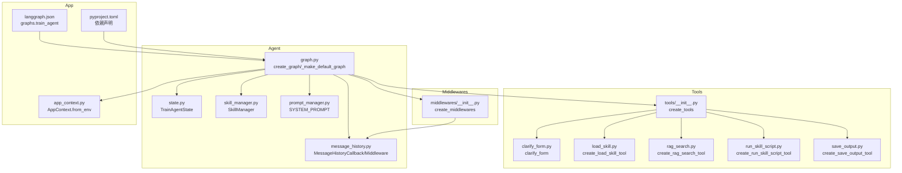
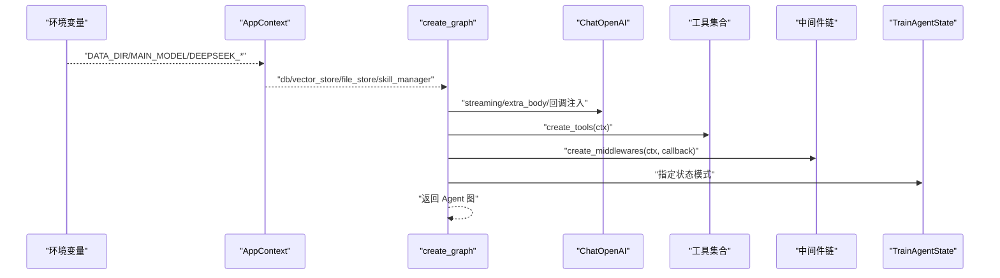
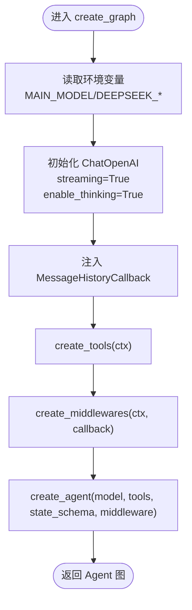
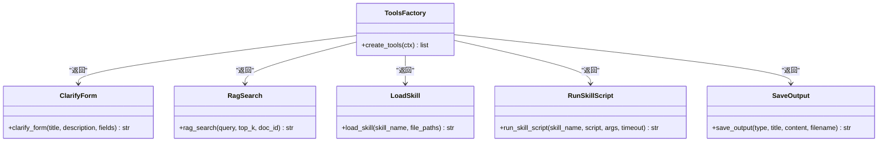
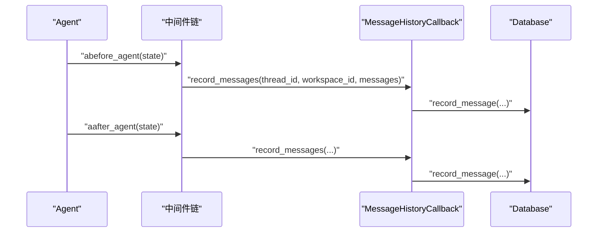
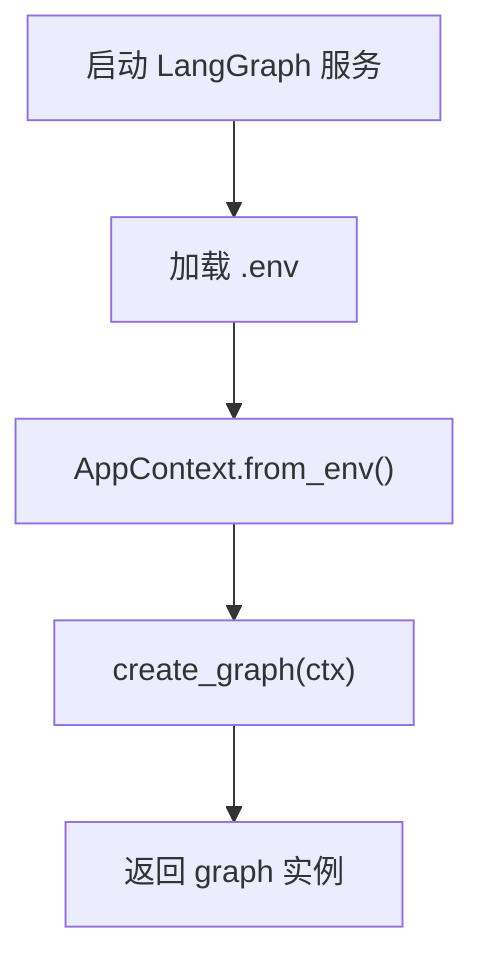
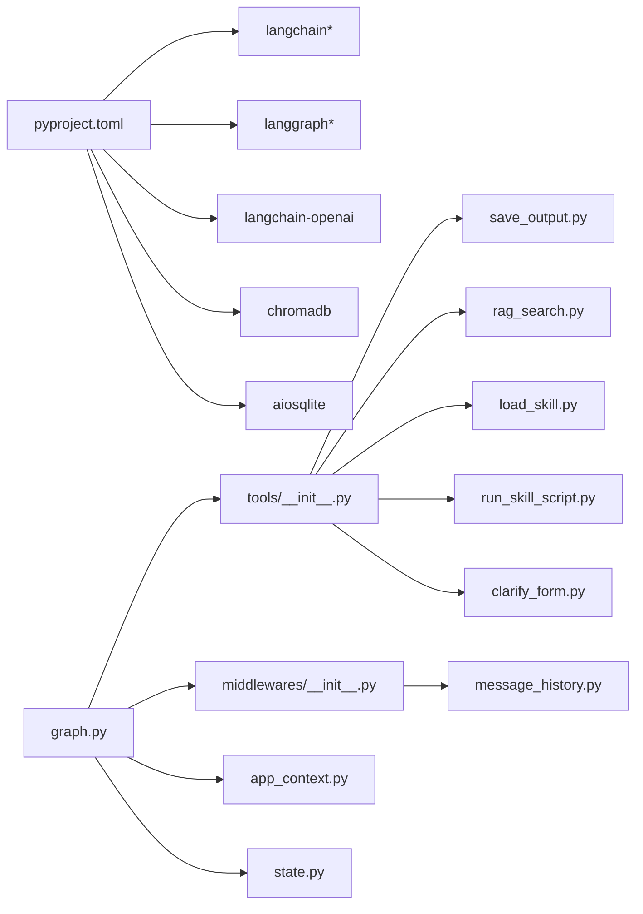

# Agent 图构建

<cite>
**本文引用的文件**
- [backend/src/agent/graph.py](file://backend/src/agent/graph.py)
- [backend/src/agent/state.py](file://backend/src/agent/state.py)
- [backend/src/agent/message_history.py](file://backend/src/agent/message_history.py)
- [backend/src/agent/skill_manager.py](file://backend/src/agent/skill_manager.py)
- [backend/src/agent/prompt_manager.py](file://backend/src/agent/prompt_manager.py)
- [backend/src/tools/__init__.py](file://backend/src/tools/__init__.py)
- [backend/src/tools/clarify_form.py](file://backend/src/tools/clarify_form.py)
- [backend/src/tools/load_skill.py](file://backend/src/tools/load_skill.py)
- [backend/src/tools/rag_search.py](file://backend/src/tools/rag_search.py)
- [backend/src/tools/run_skill_script.py](file://backend/src/tools/run_skill_script.py)
- [backend/src/tools/save_output.py](file://backend/src/tools/save_output.py)
- [backend/src/middlewares/__init__.py](file://backend/src/middlewares/__init__.py)
- [backend/src/app_context.py](file://backend/src/app_context.py)
- [backend/langgraph.json](file://backend/langgraph.json)
- [backend/pyproject.toml](file://backend/pyproject.toml)
</cite>

## 目录
1. [简介](#简介)
2. [项目结构](#项目结构)
3. [核心组件](#核心组件)
4. [架构总览](#架构总览)
5. [详细组件分析](#详细组件分析)
6. [依赖分析](#依赖分析)
7. [性能考虑](#性能考虑)
8. [故障排除指南](#故障排除指南)
9. [结论](#结论)
10. [附录](#附录)

## 简介
本文件面向 Train Agent 的 Agent 图构建系统，围绕 create_graph 函数展开，系统性阐述以下主题：
- LLM 模型配置（ChatOpenAI）与流式响应
- 工具注册机制与工具链构建
- 中间件链构建与执行顺序
- Agent 生命周期管理与回调集成
- 默认图实例创建流程（_make_default_graph）与环境变量配置
- Agent 图的扩展方法、自定义工具集成与性能优化建议
- 具体配置示例与故障排除指南

## 项目结构
后端以功能域划分模块，Agent 图构建位于 backend/src/agent，工具与中间件分别位于 backend/src/tools 与 backend/src/middlewares，应用上下文与环境变量配置位于 backend/src/app_context.py，LangGraph 服务入口通过 backend/langgraph.json 指定。

图表来源
- [backend/src/agent/graph.py:16-49](file://backend/src/agent/graph.py#L16-L49)
- [backend/src/agent/state.py:4-7](file://backend/src/agent/state.py#L4-L7)
- [backend/src/agent/message_history.py:13-143](file://backend/src/agent/message_history.py#L13-L143)
- [backend/src/agent/skill_manager.py:14-117](file://backend/src/agent/skill_manager.py#L14-L117)
- [backend/src/agent/prompt_manager.py:1-37](file://backend/src/agent/prompt_manager.py#L1-L37)
- [backend/src/tools/__init__.py:11-20](file://backend/src/tools/__init__.py#L11-L20)
- [backend/src/tools/clarify_form.py:24-46](file://backend/src/tools/clarify_form.py#L24-L46)
- [backend/src/tools/load_skill.py:13-116](file://backend/src/tools/load_skill.py#L13-L116)
- [backend/src/tools/rag_search.py:40-76](file://backend/src/tools/rag_search.py#L40-L76)
- [backend/src/tools/run_skill_script.py:31-143](file://backend/src/tools/run_skill_script.py#L31-L143)
- [backend/src/tools/save_output.py:61-99](file://backend/src/tools/save_output.py#L61-L99)
- [backend/src/middlewares/__init__.py:18-41](file://backend/src/middlewares/__init__.py#L18-L41)
- [backend/src/app_context.py:12-31](file://backend/src/app_context.py#L12-L31)
- [backend/langgraph.json:4-8](file://backend/langgraph.json#L4-L8)
- [backend/pyproject.toml:6-26](file://backend/pyproject.toml#L6-L26)

章节来源
- [backend/src/agent/graph.py:16-49](file://backend/src/agent/graph.py#L16-L49)
- [backend/src/app_context.py:12-31](file://backend/src/app_context.py#L12-L31)
- [backend/langgraph.json:4-8](file://backend/langgraph.json#L4-L8)

## 核心组件
- Agent 图构建器：负责装配模型、工具、中间件与状态，最终生成可运行的 Agent 图。
- 应用上下文 AppContext：集中注入数据库、向量库、文件存储与技能管理器等依赖。
- 工具注册器：统一创建并返回工具列表，便于 Agent 使用。
- 中间件注册器：按执行顺序组装日志、消息历史、请求清洗、文档上下文注入、总结等中间件。
- 状态扩展：在基础 AgentState 上增加 workspace_id，用于多工作区隔离与持久化。
- 技能管理器：扫描技能目录，提供技能清单、动态加载与安全文件读取能力。
- 提示词管理：内置系统提示词，约束 Agent 的行为边界与输出规范。

章节来源
- [backend/src/agent/graph.py:16-49](file://backend/src/agent/graph.py#L16-L49)
- [backend/src/agent/state.py:4-7](file://backend/src/agent/state.py#L4-L7)
- [backend/src/agent/skill_manager.py:14-117](file://backend/src/agent/skill_manager.py#L14-L117)
- [backend/src/agent/prompt_manager.py:1-37](file://backend/src/agent/prompt_manager.py#L1-L37)
- [backend/src/tools/__init__.py:11-20](file://backend/src/tools/__init__.py#L11-L20)
- [backend/src/middlewares/__init__.py:18-41](file://backend/src/middlewares/__init__.py#L18-L41)

## 架构总览
Agent 图构建遵循“配置-装配-运行”的模式：
- 配置阶段：从环境变量读取模型参数，初始化 AppContext 并创建 ChatOpenAI 实例；启用流式响应与思维开关。
- 装配阶段：注册 MessageHistoryCallback 并将其注入模型回调；创建工具与中间件链；指定状态模式为 TrainAgentState。
- 运行阶段：通过 LangGraph 服务入口启动图，支持流式响应与中间件拦截。

图表来源
- [backend/src/agent/graph.py:16-49](file://backend/src/agent/graph.py#L16-L49)
- [backend/src/app_context.py:19-31](file://backend/src/app_context.py#L19-L31)
- [backend/src/middlewares/__init__.py:18-41](file://backend/src/middlewares/__init__.py#L18-L41)
- [backend/src/tools/__init__.py:11-20](file://backend/src/tools/__init__.py#L11-L20)

## 详细组件分析

### create_graph 函数实现原理
- 模型配置
  - 通过环境变量 MAIN_MODEL、DEEPSEEK_API_KEY、DEEPSEEK_API_BASE 初始化 ChatOpenAI。
  - 启用 streaming 流式响应与额外参数 enable_thinking，提升推理过程可见性。
  - 将 MessageHistoryCallback 注入模型回调，确保每次推理的消息被持久化。
- 工具注册
  - 通过 create_tools(ctx) 创建工具集合，包含澄清表单、RAG 搜索、技能加载、脚本执行、产物保存等。
- 中间件链
  - 通过 create_middlewares(ctx, callback) 创建中间件序列，包含前置/后置日志、消息清洗、文档上下文注入、消息总结等。
- 返回 Agent 图
  - 使用 create_agent(model, tools, state_schema, middleware) 构建可运行图，供 LangGraph 服务使用。

图表来源
- [backend/src/agent/graph.py:16-49](file://backend/src/agent/graph.py#L16-L49)
- [backend/src/tools/__init__.py:11-20](file://backend/src/tools/__init__.py#L11-L20)
- [backend/src/middlewares/__init__.py:18-41](file://backend/src/middlewares/__init__.py#L18-L41)

章节来源
- [backend/src/agent/graph.py:16-49](file://backend/src/agent/graph.py#L16-L49)

### LLM 模型配置（ChatOpenAI）
- 关键参数
  - model：来自 MAIN_MODEL 环境变量。
  - api_key：来自 DEEPSEEK_API_KEY 环境变量。
  - base_url：来自 DEEPSEEK_API_BASE 环境变量。
  - streaming：开启流式响应，便于前端实时展示。
  - extra_body：启用思维过程标记 enable_thinking，便于调试与追踪。
- 回调集成
  - 将 MessageHistoryCallback 注入模型回调数组，确保消息持久化与摘要消息过滤。

章节来源
- [backend/src/agent/graph.py:18-26](file://backend/src/agent/graph.py#L18-L26)

### 工具注册机制
- 工具工厂
  - create_tools(ctx) 返回工具列表，包含：
    - clarify_form：用于向用户展示交互式表单，收集必要信息。
    - rag_search：基于向量库检索知识片段，支持按文档 ID 限定范围。
    - load_skill：动态加载技能提示与关联文件，遵循 LangChain Skills 模式。
    - run_skill_script：在受控环境下执行技能脚本，支持多种语言解释器。
    - save_output：将产出物保存至文件存储并记录任务状态。
- 动态描述与安全
  - load_skill 与 run_skill_script 在工具描述中动态列出可用技能与支持类型，同时执行路径校验与超时控制。

图表来源
- [backend/src/tools/__init__.py:11-20](file://backend/src/tools/__init__.py#L11-L20)
- [backend/src/tools/clarify_form.py:24-46](file://backend/src/tools/clarify_form.py#L24-L46)
- [backend/src/tools/rag_search.py:40-76](file://backend/src/tools/rag_search.py#L40-L76)
- [backend/src/tools/load_skill.py:13-116](file://backend/src/tools/load_skill.py#L13-L116)
- [backend/src/tools/run_skill_script.py:31-143](file://backend/src/tools/run_skill_script.py#L31-L143)
- [backend/src/tools/save_output.py:61-99](file://backend/src/tools/save_output.py#L61-L99)

章节来源
- [backend/src/tools/__init__.py:11-20](file://backend/src/tools/__init__.py#L11-L20)
- [backend/src/tools/clarify_form.py:24-46](file://backend/src/tools/clarify_form.py#L24-L46)
- [backend/src/tools/rag_search.py:40-76](file://backend/src/tools/rag_search.py#L40-L76)
- [backend/src/tools/load_skill.py:13-116](file://backend/src/tools/load_skill.py#L13-L116)
- [backend/src/tools/run_skill_script.py:31-143](file://backend/src/tools/run_skill_script.py#L31-L143)
- [backend/src/tools/save_output.py:61-99](file://backend/src/tools/save_output.py#L61-L99)

### 中间件链构建
- 执行顺序
  - 日志前置 → 消息历史中间件 → 日志模型前置 → 请求清洗 → 文档上下文注入 → 日志模型后置 → 日志后置 → 消息总结。
- 职责分工
  - 日志中间件：记录 Agent 与模型前后状态。
  - 消息历史中间件：从状态提取 messages 并持久化，支持 thread_id 探测。
  - 请求清洗：净化模型输入，减少噪声。
  - 文档上下文注入：将当前工作区知识注入到提示词中。
  - 消息总结：在消息数量或 token 数达到阈值时触发摘要，降低上下文开销。
- 消息历史回调
  - MessageHistoryCallback 负责将人类、AI、工具消息标准化并写入数据库，过滤摘要消息，支持字典与对象两种消息形态。

图表来源
- [backend/src/middlewares/__init__.py:18-41](file://backend/src/middlewares/__init__.py#L18-L41)
- [backend/src/agent/message_history.py:113-143](file://backend/src/agent/message_history.py#L113-L143)

章节来源
- [backend/src/middlewares/__init__.py:18-41](file://backend/src/middlewares/__init__.py#L18-L41)
- [backend/src/agent/message_history.py:13-143](file://backend/src/agent/message_history.py#L13-L143)

### Agent 生命周期管理与回调集成
- 生命周期钩子
  - MessageHistoryMiddleware 在 abefore_agent 与 aafter_agent 两个阶段记录消息，确保完整生命周期覆盖。
- 回调注入
  - 将 MessageHistoryCallback 注入 ChatOpenAI 的 callbacks，使模型推理过程中的消息也能被持久化。
- 线程 ID 探测
  - 从 runtime.execution_info、runtime.context 或 runtime.config.configurable 中提取 thread_id，保证多线程或多会话场景下的消息归属正确。

章节来源
- [backend/src/agent/graph.py:25-26](file://backend/src/agent/graph.py#L25-L26)
- [backend/src/agent/message_history.py:113-143](file://backend/src/agent/message_history.py#L113-L143)

### 流式响应处理
- 模型层
  - ChatOpenAI 开启 streaming，便于 LangGraph 逐步产生输出。
- 中间件层
  - 中间件链中的日志与清洗等操作不影响流式传输。
- 建议
  - 前端应逐条消费流式片段，结合 MessageHistoryCallback 的持久化能力实现对话历史的实时更新。

章节来源
- [backend/src/agent/graph.py:22-24](file://backend/src/agent/graph.py#L22-L24)

### 默认图实例创建（_make_default_graph）与环境变量配置
- 默认图创建
  - _make_default_graph 加载 .env 环境变量，调用 AppContext.from_env() 构建上下文，再调用 create_graph(ctx) 生成默认图实例。
- 环境变量
  - MAIN_MODEL：LLM 模型名称。
  - DEEPSEEK_API_KEY：模型 API 密钥。
  - DEEPSEEK_API_BASE：模型 API 基础地址。
  - DATA_DIR：数据目录前缀，用于数据库、向量库与文件存储的路径拼接。
- LangGraph 服务入口
  - langgraph.json 指定 graphs.train_agent 对应 backend/src/agent/graph:graph，作为服务启动入口。

图表来源
- [backend/src/agent/graph.py:40-49](file://backend/src/agent/graph.py#L40-L49)
- [backend/src/app_context.py:19-31](file://backend/src/app_context.py#L19-L31)
- [backend/langgraph.json:4-8](file://backend/langgraph.json#L4-L8)

章节来源
- [backend/src/agent/graph.py:40-49](file://backend/src/agent/graph.py#L40-L49)
- [backend/src/app_context.py:19-31](file://backend/src/app_context.py#L19-L31)
- [backend/langgraph.json:4-8](file://backend/langgraph.json#L4-L8)

### Agent 图的扩展方法与自定义工具集成
- 新增工具
  - 在 backend/src/tools 下新增工具模块，导出工具函数并在 tools/__init__.py 的 create_tools(ctx) 中注册。
  - 工具函数应遵循 LangChain 工具约定，支持 ToolRuntime 类型注解与异步/同步实现。
- 自定义中间件
  - 在 middlewares/__init__.py 中新增中间件，并将其插入到合适的执行顺序位置。
  - 中间件需实现 AgentMiddleware 接口的异步钩子（如 abefore_agent、aafter_agent）。
- 自定义状态
  - 在 state.py 中扩展 TrainAgentState，新增字段以承载业务上下文（如 workspace_id）。
- 技能集成
  - 使用 SkillManager 提供的 list_skills、load_skill、list_linked_files 等能力，实现技能动态加载与安全文件读取。
- 提示词定制
  - 在 prompt_manager.py 中维护系统提示词，明确 Agent 的职责、输出规范与引用规则。

章节来源
- [backend/src/tools/__init__.py:11-20](file://backend/src/tools/__init__.py#L11-L20)
- [backend/src/middlewares/__init__.py:18-41](file://backend/src/middlewares/__init__.py#L18-L41)
- [backend/src/agent/state.py:4-7](file://backend/src/agent/state.py#L4-L7)
- [backend/src/agent/skill_manager.py:14-117](file://backend/src/agent/skill_manager.py#L14-L117)
- [backend/src/agent/prompt_manager.py:1-37](file://backend/src/agent/prompt_manager.py#L1-L37)

## 依赖分析
- 外部依赖
  - langchain、langgraph、langchain-openai、langchain-community 等用于模型、图与工具生态。
  - chromadb、aiosqlite、python-docx、pymupdf 等用于向量库、数据库与文档解析。
- 内部耦合
  - graph.py 依赖 tools/__init__.py、middlewares/__init__.py、app_context.py、state.py。
  - tools 与 middlewares 依赖 app_context 注入的服务（数据库、向量库、文件存储、技能管理器）。
- 循环依赖
  - 未发现直接循环导入；各模块通过工厂函数与接口解耦。

图表来源
- [backend/pyproject.toml:6-26](file://backend/pyproject.toml#L6-L26)
- [backend/src/agent/graph.py:16-49](file://backend/src/agent/graph.py#L16-L49)
- [backend/src/tools/__init__.py:11-20](file://backend/src/tools/__init__.py#L11-L20)
- [backend/src/middlewares/__init__.py:18-41](file://backend/src/middlewares/__init__.py#L18-L41)
- [backend/src/app_context.py:12-31](file://backend/src/app_context.py#L12-L31)
- [backend/src/agent/state.py:4-7](file://backend/src/agent/state.py#L4-L7)

章节来源
- [backend/pyproject.toml:6-26](file://backend/pyproject.toml#L6-L26)
- [backend/src/agent/graph.py:16-49](file://backend/src/agent/graph.py#L16-L49)

## 性能考虑
- 流式响应
  - 启用 ChatOpenAI streaming，降低首屏延迟，提升用户体验。
- 消息总结
  - 使用 TrainAgentSummarizationMiddleware 在 tokens 或 messages 达到阈值时自动摘要，控制上下文长度。
- 输出截断
  - run_skill_script 对超长输出进行截断，避免污染上下文。
- I/O 优化
  - 将数据库与文件存储操作置于异步上下文中，减少阻塞。
- 缓存与索引
  - 合理设置向量库 top_k 与检索范围，避免不必要的大范围扫描。

## 故障排除指南
- 环境变量缺失
  - 症状：模型初始化失败或 API 调用报错。
  - 处理：确认 .env 中存在 MAIN_MODEL、DEEPSEEK_API_KEY、DEEPSEEK_API_BASE，并确保 DATA_DIR 指向有效路径。
- 数据库或向量库不可用
  - 症状：消息持久化失败或检索异常。
  - 处理：检查 DATA_DIR 权限与磁盘空间，确认数据库与向量库初始化路径正确。
- 技能加载失败
  - 症状：load_skill 返回技能不存在或文件缺失。
  - 处理：确认技能目录结构与 SKILL.md 前言元数据完整，检查 file_paths 是否超出限制或越界。
- 脚本执行超时或失败
  - 症状：run_skill_script 返回超时或非零退出码。
  - 处理：检查脚本类型映射、解释器安装与脚本权限，适当提高 timeout，查看 stdout/stderr 定位问题。
- 消息历史未记录
  - 症状：前端无历史或历史不完整。
  - 处理：确认 thread_id 能从 runtime.execution_info/context/configurable 中正确提取，检查 MessageHistoryCallback 的回调注入是否生效。

章节来源
- [backend/src/agent/graph.py:40-49](file://backend/src/agent/graph.py#L40-L49)
- [backend/src/agent/message_history.py:19-41](file://backend/src/agent/message_history.py#L19-L41)
- [backend/src/tools/load_skill.py:49-74](file://backend/src/tools/load_skill.py#L49-L74)
- [backend/src/tools/run_skill_script.py:112-134](file://backend/src/tools/run_skill_script.py#L112-L134)

## 结论
本文件系统性梳理了 Train Agent 的 Agent 图构建体系，重点阐释了 create_graph 的装配逻辑、工具与中间件的注册机制、消息历史与生命周期管理、以及默认图实例的创建与环境变量配置。通过模块化设计与工厂函数，系统实现了高扩展性与可维护性。建议在实际部署中重点关注环境变量完整性、I/O 资源与中间件顺序，以获得稳定且高性能的推理体验。

## 附录
- 配置示例（基于环境变量）
  - MAIN_MODEL：模型名称（例如 deepseek-chat）
  - DEEPSEEK_API_KEY：模型 API 密钥
  - DEEPSEEK_API_BASE：模型 API 基础地址
  - DATA_DIR：数据目录（例如 ./data）
- 服务入口
  - langgraph.json 中 graphs.train_agent 指向 backend/src/agent/graph:graph，作为 LangGraph 服务的默认图入口。

章节来源
- [backend/langgraph.json:4-8](file://backend/langgraph.json#L4-L8)
- [backend/src/agent/graph.py:40-49](file://backend/src/agent/graph.py#L40-L49)