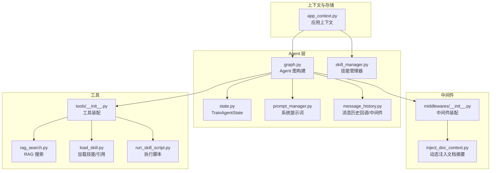
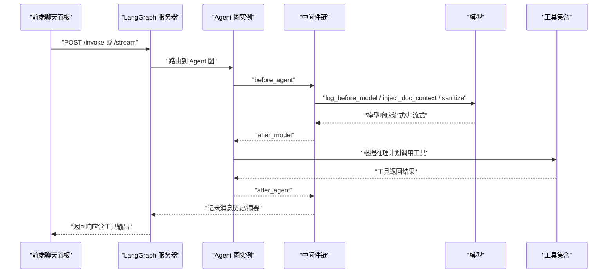
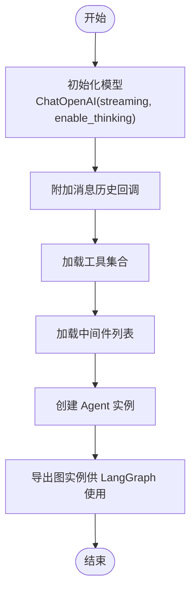
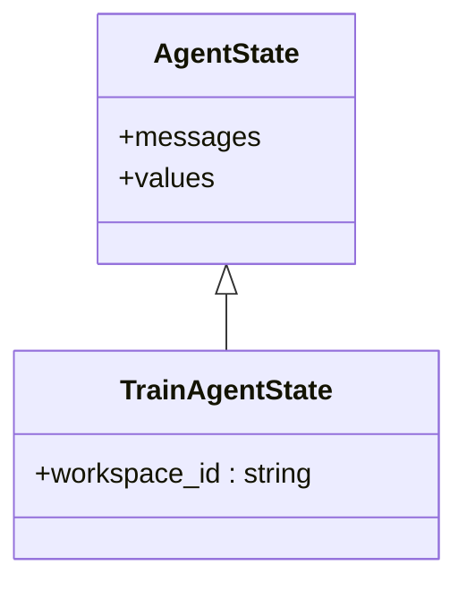
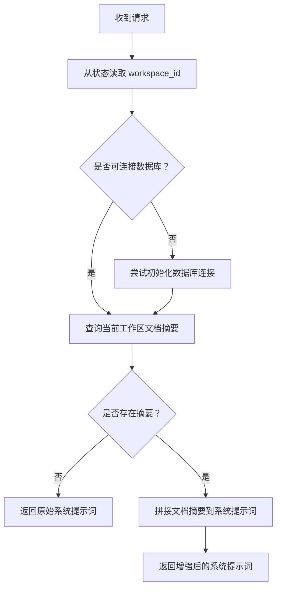
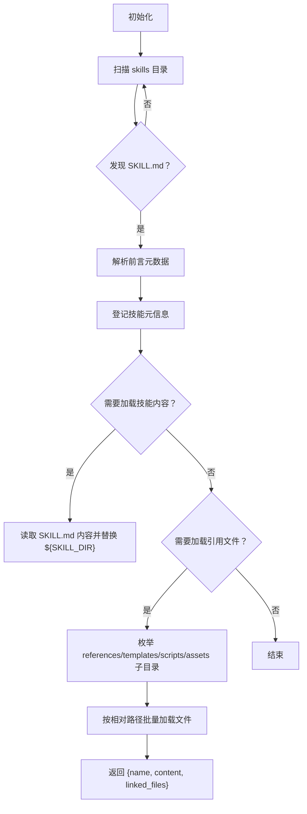
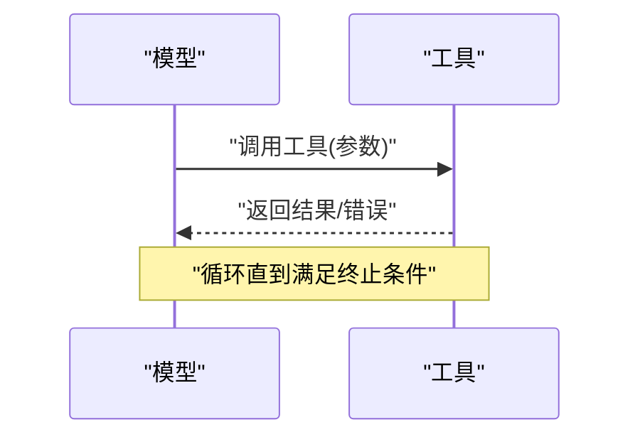
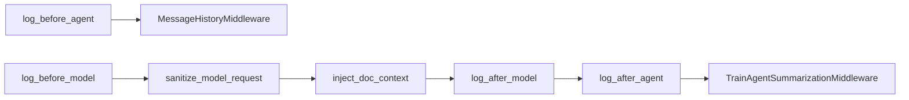
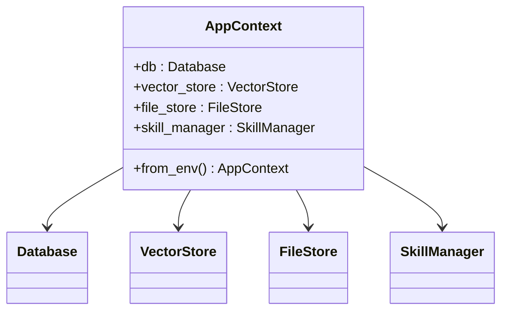
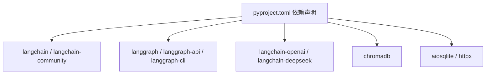

# Agent 层设计

<cite>
**本文引用的文件**
- [backend/src/agent/graph.py](file://backend/src/agent/graph.py)
- [backend/src/agent/state.py](file://backend/src/agent/state.py)
- [backend/src/agent/skill_manager.py](file://backend/src/agent/skill_manager.py)
- [backend/src/agent/prompt_manager.py](file://backend/src/agent/prompt_manager.py)
- [backend/src/agent/message_history.py](file://backend/src/agent/message_history.py)
- [backend/src/middlewares/inject_doc_context.py](file://backend/src/middlewares/inject_doc_context.py)
- [backend/src/middlewares/__init__.py](file://backend/src/middlewares/__init__.py)
- [backend/src/tools/__init__.py](file://backend/src/tools/__init__.py)
- [backend/src/tools/load_skill.py](file://backend/src/tools/load_skill.py)
- [backend/src/tools/run_skill_script.py](file://backend/src/tools/run_skill_script.py)
- [backend/src/tools/rag_search.py](file://backend/src/tools/rag_search.py)
- [backend/src/app_context.py](file://backend/src/app_context.py)
- [backend/pyproject.toml](file://backend/pyproject.toml)
- [README.md](file://README.md)
</cite>

## 目录
1. [简介](#简介)
2. [项目结构](#项目结构)
3. [核心组件](#核心组件)
4. [架构总览](#架构总览)
5. [详细组件分析](#详细组件分析)
6. [依赖分析](#依赖分析)
7. [性能考虑](#性能考虑)
8. [故障排查指南](#故障排查指南)
9. [结论](#结论)
10. [附录](#附录)

## 简介
本文件面向 Train Agent 项目的 Agent 层，系统性阐述基于 LangGraph 与 LangChain 的智能代理架构设计与实现要点。重点覆盖以下方面：
- Agent 图构建流程与控制流
- ReAct 推理模式与工具调用机制
- Agent 状态管理（TrainAgentState）
- 系统提示词设计与动态注入（文档上下文）
- 技能管理器（SkillManager）与技能加载/引用
- 中间件体系（日志、消息历史、请求净化、文档上下文注入、摘要中间件）
- Agent 生命周期管理、错误处理与性能监控
- 配置项与扩展指南

## 项目结构
Agent 层位于后端 Python 包 backend/src/agent 下，配合 tools、middlewares、storage、app_context 等模块协同工作。核心文件职责如下：
- graph.py：LangGraph/LangChain Agent 的入口与图构建
- state.py：Agent 状态模型扩展
- skill_manager.py：技能扫描、元数据解析、文件加载与引用清单
- prompt_manager.py：系统提示词常量
- message_history.py：消息持久化回调与中间件
- middlewares/*：日志、请求净化、文档上下文注入、摘要中间件
- tools/*：工具工厂与工具实现（RAG 搜索、技能加载、脚本执行、输出保存、澄清表单）

图表来源
- [backend/src/agent/graph.py:16-48](file://backend/src/agent/graph.py#L16-L48)
- [backend/src/agent/state.py:4-7](file://backend/src/agent/state.py#L4-L7)
- [backend/src/agent/prompt_manager.py:1-37](file://backend/src/agent/prompt_manager.py#L1-L37)
- [backend/src/agent/skill_manager.py:14-117](file://backend/src/agent/skill_manager.py#L14-L117)
- [backend/src/agent/message_history.py:13-143](file://backend/src/agent/message_history.py#L13-L143)
- [backend/src/middlewares/__init__.py:18-41](file://backend/src/middlewares/__init__.py#L18-L41)
- [backend/src/middlewares/inject_doc_context.py:11-41](file://backend/src/middlewares/inject_doc_context.py#L11-L41)
- [backend/src/tools/__init__.py:11-20](file://backend/src/tools/__init__.py#L11-L20)
- [backend/src/tools/rag_search.py:40-76](file://backend/src/tools/rag_search.py#L40-L76)
- [backend/src/tools/load_skill.py:13-116](file://backend/src/tools/load_skill.py#L13-L116)
- [backend/src/tools/run_skill_script.py:31-143](file://backend/src/tools/run_skill_script.py#L31-L143)
- [backend/src/app_context.py:12-31](file://backend/src/app_context.py#L12-L31)

章节来源
- [README.md:24-40](file://README.md#L24-L40)
- [backend/src/agent/graph.py:16-48](file://backend/src/agent/graph.py#L16-L48)
- [backend/src/app_context.py:12-31](file://backend/src/app_context.py#L12-L31)

## 核心组件
- Agent 图构建器：负责初始化模型、消息历史回调、工具与中间件，并创建可运行的 Agent 实例。
- 状态模型：在基础 AgentState 上扩展 workspace_id，用于多工作区隔离与上下文传递。
- 技能管理器：扫描 skills 目录，解析 SKILL.md 前言元数据，提供技能清单、加载主提示、列出/加载引用文件。
- 系统提示词：定义角色、规范、场景、引用规则与技能使用方式。
- 中间件体系：日志、消息历史、请求净化、动态注入文档摘要、消息摘要压缩。
- 工具集：RAG 搜索、加载技能、执行脚本、保存输出、澄清表单。

章节来源
- [backend/src/agent/graph.py:16-48](file://backend/src/agent/graph.py#L16-L48)
- [backend/src/agent/state.py:4-7](file://backend/src/agent/state.py#L4-L7)
- [backend/src/agent/skill_manager.py:14-117](file://backend/src/agent/skill_manager.py#L14-L117)
- [backend/src/agent/prompt_manager.py:1-37](file://backend/src/agent/prompt_manager.py#L1-L37)
- [backend/src/middlewares/__init__.py:18-41](file://backend/src/middlewares/__init__.py#L18-L41)
- [backend/src/tools/__init__.py:11-20](file://backend/src/tools/__init__.py#L11-L20)

## 架构总览
Agent 层以 LangGraph 作为运行时，LangChain 作为工具与提示词生态支撑。整体流程：
- 初始化模型与回调（启用流式输出与思考开关）
- 注册工具与中间件（日志、消息历史、请求净化、文档摘要注入、摘要中间件）
- 创建 Agent 并暴露为可流式的图实例，供前端聊天面板通过 LangGraph API 调用

图表来源
- [backend/src/agent/graph.py:16-48](file://backend/src/agent/graph.py#L16-L48)
- [backend/src/middlewares/__init__.py:18-41](file://backend/src/middlewares/__init__.py#L18-L41)
- [backend/src/agent/message_history.py:109-143](file://backend/src/agent/message_history.py#L109-L143)
- [backend/src/tools/__init__.py:11-20](file://backend/src/tools/__init__.py#L11-L20)

## 详细组件分析

### Agent 图构建与生命周期
- 模型初始化：从环境变量读取主模型、API 密钥与基础地址；启用流式输出与“思考”能力；附加消息历史回调。
- 工具与中间件：通过工厂方法创建工具与中间件列表，按顺序装配到 Agent。
- 默认图实例：在 LangGraph Serve 场景下，通过环境变量加载创建默认图实例。

图表来源
- [backend/src/agent/graph.py:16-48](file://backend/src/agent/graph.py#L16-L48)

章节来源
- [backend/src/agent/graph.py:16-48](file://backend/src/agent/graph.py#L16-L48)

### 状态管理（TrainAgentState）
- 在基础 AgentState 上新增 workspace_id 字段，用于标识当前工作区，贯穿消息历史、工具调用与检索范围。
- 中间件与工具通过状态读取 workspace_id，确保跨组件一致性。

图表来源
- [backend/src/agent/state.py:4-7](file://backend/src/agent/state.py#L4-L7)

章节来源
- [backend/src/agent/state.py:4-7](file://backend/src/agent/state.py#L4-L7)

### 系统提示词设计与动态注入
- 系统提示词定义角色职责、回答规范、场景限制、引用规范与技能使用方式。
- 动态注入中间件：根据当前 workspace_id 查询知识库文档摘要，拼接到系统提示词末尾，增强上下文相关性。

图表来源
- [backend/src/middlewares/inject_doc_context.py:11-41](file://backend/src/middlewares/inject_doc_context.py#L11-L41)
- [backend/src/agent/prompt_manager.py:1-37](file://backend/src/agent/prompt_manager.py#L1-L37)

章节来源
- [backend/src/agent/prompt_manager.py:1-37](file://backend/src/agent/prompt_manager.py#L1-L37)
- [backend/src/middlewares/inject_doc_context.py:11-41](file://backend/src/middlewares/inject_doc_context.py#L11-L41)

### 技能管理器（SkillManager）
- 扫描策略：遍历 skills 目录，查找每个子目录中的 SKILL.md，解析其 YAML 前言元数据，建立技能名到元信息的映射。
- 提供能力：
  - 列出技能（name/description）
  - 加载技能主提示内容
  - 列出技能引用文件（references、templates、scripts、assets 等子目录）
  - 按相对路径批量加载文件，支持安全路径校验（防越权）
- 设计要点：
  - 使用 progressive disclosure 模式，Agent 仅看到技能清单与描述，具体逻辑由工具按需加载。
  - 支持 ${SKILL_DIR} 占位符替换为实际技能目录，便于脚本/模板引用。

图表来源
- [backend/src/agent/skill_manager.py:14-117](file://backend/src/agent/skill_manager.py#L14-L117)

章节来源
- [backend/src/agent/skill_manager.py:14-117](file://backend/src/agent/skill_manager.py#L14-L117)

### 工具调用机制与 ReAct 推理
- 工具装配：统一在 tools/__init__.py 中创建并注册工具，包括 RAG 搜索、加载技能、执行脚本、保存输出、澄清表单。
- ReAct 流程（概念示意）：
  - 思考（Thinking）：模型基于系统提示词与上下文生成推理计划
  - 行动（Action）：选择工具与参数，调用工具执行
  - 观察（Observation）：接收工具返回，补充到上下文中
  - 再思考（Thinking）：结合观察结果再次决策
  - 结果（Final Answer）：生成最终回复

图表来源
- [backend/src/tools/__init__.py:11-20](file://backend/src/tools/__init__.py#L11-L20)
- [backend/src/tools/rag_search.py:40-76](file://backend/src/tools/rag_search.py#L40-L76)
- [backend/src/tools/load_skill.py:13-116](file://backend/src/tools/load_skill.py#L13-L116)
- [backend/src/tools/run_skill_script.py:31-143](file://backend/src/tools/run_skill_script.py#L31-L143)

章节来源
- [backend/src/tools/__init__.py:11-20](file://backend/src/tools/__init__.py#L11-L20)
- [backend/src/tools/rag_search.py:40-76](file://backend/src/tools/rag_search.py#L40-L76)
- [backend/src/tools/load_skill.py:13-116](file://backend/src/tools/load_skill.py#L13-L116)
- [backend/src/tools/run_skill_script.py:31-143](file://backend/src/tools/run_skill_script.py#L31-L143)

### 中间件系统
- 日志中间件：在模型前后与 Agent 前后打印日志，便于追踪请求与响应。
- 消息历史中间件与回调：在 Agent 前后记录消息到数据库，支持人类、AI、工具三类消息，过滤摘要消息，提取 tool_calls 与元数据。
- 请求净化中间件：对模型请求进行清洗，减少噪声。
- 文档上下文注入中间件：动态拼接当前工作区文档摘要到系统提示词。
- 摘要中间件：基于令牌数与消息数量阈值触发摘要，保留最近若干条消息，降低上下文开销。

图表来源
- [backend/src/middlewares/__init__.py:18-41](file://backend/src/middlewares/__init__.py#L18-L41)
- [backend/src/agent/message_history.py:109-143](file://backend/src/agent/message_history.py#L109-L143)
- [backend/src/middlewares/inject_doc_context.py:11-41](file://backend/src/middlewares/inject_doc_context.py#L11-L41)

章节来源
- [backend/src/middlewares/__init__.py:18-41](file://backend/src/middlewares/__init__.py#L18-L41)
- [backend/src/agent/message_history.py:13-143](file://backend/src/agent/message_history.py#L13-L143)
- [backend/src/middlewares/inject_doc_context.py:11-41](file://backend/src/middlewares/inject_doc_context.py#L11-L41)

### 应用上下文与依赖注入
- AppContext 将数据库、向量库、文件存储与技能管理器打包，从环境变量读取 DATA_DIR 并构造各组件。
- Agent 图构建与工具/中间件工厂均通过 AppContext 获取依赖，保证解耦与可测试性。

图表来源
- [backend/src/app_context.py:12-31](file://backend/src/app_context.py#L12-L31)

章节来源
- [backend/src/app_context.py:12-31](file://backend/src/app_context.py#L12-L31)

## 依赖分析
- LangChain/LangGraph 生态：版本要求与特性（如 enable_thinking、streaming）在图构建中体现。
- 向量化与嵌入：RAG 搜索依赖 VectorStore 的搜索接口。
- 数据持久化：消息历史依赖 Database；文件存储依赖 FileStore。
- 环境变量：模型、密钥、基础地址、数据目录等通过环境变量注入。

图表来源
- [backend/pyproject.toml:6-26](file://backend/pyproject.toml#L6-L26)

章节来源
- [backend/pyproject.toml:6-26](file://backend/pyproject.toml#L6-L26)

## 性能考虑
- 流式输出：模型初始化启用 streaming，提升前端交互体验。
- 上下文压缩：摘要中间件按令牌数与消息数阈值自动压缩历史消息，避免超出上下文上限。
- 输出截断：脚本执行工具对超长输出进行截断，防止撑爆上下文。
- I/O 优化：消息历史写入异步化，避免阻塞推理主流程。
- 资源限制：脚本执行设置超时时间，防止长时间阻塞。

章节来源
- [backend/src/agent/graph.py:18-26](file://backend/src/agent/graph.py#L18-L26)
- [backend/src/middlewares/__init__.py:31-40](file://backend/src/middlewares/__init__.py#L31-L40)
- [backend/src/tools/run_skill_script.py:28-143](file://backend/src/tools/run_skill_script.py#L28-L143)

## 故障排查指南
- 模型不可用或认证失败
  - 检查 MAIN_MODEL、DEEPSEEK_API_KEY、DEEPSEEK_API_BASE 是否正确配置
  - 确认 enable_thinking 与 streaming 设置是否与模型兼容
- 工具调用异常
  - RAG 搜索：确认向量库初始化与索引是否正常；检查 workspace_id 与 doc_id 传参
  - 加载技能：确认技能目录结构与 SKILL.md 前言元数据；检查 file_paths 是否越权
  - 执行脚本：确认脚本类型与解释器映射；检查脚本路径与权限；关注超时与输出截断
- 消息历史缺失
  - 确认 thread_id 是否存在；检查消息类型归一化与摘要消息过滤逻辑
- 中间件日志
  - 使用日志中间件定位 before/after 阶段的异常；关注请求净化与文档摘要注入的输出

章节来源
- [backend/src/agent/graph.py:18-26](file://backend/src/agent/graph.py#L18-L26)
- [backend/src/tools/rag_search.py:40-76](file://backend/src/tools/rag_search.py#L40-L76)
- [backend/src/tools/load_skill.py:13-116](file://backend/src/tools/load_skill.py#L13-L116)
- [backend/src/tools/run_skill_script.py:31-143](file://backend/src/tools/run_skill_script.py#L31-L143)
- [backend/src/agent/message_history.py:13-143](file://backend/src/agent/message_history.py#L13-L143)
- [backend/src/middlewares/inject_doc_context.py:11-41](file://backend/src/middlewares/inject_doc_context.py#L11-L41)

## 结论
Agent 层通过清晰的职责划分与中间件流水线，实现了可扩展、可观测、可维护的智能代理系统。借助 SkillManager 的渐进披露模式与工具链的标准化封装，Agent 能够在多工作区、多文档的复杂场景中稳定运行，并通过 RAG 与脚本执行能力完成从知识问答到内容生产的闭环。

## 附录
- 环境变量与默认值参考
  - 主模型、API 密钥、基础地址、嵌入模型、数据目录等
- 开发与测试
  - 后端测试入口与常用命令
- 扩展指南
  - 新增工具：在 tools/ 下实现并注册
  - 新增技能：在 skills/<skill>/ 下放置 SKILL.md 与资源文件
  - 新增中间件：在 middlewares/ 下实现并加入装配列表

章节来源
- [README.md:41-133](file://README.md#L41-L133)
- [backend/src/tools/__init__.py:11-20](file://backend/src/tools/__init__.py#L11-L20)
- [backend/src/agent/skill_manager.py:14-117](file://backend/src/agent/skill_manager.py#L14-L117)
- [backend/src/middlewares/__init__.py:18-41](file://backend/src/middlewares/__init__.py#L18-L41)