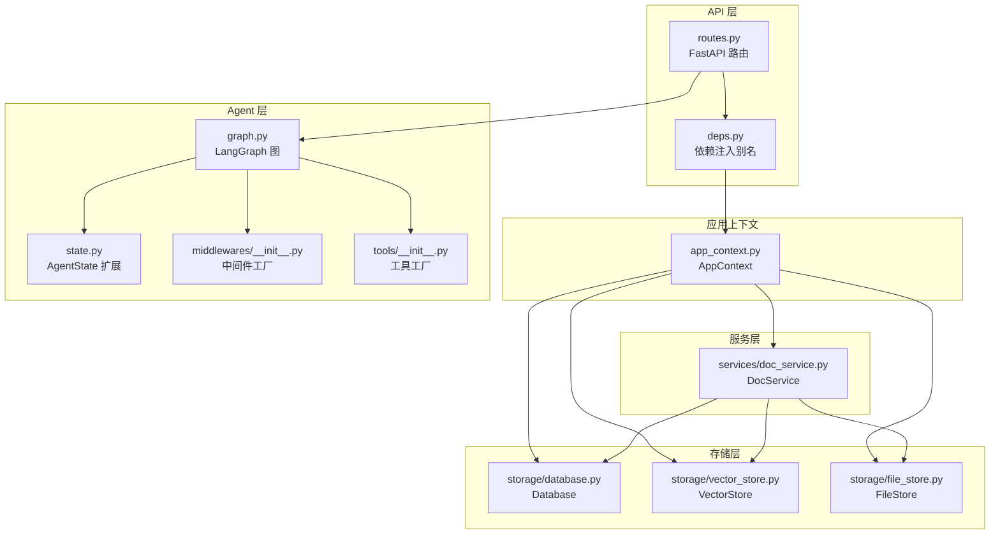
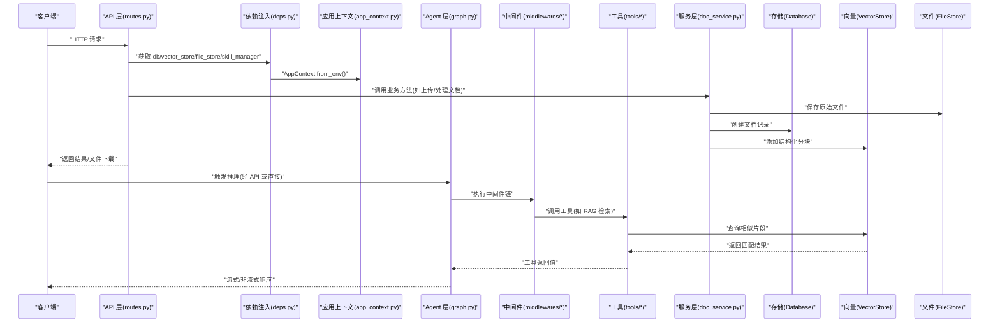
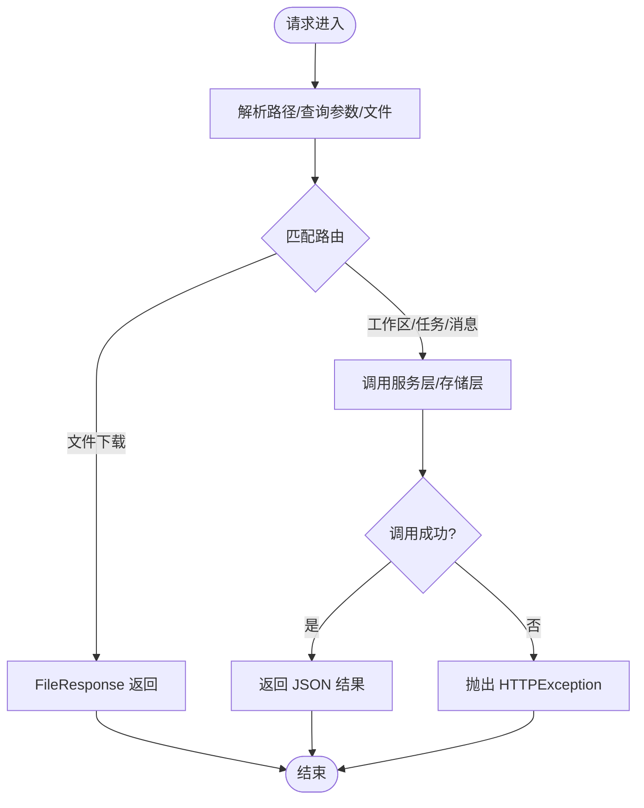
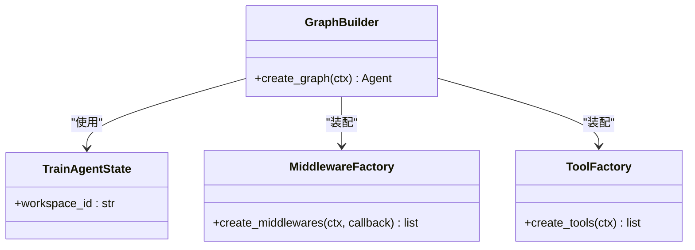
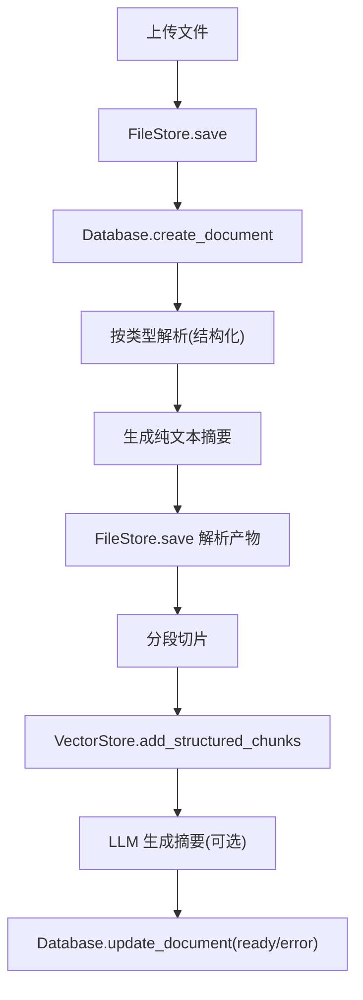
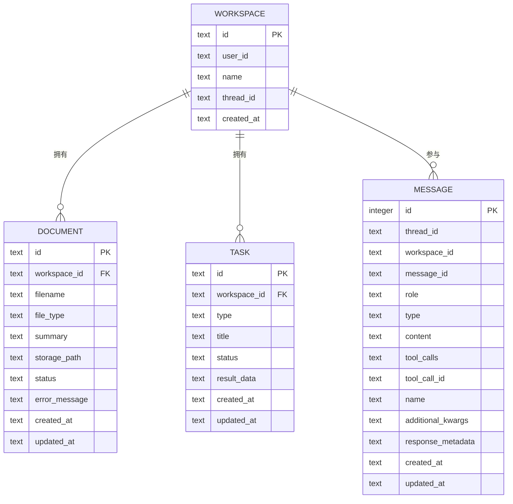
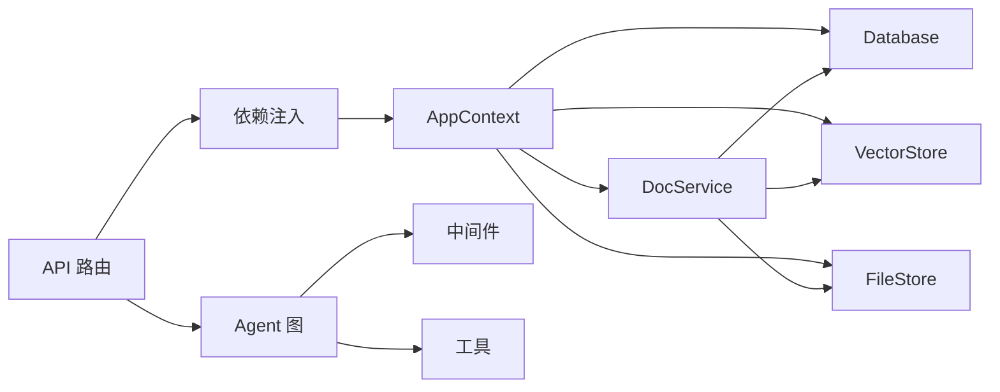

# 分层架构详解

<cite>
**本文引用的文件**
- [backend/src/api/routes.py](file://backend/src/api/routes.py)
- [backend/src/api/deps.py](file://backend/src/api/deps.py)
- [backend/src/app_context.py](file://backend/src/app_context.py)
- [backend/src/agent/graph.py](file://backend/src/agent/graph.py)
- [backend/src/agent/state.py](file://backend/src/agent/state.py)
- [backend/src/middlewares/__init__.py](file://backend/src/middlewares/__init__.py)
- [backend/src/middlewares/logging_middlewares.py](file://backend/src/middlewares/logging_middlewares.py)
- [backend/src/middlewares/inject_doc_context.py](file://backend/src/middlewares/inject_doc_context.py)
- [backend/src/tools/__init__.py](file://backend/src/tools/__init__.py)
- [backend/src/tools/rag_search.py](file://backend/src/tools/rag_search.py)
- [backend/src/services/doc_service.py](file://backend/src/services/doc_service.py)
- [backend/src/storage/database.py](file://backend/src/storage/database.py)
- [backend/src/storage/vector_store.py](file://backend/src/storage/vector_store.py)
- [backend/src/storage/file_store.py](file://backend/src/storage/file_store.py)
- [backend/pyproject.toml](file://backend/pyproject.toml)
</cite>

## 目录
1. [引言](#引言)
2. [项目结构](#项目结构)
3. [核心组件](#核心组件)
4. [架构总览](#架构总览)
5. [详细组件分析](#详细组件分析)
6. [依赖分析](#依赖分析)
7. [性能考虑](#性能考虑)
8. [故障排查指南](#故障排查指南)
9. [结论](#结论)
10. [附录](#附录)

## 引言
本文件面向 Train Agent 项目的四层架构设计进行系统化梳理，覆盖 API 层（FastAPI 路由与依赖注入）、Agent 层（LangGraph 智能推理）、服务层（业务编排逻辑）与存储层（数据持久化）。文档旨在帮助开发者与产品人员理解各层职责边界、内部组件关系、数据传递方式与错误处理机制，并提供可操作的扩展点与最佳实践。

## 项目结构
后端采用“按层+按功能”的混合组织方式：
- API 层：FastAPI 应用、路由定义、依赖注入
- Agent 层：LangGraph 图构建、状态模型、中间件与工具
- 服务层：文档处理等业务编排
- 存储层：数据库、向量库、文件系统

图表来源
- [backend/src/api/routes.py:1-189](file://backend/src/api/routes.py#L1-L189)
- [backend/src/api/deps.py:1-30](file://backend/src/api/deps.py#L1-L30)
- [backend/src/app_context.py:1-31](file://backend/src/app_context.py#L1-L31)
- [backend/src/agent/graph.py:1-49](file://backend/src/agent/graph.py#L1-L49)
- [backend/src/agent/state.py:1-7](file://backend/src/agent/state.py#L1-L7)
- [backend/src/middlewares/__init__.py:1-41](file://backend/src/middlewares/__init__.py#L1-L41)
- [backend/src/tools/__init__.py:1-20](file://backend/src/tools/__init__.py#L1-L20)
- [backend/src/services/doc_service.py:1-218](file://backend/src/services/doc_service.py#L1-L218)
- [backend/src/storage/database.py:1-379](file://backend/src/storage/database.py#L1-L379)
- [backend/src/storage/vector_store.py:1-177](file://backend/src/storage/vector_store.py#L1-L177)
- [backend/src/storage/file_store.py:1-39](file://backend/src/storage/file_store.py#L1-L39)

章节来源
- [backend/src/api/routes.py:1-189](file://backend/src/api/routes.py#L1-L189)
- [backend/src/api/deps.py:1-30](file://backend/src/api/deps.py#L1-L30)
- [backend/src/app_context.py:1-31](file://backend/src/app_context.py#L1-L31)
- [backend/src/services/doc_service.py:1-218](file://backend/src/services/doc_service.py#L1-L218)
- [backend/src/storage/database.py:1-379](file://backend/src/storage/database.py#L1-L379)
- [backend/src/storage/vector_store.py:1-177](file://backend/src/storage/vector_store.py#L1-L177)
- [backend/src/storage/file_store.py:1-39](file://backend/src/storage/file_store.py#L1-L39)

## 核心组件
- API 层
  - FastAPI 应用与路由：统一入口，负责请求解析、参数校验、调用服务层与存储层、返回响应或文件下载。
  - 依赖注入：通过 AppContext 统一提供数据库、向量库、文件存储与技能管理器实例；同时提供 DocService 与 LLM 实例。
- Agent 层
  - LangGraph 图：封装模型、工具、中间件与状态；支持流式回调与消息历史记录。
  - 中间件：日志、消息历史、请求净化、文档上下文注入、摘要中间件等。
  - 工具：RAG 检索、加载技能、运行脚本、保存输出、澄清表单等。
- 服务层
  - DocService：文档上传、解析、切片、向量化、摘要生成、删除清理；协调数据库、文件存储与向量库。
- 存储层
  - Database：SQLite 异步访问，维护工作区、文档、任务、消息表及索引。
  - VectorStore：基于 Chroma 的持久化向量库，支持 Dashscope 嵌入。
  - FileStore：本地文件系统存取，支持同步与异步写入。

章节来源
- [backend/src/api/routes.py:1-189](file://backend/src/api/routes.py#L1-L189)
- [backend/src/api/deps.py:1-30](file://backend/src/api/deps.py#L1-L30)
- [backend/src/app_context.py:1-31](file://backend/src/app_context.py#L1-L31)
- [backend/src/agent/graph.py:1-49](file://backend/src/agent/graph.py#L1-L49)
- [backend/src/middlewares/__init__.py:1-41](file://backend/src/middlewares/__init__.py#L1-L41)
- [backend/src/tools/__init__.py:1-20](file://backend/src/tools/__init__.py#L1-L20)
- [backend/src/services/doc_service.py:1-218](file://backend/src/services/doc_service.py#L1-L218)
- [backend/src/storage/database.py:1-379](file://backend/src/storage/database.py#L1-L379)
- [backend/src/storage/vector_store.py:1-177](file://backend/src/storage/vector_store.py#L1-L177)
- [backend/src/storage/file_store.py:1-39](file://backend/src/storage/file_store.py#L1-L39)

## 架构总览
四层架构的交互流程如下：

图表来源
- [backend/src/api/routes.py:1-189](file://backend/src/api/routes.py#L1-L189)
- [backend/src/api/deps.py:1-30](file://backend/src/api/deps.py#L1-L30)
- [backend/src/app_context.py:1-31](file://backend/src/app_context.py#L1-L31)
- [backend/src/agent/graph.py:1-49](file://backend/src/agent/graph.py#L1-L49)
- [backend/src/middlewares/__init__.py:1-41](file://backend/src/middlewares/__init__.py#L1-L41)
- [backend/src/tools/__init__.py:1-20](file://backend/src/tools/__init__.py#L1-L20)
- [backend/src/services/doc_service.py:1-218](file://backend/src/services/doc_service.py#L1-L218)
- [backend/src/storage/database.py:1-379](file://backend/src/storage/database.py#L1-L379)
- [backend/src/storage/vector_store.py:1-177](file://backend/src/storage/vector_store.py#L1-L177)
- [backend/src/storage/file_store.py:1-39](file://backend/src/storage/file_store.py#L1-L39)

## 详细组件分析

### API 层：FastAPI 路由与依赖注入
- 职责边界
  - 负责 HTTP 接口定义、CORS 配置、静态资源挂载、文件下载、启动事件初始化数据库。
  - 将业务请求委派给服务层与存储层，处理异常并返回标准化响应。
- 内部关系
  - 依赖注入通过 deps.py 提供 db、vector_store、file_store、skill_manager、doc_service 等实例。
  - AppContext.from_env() 统一从环境变量读取 DATA_DIR 并构造各存储与管理器。
- 数据传递
  - 路由接收 Pydantic 模型参数，调用服务层方法，返回字典或文件响应。
- 错误处理
  - 对业务异常（如重复命名、未找到）转换为 HTTP 409/404；对文件不存在返回 404；对 LLM 失败进行降级处理。
- 最佳实践
  - 使用后台任务异步处理耗时流程（如文档处理），避免阻塞请求线程。
  - 启动阶段显式初始化数据库连接，确保后续操作可用。

图表来源
- [backend/src/api/routes.py:1-189](file://backend/src/api/routes.py#L1-L189)
- [backend/src/api/deps.py:1-30](file://backend/src/api/deps.py#L1-L30)
- [backend/src/app_context.py:1-31](file://backend/src/app_context.py#L1-L31)

章节来源
- [backend/src/api/routes.py:1-189](file://backend/src/api/routes.py#L1-L189)
- [backend/src/api/deps.py:1-30](file://backend/src/api/deps.py#L1-L30)
- [backend/src/app_context.py:1-31](file://backend/src/app_context.py#L1-L31)

### Agent 层：LangGraph 智能推理
- 职责边界
  - 构建推理图，集成模型、工具、中间件与状态；通过回调记录消息历史；支持流式输出。
- 内部关系
  - graph.py 创建 ChatOpenAI，装配 MessageHistoryCallback、工具与中间件，返回可运行的 Agent。
  - state.py 扩展 AgentState，增加 workspace_id 字段承载工作区上下文。
  - middlewares/__init__.py 定义中间件顺序：日志前后、消息历史、请求净化、文档上下文注入、模型摘要等。
  - tools/__init__.py 组装工具：RAG 检索、加载技能、运行脚本、保存输出、澄清表单。
- 数据传递
  - AgentState 作为共享状态，贯穿中间件与工具；工具通过 ToolRuntime 访问 state 获取 workspace_id。
- 错误处理
  - 工具内部捕获异常并返回可读提示；中间件记录工具调用信息便于追踪。
- 最佳实践
  - 明确中间件顺序，确保日志、上下文注入、请求净化在模型调用前完成。
  - 使用回调记录消息历史，结合数据库实现对话恢复与审计。

图表来源
- [backend/src/agent/state.py:1-7](file://backend/src/agent/state.py#L1-L7)
- [backend/src/agent/graph.py:1-49](file://backend/src/agent/graph.py#L1-L49)
- [backend/src/middlewares/__init__.py:1-41](file://backend/src/middlewares/__init__.py#L1-L41)
- [backend/src/tools/__init__.py:1-20](file://backend/src/tools/__init__.py#L1-L20)

章节来源
- [backend/src/agent/graph.py:1-49](file://backend/src/agent/graph.py#L1-L49)
- [backend/src/agent/state.py:1-7](file://backend/src/agent/state.py#L1-L7)
- [backend/src/middlewares/__init__.py:1-41](file://backend/src/middlewares/__init__.py#L1-L41)
- [backend/src/tools/__init__.py:1-20](file://backend/src/tools/__init__.py#L1-L20)

### 服务层：业务编排逻辑（DocService）
- 职责边界
  - 负责文档全生命周期管理：上传、解析、切片、向量化、摘要、删除清理。
- 内部关系
  - 协调 Database、VectorStore、FileStore；根据文件类型选择解析器；调用 LLM 生成摘要。
- 数据传递
  - 从 FileStore 读取原始内容，写入解析后的 Markdown；向 VectorStore 添加结构化分块；更新 Database 状态。
- 错误处理
  - 捕获解析/嵌入/LLM 异常，回写错误状态并记录日志；对空文本场景给出明确提示。
- 最佳实践
  - 使用后台任务异步处理长耗时流程；对大文本进行分块与分页处理；提供降级策略（如无 LLM 时截断文本）。

图表来源
- [backend/src/services/doc_service.py:1-218](file://backend/src/services/doc_service.py#L1-L218)
- [backend/src/storage/file_store.py:1-39](file://backend/src/storage/file_store.py#L1-L39)
- [backend/src/storage/vector_store.py:1-177](file://backend/src/storage/vector_store.py#L1-L177)
- [backend/src/storage/database.py:1-379](file://backend/src/storage/database.py#L1-L379)

章节来源
- [backend/src/services/doc_service.py:1-218](file://backend/src/services/doc_service.py#L1-L218)

### 存储层：数据持久化
- Database
  - 异步 SQLite 访问，自动建表与迁移；提供工作区、文档、任务、消息表的 CRUD 与查询。
  - 支持消息 JSON 字段序列化/反序列化，保证兼容性与扩展性。
- VectorStore
  - 基于 Chroma 的持久化集合，按 workspace_id 命名；使用 Dashscope 嵌入函数。
  - 支持结构化分块与元数据检索，提供删除与清理能力。
- FileStore
  - 本地文件系统存取，支持同步与异步写入；提供工作区级目录隔离与批量清理。

图表来源
- [backend/src/storage/database.py:1-379](file://backend/src/storage/database.py#L1-L379)

章节来源
- [backend/src/storage/database.py:1-379](file://backend/src/storage/database.py#L1-L379)
- [backend/src/storage/vector_store.py:1-177](file://backend/src/storage/vector_store.py#L1-L177)
- [backend/src/storage/file_store.py:1-39](file://backend/src/storage/file_store.py#L1-L39)

## 依赖分析
- 外部依赖
  - LangChain/LangGraph 生态用于智能体与中间件；FastAPI/Uvicorn 提供 API 服务；ChromaDB/DashScope 提供向量能力；aiosqlite 提供异步数据库访问。
- 内部耦合
  - API 层仅依赖 AppContext 提供的服务与存储实例，保持低耦合。
  - Agent 层通过中间件与工具解耦具体实现，便于替换与扩展。
  - 服务层通过统一接口与存储层交互，避免直接依赖具体实现细节。
- 循环依赖
  - 未发现循环导入；模块间通过工厂函数与上下文对象解耦。

图表来源
- [backend/src/api/deps.py:1-30](file://backend/src/api/deps.py#L1-L30)
- [backend/src/app_context.py:1-31](file://backend/src/app_context.py#L1-L31)
- [backend/src/services/doc_service.py:1-218](file://backend/src/services/doc_service.py#L1-L218)
- [backend/src/storage/database.py:1-379](file://backend/src/storage/database.py#L1-L379)
- [backend/src/storage/vector_store.py:1-177](file://backend/src/storage/vector_store.py#L1-L177)
- [backend/src/storage/file_store.py:1-39](file://backend/src/storage/file_store.py#L1-L39)

章节来源
- [backend/src/api/deps.py:1-30](file://backend/src/api/deps.py#L1-L30)
- [backend/src/app_context.py:1-31](file://backend/src/app_context.py#L1-L31)
- [backend/src/services/doc_service.py:1-218](file://backend/src/services/doc_service.py#L1-L218)
- [backend/pyproject.toml:1-41](file://backend/pyproject.toml#L1-L41)

## 性能考虑
- 异步化
  - 使用 aiosqlite 与 asyncio.to_thread 降低阻塞风险；后台任务处理文档处理流程。
- 批量化
  - 向量库分批写入，控制批次大小以平衡吞吐与内存占用。
- 缓存与索引
  - 通过消息索引与数据库迁移字段提升查询效率；中间件按需注入上下文减少无关信息。
- 嵌入与检索
  - 合理设置 top_k 与过滤条件，避免过大的检索结果集；对高开销 LLM 调用进行摘要与限长处理。

## 故障排查指南
- 常见问题定位
  - 文档处理失败：检查服务层异常捕获与数据库状态更新；确认嵌入服务可用与磁盘空间充足。
  - 向量检索为空：确认集合存在且已添加分块；核对 workspace_id 与 doc_id 过滤条件。
  - 文件下载 404：确认静态挂载目录存在与路径正确。
  - Agent 日志缺失：检查中间件顺序与回调注册是否生效。
- 关键日志位置
  - API 层：请求进入/退出、异常转换、文件下载。
  - 服务层：解析、切片、索引、摘要、错误回写。
  - 中间件：模型调用前后、工具调用列表。
- 建议排查步骤
  - 启动阶段查看数据库初始化日志；确认 DATA_DIR 下数据目录存在。
  - 观察服务层错误回写与 LLM 降级行为；必要时临时禁用摘要中间件定位瓶颈。

章节来源
- [backend/src/api/routes.py:1-189](file://backend/src/api/routes.py#L1-L189)
- [backend/src/services/doc_service.py:1-218](file://backend/src/services/doc_service.py#L1-L218)
- [backend/src/middlewares/logging_middlewares.py:1-59](file://backend/src/middlewares/logging_middlewares.py#L1-L59)
- [backend/src/middlewares/inject_doc_context.py:1-41](file://backend/src/middlewares/inject_doc_context.py#L1-L41)

## 结论
本项目通过清晰的四层架构实现了从 API 入口到智能推理再到业务编排与持久化的完整闭环。API 层提供稳定接口与依赖注入，Agent 层以中间件与工具实现可插拔的推理能力，服务层承担复杂业务流程的编排，存储层提供可靠的数据持久化。建议在扩展新功能时遵循“新增工具/中间件/存储适配器”的最小侵入原则，并持续完善日志与监控体系。

## 附录
- 环境变量与配置要点
  - DATA_DIR：数据根目录，决定数据库、向量库与文件存储的物理路径。
  - MAIN_MODEL/DEEPSEEK_*：主模型与推理服务配置。
  - SUMMARIZATION_MODEL/SUMMARIZATION_*：摘要中间件使用的模型与服务配置。
  - EMBEDDING_MODEL/EMBEDDING_*：嵌入模型与服务配置。
- 层间接口规范
  - API 层仅依赖 AppContext 提供的 db/vector_store/file_store/skill_manager/doc_service。
  - Agent 层通过中间件与工具访问存储与外部服务，不直接依赖 API。
  - 服务层通过统一接口与存储层交互，避免跨层耦合。
- 扩展点
  - 新增工具：在 tools/__init__.py 注册；在 Agent 层自动装配。
  - 新增中间件：在 middlewares/__init__.py 指定执行顺序。
  - 新增存储适配器：实现统一接口并在 AppContext 中注入。

章节来源
- [backend/src/app_context.py:1-31](file://backend/src/app_context.py#L1-L31)
- [backend/src/middlewares/__init__.py:1-41](file://backend/src/middlewares/__init__.py#L1-L41)
- [backend/src/tools/__init__.py:1-20](file://backend/src/tools/__init__.py#L1-L20)
- [backend/src/agent/graph.py:1-49](file://backend/src/agent/graph.py#L1-L49)