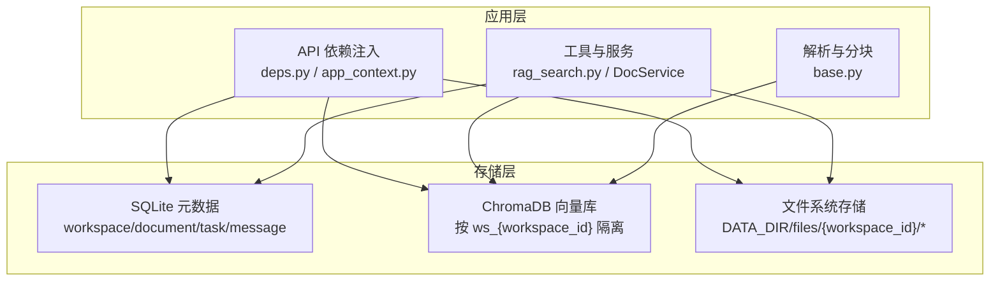
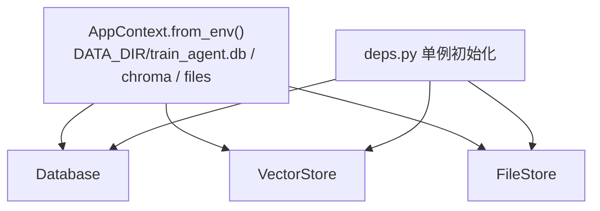
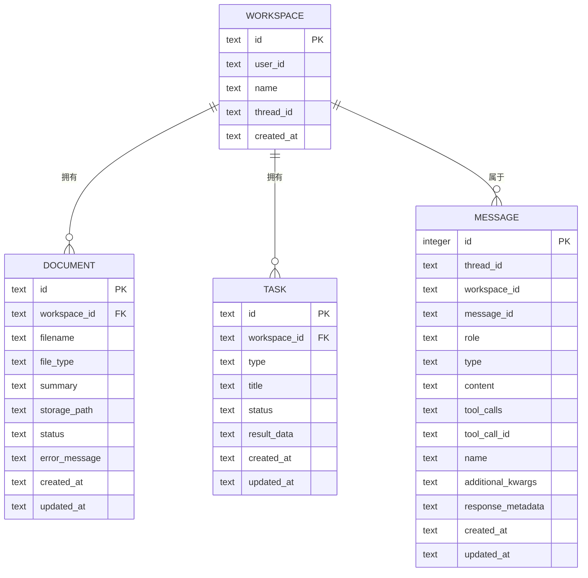
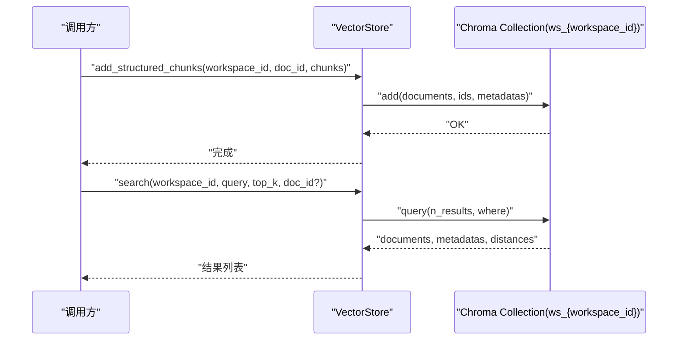
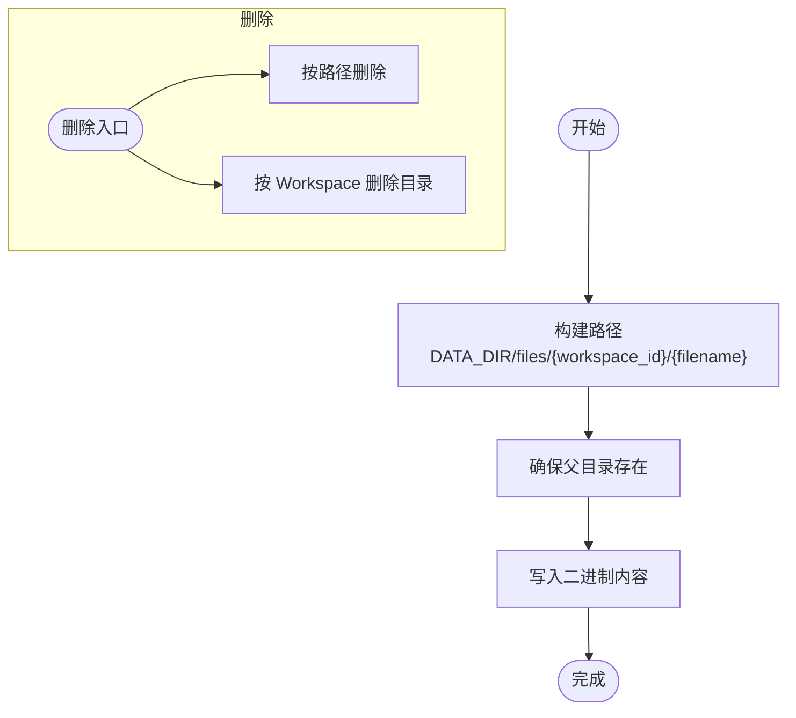
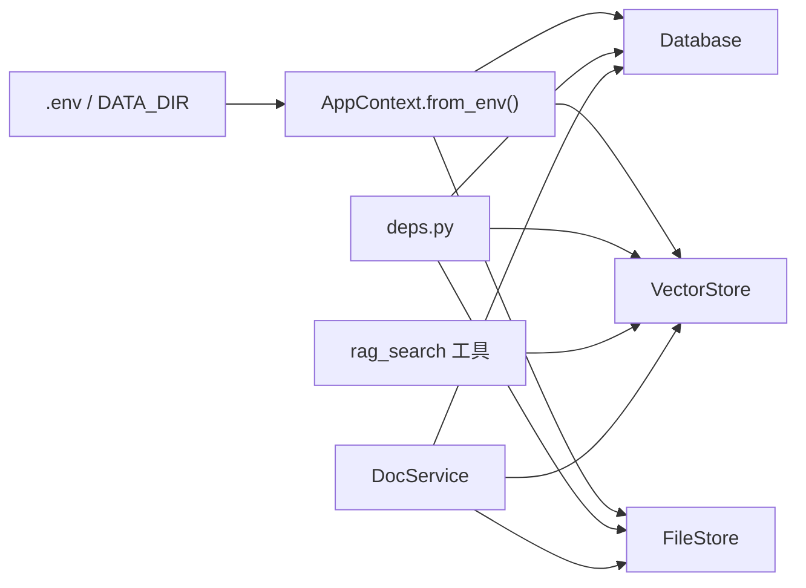
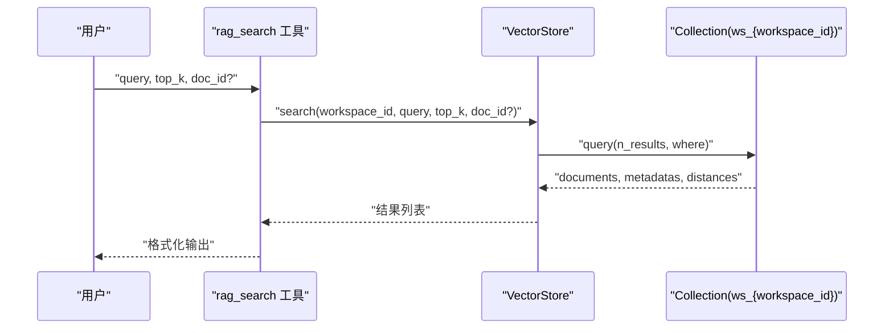

# 存储层设计

<cite>
**本文引用的文件**
- [database.py](file://backend/src/storage/database.py)
- [vector_store.py](file://backend/src/storage/vector_store.py)
- [file_store.py](file://backend/src/storage/file_store.py)
- [base.py](file://backend/src/parsers/base.py)
- [inspect_chunks.py](file://backend/scripts/inspect_chunks.py)
- [app_context.py](file://backend/src/app_context.py)
- [deps.py](file://backend/src/api/deps.py)
- [rag_search.py](file://backend/src/tools/rag_search.py)
- [backend-architecture.md](file://docs/backend-architecture.md)
</cite>

## 目录
1. [简介](#简介)
2. [项目结构](#项目结构)
3. [核心组件](#核心组件)
4. [架构总览](#架构总览)
5. [组件详解](#组件详解)
6. [依赖关系分析](#依赖关系分析)
7. [性能考量](#性能考量)
8. [故障排查指南](#故障排查指南)
9. [结论](#结论)
10. [附录](#附录)

## 简介
本文件面向 Train Agent 项目的存储层，系统性阐述三层存储架构的设计与实现：SQLite 关系型元数据存储、ChromaDB 向量数据库语义索引、文件系统存储。文档覆盖数据模型、索引策略、查询优化、Workspace 隔离机制、数据迁移与备份恢复、性能调优与最佳实践，并提供可操作的 SQL 模式、向量检索示例与文件管理建议。

## 项目结构
存储层位于后端目录 backend/src/storage，由三个核心模块组成：
- SQLite 元数据存储：负责工作区、文档、任务、消息等结构化数据的持久化与事务一致性。
- ChromaDB 向量存储：负责将文档切片后的文本嵌入并按 Workspace 隔离，支持语义检索。
- 文件系统存储：负责原始文件与产出物的落盘与清理。

图表来源
- [database.py:25-78](file://backend/src/storage/database.py#L25-L78)
- [vector_store.py:44-49](file://backend/src/storage/vector_store.py#L44-L49)
- [file_store.py:6-9](file://backend/src/storage/file_store.py#L6-L9)
- [app_context.py:19-30](file://backend/src/app_context.py#L19-L30)
- [deps.py:13-29](file://backend/src/api/deps.py#L13-L29)

章节来源
- [database.py:14-78](file://backend/src/storage/database.py#L14-L78)
- [vector_store.py:39-49](file://backend/src/storage/vector_store.py#L39-L49)
- [file_store.py:6-9](file://backend/src/storage/file_store.py#L6-L9)
- [app_context.py:19-30](file://backend/src/app_context.py#L19-L30)
- [deps.py:13-29](file://backend/src/api/deps.py#L13-L29)

## 核心组件
- SQLite 元数据存储
  - 表：workspace、document、task、message；外键约束与级联删除保障数据一致性。
  - 索引：message 表按 (thread_id, id DESC) 建立复合索引，提升分页查询效率。
  - JSON 字段：message.content、tool_calls、additional_kwargs、response_metadata 使用 JSON 序列化存储。
- ChromaDB 向量存储
  - Collection 命名：ws_{workspace_id}，按 Workspace 隔离。
  - 元数据：doc_id、filename、chunk_index、section_title、chapter_title、page_start、page_end、section_level。
  - 查询：支持按 doc_id 过滤，返回 documents、metadatas、distances。
- 文件系统存储
  - 路径组织：DATA_DIR/files/{workspace_id}/{filename}，支持同步与异步写入。
  - 清理：支持按文件路径删除与按 Workspace 整体删除。

章节来源
- [database.py:25-78](file://backend/src/storage/database.py#L25-L78)
- [database.py:159-280](file://backend/src/storage/database.py#L159-L280)
- [vector_store.py:44-49](file://backend/src/storage/vector_store.py#L44-L49)
- [vector_store.py:124-163](file://backend/src/storage/vector_store.py#L124-L163)
- [file_store.py:11-28](file://backend/src/storage/file_store.py#L11-L28)

## 架构总览
三层存储通过应用上下文统一注入到 API 与工具链中，形成“元数据驱动 + 语义检索 + 文件落盘”的闭环。

图表来源
- [app_context.py:19-30](file://backend/src/app_context.py#L19-L30)
- [deps.py:13-29](file://backend/src/api/deps.py#L13-L29)

章节来源
- [app_context.py:19-30](file://backend/src/app_context.py#L19-L30)
- [deps.py:13-29](file://backend/src/api/deps.py#L13-L29)
- [backend-architecture.md:164-177](file://docs/backend-architecture.md#L164-L177)

## 组件详解

### SQLite 元数据存储（Database）
- 数据模型与约束
  - workspace：主键 id，外键约束通过 PRAGMA foreign_keys = ON 生效；提供按 user_id 与名称去重的创建工作区逻辑。
  - document：外键 workspace_id ON DELETE CASCADE；新增列 error_message、updated_at 支持迁移。
  - task：外键 workspace_id ON DELETE CASCADE；状态字段 status 与结果字段 result_data。
  - message：复合唯一索引 (thread_id, message_id, role)，避免重复记录；JSON 字段序列化/反序列化。
- 索引策略
  - idx_message_thread_id_id(thread_id, id DESC)：支持按线程分页读取，limit + offset 形式的高效翻页。
- 查询优化
  - 分页参数限制在 [1,100] 区间，防止超大 limit 导致性能问题。
  - ON CONFLICT UPSERT 保证消息幂等写入。
- 迁移与兼容
  - 动态检测列是否存在，按需添加列并设置默认值，确保版本演进平滑。

图表来源
- [database.py:27-71](file://backend/src/storage/database.py#L27-L71)

章节来源
- [database.py:25-78](file://backend/src/storage/database.py#L25-L78)
- [database.py:111-142](file://backend/src/storage/database.py#L111-L142)
- [database.py:159-280](file://backend/src/storage/database.py#L159-L280)
- [database.py:313-379](file://backend/src/storage/database.py#L313-L379)

### ChromaDB 向量存储（VectorStore）
- 隔离机制
  - Collection 名称采用 ws_{workspace_id}，天然隔离不同 Workspace 的向量数据。
- 元数据设计
  - doc_id、filename、chunk_index、section_title、chapter_title、page_start、page_end、section_level。
- 写入流程
  - add_chunks：兼容旧接口，直接写入纯文本。
  - add_structured_chunks：推荐使用，基于 ChunkWithMetadata，自动转换为文档与元数据。
- 查询流程
  - search：支持按 doc_id 过滤，返回 documents、metadatas、distances，便于溯源与排序。

图表来源
- [vector_store.py:91-122](file://backend/src/storage/vector_store.py#L91-L122)
- [vector_store.py:124-163](file://backend/src/storage/vector_store.py#L124-L163)

章节来源
- [vector_store.py:44-49](file://backend/src/storage/vector_store.py#L44-L49)
- [vector_store.py:91-122](file://backend/src/storage/vector_store.py#L91-L122)
- [vector_store.py:124-163](file://backend/src/storage/vector_store.py#L124-L163)
- [base.py:30-41](file://backend/src/parsers/base.py#L30-L41)

### 文件系统存储（FileStore）
- 路径组织
  - DATA_DIR/files/{workspace_id}/{filename}，确保每个 Workspace 的文件相互隔离。
- 写入方式
  - 同步 save：直接写入。
  - 异步 save_async：通过 asyncio.to_thread 将阻塞 I/O 放在线程池中执行，避免阻塞事件循环。
- 删除策略
  - 按路径删除单个文件。
  - 按 Workspace 删除整个目录树，适合 Workspace 彻底清理。

图表来源
- [file_store.py:11-28](file://backend/src/storage/file_store.py#L11-L28)
- [file_store.py:30-39](file://backend/src/storage/file_store.py#L30-L39)

章节来源
- [file_store.py:6-9](file://backend/src/storage/file_store.py#L6-L9)
- [file_store.py:11-28](file://backend/src/storage/file_store.py#L11-L28)
- [file_store.py:30-39](file://backend/src/storage/file_store.py#L30-L39)

### Workspace 隔离机制
- 数据库外键约束
  - document、task、message 的 workspace_id 外键均指向 workspace.id，并启用 ON DELETE CASCADE，删除 Workspace 会级联删除其下所有子对象。
- 向量集合命名规范
  - ws_{workspace_id}，天然隔离不同 Workspace 的向量集合。
- 文件路径组织
  - DATA_DIR/files/{workspace_id}，按 Workspace 划分目录，避免文件冲突与跨空间访问。

章节来源
- [database.py:34-55](file://backend/src/storage/database.py#L34-L55)
- [vector_store.py:44-49](file://backend/src/storage/vector_store.py#L44-L49)
- [file_store.py:11-16](file://backend/src/storage/file_store.py#L11-L16)

### 数据迁移策略
- SQLite 迁移
  - 通过 _migrate_tables 动态检测列是否存在，按需添加列（如 error_message、updated_at）并设置默认值，保证历史数据兼容。
- 向量存储迁移
  - 保持 Collection 名称 ws_{workspace_id}，无需重命名；如需变更元数据结构，可在写入侧升级 ChunkWithMetadata 的 to_metadata 输出。
- 文件存储迁移
  - 保持 DATA_DIR/files 结构不变；如需调整命名规则，可通过批量重命名脚本或工具进行迁移。

章节来源
- [database.py:80-104](file://backend/src/storage/database.py#L80-L104)
- [vector_store.py:44-49](file://backend/src/storage/vector_store.py#L44-L49)
- [file_store.py:11-16](file://backend/src/storage/file_store.py#L11-L16)

### 备份与恢复方案
- SQLite 备份
  - 直接复制 train_agent.db 文件；生产环境建议在停机窗口或 WAL 模式下进行一致性备份。
- 向量库备份
  - 复制 DATA_DIR/chroma 目录；如需跨平台迁移，建议先停止写入，再复制目录。
- 文件存储备份
  - 复制 DATA_DIR/files 目录；可按 Workspace 粒度进行增量备份。

章节来源
- [app_context.py:22-26](file://backend/src/app_context.py#L22-L26)

### 性能调优建议
- SQLite
  - 合理使用索引：已为 message 表建立 (thread_id, id DESC) 复合索引，满足分页场景。
  - 控制分页大小：list_thread_messages 限制 limit 在 [1,100]，避免过大的 offset。
  - JSON 字段：content、tool_calls、additional_kwargs、response_metadata 使用 JSON 存储，注意避免过度嵌套。
- 向量库
  - 批量写入：add_chunks/add_structured_chunks 默认 batch_size=20，可根据硬件能力调整。
  - 查询过滤：search 支持按 doc_id 过滤，缩小搜索空间，提高召回质量与速度。
  - 元数据精简：仅保留必要字段，减少元数据体积。
- 文件存储
  - 异步写入：优先使用 save_async，避免阻塞主线程。
  - 路径组织：按 Workspace 划分目录，减少单目录文件数量，提升文件系统性能。

章节来源
- [database.py:73-74](file://backend/src/storage/database.py#L73-L74)
- [database.py:234-262](file://backend/src/storage/database.py#L234-L262)
- [vector_store.py:63-64](file://backend/src/storage/vector_store.py#L63-L64)
- [vector_store.py:129](file://backend/src/storage/vector_store.py#L129)
- [file_store.py:18-28](file://backend/src/storage/file_store.py#L18-L28)

### 查询与使用示例

- SQL 模式要点
  - workspace：主键 id，外键约束启用，支持按 user_id 查询。
  - document：外键 workspace_id ON DELETE CASCADE，新增 error_message、updated_at。
  - task：外键 workspace_id ON DELETE CASCADE，状态字段 status。
  - message：复合唯一索引 (thread_id, message_id, role)，JSON 字段序列化。

- 向量查询示例
  - 语义检索：调用 VectorStore.search(workspace_id, query, top_k, doc_id?)
  - 定位信息：返回 documents、metadatas、distances，结合 filename、chunk_index、section_title、page_start/page_end 进行溯源展示。

- 文件管理最佳实践
  - 上传：FileStore.save_async 写入，返回绝对路径。
  - 删除：按 doc_id 删除对应文件与向量，确保一致性。
  - 清理：Workspace 删除时，先删除文件再删除向量集合，最后删除数据库记录。

章节来源
- [database.py:25-78](file://backend/src/storage/database.py#L25-L78)
- [vector_store.py:124-163](file://backend/src/storage/vector_store.py#L124-L163)
- [file_store.py:18-28](file://backend/src/storage/file_store.py#L18-L28)

## 依赖关系分析
- 依赖注入
  - app_context.py 从环境变量 DATA_DIR 解析存储路径，统一创建 Database、VectorStore、FileStore 实例。
  - deps.py 加载 .env 并创建全局单例，供 FastAPI 路由与工具使用。
- 工具与服务
  - rag_search 工具通过 VectorStore 执行语义检索，格式化返回结果。
  - DocService 串联文件落盘、解析分块、向量入库与元数据更新。

图表来源
- [app_context.py:19-30](file://backend/src/app_context.py#L19-L30)
- [deps.py:13-29](file://backend/src/api/deps.py#L13-L29)
- [rag_search.py:40-75](file://backend/src/tools/rag_search.py#L40-L75)

章节来源
- [app_context.py:19-30](file://backend/src/app_context.py#L19-L30)
- [deps.py:13-29](file://backend/src/api/deps.py#L13-L29)
- [backend-architecture.md:164-177](file://docs/backend-architecture.md#L164-L177)

## 性能考量
- I/O 与并发
  - FileStore.save_async 使用线程池执行阻塞写入，避免事件循环阻塞。
  - VectorStore 批量写入，减少网络往返与客户端开销。
- 查询与索引
  - SQLite message 表复合索引提升分页查询效率。
  - 向量查询支持按 doc_id 过滤，缩小搜索空间。
- 存储布局
  - Workspace 隔离降低锁竞争与碎片化风险。
  - 文件系统按 Workspace 组织，利于缓存与清理。

## 故障排查指南
- 向量集合不存在
  - 现象：VectorStore.search 返回空列表。
  - 排查：确认 Workspace 是否存在对应 Collection(ws_{workspace_id})；使用 inspect_chunks.py 检查集合与条目。
- 嵌入服务异常
  - 现象：DashscopeEmbeddingFunction 抛出运行时错误。
  - 排查：检查 EMBEDDING_API_KEY、EMBEDDING_API_BASE、EMBEDDING_MODEL 等环境变量。
- 文件删除不生效
  - 现象：Workspace 删除后仍有残留文件。
  - 排查：确认删除顺序：先删除文件，再删除向量集合，最后删除数据库记录。
- 消息重复
  - 现象：同 thread_id+message_id+role 的消息重复写入。
  - 排查：ON CONFLICT UPSERT 已处理幂等写入，检查调用方是否重复提交。

章节来源
- [vector_store.py:140-142](file://backend/src/storage/vector_store.py#L140-L142)
- [vector_store.py:26-36](file://backend/src/storage/vector_store.py#L26-L36)
- [file_store.py:30-39](file://backend/src/storage/file_store.py#L30-L39)
- [database.py:196-225](file://backend/src/storage/database.py#L196-L225)

## 结论
本存储层以 SQLite 提供强一致的元数据管理，以 ChromaDB 提供高可用的语义检索，以文件系统承载原始与产物数据，三者协同实现 Workspace 隔离与可扩展的检索增强生成（RAG）能力。通过合理的索引、批量化与异步 I/O、严格的删除顺序与环境变量配置，系统在功能完整性与性能之间取得平衡。建议在生产环境中配合完善的备份与监控体系，持续优化批处理大小与查询过滤策略。

## 附录

### 向量检索工具调用序列

图表来源
- [rag_search.py:40-75](file://backend/src/tools/rag_search.py#L40-L75)
- [vector_store.py:124-163](file://backend/src/storage/vector_store.py#L124-L163)