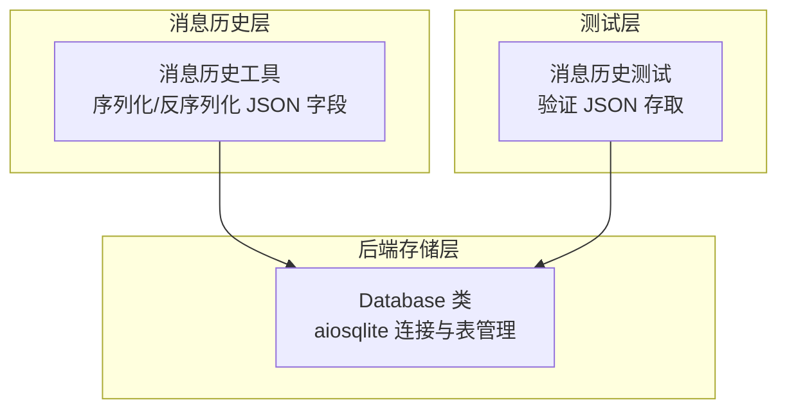
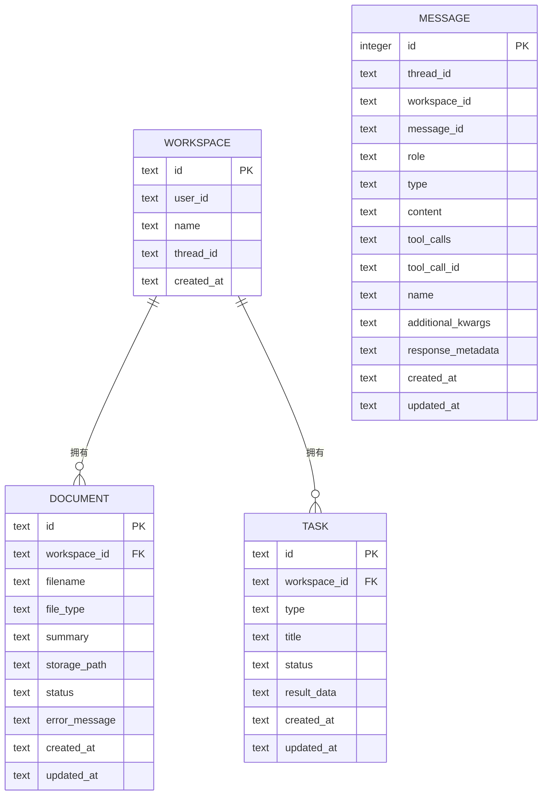
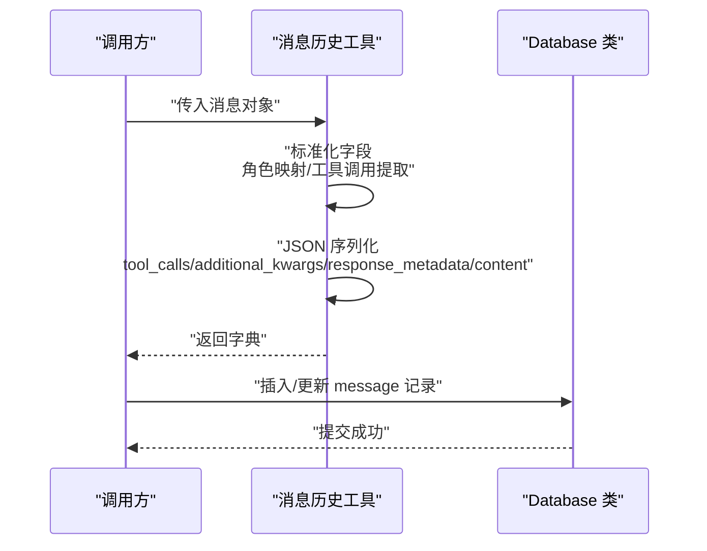
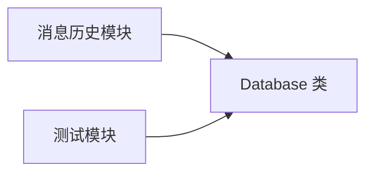

# 数据库设计

<cite>
**本文引用的文件**
- [database.py](file://backend/src/storage/database.py)
- [message_history.py](file://backend/src/agent/message_history.py)
- [test_message_history.py](file://backend/tests/test_message_history.py)
</cite>

## 目录
1. [简介](#简介)
2. [项目结构](#项目结构)
3. [核心组件](#核心组件)
4. [架构总览](#架构总览)
5. [详细组件分析](#详细组件分析)
6. [依赖分析](#依赖分析)
7. [性能考虑](#性能考虑)
8. [故障排查指南](#故障排查指南)
9. [结论](#结论)
10. [附录](#附录)

## 简介
本文件面向 Train Agent 项目的 SQLite 数据库存储，系统性梳理四张核心表的结构与关系：workspace（工作区表）、document（文档表）、task（任务表）、message（消息表）。重点覆盖字段定义、数据类型、约束与索引策略；解释外键关系设计及引用完整性保障；阐述 message 表中 JSON 字段（tool_calls、additional_kwargs、response_metadata）的序列化与解析方式；并给出数据迁移策略、查询优化建议与事务处理最佳实践。

## 项目结构
数据库相关代码集中在后端 storage 层，通过异步 SQLite 驱动 aiosqlite 提供连接与 DDL/DML 能力。消息历史模块负责将消息对象转换为可持久化的字典结构，其中包含 JSON 字段的序列化逻辑。

图表来源
- [database.py:14-78](file://backend/src/storage/database.py#L14-L78)
- [message_history.py:47-78](file://backend/src/agent/message_history.py#L47-L78)
- [test_message_history.py:37-64](file://backend/tests/test_message_history.py#L37-L64)

章节来源
- [database.py:14-78](file://backend/src/storage/database.py#L14-L78)

## 核心组件
- Database 类：封装数据库初始化、表创建、迁移、CRUD 操作与事务提交。
- 消息历史工具：将消息对象标准化为字典，处理角色映射、工具调用、附加参数与响应元数据的序列化。
- 测试用例：验证消息内容与工具调用的 JSON 存取一致性。

章节来源
- [database.py:9-78](file://backend/src/storage/database.py#L9-L78)
- [message_history.py:47-78](file://backend/src/agent/message_history.py#L47-L78)
- [test_message_history.py:37-64](file://backend/tests/test_message_history.py#L37-L64)

## 架构总览
SQLite 存储采用单文件数据库，通过 PRAGMA 启用外键约束。消息表支持多维检索，包含线程维度的复合索引。外键关系确保工作区删除时级联清理文档与任务记录。

图表来源
- [database.py:26-55](file://backend/src/storage/database.py#L26-L55)

## 详细组件分析

### 工作区表 workspace
- 主键：id（TEXT）
- 关键字段
  - user_id（TEXT，NOT NULL）：用户标识
  - name（TEXT，NOT NULL）：工作区名称
  - thread_id（TEXT）：关联的会话线程标识
  - created_at（TEXT，默认当前本地时间）：创建时间
- 约束与索引
  - 主键约束：id 唯一且非空
  - 无额外索引（按需可在查询热点列上添加）
- 外键关系
  - 作为其他表的被参照对象，用于建立文档与任务的归属关系

章节来源
- [database.py:26-33](file://backend/src/storage/database.py#L26-L33)

### 文档表 document
- 主键：id（TEXT）
- 外键：workspace_id（TEXT，NOT NULL，REFERENCES workspace(id) ON DELETE CASCADE）
- 关键字段
  - filename（TEXT，NOT NULL）：原始文件名
  - file_type（TEXT）：文件类型
  - summary（TEXT）：摘要
  - storage_path（TEXT）：存储路径
  - status（TEXT，默认 "uploaded"）：状态
  - error_message（TEXT）：错误信息（迁移后新增）
  - created_at（TEXT，默认当前本地时间）
  - updated_at（TEXT，默认当前本地时间，迁移后新增）
- 约束与索引
  - 外键约束：引用 workspace.id，删除工作区时级联删除文档
  - 唯一性：无显式唯一约束
  - 索引：无专门索引（按查询需求可增加）
- 迁移策略
  - 若缺失 error_message 或 updated_at 列，执行 ALTER TABLE 添加列并设置默认值

章节来源
- [database.py:34-45](file://backend/src/storage/database.py#L34-L45)
- [database.py:80-88](file://backend/src/storage/database.py#L80-L88)

### 任务表 task
- 主键：id（TEXT）
- 外键：workspace_id（TEXT，NOT NULL，REFERENCES workspace(id) ON DELETE CASCADE）
- 关键字段
  - type（TEXT，NOT NULL）：任务类型
  - title（TEXT）：标题
  - status（TEXT，默认 "generating"）：状态
  - result_data（TEXT）：结果数据（JSON 文本）
  - created_at（TEXT，默认当前本地时间）
  - updated_at（TEXT，默认当前本地时间）
- 约束与索引
  - 外键约束：引用 workspace.id，删除工作区时级联删除任务
  - 唯一性：无显式唯一约束
  - 索引：无专门索引（按查询需求可增加）
- 迁移策略
  - 新增 updated_at 列并设置默认值

章节来源
- [database.py:46-55](file://backend/src/storage/database.py#L46-L55)
- [database.py:80-88](file://backend/src/storage/database.py#L80-L88)

### 消息表 message
- 主键：id（INTEGER，自增）
- 关键字段
  - thread_id（TEXT，NOT NULL）：所属线程
  - workspace_id（TEXT）：所属工作区（迁移后新增）
  - message_id（TEXT，NOT NULL）：消息唯一标识
  - role（TEXT，NOT NULL）：角色（如 human/ai）
  - type（TEXT，NOT NULL）：消息类型（与 role 对应）
  - content（TEXT，NOT NULL）：内容（JSON 文本）
  - tool_calls（TEXT）：工具调用列表（JSON 文本）
  - tool_call_id（TEXT）：工具调用实例 ID
  - name（TEXT）：工具名称
  - additional_kwargs（TEXT）：附加参数（JSON 文本）
  - response_metadata（TEXT）：响应元数据（JSON 文本）
  - created_at（TEXT，NOT NULL）
  - updated_at（TEXT，NOT NULL，迁移后新增）
- 约束与索引
  - 唯一性：UNIQUE(thread_id, message_id, role)，避免同一线程同标识同角色重复
  - 复合索引：idx_message_thread_id_id(thread_id, id DESC)，支持按线程分页与时间倒序
  - 外键：未启用外键约束（PRAGMA foreign_keys = ON），但业务上可保持引用一致性
- JSON 序列化机制
  - content/tool_calls/additional_kwargs/response_metadata 以 JSON 文本形式存储
  - 写入前由消息历史工具进行序列化
  - 读取后由调用方进行解析使用

章节来源
- [database.py:56-76](file://backend/src/storage/database.py#L56-L76)
- [message_history.py:47-78](file://backend/src/agent/message_history.py#L47-L78)
- [test_message_history.py:55-62](file://backend/tests/test_message_history.py#L55-L62)

### 外键关系设计与引用完整性
- document 与 task 的 workspace_id 引用 workspace(id)，删除工作区时自动级联删除其下所有文档与任务，确保引用完整性。
- message 表未启用外键约束，但通过 PRAGMA foreign_keys = ON 初始化，若后续启用外键，需保证插入顺序与数据一致性。

章节来源
- [database.py:36](file://backend/src/storage/database.py#L36)
- [database.py:48](file://backend/src/storage/database.py#L48)
- [database.py:75](file://backend/src/storage/database.py#L75)

### JSON 序列化与解析流程
消息历史工具将消息对象标准化为字典，关键步骤如下：
- 角色映射：将 "user"/"assistant" 映射为 "human"/"ai"
- 工具调用提取：从消息对象或附加参数中提取 tool_calls 列表
- JSON 字段序列化：对 tool_calls、additional_kwargs、response_metadata 执行 JSON 编码
- 内容序列化：content 字段同样以 JSON 文本形式存储
- 写入数据库：统一写入 message 表
- 读取解析：测试用例验证 content 与 tool_calls 的 JSON 解析正确性

图表来源
- [message_history.py:47-78](file://backend/src/agent/message_history.py#L47-L78)
- [database.py:56-76](file://backend/src/storage/database.py#L56-L76)

章节来源
- [message_history.py:47-78](file://backend/src/agent/message_history.py#L47-L78)
- [test_message_history.py:55-62](file://backend/tests/test_message_history.py#L55-L62)

### 查询优化建议
- 为高频查询列增加索引
  - document：按 workspace_id 查询文档列表，建议增加索引
  - task：按 workspace_id 查询任务列表，建议增加索引
  - message：按 thread_id 查询消息列表，已存在复合索引 idx_message_thread_id_id
- 使用 LIMIT/OFFSET 或基于游标的分页（如 before/after）减少扫描
- 避免 SELECT *，仅选择必要列
- 对 JSON 字段的过滤尽量延迟到应用层解析后再筛选

章节来源
- [database.py:73-74](file://backend/src/storage/database.py#L73-L74)

### 事务处理最佳实践
- 单次操作：每个 CRUD 操作后立即 commit，确保原子性
- 批量写入：合并多个 UPDATE/INSERT 为一次事务，减少提交次数
- 错误回滚：捕获异常后 rollback，避免部分提交导致不一致
- 并发控制：使用连接池与锁策略，避免并发写冲突

章节来源
- [database.py:14-19](file://backend/src/storage/database.py#L14-L19)
- [database.py:321-328](file://backend/src/storage/database.py#L321-L328)
- [database.py:367-374](file://backend/src/storage/database.py#L367-L374)

## 依赖分析
- Database 类依赖 aiosqlite 提供异步连接与事务能力
- 消息历史模块依赖 Database 类进行持久化
- 测试模块依赖 Database 类验证 JSON 字段存取

图表来源
- [database.py:14-19](file://backend/src/storage/database.py#L14-L19)
- [message_history.py:47-78](file://backend/src/agent/message_history.py#L47-L78)
- [test_message_history.py:37-64](file://backend/tests/test_message_history.py#L37-L64)

章节来源
- [database.py:14-19](file://backend/src/storage/database.py#L14-L19)
- [message_history.py:47-78](file://backend/src/agent/message_history.py#L47-L78)
- [test_message_history.py:37-64](file://backend/tests/test_message_history.py#L37-L64)

## 性能考虑
- I/O 优化：减少不必要的列读取与大文本传输
- 索引策略：针对高选择性的过滤列建立索引，平衡写入成本
- JSON 处理：在应用层进行 JSON 解析，避免数据库侧复杂函数调用
- 连接复用：在服务生命周期内复用连接，降低握手开销

## 故障排查指南
- JSON 解析失败
  - 现象：content/tool_calls/additional_kwargs/response_metadata 无法解析
  - 排查：确认写入前是否进行了 JSON 序列化；检查数据库中对应列为 TEXT 且非空
  - 参考：测试用例验证 JSON 存取
- 外键约束问题
  - 现象：插入 message 时提示外键约束失败
  - 排查：确认 PRAGMA foreign_keys 是否开启；检查 workspace_id 是否有效
- 级联删除异常
  - 现象：删除 workspace 后 document/task 未被清理
  - 排查：确认外键约束与 ON DELETE CASCADE 设置；检查迁移脚本是否执行

章节来源
- [test_message_history.py:55-62](file://backend/tests/test_message_history.py#L55-L62)
- [database.py:75](file://backend/src/storage/database.py#L75)
- [database.py:36](file://backend/src/storage/database.py#L36)
- [database.py:48](file://backend/src/storage/database.py#L48)

## 结论
本设计以 SQLite 为基础，通过明确的主外键关系与迁移策略，确保数据一致性与演进能力。消息表采用 JSON 文本存储复杂结构，配合消息历史工具完成序列化与解析。建议在生产环境中根据查询热点补充索引，并严格遵循事务与并发控制最佳实践，以获得稳定与高效的运行表现。

## 附录

### 完整 SQL 模式定义
- workspace 表
  - 字段：id（TEXT，PK）、user_id（TEXT，NOT NULL）、name（TEXT，NOT NULL）、thread_id（TEXT）、created_at（TEXT，默认当前本地时间）
- document 表
  - 字段：id（TEXT，PK）、workspace_id（TEXT，NOT NULL，FK workspace.id，ON DELETE CASCADE）、filename（TEXT，NOT NULL）、file_type（TEXT）、summary（TEXT）、storage_path（TEXT）、status（TEXT，默认 "uploaded"）、error_message（TEXT）、created_at（TEXT，默认当前本地时间）、updated_at（TEXT，默认当前本地时间）
- task 表
  - 字段：id（TEXT，PK）、workspace_id（TEXT，NOT NULL，FK workspace.id，ON DELETE CASCADE）、type（TEXT，NOT NULL）、title（TEXT）、status（TEXT，默认 "generating"）、result_data（TEXT）、created_at（TEXT，默认当前本地时间）、updated_at（TEXT，默认当前本地时间）
- message 表
  - 字段：id（INTEGER，PK，自增）、thread_id（TEXT，NOT NULL）、workspace_id（TEXT）、message_id（TEXT，NOT NULL）、role（TEXT，NOT NULL）、type（TEXT，NOT NULL）、content（TEXT，NOT NULL）、tool_calls（TEXT）、tool_call_id（TEXT）、name（TEXT）、additional_kwargs（TEXT）、response_metadata（TEXT）、created_at（TEXT，NOT NULL）、updated_at（TEXT，NOT NULL）
  - 约束：UNIQUE(thread_id, message_id, role)
  - 索引：idx_message_thread_id_id(thread_id, id DESC)
  - 外键：未启用（PRAGMA foreign_keys = ON）

章节来源
- [database.py:26-76](file://backend/src/storage/database.py#L26-L76)

### 数据迁移策略
- document 表
  - 若不存在 error_message 列：ALTER TABLE document ADD COLUMN error_message TEXT
  - 若不存在 updated_at 列：ALTER TABLE document ADD COLUMN updated_at TEXT DEFAULT (datetime('now', 'localtime'))
- message 表
  - 若不存在 workspace_id、tool_calls、tool_call_id、name、additional_kwargs、response_metadata、updated_at 列：逐项执行 ALTER TABLE ... ADD COLUMN

章节来源
- [database.py:80-103](file://backend/src/storage/database.py#L80-L103)