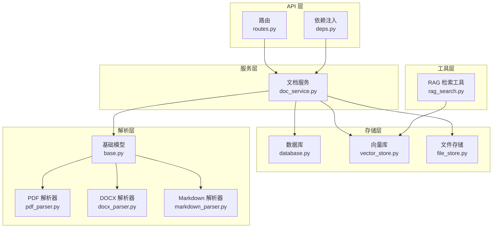
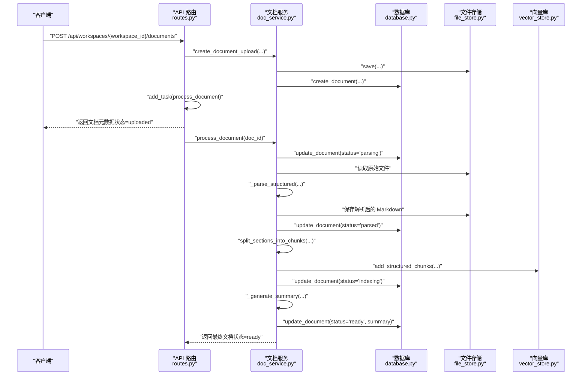
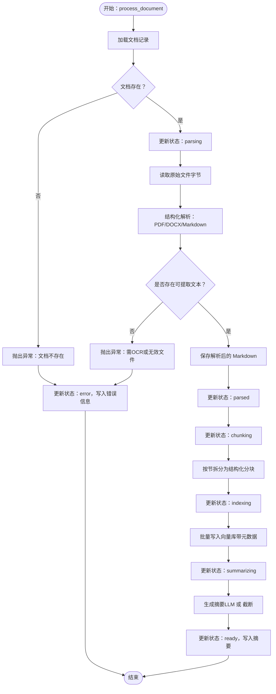
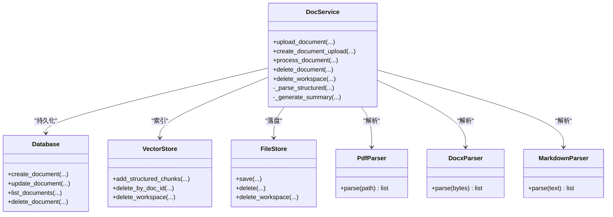
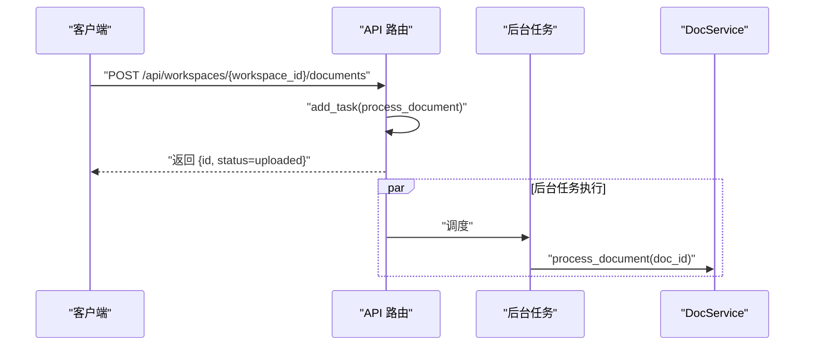
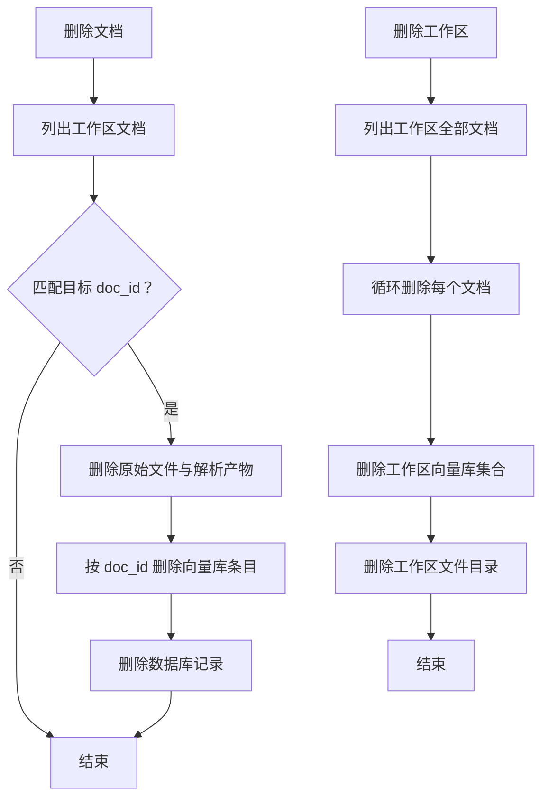
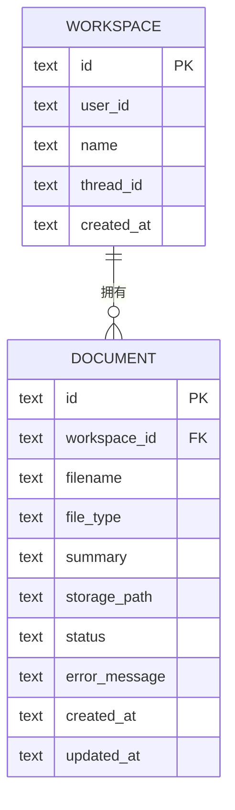
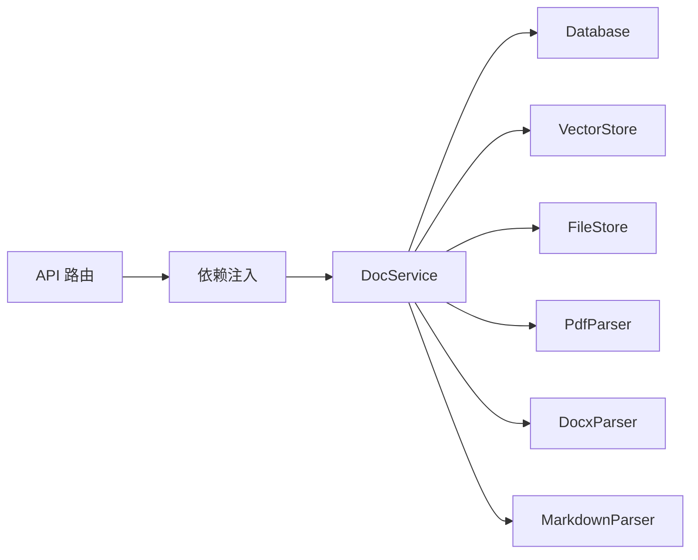

# 服务层设计

<cite>
**本文引用的文件**
- [backend/src/services/doc_service.py](file://backend/src/services/doc_service.py)
- [backend/src/storage/database.py](file://backend/src/storage/database.py)
- [backend/src/storage/vector_store.py](file://backend/src/storage/vector_store.py)
- [backend/src/storage/file_store.py](file://backend/src/storage/file_store.py)
- [backend/src/parsers/base.py](file://backend/src/parsers/base.py)
- [backend/src/parsers/pdf_parser.py](file://backend/src/parsers/pdf_parser.py)
- [backend/src/parsers/docx_parser.py](file://backend/src/parsers/docx_parser.py)
- [backend/src/parsers/markdown_parser.py](file://backend/src/parsers/markdown_parser.py)
- [backend/src/api/routes.py](file://backend/src/api/routes.py)
- [backend/src/api/deps.py](file://backend/src/api/deps.py)
- [backend/src/tools/rag_search.py](file://backend/src/tools/rag_search.py)
- [backend/pyproject.toml](file://backend/pyproject.toml)
</cite>

## 目录
1. [简介](#简介)
2. [项目结构](#项目结构)
3. [核心组件](#核心组件)
4. [架构总览](#架构总览)
5. [详细组件分析](#详细组件分析)
6. [依赖分析](#依赖分析)
7. [性能考虑](#性能考虑)
8. [故障排查指南](#故障排查指南)
9. [结论](#结论)
10. [附录](#附录)

## 简介
本文件面向 Train Agent 项目的后端服务层，聚焦 DocService 的业务编排能力与文档处理流水线的完整实现。文档覆盖从“上传-解析-分块-索引-摘要”的全流程，阐述状态机设计、错误处理、异步任务与后台任务调度、状态轮询机制，并补充删除与工作区清理等管理功能。同时给出性能优化策略、并发处理与数据一致性保障的技术建议。

## 项目结构
后端采用按职责分层的组织方式：
- API 层：FastAPI 路由与依赖注入，负责请求接入与后台任务触发
- 服务层：DocService 承担业务编排与状态流转
- 存储层：数据库（aiosqlite）、向量库（ChromaDB）、文件存储（本地目录）
- 解析层：PDF、DOCX、Markdown 等解析器，输出结构化段落
- 工具层：RAG 检索工具等

图表来源
- [backend/src/api/routes.py:112-128](file://backend/src/api/routes.py#L112-L128)
- [backend/src/api/deps.py:27-29](file://backend/src/api/deps.py#L27-L29)
- [backend/src/services/doc_service.py:13-27](file://backend/src/services/doc_service.py#L13-L27)
- [backend/src/storage/database.py:9-12](file://backend/src/storage/database.py#L9-L12)
- [backend/src/storage/vector_store.py:39-42](file://backend/src/storage/vector_store.py#L39-L42)
- [backend/src/storage/file_store.py:6-9](file://backend/src/storage/file_store.py#L6-L9)
- [backend/src/parsers/base.py:6-41](file://backend/src/parsers/base.py#L6-L41)
- [backend/src/parsers/pdf_parser.py:17-35](file://backend/src/parsers/pdf_parser.py#L17-L35)
- [backend/src/parsers/docx_parser.py:20-31](file://backend/src/parsers/docx_parser.py#L20-L31)
- [backend/src/parsers/markdown_parser.py:13-20](file://backend/src/parsers/markdown_parser.py#L13-L20)
- [backend/src/tools/rag_search.py:40-58](file://backend/src/tools/rag_search.py#L40-L58)

章节来源
- [backend/src/api/routes.py:112-128](file://backend/src/api/routes.py#L112-L128)
- [backend/src/api/deps.py:27-29](file://backend/src/api/deps.py#L27-L29)
- [backend/src/services/doc_service.py:13-27](file://backend/src/services/doc_service.py#L13-L27)

## 核心组件
- DocService：文档生命周期管理与流水线编排，负责上传、解析、分块、索引、摘要生成、状态更新与错误回滚
- Database：SQLite 异步封装，维护工作区、文档、任务、消息等表结构与迁移
- VectorStore：ChromaDB 客户端封装，提供结构化分块写入、查询与按文档删除
- FileStore：本地文件系统封装，提供安全的同步/异步保存与工作区级删除
- 解析器族：PDF、DOCX、Markdown 分别提取结构化段落，统一输出 DocumentSection 列表
- RAG 检索工具：基于向量库检索并格式化返回结果

章节来源
- [backend/src/services/doc_service.py:13-27](file://backend/src/services/doc_service.py#L13-L27)
- [backend/src/storage/database.py:9-12](file://backend/src/storage/database.py#L9-L12)
- [backend/src/storage/vector_store.py:39-42](file://backend/src/storage/vector_store.py#L39-L42)
- [backend/src/storage/file_store.py:6-9](file://backend/src/storage/file_store.py#L6-L9)
- [backend/src/parsers/base.py:6-41](file://backend/src/parsers/base.py#L6-L41)
- [backend/src/tools/rag_search.py:40-58](file://backend/src/tools/rag_search.py#L40-L58)

## 架构总览
DocService 将“上传-解析-分块-索引-摘要”串联为一个原子性业务流程，通过数据库记录状态与错误信息，确保可恢复与可观测。API 层仅负责接收请求与触发后台任务，避免阻塞主请求线程。

图表来源
- [backend/src/api/routes.py:112-128](file://backend/src/api/routes.py#L112-L128)
- [backend/src/services/doc_service.py:29-130](file://backend/src/services/doc_service.py#L29-L130)
- [backend/src/storage/database.py:285-311](file://backend/src/storage/database.py#L285-L311)
- [backend/src/storage/vector_store.py:91-122](file://backend/src/storage/vector_store.py#L91-L122)
- [backend/src/storage/file_store.py:11-16](file://backend/src/storage/file_store.py#L11-L16)

## 详细组件分析

### 文档服务（DocService）业务编排
- 入口方法
  - 上传入口：create_document_upload 将文件落盘并创建文档记录；upload_document 在创建后立即触发处理流程
  - 处理入口：process_document 执行完整的解析-分块-索引-摘要流程，并维护状态机
- 状态机设计
  - 状态包括 uploaded、parsing、parsed、chunking、indexing、summarizing、ready、error
  - 每个阶段均调用数据库更新状态与时间戳，异常时写入错误信息并终止
- 错误处理
  - 捕获异常并回写 error 状态与错误信息；解析无文本时抛出明确提示
  - 向量库嵌入失败会记录日志并中断流程
- 摘要生成
  - 若存在 LLM，则截断文本并调用模型生成摘要；失败时降级为截断文本
  - 若不存在 LLM，则直接返回截断文本

图表来源
- [backend/src/services/doc_service.py:57-130](file://backend/src/services/doc_service.py#L57-L130)
- [backend/src/parsers/base.py:47-96](file://backend/src/parsers/base.py#L47-L96)
- [backend/src/storage/vector_store.py:91-122](file://backend/src/storage/vector_store.py#L91-L122)

章节来源
- [backend/src/services/doc_service.py:29-130](file://backend/src/services/doc_service.py#L29-L130)

### 文件上传与解析流水线
- 上传阶段
  - API 接收文件，读取二进制内容，调用 DocService 创建文档记录并保存到文件存储
  - 随即通过后台任务触发处理流程，避免阻塞请求
- 解析阶段
  - 根据扩展名识别类型，选择对应解析器
  - PDF 使用 PyMuPDF 提取文本块并启发式识别标题层级；DOCX 使用样式映射；Markdown 使用正则匹配
  - 输出结构化段落列表，用于后续分块与索引
- 分块与索引
  - 基于最大长度与分隔符进行递归拆分，保留章节与页码元数据
  - 写入向量库，按工作区命名集合，支持按文档 ID 删除
- 摘要生成
  - 优先使用 LLM；失败时降级为截断文本

图表来源
- [backend/src/services/doc_service.py:13-27](file://backend/src/services/doc_service.py#L13-L27)
- [backend/src/storage/database.py:285-338](file://backend/src/storage/database.py#L285-L338)
- [backend/src/storage/vector_store.py:91-176](file://backend/src/storage/vector_store.py#L91-L176)
- [backend/src/storage/file_store.py:11-38](file://backend/src/storage/file_store.py#L11-L38)
- [backend/src/parsers/pdf_parser.py:20-35](file://backend/src/parsers/pdf_parser.py#L20-L35)
- [backend/src/parsers/docx_parser.py:23-83](file://backend/src/parsers/docx_parser.py#L23-L83)
- [backend/src/parsers/markdown_parser.py:16-61](file://backend/src/parsers/markdown_parser.py#L16-L61)

章节来源
- [backend/src/api/routes.py:112-128](file://backend/src/api/routes.py#L112-L128)
- [backend/src/api/deps.py:27-29](file://backend/src/api/deps.py#L27-L29)
- [backend/src/services/doc_service.py:29-130](file://backend/src/services/doc_service.py#L29-L130)
- [backend/src/parsers/pdf_parser.py:20-35](file://backend/src/parsers/pdf_parser.py#L20-L35)
- [backend/src/parsers/docx_parser.py:23-83](file://backend/src/parsers/docx_parser.py#L23-L83)
- [backend/src/parsers/markdown_parser.py:16-61](file://backend/src/parsers/markdown_parser.py#L16-L61)

### 异步任务与状态轮询
- 异步任务
  - API 在创建文档记录后，通过 BackgroundTasks.add_task 触发 DocService.process_document
  - 文件落盘与数据库写入均为同步操作，但解析与向量入库在服务层内部以异步方式推进
- 状态轮询
  - 客户端可通过 GET /api/workspaces/{workspace_id}/documents 获取文档列表，观察状态字段
  - 当状态为 ready 时，表示处理完成；若为 error，可查看错误信息字段

图表来源
- [backend/src/api/routes.py:112-128](file://backend/src/api/routes.py#L112-L128)
- [backend/src/services/doc_service.py:57-130](file://backend/src/services/doc_service.py#L57-L130)

章节来源
- [backend/src/api/routes.py:112-128](file://backend/src/api/routes.py#L112-L128)

### 文档删除与工作区清理
- 单文档删除
  - 删除文件存储中的原始文件与解析产物（Markdown），并删除向量库中对应 doc_id 的条目，最后删除数据库记录
- 工作区删除
  - 遍历工作区内所有文档，逐个删除文件与向量库条目，随后删除工作区对应的向量库集合与文件存储目录

图表来源
- [backend/src/services/doc_service.py:141-166](file://backend/src/services/doc_service.py#L141-L166)
- [backend/src/storage/vector_store.py:165-176](file://backend/src/storage/vector_store.py#L165-L176)
- [backend/src/storage/file_store.py:30-38](file://backend/src/storage/file_store.py#L30-L38)

章节来源
- [backend/src/services/doc_service.py:141-166](file://backend/src/services/doc_service.py#L141-L166)

### 数据模型与一致性
- 文档表（document）包含状态与错误信息字段，便于状态机与可观测性
- 迁移逻辑自动补齐新增列，保证数据库演进兼容
- 向量库集合按工作区命名，删除时可精确清理

图表来源
- [backend/src/storage/database.py:27-76](file://backend/src/storage/database.py#L27-L76)
- [backend/src/storage/database.py:285-338](file://backend/src/storage/database.py#L285-L338)

章节来源
- [backend/src/storage/database.py:27-76](file://backend/src/storage/database.py#L27-L76)
- [backend/src/storage/database.py:285-338](file://backend/src/storage/database.py#L285-L338)

## 依赖分析
- 组件耦合
  - DocService 对数据库、向量库、文件存储与解析器有直接依赖，耦合度适中，职责清晰
  - API 层仅依赖 DocService 与依赖注入容器，保持薄路由
- 外部依赖
  - LangChain、ChromaDB、DashScope、PyMuPDF、python-docx 等
- 循环依赖
  - 未发现循环导入；解析器与服务层通过接口抽象解耦

图表来源
- [backend/src/api/routes.py:112-128](file://backend/src/api/routes.py#L112-L128)
- [backend/src/api/deps.py:27-29](file://backend/src/api/deps.py#L27-L29)
- [backend/src/services/doc_service.py:13-27](file://backend/src/services/doc_service.py#L13-L27)

章节来源
- [backend/src/api/routes.py:112-128](file://backend/src/api/routes.py#L112-L128)
- [backend/src/api/deps.py:27-29](file://backend/src/api/deps.py#L27-L29)
- [backend/src/services/doc_service.py:13-27](file://backend/src/services/doc_service.py#L13-L27)
- [backend/pyproject.toml:6-26](file://backend/pyproject.toml#L6-L26)

## 性能考虑
- 并发与批处理
  - 向量库写入采用批量提交，减少网络往返；默认批大小可按环境调整
  - 文件写入通过线程池包装同步 I/O，避免阻塞事件循环
- 拆分策略
  - 结构化分块保留章节与页码元数据，提升检索精度与可解释性
  - 分隔符包含中英文换行与标点，兼顾不同语言文本
- 缓存与降级
  - 摘要生成失败时快速降级为截断文本，避免长时间等待
  - 向量库查询支持按文档 ID 限定范围，减少无关扫描
- 数据库与索引
  - 使用外键约束与索引，保证查询效率与引用完整性
  - 迁移逻辑自动补齐列，降低部署风险

[本节为通用性能建议，不直接分析具体代码文件]

## 故障排查指南
- 常见问题
  - 上传后状态长期为 uploaded：检查后台任务是否被调度、数据库连接是否正常
  - 解析失败或无文本：确认文件类型与内容，扫描类 PDF 需要 OCR；Markdown/纯文本需确保可提取
  - 向量库写入失败：检查嵌入模型密钥与服务可用性
  - 摘要生成异常：检查 LLM 配置与网络连通性
- 排查步骤
  - 查看数据库中文档状态与错误信息字段
  - 检查向量库集合是否存在以及条目数量
  - 校验文件存储路径与权限
  - 使用检索工具验证索引有效性

章节来源
- [backend/src/services/doc_service.py:121-130](file://backend/src/services/doc_service.py#L121-L130)
- [backend/src/storage/database.py:321-328](file://backend/src/storage/database.py#L321-L328)
- [backend/src/storage/vector_store.py:165-176](file://backend/src/storage/vector_store.py#L165-L176)
- [backend/src/tools/rag_search.py:40-75](file://backend/src/tools/rag_search.py#L40-L75)

## 结论
DocService 将文档处理的复杂流程以状态机与可观测的方式封装，结合异步后台任务与多存储后端，实现了高可靠与可扩展的文档知识库构建链路。通过结构化分块与检索工具，系统为后续 RAG 问答与技能调用提供了坚实基础。建议在生产环境中进一步完善监控告警、重试与限流策略，以增强稳定性与吞吐能力。

[本节为总结性内容，不直接分析具体代码文件]

## 附录
- 关键实现路径参考
  - 上传与后台任务触发：[backend/src/api/routes.py:112-128](file://backend/src/api/routes.py#L112-L128)
  - 文档处理主流程：[backend/src/services/doc_service.py:57-130](file://backend/src/services/doc_service.py#L57-L130)
  - 数据库初始化与迁移：[backend/src/storage/database.py:14-78](file://backend/src/storage/database.py#L14-L78)
  - 向量库写入与查询：[backend/src/storage/vector_store.py:91-163](file://backend/src/storage/vector_store.py#L91-L163)
  - 文件落盘与删除：[backend/src/storage/file_store.py:11-38](file://backend/src/storage/file_store.py#L11-L38)
  - 结构化解析与分块：[backend/src/parsers/base.py:47-96](file://backend/src/parsers/base.py#L47-L96)
  - PDF/DOCX/Markdown 解析器：[backend/src/parsers/pdf_parser.py:20-35](file://backend/src/parsers/pdf_parser.py#L20-L35), [backend/src/parsers/docx_parser.py:23-83](file://backend/src/parsers/docx_parser.py#L23-L83), [backend/src/parsers/markdown_parser.py:16-61](file://backend/src/parsers/markdown_parser.py#L16-L61)
  - RAG 检索工具：[backend/src/tools/rag_search.py:40-75](file://backend/src/tools/rag_search.py#L40-L75)

[本节为参考清单，不直接分析具体代码文件]