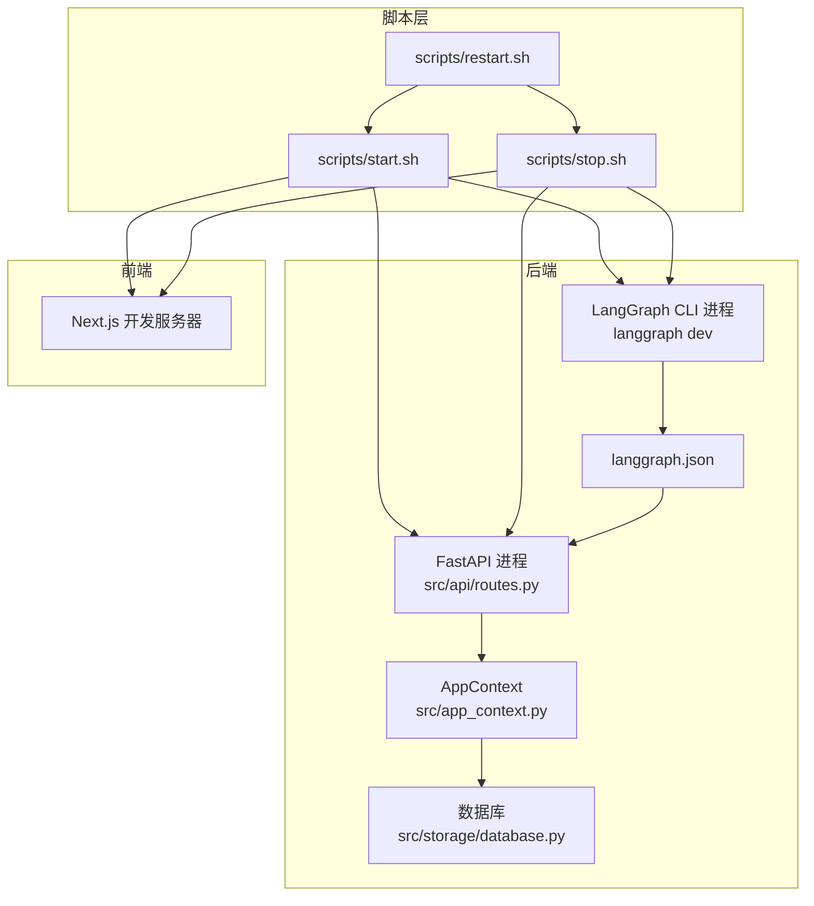
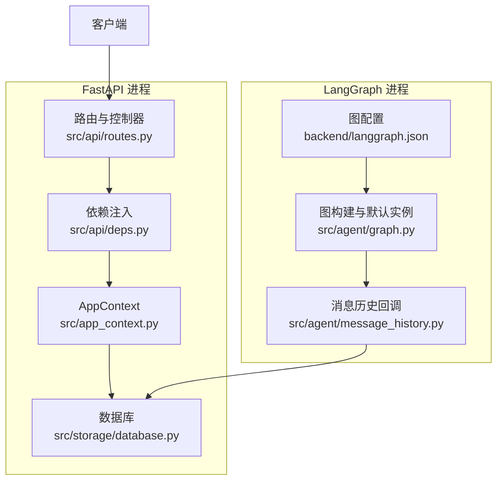
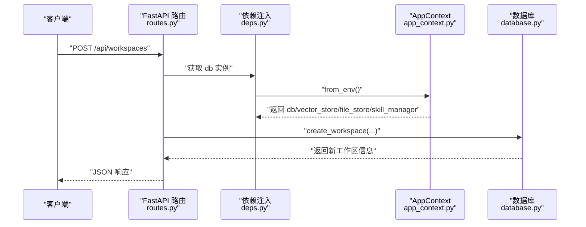
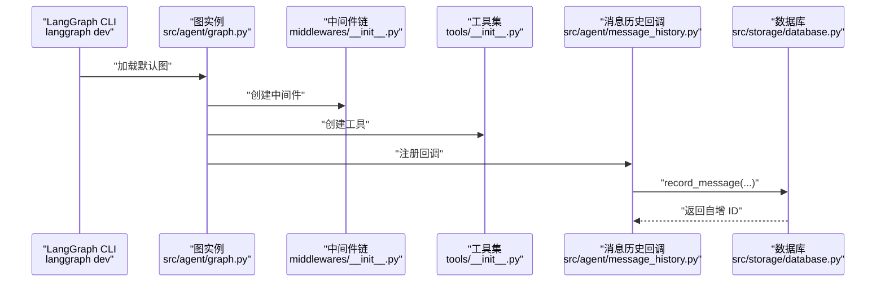
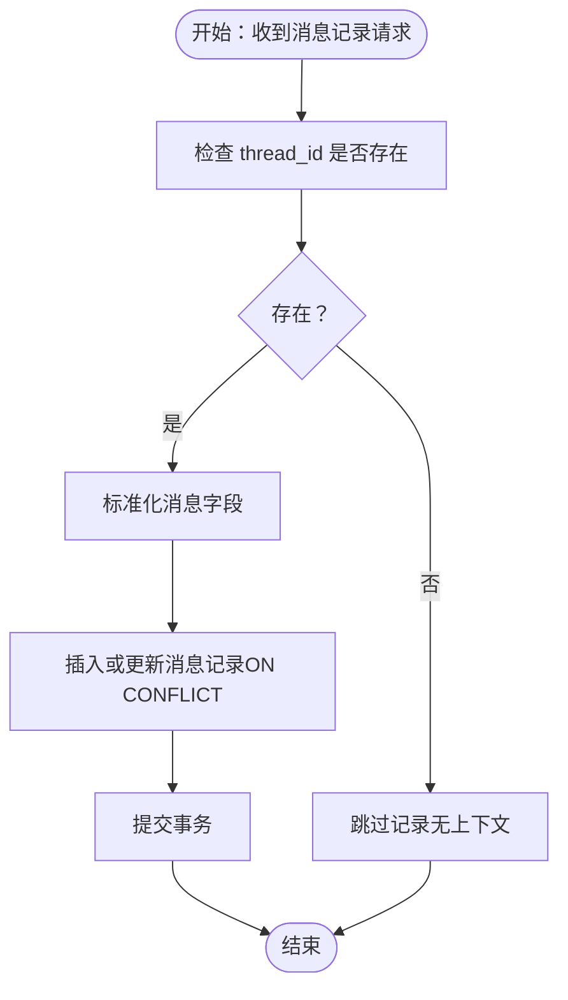
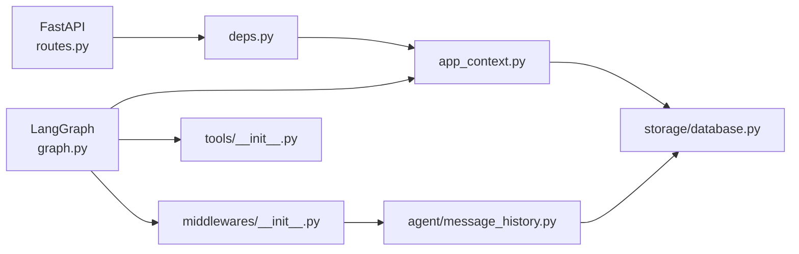

# 双进程架构说明

<cite>
**本文档引用的文件**
- [backend/pyproject.toml](file://backend/pyproject.toml)
- [backend/langgraph.json](file://backend/langgraph.json)
- [backend/src/api/routes.py](file://backend/src/api/routes.py)
- [backend/src/api/deps.py](file://backend/src/api/deps.py)
- [backend/src/app_context.py](file://backend/src/app_context.py)
- [backend/src/agent/graph.py](file://backend/src/agent/graph.py)
- [backend/src/agent/message_history.py](file://backend/src/agent/message_history.py)
- [backend/src/middlewares/__init__.py](file://backend/src/middlewares/__init__.py)
- [backend/src/tools/__init__.py](file://backend/src/tools/__init__.py)
- [backend/src/storage/database.py](file://backend/src/storage/database.py)
- [scripts/start.sh](file://scripts/start.sh)
- [scripts/stop.sh](file://scripts/stop.sh)
- [scripts/restart.sh](file://scripts/restart.sh)
</cite>

## 目录
1. [引言](#引言)
2. [项目结构](#项目结构)
3. [核心组件](#核心组件)
4. [架构总览](#架构总览)
5. [详细组件分析](#详细组件分析)
6. [依赖关系分析](#依赖关系分析)
7. [性能考量](#性能考量)
8. [故障排查指南](#故障排查指南)
9. [结论](#结论)
10. [附录](#附录)

## 引言
本文件面向 Train Agent 项目的双进程架构进行系统化说明：解释 FastAPI 进程与 LangGraph 进程如何独立运行、进程间通信方式、共享存储层的实现与数据一致性保障；梳理两进程的启动配置、端口分配与依赖差异；阐述采用双进程架构的设计动机（性能优化、资源隔离、故障独立性）；并提供进程监控、日志分离与调试运维建议。

## 项目结构
- 后端（Python）包含 FastAPI 应用与 LangGraph 图执行环境，二者通过共享存储层协同工作。
- 脚本层负责统一启动、停止与重启，分别在不同端口启动各进程，并生成独立日志与 PID 文件。
- LangGraph 的图定义与依赖由 langgraph.json 管理，确保 CLI 与服务端一致。

图表来源
- [scripts/start.sh:57-82](file://scripts/start.sh#L57-L82)
- [scripts/stop.sh:32-34](file://scripts/stop.sh#L32-L34)
- [backend/src/api/routes.py:21-27](file://backend/src/api/routes.py#L21-L27)
- [backend/src/app_context.py:12-31](file://backend/src/app_context.py#L12-L31)
- [backend/src/storage/database.py:9-24](file://backend/src/storage/database.py#L9-L24)
- [backend/langgraph.json:1-9](file://backend/langgraph.json#L1-L9)

章节来源
- [scripts/start.sh:57-82](file://scripts/start.sh#L57-L82)
- [scripts/stop.sh:32-34](file://scripts/stop.sh#L32-L34)
- [backend/src/api/routes.py:21-27](file://backend/src/api/routes.py#L21-L27)
- [backend/src/app_context.py:12-31](file://backend/src/app_context.py#L12-L31)
- [backend/src/storage/database.py:9-24](file://backend/src/storage/database.py#L9-L24)
- [backend/langgraph.json:1-9](file://backend/langgraph.json#L1-L9)

## 核心组件
- FastAPI 进程
  - 提供 REST API，负责工作区、文档、任务、消息查询与静态资源分发。
  - 启动时初始化数据库连接，使用依赖注入模块加载共享存储实例。
- LangGraph 进程
  - 通过 langgraph CLI 启动，加载 langgraph.json 中定义的图入口，执行智能体流程。
  - 使用 AppContext 构建模型、工具与中间件，回调持久化消息历史到数据库。
- 共享存储层
  - AppContext 统一管理数据库、向量库、文件存储与技能管理器，供两端复用。
  - 数据库采用异步 SQLite 连接池封装，提供消息、文档、任务等表的读写与迁移。
- 进程间通信
  - 无直接代码级通信：通过共享存储层（数据库/向量库/文件系统）实现数据互通。
  - LangGraph 执行结果与消息历史通过回调写入数据库，API 进程读取展示或后续处理。

章节来源
- [backend/src/api/routes.py:30-35](file://backend/src/api/routes.py#L30-L35)
- [backend/src/api/deps.py:13-30](file://backend/src/api/deps.py#L13-L30)
- [backend/src/app_context.py:12-31](file://backend/src/app_context.py#L12-L31)
- [backend/src/storage/database.py:9-24](file://backend/src/storage/database.py#L9-L24)
- [backend/src/agent/graph.py:16-49](file://backend/src/agent/graph.py#L16-L49)
- [backend/src/agent/message_history.py:13-41](file://backend/src/agent/message_history.py#L13-L41)

## 架构总览
双进程架构将“请求接入与业务编排”（FastAPI）与“智能体推理与流程执行”（LangGraph）解耦，形成高内聚低耦合的服务边界。两者通过共享存储层实现数据一致性与状态同步，同时保持进程级别的资源隔离与故障独立性。

图表来源
- [backend/src/api/routes.py:10-12](file://backend/src/api/routes.py#L10-L12)
- [backend/src/api/deps.py:13-30](file://backend/src/api/deps.py#L13-L30)
- [backend/src/app_context.py:12-31](file://backend/src/app_context.py#L12-L31)
- [backend/src/storage/database.py:9-24](file://backend/src/storage/database.py#L9-L24)
- [backend/langgraph.json:4-6](file://backend/langgraph.json#L4-L6)
- [backend/src/agent/graph.py:16-49](file://backend/src/agent/graph.py#L16-L49)
- [backend/src/agent/message_history.py:13-41](file://backend/src/agent/message_history.py#L13-L41)

## 详细组件分析

### FastAPI 进程
- 职责
  - 工作区管理、文档上传与处理、任务生命周期管理、消息列表查询、文件下载与静态资源分发。
  - 启动阶段完成数据库初始化，确保表结构与迁移逻辑就绪。
- 关键点
  - 依赖注入：通过 deps 模块从 AppContext 获取 db/vector_store/file_store/skill_manager 实例。
  - 日志：开发模式下配置根日志格式，便于快速定位问题。
  - CORS：允许任意来源访问，简化跨域联调。
- 数据一致性
  - 写路径：工作区、文档、任务、消息均通过数据库事务/提交保证原子性。
  - 读路径：消息列表支持游标分页与上限限制，避免一次性拉取过多数据。

图表来源
- [backend/src/api/routes.py:45-53](file://backend/src/api/routes.py#L45-L53)
- [backend/src/api/deps.py:13-19](file://backend/src/api/deps.py#L13-L19)
- [backend/src/app_context.py:19-31](file://backend/src/app_context.py#L19-L31)
- [backend/src/storage/database.py:111-127](file://backend/src/storage/database.py#L111-L127)

章节来源
- [backend/src/api/routes.py:30-35](file://backend/src/api/routes.py#L30-L35)
- [backend/src/api/routes.py:45-53](file://backend/src/api/routes.py#L45-L53)
- [backend/src/api/deps.py:13-19](file://backend/src/api/deps.py#L13-L19)
- [backend/src/app_context.py:19-31](file://backend/src/app_context.py#L19-L31)
- [backend/src/storage/database.py:111-127](file://backend/src/storage/database.py#L111-L127)

### LangGraph 进程
- 职责
  - 加载训练智能体图，配置模型、工具与中间件，执行推理与工具调用。
  - 通过回调将消息历史持久化到数据库，确保与 API 进程共享。
- 关键点
  - 图构建：从环境变量读取模型参数，注册消息历史回调与中间件链。
  - 默认实例：提供 _make_default_graph 以便 langgraph CLI 直接加载。
  - 中间件与工具：集中于 __init__.py 统一装配，便于扩展与维护。
- 数据一致性
  - 回调在消息产生后异步写入数据库，利用数据库的唯一约束与更新语义避免重复记录。

图表来源
- [backend/src/agent/graph.py:16-49](file://backend/src/agent/graph.py#L16-L49)
- [backend/src/middlewares/__init__.py:18-41](file://backend/src/middlewares/__init__.py#L18-L41)
- [backend/src/tools/__init__.py:11-20](file://backend/src/tools/__init__.py#L11-L20)
- [backend/src/agent/message_history.py:13-41](file://backend/src/agent/message_history.py#L13-L41)
- [backend/src/storage/database.py:172-228](file://backend/src/storage/database.py#L172-L228)

章节来源
- [backend/src/agent/graph.py:16-49](file://backend/src/agent/graph.py#L16-L49)
- [backend/src/middlewares/__init__.py:18-41](file://backend/src/middlewares/__init__.py#L18-L41)
- [backend/src/tools/__init__.py:11-20](file://backend/src/tools/__init__.py#L11-L20)
- [backend/src/agent/message_history.py:13-41](file://backend/src/agent/message_history.py#L13-L41)
- [backend/src/storage/database.py:172-228](file://backend/src/storage/database.py#L172-L228)

### 共享存储层与数据一致性
- 存储抽象
  - AppContext 将数据库、向量库、文件存储与技能管理器打包，按 DATA_DIR 环境变量定位数据目录。
  - 数据库封装了表结构创建、迁移、消息记录、文档与任务 CRUD 等能力。
- 一致性策略
  - 消息记录使用 ON CONFLICT 更新策略，确保同一 thread_id + message_id + role 的幂等写入。
  - 文档与任务更新统一追加 updated_at 字段，便于审计与排序。
- 并发与事务
  - 数据库连接为异步 aiosqlite，适合高并发 I/O 场景；单次操作内部保证原子性。

图表来源
- [backend/src/agent/message_history.py:19-41](file://backend/src/agent/message_history.py#L19-L41)
- [backend/src/storage/database.py:172-228](file://backend/src/storage/database.py#L172-L228)

章节来源
- [backend/src/app_context.py:12-31](file://backend/src/app_context.py#L12-L31)
- [backend/src/storage/database.py:25-78](file://backend/src/storage/database.py#L25-L78)
- [backend/src/storage/database.py:172-228](file://backend/src/storage/database.py#L172-L228)

### 启动配置、端口分配与依赖差异
- 端口分配
  - FastAPI：8000（API 服务）
  - LangGraph：2024（CLI 开发模式）
  - 前端：3000（Next.js 开发服务器）
- 启动与验证
  - start.sh 使用 nohup 后台启动，分别写入独立日志文件并记录 PID。
  - 启动后通过 lsof 检查端口占用与 PID 存活，失败时输出最近日志片段。
- 依赖差异
  - FastAPI 进程：依赖 langchain、langgraph、fastapi、uvicorn、chromadb、aiosqlite 等。
  - LangGraph 进程：通过 langgraph CLI 启动，依赖 langgraph 与项目内图定义。
  - 两者共享 Python 环境与依赖，但各自职责与运行形态不同。

章节来源
- [scripts/start.sh:57-82](file://scripts/start.sh#L57-L82)
- [scripts/start.sh:91-116](file://scripts/start.sh#L91-L116)
- [backend/pyproject.toml:6-26](file://backend/pyproject.toml#L6-L26)
- [backend/langgraph.json:1-9](file://backend/langgraph.json#L1-L9)

### 设计决策与优势
- 性能优化
  - 请求处理与推理执行分离，避免阻塞；API 进程专注 I/O 与编排，LangGraph 进程专注计算密集型推理。
- 资源隔离
  - 进程边界清晰，CPU 与内存使用可独立观察与限流；LangGraph 的大模型调用不会直接影响 API 的响应延迟。
- 故障独立性
  - 单个进程崩溃不影响另一进程；可通过脚本独立重启，降低整体停机风险。
- 可观测性
  - 独立日志与 PID 文件便于定位问题；端口监控与健康检查简单直观。

章节来源
- [scripts/start.sh:57-82](file://scripts/start.sh#L57-L82)
- [scripts/stop.sh:15-30](file://scripts/stop.sh#L15-L30)

## 依赖关系分析
- 模块耦合
  - FastAPI 与 LangGraph 通过 AppContext 间接耦合，均依赖数据库与向量库。
  - LangGraph 的工具与中间件通过统一工厂函数装配，便于扩展。
- 外部依赖
  - langgraph、langchain、fastapi、uvicorn、chromadb、aiosqlite 等。
- 可能的循环依赖
  - 当前结构为单向依赖（API -> AppContext/DB；LangGraph -> AppContext/DB），未见循环。

图表来源
- [backend/src/api/routes.py:10-12](file://backend/src/api/routes.py#L10-L12)
- [backend/src/api/deps.py:13-30](file://backend/src/api/deps.py#L13-L30)
- [backend/src/app_context.py:12-31](file://backend/src/app_context.py#L12-L31)
- [backend/src/storage/database.py:9-24](file://backend/src/storage/database.py#L9-L24)
- [backend/src/agent/graph.py:16-49](file://backend/src/agent/graph.py#L16-L49)
- [backend/src/middlewares/__init__.py:18-41](file://backend/src/middlewares/__init__.py#L18-L41)
- [backend/src/tools/__init__.py:11-20](file://backend/src/tools/__init__.py#L11-L20)
- [backend/src/agent/message_history.py:13-41](file://backend/src/agent/message_history.py#L13-L41)

章节来源
- [backend/src/api/deps.py:13-30](file://backend/src/api/deps.py#L13-L30)
- [backend/src/app_context.py:12-31](file://backend/src/app_context.py#L12-L31)
- [backend/src/agent/graph.py:16-49](file://backend/src/agent/graph.py#L16-L49)
- [backend/src/middlewares/__init__.py:18-41](file://backend/src/middlewares/__init__.py#L18-L41)
- [backend/src/tools/__init__.py:11-20](file://backend/src/tools/__init__.py#L11-L20)
- [backend/src/agent/message_history.py:13-41](file://backend/src/agent/message_history.py#L13-L41)

## 性能考量
- I/O 密集优先：API 进程使用异步数据库驱动，适合高并发请求场景。
- 推理与 I/O 解耦：LangGraph 专注于长耗时推理，避免阻塞 API 响应。
- 缓存与索引：数据库建立合适索引（如消息表的复合索引）有助于提升查询性能。
- 资源配额：建议对两个进程设置独立 CPU/内存配额，防止互相抢占。

## 故障排查指南
- 启动失败
  - 检查端口占用：8000（API）、2024（LangGraph）、3000（前端）。
  - 查看对应日志尾部：backend.log、langgraph.log、frontend.log。
  - 验证 PID 文件是否存在且进程存活。
- 进程停止
  - 使用优雅停止脚本，先发送 TERM，等待刷新后再强制 KILL。
- 数据不一致
  - 确认消息记录是否命中 ON CONFLICT 更新逻辑。
  - 检查数据库迁移是否成功，确认列存在与默认值设置。
- 调试技巧
  - API 进程开启 CORS 便于前端联调；LangGraph 进程使用 CLI 开发模式便于交互式调试。
  - 通过独立日志区分两进程行为，结合线程 ID 定位对话上下文。

章节来源
- [scripts/start.sh:91-116](file://scripts/start.sh#L91-L116)
- [scripts/stop.sh:15-30](file://scripts/stop.sh#L15-L30)
- [backend/src/storage/database.py:172-228](file://backend/src/storage/database.py#L172-L228)

## 结论
双进程架构在 Train Agent 中实现了“请求接入/编排”与“智能体推理/执行”的清晰边界，借助共享存储层达成数据一致性与状态同步。该设计在性能、资源隔离与故障独立性方面具备显著优势，配合完善的启动/停止脚本与日志体系，能够满足开发与运维需求。

## 附录
- 端口与进程映射
  - 8000：FastAPI（API 服务）
  - 2024：LangGraph（CLI 开发模式）
  - 3000：前端（Next.js 开发服务器）
- 关键配置文件
  - 后端依赖：backend/pyproject.toml
  - LangGraph 图配置：backend/langgraph.json
  - 启动/停止/重启脚本：scripts/start.sh、scripts/stop.sh、scripts/restart.sh