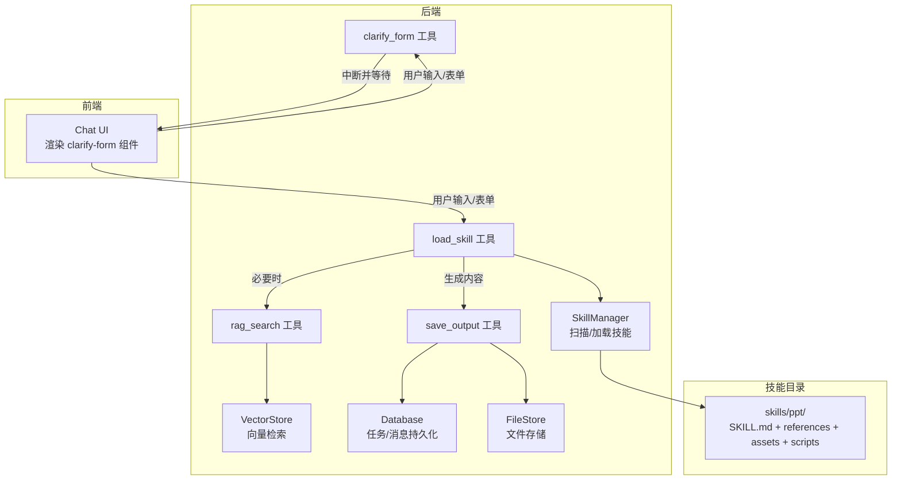
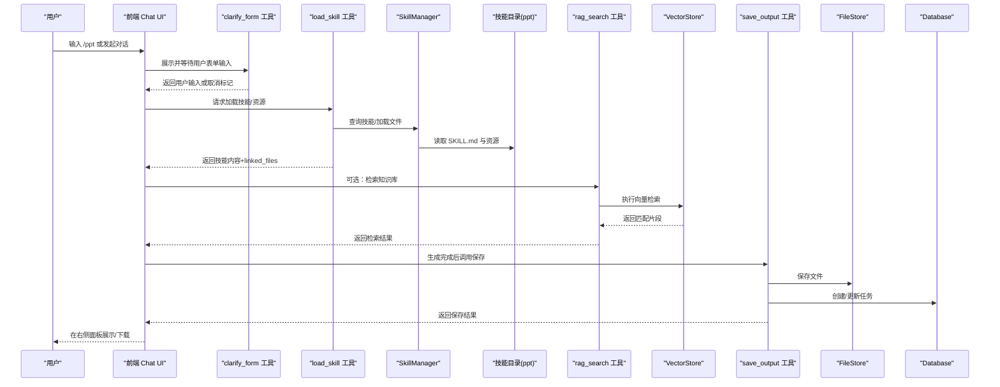
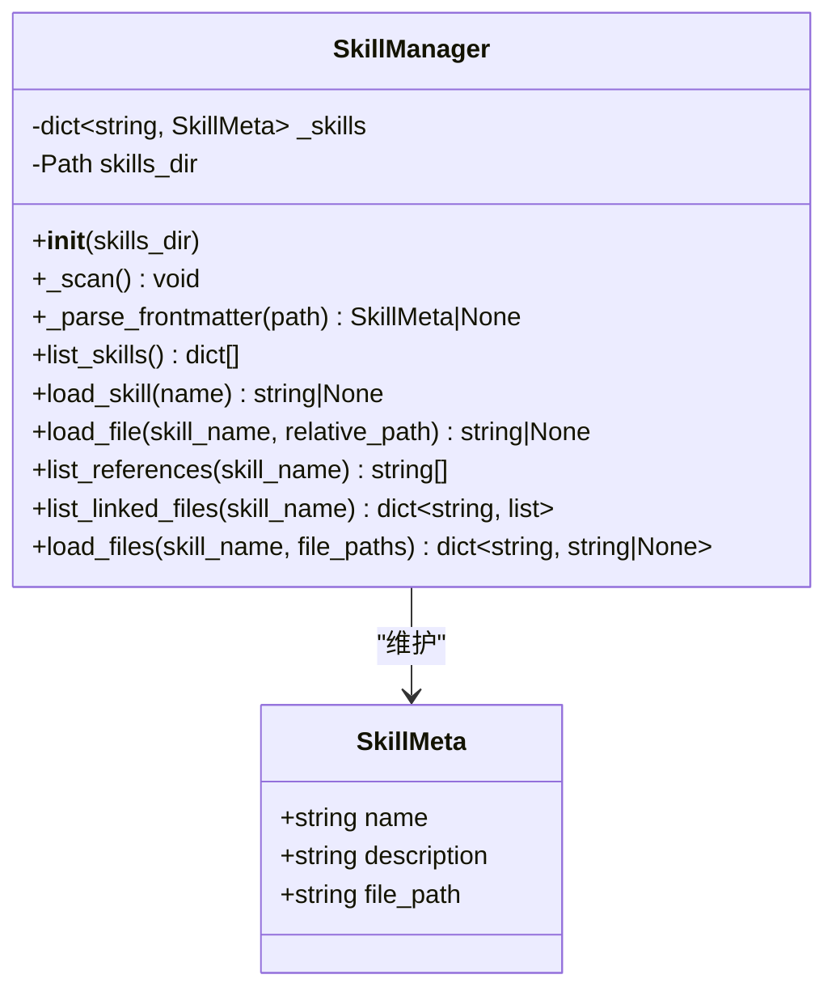
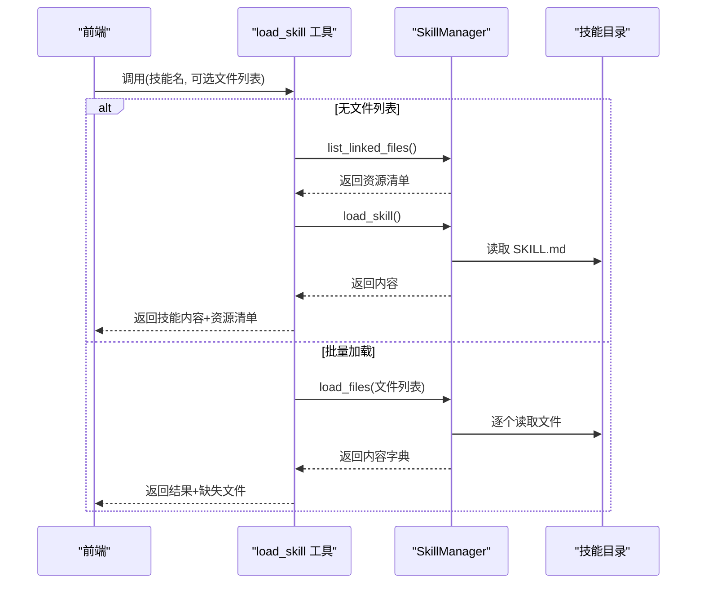
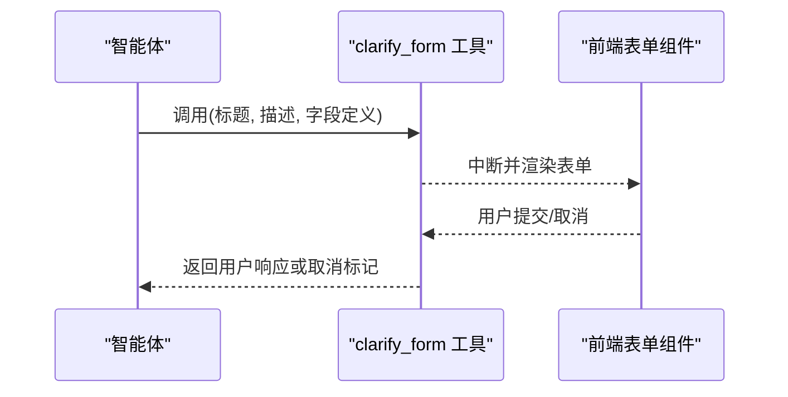
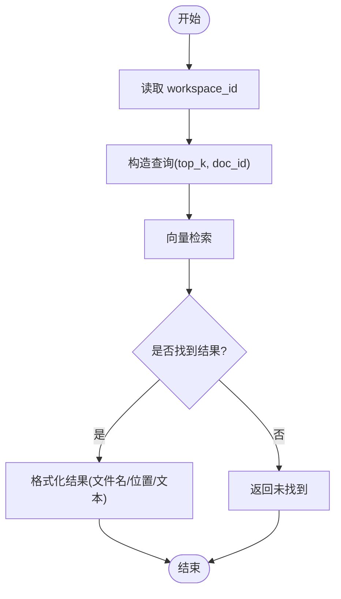
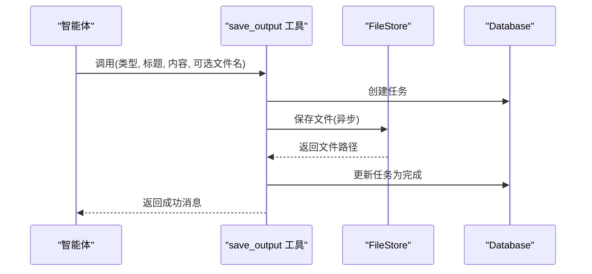
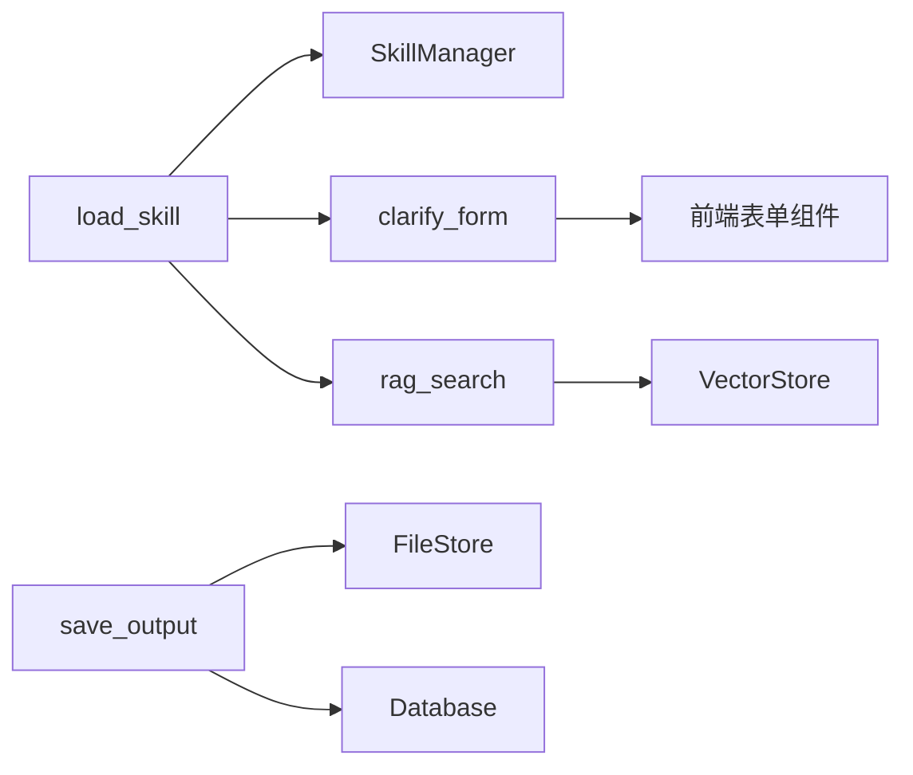

# 技能执行工作流

<cite>
**本文引用的文件**
- [backend/src/agent/skill_manager.py](file://backend/src/agent/skill_manager.py)
- [backend/src/tools/load_skill.py](file://backend/src/tools/load_skill.py)
- [backend/src/tools/clarify_form.py](file://backend/src/tools/clarify_form.py)
- [backend/src/tools/rag_search.py](file://backend/src/tools/rag_search.py)
- [backend/src/tools/save_output.py](file://backend/src/tools/save_output.py)
- [backend/skills/ppt/SKILL.md](file://backend/skills/ppt/SKILL.md)
- [backend/skills/ppt/references/html-template.md](file://backend/skills/ppt/references/html-template.md)
- [backend/skills/ppt/references/style-presets.md](file://backend/skills/ppt/references/style-presets.md)
- [backend/skills/ppt/references/animation-patterns.md](file://backend/skills/ppt/references/animation-patterns.md)
- [backend/skills/ppt/assets/viewport-base.css](file://backend/skills/ppt/assets/viewport-base.css)
- [backend/src/agent/state.py](file://backend/src/agent/state.py)
- [backend/src/storage/database.py](file://backend/src/storage/database.py)
- [backend/src/storage/file_store.py](file://backend/src/storage/file_store.py)
- [backend/src/storage/vector_store.py](file://backend/src/storage/vector_store.py)
- [frontend/src/components/chat/clarify-form.tsx](file://frontend/src/components/chat/clarify-form.tsx)
</cite>

## 目录
1. [引言](#引言)
2. [项目结构](#项目结构)
3. [核心组件](#核心组件)
4. [架构总览](#架构总览)
5. [详细组件分析](#详细组件分析)
6. [依赖分析](#依赖分析)
7. [性能考虑](#性能考虑)
8. [故障排查指南](#故障排查指南)
9. [结论](#结论)
10. [附录](#附录)

## 引言
本文件面向 Train Agent 的“技能执行平台”，围绕技能执行的完整生命周期进行数据流与控制流的深度解析。重点覆盖以下流程：
- 命令识别（/ppt）→ 技能加载（load_skill）→ 渐进式披露机制 → 可选的 clarify_form 表单中断 → 可选的 rag_search 检索 → 技能执行（PPT 生成）→ 产出保存（save_output）→ 前端展示
同时，详细说明技能管理器的扫描机制、动态加载策略、文件路径安全验证、表单中断的多轮交互模式；解释技能目录结构（SKILL.md、references、assets、scripts）的作用，以及 Workspace 隔离如何确保技能文件的安全访问。最后提供技能开发示例与最佳实践。

## 项目结构
后端采用“技能即插件”的设计，技能以目录形式组织，每个技能包含元数据文件与配套资源。前端通过聊天组件渲染表单并接收后端中断信号，实现多轮交互。

图表来源
- [backend/src/agent/skill_manager.py:14-117](file://backend/src/agent/skill_manager.py#L14-L117)
- [backend/src/tools/load_skill.py:13-116](file://backend/src/tools/load_skill.py#L13-L116)
- [backend/src/tools/clarify_form.py:24-46](file://backend/src/tools/clarify_form.py#L24-L46)
- [backend/src/tools/rag_search.py:40-76](file://backend/src/tools/rag_search.py#L40-L76)
- [backend/src/tools/save_output.py:61-99](file://backend/src/tools/save_output.py#L61-L99)
- [backend/src/storage/vector_store.py:124-163](file://backend/src/storage/vector_store.py#L124-L163)
- [backend/src/storage/database.py:342-379](file://backend/src/storage/database.py#L342-L379)
- [backend/src/storage/file_store.py:11-28](file://backend/src/storage/file_store.py#L11-L28)
- [backend/skills/ppt/SKILL.md:1-269](file://backend/skills/ppt/SKILL.md#L1-L269)

章节来源
- [backend/src/agent/skill_manager.py:14-117](file://backend/src/agent/skill_manager.py#L14-L117)
- [backend/src/tools/load_skill.py:13-116](file://backend/src/tools/load_skill.py#L13-L116)
- [backend/skills/ppt/SKILL.md:1-269](file://backend/skills/ppt/SKILL.md#L1-L269)

## 核心组件
- 技能管理器（SkillManager）：扫描技能目录中的 SKILL.md，解析 YAML frontmatter，建立技能清单；提供按需加载技能主提示与资源文件的能力，并对文件路径进行安全校验。
- 动态加载工具（load_skill）：根据技能名称动态生成工具描述，支持一次性加载多个文件（最多 5 个），并替换模板变量（如 ${SKILL_DIR}）。
- 表单中断工具（clarify_form）：在技能执行的关键节点暂停，向用户展示交互式表单，等待用户输入后再继续。
- 检索工具（rag_search）：基于当前工作区的向量库检索相关文档片段，支持限定文档 ID。
- 产出保存工具（save_output）：异步保存产出到文件存储，并在数据库中创建/更新任务记录。
- 存储层：向量库（Chroma + DashScope 嵌入）、文件存储（按 Workspace 隔离）、数据库（任务/消息持久化）。
- 前端表单组件（clarify-form.tsx）：负责渲染表单 UI，收集用户输入并回传后端。

章节来源
- [backend/src/agent/skill_manager.py:14-117](file://backend/src/agent/skill_manager.py#L14-L117)
- [backend/src/tools/load_skill.py:13-116](file://backend/src/tools/load_skill.py#L13-L116)
- [backend/src/tools/clarify_form.py:24-46](file://backend/src/tools/clarify_form.py#L24-L46)
- [backend/src/tools/rag_search.py:40-76](file://backend/src/tools/rag_search.py#L40-L76)
- [backend/src/tools/save_output.py:61-99](file://backend/src/tools/save_output.py#L61-L99)
- [backend/src/storage/vector_store.py:124-163](file://backend/src/storage/vector_store.py#L124-L163)
- [backend/src/storage/file_store.py:11-28](file://backend/src/storage/file_store.py#L11-L28)
- [backend/src/storage/database.py:342-379](file://backend/src/storage/database.py#L342-L379)
- [frontend/src/components/chat/clarify-form.tsx:21-106](file://frontend/src/components/chat/clarify-form.tsx#L21-L106)

## 架构总览
下图展示了从命令触发到最终产物交付的端到端数据流与控制流。

图表来源
- [backend/src/tools/clarify_form.py:24-46](file://backend/src/tools/clarify_form.py#L24-L46)
- [backend/src/tools/load_skill.py:13-116](file://backend/src/tools/load_skill.py#L13-L116)
- [backend/src/agent/skill_manager.py:57-82](file://backend/src/agent/skill_manager.py#L57-L82)
- [backend/skills/ppt/SKILL.md:66-259](file://backend/skills/ppt/SKILL.md#L66-L259)
- [backend/src/tools/rag_search.py:40-76](file://backend/src/tools/rag_search.py#L40-L76)
- [backend/src/storage/vector_store.py:124-163](file://backend/src/storage/vector_store.py#L124-L163)
- [backend/src/tools/save_output.py:61-99](file://backend/src/tools/save_output.py#L61-L99)
- [backend/src/storage/file_store.py:18-28](file://backend/src/storage/file_store.py#L18-L28)
- [backend/src/storage/database.py:342-379](file://backend/src/storage/database.py#L342-L379)

## 详细组件分析

### 技能管理器（SkillManager）
- 扫描机制：遍历技能根目录，定位每个子目录下的 SKILL.md，解析 YAML frontmatter，构建技能清单。
- 动态加载策略：按需读取技能主提示与资源文件；支持批量加载多个文件，限制最多 5 个。
- 文件路径安全验证：通过 resolve 与父目录包含判断，防止路径逃逸；仅允许访问技能根目录内的文件。
- 资源清单：列出 references、templates、scripts、assets 等子目录中的文件，用于前端展示与工具调用。

图表来源
- [backend/src/agent/skill_manager.py:7-117](file://backend/src/agent/skill_manager.py#L7-L117)

章节来源
- [backend/src/agent/skill_manager.py:26-117](file://backend/src/agent/skill_manager.py#L26-L117)

### 动态加载工具（load_skill）
- 动态描述：根据技能清单生成工具描述，展示可用技能与功能说明。
- 单次加载：返回技能主提示与 linked_files；若包含 ${SKILL_DIR}，则替换为实际技能目录路径。
- 批量加载：限制最多 5 个文件，返回缺失文件清单；便于前端按需渲染。
- 错误处理：技能不存在或文件缺失时返回结构化错误信息，便于前端提示。

图表来源
- [backend/src/tools/load_skill.py:13-116](file://backend/src/tools/load_skill.py#L13-L116)
- [backend/src/agent/skill_manager.py:57-117](file://backend/src/agent/skill_manager.py#L57-L117)

章节来源
- [backend/src/tools/load_skill.py:13-116](file://backend/src/tools/load_skill.py#L13-L116)
- [backend/src/agent/skill_manager.py:57-117](file://backend/src/agent/skill_manager.py#L57-L117)

### 表单中断工具（clarify_form）
- 多轮交互：在关键节点中断，等待用户输入；返回值包含取消标记时，尊重用户意愿。
- 前端集成：前端组件渲染交互式表单，收集文本/单选/多选输入，提交后回传后端。
- 使用约束：调用前需先输出说明性消息；避免在同一消息中附带说明文字。

图表来源
- [backend/src/tools/clarify_form.py:24-46](file://backend/src/tools/clarify_form.py#L24-L46)
- [frontend/src/components/chat/clarify-form.tsx:21-106](file://frontend/src/components/chat/clarify-form.tsx#L21-L106)

章节来源
- [backend/src/tools/clarify_form.py:24-46](file://backend/src/tools/clarify_form.py#L24-L46)
- [frontend/src/components/chat/clarify-form.tsx:21-106](file://frontend/src/components/chat/clarify-form.tsx#L21-L106)

### 检索工具（rag_search）
- 工作区隔离：从运行时状态提取 workspace_id，限定检索范围。
- 文档级检索：支持指定 doc_id 仅在该文档内检索；未指定则在当前工作区全部文档中检索。
- 结果格式化：将检索结果转为人类可读的片段列表，包含文件名、位置与文本。

图表来源
- [backend/src/tools/rag_search.py:40-76](file://backend/src/tools/rag_search.py#L40-L76)
- [backend/src/storage/vector_store.py:124-163](file://backend/src/storage/vector_store.py#L124-L163)

章节来源
- [backend/src/tools/rag_search.py:40-76](file://backend/src/tools/rag_search.py#L40-L76)
- [backend/src/storage/vector_store.py:124-163](file://backend/src/storage/vector_store.py#L124-L163)

### 产出保存工具（save_output）
- 任务创建：在数据库中创建任务记录，状态初始为“生成中”。
- 文件保存：异步写入文件存储，路径按 workspace_id 分隔；默认根据类型映射扩展名。
- 结果回传：更新任务状态为“已完成”并写入文件路径；异常时更新为“失败”。

图表来源
- [backend/src/tools/save_output.py:61-99](file://backend/src/tools/save_output.py#L61-L99)
- [backend/src/storage/file_store.py:18-28](file://backend/src/storage/file_store.py#L18-L28)
- [backend/src/storage/database.py:342-379](file://backend/src/storage/database.py#L342-L379)

章节来源
- [backend/src/tools/save_output.py:61-99](file://backend/src/tools/save_output.py#L61-L99)
- [backend/src/storage/file_store.py:18-28](file://backend/src/storage/file_store.py#L18-L28)
- [backend/src/storage/database.py:342-379](file://backend/src/storage/database.py#L342-L379)

### 技能目录结构与渐进式披露
- SKILL.md：技能元数据（name/description）与执行规范（阶段划分、关键步骤、前置条件、交付要求）。
- references：参考文档（模板、样式、动画），供生成阶段引用。
- assets：静态资源（如 viewport 基础样式），强制包含于最终产物。
- scripts：可选的辅助脚本（如图像处理），由技能自行调用。
- 渐进式披露：工具描述仅列出可用技能，具体细节在加载技能时按需呈现；资源清单帮助前端按需渲染。

章节来源
- [backend/skills/ppt/SKILL.md:1-269](file://backend/skills/ppt/SKILL.md#L1-L269)
- [backend/skills/ppt/references/html-template.md:1-420](file://backend/skills/ppt/references/html-template.md#L1-L420)
- [backend/skills/ppt/references/style-presets.md:1-348](file://backend/skills/ppt/references/style-presets.md#L1-L348)
- [backend/skills/ppt/references/animation-patterns.md:1-111](file://backend/skills/ppt/references/animation-patterns.md#L1-L111)
- [backend/skills/ppt/assets/viewport-base.css:1-154](file://backend/skills/ppt/assets/viewport-base.css#L1-L154)

## 依赖分析
- 后端依赖：LangGraph 工具装饰器、Pydantic 模型、ChromaDB 向量库、DashScope 嵌入服务、aiosqlite 数据库。
- 前端依赖：React 组件、图标库、表单交互逻辑。
- 关键耦合点：
  - SkillManager 与技能目录的耦合（文件系统）。
  - 工具链之间的协作（load_skill → clarify_form/rag_search → save_output）。
  - Workspace 隔离通过 workspace_id 实现（状态、向量库集合、文件存储目录）。

图表来源
- [backend/src/tools/load_skill.py:13-116](file://backend/src/tools/load_skill.py#L13-L116)
- [backend/src/agent/skill_manager.py:57-117](file://backend/src/agent/skill_manager.py#L57-L117)
- [backend/src/tools/clarify_form.py:24-46](file://backend/src/tools/clarify_form.py#L24-L46)
- [backend/src/tools/rag_search.py:40-76](file://backend/src/tools/rag_search.py#L40-L76)
- [backend/src/storage/vector_store.py:124-163](file://backend/src/storage/vector_store.py#L124-L163)
- [backend/src/tools/save_output.py:61-99](file://backend/src/tools/save_output.py#L61-L99)
- [backend/src/storage/file_store.py:18-28](file://backend/src/storage/file_store.py#L18-L28)
- [backend/src/storage/database.py:342-379](file://backend/src/storage/database.py#L342-L379)
- [frontend/src/components/chat/clarify-form.tsx:21-106](file://frontend/src/components/chat/clarify-form.tsx#L21-L106)

章节来源
- [backend/src/agent/state.py:4-7](file://backend/src/agent/state.py#L4-L7)
- [backend/src/storage/vector_store.py:124-163](file://backend/src/storage/vector_store.py#L124-L163)
- [backend/src/storage/file_store.py:18-28](file://backend/src/storage/file_store.py#L18-L28)
- [backend/src/storage/database.py:342-379](file://backend/src/storage/database.py#L342-L379)

## 性能考虑
- 向量检索：top_k 控制返回片段数量；按 workspace_id 与 doc_id 进行过滤，减少无关计算。
- 文件 I/O：save_output 使用异步写入，避免阻塞；批量加载文件限制数量，降低磁盘压力。
- 路径安全：SkillManager 对文件路径进行严格校验，避免越权访问与路径逃逸。
- 前端渲染：表单组件按需渲染，提交后即时反馈，提升交互体验。

## 故障排查指南
- 技能未找到：检查技能目录是否存在 SKILL.md；确认工具描述中列出的技能名称是否正确。
- 文件缺失：load_skill 批量加载会返回缺失文件清单；核对 references/scripts/assets 下的相对路径。
- 检索失败：确认嵌入 API 凭据与基础地址配置；检查工作区向量集合是否存在。
- 保存失败：查看数据库任务状态更新日志；确认文件存储目录权限与磁盘空间。
- 表单取消：尊重用户取消标记，避免继续执行后续步骤。

章节来源
- [backend/src/tools/load_skill.py:66-74](file://backend/src/tools/load_skill.py#L66-L74)
- [backend/src/tools/rag_search.py:59-61](file://backend/src/tools/rag_search.py#L59-L61)
- [backend/src/tools/save_output.py:51-58](file://backend/src/tools/save_output.py#L51-L58)
- [backend/src/tools/clarify_form.py:42-43](file://backend/src/tools/clarify_form.py#L42-L43)

## 结论
本平台通过“技能即插件”的架构，结合渐进式披露与多轮表单交互，实现了从命令识别到产物交付的完整闭环。SkillManager 提供安全可靠的技能与资源加载能力；load_skill、clarify_form、rag_search、save_output 形成清晰的工具链；Workspace 隔离确保了不同工作区的资源与数据互不干扰。前端表单组件与后端工具协同，提供了良好的用户体验与可控的执行流程。

## 附录

### 技能开发示例与最佳实践
- 目录结构
  - 必备：SKILL.md（含 name/description）。
  - 推荐：references（模板/样式/动画）、assets（强制包含的 CSS）、scripts（可选辅助脚本）。
- 执行规范
  - 明确阶段划分与关键节点（如“大纲确认”“最终生成”“保存输出”）。
  - 在保存前严格确认用户对最终内容的认可，避免提前调用保存工具。
- 资源引用
  - 通过 load_skill 的 linked_files 与相对路径加载资源；避免硬编码绝对路径。
  - 强制包含 viewport 基础样式，确保每页适配视口且不可滚动。
- 安全与合规
  - 严禁在技能中执行外部命令或访问技能目录外文件；所有文件访问均经 SkillManager 校验。
  - 生成内容应自包含（如 PPT 为自包含 HTML），避免依赖外部资源。
- 前端交互
  - 使用 clarify_form 收集必要参数；避免在同一消息中附带说明文字。
  - 通过 rag_search 获取上下文增强生成质量，但需尊重用户选择的文档范围。

章节来源
- [backend/skills/ppt/SKILL.md:66-259](file://backend/skills/ppt/SKILL.md#L66-L259)
- [backend/skills/ppt/references/html-template.md:1-420](file://backend/skills/ppt/references/html-template.md#L1-L420)
- [backend/skills/ppt/references/style-presets.md:1-348](file://backend/skills/ppt/references/style-presets.md#L1-L348)
- [backend/skills/ppt/references/animation-patterns.md:1-111](file://backend/skills/ppt/references/animation-patterns.md#L1-L111)
- [backend/skills/ppt/assets/viewport-base.css:1-154](file://backend/skills/ppt/assets/viewport-base.css#L1-L154)
- [backend/src/tools/load_skill.py:35-42](file://backend/src/tools/load_skill.py#L35-L42)
- [backend/src/tools/clarify_form.py:24-34](file://backend/src/tools/clarify_form.py#L24-L34)
- [backend/src/tools/save_output.py:61-70](file://backend/src/tools/save_output.py#L61-L70)