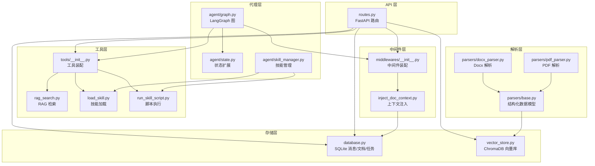
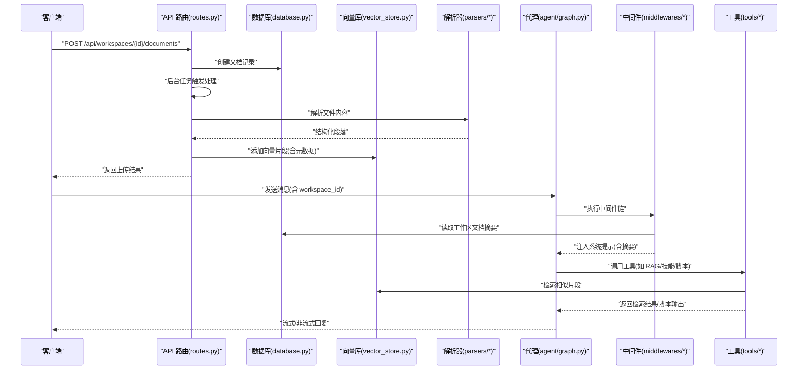
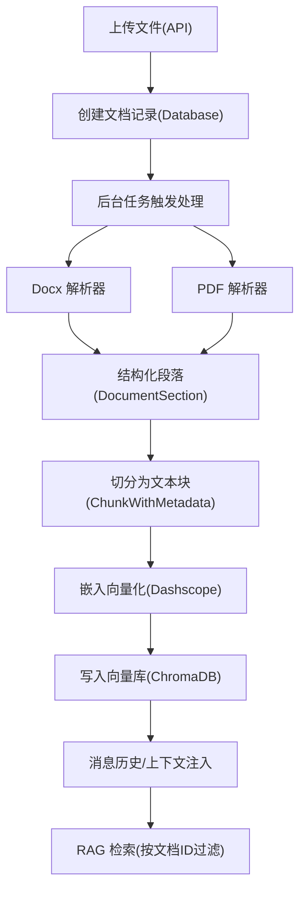
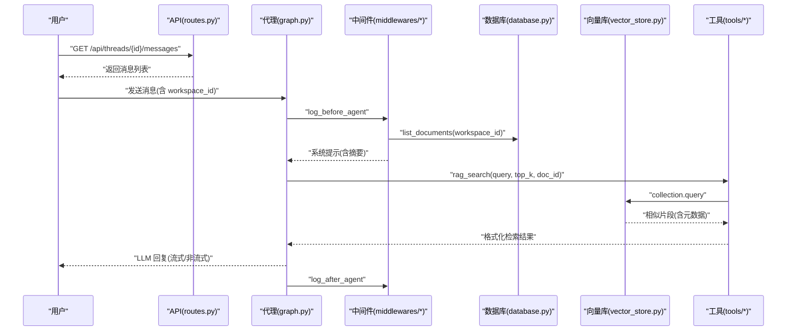
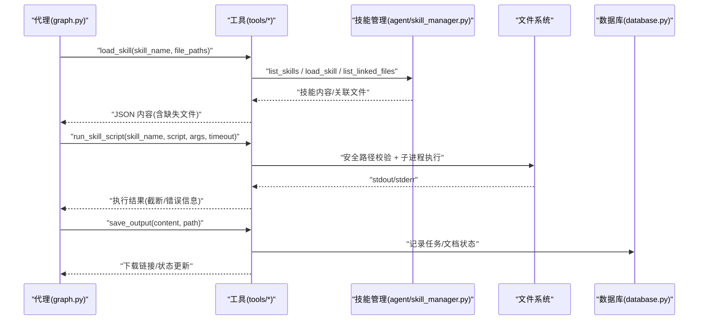
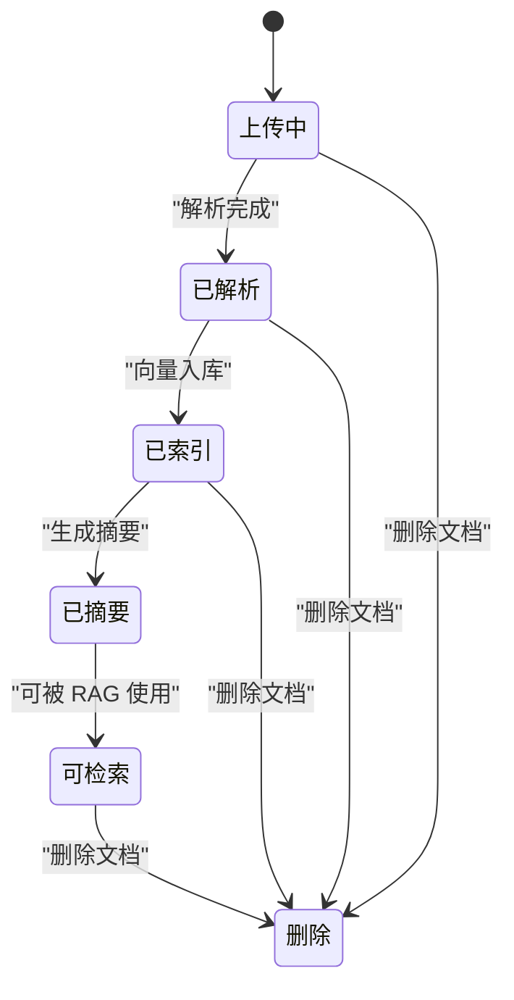
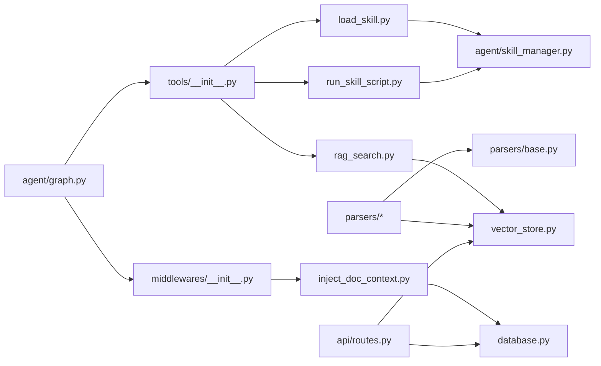

# 数据流分析

<cite>
**本文引用的文件**
- [backend/src/agent/graph.py](file://backend/src/agent/graph.py)
- [backend/src/agent/state.py](file://backend/src/agent/state.py)
- [backend/src/agent/skill_manager.py](file://backend/src/agent/skill_manager.py)
- [backend/src/middlewares/inject_doc_context.py](file://backend/src/middlewares/inject_doc_context.py)
- [backend/src/middlewares/__init__.py](file://backend/src/middlewares/__init__.py)
- [backend/src/tools/rag_search.py](file://backend/src/tools/rag_search.py)
- [backend/src/tools/load_skill.py](file://backend/src/tools/load_skill.py)
- [backend/src/tools/run_skill_script.py](file://backend/src/tools/run_skill_script.py)
- [backend/src/tools/__init__.py](file://backend/src/tools/__init__.py)
- [backend/src/storage/vector_store.py](file://backend/src/storage/vector_store.py)
- [backend/src/storage/database.py](file://backend/src/storage/database.py)
- [backend/src/parsers/base.py](file://backend/src/parsers/base.py)
- [backend/src/parsers/docx_parser.py](file://backend/src/parsers/docx_parser.py)
- [backend/src/parsers/pdf_parser.py](file://backend/src/parsers/pdf_parser.py)
- [backend/src/api/routes.py](file://backend/src/api/routes.py)
</cite>

## 目录
1. [简介](#简介)
2. [项目结构](#项目结构)
3. [核心组件](#核心组件)
4. [架构总览](#架构总览)
5. [详细组件分析](#详细组件分析)
6. [依赖关系分析](#依赖关系分析)
7. [性能考量](#性能考量)
8. [故障排查指南](#故障排查指南)
9. [结论](#结论)
10. [附录](#附录)

## 简介
本文件面向 Train Agent 项目的开发者与使用者，提供从“文档上传”到“智能问答”再到“技能执行”的完整数据流分析。重点覆盖以下三条主线：
- 文档处理流水线：上传 → 解析 → 分块 → 索引 → 摘要
- 智能问答流程：消息接收 → 上下文注入 → RAG 检索 → LLM 推理 → 结果生成
- 技能执行流程：命令识别 → 技能加载 → 工具调用 → 产出生成

文档通过数据流图与状态机图，帮助理解数据在各层之间的传递格式、状态转换与错误处理机制。

## 项目结构
后端采用模块化分层组织：
- API 层：FastAPI 路由定义与静态资源挂载
- 存储层：SQLite（消息/文档/任务）、向量数据库（ChromaDB）
- 解析层：Docx/PDF 等解析器，输出结构化段落
- 工具层：RAG 检索、技能加载、脚本执行、输出保存等工具
- 中间件层：日志、请求清洗、文档上下文注入、消息历史与摘要
- 代理层：LangGraph 图构建、状态管理、回调

图表来源
- [backend/src/api/routes.py:1-189](file://backend/src/api/routes.py#L1-L189)
- [backend/src/storage/database.py:1-379](file://backend/src/storage/database.py#L1-L379)
- [backend/src/storage/vector_store.py:1-177](file://backend/src/storage/vector_store.py#L1-L177)
- [backend/src/parsers/base.py:1-97](file://backend/src/parsers/base.py#L1-L97)
- [backend/src/parsers/docx_parser.py:1-84](file://backend/src/parsers/docx_parser.py#L1-L84)
- [backend/src/parsers/pdf_parser.py:1-192](file://backend/src/parsers/pdf_parser.py#L1-L192)
- [backend/src/tools/__init__.py:1-20](file://backend/src/tools/__init__.py#L1-L20)
- [backend/src/tools/rag_search.py:1-76](file://backend/src/tools/rag_search.py#L1-L76)
- [backend/src/tools/load_skill.py:1-116](file://backend/src/tools/load_skill.py#L1-L116)
- [backend/src/tools/run_skill_script.py:1-143](file://backend/src/tools/run_skill_script.py#L1-L143)
- [backend/src/middlewares/__init__.py:1-41](file://backend/src/middlewares/__init__.py#L1-L41)
- [backend/src/middlewares/inject_doc_context.py:1-41](file://backend/src/middlewares/inject_doc_context.py#L1-L41)
- [backend/src/agent/graph.py:1-49](file://backend/src/agent/graph.py#L1-L49)
- [backend/src/agent/state.py:1-7](file://backend/src/agent/state.py#L1-L7)
- [backend/src/agent/skill_manager.py:1-117](file://backend/src/agent/skill_manager.py#L1-L117)

章节来源
- [backend/src/api/routes.py:1-189](file://backend/src/api/routes.py#L1-L189)

## 核心组件
- LangGraph 图与状态
  - 图负责装配模型、工具与中间件，状态扩展包含工作区标识，便于跨组件共享上下文。
- 中间件链
  - 日志前后置、消息历史、请求清洗、文档上下文注入、消息摘要。
- 工具集
  - RAG 检索、技能加载、脚本执行、输出保存、澄清表单。
- 存储与索引
  - SQLite 记录消息、文档、任务元数据；ChromaDB 存储嵌入向量，支持按文档 ID 过滤检索。
- 解析与分块
  - Docx/PDF 解析为结构化段落，再递归切分为固定大小的文本块并附加章节/页码元数据。

章节来源
- [backend/src/agent/graph.py:16-49](file://backend/src/agent/graph.py#L16-L49)
- [backend/src/agent/state.py:4-7](file://backend/src/agent/state.py#L4-L7)
- [backend/src/middlewares/__init__.py:18-41](file://backend/src/middlewares/__init__.py#L18-L41)
- [backend/src/tools/__init__.py:11-20](file://backend/src/tools/__init__.py#L11-L20)
- [backend/src/storage/vector_store.py:39-177](file://backend/src/storage/vector_store.py#L39-L177)
- [backend/src/parsers/base.py:18-97](file://backend/src/parsers/base.py#L18-L97)

## 架构总览
下图展示从 API 到代理、工具与存储的整体数据流向。

图表来源
- [backend/src/api/routes.py:112-141](file://backend/src/api/routes.py#L112-L141)
- [backend/src/storage/database.py:285-311](file://backend/src/storage/database.py#L285-L311)
- [backend/src/storage/vector_store.py:91-122](file://backend/src/storage/vector_store.py#L91-L122)
- [backend/src/parsers/docx_parser.py:20-84](file://backend/src/parsers/docx_parser.py#L20-L84)
- [backend/src/parsers/pdf_parser.py:17-192](file://backend/src/parsers/pdf_parser.py#L17-L192)
- [backend/src/agent/graph.py:16-37](file://backend/src/agent/graph.py#L16-L37)
- [backend/src/middlewares/inject_doc_context.py:11-41](file://backend/src/middlewares/inject_doc_context.py#L11-L41)
- [backend/src/tools/rag_search.py:40-76](file://backend/src/tools/rag_search.py#L40-L76)

## 详细组件分析

### 文档处理流水线：上传 → 解析 → 分块 → 索引 → 摘要
- 上传入口
  - API 接收文件，写入数据库记录，随后在后台任务中触发处理。
- 解析阶段
  - Docx：基于标题样式提取章节，回退为整篇文档作为单一章节。
  - PDF：基于字体大小与加粗启发式识别标题，按页面/段落聚合，失败时按页回退。
- 分块与元数据
  - 将结构化段落递归切分为固定长度的文本块，并附加章节标题、页码、层级等元数据。
- 索引入库
  - 使用嵌入模型生成向量，写入对应工作区集合；支持按文档 ID 过滤检索。
- 摘要生成
  - 中间件在系统提示中注入当前工作区文档摘要，供 LLM 在回答中引用。

图表来源
- [backend/src/api/routes.py:112-128](file://backend/src/api/routes.py#L112-L128)
- [backend/src/storage/database.py:285-311](file://backend/src/storage/database.py#L285-L311)
- [backend/src/parsers/docx_parser.py:20-84](file://backend/src/parsers/docx_parser.py#L20-L84)
- [backend/src/parsers/pdf_parser.py:17-192](file://backend/src/parsers/pdf_parser.py#L17-L192)
- [backend/src/parsers/base.py:18-97](file://backend/src/parsers/base.py#L18-L97)
- [backend/src/storage/vector_store.py:13-37](file://backend/src/storage/vector_store.py#L13-L37)
- [backend/src/storage/vector_store.py:91-122](file://backend/src/storage/vector_store.py#L91-L122)
- [backend/src/middlewares/inject_doc_context.py:11-41](file://backend/src/middlewares/inject_doc_context.py#L11-L41)
- [backend/src/tools/rag_search.py:40-76](file://backend/src/tools/rag_search.py#L40-L76)

章节来源
- [backend/src/api/routes.py:112-128](file://backend/src/api/routes.py#L112-L128)
- [backend/src/parsers/docx_parser.py:20-84](file://backend/src/parsers/docx_parser.py#L20-L84)
- [backend/src/parsers/pdf_parser.py:17-192](file://backend/src/parsers/pdf_parser.py#L17-L192)
- [backend/src/parsers/base.py:18-97](file://backend/src/parsers/base.py#L18-L97)
- [backend/src/storage/vector_store.py:91-122](file://backend/src/storage/vector_store.py#L91-L122)
- [backend/src/middlewares/inject_doc_context.py:11-41](file://backend/src/middlewares/inject_doc_context.py#L11-L41)

### 智能问答流程：消息接收 → 上下文注入 → RAG 检索 → LLM 推理 → 结果生成
- 消息接收
  - API 提供线程消息查询接口，代理通过消息历史中间件持久化与恢复对话。
- 上下文注入
  - 中间件根据工作区 ID 查询数据库中的文档摘要，拼接到系统提示中。
- RAG 检索
  - 工具根据查询词与 top_k 在指定工作区集合中检索，支持按 doc_id 限定范围。
- LLM 推理与结果生成
  - 代理装配模型、工具与中间件，执行推理并流式/非流式返回结果。

图表来源
- [backend/src/api/routes.py:84-96](file://backend/src/api/routes.py#L84-L96)
- [backend/src/agent/graph.py:16-37](file://backend/src/agent/graph.py#L16-L37)
- [backend/src/middlewares/inject_doc_context.py:11-41](file://backend/src/middlewares/inject_doc_context.py#L11-L41)
- [backend/src/storage/database.py:313-319](file://backend/src/storage/database.py#L313-L319)
- [backend/src/tools/rag_search.py:40-76](file://backend/src/tools/rag_search.py#L40-L76)
- [backend/src/storage/vector_store.py:124-163](file://backend/src/storage/vector_store.py#L124-L163)

章节来源
- [backend/src/api/routes.py:84-96](file://backend/src/api/routes.py#L84-L96)
- [backend/src/agent/graph.py:16-37](file://backend/src/agent/graph.py#L16-L37)
- [backend/src/middlewares/inject_doc_context.py:11-41](file://backend/src/middlewares/inject_doc_context.py#L11-L41)
- [backend/src/storage/database.py:313-319](file://backend/src/storage/database.py#L313-L319)
- [backend/src/tools/rag_search.py:40-76](file://backend/src/tools/rag_search.py#L40-L76)
- [backend/src/storage/vector_store.py:124-163](file://backend/src/storage/vector_store.py#L124-L163)

### 技能执行流程：命令识别 → 技能加载 → 工具调用 → 产出生成
- 命令识别
  - 代理通过工具描述动态获知可用技能清单，结合系统提示进行意图识别。
- 技能加载
  - 工具按技能名加载主提示与关联文件，支持批量加载并校验缺失项。
- 工具调用
  - 脚本执行工具限制在技能 scripts/ 目录内，按扩展名选择解释器，支持超时与输出截断。
- 产出生成
  - 输出保存工具将产物写入文件存储并返回下载链接。

图表来源
- [backend/src/agent/graph.py:16-37](file://backend/src/agent/graph.py#L16-L37)
- [backend/src/tools/load_skill.py:13-116](file://backend/src/tools/load_skill.py#L13-L116)
- [backend/src/agent/skill_manager.py:14-117](file://backend/src/agent/skill_manager.py#L14-L117)
- [backend/src/tools/run_skill_script.py:31-143](file://backend/src/tools/run_skill_script.py#L31-L143)
- [backend/src/tools/__init__.py:11-20](file://backend/src/tools/__init__.py#L11-L20)

章节来源
- [backend/src/agent/graph.py:16-37](file://backend/src/agent/graph.py#L16-L37)
- [backend/src/tools/load_skill.py:13-116](file://backend/src/tools/load_skill.py#L13-L116)
- [backend/src/agent/skill_manager.py:14-117](file://backend/src/agent/skill_manager.py#L14-L117)
- [backend/src/tools/run_skill_script.py:31-143](file://backend/src/tools/run_skill_script.py#L31-L143)
- [backend/src/tools/__init__.py:11-20](file://backend/src/tools/__init__.py#L11-L20)

### 状态机：消息与文档生命周期

图表来源
- [backend/src/storage/database.py:285-311](file://backend/src/storage/database.py#L285-L311)
- [backend/src/storage/vector_store.py:91-122](file://backend/src/storage/vector_store.py#L91-L122)
- [backend/src/middlewares/inject_doc_context.py:11-41](file://backend/src/middlewares/inject_doc_context.py#L11-L41)

## 依赖关系分析
- 组件耦合
  - 代理层依赖中间件与工具装配，工具依赖存储层（向量库/数据库），解析器依赖基础数据模型。
- 外部依赖
  - 向量嵌入使用 Dashscope；向量库使用 ChromaDB；文档解析依赖 python-docx、PyMuPDF。
- 循环依赖
  - 文件间为单向依赖，未见循环导入。

图表来源
- [backend/src/agent/graph.py:16-37](file://backend/src/agent/graph.py#L16-L37)
- [backend/src/middlewares/__init__.py:18-41](file://backend/src/middlewares/__init__.py#L18-L41)
- [backend/src/tools/__init__.py:11-20](file://backend/src/tools/__init__.py#L11-L20)
- [backend/src/middlewares/inject_doc_context.py:11-41](file://backend/src/middlewares/inject_doc_context.py#L11-L41)
- [backend/src/tools/rag_search.py:40-76](file://backend/src/tools/rag_search.py#L40-L76)
- [backend/src/tools/load_skill.py:13-116](file://backend/src/tools/load_skill.py#L13-L116)
- [backend/src/tools/run_skill_script.py:31-143](file://backend/src/tools/run_skill_script.py#L31-L143)
- [backend/src/storage/vector_store.py:39-177](file://backend/src/storage/vector_store.py#L39-L177)
- [backend/src/agent/skill_manager.py:14-117](file://backend/src/agent/skill_manager.py#L14-L117)
- [backend/src/storage/database.py:1-379](file://backend/src/storage/database.py#L1-L379)
- [backend/src/parsers/base.py:18-97](file://backend/src/parsers/base.py#L18-L97)
- [backend/src/api/routes.py:112-141](file://backend/src/api/routes.py#L112-L141)

章节来源
- [backend/src/agent/graph.py:16-37](file://backend/src/agent/graph.py#L16-L37)
- [backend/src/middlewares/__init__.py:18-41](file://backend/src/middlewares/__init__.py#L18-L41)
- [backend/src/tools/__init__.py:11-20](file://backend/src/tools/__init__.py#L11-L20)
- [backend/src/storage/vector_store.py:39-177](file://backend/src/storage/vector_store.py#L39-L177)
- [backend/src/storage/database.py:1-379](file://backend/src/storage/database.py#L1-L379)
- [backend/src/parsers/base.py:18-97](file://backend/src/parsers/base.py#L18-L97)
- [backend/src/api/routes.py:112-141](file://backend/src/api/routes.py#L112-L141)

## 性能考量
- 向量检索
  - 使用 cosine 距离与批量写入，建议合理设置 top_k 与分页检索，避免过大的上下文窗口。
- 文本切分
  - 递归切分器按换行/标点分割，注意超大段落的切分成本与元数据一致性。
- 嵌入服务
  - 嵌入调用需考虑并发与限流，必要时增加重试与降级策略。
- 脚本执行
  - 设置超时与输出截断，避免长时间阻塞与上下文溢出。

## 故障排查指南
- RAG 检索无结果
  - 检查工作区集合是否存在；确认文档是否已完成向量化；核对 doc_id 是否匹配。
- 技能加载失败
  - 确认技能目录存在 SKILL.md；检查 file_paths 是否越界；查看缺失文件列表。
- 脚本执行异常
  - 查看子进程返回码与标准错误；确认脚本类型映射与解释器可用性；检查超时配置。
- 文档摘要未注入
  - 确认数据库连接初始化；检查工作区 ID 与文档状态；查看中间件日志级别。

章节来源
- [backend/src/tools/rag_search.py:55-64](file://backend/src/tools/rag_search.py#L55-L64)
- [backend/src/tools/load_skill.py:63-74](file://backend/src/tools/load_skill.py#L63-L74)
- [backend/src/tools/run_skill_script.py:112-115](file://backend/src/tools/run_skill_script.py#L112-L115)
- [backend/src/middlewares/inject_doc_context.py:18-26](file://backend/src/middlewares/inject_doc_context.py#L18-L26)

## 结论
本数据流分析明确了 Train Agent 的三大主线：文档处理、智能问答与技能执行。通过清晰的模块边界与中间件/工具装配，系统实现了可扩展的 RAG 与技能编排能力。建议在生产环境中关注向量检索性能、脚本执行安全与消息摘要策略，以确保稳定性与安全性。

## 附录
- 关键数据结构
  - 文档段落：标题、层级、页码、父标题
  - 文本块：文本、章节/页码/层级、索引
- 常用环境变量
  - 主模型、嵌入模型、DeepSeek/DashScope API 凭证与基地址
- API 端点
  - 工作区、文档、任务、消息、文件下载等