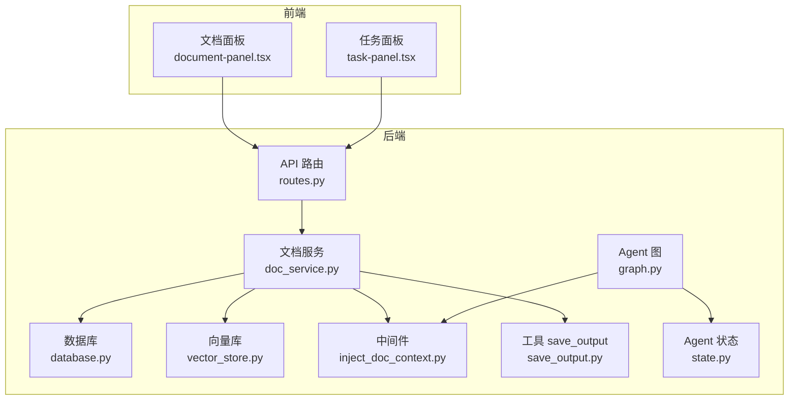
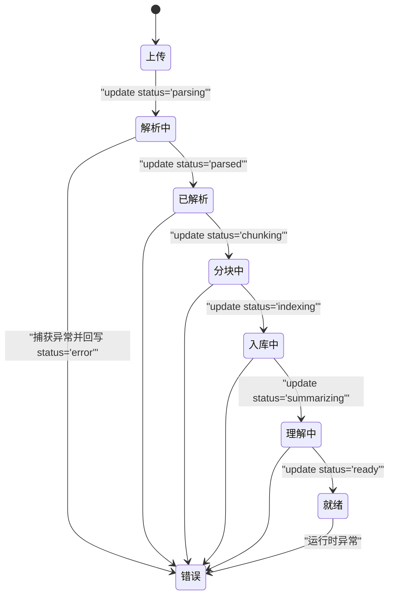
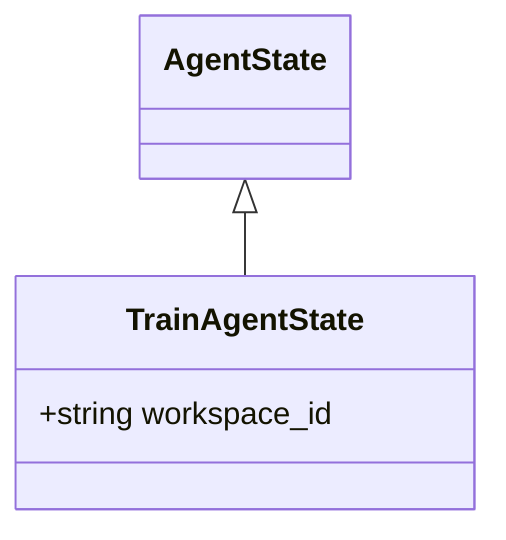
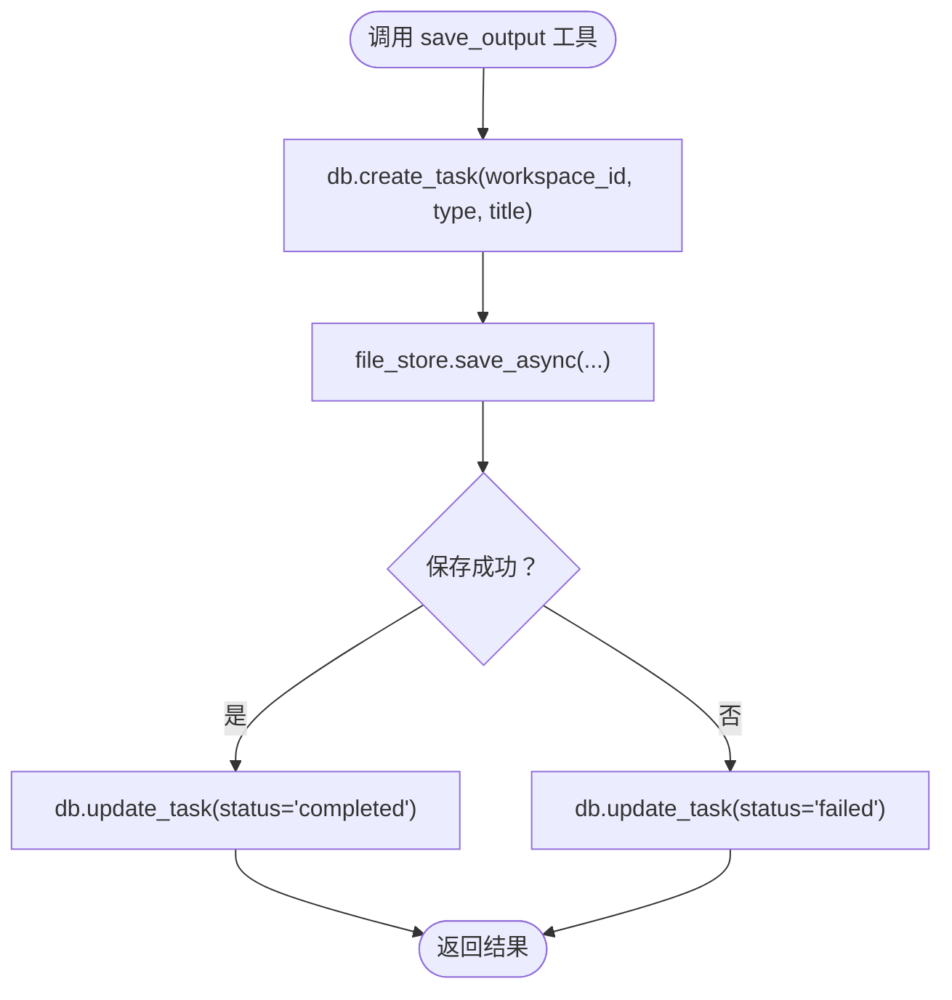
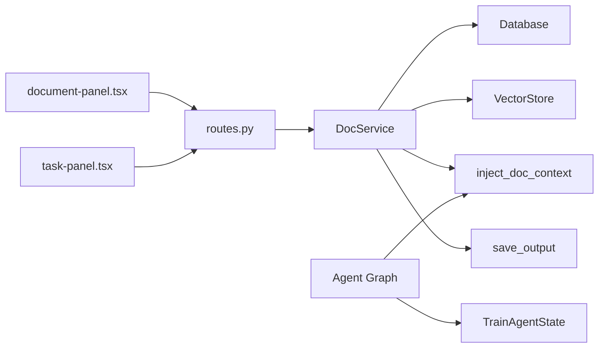

# 数据状态转换

<cite>
**本文引用的文件**
- [backend/src/agent/state.py](file://backend/src/agent/state.py)
- [backend/src/agent/graph.py](file://backend/src/agent/graph.py)
- [backend/src/middlewares/inject_doc_context.py](file://backend/src/middlewares/inject_doc_context.py)
- [backend/src/services/doc_service.py](file://backend/src/services/doc_service.py)
- [backend/src/storage/database.py](file://backend/src/storage/database.py)
- [backend/src/storage/vector_store.py](file://backend/src/storage/vector_store.py)
- [backend/src/tools/save_output.py](file://backend/src/tools/save_output.py)
- [backend/src/api/routes.py](file://backend/src/api/routes.py)
- [backend/src/parsers/base.py](file://backend/src/parsers/base.py)
- [frontend/src/components/document/document-panel.tsx](file://frontend/src/components/document/document-panel.tsx)
- [frontend/src/components/task/task-panel.tsx](file://frontend/src/components/task/task-panel.tsx)
- [user-story/10-thread-recovery.md](file://user-story/10-thread-recovery.md)
</cite>

## 目录
1. [引言](#引言)
2. [项目结构](#项目结构)
3. [核心组件](#核心组件)
4. [架构总览](#架构总览)
5. [详细组件分析](#详细组件分析)
6. [依赖分析](#依赖分析)
7. [性能考虑](#性能考虑)
8. [故障排查指南](#故障排查指南)
9. [结论](#结论)
10. [附录](#附录)

## 引言
本文件围绕 Train Agent 项目的“数据状态转换”进行系统性分析，重点覆盖以下方面：
- 文档状态机：uploaded → parsing → parsed → chunking → indexing → summarizing → ready/error
- Agent 状态：基于 LangChain AgentState 扩展的 TrainAgentState，携带 workspace_id 上下文
- 任务状态：创建、执行、完成、失败
- 触发条件与转换规则、错误回滚机制
- workspace_id 在状态管理中的作用与跨组件一致性保障
- 状态检查点、异常处理策略与监控指标建议
- 状态调试与故障排除实用指南

## 项目结构
后端采用分层设计：API 层负责请求入口与后台任务调度；服务层封装业务流程（文档处理、向量索引、任务管理）；存储层负责数据库、文件存储与向量库；中间件与工具层提供上下文注入与能力扩展；前端提供文档与任务状态的可视化。



图表来源
- [backend/src/api/routes.py:112-128](file://backend/src/api/routes.py#L112-L128)
- [backend/src/services/doc_service.py:29-130](file://backend/src/services/doc_service.py#L29-L130)
- [backend/src/storage/database.py:25-78](file://backend/src/storage/database.py#L25-L78)
- [backend/src/storage/vector_store.py:39-177](file://backend/src/storage/vector_store.py#L39-L177)
- [backend/src/middlewares/inject_doc_context.py:11-41](file://backend/src/middlewares/inject_doc_context.py#L11-L41)
- [backend/src/tools/save_output.py:61-99](file://backend/src/tools/save_output.py#L61-L99)
- [backend/src/agent/graph.py:16-37](file://backend/src/agent/graph.py#L16-L37)
- [backend/src/agent/state.py:4-6](file://backend/src/agent/state.py#L4-L6)

章节来源
- [backend/src/api/routes.py:112-128](file://backend/src/api/routes.py#L112-L128)
- [backend/src/services/doc_service.py:29-130](file://backend/src/services/doc_service.py#L29-L130)
- [backend/src/storage/database.py:25-78](file://backend/src/storage/database.py#L25-L78)
- [backend/src/storage/vector_store.py:39-177](file://backend/src/storage/vector_store.py#L39-L177)
- [backend/src/middlewares/inject_doc_context.py:11-41](file://backend/src/middlewares/inject_doc_context.py#L11-L41)
- [backend/src/tools/save_output.py:61-99](file://backend/src/tools/save_output.py#L61-L99)
- [backend/src/agent/graph.py:16-37](file://backend/src/agent/graph.py#L16-L37)
- [backend/src/agent/state.py:4-6](file://backend/src/agent/state.py#L4-L6)

## 核心组件
- 文档服务 DocService：实现文档从上传到 ready 的完整状态链路，并在异常时回写 error 状态
- 数据库 Database：持久化文档、任务、消息与工作区元数据，提供状态字段与时间戳
- 向量库 VectorStore：按 workspace_id 隔离集合，支持结构化分块与检索
- Agent 状态 TrainAgentState：扩展 AgentState，携带 workspace_id 以便全局上下文一致
- 中间件 inject_doc_context：基于 workspace_id 注入当前工作区文档摘要
- 工具 save_output：创建任务并更新任务状态，作为产出交付的唯一入口
- API 路由：对外暴露上传、列表、删除等接口，触发后台处理流程

章节来源
- [backend/src/services/doc_service.py:13-28](file://backend/src/services/doc_service.py#L13-L28)
- [backend/src/storage/database.py:25-78](file://backend/src/storage/database.py#L25-L78)
- [backend/src/storage/vector_store.py:39-177](file://backend/src/storage/vector_store.py#L39-L177)
- [backend/src/agent/state.py:4-6](file://backend/src/agent/state.py#L4-L6)
- [backend/src/middlewares/inject_doc_context.py:11-41](file://backend/src/middlewares/inject_doc_context.py#L11-L41)
- [backend/src/tools/save_output.py:61-99](file://backend/src/tools/save_output.py#L61-L99)
- [backend/src/api/routes.py:112-128](file://backend/src/api/routes.py#L112-L128)

## 架构总览
下面以序列图展示一次“上传-处理-就绪”的典型流程，以及 Agent 使用 workspace_id 的上下文注入过程。

```mermaid
sequenceDiagram
participant FE as "前端"
participant API as "API 路由"
participant DS as "文档服务"
participant DB as "数据库"
participant VS as "向量库"
participant MW as "注入文档上下文中间件"
FE->>API : "POST /api/workspaces/{workspace_id}/documents"
API->>DS : "create_document_upload(workspace_id, filename, content)"
DS->>DB : "insert document(status='uploaded')"
API-->>FE : "返回上传结果"
API->>DS : "后台任务 process_document(doc_id)"
loop 处理阶段
DS->>DB : "update status='parsing'"
DS->>DS : "解析文件为结构化段落"
DS->>DB : "update status='parsed'"
DS->>VS : "add_structured_chunks(workspace_id, doc_id, chunks)"
DS->>DB : "update status='chunking' → 'indexing'"
DS->>DB : "update status='summarizing'"
DS->>DB : "update status='ready'(summary)"
end
note over DS,DB : "异常时回写 status='error' 并记录 error_message"
DS-->>API : "返回最终文档状态"
API-->>FE : "文档状态实时更新"
AG as "Agent 图"
AG->>MW : "动态提示注入"
MW->>DB : "list_documents(workspace_id)"
MW-->>AG : "拼接摘要作为系统提示"
```

图表来源
- [backend/src/api/routes.py:112-128](file://backend/src/api/routes.py#L112-L128)
- [backend/src/services/doc_service.py:57-130](file://backend/src/services/doc_service.py#L57-L130)
- [backend/src/storage/database.py:285-329](file://backend/src/storage/database.py#L285-L329)
- [backend/src/storage/vector_store.py:91-122](file://backend/src/storage/vector_store.py#L91-L122)
- [backend/src/middlewares/inject_doc_context.py:11-41](file://backend/src/middlewares/inject_doc_context.py#L11-L41)
- [backend/src/agent/graph.py:16-37](file://backend/src/agent/graph.py#L16-L37)

## 详细组件分析

### 文档状态机与转换规则
文档状态机覆盖从上传到就绪的完整生命周期，包含错误回滚与异常处理。



触发条件与规则
- 上传成功后立即写入数据库并标记为 uploaded
- 解析阶段：读取存储路径内容，结构化解析为 DocumentSection 列表，若无可提取文本则直接报错
- 分块阶段：基于章节信息进行递归分块，保留结构元数据
- 入库阶段：按 workspace_id 创建/获取集合，批量写入向量库
- 理解阶段：生成摘要，回写 summary 字段
- 就绪：所有步骤成功后标记 ready
- 错误：任一环节抛出异常，回写 error 状态与错误信息

错误回滚机制
- 数据库层：统一通过 update_document 写入状态与时间戳，保证幂等
- 存储层：文件与向量库按 workspace_id 隔离，便于清理
- 前端：依据数据库状态渲染 UI，错误时展示 error_message

章节来源
- [backend/src/services/doc_service.py:57-130](file://backend/src/services/doc_service.py#L57-L130)
- [backend/src/storage/database.py:321-329](file://backend/src/storage/database.py#L321-L329)
- [backend/src/storage/vector_store.py:91-122](file://backend/src/storage/vector_store.py#L91-L122)
- [backend/src/parsers/base.py:47-97](file://backend/src/parsers/base.py#L47-L97)

### Agent 状态与 workspace_id 作用
- TrainAgentState 继承自 AgentState，并新增 workspace_id 字段，用于贯穿整个对话与工具调用的上下文隔离
- Agent 图在创建时指定 state_schema=TrainAgentState，确保状态结构一致
- 中间件 inject_doc_context 从请求 state 中读取 workspace_id，查询该工作区下的文档摘要并注入系统提示，使 Agent 只在当前工作区范围内检索与引用



图表来源
- [backend/src/agent/state.py:4-6](file://backend/src/agent/state.py#L4-L6)
- [backend/src/agent/graph.py:32-37](file://backend/src/agent/graph.py#L32-L37)

章节来源
- [backend/src/agent/state.py:4-6](file://backend/src/agent/state.py#L4-L6)
- [backend/src/agent/graph.py:32-37](file://backend/src/agent/graph.py#L32-L37)
- [backend/src/middlewares/inject_doc_context.py:11-41](file://backend/src/middlewares/inject_doc_context.py#L11-L41)

### 任务状态与 save_output 工具
- 任务状态：generating → completed/failed
- save_output 工具负责产出物落地与任务记录创建，完成后更新任务状态为 completed，失败则回写 failed
- 任务列表由前端定时轮询刷新，支持下载与删除



图表来源
- [backend/src/tools/save_output.py:28-58](file://backend/src/tools/save_output.py#L28-L58)
- [backend/src/storage/database.py:342-375](file://backend/src/storage/database.py#L342-L375)

章节来源
- [backend/src/tools/save_output.py:61-99](file://backend/src/tools/save_output.py#L61-L99)
- [backend/src/storage/database.py:342-375](file://backend/src/storage/database.py#L342-L375)
- [frontend/src/components/task/task-panel.tsx:53-69](file://frontend/src/components/task/task-panel.tsx#L53-L69)

### 状态检查点与前端可视化
- 文档状态检查点：uploaded/parsing/parsed/chunking/indexing/summarizing/ready/error
- 前端文档面板根据状态映射图标、颜色与标签，错误时展示 error_message
- 前端任务面板定时拉取任务列表，区分生成中/已完成/失败三态，并支持下载

章节来源
- [frontend/src/components/document/document-panel.tsx:24-50](file://frontend/src/components/document/document-panel.tsx#L24-L50)
- [frontend/src/components/document/document-panel.tsx:170-183](file://frontend/src/components/document/document-panel.tsx#L170-L183)
- [frontend/src/components/task/task-panel.tsx:32-51](file://frontend/src/components/task/task-panel.tsx#L32-L51)
- [frontend/src/components/task/task-panel.tsx:53-69](file://frontend/src/components/task/task-panel.tsx#L53-L69)

### 线程恢复与状态一致性
- 用户故事描述了线程丢失后的自动恢复流程：前端检测到 404/未找到错误时清空 threadId，useStream 自动新建线程并通过 API 持久化新的 threadId，确保后续对话无缝继续
- 该机制与 workspace_id 协同，保证同一工作区内的消息与状态一致

章节来源
- [user-story/10-thread-recovery.md:16-31](file://user-story/10-thread-recovery.md#L16-L31)
- [backend/src/api/routes.py:77-81](file://backend/src/api/routes.py#L77-L81)

## 依赖分析
- 文档服务对数据库、文件存储、向量库与解析器的耦合清晰，状态变更通过数据库统一写入
- Agent 图依赖中间件与工具，中间件通过数据库查询工作区文档摘要，形成“状态驱动的上下文”
- 前端通过 API 获取最新状态，实现 UI 与后端状态的一致



图表来源
- [backend/src/services/doc_service.py:13-28](file://backend/src/services/doc_service.py#L13-L28)
- [backend/src/storage/database.py:25-78](file://backend/src/storage/database.py#L25-L78)
- [backend/src/storage/vector_store.py:39-177](file://backend/src/storage/vector_store.py#L39-L177)
- [backend/src/middlewares/inject_doc_context.py:11-41](file://backend/src/middlewares/inject_doc_context.py#L11-L41)
- [backend/src/tools/save_output.py:61-99](file://backend/src/tools/save_output.py#L61-L99)
- [backend/src/agent/graph.py:16-37](file://backend/src/agent/graph.py#L16-L37)
- [backend/src/api/routes.py:112-128](file://backend/src/api/routes.py#L112-L128)
- [frontend/src/components/document/document-panel.tsx:132-134](file://frontend/src/components/document/document-panel.tsx#L132-L134)
- [frontend/src/components/task/task-panel.tsx:53-69](file://frontend/src/components/task/task-panel.tsx#L53-L69)

## 性能考虑
- 分块策略：基于章节的递归分块，避免大段文本破坏语义边界，提升检索质量
- 向量入库批量化：按 batch_size 分批写入，降低单次写入压力
- 摘要生成降级：LLM 失败时回退为截断文本，避免阻塞整体流程
- 前端轮询：任务面板每 5 秒刷新一次，平衡实时性与资源消耗

## 故障排查指南
常见问题与定位思路
- 文档始终处于 parsing/parsed/chunking/indexing/summarizing 等中间态
  - 检查后台任务是否被触发（API 层已添加后台任务）
  - 查看数据库对应 doc_id 的 updated_at 是否推进
  - 关注向量库连接与嵌入模型配置
- 文档状态变为 error
  - 查看 error_message 字段，定位具体异常
  - 确认文件类型与解析器匹配，扫描版 PDF 需 OCR
- Agent 无法获取工作区上下文
  - 确认请求 state 中 workspace_id 是否正确传递
  - 检查中间件是否成功查询到该工作区的文档摘要
- 任务状态长期为 generating
  - 检查 save_output 工具是否被调用
  - 确认文件存储路径与下载接口可用
- 线程恢复失败
  - 确认前端错误识别逻辑是否命中 404/未找到
  - 检查 PATCH /api/workspaces/{workspace_id}/thread 是否成功写入新 thread_id

章节来源
- [backend/src/api/routes.py:112-128](file://backend/src/api/routes.py#L112-L128)
- [backend/src/services/doc_service.py:121-130](file://backend/src/services/doc_service.py#L121-L130)
- [backend/src/middlewares/inject_doc_context.py:11-41](file://backend/src/middlewares/inject_doc_context.py#L11-L41)
- [backend/src/tools/save_output.py:28-58](file://backend/src/tools/save_output.py#L28-L58)
- [user-story/10-thread-recovery.md:16-31](file://user-story/10-thread-recovery.md#L16-L31)

## 结论
本项目通过明确的文档状态机、以 workspace_id 为核心的上下文隔离、以及数据库驱动的状态写入与前端可视化，实现了从上传到就绪的稳定流程。Agent 与中间件的结合进一步提升了工作区内的智能检索与对话体验。建议在生产环境中完善 OpenTelemetry 监控埋点，覆盖状态切换耗时、向量入库延迟与 LLM 调用成功率等关键指标，持续优化用户体验与系统稳定性。

## 附录
- 状态字段定义（来自数据库表结构）
  - 文档：id、workspace_id、filename、file_type、summary、storage_path、status、error_message、created_at、updated_at
  - 任务：id、workspace_id、type、title、status、result_data、created_at、updated_at
  - 工作区：id、user_id、name、thread_id、created_at
- 建议监控指标
  - 文档状态流转耗时（uploaded→parsed、parsed→chunking、chunking→indexing、indexing→summarizing、summarizing→ready）
  - 向量入库吞吐（条/秒）、批大小与失败率
  - LLM 摘要调用成功率与 P95 延迟
  - Agent 上下文注入命中率与响应时间
  - 任务完成率与失败原因分布