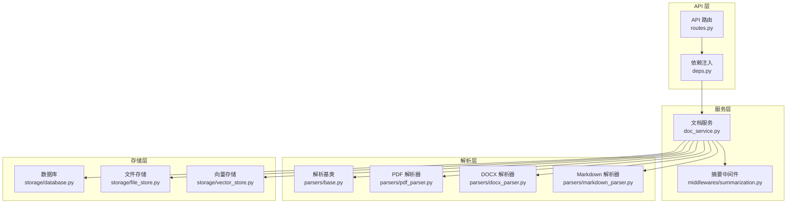
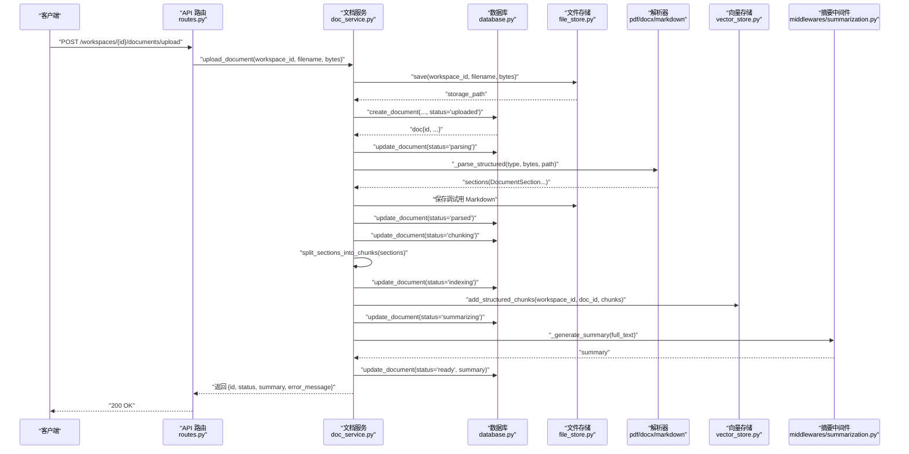
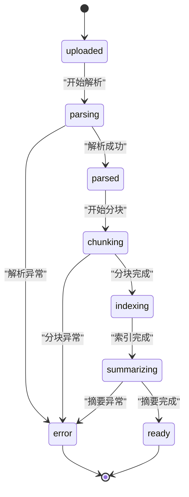
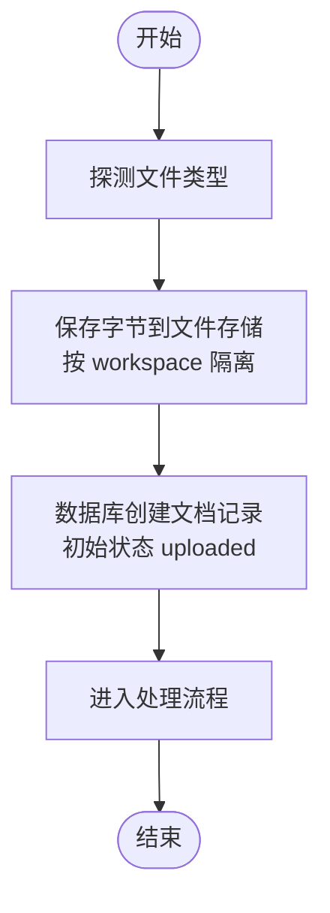
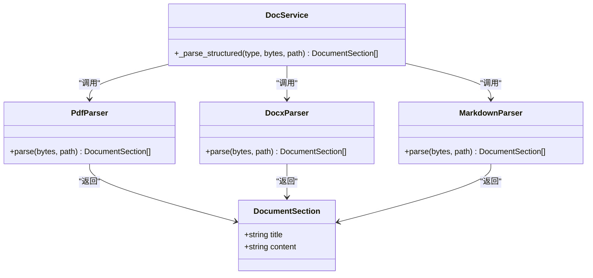
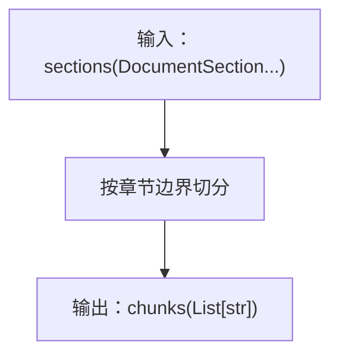
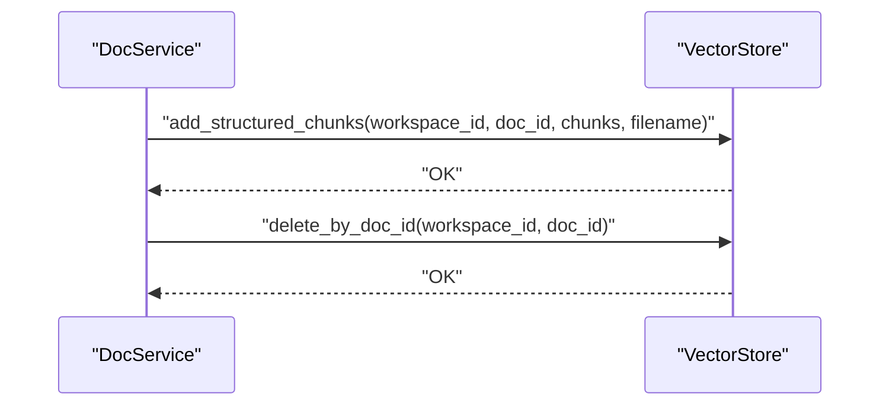
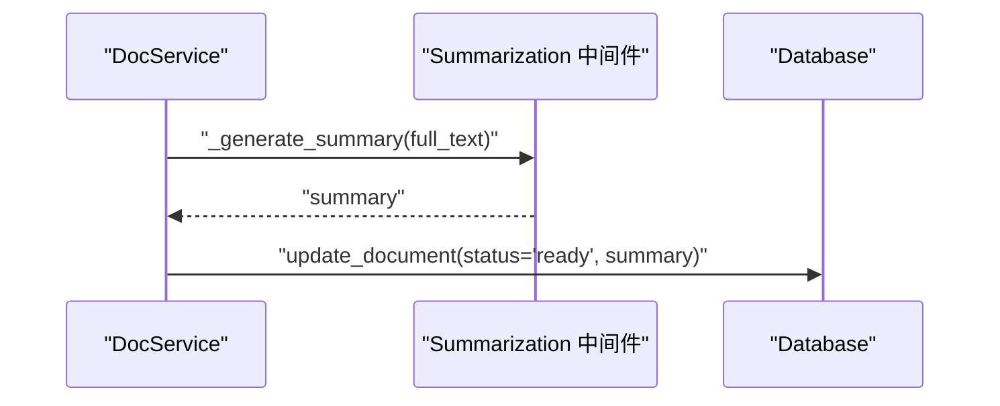
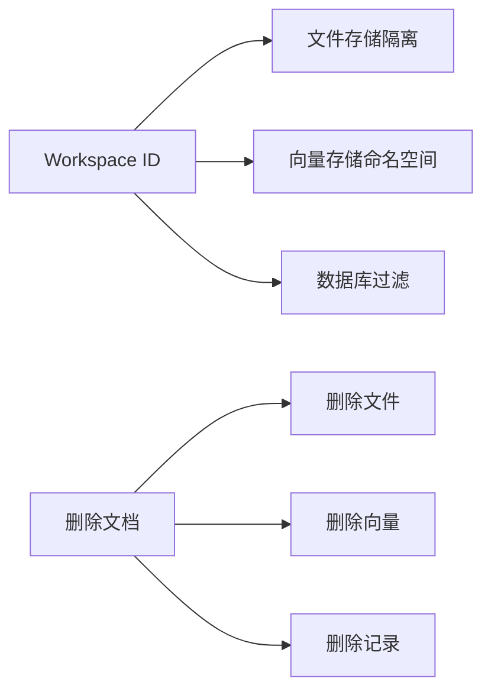
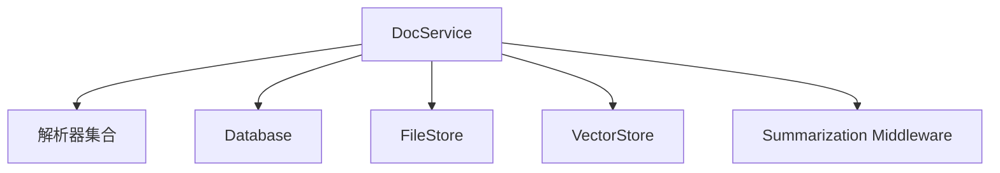

# 文档处理流水线

<cite>
**本文引用的文件**
- [backend/src/services/doc_service.py](file://backend/src/services/doc_service.py)
- [backend/src/storage/database.py](file://backend/src/storage/database.py)
- [backend/src/storage/vector_store.py](file://backend/src/storage/vector_store.py)
- [backend/src/storage/file_store.py](file://backend/src/storage/file_store.py)
- [backend/src/parsers/base.py](file://backend/src/parsers/base.py)
- [backend/src/parsers/pdf_parser.py](file://backend/src/parsers/pdf_parser.py)
- [backend/src/parsers/docx_parser.py](file://backend/src/parsers/docx_parser.py)
- [backend/src/parsers/markdown_parser.py](file://backend/src/parsers/markdown_parser.py)
- [backend/src/middlewares/summarization.py](file://backend/src/middlewares/summarization.py)
- [backend/src/api/routes.py](file://backend/src/api/routes.py)
- [backend/src/api/deps.py](file://backend/src/api/deps.py)
- [backend/langgraph.json](file://backend/langgraph.json)
</cite>

## 目录
1. [简介](#简介)
2. [项目结构](#项目结构)
3. [核心组件](#核心组件)
4. [架构总览](#架构总览)
5. [详细组件分析](#详细组件分析)
6. [依赖关系分析](#依赖关系分析)
7. [性能考量](#性能考量)
8. [故障排查指南](#故障排查指南)
9. [结论](#结论)
10. [附录](#附录)

## 简介
本文件面向 Train Agent 项目的“文档处理流水线”，系统性梳理从文件上传到向量索引的完整数据流：上传字节数据 → 创建文档记录 → 结构化解析（PDF/DOCX/Markdown）→ 文本分块（基于章节的递归切分）→ 向量存储（ChromaDB）→ LLM 生成摘要 → 状态更新为 ready。文档同时解释状态机转换路径（uploaded → parsing → parsed → chunking → indexing → summarizing → ready），并说明 Workspace 隔离机制如何保障多租户数据安全。

## 项目结构
后端采用分层设计：服务层负责编排与状态管理；解析器层负责结构化解析；存储层负责数据库、文件与向量库；中间件与路由提供对外接口与上下文注入。

图表来源
- [backend/src/api/routes.py](file://backend/src/api/routes.py)
- [backend/src/api/deps.py](file://backend/src/api/deps.py)
- [backend/src/services/doc_service.py](file://backend/src/services/doc_service.py)
- [backend/src/parsers/base.py](file://backend/src/parsers/base.py)
- [backend/src/parsers/pdf_parser.py](file://backend/src/parsers/pdf_parser.py)
- [backend/src/parsers/docx_parser.py](file://backend/src/parsers/docx_parser.py)
- [backend/src/parsers/markdown_parser.py](file://backend/src/parsers/markdown_parser.py)
- [backend/src/storage/database.py](file://backend/src/storage/database.py)
- [backend/src/storage/file_store.py](file://backend/src/storage/file_store.py)
- [backend/src/storage/vector_store.py](file://backend/src/storage/vector_store.py)
- [backend/src/middlewares/summarization.py](file://backend/src/middlewares/summarization.py)

章节来源
- [backend/src/api/routes.py](file://backend/src/api/routes.py)
- [backend/src/api/deps.py](file://backend/src/api/deps.py)
- [backend/src/services/doc_service.py](file://backend/src/services/doc_service.py)
- [backend/src/storage/database.py](file://backend/src/storage/database.py)
- [backend/src/storage/vector_store.py](file://backend/src/storage/vector_store.py)
- [backend/src/storage/file_store.py](file://backend/src/storage/file_store.py)
- [backend/src/parsers/base.py](file://backend/src/parsers/base.py)
- [backend/src/parsers/pdf_parser.py](file://backend/src/parsers/pdf_parser.py)
- [backend/src/parsers/docx_parser.py](file://backend/src/parsers/docx_parser.py)
- [backend/src/parsers/markdown_parser.py](file://backend/src/parsers/markdown_parser.py)
- [backend/src/middlewares/summarization.py](file://backend/src/middlewares/summarization.py)

## 核心组件
- 文档服务（DocService）
  - 职责：协调上传、解析、分块、索引、摘要与状态更新；封装异常处理与回滚。
  - 关键方法：upload_document、create_document_upload、process_document、delete_document。
- 数据库（Database）
  - 职责：持久化文档元数据（含状态、错误信息、摘要等）。
  - 关键方法：create_document、list_documents、update_document。
- 文件存储（FileStore）
  - 职责：按 Workspace 隔离保存原始文件与调试导出的 Markdown。
- 向量存储（VectorStore）
  - 职责：将结构化分块写入向量库，并支持按文档删除。
- 解析器（PdfParser、DocxParser、MarkdownParser）
  - 职责：结构化解析，输出带标题与正文的章节列表。
- 解析基类与分块工具（parsers/base.py）
  - 职责：定义 DocumentSection 结构与分块策略（基于章节边界）。

章节来源
- [backend/src/services/doc_service.py](file://backend/src/services/doc_service.py)
- [backend/src/storage/database.py](file://backend/src/storage/database.py)
- [backend/src/storage/file_store.py](file://backend/src/storage/file_store.py)
- [backend/src/storage/vector_store.py](file://backend/src/storage/vector_store.py)
- [backend/src/parsers/base.py](file://backend/src/parsers/base.py)
- [backend/src/parsers/pdf_parser.py](file://backend/src/parsers/pdf_parser.py)
- [backend/src/parsers/docx_parser.py](file://backend/src/parsers/docx_parser.py)
- [backend/src/parsers/markdown_parser.py](file://backend/src/parsers/markdown_parser.py)

## 架构总览
下图展示从上传到 ready 的端到端数据流与状态机转换。

图表来源
- [backend/src/api/routes.py](file://backend/src/api/routes.py)
- [backend/src/services/doc_service.py](file://backend/src/services/doc_service.py)
- [backend/src/storage/database.py](file://backend/src/storage/database.py)
- [backend/src/storage/file_store.py](file://backend/src/storage/file_store.py)
- [backend/src/storage/vector_store.py](file://backend/src/storage/vector_store.py)
- [backend/src/parsers/base.py](file://backend/src/parsers/base.py)
- [backend/src/parsers/pdf_parser.py](file://backend/src/parsers/pdf_parser.py)
- [backend/src/parsers/docx_parser.py](file://backend/src/parsers/docx_parser.py)
- [backend/src/parsers/markdown_parser.py](file://backend/src/parsers/markdown_parser.py)
- [backend/src/middlewares/summarization.py](file://backend/src/middlewares/summarization.py)

## 详细组件分析

### 1) 状态机与数据流
- 状态序列：uploaded → parsing → parsed → chunking → indexing → summarizing → ready
- 每个状态转换均通过数据库更新完成，便于可观测与重试。
- 错误处理：捕获异常后将状态置为 error 并记录错误信息，避免部分失败导致的数据不一致。

图表来源
- [backend/src/services/doc_service.py](file://backend/src/services/doc_service.py)
- [backend/src/storage/database.py](file://backend/src/storage/database.py)

章节来源
- [backend/src/services/doc_service.py](file://backend/src/services/doc_service.py)
- [backend/src/storage/database.py](file://backend/src/storage/database.py)

### 2) 上传与文档记录创建
- 输入：workspace_id、filename、bytes
- 处理：
  - 探测文件类型（pdf/docx/markdown/txt 等）
  - 将字节内容保存至文件存储（按 workspace 隔离）
  - 在数据库中创建文档记录，初始状态为 uploaded
  - 返回文档对象并立即进入处理流程

图表来源
- [backend/src/services/doc_service.py](file://backend/src/services/doc_service.py)
- [backend/src/storage/file_store.py](file://backend/src/storage/file_store.py)
- [backend/src/storage/database.py](file://backend/src/storage/database.py)

章节来源
- [backend/src/services/doc_service.py](file://backend/src/services/doc_service.py)
- [backend/src/storage/file_store.py](file://backend/src/storage/file_store.py)
- [backend/src/storage/database.py](file://backend/src/storage/database.py)

### 3) 结构化解析（PDF/DOCX/Markdown）
- 解析器统一输出结构化章节列表（DocumentSection），包含标题与正文。
- 全文本用于摘要生成与调试导出（Markdown）。
- 若未提取到可读文本，抛出明确错误提示（如需 OCR）。

图表来源
- [backend/src/parsers/base.py](file://backend/src/parsers/base.py)
- [backend/src/parsers/pdf_parser.py](file://backend/src/parsers/pdf_parser.py)
- [backend/src/parsers/docx_parser.py](file://backend/src/parsers/docx_parser.py)
- [backend/src/parsers/markdown_parser.py](file://backend/src/parsers/markdown_parser.py)
- [backend/src/services/doc_service.py](file://backend/src/services/doc_service.py)

章节来源
- [backend/src/parsers/base.py](file://backend/src/parsers/base.py)
- [backend/src/parsers/pdf_parser.py](file://backend/src/parsers/pdf_parser.py)
- [backend/src/parsers/docx_parser.py](file://backend/src/parsers/docx_parser.py)
- [backend/src/parsers/markdown_parser.py](file://backend/src/parsers/markdown_parser.py)
- [backend/src/services/doc_service.py](file://backend/src/services/doc_service.py)

### 4) 文本分块（基于章节的递归切分）
- 使用解析基类提供的分块函数，按章节边界进行切分，保留语义完整性。
- 分块结果用于后续向量化与检索。

图表来源
- [backend/src/parsers/base.py](file://backend/src/parsers/base.py)
- [backend/src/services/doc_service.py](file://backend/src/services/doc_service.py)

章节来源
- [backend/src/parsers/base.py](file://backend/src/parsers/base.py)
- [backend/src/services/doc_service.py](file://backend/src/services/doc_service.py)

### 5) 向量存储（ChromaDB）
- 将分块写入向量库，使用 workspace_id 作为命名空间隔离。
- 支持按文档 ID 删除，保证清理能力。

图表来源
- [backend/src/storage/vector_store.py](file://backend/src/storage/vector_store.py)
- [backend/src/services/doc_service.py](file://backend/src/services/doc_service.py)

章节来源
- [backend/src/storage/vector_store.py](file://backend/src/storage/vector_store.py)
- [backend/src/services/doc_service.py](file://backend/src/services/doc_service.py)

### 6) LLM 生成摘要
- 使用摘要中间件生成全文摘要，供前端展示与后续检索增强。
- 摘要生成后更新文档状态为 ready，并持久化摘要。

图表来源
- [backend/src/middlewares/summarization.py](file://backend/src/middlewares/summarization.py)
- [backend/src/services/doc_service.py](file://backend/src/services/doc_service.py)
- [backend/src/storage/database.py](file://backend/src/storage/database.py)

章节来源
- [backend/src/middlewares/summarization.py](file://backend/src/middlewares/summarization.py)
- [backend/src/services/doc_service.py](file://backend/src/services/doc_service.py)
- [backend/src/storage/database.py](file://backend/src/storage/database.py)

### 7) Workspace 隔离机制与多租户安全
- 文件存储：save 方法以 workspace_id 作为目录前缀，实现物理隔离。
- 向量存储：add_structured_chunks 与 delete_by_doc_id 均以 workspace_id 为命名空间，避免跨租户访问。
- 数据库：文档记录包含 workspace_id 字段，查询与删除均按该字段过滤。
- 清理策略：删除文档时同步删除对应文件与向量数据，防止残留。

图表来源
- [backend/src/storage/file_store.py](file://backend/src/storage/file_store.py)
- [backend/src/storage/vector_store.py](file://backend/src/storage/vector_store.py)
- [backend/src/storage/database.py](file://backend/src/storage/database.py)
- [backend/src/services/doc_service.py](file://backend/src/services/doc_service.py)

章节来源
- [backend/src/storage/file_store.py](file://backend/src/storage/file_store.py)
- [backend/src/storage/vector_store.py](file://backend/src/storage/vector_store.py)
- [backend/src/storage/database.py](file://backend/src/storage/database.py)
- [backend/src/services/doc_service.py](file://backend/src/services/doc_service.py)

## 依赖关系分析
- 组件耦合
  - DocService 对解析器、存储层与中间件存在直接依赖，但通过抽象接口（如解析器统一返回 DocumentSection）降低耦合度。
  - 存储层之间低耦合，职责清晰：文件存储负责原始与导出文件；数据库负责元数据；向量存储负责嵌入索引。
- 外部依赖
  - ChromaDB 作为向量存储后端，需正确配置命名空间与批量写入参数。
  - LLM 摘要中间件依赖外部模型服务或本地推理环境。

图表来源
- [backend/src/services/doc_service.py](file://backend/src/services/doc_service.py)
- [backend/src/storage/database.py](file://backend/src/storage/database.py)
- [backend/src/storage/file_store.py](file://backend/src/storage/file_store.py)
- [backend/src/storage/vector_store.py](file://backend/src/storage/vector_store.py)
- [backend/src/middlewares/summarization.py](file://backend/src/middlewares/summarization.py)

章节来源
- [backend/src/services/doc_service.py](file://backend/src/services/doc_service.py)
- [backend/src/storage/database.py](file://backend/src/storage/database.py)
- [backend/src/storage/file_store.py](file://backend/src/storage/file_store.py)
- [backend/src/storage/vector_store.py](file://backend/src/storage/vector_store.py)
- [backend/src/middlewares/summarization.py](file://backend/src/middlewares/summarization.py)

## 性能考量
- I/O 优化
  - 文件存储按 workspace 隔离，建议在高并发场景下启用异步写入与合理的目录层级，避免单目录文件过多。
- 向量索引
  - 批量写入向量库时尽量合并请求，减少网络往返；根据数据规模选择合适的嵌入维度与索引参数。
- 解析与分块
  - 对大文档优先采用分块策略，避免一次性加载过大数据；对图片型 PDF 建议前置 OCR 流程。
- 摘要生成
  - 控制摘要长度与并发数，必要时引入缓存与限流。

## 故障排查指南
- 常见问题
  - “未提取到可读文本”：检查文件是否为扫描版或图像型 PDF，需 OCR 流程后再处理。
  - “状态卡在 parsing/chunking/indexing”：检查解析器与向量库连接、磁盘空间与权限。
  - “摘要为空”：确认摘要中间件可用且输入文本非空。
- 排查步骤
  - 查看数据库中文档状态与错误信息。
  - 检查文件存储中是否存在调试导出的 Markdown。
  - 校验向量库中是否已写入对应文档的向量。
- 回滚与清理
  - 删除文档会同步清理文件与向量数据，确保干净重试。

章节来源
- [backend/src/services/doc_service.py](file://backend/src/services/doc_service.py)
- [backend/src/storage/database.py](file://backend/src/storage/database.py)
- [backend/src/storage/file_store.py](file://backend/src/storage/file_store.py)
- [backend/src/storage/vector_store.py](file://backend/src/storage/vector_store.py)

## 结论
该文档处理流水线以清晰的状态机与分层架构实现了从上传到 ready 的全链路自动化。通过 Workspace 隔离与严格的错误处理，系统在多租户环境下具备良好的安全性与可靠性。建议在生产环境中结合异步任务队列与可观测性监控进一步提升吞吐与稳定性。

## 附录
- API 示例（路径参考）
  - 上传文档：POST /workspaces/{id}/documents/upload
  - 列举文档：GET /workspaces/{id}/documents
  - 删除文档：DELETE /workspaces/{id}/documents/{doc_id}
- LangGraph 集成
  - 可在 LangGraph JSON 中配置节点与边，将上述状态机映射为图执行计划，便于扩展复杂工作流。

章节来源
- [backend/src/api/routes.py](file://backend/src/api/routes.py)
- [backend/src/api/deps.py](file://backend/src/api/deps.py)
- [backend/langgraph.json](file://backend/langgraph.json)