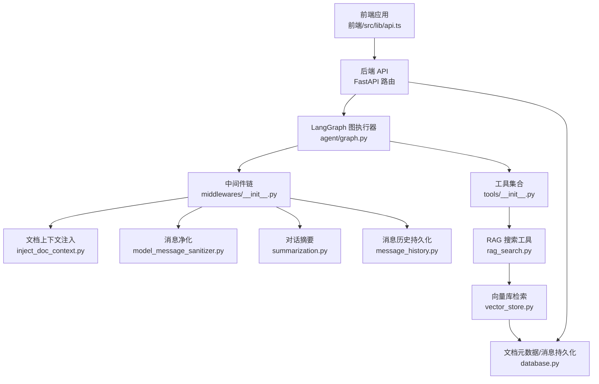
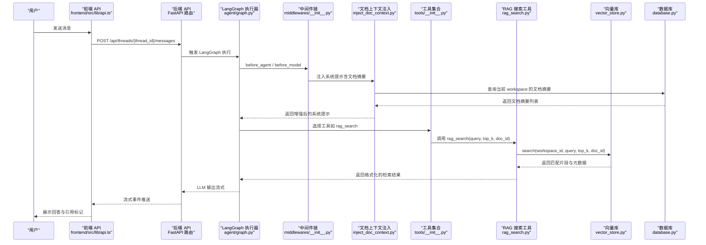
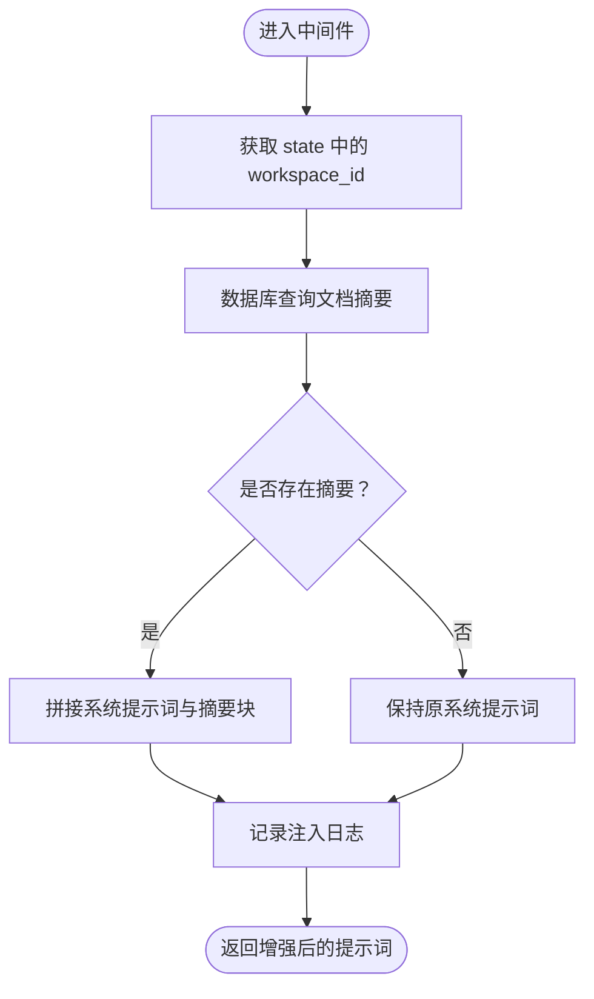
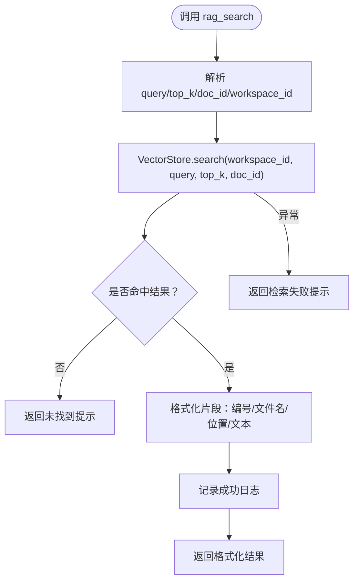
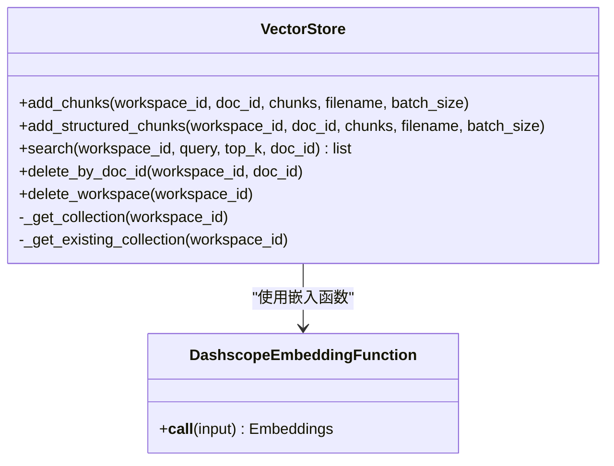
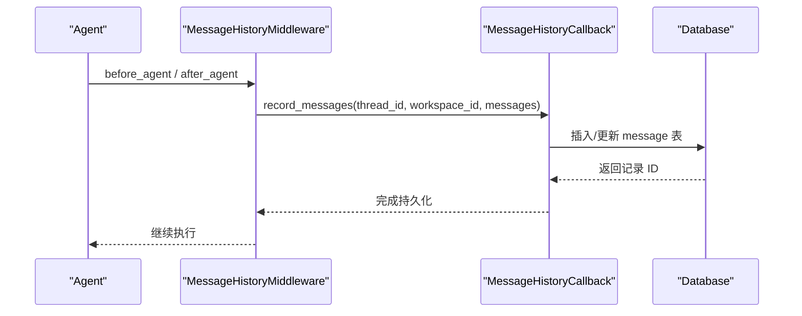
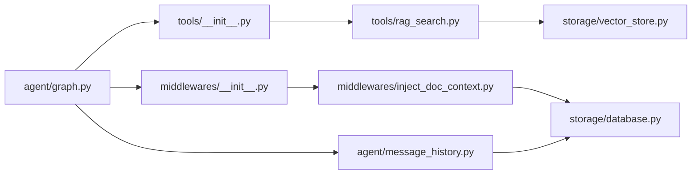

# 智能问答流程

<cite>
**本文引用的文件**
- [backend/src/middlewares/inject_doc_context.py](file://backend/src/middlewares/inject_doc_context.py)
- [backend/src/tools/rag_search.py](file://backend/src/tools/rag_search.py)
- [backend/src/agent/graph.py](file://backend/src/agent/graph.py)
- [backend/src/storage/vector_store.py](file://backend/src/storage/vector_store.py)
- [backend/src/middlewares/__init__.py](file://backend/src/middlewares/__init__.py)
- [backend/src/tools/__init__.py](file://backend/src/tools/__init__.py)
- [backend/src/agent/state.py](file://backend/src/agent/state.py)
- [backend/src/middlewares/logging_middlewares.py](file://backend/src/middlewares/logging_middlewares.py)
- [backend/src/middlewares/model_message_sanitizer.py](file://backend/src/middlewares/model_message_sanitizer.py)
- [backend/src/middlewares/summarization.py](file://backend/src/middlewares/summarization.py)
- [backend/src/agent/message_history.py](file://backend/src/agent/message_history.py)
- [backend/src/storage/database.py](file://backend/src/storage/database.py)
- [backend/src/app_context.py](file://backend/src/app_context.py)
- [frontend/src/lib/api.ts](file://frontend/src/lib/api.ts)
</cite>

## 目录
1. [简介](#简介)
2. [项目结构](#项目结构)
3. [核心组件](#核心组件)
4. [架构总览](#架构总览)
5. [详细组件分析](#详细组件分析)
6. [依赖分析](#依赖分析)
7. [性能考虑](#性能考虑)
8. [故障排查指南](#故障排查指南)
9. [结论](#结论)
10. [附录](#附录)

## 简介
本文件围绕 Train Agent 的智能问答系统，提供从“用户消息”到“最终回答”的完整数据流分析。重点覆盖以下方面：
- 前端消息发送至后端 API
- LangGraph 流式连接与中间件链路
- inject_doc_context 中间件动态注入文档摘要上下文
- LLM 推理决策调用 rag_search 工具
- VectorStore 按 workspace_id 实现的精确检索
- 基于检索结果生成带引用标记的回答，并通过流式接口返回前端
- 多租户隔离（workspace_id）
- 状态管理、错误恢复与性能优化策略

## 项目结构
后端采用模块化分层设计：
- 应用入口与路由：FastAPI 提供 REST API，负责工作区、文档、任务等资源管理
- 代理与图执行：LangGraph 驱动的 Agent，结合工具与中间件
- 存储与服务：数据库、向量库、文件存储、技能管理
- 中间件体系：日志、消息净化、文档上下文注入、历史记录、摘要

图表来源
- [backend/src/agent/graph.py:16-49](file://backend/src/agent/graph.py#L16-L49)
- [backend/src/middlewares/__init__.py:18-41](file://backend/src/middlewares/__init__.py#L18-L41)
- [backend/src/tools/__init__.py:11-20](file://backend/src/tools/__init__.py#L11-L20)
- [backend/src/middlewares/inject_doc_context.py:11-41](file://backend/src/middlewares/inject_doc_context.py#L11-L41)
- [backend/src/middlewares/model_message_sanitizer.py:105-122](file://backend/src/middlewares/model_message_sanitizer.py#L105-L122)
- [backend/src/middlewares/summarization.py:7-58](file://backend/src/middlewares/summarization.py#L7-L58)
- [backend/src/agent/message_history.py:13-143](file://backend/src/agent/message_history.py#L13-L143)
- [backend/src/tools/rag_search.py:40-76](file://backend/src/tools/rag_search.py#L40-L76)
- [backend/src/storage/vector_store.py:13-177](file://backend/src/storage/vector_store.py#L13-L177)
- [backend/src/storage/database.py:9-379](file://backend/src/storage/database.py#L9-L379)
- [frontend/src/lib/api.ts:1-196](file://frontend/src/lib/api.ts#L1-L196)

章节来源
- [backend/src/agent/graph.py:16-49](file://backend/src/agent/graph.py#L16-L49)
- [backend/src/middlewares/__init__.py:18-41](file://backend/src/middlewares/__init__.py#L18-L41)
- [backend/src/tools/__init__.py:11-20](file://backend/src/tools/__init__.py#L11-L20)
- [frontend/src/lib/api.ts:1-196](file://frontend/src/lib/api.ts#L1-L196)

## 核心组件
- LangGraph 执行器：配置模型、工具、中间件与状态模式，启用流式输出与回调
- 中间件链：按序执行日志、消息历史、模型请求净化、文档上下文注入、模型响应日志、摘要
- RAG 搜索工具：根据 workspace_id 和可选 doc_id 进行检索，格式化引用位置信息
- 向量库：基于 ChromaDB，按 workspace_id 维度隔离集合，支持结构化元数据检索
- 数据库：持久化工作区、文档、任务与消息，支持消息去重与分页查询
- 前端 API 封装：统一请求与错误处理，便于集成聊天界面

章节来源
- [backend/src/agent/graph.py:16-49](file://backend/src/agent/graph.py#L16-L49)
- [backend/src/middlewares/__init__.py:18-41](file://backend/src/middlewares/__init__.py#L18-L41)
- [backend/src/tools/rag_search.py:40-76](file://backend/src/tools/rag_search.py#L40-L76)
- [backend/src/storage/vector_store.py:13-177](file://backend/src/storage/vector_store.py#L13-L177)
- [backend/src/storage/database.py:9-379](file://backend/src/storage/database.py#L9-L379)
- [frontend/src/lib/api.ts:1-196](file://frontend/src/lib/api.ts#L1-L196)

## 架构总览
下图展示从用户消息到最终回答的端到端数据流，包括中间件注入、工具调用、向量检索与流式返回。

图表来源
- [backend/src/agent/graph.py:16-49](file://backend/src/agent/graph.py#L16-L49)
- [backend/src/middlewares/__init__.py:18-41](file://backend/src/middlewares/__init__.py#L18-L41)
- [backend/src/middlewares/inject_doc_context.py:11-41](file://backend/src/middlewares/inject_doc_context.py#L11-L41)
- [backend/src/tools/__init__.py:11-20](file://backend/src/tools/__init__.py#L11-L20)
- [backend/src/tools/rag_search.py:40-76](file://backend/src/tools/rag_search.py#L40-L76)
- [backend/src/storage/vector_store.py:124-163](file://backend/src/storage/vector_store.py#L124-L163)
- [backend/src/storage/database.py:313-319](file://backend/src/storage/database.py#L313-L319)
- [frontend/src/lib/api.ts:15-42](file://frontend/src/lib/api.ts#L15-L42)

## 详细组件分析

### 中间件：文档上下文注入（inject_doc_context）
- 动态注入机制：在每次模型调用前，读取当前 workspace_id，查询数据库中的文档摘要，拼接到系统提示词末尾
- 上下文格式：每个文档以“文件名（doc_id）：摘要”的形式列出，便于后续工具定位具体文档
- 日志与可观测性：记录注入的工作区与文档数量，便于审计与性能分析

图表来源
- [backend/src/middlewares/inject_doc_context.py:11-41](file://backend/src/middlewares/inject_doc_context.py#L11-L41)
- [backend/src/storage/database.py:313-319](file://backend/src/storage/database.py#L313-L319)

章节来源
- [backend/src/middlewares/inject_doc_context.py:11-41](file://backend/src/middlewares/inject_doc_context.py#L11-L41)
- [backend/src/storage/database.py:313-319](file://backend/src/storage/database.py#L313-L319)

### 工具：RAG 搜索（rag_search）
- 输入参数：query、top_k、doc_id（可选），其中 doc_id 来自系统提示词中的“doc_id:xxx”
- workspace_id 来源：从运行时状态提取，确保跨文档检索的多租户隔离
- 检索逻辑：调用 VectorStore.search，支持按 doc_id 精确限定或全库检索
- 结果格式化：为每个匹配片段生成“片段编号 + 文件名 + 位置信息 + 文本”，位置信息包含章节/节标题与页码区间
- 错误处理：异常时返回可读错误信息；无结果时返回提示文本

图表来源
- [backend/src/tools/rag_search.py:40-76](file://backend/src/tools/rag_search.py#L40-L76)
- [backend/src/storage/vector_store.py:124-163](file://backend/src/storage/vector_store.py#L124-L163)

章节来源
- [backend/src/tools/rag_search.py:40-76](file://backend/src/tools/rag_search.py#L40-L76)
- [backend/src/storage/vector_store.py:124-163](file://backend/src/storage/vector_store.py#L124-L163)

### 向量库：精确匹配与多租户隔离（workspace_id）
- 集合命名：按“ws_{workspace_id}”创建/获取集合，天然实现多租户隔离
- 元数据字段：doc_id、filename、chunk_index、章节/节标题、页码范围、层级等
- 查询过滤：当提供 doc_id 时，where 条件仅检索该文档片段；否则全库检索
- 返回结构：包含文本、元数据与距离（用于排序与阈值控制）

图表来源
- [backend/src/storage/vector_store.py:13-177](file://backend/src/storage/vector_store.py#L13-L177)

章节来源
- [backend/src/storage/vector_store.py:13-177](file://backend/src/storage/vector_store.py#L13-L177)

### 引用标记生成规则
- 片段编号：按检索顺序生成“片段1、片段2...”
- 文件与位置：文件名 + “章节/节标题”（若存在）+ 页码范围（如“p.38”或“p.12-15”）
- 无位置信息时：回退到“第N段”的块索引
- 输出格式：每条结果以“片段编号 + 符号 + 文件名 | 位置 + 文本”的形式呈现，便于前端渲染与点击跳转

章节来源
- [backend/src/tools/rag_search.py:11-38](file://backend/src/tools/rag_search.py#L11-L38)
- [backend/src/tools/rag_search.py:65-73](file://backend/src/tools/rag_search.py#L65-L73)

### 多租户隔离：workspace_id 的作用
- 中间件注入：从请求状态读取 workspace_id，仅注入该工作区的文档摘要
- 工具调用：rag_search 使用同一 workspace_id，确保检索范围限定在当前租户
- 向量库：集合名称以 ws_{workspace_id} 命名，避免跨租户数据泄露
- 数据库：消息与文档均关联 workspace_id，保证持久化层面的隔离

章节来源
- [backend/src/middlewares/inject_doc_context.py:16](file://backend/src/middlewares/inject_doc_context.py#L16)
- [backend/src/tools/rag_search.py:49](file://backend/src/tools/rag_search.py#L49)
- [backend/src/storage/vector_store.py:44-49](file://backend/src/storage/vector_store.py#L44-L49)
- [backend/src/storage/database.py:313-319](file://backend/src/storage/database.py#L313-L319)

### 状态管理与消息历史
- 状态扩展：AgentState 增加 workspace_id 字段，贯穿中间件与工具
- 消息历史中间件：在 Agent 前后记录消息，排除摘要类消息，写入数据库
- 回调处理器：异步持久化消息，包含角色、内容、工具调用、响应元数据等
- 线程识别：优先从 runtime.execution_info.thread_id 获取，其次从 context.configurable.thread_id 解析

图表来源
- [backend/src/agent/message_history.py:109-143](file://backend/src/agent/message_history.py#L109-L143)
- [backend/src/agent/message_history.py:13-107](file://backend/src/agent/message_history.py#L13-L107)
- [backend/src/storage/database.py:172-228](file://backend/src/storage/database.py#L172-L228)

章节来源
- [backend/src/agent/state.py:4-7](file://backend/src/agent/state.py#L4-L7)
- [backend/src/agent/message_history.py:109-143](file://backend/src/agent/message_history.py#L109-L143)
- [backend/src/agent/message_history.py:13-107](file://backend/src/agent/message_history.py#L13-L107)
- [backend/src/storage/database.py:172-228](file://backend/src/storage/database.py#L172-L228)

### 中间件链与日志/净化/摘要
- 执行顺序：日志（before_agent）、消息历史、日志（before_model）、消息净化、文档上下文注入、日志（after_model）、日志（after_agent）、摘要
- 消息净化：移除不被兼容模型支持的内容片段类型，清理无效工具调用，保持历史与模型输入兼容
- 摘要中间件：基于令牌数与消息间隔触发摘要，插入隐藏的摘要消息，降低上下文开销

章节来源
- [backend/src/middlewares/__init__.py:18-41](file://backend/src/middlewares/__init__.py#L18-L41)
- [backend/src/middlewares/logging_middlewares.py:15-59](file://backend/src/middlewares/logging_middlewares.py#L15-L59)
- [backend/src/middlewares/model_message_sanitizer.py:105-122](file://backend/src/middlewares/model_message_sanitizer.py#L105-L122)
- [backend/src/middlewares/summarization.py:7-58](file://backend/src/middlewares/summarization.py#L7-L58)

### LangGraph 图构建与流式输出
- 模型配置：启用 streaming、开启思考开关，回调注册消息历史持久化
- 工具与中间件：通过工厂方法注入工具与中间件
- 默认图实例：从环境变量加载上下文，创建默认图

章节来源
- [backend/src/agent/graph.py:16-49](file://backend/src/agent/graph.py#L16-L49)
- [backend/src/app_context.py:19-31](file://backend/src/app_context.py#L19-L31)

## 依赖分析
- 组件耦合
  - agent/graph.py 依赖 tools 与 middlewares 工厂，解耦具体实现
  - tools/rag_search.py 依赖 vector_store，且通过 workspace_id 与数据库交互
  - middlewares/inject_doc_context.py 依赖 database，形成“提示词增强”闭环
  - agent/message_history.py 依赖 database，保障消息持久化
- 外部依赖
  - ChromaDB 作为向量存储后端
  - DashScope 文本嵌入 API
  - FastAPI 提供 REST 接口与静态资源挂载

图表来源
- [backend/src/agent/graph.py:16-49](file://backend/src/agent/graph.py#L16-L49)
- [backend/src/tools/__init__.py:11-20](file://backend/src/tools/__init__.py#L11-L20)
- [backend/src/tools/rag_search.py:40-76](file://backend/src/tools/rag_search.py#L40-L76)
- [backend/src/storage/vector_store.py:13-177](file://backend/src/storage/vector_store.py#L13-L177)
- [backend/src/middlewares/__init__.py:18-41](file://backend/src/middlewares/__init__.py#L18-L41)
- [backend/src/middlewares/inject_doc_context.py:11-41](file://backend/src/middlewares/inject_doc_context.py#L11-L41)
- [backend/src/agent/message_history.py:13-143](file://backend/src/agent/message_history.py#L13-L143)
- [backend/src/storage/database.py:9-379](file://backend/src/storage/database.py#L9-L379)

章节来源
- [backend/src/agent/graph.py:16-49](file://backend/src/agent/graph.py#L16-L49)
- [backend/src/tools/__init__.py:11-20](file://backend/src/tools/__init__.py#L11-L20)
- [backend/src/middlewares/__init__.py:18-41](file://backend/src/middlewares/__init__.py#L18-L41)

## 性能考虑
- 向量检索
  - top_k 控制召回规模，建议根据 SLA 调整
  - 使用结构化元数据（章节/节/页码）提升检索精度与可解释性
  - 集合命名按 workspace_id 隔离，避免跨租户扫描
- 上下文管理
  - 中间件注入仅追加摘要，避免重复冗余
  - 摘要中间件按令牌阈值与消息间隔触发，减少上下文长度
- 流式输出
  - 模型启用 streaming，前端可渐进接收回答
- I/O 优化
  - 批量写入向量库，减少网络往返
  - 数据库写入使用 ON CONFLICT 更新，避免重复写入

## 故障排查指南
- 检索无结果
  - 确认文档已成功入库并完成索引
  - 检查 workspace_id 是否正确传递
  - 若指定 doc_id，请确认其存在于当前工作区
- 检索失败
  - 查看向量库日志与嵌入 API 返回码
  - 检查环境变量（嵌入模型、密钥、基础地址）
- 上下文注入异常
  - 确认数据库连接初始化完成
  - 检查中间件执行顺序与日志
- 消息历史缺失
  - 确认 thread_id 存在且可解析
  - 检查消息历史中间件与回调是否正常

章节来源
- [backend/src/tools/rag_search.py:55-61](file://backend/src/tools/rag_search.py#L55-L61)
- [backend/src/storage/vector_store.py:20-36](file://backend/src/storage/vector_store.py#L20-L36)
- [backend/src/middlewares/inject_doc_context.py:18-26](file://backend/src/middlewares/inject_doc_context.py#L18-L26)
- [backend/src/agent/message_history.py:119-128](file://backend/src/agent/message_history.py#L119-L128)

## 结论
本智能问答系统通过 LangGraph 的模块化中间件与工具链，实现了从“用户消息”到“带引用标记的回答”的完整闭环。inject_doc_context 动态注入当前工作区文档摘要，rag_search 结合 workspace_id 精准检索，VectorStore 以集合维度实现多租户隔离，消息历史与摘要中间件保障长对话稳定性。整体设计兼顾可扩展性与可维护性，适合在多租户场景下持续演进。

## 附录
- 前端 API 封装：统一请求与错误处理，便于集成聊天界面与流式事件
- 环境变量：模型、嵌入模型与密钥、基础地址、数据目录等

章节来源
- [frontend/src/lib/api.ts:1-196](file://frontend/src/lib/api.ts#L1-L196)
- [backend/src/app_context.py:19-31](file://backend/src/app_context.py#L19-L31)