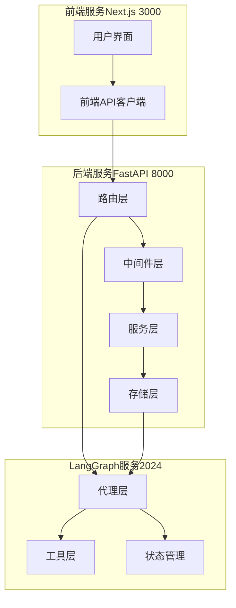
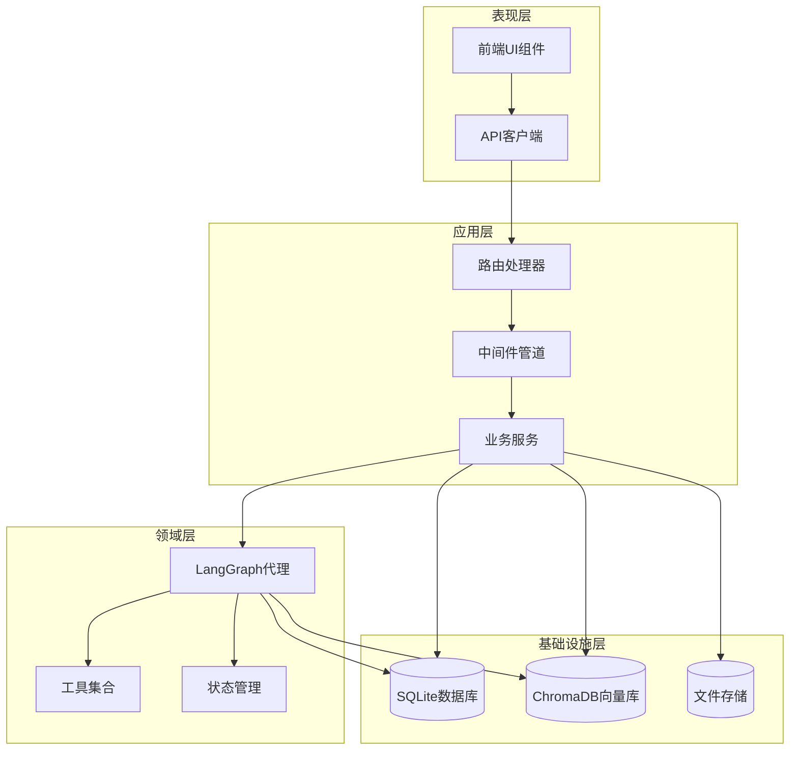
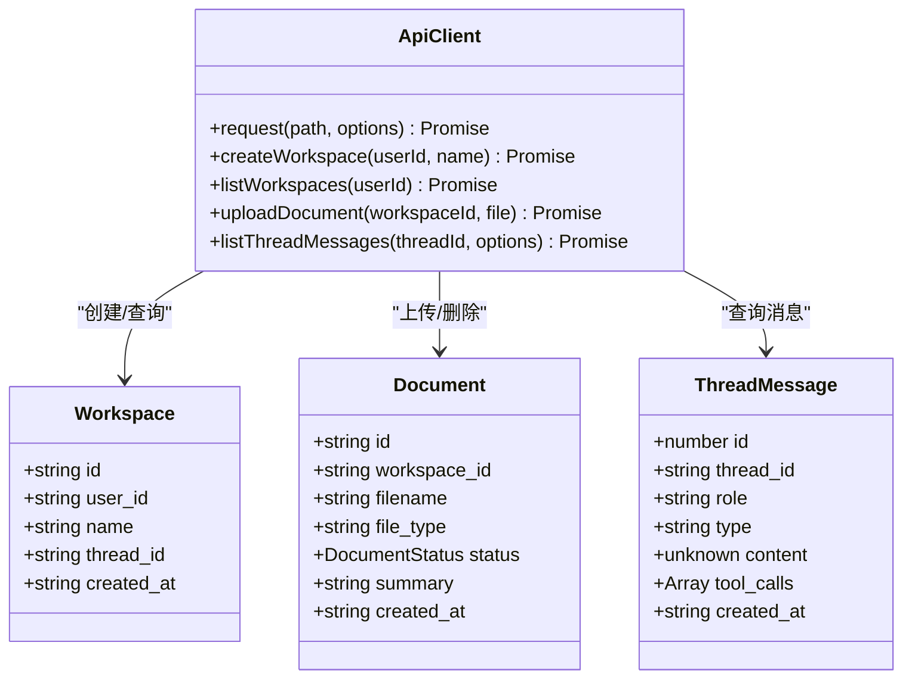
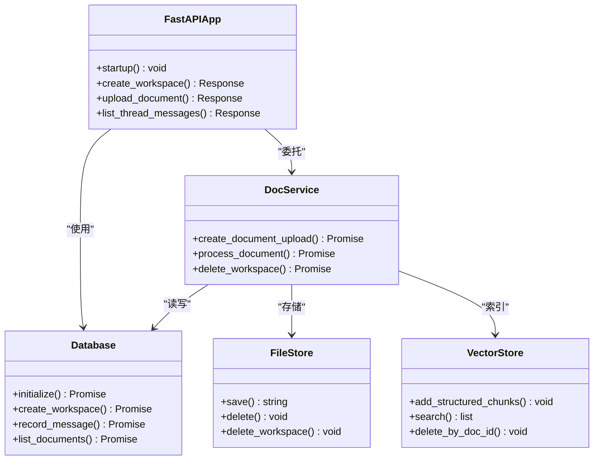
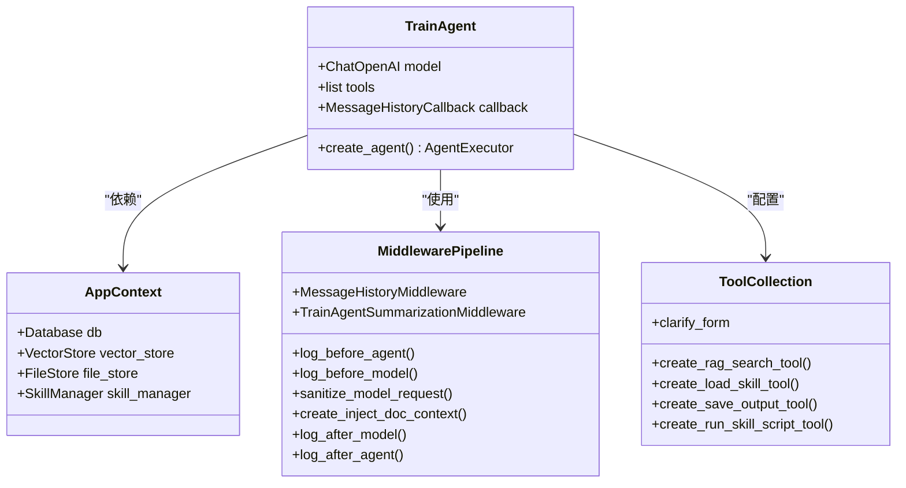
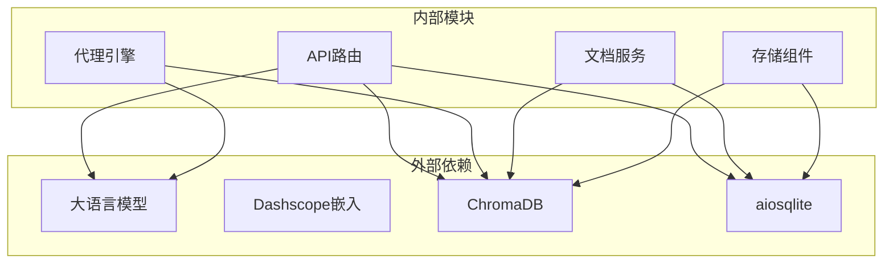

# 整体架构概览

<cite>
**本文档引用的文件**
- [README.md](file://README.md)
- [start.sh](file://scripts/start.sh)
- [pyproject.toml](file://backend/pyproject.toml)
- [package.json](file://frontend/package.json)
- [routes.py](file://backend/src/api/routes.py)
- [graph.py](file://backend/src/agent/graph.py)
- [app_context.py](file://backend/src/app_context.py)
- [middlewares/__init__.py](file://backend/src/middlewares/__init__.py)
- [tools/__init__.py](file://backend/src/tools/__init__.py)
- [database.py](file://backend/src/storage/database.py)
- [vector_store.py](file://backend/src/storage/vector_store.py)
- [file_store.py](file://backend/src/storage/file_store.py)
- [doc_service.py](file://backend/src/services/doc_service.py)
- [state.py](file://backend/src/agent/state.py)
- [skill_manager.py](file://backend/src/agent/skill_manager.py)
- [api.ts](file://frontend/src/lib/api.ts)
- [layout.tsx](file://frontend/src/app/layout.tsx)
- [langgraph.json](file://backend/langgraph.json)
</cite>

## 目录
1. [简介](#简介)
2. [项目结构](#项目结构)
3. [核心组件](#核心组件)
4. [架构总览](#架构总览)
5. [详细组件分析](#详细组件分析)
6. [依赖关系分析](#依赖关系分析)
7. [性能考虑](#性能考虑)
8. [故障排除指南](#故障排除指南)
9. [结论](#结论)

## 简介
本项目采用双进程架构设计，包含三个核心服务：
- **前端 Next.js 应用（端口3000）**：提供工作区管理、文档上传、聊天对话、任务面板等用户界面
- **后端 FastAPI 服务（端口8000）**：提供 REST API，负责工作区、文档、任务、消息等业务逻辑
- **LangGraph 服务（端口2024）**：提供流式代理运行时，支持 RAG 检索、技能调用和工具执行

系统遵循分层架构设计理念，清晰划分 API 层、Agent 层、服务层、存储层的职责边界，通过明确的数据流向和组件交互实现高效的知识问答与 PPT 生成能力。

## 项目结构
项目采用前后端分离的双进程架构，每个服务独立运行并通过明确的接口进行通信：

**图表来源**
- [start.sh:55-81](file://scripts/start.sh#L55-L81)
- [routes.py:21](file://backend/src/api/routes.py#L21)
- [graph.py:16](file://backend/src/agent/graph.py#L16)

**章节来源**
- [README.md:7-13](file://README.md#L7-L13)
- [start.sh:55-81](file://scripts/start.sh#L55-L81)

## 核心组件
系统由三大核心组件构成，各自承担不同的职责：

### 前端组件（Next.js）
- **用户界面层**：提供工作区、文档、聊天、任务等面板
- **API 客户端**：封装 REST 请求，处理错误响应
- **状态管理**：使用 Zustand 进行组件间状态共享

### 后端组件（FastAPI）
- **路由层**：定义 REST API 接口，处理 HTTP 请求
- **中间件层**：提供日志记录、消息历史、请求净化等功能
- **服务层**：实现业务逻辑，协调存储和工具
- **存储层**：SQLite 数据库、ChromaDB 向量存储、文件系统

### LangGraph 组件
- **代理层**：基于 LangChain 的智能代理，支持流式响应
- **工具层**：RAG 搜索、技能加载、输出保存、脚本执行等工具
- **状态管理**：扩展的代理状态，包含工作区上下文

**章节来源**
- [api.ts:15-42](file://frontend/src/lib/api.ts#L15-L42)
- [routes.py:30-35](file://backend/src/api/routes.py#L30-L35)
- [graph.py:16-37](file://backend/src/agent/graph.py#L16-L37)

## 架构总览
系统采用分层架构设计，各层职责清晰分离：

**图表来源**
- [app_context.py:12](file://backend/src/app_context.py#L12)
- [middlewares/__init__.py:18](file://backend/src/middlewares/__init__.py#L18)
- [tools/__init__.py:11](file://backend/src/tools/__init__.py#L11)

### 职责边界说明
- **API 层**：负责 HTTP 请求处理、参数验证、响应格式化
- **Agent 层**：负责智能决策、工具调用、流式响应生成
- **服务层**：负责业务流程编排、数据转换、跨组件协调
- **存储层**：负责数据持久化、索引管理、文件系统操作

## 详细组件分析

### 前端组件分析

**图表来源**
- [api.ts:46](file://frontend/src/lib/api.ts#L46)
- [api.ts:119](file://frontend/src/lib/api.ts#L119)
- [api.ts:85](file://frontend/src/lib/api.ts#L85)

前端组件通过统一的 API 客户端与后端通信，支持工作区管理、文档处理、消息查询等核心功能。

**章节来源**
- [api.ts:15-196](file://frontend/src/lib/api.ts#L15-L196)
- [layout.tsx:20](file://frontend/src/app/layout.tsx#L20)

### 后端组件分析

**图表来源**
- [routes.py:30](file://backend/src/api/routes.py#L30)
- [database.py:9](file://backend/src/storage/database.py#L9)
- [doc_service.py:13](file://backend/src/services/doc_service.py#L13)
- [file_store.py:6](file://backend/src/storage/file_store.py#L6)
- [vector_store.py:39](file://backend/src/storage/vector_store.py#L39)

后端组件实现了完整的文档处理流水线，从文件上传到向量索引的全链路处理。

**章节来源**
- [routes.py:147](file://backend/src/api/routes.py#L147-L157)
- [doc_service.py:57](file://backend/src/services/doc_service.py#L57-L130)

### LangGraph 组件分析

**图表来源**
- [graph.py:16](file://backend/src/agent/graph.py#L16)
- [app_context.py:12](file://backend/src/app_context.py#L12)
- [middlewares/__init__.py:18](file://backend/src/middlewares/__init__.py#L18)
- [tools/__init__.py:11](file://backend/src/tools/__init__.py#L11)

LangGraph 组件提供了智能代理能力，支持多轮对话、工具调用和上下文记忆。

**章节来源**
- [graph.py:16-49](file://backend/src/agent/graph.py#L16-L49)
- [middlewares/__init__.py:18](file://backend/src/middlewares/__init__.py#L18-L41)
- [tools/__init__.py:11](file://backend/src/tools/__init__.py#L11-L20)

## 依赖关系分析

**图表来源**
- [pyproject.toml:6](file://backend/pyproject.toml#L6-L26)
- [vector_store.py:13](file://backend/src/storage/vector_store.py#L13)
- [database.py:6](file://backend/src/storage/database.py#L6)

系统对外部依赖的管理遵循最小化原则，主要依赖包括：
- **LangChain 生态系统**：提供代理框架和工具支持
- **ChromaDB**：向量数据库，支持语义检索
- **SQLite**：轻量级关系数据库，存储结构化数据
- **Dashscope**：阿里云模型服务，提供嵌入和推理能力

**章节来源**
- [pyproject.toml:6-26](file://backend/pyproject.toml#L6-L26)
- [package.json:11](file://frontend/package.json#L11-L26)

## 性能考虑
系统在设计时充分考虑了性能优化：

### 存储层优化
- **向量索引批处理**：支持批量添加向量，减少数据库往返次数
- **异步文件操作**：使用 `asyncio.to_thread` 处理阻塞 I/O
- **连接池管理**：复用数据库连接，避免频繁建立连接

### 代理层优化
- **消息摘要机制**：自动压缩长对话历史，控制上下文长度
- **流式响应**：支持实时流式输出，提升用户体验
- **工具缓存**：技能文件和参考资源的缓存机制

### 网络层优化
- **CORS 配置**：允许跨域访问，便于前端开发调试
- **静态资源服务**：PPT 技能相关的静态资源独立托管
- **后台任务**：文档处理采用异步后台任务，避免阻塞主线程

## 故障排除指南

### 常见问题诊断
1. **服务启动失败**
   - 检查端口占用情况：8000、2024、3000 端口是否被占用
   - 验证环境变量配置：确保 `.env` 文件中的 API 密钥正确
   - 查看启动日志：检查 `logs/` 目录下的详细错误信息

2. **代理响应异常**
   - 验证 LLM 服务连通性：检查 Dashscope API 密钥和网络连接
   - 检查向量索引状态：确认 ChromaDB 中存在对应的工作区集合
   - 查看代理日志：关注消息历史回调和工具执行日志

3. **文档处理失败**
   - 检查文件格式支持：当前支持 PDF、DOCX、Markdown、TXT 格式
   - 验证磁盘空间：确保有足够的存储空间进行文件处理
   - 查看解析器错误：检查 PDF 和 DOCX 解析器的日志输出

**章节来源**
- [start.sh:85](file://scripts/start.sh#L85-L127)
- [doc_service.py:121](file://backend/src/services/doc_service.py#L121-L130)

## 结论
Train Agent 项目采用成熟的双进程架构设计，通过清晰的职责分离和分层架构实现了高效的 AI 辅助培训系统。前端 Next.js 提供现代化的用户界面，后端 FastAPI 实现了完整的业务逻辑处理，LangGraph 服务提供了强大的智能代理能力。

系统的关键优势包括：
- **模块化设计**：各组件职责清晰，易于维护和扩展
- **性能优化**：批处理、异步操作、缓存机制确保系统响应速度
- **可扩展性**：工具和技能的插件化设计支持功能扩展
- **可靠性**：完善的错误处理和日志记录机制

该架构为后续的功能扩展和性能优化奠定了良好的基础，能够满足培训领域的复杂需求。