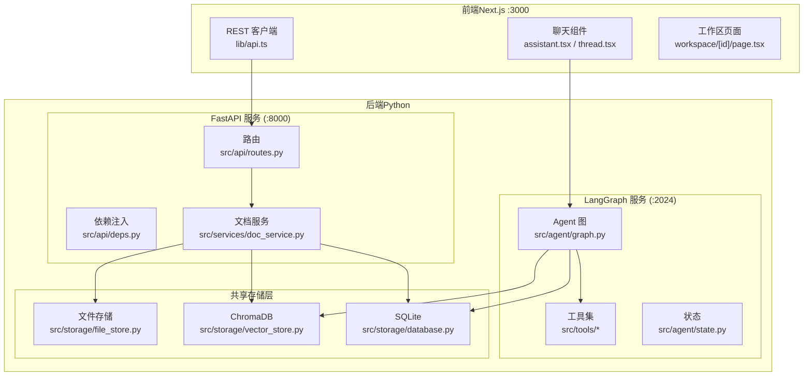
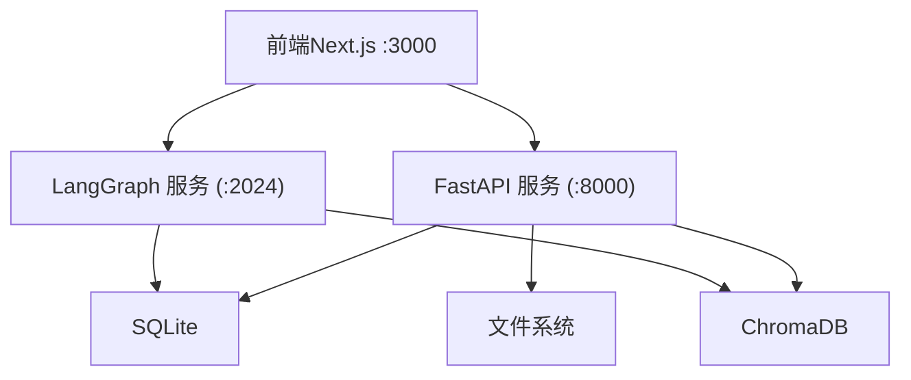
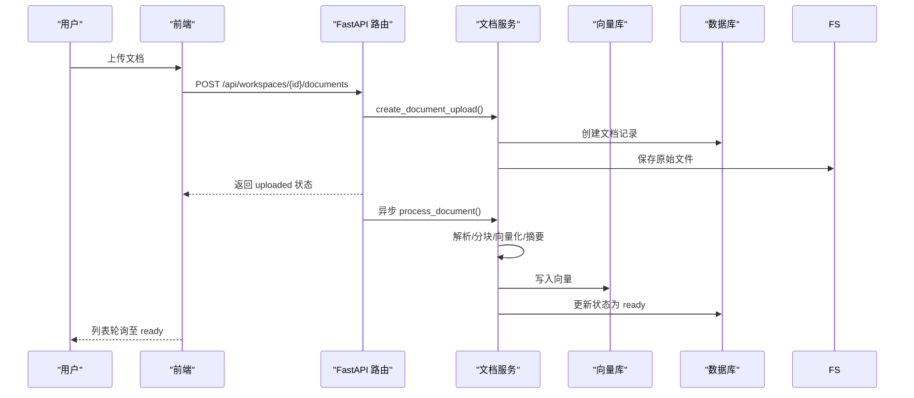
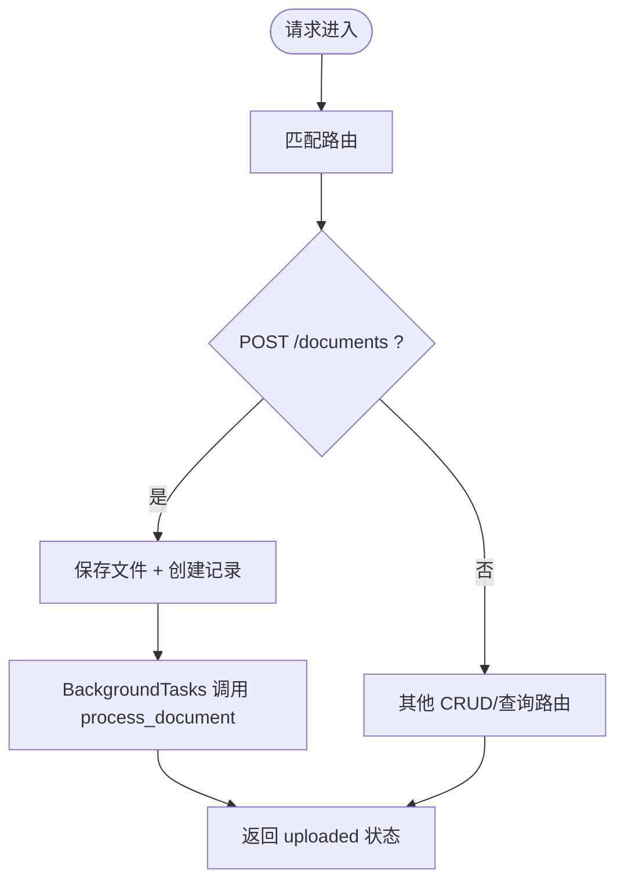
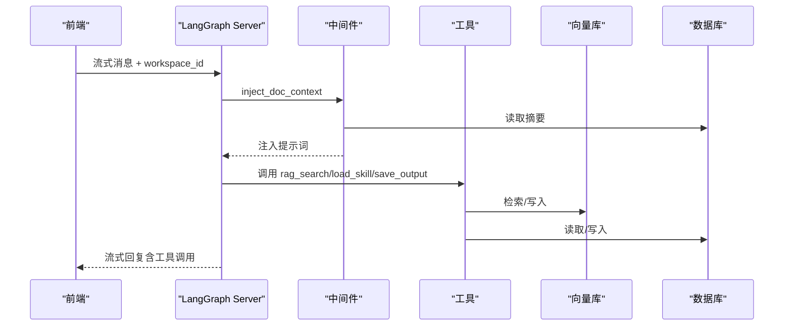
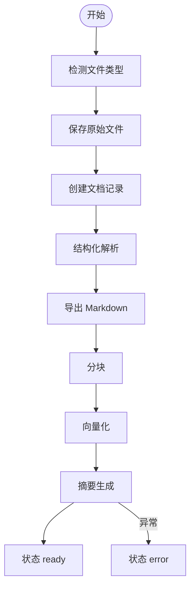
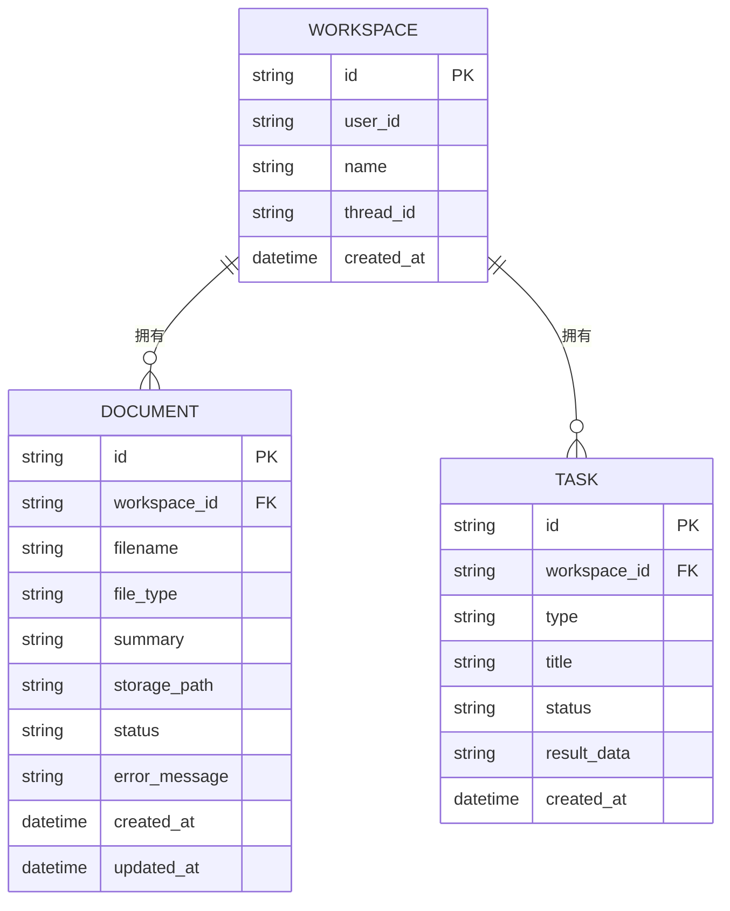
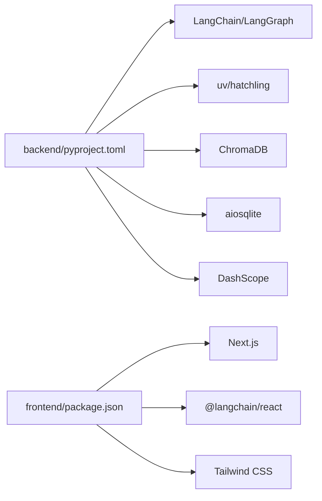

# 架构设计

<cite>
**本文引用的文件**
- [README.md](file://README.md)
- [backend/pyproject.toml](file://backend/pyproject.toml)
- [frontend/package.json](file://frontend/package.json)
- [backend/langgraph.json](file://backend/langgraph.json)
- [docs/backend-architecture.md](file://docs/backend-architecture.md)
- [docs/frontend-architecture.md](file://docs/frontend-architecture.md)
- [backend/src/agent/graph.py](file://backend/src/agent/graph.py)
- [backend/src/api/routes.py](file://backend/src/api/routes.py)
- [backend/src/services/doc_service.py](file://backend/src/services/doc_service.py)
- [backend/src/storage/vector_store.py](file://backend/src/storage/vector_store.py)
- [backend/src/tools/rag_search.py](file://backend/src/tools/rag_search.py)
- [backend/src/tools/save_output.py](file://backend/src/tools/save_output.py)
- [frontend/src/components/chat/assistant.tsx](file://frontend/src/components/chat/assistant.tsx)
- [frontend/src/components/chat/thread.tsx](file://frontend/src/components/chat/thread.tsx)
- [frontend/src/lib/api.ts](file://frontend/src/lib/api.ts)
- [frontend/src/app/workspace/[id]/page.tsx](file://frontend/src/app/workspace/[id]/page.tsx)
</cite>

## 目录
1. [简介](#简介)
2. [项目结构](#项目结构)
3. [核心组件](#核心组件)
4. [架构总览](#架构总览)
5. [详细组件分析](#详细组件分析)
6. [依赖分析](#依赖分析)
7. [性能考量](#性能考量)
8. [故障排查指南](#故障排查指南)
9. [结论](#结论)
10. [附录](#附录)

## 简介
Train Agent 是一个面向培训领域的智能代理产品，采用三层架构：前端 Next.js 应用、后端 FastAPI 服务、LangGraph Agent 推理引擎。系统通过双进程架构实现职责分离：FastAPI 负责 REST API 与文件/任务管理；LangGraph Server 提供流式 Agent 推理与工具调用；前端通过 REST 与流式 API 与两个后端服务协同，完成从文档上传到智能问答与 PPT 生成的完整链路。

## 项目结构
- 前端（Next.js App Router）：负责工作区、文档、聊天、任务面板的 UI 与交互，通过 REST API 与 LangGraph 流式对话。
- 后端（Python）：分为 API 层、Agent 层、服务层、存储层，双进程运行（FastAPI 与 LangGraph Server），共享 SQLite、ChromaDB、文件系统。
- 脚本与文档：提供本地开发与验证脚本，以及后端/前端架构文档。

图表来源
- [docs/frontend-architecture.md:13](file://docs/frontend-architecture.md#L13)
- [docs/backend-architecture.md:18](file://docs/backend-architecture.md#L18)
- [backend/src/api/routes.py:112-128](file://backend/src/api/routes.py#L112-L128)
- [backend/src/agent/graph.py:16-37](file://backend/src/agent/graph.py#L16-L37)
- [backend/src/services/doc_service.py:29-55](file://backend/src/services/doc_service.py#L29-L55)

章节来源
- [README.md:7-13](file://README.md#L7-L13)
- [docs/backend-architecture.md:65-117](file://docs/backend-architecture.md#L65-L117)
- [docs/frontend-architecture.md:58-94](file://docs/frontend-architecture.md#L58-L94)

## 核心组件
- 前端 REST 客户端：封装工作区、文档、任务、消息查询等 API，统一错误处理与调试日志。
- 聊天与流式对话：通过 @langchain/react 的 useStream 与 LangGraph Server 建立流式连接，支持中断恢复与工具调用展示。
- FastAPI 路由：提供工作区 CRUD、文档上传/删除、任务查询、文件下载、消息历史查询等接口。
- Agent 图与工具：基于 LangGraph/LangChain 构建 ReAct Agent，注册 rag_search、load_skill、save_output、clarify_form 等工具，并通过中间件注入文档上下文。
- 文档服务：负责上传、解析、分块、向量化、摘要生成与状态机推进。
- 存储层：SQLite（异步）、ChromaDB（向量）、文件系统（原始文件与产出物）。

章节来源
- [frontend/src/lib/api.ts:15-42](file://frontend/src/lib/api.ts#L15-L42)
- [frontend/src/components/chat/assistant.tsx:131-135](file://frontend/src/components/chat/assistant.tsx#L131-L135)
- [backend/src/api/routes.py:45-106](file://backend/src/api/routes.py#L45-L106)
- [backend/src/agent/graph.py:16-37](file://backend/src/agent/graph.py#L16-L37)
- [backend/src/services/doc_service.py:13-28](file://backend/src/services/doc_service.py#L13-L28)
- [backend/src/storage/vector_store.py:39-49](file://backend/src/storage/vector_store.py#L39-L49)

## 架构总览
双进程架构将职责清晰分离：
- FastAPI 进程：处理 REST API、文件上传/下载、任务管理、消息历史查询；异步后台处理文档解析与索引。
- LangGraph 进程：专注 Agent 推理、工具调用、中断恢复；通过中间件动态注入当前工作区的文档摘要，实现上下文感知。

图表来源
- [docs/backend-architecture.md:18-44](file://docs/backend-architecture.md#L18-L44)
- [docs/frontend-architecture.md:482-503](file://docs/frontend-architecture.md#L482-L503)

章节来源
- [docs/backend-architecture.md:9-16](file://docs/backend-architecture.md#L9-L16)
- [docs/frontend-architecture.md:35-37](file://docs/frontend-architecture.md#L35-L37)

## 详细组件分析

### 前端组件
- REST 客户端（lib/api.ts）：统一请求封装、错误处理、调试日志；支持工作区、文档、任务、消息历史等接口。
- 聊天组件（assistant.tsx/thread.tsx）：通过 useStream 与 LangGraph Server 建立流式连接；管理 thread_id、消息合并、工具调用展示、中断表单交互；支持历史消息翻页与自动滚动。
- 工作区页面（workspace/[id]/page.tsx）：三栏布局（文档/聊天/产出），加载工作区详情并渲染子组件。

图表来源
- [frontend/src/lib/api.ts:146-164](file://frontend/src/lib/api.ts#L146-L164)
- [backend/src/api/routes.py:112-128](file://backend/src/api/routes.py#L112-L128)
- [backend/src/services/doc_service.py:35-55](file://backend/src/services/doc_service.py#L35-L55)
- [backend/src/storage/vector_store.py:91-122](file://backend/src/storage/vector_store.py#L91-L122)

章节来源
- [frontend/src/lib/api.ts:44-81](file://frontend/src/lib/api.ts#L44-L81)
- [frontend/src/components/chat/assistant.tsx:59-102](file://frontend/src/components/chat/assistant.tsx#L59-L102)
- [frontend/src/components/chat/thread.tsx:150-236](file://frontend/src/components/chat/thread.tsx#L150-L236)
- [frontend/src/app/workspace/[id]/page.tsx:12-L62](file://frontend/src/app/workspace/[id]/page.tsx#L12-L62)

### 后端组件

#### API 层（FastAPI）
- 路由职责：工作区 CRUD、文档上传/删除、任务查询/删除、文件下载、消息历史查询。
- 关键设计：文档上传采用异步后台处理，立即返回 uploaded 状态，前端轮询 list_documents 跟踪进度；CORS 开放；静态资源挂载 PPT 资产与模板。

图表来源
- [backend/src/api/routes.py:112-128](file://backend/src/api/routes.py#L112-L128)
- [backend/src/api/routes.py:147-157](file://backend/src/api/routes.py#L147-L157)
- [backend/src/api/routes.py:163-174](file://backend/src/api/routes.py#L163-L174)

章节来源
- [backend/src/api/routes.py:45-106](file://backend/src/api/routes.py#L45-L106)
- [docs/backend-architecture.md:137-178](file://docs/backend-architecture.md#L137-L178)

#### Agent 层（LangGraph）
- Agent 图：基于 ChatOpenAI 的 ReAct Agent，注册工具与中间件；状态包含 workspace_id 实现工作区隔离。
- 中间件：动态注入当前工作区文档摘要；修复空 tool_call id。
- 技能管理：渐进式披露，启动时仅暴露技能名称与描述，按需加载完整技能内容。

图表来源
- [backend/src/agent/graph.py:16-37](file://backend/src/agent/graph.py#L16-L37)
- [backend/src/tools/rag_search.py:40-75](file://backend/src/tools/rag_search.py#L40-L75)
- [backend/src/tools/save_output.py:61-99](file://backend/src/tools/save_output.py#L61-L99)

章节来源
- [docs/backend-architecture.md:181-245](file://docs/backend-architecture.md#L181-L245)
- [backend/src/agent/graph.py:16-37](file://backend/src/agent/graph.py#L16-L37)

#### 服务层（DocService）
- 文档处理流水线：上传 → 解析 → 导出 Markdown → 分块 → 向量化 → 摘要 → 就绪；状态机覆盖异常分支。
- 删除操作：级联清理文件、向量、数据库记录；支持工作区级删除。

图表来源
- [backend/src/services/doc_service.py:57-130](file://backend/src/services/doc_service.py#L57-L130)

章节来源
- [docs/backend-architecture.md:289-336](file://docs/backend-architecture.md#L289-L336)
- [backend/src/services/doc_service.py:13-28](file://backend/src/services/doc_service.py#L13-L28)

#### 存储层
- SQLite（aiosqlite）：三张表（workspace/document/task），外键级联删除，自动迁移。
- ChromaDB：按 workspace_id 隔离 collection，Cosine 相似度检索，支持按 doc_id 过滤。
- 文件存储：按工作区隔离目录，支持异步写入与批量删除。

图表来源
- [docs/backend-architecture.md:341-349](file://docs/backend-architecture.md#L341-L349)

章节来源
- [docs/backend-architecture.md:339-365](file://docs/backend-architecture.md#L339-L365)
- [backend/src/storage/vector_store.py:39-49](file://backend/src/storage/vector_store.py#L39-L49)

### 工具与技能
- rag_search：在当前工作区集合中进行相似度检索，返回带位置信息的片段。
- save_output：创建任务记录并保存文件，完成后前端轮询任务列表更新。
- load_skill/clarify_form：技能加载与表单中断，配合前端 ClarifyForm 实现多轮交互。

章节来源
- [backend/src/tools/rag_search.py:40-75](file://backend/src/tools/rag_search.py#L40-L75)
- [backend/src/tools/save_output.py:61-99](file://backend/src/tools/save_output.py#L61-L99)
- [docs/backend-architecture.md:248-286](file://docs/backend-architecture.md#L248-L286)

## 依赖分析
- 技术栈与版本：Python 3.12+、FastAPI、LangChain/LangGraph、ChromaDB、DashScope、PyMuPDF、python-docx、aiosqlite、httpx 等。
- 前端依赖：Next.js 16、@langchain/react、Tailwind CSS、Zustand 等。
- 双进程配置：langgraph.json 指定入口 graph，环境变量 .env。

图表来源
- [backend/pyproject.toml:1-26](file://backend/pyproject.toml#L1-L26)
- [frontend/package.json:11-26](file://frontend/package.json#L11-L26)
- [backend/langgraph.json:4-8](file://backend/langgraph.json#L4-L8)

章节来源
- [backend/pyproject.toml:1-41](file://backend/pyproject.toml#L1-L41)
- [frontend/package.json:1-39](file://frontend/package.json#L1-L39)
- [backend/langgraph.json:1-9](file://backend/langgraph.json#L1-L9)

## 性能考量
- 异步文档处理：上传立即返回，后台异步完成解析/分块/索引/摘要，降低前端等待时间。
- 向量检索：ChromaDB Cosine 相似度检索，按 doc_id 过滤缩小范围；批处理写入提升吞吐。
- 流式对话：LangGraph 与 @langchain/react 的 useStream 提供低延迟实时交互。
- 前端轮询：文档状态与任务列表采用定时轮询，状态变更频率低，轮询频率适中。

## 故障排查指南
- 前端 API 错误：统一捕获 ApiError，打印状态与详情；检查 NEXT_PUBLIC_API_BASE 与 NEXT_PUBLIC_LANGGRAPH_API_URL。
- LangGraph 连接：Assistant 组件在 404 或 Thread 相关错误时自动清除 threadId 并重建会话；检查 thread_id 持久化。
- 文档处理失败：DocService 在异常时更新状态为 error 并记录错误信息；检查文件类型、OCR 需求与磁盘空间。
- 向量检索为空：确认工作区集合存在、文档已 ready、查询关键词与分块质量。

章节来源
- [frontend/src/lib/api.ts:3-13](file://frontend/src/lib/api.ts#L3-L13)
- [frontend/src/components/chat/assistant.tsx:148-164](file://frontend/src/components/chat/assistant.tsx#L148-L164)
- [backend/src/services/doc_service.py:121-129](file://backend/src/services/doc_service.py#L121-L129)
- [backend/src/storage/vector_store.py:138-143](file://backend/src/storage/vector_store.py#L138-L143)

## 结论
Train Agent 通过双进程架构实现了前后端职责分离与高效协作：FastAPI 负责数据与文件管理，LangGraph 专注智能推理与工具编排，前端以简洁的 UI 串联两条通道。分层架构明确了 API 层、Agent 层、服务层、存储层的边界，结合 RAG 检索与技能系统，形成从文档上传到智能问答与 PPT 生成的闭环。技术选型兼顾易用性与可扩展性，适合持续迭代与功能拓展。

## 附录
- 环境变量与端口：DASHSCOPE_API_KEY、OPENAI_API_BASE、LLM_MODEL、EMBEDDING_MODEL、DATA_DIR、NEXT_PUBLIC_API_BASE、NEXT_PUBLIC_LANGGRAPH_API_URL。
- 开发命令：安装依赖、健康检查、启动/停止/重启、测试与构建。

章节来源
- [README.md:50-61](file://README.md#L50-L61)
- [README.md:79-107](file://README.md#L79-L107)