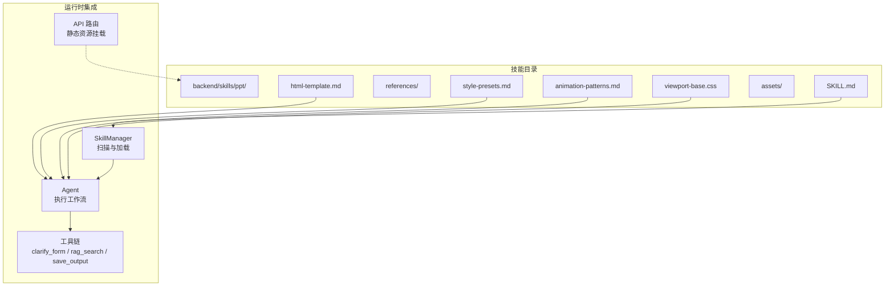
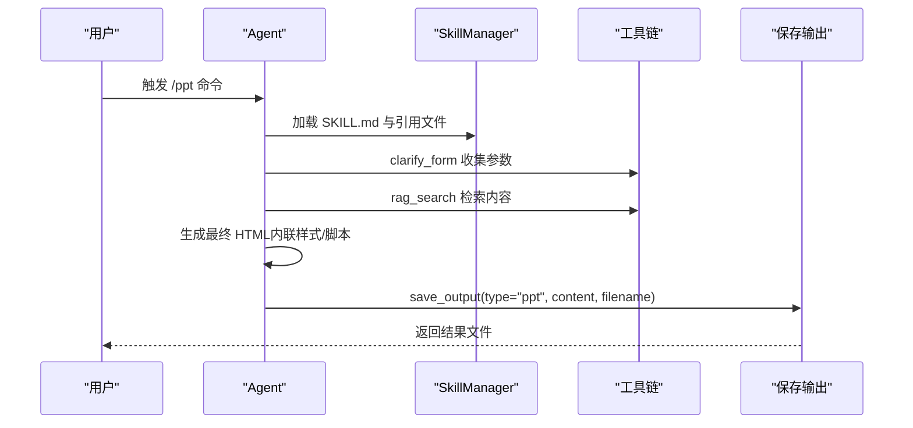
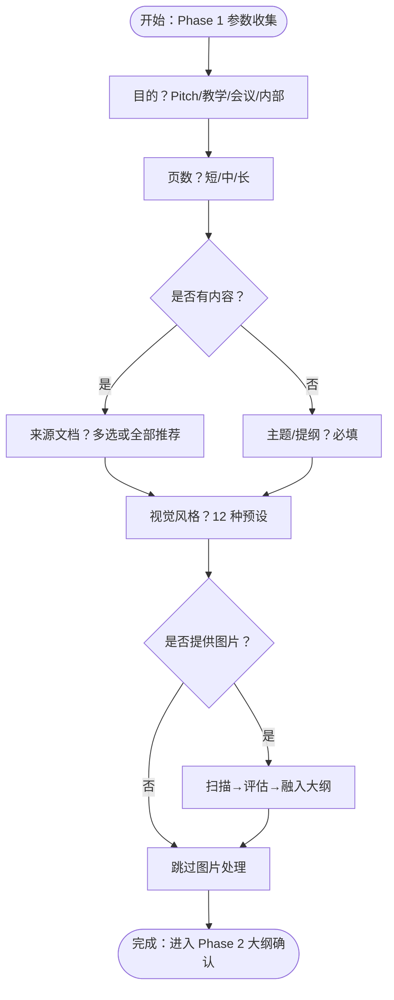
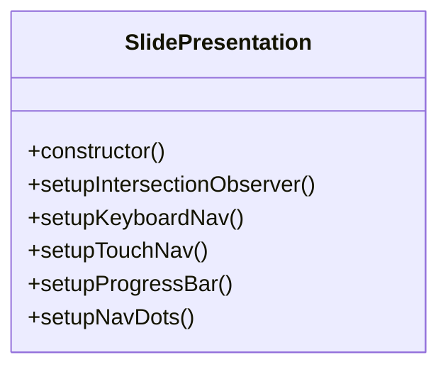
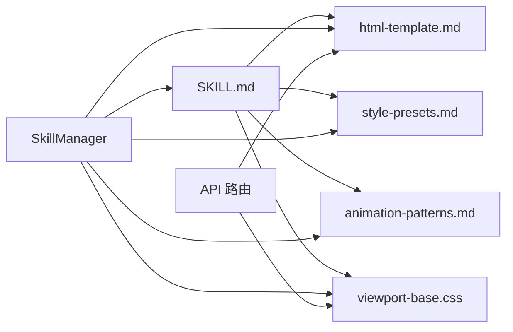

# PPT 生成技能

<cite>
**本文档引用的文件**
- [SKILL.md](file://backend/skills/ppt/SKILL.md)
- [html-template.md](file://backend/skills/ppt/references/html-template.md)
- [style-presets.md](file://backend/skills/ppt/references/style-presets.md)
- [animation-patterns.md](file://backend/skills/ppt/references/animation-patterns.md)
- [viewport-base.css](file://backend/skills/ppt/assets/viewport-base.css)
- [skill_manager.py](file://backend/src/agent/skill_manager.py)
- [run_skill_script.py](file://backend/src/tools/run_skill_script.py)
- [routes.py](file://backend/src/api/routes.py)
- [pyproject.toml](file://backend/pyproject.toml)
- [04-ppt-command.md](file://user-story/04-ppt-command.md)
</cite>

## 目录
1. [简介](#简介)
2. [项目结构](#项目结构)
3. [核心组件](#核心组件)
4. [架构总览](#架构总览)
5. [详细组件分析](#详细组件分析)
6. [依赖关系分析](#依赖关系分析)
7. [性能考虑](#性能考虑)
8. [故障排除指南](#故障排除指南)
9. [结论](#结论)
10. [附录](#附录)

## 简介
本文件为 PPT 生成技能的技术文档，面向需要理解与扩展该技能的工程师与产品人员。文档围绕以下目标展开：
- 架构设计：HTML 模板系统、CSS 样式预设、动画模式配置
- 参数收集机制：主题选择、内容结构、样式偏好、输出格式
- 内容生成流程：幻灯片布局、文本渲染、媒体处理、样式应用
- 样式定制系统：基础样式、动画效果、主题切换、响应式设计
- 技能配置与资产：SKILL.md 文件格式、资产文件管理、引用资源组织
- 使用示例与自定义指南：如何扩展和修改 PPT 生成逻辑

## 项目结构
PPT 技能位于后端 skills 目录中，采用“纯提示词技能”（无代码）模式，通过 SKILL.md 描述完整的工作流，并借助引用文件提供模板、样式与动画参考。技能由 Agent 加载并遵循其指令，结合现有工具完成参数澄清、检索、生成与交付。

图表来源
- [SKILL.md:1-269](file://backend/skills/ppt/SKILL.md#L1-L269)
- [html-template.md:1-420](file://backend/skills/ppt/references/html-template.md#L1-L420)
- [style-presets.md:1-348](file://backend/skills/ppt/references/style-presets.md#L1-L348)
- [animation-patterns.md:1-111](file://backend/skills/ppt/references/animation-patterns.md#L1-L111)
- [viewport-base.css:1-154](file://backend/skills/ppt/assets/viewport-base.css#L1-L154)
- [skill_manager.py:1-117](file://backend/src/agent/skill_manager.py#L1-L117)
- [routes.py:177-188](file://backend/src/api/routes.py#L177-L188)

章节来源
- [SKILL.md:1-269](file://backend/skills/ppt/SKILL.md#L1-L269)
- [skill_manager.py:1-117](file://backend/src/agent/skill_manager.py#L1-L117)
- [routes.py:177-188](file://backend/src/api/routes.py#L177-L188)

## 核心组件
- 技能定义与流程：SKILL.md 定义了“参数收集 → 大纲确认 → 最终构建 → 交付”的四阶段流程，强调零依赖、单步决策、视口适配与可编辑性。
- HTML 模板系统：html-template.md 提供完整的 HTML 结构、CSS 变量主题、动画触发方式、JavaScript 控制器与内联编辑实现规范。
- 样式预设：style-presets.md 提供 12 种主题的配色、字体、布局与标志性元素，确保“非通用 AI 风格”。
- 动画模式：animation-patterns.md 提供效果到情感的映射、入场动画、背景特效与交互效果的参考。
- 视口基础样式：viewport-base.css 是强制性基础样式，保证每页严格适配 100vh，含响应式断点与减少动态需求支持。
- 资产与静态资源：assets/viewport-base.css 与 references/ 下的 md 文件构成生成所需的基础素材；API 层提供静态资源挂载能力。
- 运行时支撑：SkillManager 负责扫描与加载 SKILL.md 与引用文件；run_skill_script 工具用于执行技能目录下的脚本（如 PDF 导出等）。

章节来源
- [SKILL.md:10-269](file://backend/skills/ppt/SKILL.md#L10-L269)
- [html-template.md:1-420](file://backend/skills/ppt/references/html-template.md#L1-L420)
- [style-presets.md:1-348](file://backend/skills/ppt/references/style-presets.md#L1-L348)
- [animation-patterns.md:1-111](file://backend/skills/ppt/references/animation-patterns.md#L1-L111)
- [viewport-base.css:1-154](file://backend/skills/ppt/assets/viewport-base.css#L1-L154)
- [skill_manager.py:1-117](file://backend/src/agent/skill_manager.py#L1-L117)
- [run_skill_script.py:1-143](file://backend/src/tools/run_skill_script.py#L1-L143)
- [routes.py:177-188](file://backend/src/api/routes.py#L177-L188)

## 架构总览
PPT 技能采用“提示词驱动 + 引用文件 + 工具链”的轻量架构：
- Agent 通过 SkillManager 加载 SKILL.md 与引用文件
- 使用 clarify_form 收集参数，使用 rag_search 检索知识库内容
- 生成最终 HTML（内联 CSS/JS），并通过 save_output 工具交付
- 前端通过静态资源挂载访问相关资产

图表来源
- [SKILL.md:66-269](file://backend/skills/ppt/SKILL.md#L66-L269)
- [skill_manager.py:51-82](file://backend/src/agent/skill_manager.py#L51-L82)
- [run_skill_script.py:31-143](file://backend/src/tools/run_skill_script.py#L31-L143)
- [04-ppt-command.md:1-36](file://user-story/04-ppt-command.md#L1-L36)

## 详细组件分析

### 参数收集机制（Phase 1）
- 目标与长度：确定用途（商业提案/教学/会议/内部）与页数规模（短/中/长）
- 内容来源：若存在知识库文档则多选；否则要求用户提供主题/提纲
- 视觉风格：从 12 种预设中选择，未选时默认“瑞士现代”
- 图像评估：若提供图像，需扫描、评估可用性并融入大纲设计
- 内联编辑：默认开启，除非用户明确要求仅输出文件或更小体积

图表来源
- [SKILL.md:66-135](file://backend/skills/ppt/SKILL.md#L66-L135)

章节来源
- [SKILL.md:66-135](file://backend/skills/ppt/SKILL.md#L66-L135)

### 大纲确认与修订（Phase 2）
- 输出 Markdown 大纲，包含主题、受众、用途、页数、风格、来源、结构表格与取舍说明
- 修订循环：用户确认或提出修改，直至明确最终版本
- 严禁在确认前生成完整 HTML 或调用保存输出

章节来源
- [SKILL.md:137-207](file://backend/skills/ppt/SKILL.md#L137-L207)

### 最终构建（Phase 3）
- 读取引用文件：HTML 模板、样式预设、视口基础样式、动画参考
- 生成单文件 HTML：内联 CSS/JS，使用 Fontshare/Google Fonts，添加清晰注释块
- 强制要求：每页高度 100vh、禁止滚动、使用 clamp()、包含 viewport-base.css 全文

章节来源
- [SKILL.md:209-230](file://backend/skills/ppt/SKILL.md#L209-L230)
- [html-template.md:1-420](file://backend/skills/ppt/references/html-template.md#L1-L420)
- [style-presets.md:1-348](file://backend/skills/ppt/references/style-presets.md#L1-L348)
- [animation-patterns.md:1-111](file://backend/skills/ppt/references/animation-patterns.md#L1-L111)
- [viewport-base.css:1-154](file://backend/skills/ppt/assets/viewport-base.css#L1-L154)

### 交付与确认（Phase 4）
- 必须在用户确认大纲且 HTML 完成后调用 save_output
- 交付内容：type="ppt"、标题、完整 HTML、安全文件名
- 用户确认：文件位置、风格名称、页数、导航方式、定制方法、内联编辑说明

章节来源
- [SKILL.md:232-259](file://backend/skills/ppt/SKILL.md#L232-L259)

### HTML 模板系统
- 基础结构：HTML、head、title、字体链接、style 区块、slides、脚本控制器
- 主题变量：:root 中的颜色、字体、间距、动画曲线与持续时间
- 视口适配：粘贴 viewport-base.css 全文，确保每页 100vh 且溢出隐藏
- 动画系统：.reveal 类配合 Intersection Observer 在进入视口时触发动画
- 可选增强：粒子背景、视差、3D 浮动、磁吸按钮、计数器等（依风格而定）
- 内联编辑：默认启用，包含热区、切换按钮、localStorage 自动保存、导出功能

图表来源
- [html-template.md:115-157](file://backend/skills/ppt/references/html-template.md#L115-L157)

章节来源
- [html-template.md:1-420](file://backend/skills/ppt/references/html-template.md#L1-L420)

### 样式定制系统
- 主题预设：12 种风格，每种提供配色、字体对、布局与标志性元素
- 字体策略：避免系统字体，优先 Fontshare/Google Fonts
- 响应式设计：clamp() 尺寸、容器最大尺寸、网格自适应、断点控制
- 减少动态需求：尊重 prefers-reduced-motion
- 动画匹配：根据风格与情感选择入场/背景/交互效果

章节来源
- [style-presets.md:1-348](file://backend/skills/ppt/references/style-presets.md#L1-L348)
- [animation-patterns.md:1-111](file://backend/skills/ppt/references/animation-patterns.md#L1-L111)
- [viewport-base.css:1-154](file://backend/skills/ppt/assets/viewport-base.css#L1-L154)

### 视口适配与内容密度
- 每页高度：100vh/dvh，溢出隐藏
- 文本与间距：统一使用 clamp()，容器设置最大高度
- 图片约束：最大高度限制，对象填充策略
- 断点：700px/600px/500px 高度断点，窄屏堆叠网格
- 内容密度：标题页/内容页/特性网格/代码页/引号页/图片页的最大内容上限，超限拆分

章节来源
- [SKILL.md:37-63](file://backend/skills/ppt/SKILL.md#L37-L63)
- [viewport-base.css:1-154](file://backend/skills/ppt/assets/viewport-base.css#L1-L154)

### 媒体处理（可选）
- 图像管道：Pillow 依赖，圆形裁剪、缩放压缩
- 资源放置：使用本地路径而非 base64，避免膨胀
- 样式适配：边框/阴影颜色随风格变化，避免重复使用同一张图

章节来源
- [html-template.md:320-391](file://backend/skills/ppt/references/html-template.md#L320-L391)

### 技能配置与资产组织
- SKILL.md：技能元信息（name/description）与工作流说明
- references/：html-template.md、style-presets.md、animation-patterns.md
- assets/：viewport-base.css（强制包含）
- API 静态资源挂载：/ppt-assets、/ppt-templates
- 脚本执行：run_skill_script 工具支持 .sh/.py/.js/.ts，仅限技能 scripts/ 目录内

章节来源
- [SKILL.md:261-269](file://backend/skills/ppt/SKILL.md#L261-L269)
- [routes.py:177-188](file://backend/src/api/routes.py#L177-L188)
- [run_skill_script.py:1-143](file://backend/src/tools/run_skill_script.py#L1-L143)

## 依赖关系分析
- 技能层：SKILL.md 依赖 references 与 assets 下的文件
- 运行时：SkillManager 提供扫描与加载能力；工具链提供参数收集与保存输出
- 前端：API 路由挂载静态资源，便于浏览器访问

图表来源
- [SKILL.md:215-220](file://backend/skills/ppt/SKILL.md#L215-L220)
- [skill_manager.py:63-82](file://backend/src/agent/skill_manager.py#L63-L82)
- [routes.py:177-188](file://backend/src/api/routes.py#L177-L188)

章节来源
- [pyproject.toml:1-41](file://backend/pyproject.toml#L1-L41)
- [skill_manager.py:1-117](file://backend/src/agent/skill_manager.py#L1-L117)
- [routes.py:177-188](file://backend/src/api/routes.py#L177-L188)

## 性能考虑
- 单文件 HTML：内联 CSS/JS，减少网络请求
- 动画优化：优先 transform/opacity；谨慎使用 will-change；节流滚动事件
- 响应式：clamp() 与断点减少重排；移动端禁用重型效果
- 图像：缩放压缩，避免 base64；合理使用 max-height
- 减少动态：尊重 reduce-motion；必要时降低过渡时长

## 故障排除指南
- 字体未加载：核对 Fontshare/Google Fonts 链接与 CSS 名称一致
- 动画未触发：检查 Intersection Observer 是否运行、是否正确添加 .visible
- 滚动吸附异常：确保 html 设置 scroll-snap-type:y mandatory，每页设置 scroll-snap-align:start
- 移动端问题：在 768px 断点降低效果复杂度，测试触摸事件，减少粒子数量
- 性能问题：避免滥用 will-change；优先 transform/opacity；节流滚动处理器

章节来源
- [animation-patterns.md:102-111](file://backend/skills/ppt/references/animation-patterns.md#L102-L111)

## 结论
PPT 生成技能通过“零依赖、单步决策、视口适配、可编辑性”的设计原则，结合严谨的模板、样式与动画参考，形成一套可复用、可扩展的前端演示生成体系。依托 SkillManager 与工具链，Agent 可稳定地完成从参数收集到最终交付的全流程。

## 附录

### 使用示例与自定义指南
- 触发命令：在聊天输入框输入 “/ppt”，选择“生成培训PPT”，Agent 将加载 PPT 技能并开始参数收集
- 自定义主题：在 style-presets.md 中新增风格条目，更新字体与配色变量，确保与 html-template.md 的 :root 结构一致
- 新增动画：在 animation-patterns.md 中补充效果到情感映射与示例代码，按风格选择合适动效
- 扩展生成：在 SKILL.md 的 Phase 3 中引入新的引用文件或生成逻辑，确保最终 HTML 内联完整
- 脚本集成：在 skills/ppt/scripts/ 下添加 .py/.sh/.js/.ts 脚本，使用 run_skill_script 工具调用

章节来源
- [04-ppt-command.md:1-36](file://user-story/04-ppt-command.md#L1-L36)
- [SKILL.md:215-229](file://backend/skills/ppt/SKILL.md#L215-L229)
- [run_skill_script.py:31-143](file://backend/src/tools/run_skill_script.py#L31-L143)