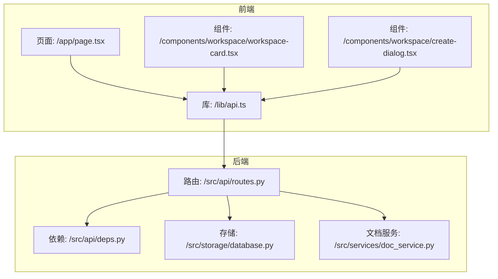
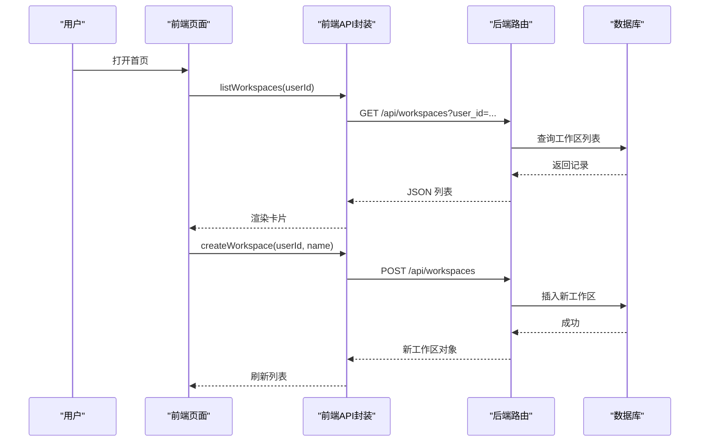
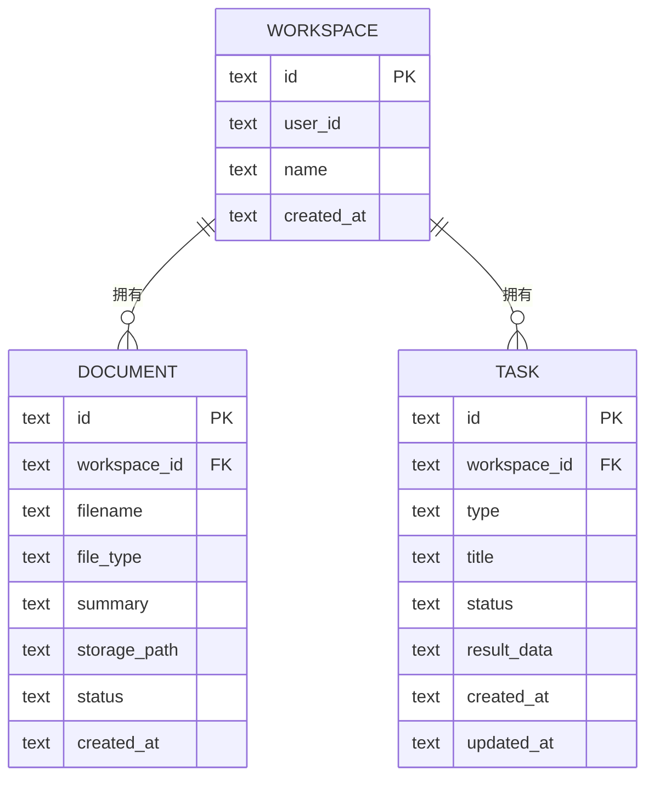
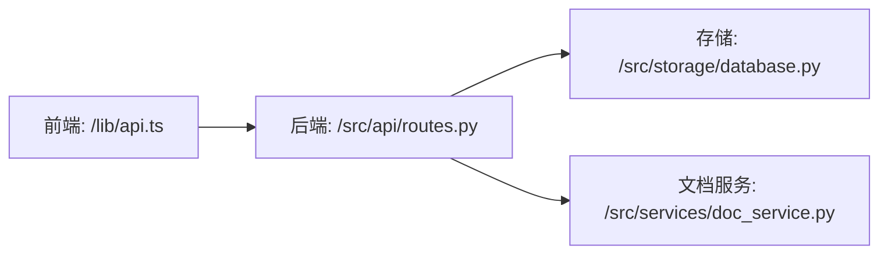
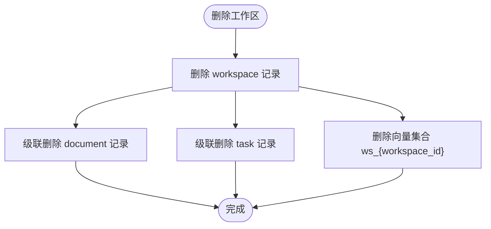

# 工作区管理系统

<cite>
**本文引用的文件**
- [backend/src/storage/database.py](file://backend/src/storage/database.py)
- [backend/src/api/routes.py](file://backend/src/api/routes.py)
- [backend/src/api/deps.py](file://backend/src/api/deps.py)
- [backend/src/services/doc_service.py](file://backend/src/services/doc_service.py)
- [frontend/src/lib/api.ts](file://frontend/src/lib/api.ts)
- [frontend/src/app/page.tsx](file://frontend/src/app/page.tsx)
- [frontend/src/components/workspace/workspace-card.tsx](file://frontend/src/components/workspace/workspace-card.tsx)
- [frontend/src/components/workspace/create-dialog.tsx](file://frontend/src/components/workspace/create-dialog.tsx)
- [backend/src/storage/vector_store.py](file://backend/src/storage/vector_store.py)
- [docs/backend-architecture.md](file://docs/backend-architecture.md)
- [docs/frontend-architecture.md](file://docs/frontend-architecture.md)
</cite>

## 目录
1. [简介](#简介)
2. [项目结构](#项目结构)
3. [核心组件](#核心组件)
4. [架构总览](#架构总览)
5. [详细组件分析](#详细组件分析)
6. [依赖关系分析](#依赖关系分析)
7. [性能与扩展性](#性能与扩展性)
8. [API 接口文档](#api-接口文档)
9. [工作区隔离机制](#工作区隔离机制)
10. [状态与生命周期管理](#状态与生命周期管理)
11. [权限与访问控制](#权限与访问控制)
12. [常见问题与故障排除](#常见问题与故障排除)
13. [结论](#结论)

## 简介
本文件面向“工作区管理系统”的使用者与开发者，系统性梳理工作区的创建、删除、查询等核心能力，解释后端数据库模型与前端交互方式；同时基于现有代码实现，给出工作区隔离、状态管理、API 设计与常见问题排查建议。当前仓库中工作区功能以“按用户隔离”为主：每个工作区绑定一个用户 ID，列表查询与删除均基于该维度进行。

## 项目结构
- 后端采用 FastAPI 提供 REST 接口，数据持久化通过 SQLite 实现，文档处理服务封装在独立模块中。
- 前端使用 Next.js 构建页面与交互，通过统一的 API 封装层调用后端接口。

图表来源
- [frontend/src/app/page.tsx:1-50](file://frontend/src/app/page.tsx#L1-L50)
- [frontend/src/components/workspace/workspace-card.tsx:1-50](file://frontend/src/components/workspace/workspace-card.tsx#L1-L50)
- [frontend/src/components/workspace/create-dialog.tsx](file://frontend/src/components/workspace/create-dialog.tsx)
- [frontend/src/lib/api.ts:1-195](file://frontend/src/lib/api.ts#L1-L195)
- [backend/src/api/routes.py:1080-1146](file://backend/src/api/routes.py#L1080-L1146)
- [backend/src/api/deps.py](file://backend/src/api/deps.py)
- [backend/src/storage/database.py:198-317](file://backend/src/storage/database.py#L198-L317)
- [backend/src/services/doc_service.py](file://backend/src/services/doc_service.py)

章节来源
- [docs/backend-architecture.md](file://docs/backend-architecture.md)
- [docs/frontend-architecture.md](file://docs/frontend-architecture.md)

## 核心组件
- 数据库层（SQLite）：负责工作区、文档、任务三类实体的增删改查与约束。
- 文档服务：封装上传、解析、向量化等文档处理流程。
- API 路由层：定义 REST 接口，校验入参，调用数据库与服务层。
- 前端 API 封装与页面组件：负责用户交互、错误提示与数据展示。

章节来源
- [backend/src/storage/database.py:198-317](file://backend/src/storage/database.py#L198-L317)
- [backend/src/services/doc_service.py](file://backend/src/services/doc_service.py)
- [backend/src/api/routes.py:1080-1146](file://backend/src/api/routes.py#L1080-L1146)
- [frontend/src/lib/api.ts:1-195](file://frontend/src/lib/api.ts#L1-L195)

## 架构总览
后端以 FastAPI 为核心，通过依赖注入获取数据库实例；路由层对工作区、文档、任务分别提供 REST 接口；前端通过统一的 API 封装发起请求，页面组件负责渲染与交互。

图表来源
- [frontend/src/app/page.tsx:17-50](file://frontend/src/app/page.tsx#L17-L50)
- [frontend/src/lib/api.ts:1-195](file://frontend/src/lib/api.ts#L1-L195)
- [backend/src/api/routes.py:1097-1117](file://backend/src/api/routes.py#L1097-L1117)
- [backend/src/storage/database.py:111-142](file://backend/src/storage/database.py#L111-L142)

## 详细组件分析

### 数据模型与隔离
- 工作区表（workspace）：主键 id、拥有者 user_id、名称 name、创建时间 created_at。
- 文档表（document）：外键 workspace_id 引用工作区，级联删除；字段包含文件名、类型、摘要、存储路径、状态等。
- 任务表（task）：外键 workspace_id 引用工作区，级联删除；字段包含类型、标题、状态、结果数据等。

图表来源
- [backend/src/storage/database.py:208-237](file://backend/src/storage/database.py#L208-L237)

章节来源
- [backend/src/storage/database.py:208-237](file://backend/src/storage/database.py#L208-L237)

### 后端路由与业务逻辑
- 工作区接口
  - POST /api/workspaces：创建工作区，接收 user_id 与 name，返回新建对象。
  - GET /api/workspaces：按 user_id 查询工作区列表。
  - DELETE /api/workspaces/{workspace_id}：删除工作区。
- 文档接口
  - POST /api/workspaces/{workspace_id}/documents：上传文件，返回文档对象。
  - GET /api/workspaces/{workspace_id}/documents：列出文档。
  - DELETE /api/workspaces/{workspace_id}/documents/{doc_id}：删除文档。
- 任务接口
  - GET /api/workspaces/{workspace_id}/tasks：列出任务。

章节来源
- [backend/src/api/routes.py:1097-1146](file://backend/src/api/routes.py#L1097-L1146)

### 前端交互与状态
- 页面加载时拉取当前用户的工作区列表，渲染为卡片列表。
- 创建对话框提交名称，调用后端创建接口，成功后刷新列表。
- 卡片支持删除按钮，点击后调用删除接口并刷新。

章节来源
- [frontend/src/app/page.tsx:17-50](file://frontend/src/app/page.tsx#L17-L50)
- [frontend/src/components/workspace/workspace-card.tsx:1-50](file://frontend/src/components/workspace/workspace-card.tsx#L1-L50)
- [frontend/src/components/workspace/create-dialog.tsx](file://frontend/src/components/workspace/create-dialog.tsx)
- [frontend/src/lib/api.ts:1-195](file://frontend/src/lib/api.ts#L1-L195)

## 依赖关系分析
- 路由层依赖数据库与文档服务；数据库层提供 CRUD 方法；文档服务负责文件处理。
- 前端通过统一 API 封装与后端通信，避免直接耦合具体路径。

图表来源
- [frontend/src/lib/api.ts:1-195](file://frontend/src/lib/api.ts#L1-L195)
- [backend/src/api/routes.py:1080-1146](file://backend/src/api/routes.py#L1080-L1146)
- [backend/src/storage/database.py:198-317](file://backend/src/storage/database.py#L198-L317)
- [backend/src/services/doc_service.py](file://backend/src/services/doc_service.py)

## 性能与扩展性
- 当前使用 SQLite，适合中小规模数据与单机部署；若需水平扩展，可考虑迁移到关系型数据库或引入缓存层。
- 文档处理与向量检索可作为独立服务拆分，降低耦合度。
- 对于高频查询，可在数据库层面增加索引（如 workspace.user_id、document.workspace_id 等）。

## API 接口文档

### 工作区
- 创建工作区
  - 方法与路径: POST /api/workspaces
  - 请求体字段: user_id(string, 必填), name(string, 必填)
  - 响应: 新建工作区对象
- 获取工作区列表
  - 方法与路径: GET /api/workspaces?user_id=...
  - 查询参数: user_id(string, 必填)
  - 响应: 工作区数组
- 删除工作区
  - 方法与路径: DELETE /api/workspaces/{workspace_id}
  - 路径参数: workspace_id(string, 必填)
  - 响应: {"ok": true}

章节来源
- [backend/src/api/routes.py:1097-1117](file://backend/src/api/routes.py#L1097-L1117)
- [backend/src/storage/database.py:111-142](file://backend/src/storage/database.py#L111-L142)

### 文档
- 上传文档
  - 方法与路径: POST /api/workspaces/{workspace_id}/documents
  - 路径参数: workspace_id(string, 必填)
  - 表单字段: file(file, 必填)
  - 响应: 文档对象
- 列出文档
  - 方法与路径: GET /api/workspaces/{workspace_id}/documents
  - 路径参数: workspace_id(string, 必填)
  - 响应: 文档数组
- 删除文档
  - 方法与路径: DELETE /api/workspaces/{workspace_id}/documents/{doc_id}
  - 路径参数: workspace_id(string, 必填), doc_id(string, 必填)
  - 响应: {"ok": true}

章节来源
- [backend/src/api/routes.py:1119-1140](file://backend/src/api/routes.py#L1119-L1140)
- [backend/src/storage/database.py:266-292](file://backend/src/storage/database.py#L266-L292)

### 任务
- 列出任务
  - 方法与路径: GET /api/workspaces/{workspace_id}/tasks
  - 路径参数: workspace_id(string, 必填)
  - 响应: 任务数组

章节来源
- [backend/src/api/routes.py:1142-1146](file://backend/src/api/routes.py#L1142-L1146)
- [backend/src/storage/database.py:294-317](file://backend/src/storage/database.py#L294-L317)

## 工作区隔离机制
- 用户隔离：工作区表包含 user_id 字段，查询与删除均以 user_id 为条件，确保不同用户的资源相互隔离。
- 外键与级联：文档与任务表通过外键关联工作区，并设置级联删除，保证删除工作区时自动清理其下的文档与任务。
- 向量存储隔离：向量库按工作区 ID 命名集合，删除工作区时同步删除对应集合，避免跨区数据泄露。

图表来源
- [backend/src/storage/database.py:208-237](file://backend/src/storage/database.py#L208-L237)
- [backend/src/storage/vector_store.py:172-176](file://backend/src/storage/vector_store.py#L172-L176)

章节来源
- [backend/src/storage/database.py:208-237](file://backend/src/storage/database.py#L208-L237)
- [backend/src/storage/vector_store.py:165-176](file://backend/src/storage/vector_store.py#L165-L176)

## 状态与生命周期管理
- 工作区状态：当前未见专门的状态字段；可通过扩展在 workspace 表新增 status 字段以支持启用/禁用等状态。
- 文档状态：document 表含 status 字段，默认“processing”，可用于表示导入/解析/完成等阶段。
- 任务状态：task 表含 status 字段，默认“generating”，可用于跟踪生成进度。
- 线程关联：后端路由中提供更新线程 ID 的接口，前端可将工作区与会话线程关联，便于消息历史管理。

章节来源
- [backend/src/storage/database.py:216-235](file://backend/src/storage/database.py#L216-L235)
- [backend/src/api/routes.py:62-81](file://backend/src/api/routes.py#L62-L81)

## 权限与访问控制
- 当前实现：后端通过 user_id 进行资源过滤，前端在调用前从本地获取用户 ID 并传给后端；未见显式的 RBAC 或角色模型。
- 安全边界：由于所有查询/删除均携带 user_id，且数据库层未暴露跨用户查询，因此在当前版本下具备基本的用户隔离能力。
- 建议增强：引入角色（如 owner/member）、细粒度权限（读/写/删除），并在路由层增加鉴权中间件，对敏感操作进行权限校验。

章节来源
- [backend/src/api/routes.py:1097-1117](file://backend/src/api/routes.py#L1097-L1117)
- [frontend/src/lib/api.ts:1-195](file://frontend/src/lib/api.ts#L1-L195)

## 常见问题与故障排除
- 创建失败：若提示名称冲突，检查是否已存在同名工作区（大小写不敏感）。解决后重试。
- 列表为空：确认传入的 user_id 是否正确，以及该用户是否已创建过工作区。
- 删除无效：确认 workspace_id 是否有效，且属于当前用户。
- 上传失败：检查文件大小、类型与后端配置；查看网络日志与后端错误码。
- 前端报错：前端封装了统一的错误处理，捕获非 2xx 响应并抛出 ApiError，可据此定位问题。

章节来源
- [frontend/src/lib/api.ts:3-42](file://frontend/src/lib/api.ts#L3-L42)
- [frontend/src/app/page.tsx:39-50](file://frontend/src/app/page.tsx#L39-L50)
- [backend/src/storage/database.py:111-127](file://backend/src/storage/database.py#L111-L127)

## 结论
本系统以“用户 ID 隔离”为基础实现了工作区的核心能力，配合数据库外键与级联删除保障了数据一致性；前端通过统一 API 封装提供了直观的创建、查询与删除体验。后续可在权限体系、状态模型与向量化检索等方面进一步完善，以满足更复杂的协作与治理需求。