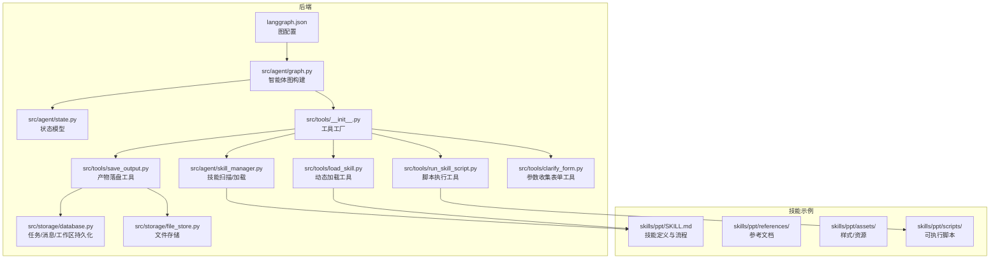
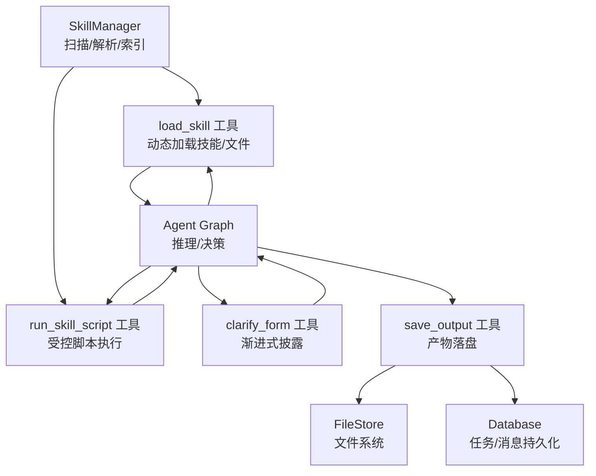
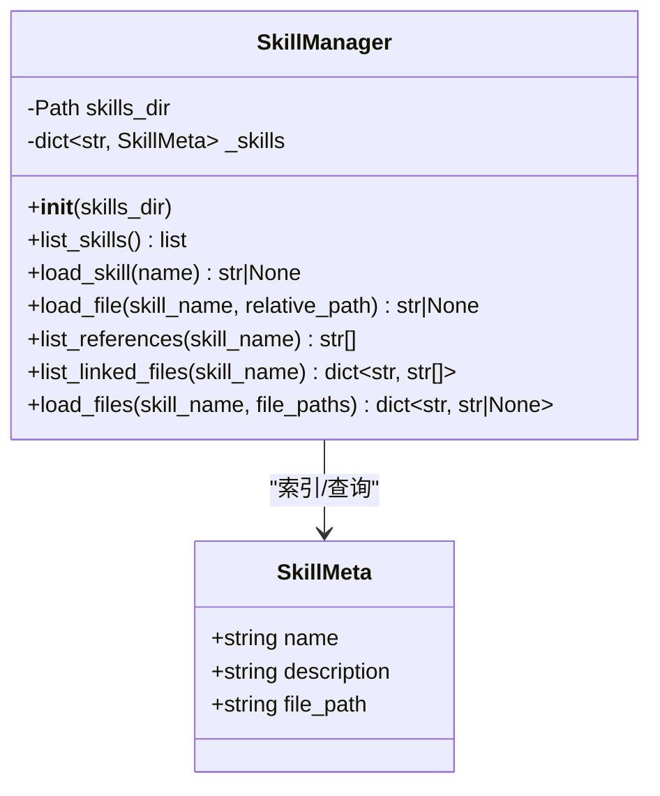
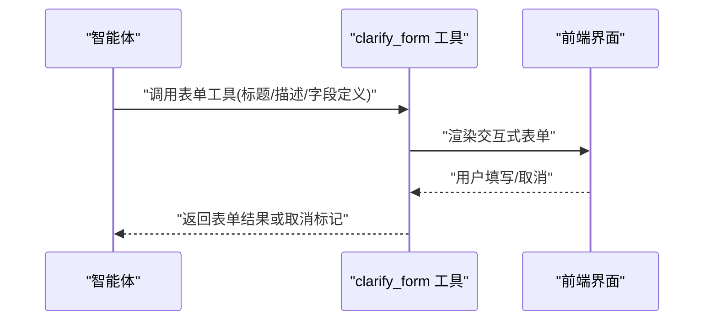
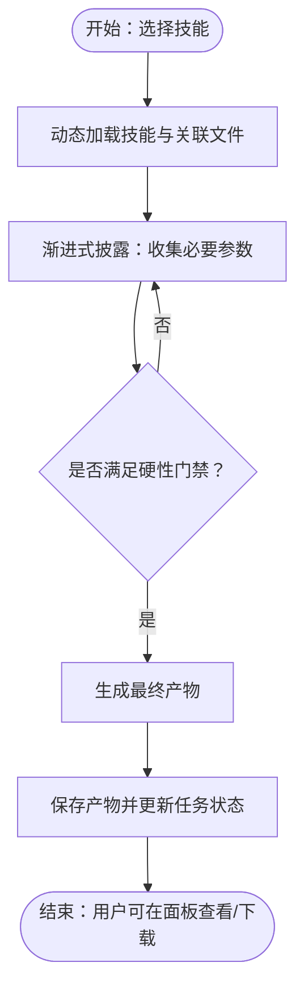
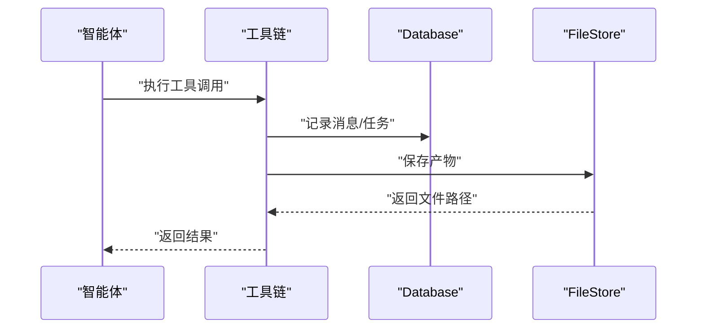
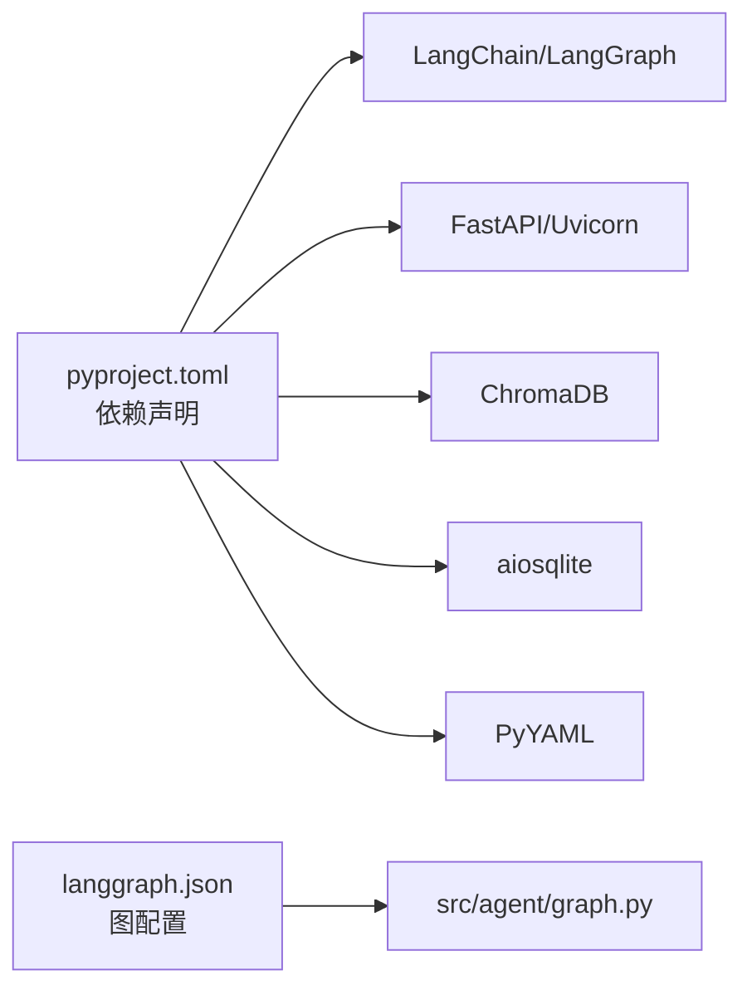

# 技能执行平台

<cite>
**本文档引用的文件**
- [backend/src/agent/skill_manager.py](file://backend/src/agent/skill_manager.py)
- [backend/src/tools/load_skill.py](file://backend/src/tools/load_skill.py)
- [backend/src/tools/run_skill_script.py](file://backend/src/tools/run_skill_script.py)
- [backend/src/tools/save_output.py](file://backend/src/tools/save_output.py)
- [backend/src/tools/clarify_form.py](file://backend/src/tools/clarify_form.py)
- [backend/src/agent/graph.py](file://backend/src/agent/graph.py)
- [backend/src/agent/state.py](file://backend/src/agent/state.py)
- [backend/src/tools/__init__.py](file://backend/src/tools/__init__.py)
- [backend/src/storage/database.py](file://backend/src/storage/database.py)
- [backend/src/storage/file_store.py](file://backend/src/storage/file_store.py)
- [backend/skills/ppt/SKILL.md](file://backend/skills/ppt/SKILL.md)
- [backend/skills/ppt/references/html-template.md](file://backend/skills/ppt/references/html-template.md)
- [backend/langgraph.json](file://backend/langgraph.json)
- [backend/pyproject.toml](file://backend/pyproject.toml)
</cite>

## 目录
1. [引言](#引言)
2. [项目结构](#项目结构)
3. [核心组件](#核心组件)
4. [架构总览](#架构总览)
5. [详细组件分析](#详细组件分析)
6. [依赖分析](#依赖分析)
7. [性能考虑](#性能考虑)
8. [故障排查指南](#故障排查指南)
9. [结论](#结论)
10. [附录](#附录)

## 引言
本文件面向技能执行平台的开发者与使用者，系统性阐述技能注册与发现机制、渐进式披露（参数收集）流程、自定义技能开发规范、工具接口与参数约束、执行生命周期管理、错误处理与安全边界、性能与安全性保障，以及完整开发示例与调试指南。平台采用 LangGraph 作为智能体框架，结合本地技能目录与工具集，实现“声明式技能 + 动态加载 + 安全执行”的能力体系。

## 项目结构
后端以模块化方式组织：技能管理、工具集合、存储层、智能体图与状态、以及技能示例。LangGraph 配置指向智能体入口；技能示例位于 skills 目录，遵循统一的 SKILL.md 前言块与目录结构约定。

图表来源
- [backend/langgraph.json:1-9](file://backend/langgraph.json#L1-L9)
- [backend/src/agent/graph.py:1-49](file://backend/src/agent/graph.py#L1-L49)
- [backend/src/agent/state.py:1-7](file://backend/src/agent/state.py#L1-L7)
- [backend/src/tools/__init__.py:1-20](file://backend/src/tools/__init__.py#L1-L20)
- [backend/src/agent/skill_manager.py:1-117](file://backend/src/agent/skill_manager.py#L1-L117)
- [backend/src/tools/load_skill.py:1-116](file://backend/src/tools/load_skill.py#L1-L116)
- [backend/src/tools/run_skill_script.py:1-143](file://backend/src/tools/run_skill_script.py#L1-L143)
- [backend/src/tools/save_output.py:1-99](file://backend/src/tools/save_output.py#L1-L99)
- [backend/src/tools/clarify_form.py:1-46](file://backend/src/tools/clarify_form.py#L1-L46)
- [backend/src/storage/database.py:1-379](file://backend/src/storage/database.py#L1-L379)
- [backend/src/storage/file_store.py:1-39](file://backend/src/storage/file_store.py#L1-L39)
- [backend/skills/ppt/SKILL.md:1-269](file://backend/skills/ppt/SKILL.md#L1-L269)
- [backend/skills/ppt/references/html-template.md:1-420](file://backend/skills/ppt/references/html-template.md#L1-L420)

章节来源
- [backend/langgraph.json:1-9](file://backend/langgraph.json#L1-L9)
- [backend/src/agent/graph.py:1-49](file://backend/src/agent/graph.py#L1-L49)
- [backend/src/tools/__init__.py:1-20](file://backend/src/tools/__init__.py#L1-L20)

## 核心组件
- 技能管理器：扫描 skills 目录，解析 SKILL.md 前言块，建立技能索引，提供列出、加载、引用文件枚举与批量加载能力。
- 动态加载工具：将技能清单注入工具描述，按需加载技能主提示与关联文件，支持占位替换与批量文件读取。
- 渐进式披露工具：通过表单收集用户参数，支持文本/单选/多选字段与必填校验，中断执行等待用户输入。
- 脚本执行工具：在受控目录内安全执行脚本，限制解释器类型，设置超时与输出截断，返回标准输出/错误。
- 产物保存工具：将最终产物写入文件存储，创建任务记录并更新状态，供前端展示与下载。
- 存储层：数据库负责工作区、任务、消息持久化；文件存储负责产物落地与工作区隔离。
- 智能体图与状态：封装模型、中间件、工具链与状态模式，形成可部署的执行图。

章节来源
- [backend/src/agent/skill_manager.py:1-117](file://backend/src/agent/skill_manager.py#L1-L117)
- [backend/src/tools/load_skill.py:1-116](file://backend/src/tools/load_skill.py#L1-L116)
- [backend/src/tools/clarify_form.py:1-46](file://backend/src/tools/clarify_form.py#L1-L46)
- [backend/src/tools/run_skill_script.py:1-143](file://backend/src/tools/run_skill_script.py#L1-L143)
- [backend/src/tools/save_output.py:1-99](file://backend/src/tools/save_output.py#L1-L99)
- [backend/src/storage/database.py:1-379](file://backend/src/storage/database.py#L1-L379)
- [backend/src/storage/file_store.py:1-39](file://backend/src/storage/file_store.py#L1-L39)
- [backend/src/agent/graph.py:1-49](file://backend/src/agent/graph.py#L1-L49)
- [backend/src/agent/state.py:1-7](file://backend/src/agent/state.py#L1-L7)

## 架构总览
平台采用“声明式技能 + 动态加载 + 受控执行”的三层架构：
- 声明层：技能以 SKILL.md 前言块定义元数据，配合 references/assets/scripts 提供上下文与可执行资源。
- 发现层：技能管理器扫描目录，解析前言块，建立技能字典；工具工厂注入技能清单到工具描述。
- 执行层：智能体基于工具链进行推理与决策，通过动态加载与脚本执行完成具体任务，最终通过保存工具交付产物。

图表来源
- [backend/src/agent/skill_manager.py:1-117](file://backend/src/agent/skill_manager.py#L1-L117)
- [backend/src/tools/load_skill.py:1-116](file://backend/src/tools/load_skill.py#L1-L116)
- [backend/src/tools/run_skill_script.py:1-143](file://backend/src/tools/run_skill_script.py#L1-L143)
- [backend/src/tools/save_output.py:1-99](file://backend/src/tools/save_output.py#L1-L99)
- [backend/src/tools/clarify_form.py:1-46](file://backend/src/tools/clarify_form.py#L1-L46)
- [backend/src/agent/graph.py:1-49](file://backend/src/agent/graph.py#L1-L49)
- [backend/src/storage/file_store.py:1-39](file://backend/src/storage/file_store.py#L1-L39)
- [backend/src/storage/database.py:1-379](file://backend/src/storage/database.py#L1-L379)

## 详细组件分析

### 技能注册与发现机制
- SKILL.md 前言块格式：使用 YAML 片段，包含 name 与 description；其余正文用于指导与流程说明。
- 扫描策略：遍历 skills 目录，定位每个子目录下的 SKILL.md，解析前言块并登记到内存索引。
- 元数据管理：SkillMeta 结构仅保留 name/description/file_path，便于智能体仅感知元信息。
- 动态加载策略：
  - 列出技能：返回 name/description 列表。
  - 加载技能：读取 SKILL.md 全文，支持 ${SKILL_DIR} 占位替换为技能根目录路径。
  - 关联文件枚举：自动扫描 references/templates/scripts/assets 等子目录，按类型分组返回相对路径。
  - 批量文件加载：限制最多 5 个文件，逐个校验存在性与目录逃逸风险，返回缺失文件列表。

图表来源
- [backend/src/agent/skill_manager.py:7-117](file://backend/src/agent/skill_manager.py#L7-L117)

章节来源
- [backend/src/agent/skill_manager.py:1-117](file://backend/src/agent/skill_manager.py#L1-L117)
- [backend/skills/ppt/SKILL.md:1-269](file://backend/skills/ppt/SKILL.md#L1-L269)

### 渐进式披露机制（参数收集表单）
- 表单模型：支持文本、单选、多选三种字段类型，字段具备必填属性与选项列表。
- 调用行为：通过工具中断（interrupt）将表单渲染至前端，等待用户填写；若用户取消，返回取消标记。
- 使用约束：禁止在同一消息中同时附带说明文字；应在调用前单独输出说明。

图表来源
- [backend/src/tools/clarify_form.py:1-46](file://backend/src/tools/clarify_form.py#L1-L46)

章节来源
- [backend/src/tools/clarify_form.py:1-46](file://backend/src/tools/clarify_form.py#L1-L46)
- [backend/skills/ppt/SKILL.md:66-122](file://backend/skills/ppt/SKILL.md#L66-L122)

### 自定义技能开发流程
- 目录结构：技能根目录包含 SKILL.md（前言块+正文流程）、references（参考文档）、assets（样式/资源）、scripts（可执行脚本）。
- 工具接口规范：
  - 动态加载：通过 load_skill 工具按需加载技能主提示与关联文件；支持最多 5 个文件的批量加载。
  - 脚本执行：通过 run_skill_script 工具在受控目录内执行脚本，支持 .sh/.py/.js/.ts；限制解释器类型与工作目录，防止路径穿越。
  - 产物保存：通过 save_output 工具将最终产物写入文件存储并创建任务记录。
- 参数定义与返回值：
  - 动态加载：返回 JSON，包含 success、name、content/linked_files；批量加载额外返回 missing_files。
  - 脚本执行：返回字符串，包含 stdout 或错误信息；超时/非零退出码均有明确反馈。
  - 产物保存：返回字符串，包含任务 ID 与可访问路径。
- 最佳实践：
  - 在 SKILL.md 正文中明确“渐进式披露”阶段的参数收集步骤与硬性门禁（如必须先确认大纲）。
  - 在 references 中提供生成模板与样式参考，在 assets 中提供强制性基础样式文件。
  - 在 scripts 中仅放置受控的、必要的执行逻辑，避免外部依赖与危险操作。

图表来源
- [backend/src/tools/load_skill.py:1-116](file://backend/src/tools/load_skill.py#L1-L116)
- [backend/src/tools/clarify_form.py:1-46](file://backend/src/tools/clarify_form.py#L1-L46)
- [backend/src/tools/save_output.py:1-99](file://backend/src/tools/save_output.py#L1-L99)
- [backend/skills/ppt/SKILL.md:137-259](file://backend/skills/ppt/SKILL.md#L137-L259)

章节来源
- [backend/src/tools/load_skill.py:1-116](file://backend/src/tools/load_skill.py#L1-L116)
- [backend/src/tools/run_skill_script.py:1-143](file://backend/src/tools/run_skill_script.py#L1-L143)
- [backend/src/tools/save_output.py:1-99](file://backend/src/tools/save_output.py#L1-L99)
- [backend/skills/ppt/SKILL.md:1-269](file://backend/skills/ppt/SKILL.md#L1-L269)

### 技能执行生命周期管理
- 初始化：智能体图加载环境变量、创建模型与回调、装配工具与中间件。
- 运行监控：消息持久化记录工具调用、参数与响应元数据；任务状态贯穿生成过程。
- 结果处理：产物经保存工具写入文件存储，任务状态更新为完成，返回可访问路径。
- 清理机制：文件存储按工作区隔离；删除工作区时清理对应目录；数据库维护任务与消息历史。

图表来源
- [backend/src/agent/graph.py:1-49](file://backend/src/agent/graph.py#L1-L49)
- [backend/src/storage/database.py:1-379](file://backend/src/storage/database.py#L1-L379)
- [backend/src/storage/file_store.py:1-39](file://backend/src/storage/file_store.py#L1-L39)
- [backend/src/tools/save_output.py:1-99](file://backend/src/tools/save_output.py#L1-L99)

章节来源
- [backend/src/agent/graph.py:1-49](file://backend/src/agent/graph.py#L1-L49)
- [backend/src/storage/database.py:1-379](file://backend/src/storage/database.py#L1-L379)
- [backend/src/storage/file_store.py:1-39](file://backend/src/storage/file_store.py#L1-L39)
- [backend/src/tools/save_output.py:1-99](file://backend/src/tools/save_output.py#L1-L99)

## 依赖分析
- 语言与框架：Python 3.12，FastAPI/Uvicorn，LangChain/LangGraph，ChromaDB 向量库，aiosqlite 异步 SQLite。
- 工具依赖：PyYAML 用于解析 SKILL.md 前言块；python-multipart 用于上传；httpx 用于网络请求；dotenv 用于环境变量。
- 图配置：langgraph.json 指定 Python 版本、依赖路径与图入口。

图表来源
- [backend/pyproject.toml:1-41](file://backend/pyproject.toml#L1-L41)
- [backend/langgraph.json:1-9](file://backend/langgraph.json#L1-L9)
- [backend/src/agent/graph.py:1-49](file://backend/src/agent/graph.py#L1-L49)

章节来源
- [backend/pyproject.toml:1-41](file://backend/pyproject.toml#L1-L41)
- [backend/langgraph.json:1-9](file://backend/langgraph.json#L1-L9)

## 性能考虑
- 输出截断：脚本执行工具对超长输出进行截断，避免撑爆上下文窗口。
- 批量加载限制：动态加载工具限制单次批量文件数量，降低 I/O 压力。
- 异步存储：文件存储提供异步写入封装，避免阻塞事件循环。
- 数据库索引：消息表按 thread_id 与 id 排序，限制查询范围，提升分页效率。
- 资源隔离：脚本执行限定工作目录与解释器类型，减少进程开销与资源泄漏风险。

## 故障排查指南
- 技能未找到：动态加载工具返回可用技能列表，检查技能名称大小写与拼写。
- 文件加载失败：检查相对路径是否在技能目录内，避免目录逃逸；确认文件存在且为文件类型。
- 脚本执行失败：查看返回的错误信息与退出码；确认脚本类型受支持、解释器可用、工作目录正确。
- 产物保存失败：检查数据库连接与文件存储权限；查看异常日志并重试。
- 表单被取消：尊重用户取消意图，重新引导或提供替代方案。

章节来源
- [backend/src/tools/load_skill.py:50-74](file://backend/src/tools/load_skill.py#L50-L74)
- [backend/src/tools/load_skill.py:98-113](file://backend/src/tools/load_skill.py#L98-L113)
- [backend/src/tools/run_skill_script.py:112-134](file://backend/src/tools/run_skill_script.py#L112-L134)
- [backend/src/tools/save_output.py:51-58](file://backend/src/tools/save_output.py#L51-L58)
- [backend/src/tools/clarify_form.py:42-45](file://backend/src/tools/clarify_form.py#L42-L45)

## 结论
平台通过“声明式技能 + 动态加载 + 受控执行”的设计，实现了可扩展、可审计、可复用的技能执行体系。SKILL.md 前言块与正文共同构成技能契约，渐进式披露确保参数质量，工具链提供安全可控的执行面，存储层保障产物与状态可追踪。遵循本文档的开发规范与最佳实践，可高效构建高质量的自定义技能并稳定交付结果。

## 附录

### 开发示例与调试要点
- 示例：PPT 技能
  - 流程：参数收集 → 大纲确认 → 生成 HTML → 保存产物 → 用户交付。
  - 参考：SKILL.md 中的“渐进式披露”“大纲确认”“生成与交付”阶段；html-template.md 中的模板与实现细节。
- 调试建议：
  - 在 SKILL.md 中明确“硬性门禁”，避免提前生成最终产物。
  - 使用动态加载工具打印技能内容长度与技能目录，核对占位替换是否生效。
  - 对脚本执行设置合理超时，关注 stdout/stderr 截断提示。
  - 通过保存工具返回的文件路径在前端面板验证产物可访问性。

章节来源
- [backend/skills/ppt/SKILL.md:66-259](file://backend/skills/ppt/SKILL.md#L66-L259)
- [backend/skills/ppt/references/html-template.md:1-420](file://backend/skills/ppt/references/html-template.md#L1-L420)
- [backend/src/tools/load_skill.py:76-83](file://backend/src/tools/load_skill.py#L76-L83)
- [backend/src/tools/run_skill_script.py:96-140](file://backend/src/tools/run_skill_script.py#L96-L140)
- [backend/src/tools/save_output.py:33-58](file://backend/src/tools/save_output.py#L33-L58)