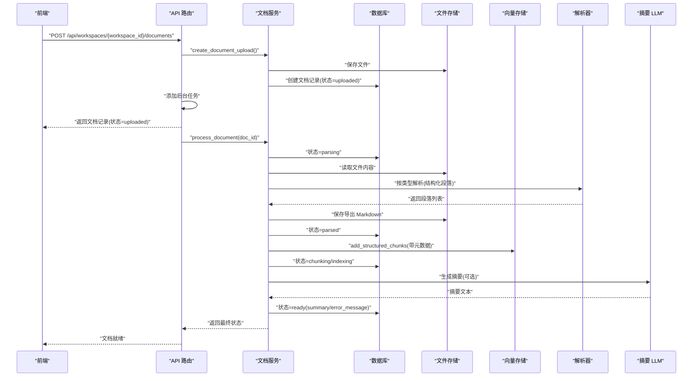
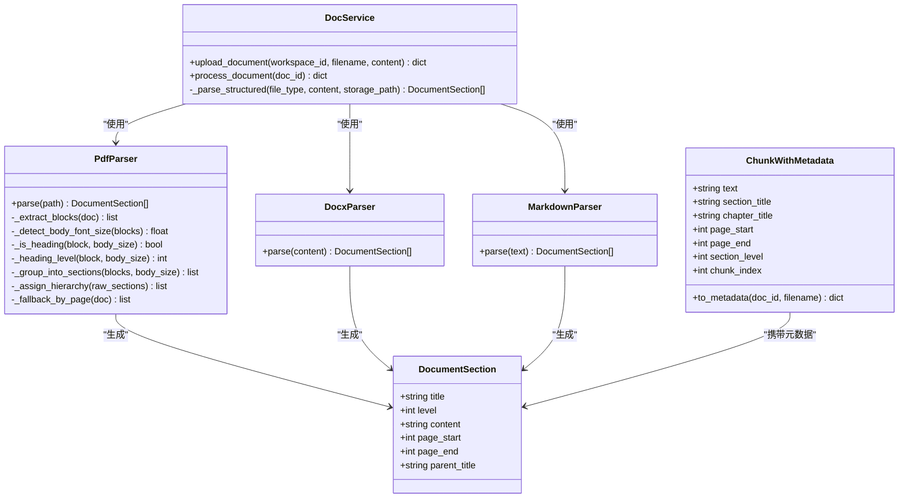
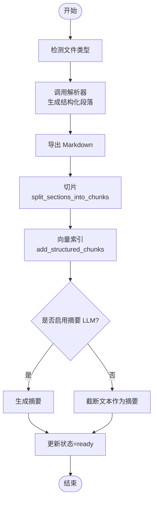
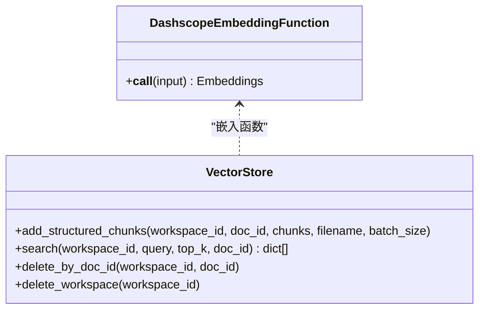
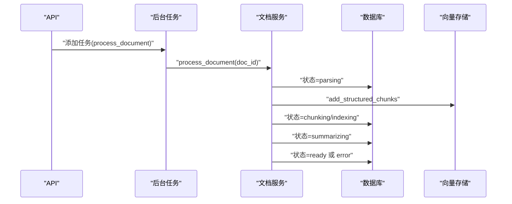
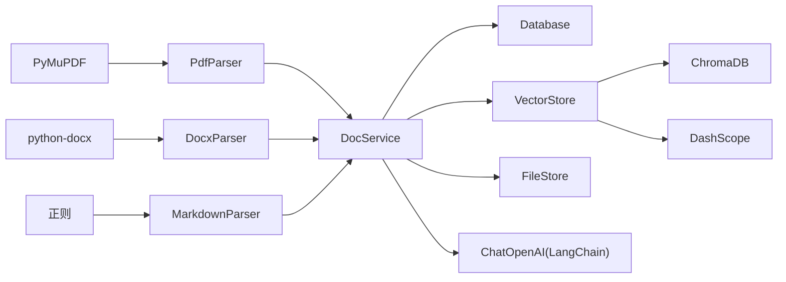

# 文档处理流水线

<cite>
**本文引用的文件列表**
- [backend/src/parsers/base.py](file://backend/src/parsers/base.py)
- [backend/src/parsers/pdf_parser.py](file://backend/src/parsers/pdf_parser.py)
- [backend/src/parsers/docx_parser.py](file://backend/src/parsers/docx_parser.py)
- [backend/src/parsers/markdown_parser.py](file://backend/src/parsers/markdown_parser.py)
- [backend/src/services/doc_service.py](file://backend/src/services/doc_service.py)
- [backend/src/storage/vector_store.py](file://backend/src/storage/vector_store.py)
- [backend/src/storage/database.py](file://backend/src/storage/database.py)
- [backend/src/storage/file_store.py](file://backend/src/storage/file_store.py)
- [backend/src/api/routes.py](file://backend/src/api/routes.py)
- [backend/src/api/deps.py](file://backend/src/api/deps.py)
- [backend/src/tools/rag_search.py](file://backend/src/tools/rag_search.py)
- [backend/scripts/inspect_chunks.py](file://backend/scripts/inspect_chunks.py)
- [backend/pyproject.toml](file://backend/pyproject.toml)
- [README.md](file://README.md)
</cite>

## 目录
1. [简介](#简介)
2. [项目结构](#项目结构)
3. [核心组件](#核心组件)
4. [架构总览](#架构总览)
5. [组件详解](#组件详解)
6. [依赖关系分析](#依赖关系分析)
7. [性能考量](#性能考量)
8. [故障排查指南](#故障排查指南)
9. [结论](#结论)
10. [附录](#附录)

## 简介
本技术文档围绕“文档处理流水线”展开，系统性阐述多格式文档解析器的设计与实现，涵盖 PDF（PyMuPDF）、DOCX（python-docx）、Markdown 解析器的架构差异与适配策略；深入说明文档结构化处理流程（文本提取、元数据解析、内容清洗、格式标准化）；详述向量化索引机制（嵌入模型选择、向量存储策略、相似度计算）；并描述异步处理架构（任务队列、状态跟踪、错误恢复）。最后提供完整的 API 接口文档与使用示例，包含错误处理与性能优化建议。

## 项目结构
后端采用模块化分层设计：
- 解析层：多格式解析器（PDF、DOCX、Markdown），统一输出结构化段落单元
- 服务层：文档服务协调解析、切片、索引、摘要生成与状态管理
- 存储层：SQLite（文档元数据）、ChromaDB（向量索引）、文件系统（原始与导出文件）
- 工具层：RAG 检索工具，面向智能体调用
- API 层：FastAPI 路由，支持上传、查询、下载与清理操作
- 配置与脚本：依赖声明、环境变量、调试脚本

```mermaid
graph TB
subgraph "API 层"
Routes["路由<br/>routes.py"]
Deps["依赖注入<br/>deps.py"]
end
subgraph "服务层"
DocSvc["文档服务<br/>doc_service.py"]
end
subgraph "解析层"
Base["基础结构<br/>base.py"]
Pdf["PDF 解析器<br/>pdf_parser.py"]
Docx["DOCX 解析器<br/>docx_parser.py"]
Md["Markdown 解析器<br/>markdown_parser.py"]
end
subgraph "存储层"
DB["数据库<br/>database.py"]
VS["向量存储<br/>vector_store.py"]
FS["文件存储<br/>file_store.py"]
end
subgraph "工具层"
Rag["RAG 检索工具<br/>rag_search.py"]
end
Routes --> Deps --> DocSvc
DocSvc --> Pdf
DocSvc --> Docx
DocSvc --> Md
DocSvc --> Base
DocSvc --> DB
DocSvc --> VS
DocSvc --> FS
Rag --> VS
```

图表来源
- [backend/src/api/routes.py:1-189](file://backend/src/api/routes.py#L1-L189)
- [backend/src/api/deps.py:1-30](file://backend/src/api/deps.py#L1-L30)
- [backend/src/services/doc_service.py:1-218](file://backend/src/services/doc_service.py#L1-L218)
- [backend/src/parsers/base.py:1-97](file://backend/src/parsers/base.py#L1-L97)
- [backend/src/parsers/pdf_parser.py:1-192](file://backend/src/parsers/pdf_parser.py#L1-L192)
- [backend/src/parsers/docx_parser.py:1-84](file://backend/src/parsers/docx_parser.py#L1-L84)
- [backend/src/parsers/markdown_parser.py:1-62](file://backend/src/parsers/markdown_parser.py#L1-L62)
- [backend/src/storage/database.py:1-379](file://backend/src/storage/database.py#L1-L379)
- [backend/src/storage/vector_store.py:1-177](file://backend/src/storage/vector_store.py#L1-L177)
- [backend/src/storage/file_store.py:1-39](file://backend/src/storage/file_store.py#L1-L39)
- [backend/src/tools/rag_search.py:1-76](file://backend/src/tools/rag_search.py#L1-L76)

章节来源
- [README.md:15-23](file://README.md#L15-L23)
- [backend/src/api/routes.py:1-189](file://backend/src/api/routes.py#L1-L189)
- [backend/src/api/deps.py:1-30](file://backend/src/api/deps.py#L1-L30)
- [backend/src/services/doc_service.py:1-218](file://backend/src/services/doc_service.py#L1-L218)

## 核心组件
- 多格式解析器：基于文件类型选择对应解析器，统一输出结构化段落（标题、层级、内容、页码范围等）
- 文档服务：负责上传、解析、切片、索引、摘要生成、状态更新与错误回滚
- 向量存储：封装 ChromaDB，提供结构化分片写入与检索，支持按文档过滤
- 数据库存储：记录工作区、文档、任务、消息等元数据，支持状态字段与时间戳
- 文件存储：按工作区隔离保存原始文件与导出 Markdown
- RAG 检索工具：面向智能体的检索工具，返回带位置信息的片段
- API 路由：提供工作区、文档、任务、文件下载等接口，后台异步处理

章节来源
- [backend/src/parsers/base.py:1-97](file://backend/src/parsers/base.py#L1-L97)
- [backend/src/parsers/pdf_parser.py:1-192](file://backend/src/parsers/pdf_parser.py#L1-L192)
- [backend/src/parsers/docx_parser.py:1-84](file://backend/src/parsers/docx_parser.py#L1-L84)
- [backend/src/parsers/markdown_parser.py:1-62](file://backend/src/parsers/markdown_parser.py#L1-L62)
- [backend/src/services/doc_service.py:1-218](file://backend/src/services/doc_service.py#L1-L218)
- [backend/src/storage/vector_store.py:1-177](file://backend/src/storage/vector_store.py#L1-L177)
- [backend/src/storage/database.py:1-379](file://backend/src/storage/database.py#L1-L379)
- [backend/src/storage/file_store.py:1-39](file://backend/src/storage/file_store.py#L1-L39)
- [backend/src/tools/rag_search.py:1-76](file://backend/src/tools/rag_search.py#L1-L76)
- [backend/src/api/routes.py:1-189](file://backend/src/api/routes.py#L1-L189)

## 架构总览
整体流程：前端上传文档 → 后台创建文档记录 → 异步后台处理 → 结构化解析 → 文本切片 → 向量索引 → 生成摘要 → 更新状态。检索阶段通过 RAG 工具在当前工作区或指定文档内进行相似度检索，返回带位置信息的片段。

图表来源
- [backend/src/api/routes.py:112-128](file://backend/src/api/routes.py#L112-L128)
- [backend/src/services/doc_service.py:29-130](file://backend/src/services/doc_service.py#L29-L130)
- [backend/src/storage/file_store.py:11-16](file://backend/src/storage/file_store.py#L11-L16)
- [backend/src/storage/vector_store.py:91-122](file://backend/src/storage/vector_store.py#L91-L122)
- [backend/src/storage/database.py:285-311](file://backend/src/storage/database.py#L285-L311)

## 组件详解

### 解析器架构与适配策略
- 基础结构
  - DocumentSection：文档结构单元（标题、层级、内容、页码范围、父标题）
  - ChunkWithMetadata：切片单元（文本 + 结构化元数据）
  - split_sections_into_chunks：递归字符切分，按段落与中文分隔符拆分，控制最大长度与重叠
- PDF 解析器（PyMuPDF）
  - 提取文本块与字体信息，检测正文字号，启发式识别标题（字号阈值、加粗、标题模式）
  - 将连续文本分组为段落，分配层级并标注页码范围；若无法检测结构则按页回退
- DOCX 解析器（python-docx）
  - 基于样式名称映射到标题层级，逐段落扫描，遇到标题即 flush 上一段内容
  - 若无标题则整篇作为单一章节
- Markdown 解析器
  - 使用正则匹配标题（# 级别），按标题区间切分内容，支持前言段落
  - 无标题时整篇作为单一章节

图表来源
- [backend/src/parsers/base.py:6-97](file://backend/src/parsers/base.py#L6-L97)
- [backend/src/parsers/pdf_parser.py:17-192](file://backend/src/parsers/pdf_parser.py#L17-L192)
- [backend/src/parsers/docx_parser.py:20-84](file://backend/src/parsers/docx_parser.py#L20-L84)
- [backend/src/parsers/markdown_parser.py:13-62](file://backend/src/parsers/markdown_parser.py#L13-L62)
- [backend/src/services/doc_service.py:13-28](file://backend/src/services/doc_service.py#L13-L28)

章节来源
- [backend/src/parsers/base.py:1-97](file://backend/src/parsers/base.py#L1-L97)
- [backend/src/parsers/pdf_parser.py:1-192](file://backend/src/parsers/pdf_parser.py#L1-L192)
- [backend/src/parsers/docx_parser.py:1-84](file://backend/src/parsers/docx_parser.py#L1-L84)
- [backend/src/parsers/markdown_parser.py:1-62](file://backend/src/parsers/markdown_parser.py#L1-L62)

### 文档结构化处理流程
- 输入：文件名与二进制内容
- 类型检测：根据扩展名映射到 pdf/docx/markdown/text
- 解析：按类型调用对应解析器，得到 DocumentSection 列表
- 导出：拼接为 Markdown 并保存，便于摘要与调试
- 切片：split_sections_into_chunks 将长段落按规则切分，保留结构元数据
- 索引：向量存储 add_structured_chunks 写入 ChromaDB，元数据包含文档 ID、文件名、章节标题、页码范围、层级等
- 摘要：可选摘要 LLM 生成摘要，或回退为截断文本
- 状态：数据库记录状态与错误信息，支持错误恢复与重试

图表来源
- [backend/src/services/doc_service.py:35-130](file://backend/src/services/doc_service.py#L35-L130)
- [backend/src/parsers/base.py:47-97](file://backend/src/parsers/base.py#L47-L97)
- [backend/src/storage/vector_store.py:91-122](file://backend/src/storage/vector_store.py#L91-L122)

章节来源
- [backend/src/services/doc_service.py:1-218](file://backend/src/services/doc_service.py#L1-L218)
- [backend/src/parsers/base.py:1-97](file://backend/src/parsers/base.py#L1-L97)

### 向量化索引机制
- 嵌入模型：Dashscope TextEmbedding（可通过环境变量配置模型与密钥）
- 向量存储：ChromaDB 持久化客户端，按工作区创建集合（命名 ws_{workspace_id}），使用余弦距离
- 元数据：ChunkWithMetadata.to_metadata 输出包含 doc_id、filename、chunk_index、章节标题、页码范围、层级
- 检索：支持按 workspace_id 查询，可选按 doc_id 过滤；返回文本与元数据，包含距离用于排序
- 删除：支持按 doc_id 删除与按工作区删除集合

图表来源
- [backend/src/storage/vector_store.py:13-37](file://backend/src/storage/vector_store.py#L13-L37)
- [backend/src/storage/vector_store.py:39-177](file://backend/src/storage/vector_store.py#L39-L177)

章节来源
- [backend/src/storage/vector_store.py:1-177](file://backend/src/storage/vector_store.py#L1-L177)

### 异步处理架构
- API 层：上传接口立即返回文档记录（状态 uploaded），并将实际处理放入后台任务
- 文档服务：按状态机推进（parsing → parsed → chunking → indexing → summarizing → ready/error）
- 数据库：记录状态与错误信息，便于前端轮询与错误恢复
- 文件存储：导出 Markdown 便于调试与二次处理
- RAG 工具：检索时支持按工作区或单文档过滤，返回带位置信息的片段

图表来源
- [backend/src/api/routes.py:112-128](file://backend/src/api/routes.py#L112-L128)
- [backend/src/services/doc_service.py:57-130](file://backend/src/services/doc_service.py#L57-L130)

章节来源
- [backend/src/api/routes.py:1-189](file://backend/src/api/routes.py#L1-L189)
- [backend/src/services/doc_service.py:1-218](file://backend/src/services/doc_service.py#L1-L218)

### API 接口文档
- 工作区
  - POST /api/workspaces：创建工作区
  - GET /api/workspaces?user_id=...：列出工作区
  - GET /api/workspaces/{workspace_id}：获取工作区
  - PATCH /api/workspaces/{workspace_id}/thread：更新关联 thread_id
  - DELETE /api/workspaces/{workspace_id}：删除工作区（级联清理文档、向量与文件）
- 文档
  - POST /api/workspaces/{workspace_id}/documents：上传文档（后台异步处理）
  - GET /api/workspaces/{workspace_id}/documents：列出文档
  - DELETE /api/workspaces/{workspace_id}/documents/{doc_id}：删除文档（清理向量与文件）
- 任务
  - GET /api/workspaces/{workspace_id}/tasks：列出任务
  - DELETE /api/workspaces/{workspace_id}/tasks/{task_id}：删除任务
- 文件下载
  - GET /api/files/{file_path}：下载文件（支持输出文件与文档）

使用示例（以 curl 形式示意）
- 创建工作区
  - curl -X POST http://localhost:8000/api/workspaces -H "Content-Type: application/json" -d '{"user_id":"u1","name":"my-workspace"}'
- 上传文档
  - curl -F "file=@/path/to/doc.pdf" http://localhost:8000/api/workspaces/<workspace_id>/documents
- 列出文档
  - curl http://localhost:8000/api/workspaces/<workspace_id>/documents
- 下载导出 Markdown
  - curl http://localhost:8000/api/files/<workspace_id>/<filename>.md

章节来源
- [backend/src/api/routes.py:37-189](file://backend/src/api/routes.py#L37-L189)

## 依赖关系分析
- 语言与框架
  - Python 3.12+，FastAPI、Uvicorn、LangChain 生态、ChromaDB、PyMuPDF、python-docx、DashScope
- 关键依赖
  - 解析：PyMuPDF（PDF）、python-docx（DOCX）、正则（Markdown）
  - 向量：ChromaDB、DashScope 文本嵌入
  - 存储：aiosqlite（SQLite）、文件系统
  - LLM：LangChain OpenAI 客户端（摘要）
- 模块耦合
  - DocService 依赖解析器、数据库、向量存储、文件存储与 LLM
  - API 通过依赖注入获取 DocService 实例
  - RAG 工具直接依赖 VectorStore

图表来源
- [backend/src/parsers/pdf_parser.py:6](file://backend/src/parsers/pdf_parser.py#L6)
- [backend/src/parsers/docx_parser.py:24](file://backend/src/parsers/docx_parser.py#L24)
- [backend/src/parsers/markdown_parser.py:10](file://backend/src/parsers/markdown_parser.py#L10)
- [backend/src/services/doc_service.py:4-8](file://backend/src/services/doc_service.py#L4-L8)
- [backend/src/storage/vector_store.py:5-8](file://backend/src/storage/vector_store.py#L5-L8)
- [backend/src/api/deps.py:6-25](file://backend/src/api/deps.py#L6-L25)

章节来源
- [backend/pyproject.toml:6-26](file://backend/pyproject.toml#L6-L26)

## 性能考量
- 切片参数
  - 最大切片长度与重叠：控制上下文连贯性与向量维度
  - 分隔符优先级：先按段落再按换行与中文标点，提升语义完整性
- 批处理写入
  - 向量存储批量写入，减少网络往返与事务开销
- 检索过滤
  - 支持按 doc_id 过滤，缩小搜索空间，提高响应速度
- I/O 异步化
  - 文件写入通过线程池包装，避免阻塞事件循环
- 缓存与预热
  - 向量集合按工作区命名，避免跨工作区干扰；可考虑预热常用工作区集合

[本节为通用性能建议，无需特定文件引用]

## 故障排查指南
- 常见错误
  - 无可提取文本：检查文件是否为扫描版（需 OCR），或内容为空
  - 向量嵌入失败：检查 DashScope API Key 与网络连通性
  - 检索无结果：确认工作区集合是否存在，或尝试扩大 top_k
- 日志定位
  - API 层：上传、下载、删除等请求日志
  - 文档服务：解析、切片、索引、摘要各阶段日志
  - 向量存储：嵌入调用与查询日志
- 调试工具
  - inspect_chunks：查看工作区内分片数量与详情，按文档过滤
- 回滚与清理
  - 删除文档会清理向量与文件；删除工作区会清理整个集合与目录

章节来源
- [backend/src/services/doc_service.py:80-84](file://backend/src/services/doc_service.py#L80-L84)
- [backend/src/storage/vector_store.py:26-36](file://backend/src/storage/vector_store.py#L26-L36)
- [backend/scripts/inspect_chunks.py:1-86](file://backend/scripts/inspect_chunks.py#L1-L86)

## 结论
该文档处理流水线以模块化设计实现多格式文档的结构化解析与向量化索引，结合异步处理与状态机管理，确保端到端的可靠性与可观测性。通过统一的元数据模型与检索工具，为后续智能体问答与技能执行提供了坚实的基础。

[本节为总结性内容，无需特定文件引用]

## 附录

### RAG 检索工具使用示例
- 在智能体中调用 rag_search，支持：
  - query：检索关键词
  - top_k：返回片段数量
  - doc_id：限定在某篇文档内检索
- 返回格式包含文件名、章节/页码位置与文本片段，便于引用与溯源

章节来源
- [backend/src/tools/rag_search.py:40-76](file://backend/src/tools/rag_search.py#L40-L76)

### 环境变量与默认值
- DASHSCOPE_API_KEY：DashScope API 密钥（必需）
- OPENAI_API_BASE：兼容模式 API 基地址（默认指向 DashScope）
- SUMMARIZATION_MODEL：摘要 LLM 模型
- EMBEDDING_MODEL：嵌入模型，默认 text-embedding-v2
- DATA_DIR：数据目录（脚本与持久化路径）

章节来源
- [README.md:50-61](file://README.md#L50-L61)
- [backend/src/api/deps.py:21-25](file://backend/src/api/deps.py#L21-L25)