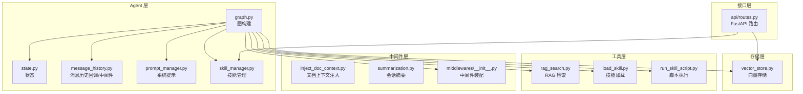
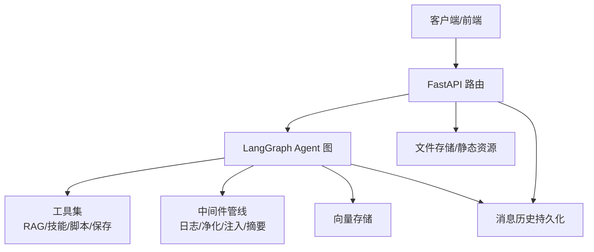
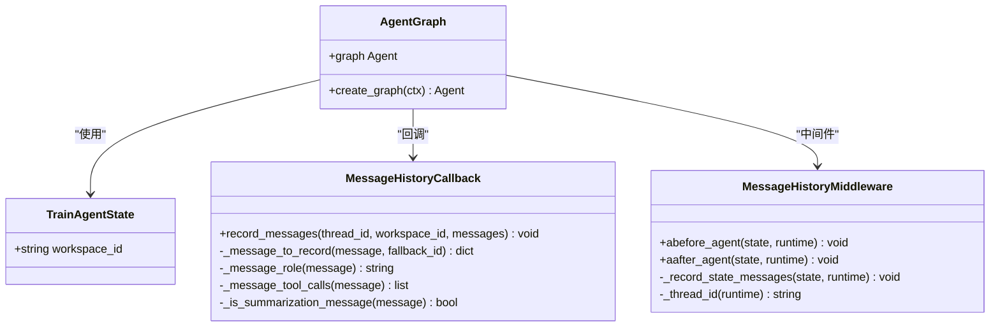
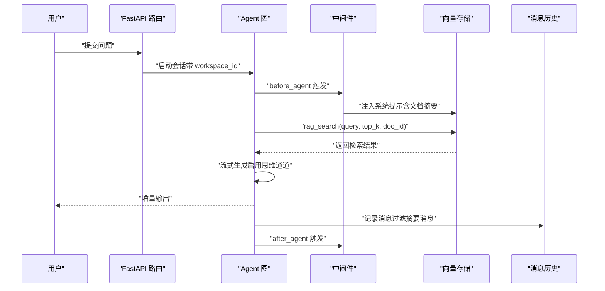
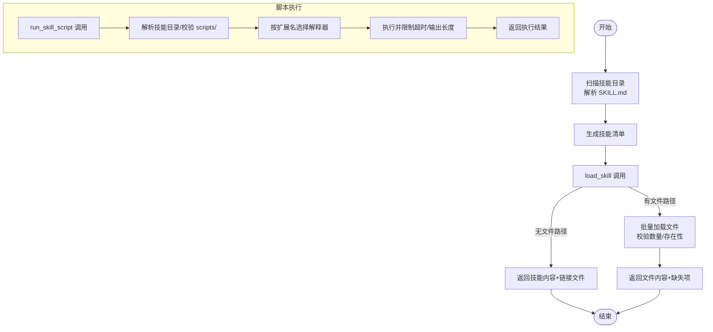
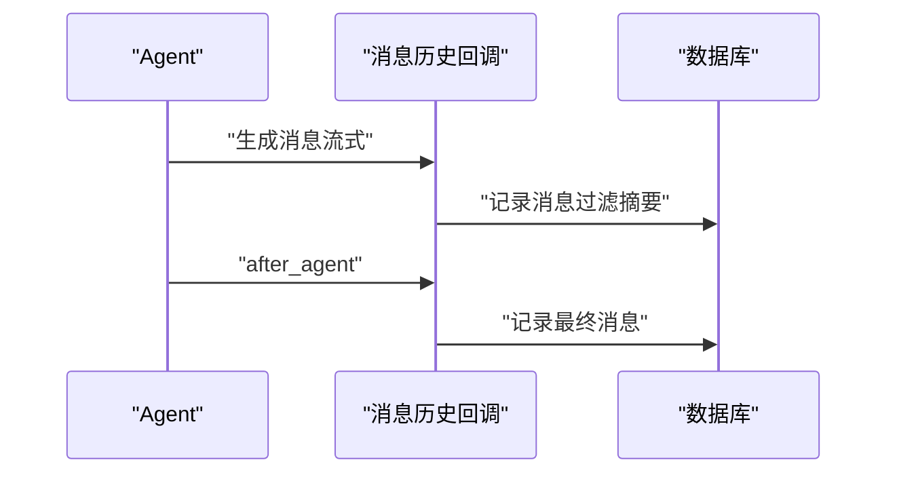
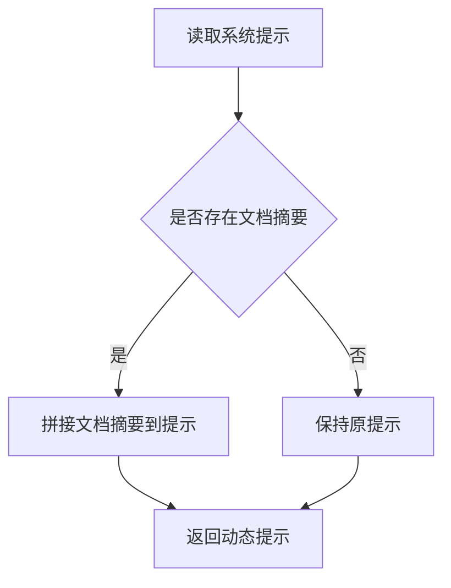
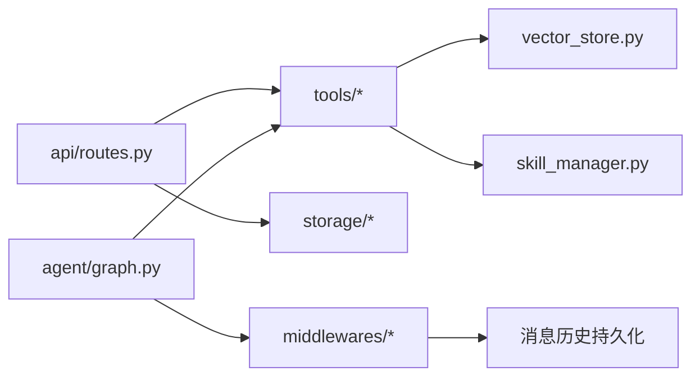

# 智能问答系统

<cite>
**本文引用的文件**
- [backend/src/agent/graph.py](file://backend/src/agent/graph.py)
- [backend/src/agent/state.py](file://backend/src/agent/state.py)
- [backend/src/agent/message_history.py](file://backend/src/agent/message_history.py)
- [backend/src/agent/skill_manager.py](file://backend/src/agent/skill_manager.py)
- [backend/src/agent/prompt_manager.py](file://backend/src/agent/prompt_manager.py)
- [backend/src/tools/rag_search.py](file://backend/src/tools/rag_search.py)
- [backend/src/middlewares/inject_doc_context.py](file://backend/src/middlewares/inject_doc_context.py)
- [backend/src/middlewares/summarization.py](file://backend/src/middlewares/summarization.py)
- [backend/src/middlewares/__init__.py](file://backend/src/middlewares/__init__.py)
- [backend/src/tools/__init__.py](file://backend/src/tools/__init__.py)
- [backend/src/tools/load_skill.py](file://backend/src/tools/load_skill.py)
- [backend/src/tools/run_skill_script.py](file://backend/src/tools/run_skill_script.py)
- [backend/src/storage/vector_store.py](file://backend/src/storage/vector_store.py)
- [backend/src/api/routes.py](file://backend/src/api/routes.py)
- [backend/pyproject.toml](file://backend/pyproject.toml)
</cite>

## 目录
1. [简介](#简介)
2. [项目结构](#项目结构)
3. [核心组件](#核心组件)
4. [架构总览](#架构总览)
5. [详细组件分析](#详细组件分析)
6. [依赖分析](#依赖分析)
7. [性能考虑](#性能考虑)
8. [故障排查指南](#故障排查指南)
9. [结论](#结论)
10. [附录](#附录)

## 简介
本项目是一个面向企业培训领域的智能问答系统，结合 RAG（检索增强生成）与技能工具链，提供“文档驱动”的结构化问答与自动化产出能力。系统以 LangGraph 为核心编排 Agent 的状态流转与中间件管线，通过向量检索与系统提示注入实现上下文增强；同时提供技能发现、加载与脚本执行能力，支持 PPT 等复杂产出流程。

## 项目结构
后端采用模块化分层设计：
- agent：Agent 图构建、状态、消息历史与提示管理
- tools：RAG 检索、技能加载、脚本执行、输出保存等工具
- middlewares：日志、请求净化、文档上下文注入、会话摘要等中间件
- storage：向量存储、文件存储、数据库
- api：FastAPI 接口路由与静态资源挂载
- frontend：前端应用（与后端接口对接）

**图表来源**
- [backend/src/agent/graph.py:16-37](file://backend/src/agent/graph.py#L16-L37)
- [backend/src/middlewares/__init__.py:18-40](file://backend/src/middlewares/__init__.py#L18-L40)
- [backend/src/tools/__init__.py:11-19](file://backend/src/tools/__init__.py#L11-L19)
- [backend/src/api/routes.py:21-27](file://backend/src/api/routes.py#L21-L27)

**章节来源**
- [backend/src/agent/graph.py:16-37](file://backend/src/agent/graph.py#L16-L37)
- [backend/src/middlewares/__init__.py:18-40](file://backend/src/middlewares/__init__.py#L18-L40)
- [backend/src/tools/__init__.py:11-19](file://backend/src/tools/__init__.py#L11-L19)
- [backend/src/api/routes.py:21-27](file://backend/src/api/routes.py#L21-L27)

## 核心组件
- Agent 图与状态
  - 图构建：创建模型（支持流式与思维通道）、装配工具与中间件、绑定状态模式
  - 状态扩展：在通用 AgentState 上增加 workspace_id，用于多工作区隔离
- 消息历史与持久化
  - 回调与中间件：在 Agent 前后记录消息，过滤摘要消息，统一持久化
- 提示词管理
  - 系统提示：强调结构化输出、引用规范、技能使用指引
  - 动态注入：根据工作区文档摘要动态拼接系统提示
- 工具体系
  - RAG 检索：基于向量相似度检索，格式化位置信息与结果
  - 技能加载：扫描技能目录，暴露技能清单与文件批量加载
  - 脚本执行：安全沙箱执行技能脚本，限制工作目录与类型
- 存储与检索
  - 向量存储：DashScope 文本嵌入，ChromaDB 持久化，按工作区隔离集合
- 中间件管线
  - 日志、请求净化、文档上下文注入、会话摘要（含最小消息间隔与令牌阈值控制）

**章节来源**
- [backend/src/agent/state.py:4-7](file://backend/src/agent/state.py#L4-L7)
- [backend/src/agent/message_history.py:13-142](file://backend/src/agent/message_history.py#L13-L142)
- [backend/src/agent/prompt_manager.py:1-36](file://backend/src/agent/prompt_manager.py#L1-L36)
- [backend/src/tools/rag_search.py:40-75](file://backend/src/tools/rag_search.py#L40-L75)
- [backend/src/agent/skill_manager.py:14-116](file://backend/src/agent/skill_manager.py#L14-L116)
- [backend/src/tools/load_skill.py:13-115](file://backend/src/tools/load_skill.py#L13-L115)
- [backend/src/tools/run_skill_script.py:31-142](file://backend/src/tools/run_skill_script.py#L31-L142)
- [backend/src/storage/vector_store.py:39-176](file://backend/src/storage/vector_store.py#L39-L176)
- [backend/src/middlewares/inject_doc_context.py:11-40](file://backend/src/middlewares/inject_doc_context.py#L11-L40)
- [backend/src/middlewares/summarization.py:7-57](file://backend/src/middlewares/summarization.py#L7-L57)

## 架构总览
系统以 LangGraph 为运行时，FastAPI 作为入口，围绕“检索-注入-生成-工具-持久化”闭环构建。

**图表来源**
- [backend/src/agent/graph.py:16-37](file://backend/src/agent/graph.py#L16-L37)
- [backend/src/middlewares/__init__.py:18-40](file://backend/src/middlewares/__init__.py#L18-L40)
- [backend/src/tools/__init__.py:11-19](file://backend/src/tools/__init__.py#L11-L19)
- [backend/src/api/routes.py:21-27](file://backend/src/api/routes.py#L21-L27)

## 详细组件分析

### Agent 图构建与状态管理
- 图构建要点
  - 模型配置：启用流式输出与思维通道，回调链路接入消息历史
  - 工具装配：集中创建工具并注入上下文
  - 中间件装配：严格顺序，确保日志、净化、上下文注入、摘要等有序执行
- 状态扩展
  - 在通用 AgentState 基础上增加 workspace_id，支撑多工作区隔离与检索边界
- 消息历史
  - 回调负责将消息转换为统一记录并写入数据库，过滤摘要消息，保留工具调用细节

**图表来源**
- [backend/src/agent/state.py:4-7](file://backend/src/agent/state.py#L4-L7)
- [backend/src/agent/message_history.py:13-142](file://backend/src/agent/message_history.py#L13-L142)
- [backend/src/agent/graph.py:16-37](file://backend/src/agent/graph.py#L16-L37)

**章节来源**
- [backend/src/agent/graph.py:16-37](file://backend/src/agent/graph.py#L16-L37)
- [backend/src/agent/state.py:4-7](file://backend/src/agent/state.py#L4-L7)
- [backend/src/agent/message_history.py:13-142](file://backend/src/agent/message_history.py#L13-L142)
- [backend/src/middlewares/__init__.py:18-40](file://backend/src/middlewares/__init__.py#L18-L40)

### 检索增强生成（RAG）与上下文注入
- 检索策略
  - 向量检索：按工作区隔离集合查询，支持限定文档 ID 与 top_k 返回
  - 结果格式化：将章节、页码、块索引等元信息格式化为可读位置
- 上下文注入
  - 动态拼接：根据工作区文档摘要动态追加到系统提示，提升相关性
  - 会话摘要：定期对长对话进行摘要注入，控制上下文长度
- 生成优化
  - 流式输出：模型开启流式，前端可实时渲染
  - 思维通道：启用额外推理通道，提升复杂问题处理能力

**图表来源**
- [backend/src/tools/rag_search.py:40-75](file://backend/src/tools/rag_search.py#L40-L75)
- [backend/src/middlewares/inject_doc_context.py:11-40](file://backend/src/middlewares/inject_doc_context.py#L11-L40)
- [backend/src/middlewares/summarization.py:7-57](file://backend/src/middlewares/summarization.py#L7-L57)
- [backend/src/agent/graph.py:16-37](file://backend/src/agent/graph.py#L16-L37)
- [backend/src/agent/message_history.py:19-40](file://backend/src/agent/message_history.py#L19-L40)

**章节来源**
- [backend/src/tools/rag_search.py:40-75](file://backend/src/tools/rag_search.py#L40-L75)
- [backend/src/middlewares/inject_doc_context.py:11-40](file://backend/src/middlewares/inject_doc_context.py#L11-L40)
- [backend/src/middlewares/summarization.py:7-57](file://backend/src/middlewares/summarization.py#L7-L57)
- [backend/src/storage/vector_store.py:124-163](file://backend/src/storage/vector_store.py#L124-L163)

### 技能图构建与状态管理（Agent 工具链）
- 技能发现与加载
  - 扫描技能目录，解析 SKILL.md 头部元信息，提供技能清单与文件列表
  - 支持一次性批量加载多个文件，限制最大数量，防止滥用
- 脚本执行
  - 仅允许执行技能 scripts/ 目录内的脚本，防止路径穿越
  - 自动识别解释器（bash/python/node/npx tsx），限制超时与输出长度
- 工具装配
  - 集中创建工具并注入上下文（向量存储、技能管理、数据库、文件存储）

**图表来源**
- [backend/src/agent/skill_manager.py:26-116](file://backend/src/agent/skill_manager.py#L26-L116)
- [backend/src/tools/load_skill.py:35-115](file://backend/src/tools/load_skill.py#L35-L115)
- [backend/src/tools/run_skill_script.py:43-142](file://backend/src/tools/run_skill_script.py#L43-L142)
- [backend/src/tools/__init__.py:11-19](file://backend/src/tools/__init__.py#L11-L19)

**章节来源**
- [backend/src/agent/skill_manager.py:14-116](file://backend/src/agent/skill_manager.py#L14-L116)
- [backend/src/tools/load_skill.py:13-115](file://backend/src/tools/load_skill.py#L13-L115)
- [backend/src/tools/run_skill_script.py:31-142](file://backend/src/tools/run_skill_script.py#L31-L142)
- [backend/src/tools/__init__.py:11-19](file://backend/src/tools/__init__.py#L11-L19)

### 流式响应与实时传输
- 模型流式输出
  - Agent 图中模型启用流式与思维通道，便于前端增量渲染
- 消息历史持久化
  - 回调在 Agent 前后记录消息，过滤摘要消息，保证 UI 一致性
- 中间件摘要
  - 控制摘要触发频率与保留窗口，避免上下文过长

**图表来源**
- [backend/src/agent/graph.py:18-26](file://backend/src/agent/graph.py#L18-L26)
- [backend/src/agent/message_history.py:19-40](file://backend/src/agent/message_history.py#L19-L40)
- [backend/src/middlewares/summarization.py:19-28](file://backend/src/middlewares/summarization.py#L19-L28)

**章节来源**
- [backend/src/agent/graph.py:18-26](file://backend/src/agent/graph.py#L18-L26)
- [backend/src/agent/message_history.py:19-40](file://backend/src/agent/message_history.py#L19-L40)
- [backend/src/middlewares/summarization.py:19-28](file://backend/src/middlewares/summarization.py#L19-L28)

### 提示词管理机制
- 系统提示设计
  - 明确角色定位、回答规范、引用规范、场景限定与技能使用指引
- 动态注入
  - 将工作区文档摘要拼接到系统提示，提升检索相关性
- 参数注入与动态调整
  - 通过中间件在请求阶段动态拼接提示，避免硬编码

**图表来源**
- [backend/src/agent/prompt_manager.py:1-36](file://backend/src/agent/prompt_manager.py#L1-L36)
- [backend/src/middlewares/inject_doc_context.py:14-38](file://backend/src/middlewares/inject_doc_context.py#L14-L38)

**章节来源**
- [backend/src/agent/prompt_manager.py:1-36](file://backend/src/agent/prompt_manager.py#L1-L36)
- [backend/src/middlewares/inject_doc_context.py:11-40](file://backend/src/middlewares/inject_doc_context.py#L11-L40)

### 问答 API 接口文档
- 通用约定
  - 基础路径：/api
  - 跨域：允许任意来源、方法与头
  - 日志：开发环境基础日志配置
- 工作区
  - 创建工作区
    - 方法：POST /api/workspaces
    - 请求体：CreateWorkspaceRequest（user_id, name）
    - 成功：200，返回工作区对象
    - 冲突：409，返回冲突详情
  - 列表/详情/更新当前线程
    - GET /api/workspaces?user_id=...
    - GET /api/workspaces/{workspace_id}
    - PATCH /api/workspaces/{workspace_id}/thread（请求体：UpdateThreadRequest）
- 会话消息
  - GET /api/threads/{thread_id}/messages?limit=&before=
- 文档
  - 上传：POST /api/workspaces/{workspace_id}/documents（multipart/form-data，file 字段）
  - 列表：GET /api/workspaces/{workspace_id}/documents
  - 删除：DELETE /api/workspaces/{workspace_id}/documents/{doc_id}
- 任务
  - 列表：GET /api/workspaces/{workspace_id}/tasks
  - 删除：DELETE /api/workspaces/{workspace_id}/tasks/{task_id}
- 文件下载
  - GET /api/files/{file_path:path}
- 静态资源（PPT 技能）
  - /ppt-assets 与 /ppt-templates 挂载

**章节来源**
- [backend/src/api/routes.py:21-27](file://backend/src/api/routes.py#L21-L27)
- [backend/src/api/routes.py:40-53](file://backend/src/api/routes.py#L40-L53)
- [backend/src/api/routes.py:56-71](file://backend/src/api/routes.py#L56-L71)
- [backend/src/api/routes.py:77-81](file://backend/src/api/routes.py#L77-L81)
- [backend/src/api/routes.py:84-96](file://backend/src/api/routes.py#L84-L96)
- [backend/src/api/routes.py:112-128](file://backend/src/api/routes.py#L112-L128)
- [backend/src/api/routes.py:131-134](file://backend/src/api/routes.py#L131-L134)
- [backend/src/api/routes.py:137-141](file://backend/src/api/routes.py#L137-L141)
- [backend/src/api/routes.py:147-157](file://backend/src/api/routes.py#L147-L157)
- [backend/src/api/routes.py:163-174](file://backend/src/api/routes.py#L163-L174)
- [backend/src/api/routes.py:177-188](file://backend/src/api/routes.py#L177-L188)

## 依赖分析
- 组件耦合
  - Agent 图依赖工具与中间件工厂，工具依赖存储与管理器，中间件依赖数据库
  - 存储层与 API 层解耦，通过服务层与上下文传递
- 外部依赖
  - LangChain/LangGraph：Agent 编排与中间件生态
  - DashScope：文本嵌入
  - ChromaDB：向量存储
  - FastAPI/Uvicorn：HTTP 服务

**图表来源**
- [backend/src/api/routes.py:10-11](file://backend/src/api/routes.py#L10-L11)
- [backend/src/tools/__init__.py:11-19](file://backend/src/tools/__init__.py#L11-L19)
- [backend/src/middlewares/__init__.py:18-40](file://backend/src/middlewares/__init__.py#L18-L40)
- [backend/src/agent/graph.py:16-37](file://backend/src/agent/graph.py#L16-L37)
- [backend/src/storage/vector_store.py:39-49](file://backend/src/storage/vector_store.py#L39-L49)

**章节来源**
- [backend/src/api/routes.py:10-11](file://backend/src/api/routes.py#L10-L11)
- [backend/src/tools/__init__.py:11-19](file://backend/src/tools/__init__.py#L11-L19)
- [backend/src/middlewares/__init__.py:18-40](file://backend/src/middlewares/__init__.py#L18-L40)
- [backend/src/agent/graph.py:16-37](file://backend/src/agent/graph.py#L16-L37)
- [backend/pyproject.toml:6-26](file://backend/pyproject.toml#L6-L26)

## 性能考虑
- 检索性能
  - 向量集合按工作区隔离，减少无关文档干扰
  - 查询时可限定 doc_id，缩小搜索空间
- 上下文控制
  - 会话摘要按消息数与令牌阈值触发，避免上下文爆炸
- 输出控制
  - 脚本输出截断，防止超长输出污染上下文
- 并发与批处理
  - 文档入库与向量写入采用批处理，降低写放大
- 流式输出
  - 模型流式与前端增量渲染，缩短首字节延迟

[本节为通用指导，无需特定文件来源]

## 故障排查指南
- 检索失败
  - 现象：返回“知识库检索失败”
  - 排查：确认嵌入模型与 API 密钥配置、集合是否存在、查询是否为空
- 消息历史缺失
  - 现象：会话消息未持久化
  - 排查：确认 thread_id 是否存在、回调异常日志、摘要消息被过滤
- 技能加载失败
  - 现象：技能不存在或文件缺失
  - 排查：核对技能名称、文件路径是否在技能目录内、数量限制
- 脚本执行失败
  - 现象：脚本路径越界、类型不支持、超时或非零退出码
  - 排查：确认脚本位于 scripts/ 目录、扩展名受支持、工作目录与参数正确
- API 错误
  - 现象：404/409 等
  - 排查：核对路径参数、请求体字段、权限与资源存在性

**章节来源**
- [backend/src/tools/rag_search.py:59-61](file://backend/src/tools/rag_search.py#L59-L61)
- [backend/src/agent/message_history.py:126-127](file://backend/src/agent/message_history.py#L126-L127)
- [backend/src/tools/load_skill.py:67-74](file://backend/src/tools/load_skill.py#L67-L74)
- [backend/src/tools/run_skill_script.py:72-82](file://backend/src/tools/run_skill_script.py#L72-L82)
- [backend/src/api/routes.py:67-69](file://backend/src/api/routes.py#L67-L69)

## 结论
本系统通过“RAG + 技能工具链 + 会话摘要”的组合，实现了面向培训领域的高相关性问答与自动化产出。Agent 图与中间件管线提供了良好的扩展性与可观测性，向量存储与动态提示注入保障了检索质量与上下文稳定性。建议在生产环境中进一步完善监控指标、缓存策略与错误恢复机制，持续优化检索与生成性能。

[本节为总结，无需特定文件来源]

## 附录
- 最佳实践
  - 严格限定检索范围（按文档 ID）以提升准确性
  - 合理设置摘要触发阈值，平衡上下文长度与成本
  - 对脚本执行设置合理超时与输出上限
  - 使用流式输出与前端增量渲染改善用户体验
- 典型使用场景
  - 用户上传培训文档后，系统自动入库与向量化
  - 用户提问时，系统检索相关片段并结合技能生成结构化回答
  - 需要产出时，加载技能并执行脚本导出结果

[本节为概念性内容，无需特定文件来源]