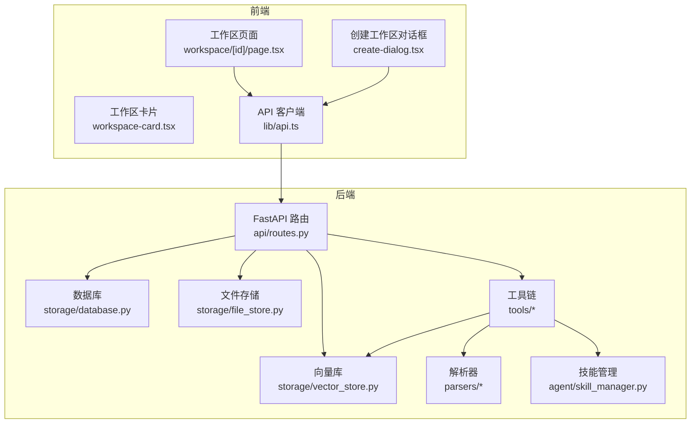
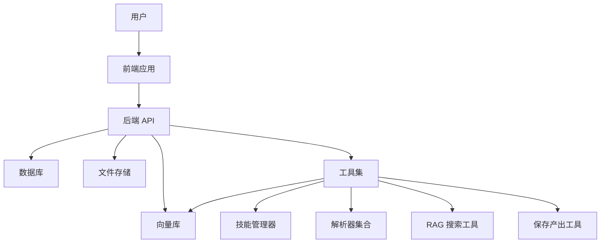
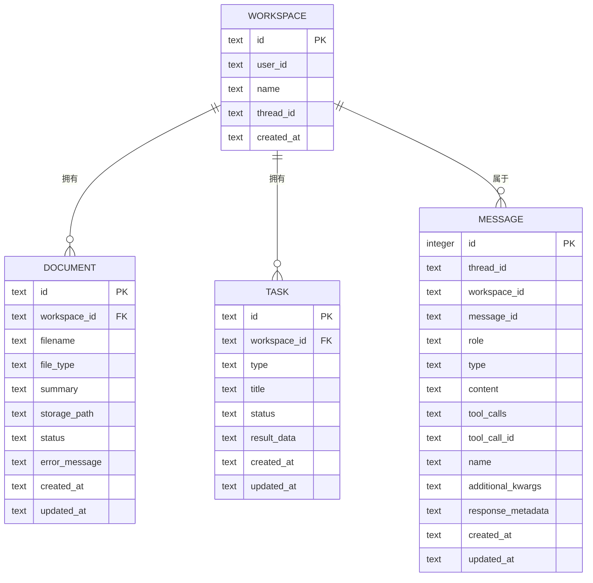
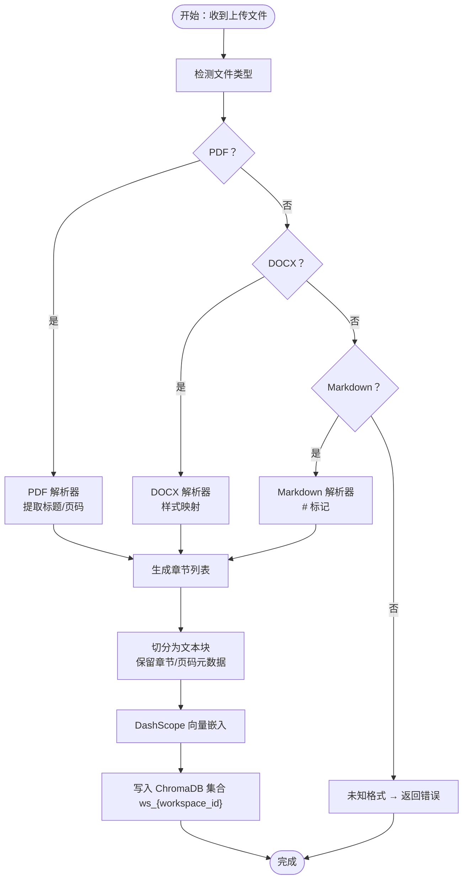
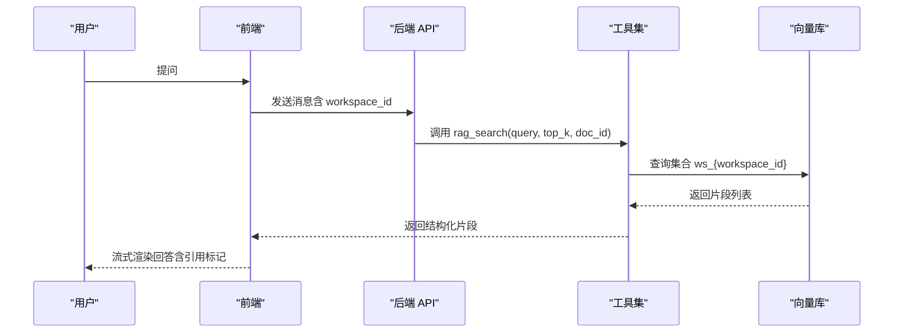
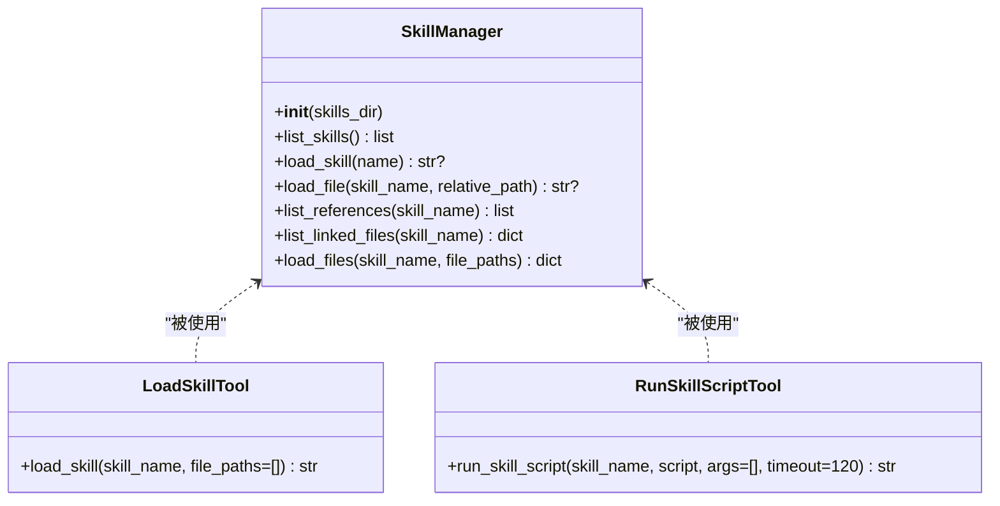
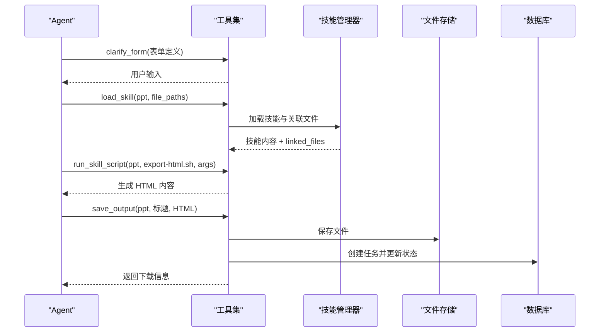
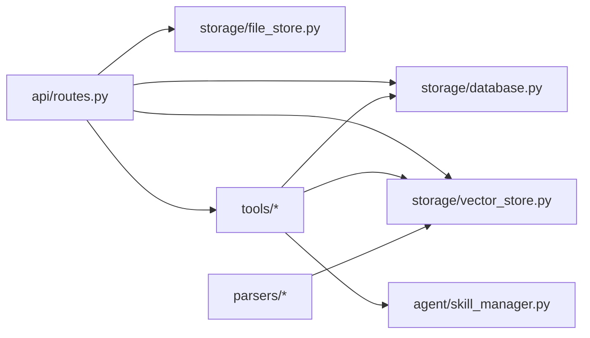

# 核心功能详解

<cite>
**本文引用的文件**
- [backend/src/agent/skill_manager.py](file://backend/src/agent/skill_manager.py)
- [backend/src/agent/prompt_manager.py](file://backend/src/agent/prompt_manager.py)
- [backend/src/tools/load_skill.py](file://backend/src/tools/load_skill.py)
- [backend/src/tools/run_skill_script.py](file://backend/src/tools/run_skill_script.py)
- [backend/src/tools/save_output.py](file://backend/src/tools/save_output.py)
- [backend/src/tools/rag_search.py](file://backend/src/tools/rag_search.py)
- [backend/src/tools/clarify_form.py](file://backend/src/tools/clarify_form.py)
- [backend/src/storage/vector_store.py](file://backend/src/storage/vector_store.py)
- [backend/src/storage/database.py](file://backend/src/storage/database.py)
- [backend/src/storage/file_store.py](file://backend/src/storage/file_store.py)
- [backend/src/parsers/base.py](file://backend/src/parsers/base.py)
- [backend/src/parsers/pdf_parser.py](file://backend/src/parsers/pdf_parser.py)
- [backend/src/parsers/docx_parser.py](file://backend/src/parsers/docx_parser.py)
- [backend/src/parsers/markdown_parser.py](file://backend/src/parsers/markdown_parser.py)
- [backend/src/api/routes.py](file://backend/src/api/routes.py)
- [backend/langgraph.json](file://backend/langgraph.json)
- [backend/pyproject.toml](file://backend/pyproject.toml)
- [backend/uv.lock](file://backend/uv.lock)
- [backend/README.md](file://backend/README.md)
- [docs/backend-architecture.md](file://docs/backend-architecture.md)
- [docs/debug-guides.md](file://docs/debug-guides.md)
- [frontend/src/app/workspace/[id]/page.tsx](file://frontend/src/app/workspace/[id]/page.tsx)
- [frontend/src/components/workspace/create-dialog.tsx](file://frontend/src/components/workspace/create-dialog.tsx)
- [frontend/src/components/workspace/workspace-card.tsx](file://frontend/src/components/workspace/workspace-card.tsx)
- [frontend/src/lib/api.ts](file://frontend/src/lib/api.ts)
- [frontend/src/lib/user.ts](file://frontend/src/lib/user.ts)
- [user-story/04-ppt-command.md](file://user-story/04-ppt-command.md)
- [user-story/07-download-output.md](file://user-story/07-download-output.md)
- [user-story/10-thread-recovery.md](file://user-story/10-thread-recovery.md)
</cite>

## 目录
1. [简介](#简介)
2. [项目结构](#项目结构)
3. [核心组件](#核心组件)
4. [架构总览](#架构总览)
5. [详细组件分析](#详细组件分析)
6. [依赖分析](#依赖分析)
7. [性能考虑](#性能考虑)
8. [故障排除指南](#故障排除指南)
9. [结论](#结论)
10. [附录](#附录)

## 简介
本文件面向 Train Agent 的核心能力，围绕“工作区管理”“文档处理流水线”“智能问答系统”“技能执行平台”“PPT 生成技能”五大主题展开，提供从架构设计到实现细节、从数据流到控制流的全景式说明，并配套使用场景、API 接口、配置选项与故障排除建议，帮助开发者与使用者高效上手并稳定运维。

## 项目结构
后端采用 Python/FastAPI + LangGraph + LangChain Tools 的组合，前端为 Next.js 应用，二者通过 REST API 协作。核心模块包括：
- API 层：提供工作区、文档、任务、文件下载等接口
- 存储层：SQLite（消息、工作区、文档、任务）、文件系统（持久化输出）、向量库（ChromaDB + DashScope 向量模型）
- 处理层：解析器（PDF、DOCX、Markdown）、向量存储、RAG 搜索工具、技能管理与执行工具链
- 前端：工作区页面、对话与任务面板、产物下载与预览

图表来源
- [backend/src/api/routes.py:30-189](file://backend/src/api/routes.py#L30-L189)
- [backend/src/storage/database.py:9-379](file://backend/src/storage/database.py#L9-L379)
- [backend/src/storage/file_store.py:6-39](file://backend/src/storage/file_store.py#L6-L39)
- [backend/src/storage/vector_store.py:39-177](file://backend/src/storage/vector_store.py#L39-L177)
- [backend/src/parsers/pdf_parser.py:17-192](file://backend/src/parsers/pdf_parser.py#L17-L192)
- [backend/src/parsers/docx_parser.py:20-84](file://backend/src/parsers/docx_parser.py#L20-L84)
- [backend/src/parsers/markdown_parser.py:13-62](file://backend/src/parsers/markdown_parser.py#L13-L62)
- [backend/src/tools/load_skill.py:13-116](file://backend/src/tools/load_skill.py#L13-L116)
- [backend/src/tools/run_skill_script.py:31-143](file://backend/src/tools/run_skill_script.py#L31-L143)
- [backend/src/agent/skill_manager.py:14-117](file://backend/src/agent/skill_manager.py#L14-L117)

章节来源
- [backend/src/api/routes.py:30-189](file://backend/src/api/routes.py#L30-L189)
- [frontend/src/app/workspace/[id]/page.tsx](file://frontend/src/app/workspace/[id]/page.tsx)
- [frontend/src/components/workspace/create-dialog.tsx](file://frontend/src/components/workspace/create-dialog.tsx)
- [frontend/src/components/workspace/workspace-card.tsx](file://frontend/src/components/workspace/workspace-card.tsx)
- [frontend/src/lib/api.ts](file://frontend/src/lib/api.ts)

## 核心组件
- 工作区管理：负责工作区的创建、查询、删除与关联线程 ID 更新，确保用户视角的独立空间
- 文档处理流水线：多格式解析（PDF、DOCX、Markdown）→ 结构化切片 → 向量化 → 写入向量库
- 智能问答系统：RAG 检索 → 上下文注入 → 流式响应（由前端驱动）→ 提示词管理
- 技能执行平台：技能注册与发现（SKILL.md 前言）→ 渐进式披露（先列清单，再按需加载）→ 脚本执行（安全沙箱）
- PPT 生成技能：参数收集（表单）→ 内容生成（模板/样式）→ 输出保存与下载

章节来源
- [backend/src/storage/database.py:111-148](file://backend/src/storage/database.py#L111-L148)
- [backend/src/parsers/base.py:6-97](file://backend/src/parsers/base.py#L6-L97)
- [backend/src/storage/vector_store.py:13-177](file://backend/src/storage/vector_store.py#L13-L177)
- [backend/src/tools/rag_search.py:40-76](file://backend/src/tools/rag_search.py#L40-L76)
- [backend/src/agent/prompt_manager.py:1-37](file://backend/src/agent/prompt_manager.py#L1-L37)
- [backend/src/agent/skill_manager.py:14-117](file://backend/src/agent/skill_manager.py#L14-L117)
- [backend/src/tools/load_skill.py:13-116](file://backend/src/tools/load_skill.py#L13-L116)
- [backend/src/tools/run_skill_script.py:31-143](file://backend/src/tools/run_skill_script.py#L31-L143)
- [backend/src/tools/save_output.py:13-99](file://backend/src/tools/save_output.py#L13-L99)

## 架构总览
系统以“工作区”为中心，文档经解析与向量化后进入向量库，问答时通过 RAG 检索结合系统提示词生成结构化回答；技能通过“技能管理器”注册，Agent 以工具形式按需加载与执行，最终通过“保存产出”工具交付给用户。

图表来源
- [backend/src/api/routes.py:30-189](file://backend/src/api/routes.py#L30-L189)
- [backend/src/storage/database.py:9-379](file://backend/src/storage/database.py#L9-L379)
- [backend/src/storage/file_store.py:6-39](file://backend/src/storage/file_store.py#L6-L39)
- [backend/src/storage/vector_store.py:39-177](file://backend/src/storage/vector_store.py#L39-L177)
- [backend/src/tools/rag_search.py:40-76](file://backend/src/tools/rag_search.py#L40-L76)
- [backend/src/tools/save_output.py:61-99](file://backend/src/tools/save_output.py#L61-L99)
- [backend/src/agent/skill_manager.py:14-117](file://backend/src/agent/skill_manager.py#L14-L117)

## 详细组件分析

### 工作区管理系统
- 设计要点
  - 工作区作为用户隔离边界，所有文档、任务、消息均绑定 workspace_id
  - 支持创建、列出、查询、删除；删除时级联清理向量库与文件系统中的工作区目录
  - 支持更新工作区关联的线程 ID，便于消息历史恢复
- 关键接口
  - POST /api/workspaces：创建
  - GET /api/workspaces：按用户列出
  - GET /api/workspaces/{workspace_id}：查询详情
  - PATCH /api/workspaces/{workspace_id}/thread：更新 thread_id
  - DELETE /api/workspaces/{workspace_id}：删除工作区（含文档、向量、文件）
- 数据模型
  - workspace：id、user_id、name、thread_id、时间戳
  - document：id、workspace_id、filename、file_type、status、存储路径、时间戳
  - task：id、workspace_id、type、title、status、结果数据、时间戳
  - message：线程消息记录，含工具调用元数据

图表来源
- [backend/src/storage/database.py:25-76](file://backend/src/storage/database.py#L25-L76)
- [backend/src/storage/database.py:111-148](file://backend/src/storage/database.py#L111-L148)
- [backend/src/storage/database.py:285-311](file://backend/src/storage/database.py#L285-L311)
- [backend/src/storage/database.py:342-357](file://backend/src/storage/database.py#L342-L357)

章节来源
- [backend/src/api/routes.py:45-106](file://backend/src/api/routes.py#L45-L106)
- [backend/src/storage/database.py:111-148](file://backend/src/storage/database.py#L111-L148)
- [backend/src/storage/database.py:285-311](file://backend/src/storage/database.py#L285-L311)
- [backend/src/storage/database.py:342-357](file://backend/src/storage/database.py#L342-L357)

### 文档处理流水线
- 多格式解析
  - PDF：基于 PyMuPDF 提取文本块，启发式识别标题层级与页码，降级为按页切分
  - DOCX：基于段落样式映射标题级别
  - Markdown：基于 # 标记提取章节
- 结构化处理
  - 将解析得到的章节切分为固定上限的文本块，保留章节、页码、层级元数据
- 向量化索引
  - 使用 DashScope 文本嵌入模型生成向量，写入 ChromaDB，集合命名 ws_{workspace_id}
- 异步处理机制
  - 上传即触发后台任务，异步执行解析与向量化，避免阻塞请求

图表来源
- [backend/src/parsers/pdf_parser.py:17-192](file://backend/src/parsers/pdf_parser.py#L17-L192)
- [backend/src/parsers/docx_parser.py:20-84](file://backend/src/parsers/docx_parser.py#L20-L84)
- [backend/src/parsers/markdown_parser.py:13-62](file://backend/src/parsers/markdown_parser.py#L13-L62)
- [backend/src/parsers/base.py:47-97](file://backend/src/parsers/base.py#L47-L97)
- [backend/src/storage/vector_store.py:13-37](file://backend/src/storage/vector_store.py#L13-L37)
- [backend/src/storage/vector_store.py:91-122](file://backend/src/storage/vector_store.py#L91-L122)
- [backend/src/api/routes.py:112-128](file://backend/src/api/routes.py#L112-L128)

章节来源
- [backend/src/parsers/pdf_parser.py:17-192](file://backend/src/parsers/pdf_parser.py#L17-L192)
- [backend/src/parsers/docx_parser.py:20-84](file://backend/src/parsers/docx_parser.py#L20-L84)
- [backend/src/parsers/markdown_parser.py:13-62](file://backend/src/parsers/markdown_parser.py#L13-L62)
- [backend/src/parsers/base.py:47-97](file://backend/src/parsers/base.py#L47-L97)
- [backend/src/storage/vector_store.py:91-122](file://backend/src/storage/vector_store.py#L91-L122)
- [backend/src/api/routes.py:112-128](file://backend/src/api/routes.py#L112-L128)

### 智能问答系统
- RAG 检索机制
  - 工具接收查询、top_k、可选 doc_id，按 workspace_id 查询集合，支持限定文档范围
  - 结果包含文档名、章节/页码定位信息与文本片段
- 上下文注入
  - 系统提示词明确要求在引用处附加结构化标记，规范引用位置与格式
- 流式响应
  - 由前端 LangGraph 组件驱动，后端工具返回片段，前端逐步渲染
- 提示词管理
  - 统一的系统提示词集中管理，约束回答风格、引用规范与技能使用

图表来源
- [backend/src/tools/rag_search.py:40-76](file://backend/src/tools/rag_search.py#L40-L76)
- [backend/src/storage/vector_store.py:124-163](file://backend/src/storage/vector_store.py#L124-L163)
- [backend/src/agent/prompt_manager.py:1-37](file://backend/src/agent/prompt_manager.py#L1-L37)

章节来源
- [backend/src/tools/rag_search.py:40-76](file://backend/src/tools/rag_search.py#L40-L76)
- [backend/src/storage/vector_store.py:124-163](file://backend/src/storage/vector_store.py#L124-L163)
- [backend/src/agent/prompt_manager.py:1-37](file://backend/src/agent/prompt_manager.py#L1-L37)

### 技能执行平台
- 技能注册流程
  - 在 skills/{skill_name}/SKILL.md 中以 YAML frontmatter 声明 name/description
  - SkillManager 扫描目录，构建技能清单
- 渐进式披露机制
  - Agent 通过 load_skill 工具查看可用技能与“关联文件”（references/templates/scripts/assets）
  - 需要时才按需批量加载文件，避免一次性暴露全部资源
- 自定义技能开发
  - 在技能目录下放置 references/scripts/assets，遵循相对路径限制与安全校验
  - 通过 run_skill_script 工具在受控环境中执行脚本（.sh/.py/.js/.ts）

图表来源
- [backend/src/agent/skill_manager.py:14-117](file://backend/src/agent/skill_manager.py#L14-L117)
- [backend/src/tools/load_skill.py:13-116](file://backend/src/tools/load_skill.py#L13-L116)
- [backend/src/tools/run_skill_script.py:31-143](file://backend/src/tools/run_skill_script.py#L31-L143)

章节来源
- [backend/src/agent/skill_manager.py:14-117](file://backend/src/agent/skill_manager.py#L14-L117)
- [backend/src/tools/load_skill.py:13-116](file://backend/src/tools/load_skill.py#L13-L116)
- [backend/src/tools/run_skill_script.py:31-143](file://backend/src/tools/run_skill_script.py#L31-L143)

### PPT 生成技能（实现细节）
- 参数收集
  - 使用 clarify_form 工具弹出交互表单，收集主题、风格、目标受众等参数
- 内容生成
  - 加载技能提示与模板/样式资源，生成自包含 HTML 幻灯片
- 样式定制
  - 通过 references/style-presets.md 等资源注入样式，支持主题切换
- 输出管理
  - 通过 save_output 工具保存为 HTML 文件，记录任务并返回下载链接

图表来源
- [backend/src/tools/clarify_form.py:24-46](file://backend/src/tools/clarify_form.py#L24-L46)
- [backend/src/tools/load_skill.py:13-116](file://backend/src/tools/load_skill.py#L13-L116)
- [backend/src/tools/run_skill_script.py:31-143](file://backend/src/tools/run_skill_script.py#L31-L143)
- [backend/src/tools/save_output.py:61-99](file://backend/src/tools/save_output.py#L61-L99)
- [backend/src/agent/skill_manager.py:63-92](file://backend/src/agent/skill_manager.py#L63-L92)

章节来源
- [backend/src/tools/clarify_form.py:24-46](file://backend/src/tools/clarify_form.py#L24-L46)
- [backend/src/tools/load_skill.py:13-116](file://backend/src/tools/load_skill.py#L13-L116)
- [backend/src/tools/run_skill_script.py:31-143](file://backend/src/tools/run_skill_script.py#L31-L143)
- [backend/src/tools/save_output.py:61-99](file://backend/src/tools/save_output.py#L61-L99)
- [backend/src/agent/skill_manager.py:63-92](file://backend/src/agent/skill_manager.py#L63-L92)
- [user-story/04-ppt-command.md](file://user-story/04-ppt-command.md)
- [user-story/07-download-output.md](file://user-story/07-download-output.md)

## 依赖分析
- 外部依赖
  - 向量模型：DashScope 文本嵌入（可通过环境变量配置）
  - 向量库：ChromaDB（持久化客户端）
  - 文档解析：PyMuPDF、python-docx、langchain-text-splitters
  - Web 框架：FastAPI、CORS、静态文件挂载
- 内部耦合
  - API 路由依赖数据库、文件存储、向量库、文档服务与技能管理器
  - 工具链依赖技能管理器与向量库，部分工具依赖数据库（任务记录）
  - 解析器与向量库解耦，便于替换与扩展

图表来源
- [backend/src/api/routes.py:10-11](file://backend/src/api/routes.py#L10-L11)
- [backend/src/tools/rag_search.py:5-6](file://backend/src/tools/rag_search.py#L5-L6)
- [backend/src/tools/save_output.py:6-8](file://backend/src/tools/save_output.py#L6-L8)
- [backend/src/agent/skill_manager.py:8](file://backend/src/agent/skill_manager.py#L8)

章节来源
- [backend/src/api/routes.py:10-11](file://backend/src/api/routes.py#L10-L11)
- [backend/src/tools/rag_search.py:5-6](file://backend/src/tools/rag_search.py#L5-L6)
- [backend/src/tools/save_output.py:6-8](file://backend/src/tools/save_output.py#L6-L8)
- [backend/src/agent/skill_manager.py:8](file://backend/src/agent/skill_manager.py#L8)

## 性能考虑
- 向量检索
  - 使用 cosine 距离与合适的 top_k，避免过度召回导致上下文膨胀
  - 对超长输出进行截断，防止上下文溢出
- 文档解析
  - PDF/DOCX 解析涉及磁盘与内存读取，建议在上传后异步处理
  - 切分策略采用递归字符分割，兼顾语义完整性与性能
- I/O 与并发
  - 文件写入封装为异步线程调用，减少阻塞
  - 脚本执行设置超时，避免长时间占用进程

## 故障排除指南
- 向量搜索异常
  - 现象：检索失败或无结果
  - 排查：确认集合是否存在、查询是否传入正确的 workspace_id 与 doc_id
  - 参考
    - [backend/src/storage/vector_store.py:138-143](file://backend/src/storage/vector_store.py#L138-L143)
    - [backend/src/tools/rag_search.py:55-64](file://backend/src/tools/rag_search.py#L55-L64)
- 技能加载失败
  - 现象：技能不存在或文件缺失
  - 排查：确认 SKILL.md 是否存在、file_paths 是否在技能目录内且未越权
  - 参考
    - [backend/src/tools/load_skill.py:63-74](file://backend/src/tools/load_skill.py#L63-L74)
    - [backend/src/agent/skill_manager.py:72-82](file://backend/src/agent/skill_manager.py#L72-L82)
- 脚本执行超时或失败
  - 现象：脚本执行超时或返回非零退出码
  - 排查：检查脚本类型映射、工作目录、参数传递与日志输出
  - 参考
    - [backend/src/tools/run_skill_script.py:108-140](file://backend/src/tools/run_skill_script.py#L108-L140)
- 上传后未生成向量
  - 现象：文档已上传但无法检索
  - 排查：确认后台任务是否执行、解析器是否支持该格式、集合是否创建
  - 参考
    - [backend/src/api/routes.py:126](file://backend/src/api/routes.py#L126)
    - [backend/src/storage/vector_store.py:44-49](file://backend/src/storage/vector_store.py#L44-L49)
- PPT 导出失败
  - 现象：导出脚本报错或无输出
  - 排查：确认模板与样式资源存在、脚本参数正确、工作目录权限
  - 参考
    - [backend/src/tools/run_skill_script.py:66-82](file://backend/src/tools/run_skill_script.py#L66-L82)
    - [backend/src/tools/save_output.py:33-58](file://backend/src/tools/save_output.py#L33-L58)

章节来源
- [backend/src/storage/vector_store.py:138-143](file://backend/src/storage/vector_store.py#L138-L143)
- [backend/src/tools/rag_search.py:55-64](file://backend/src/tools/rag_search.py#L55-L64)
- [backend/src/tools/load_skill.py:63-74](file://backend/src/tools/load_skill.py#L63-L74)
- [backend/src/agent/skill_manager.py:72-82](file://backend/src/agent/skill_manager.py#L72-L82)
- [backend/src/tools/run_skill_script.py:108-140](file://backend/src/tools/run_skill_script.py#L108-L140)
- [backend/src/api/routes.py:126](file://backend/src/api/routes.py#L126)
- [backend/src/storage/vector_store.py:44-49](file://backend/src/storage/vector_store.py#L44-L49)
- [backend/src/tools/run_skill_script.py:66-82](file://backend/src/tools/run_skill_script.py#L66-L82)
- [backend/src/tools/save_output.py:33-58](file://backend/src/tools/save_output.py#L33-L58)

## 结论
本系统以“工作区”为边界，结合多格式文档解析、结构化切片与向量化索引，构建了可靠的 RAG 基础设施；通过技能管理与工具链，实现了可扩展的智能体执行平台；前端以流式渲染与产物管理提升用户体验。整体设计强调隔离、安全与可维护性，适合在企业培训与知识管理场景中规模化落地。

## 附录

### 使用场景与 API 一览
- 工作区管理
  - 创建：POST /api/workspaces
  - 列表：GET /api/workspaces?user_id=...
  - 查询：GET /api/workspaces/{workspace_id}
  - 删除：DELETE /api/workspaces/{workspace_id}
  - 关联线程：PATCH /api/workspaces/{workspace_id}/thread
- 文档处理
  - 上传：POST /api/workspaces/{workspace_id}/documents
  - 列表：GET /api/workspaces/{workspace_id}/documents
  - 删除：DELETE /api/workspaces/{workspace_id}/documents/{doc_id}
- 任务与产物
  - 列表：GET /api/workspaces/{workspace_id}/tasks
  - 删除：DELETE /api/workspaces/{workspace_id}/tasks/{task_id}
  - 下载：GET /api/files/{file_path}
- 智能问答
  - RAG 检索：工具 rag_search（由 Agent 调用）
- 技能与脚本
  - 加载技能：工具 load_skill（由 Agent 调用）
  - 执行脚本：工具 run_skill_script（由 Agent 调用）
  - 保存产物：工具 save_output（由 Agent 调用）

章节来源
- [backend/src/api/routes.py:45-157](file://backend/src/api/routes.py#L45-L157)
- [backend/src/tools/rag_search.py:40-76](file://backend/src/tools/rag_search.py#L40-L76)
- [backend/src/tools/load_skill.py:13-116](file://backend/src/tools/load_skill.py#L13-L116)
- [backend/src/tools/run_skill_script.py:31-143](file://backend/src/tools/run_skill_script.py#L31-L143)
- [backend/src/tools/save_output.py:61-99](file://backend/src/tools/save_output.py#L61-L99)

### 配置选项
- 向量嵌入
  - EMBEDDING_MODEL：嵌入模型名称（默认：text-embedding-v2）
  - EMBEDDING_API_KEY：DashScope API Key
  - EMBEDDING_API_BASE：DashScope Base URL
- 向量库
  - ChromaDB 持久化目录：ws_{workspace_id} 集合
- 其他
  - CORS：允许跨域访问
  - PPT 静态资源挂载：/ppt-assets、/ppt-templates

章节来源
- [backend/src/storage/vector_store.py:16-26](file://backend/src/storage/vector_store.py#L16-L26)
- [backend/src/api/routes.py:177-189](file://backend/src/api/routes.py#L177-L189)