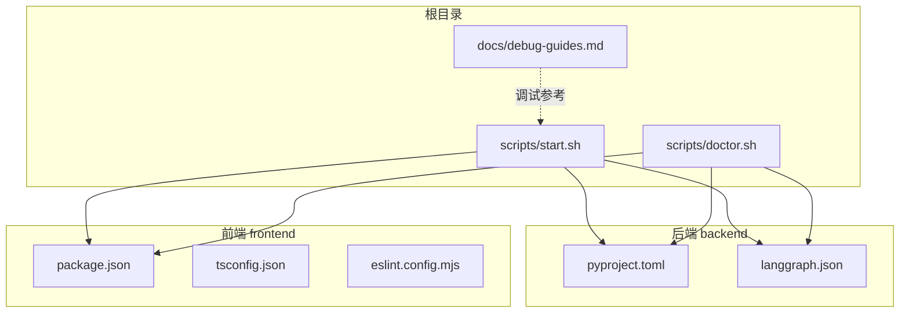
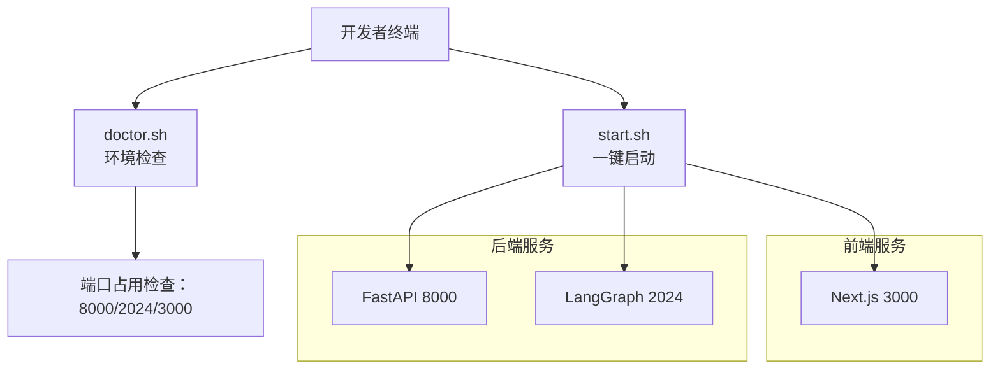
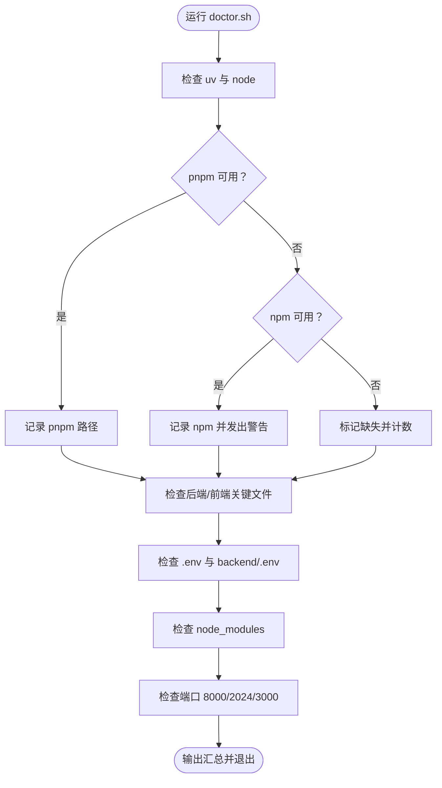
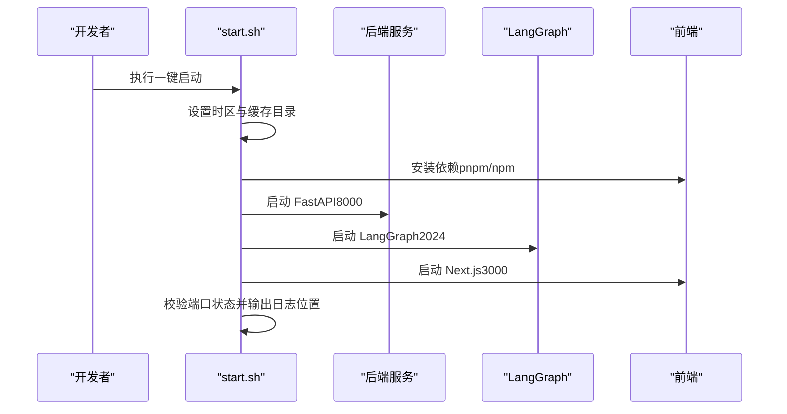

# 开发环境搭建

<cite>
**本文引用的文件**
- [README.md](file://README.md)
- [scripts/doctor.sh](file://scripts/doctor.sh)
- [scripts/start.sh](file://scripts/start.sh)
- [backend/pyproject.toml](file://backend/pyproject.toml)
- [backend/langgraph.json](file://backend/langgraph.json)
- [frontend/package.json](file://frontend/package.json)
- [frontend/tsconfig.json](file://frontend/tsconfig.json)
- [frontend/eslint.config.mjs](file://frontend/eslint.config.mjs)
- [docs/debug-guides.md](file://docs/debug-guides.md)
- [plans/2026-05-27-train-agent-implementation.md](file://plans/2026-05-27-train-agent-implementation.md)
</cite>

## 目录
1. [简介](#简介)
2. [项目结构](#项目结构)
3. [核心组件](#核心组件)
4. [架构总览](#架构总览)
5. [详细组件分析](#详细组件分析)
6. [依赖分析](#依赖分析)
7. [性能考虑](#性能考虑)
8. [故障排查指南](#故障排查指南)
9. [结论](#结论)
10. [附录](#附录)

## 简介
本指南面向首次参与 Train Agent 项目的开发者，提供从零到一的本地开发环境搭建路径。内容覆盖系统要求与前置条件（Python、Node.js、uv 包管理器）、后端与前端依赖安装、环境变量配置、开发工具链（IDE、调试、代码格式化）以及一键环境检查脚本 doctor.sh 的使用与故障诊断流程。

## 项目结构
项目采用前后端分离架构，包含后端 Python 服务（FastAPI + LangGraph）、前端 Next.js 应用，以及一组用于本地开发生命周期控制的脚本。

图表来源
- [scripts/start.sh:1-128](file://scripts/start.sh#L1-L128)
- [scripts/doctor.sh:1-99](file://scripts/doctor.sh#L1-L99)
- [backend/pyproject.toml:1-41](file://backend/pyproject.toml#L1-L41)
- [backend/langgraph.json:1-9](file://backend/langgraph.json#L1-L9)
- [frontend/package.json:1-39](file://frontend/package.json#L1-L39)
- [frontend/tsconfig.json:1-35](file://frontend/tsconfig.json#L1-L35)
- [frontend/eslint.config.mjs:1-19](file://frontend/eslint.config.mjs#L1-L19)
- [docs/debug-guides.md:1-44](file://docs/debug-guides.md#L1-L44)

章节来源
- [README.md:1-133](file://README.md#L1-L133)
- [scripts/start.sh:1-128](file://scripts/start.sh#L1-L128)
- [scripts/doctor.sh:1-99](file://scripts/doctor.sh#L1-L99)
- [backend/pyproject.toml:1-41](file://backend/pyproject.toml#L1-L41)
- [backend/langgraph.json:1-9](file://backend/langgraph.json#L1-L9)
- [frontend/package.json:1-39](file://frontend/package.json#L1-L39)
- [frontend/tsconfig.json:1-35](file://frontend/tsconfig.json#L1-L35)
- [frontend/eslint.config.mjs:1-19](file://frontend/eslint.config.mjs#L1-L19)
- [docs/debug-guides.md:1-44](file://docs/debug-guides.md#L1-L44)

## 核心组件
- 后端服务
  - 运行时与框架：Python >= 3.12；FastAPI；LangGraph
  - 包管理：uv（推荐），支持 lock 文件与增量同步
  - 存储：SQLite（aiosqlite）、向量数据库（ChromaDB）
- 前端应用
  - 框架：Next.js 16.2.6（React 19）
  - 构建与类型：TypeScript 5；TailwindCSS 4
  - 代码质量：ESLint（Next.js 规则集）
- 开发脚本
  - doctor.sh：环境与依赖健康检查
  - start.sh：一键启动后端 API（8000）、LangGraph（2024）、前端（3000）

章节来源
- [backend/pyproject.toml:1-41](file://backend/pyproject.toml#L1-L41)
- [backend/langgraph.json:1-9](file://backend/langgraph.json#L1-L9)
- [frontend/package.json:1-39](file://frontend/package.json#L1-L39)
- [frontend/tsconfig.json:1-35](file://frontend/tsconfig.json#L1-L35)
- [frontend/eslint.config.mjs:1-19](file://frontend/eslint.config.mjs#L1-L19)
- [scripts/doctor.sh:1-99](file://scripts/doctor.sh#L1-L99)
- [scripts/start.sh:1-128](file://scripts/start.sh#L1-L128)

## 架构总览
下图展示本地开发栈的服务关系与端口占用情况，便于理解各组件职责与启动顺序。

图表来源
- [scripts/start.sh:85-127](file://scripts/start.sh#L85-L127)
- [scripts/doctor.sh:83-90](file://scripts/doctor.sh#L83-L90)

章节来源
- [README.md:7-13](file://README.md#L7-L13)
- [scripts/start.sh:1-128](file://scripts/start.sh#L1-L128)
- [scripts/doctor.sh:1-99](file://scripts/doctor.sh#L1-L99)

## 详细组件分析

### 系统要求与前置条件
- Python
  - 最低版本：3.12（由后端配置与 LangGraph JSON 指定）
  - 建议使用版本管理器（如 pyenv 或 asdf）固定版本
- Node.js
  - 必需：Node.js 运行时（由前端 Next.js 与脚本使用）
  - pnpm 10+ 需要 Node.js v22+；脚本内置对 nvm 的检测与自动切换逻辑
- 包管理器
  - 后端：uv（推荐，支持 lock 文件与快速同步）
  - 前端：pnpm 或 npm（脚本会优先 pnpm，否则回退 npm）

章节来源
- [backend/langgraph.json:2](file://backend/langgraph.json#L2)
- [backend/pyproject.toml:5](file://backend/pyproject.toml#L5)
- [scripts/start.sh:70-79](file://scripts/start.sh#L70-L79)
- [scripts/doctor.sh:30-41](file://scripts/doctor.sh#L30-L41)

### 依赖安装流程
- 后端 Python 依赖
  - 使用 uv 安装：在 backend 目录执行同步命令
  - 可选开发依赖：测试与静态检查工具
- 前端 Node.js 依赖
  - 在 frontend 目录执行安装（优先 pnpm，其次 npm）
  - TypeScript、ESLint、TailwindCSS 等开发依赖随 package.json 管理

章节来源
- [backend/pyproject.toml:28-29](file://backend/pyproject.toml#L28-L29)
- [backend/pyproject.toml:31-33](file://backend/pyproject.toml#L31-L33)
- [frontend/package.json:27-37](file://frontend/package.json#L27-L37)
- [README.md:113-122](file://README.md#L113-L122)

### 环境变量配置
- 复制示例文件生成实际配置
  - 根目录与后端目录均提供示例文件，按需复制并填写密钥
- 关键变量
  - 模型与网关：DASHSCOPE_API_KEY、OPENAI_API_BASE、LLM_MODEL、EMBEDDING_MODEL
  - 数据目录：DATA_DIR（默认 ./data）
  - 前端 API 地址：NEXT_PUBLIC_API_BASE、NEXT_PUBLIC_LANGGRAPH_API_URL
- 时区与缓存
  - 脚本统一设置时区为 Asia/Shanghai，并指定 uv 缓存目录

章节来源
- [README.md:45-61](file://README.md#L45-L61)
- [README.md:109-114](file://README.md#L109-L114)
- [scripts/start.sh:10-11](file://scripts/start.sh#L10-L11)
- [plans/2026-05-27-train-agent-implementation.md:79-86](file://plans/2026-05-27-train-agent-implementation.md#L79-L86)

### 开发工具链
- IDE 设置建议
  - 启用 TypeScript 严格模式与 ESLint 规则
  - 配置路径别名 @/* 对应 src/*
- 调试配置
  - 后端：通过 uv 运行器启动 FastAPI 与 LangGraph
  - 前端：Next.js 开发服务器，支持热重载
- 代码格式化与检查
  - ESLint（基于 Next.js 规则集）
  - TypeScript 类型检查与构建

章节来源
- [frontend/tsconfig.json:21-23](file://frontend/tsconfig.json#L21-L23)
- [frontend/eslint.config.mjs:1-19](file://frontend/eslint.config.mjs#L1-L19)
- [scripts/start.sh:56-81](file://scripts/start.sh#L56-L81)

### 一键环境检查 doctor.sh
doctor.sh 提供以下检查项：
- 工具链：uv、node 是否存在
- 包管理器：优先 pnpm，否则回退 npm
- 项目文件：后端 pyproject.toml、langgraph.json，前端 package.json 是否存在
- 环境文件：根目录与后端 .env 是否存在
- 前端依赖：node_modules 是否存在
- 端口占用：8000、2024、3000 是否被占用

图表来源
- [scripts/doctor.sh:20-90](file://scripts/doctor.sh#L20-L90)

章节来源
- [scripts/doctor.sh:1-99](file://scripts/doctor.sh#L1-L99)

### 启动与验证（start.sh）
- 自动设置时区与 uv 缓存目录
- 自动安装前端依赖（优先 pnpm，否则 npm）
- 分别启动后端 API（8000）、LangGraph（2024）、前端（3000）
- 启动后进行端口状态校验，失败时打印最近日志片段

图表来源
- [scripts/start.sh:10-81](file://scripts/start.sh#L10-L81)
- [scripts/start.sh:85-127](file://scripts/start.sh#L85-L127)

章节来源
- [scripts/start.sh:1-128](file://scripts/start.sh#L1-L128)

## 依赖分析
- 后端依赖
  - 核心：FastAPI、Uvicorn、LangChain/LangGraph 生态、DashScope、ChromaDB、aiosqlite、解析库（docx、pdf）
  - 开发：pytest、pytest-asyncio、ruff
- 前端依赖
  - 核心：Next.js、React、@langchain/* 生态、辅助 UI 组件
  - 开发：ESLint、TypeScript、TailwindCSS

章节来源
- [backend/pyproject.toml:6-26](file://backend/pyproject.toml#L6-L26)
- [backend/pyproject.toml:28-29](file://backend/pyproject.toml#L28-L29)
- [frontend/package.json:11-26](file://frontend/package.json#L11-L26)
- [frontend/package.json:27-37](file://frontend/package.json#L27-L37)

## 性能考虑
- 使用 uv 进行后端依赖同步，提升安装速度与确定性
- 前端优先使用 pnpm，减少磁盘占用与安装时间
- 合理配置 DATA_DIR 与缓存目录，避免不必要的 IO 抖动
- 在本地开发中启用 TypeScript 严格模式与 ESLint，提前发现潜在性能与可维护性问题

## 故障排查指南
- Node.js 版本兼容性
  - pnpm 10+ 需要 Node.js v22+；脚本内置 nvm 检测与自动切换逻辑
  - 若遇到动态导入相关错误，优先确保 Node 版本满足要求
- 包管理器选择
  - 优先使用 pnpm；若未安装，脚本会回退到 npm
- 依赖冲突与安装失败
  - 清理缓存后重试（uv cache clean）
  - 更新锁文件或删除 lock 文件后重新同步
- 端口占用
  - doctor.sh 会提示端口占用；根据需要释放或调整端口
- 日志定位
  - 后端、LangGraph、前端日志分别位于 logs 下对应文件
  - debug-guides.md 提供了调试产物的存放规范与浏览器自动化辅助工具的基本用法

章节来源
- [scripts/start.sh:70-79](file://scripts/start.sh#L70-L79)
- [scripts/doctor.sh:83-90](file://scripts/doctor.sh#L83-L90)
- [docs/debug-guides.md:1-44](file://docs/debug-guides.md#L1-L44)

## 结论
按照本指南完成系统要求、依赖安装与环境变量配置后，即可通过 doctor.sh 与 start.sh 快速完成本地开发环境的搭建与验证。建议在开发过程中持续关注日志与端口状态，结合 ESLint 与 TypeScript 严格模式提升代码质量与可维护性。

## 附录
- 常用命令速查
  - 复制环境示例文件：在根目录与 backend 目录分别复制 .env.example 为 .env
  - 后端安装：在 backend 目录执行 uv 同步
  - 前端安装：在 frontend 目录执行 pnpm 或 npm 安装
  - 环境检查：执行 doctor.sh
  - 一键启动：执行 start.sh
  - 后端测试：在 backend 目录使用 uv 运行 pytest
  - 前端检查：在 frontend 目录执行 lint 与 build

章节来源
- [README.md:45-122](file://README.md#L45-L122)
- [scripts/doctor.sh:1-99](file://scripts/doctor.sh#L1-L99)
- [scripts/start.sh:1-128](file://scripts/start.sh#L1-L128)