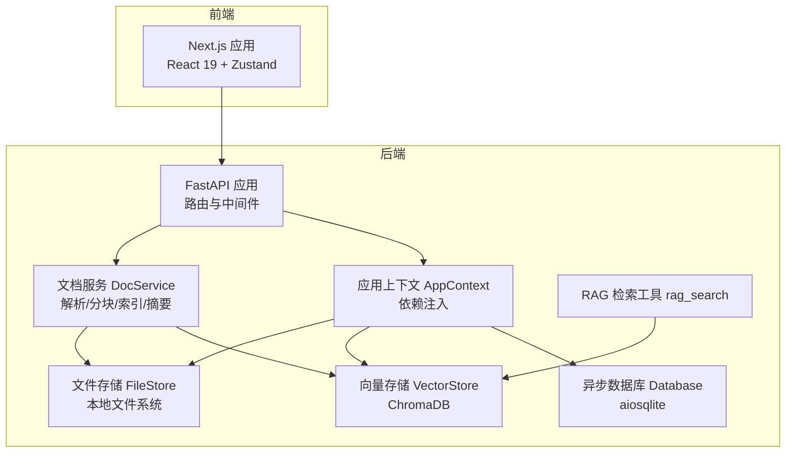
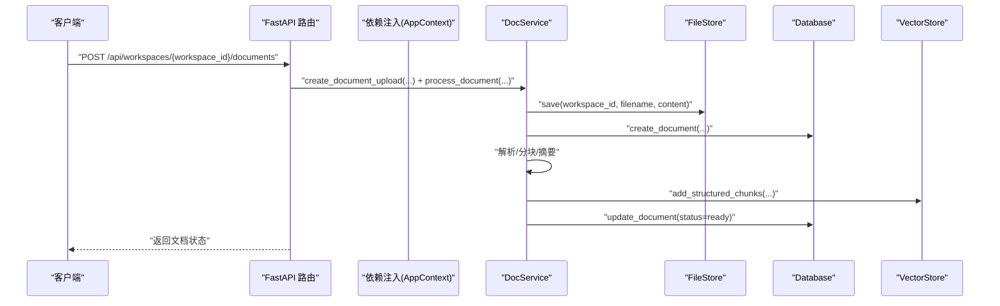
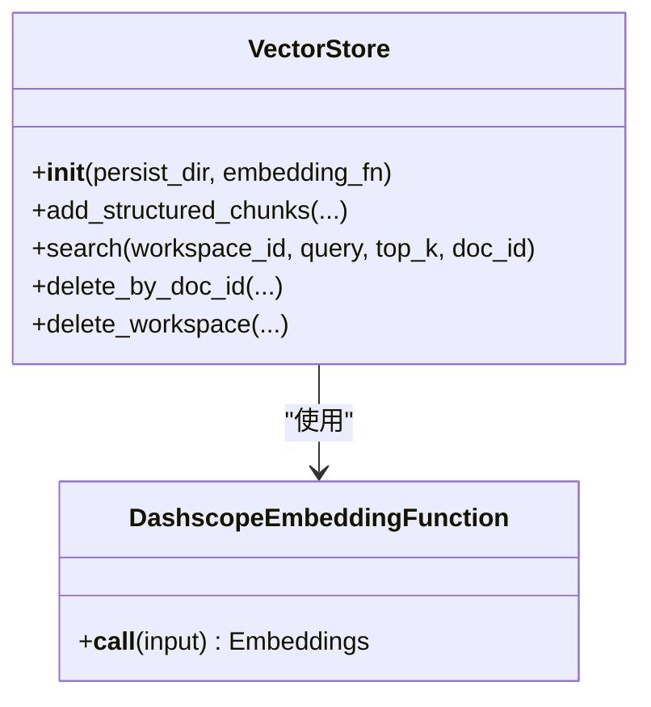
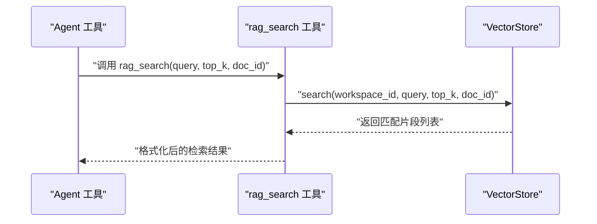
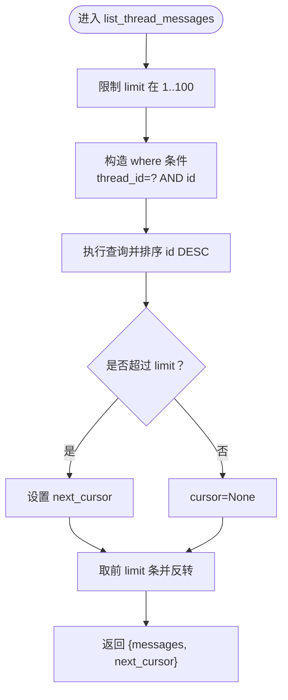
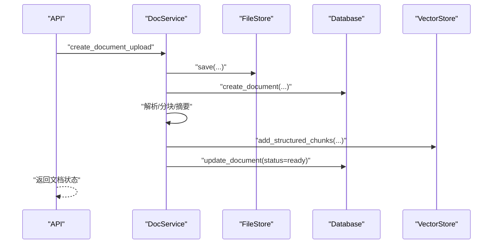
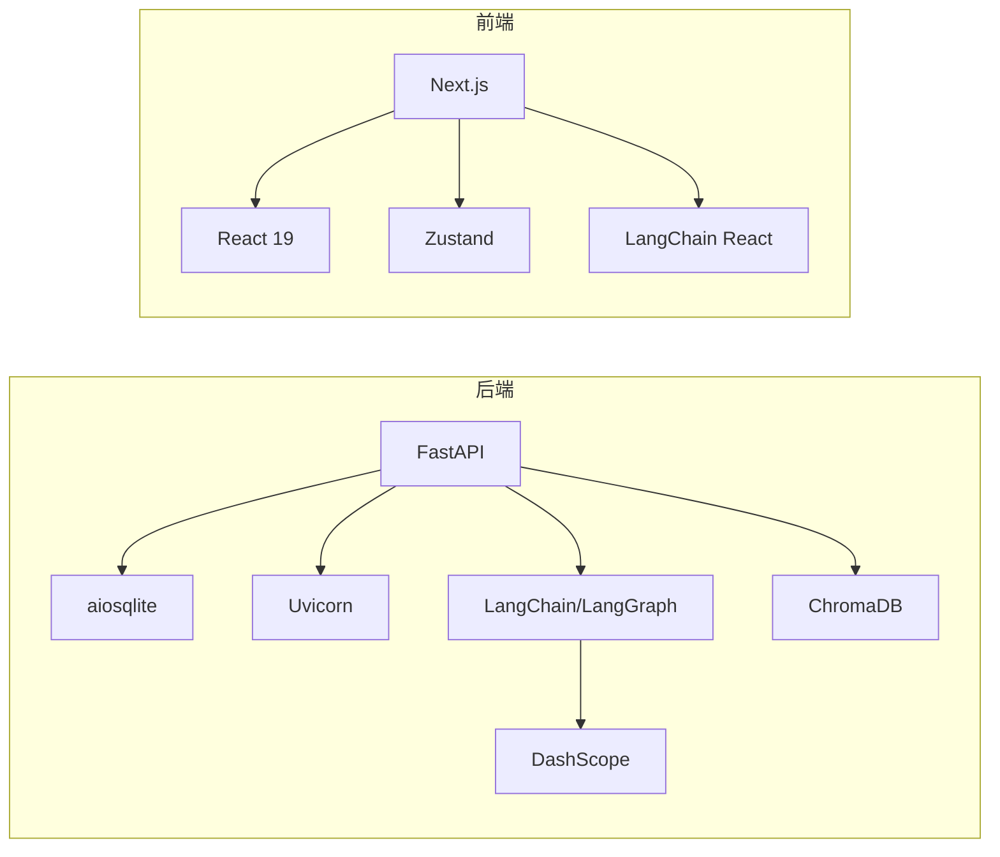

# 性能优化

<cite>
**本文引用的文件**
- [backend/src/storage/vector_store.py](file://backend/src/storage/vector_store.py)
- [backend/src/storage/database.py](file://backend/src/storage/database.py)
- [backend/src/storage/file_store.py](file://backend/src/storage/file_store.py)
- [backend/src/services/doc_service.py](file://backend/src/services/doc_service.py)
- [backend/src/tools/rag_search.py](file://backend/src/tools/rag_search.py)
- [backend/src/api/routes.py](file://backend/src/api/routes.py)
- [backend/src/api/deps.py](file://backend/src/api/deps.py)
- [backend/src/app_context.py](file://backend/src/app_context.py)
- [backend/src/middlewares/logging_middlewares.py](file://backend/src/middlewares/logging_middlewares.py)
- [backend/pyproject.toml](file://backend/pyproject.toml)
- [frontend/package.json](file://frontend/package.json)
- [frontend/next.config.ts](file://frontend/next.config.ts)
</cite>

## 目录
1. [简介](#简介)
2. [项目结构](#项目结构)
3. [核心组件](#核心组件)
4. [架构总览](#架构总览)
5. [详细组件分析](#详细组件分析)
6. [依赖分析](#依赖分析)
7. [性能考虑](#性能考虑)
8. [故障排查指南](#故障排查指南)
9. [结论](#结论)
10. [附录](#附录)

## 简介
本指南面向 Train Agent 后端与前端，围绕“缓存策略、数据库性能、内存管理、并发控制、向量数据库优化、前端性能、性能测试”等主题，结合现有代码实现给出可操作的优化建议与最佳实践。目标是在保证功能正确性的前提下，提升吞吐、降低延迟、减少资源占用，并增强稳定性。

## 项目结构
- 后端采用 FastAPI + 异步 SQLite（aiosqlite）+ ChromaDB 向量存储 + 文件系统持久化，配合 LangGraph/LangChain 工具链与中间件。
- 前端基于 Next.js，使用 React 19 与 Zustand 状态管理，具备基础构建与开发脚本。

图表来源
- [backend/src/api/routes.py:21-27](file://backend/src/api/routes.py#L21-L27)
- [backend/src/api/deps.py:13-29](file://backend/src/api/deps.py#L13-L29)
- [backend/src/app_context.py:12-30](file://backend/src/app_context.py#L12-L30)
- [backend/src/storage/database.py:9-13](file://backend/src/storage/database.py#L9-L13)
- [backend/src/storage/vector_store.py:39-42](file://backend/src/storage/vector_store.py#L39-L42)
- [backend/src/storage/file_store.py:6-9](file://backend/src/storage/file_store.py#L6-L9)
- [backend/src/services/doc_service.py:13-24](file://backend/src/services/doc_service.py#L13-L24)
- [backend/src/tools/rag_search.py:40-75](file://backend/src/tools/rag_search.py#L40-L75)

章节来源
- [backend/src/api/routes.py:21-27](file://backend/src/api/routes.py#L21-L27)
- [backend/src/api/deps.py:13-29](file://backend/src/api/deps.py#L13-L29)
- [backend/src/app_context.py:12-30](file://backend/src/app_context.py#L12-L30)

## 核心组件
- 数据库层：异步 SQLite 封装，提供消息、工作区、文档、任务等表；包含外键启用与动态迁移逻辑。
- 向量存储层：基于 ChromaDB 的持久化客户端，支持 cosine 距离空间；嵌入函数通过 DashScope 文本嵌入接口调用。
- 文件存储层：基于本地文件系统的保存/删除/清理能力，提供同步与异步写入路径。
- 文档服务层：负责上传、解析、分块、向量化索引、摘要生成与状态流转。
- API 层：FastAPI 路由与 CORS 中间件；启动时初始化数据库；提供工作区、消息、文档、任务、文件下载等接口。
- 工具层：RAG 检索工具封装向量检索结果格式化输出。
- 日志中间件：LangGraph 中间件钩子，记录 Agent 前后与模型前后调用信息，便于性能观测。

章节来源
- [backend/src/storage/database.py:9-78](file://backend/src/storage/database.py#L9-L78)
- [backend/src/storage/vector_store.py:39-177](file://backend/src/storage/vector_store.py#L39-L177)
- [backend/src/storage/file_store.py:6-39](file://backend/src/storage/file_store.py#L6-L39)
- [backend/src/services/doc_service.py:13-218](file://backend/src/services/doc_service.py#L13-L218)
- [backend/src/api/routes.py:45-189](file://backend/src/api/routes.py#L45-L189)
- [backend/src/tools/rag_search.py:40-75](file://backend/src/tools/rag_search.py#L40-L75)
- [backend/src/middlewares/logging_middlewares.py:15-58](file://backend/src/middlewares/logging_middlewares.py#L15-L58)

## 架构总览
后端以 AppContext 统一注入数据库、向量存储、文件存储与技能管理器；API 路由在启动时初始化数据库；文档服务串联文件存储、数据库与向量存储完成端到端流程；RAG 检索工具在 Agent 执行时调用向量检索。

图表来源
- [backend/src/api/routes.py:112-128](file://backend/src/api/routes.py#L112-L128)
- [backend/src/api/deps.py:27-29](file://backend/src/api/deps.py#L27-L29)
- [backend/src/services/doc_service.py:35-130](file://backend/src/services/doc_service.py#L35-L130)
- [backend/src/storage/file_store.py:11-16](file://backend/src/storage/file_store.py#L11-L16)
- [backend/src/storage/database.py:285-311](file://backend/src/storage/database.py#L285-L311)
- [backend/src/storage/vector_store.py:91-122](file://backend/src/storage/vector_store.py#L91-L122)

## 详细组件分析

### 向量存储与 RAG 检索
- 向量存储
  - 使用 ChromaDB 持久化客户端，集合命名按工作区隔离；集合元数据指定余弦距离空间，适合近似最近邻检索。
  - 支持批量添加结构化分块（含元数据），并提供按文档 ID 过滤的查询接口。
- RAG 检索工具
  - 在 Agent 工具链中调用，支持限定文档范围与 top_k 控制召回数量。
  - 结果格式化包含文件名、位置信息与文本片段，便于后续提示工程。

图表来源
- [backend/src/storage/vector_store.py:39-177](file://backend/src/storage/vector_store.py#L39-L177)

图表来源
- [backend/src/tools/rag_search.py:40-75](file://backend/src/tools/rag_search.py#L40-L75)
- [backend/src/storage/vector_store.py:124-163](file://backend/src/storage/vector_store.py#L124-L163)

章节来源
- [backend/src/storage/vector_store.py:39-177](file://backend/src/storage/vector_store.py#L39-L177)
- [backend/src/tools/rag_search.py:40-75](file://backend/src/tools/rag_search.py#L40-L75)

### 数据库与消息历史
- 表结构与索引
  - 消息表包含复合唯一约束与二级索引，用于按 thread_id 与 id 查询。
  - 外键启用，确保级联删除与引用完整性。
- 动态迁移
  - 针对 document 与 message 表进行列增量添加，避免破坏性变更。
- 消息读取
  - 提供带游标分页的列表接口，限制单次最大条数，避免一次性拉取过多数据。

图表来源
- [backend/src/storage/database.py:230-262](file://backend/src/storage/database.py#L230-L262)

章节来源
- [backend/src/storage/database.py:25-78](file://backend/src/storage/database.py#L25-L78)
- [backend/src/storage/database.py:80-104](file://backend/src/storage/database.py#L80-L104)
- [backend/src/storage/database.py:230-262](file://backend/src/storage/database.py#L230-L262)

### 文档处理流水线
- 上传与解析
  - 保存文件 → 写入数据库记录 → 解析结构化内容 → 生成摘要 → 分块并写入向量库 → 更新状态。
- 并发与后台任务
  - 上传接口立即返回，实际处理放入后台任务队列，避免阻塞请求。

图表来源
- [backend/src/api/routes.py:112-128](file://backend/src/api/routes.py#L112-L128)
- [backend/src/services/doc_service.py:35-130](file://backend/src/services/doc_service.py#L35-L130)

章节来源
- [backend/src/api/routes.py:112-128](file://backend/src/api/routes.py#L112-L128)
- [backend/src/services/doc_service.py:35-130](file://backend/src/services/doc_service.py#L35-L130)

### API 路由与中间件
- 路由
  - 启动事件中初始化数据库；提供工作区、消息、文档、任务、文件下载等接口。
- 中间件
  - LangGraph 中间件记录 Agent 与模型调用前后状态，便于性能观测与问题定位。

章节来源
- [backend/src/api/routes.py:30-34](file://backend/src/api/routes.py#L30-L34)
- [backend/src/api/routes.py:45-189](file://backend/src/api/routes.py#L45-L189)
- [backend/src/middlewares/logging_middlewares.py:15-58](file://backend/src/middlewares/logging_middlewares.py#L15-L58)

## 依赖分析
- 后端依赖
  - FastAPI、Uvicorn、aiosqlite、ChromaDB、DashScope、LangChain/LangGraph 生态等。
- 前端依赖
  - Next.js、React 19、Zustand、LangChain React 组件等。

图表来源
- [backend/pyproject.toml:6-26](file://backend/pyproject.toml#L6-L26)
- [frontend/package.json:11-25](file://frontend/package.json#L11-L25)

章节来源
- [backend/pyproject.toml:6-26](file://backend/pyproject.toml#L6-L26)
- [frontend/package.json:11-25](file://frontend/package.json#L11-L25)

## 性能考虑

### 缓存策略
- 向量存储缓存
  - 现状：ChromaDB 持久化客户端已启用；集合命名按工作区隔离，查询时按 doc_id 过滤。
  - 建议
    - 对高频查询的 top_k 结果增加应用层缓存（如内存或 Redis），键值包含 workspace_id、query、top_k、doc_id。
    - 设置 TTL 与容量上限，定期清理过期项，避免无限增长。
- 数据库查询缓存
  - 现状：消息列表接口支持分页与游标，避免一次性拉取大量数据。
  - 建议
    - 对热点查询（如按 thread_id 的最新 N 条消息）增加短期缓存，结合更新时间戳失效策略。
    - 对只读报表类查询（如工作区统计）可引入只读副本与查询缓存。
- API 响应缓存
  - 现状：未见显式响应缓存中间件。
  - 建议
    - 对静态资源与稳定接口（如文档摘要、模板资源）使用 CDN 与 HTTP 缓存头。
    - 对动态接口（如检索结果）使用 Vary 头与条件缓存，避免错误缓存。

章节来源
- [backend/src/storage/vector_store.py:44-49](file://backend/src/storage/vector_store.py#L44-L49)
- [backend/src/storage/vector_store.py:124-163](file://backend/src/storage/vector_store.py#L124-L163)
- [backend/src/storage/database.py:230-262](file://backend/src/storage/database.py#L230-L262)

### 数据库性能优化
- 索引优化
  - 现状：消息表已建立复合索引，按 thread_id 与 id 排序。
  - 建议
    - 为常用过滤字段（如 workspace_id、created_at）补充索引，减少全表扫描。
    - 对 JSON 字段查询需求，评估是否拆分为结构化列或使用虚拟列。
- 查询优化
  - 现状：分页限制在 1..100，防止超大数据集一次性返回。
  - 建议
    - 使用 EXPLAIN QUERY PLAN 分析慢查询，必要时拆分复杂 JOIN。
    - 对频繁聚合查询（如统计）预计算并落库，或使用物化视图（视运行环境支持情况）。
- 连接池配置
  - 现状：aiosqlite 为单文件数据库，无连接池概念。
  - 建议
    - 若迁移到 PostgreSQL/MySQL，启用连接池（最小/最大连接数、空闲超时、查询超时）。
    - 对高并发场景，考虑读写分离与只读副本。
- 事务管理
  - 现状：插入/更新均在事务内提交，冲突处理使用 ON CONFLICT。
  - 建议
    - 将多步写入合并为单事务，减少锁竞争。
    - 对长事务进行拆分，缩短持有锁的时间。

章节来源
- [backend/src/storage/database.py:73-75](file://backend/src/storage/database.py#L73-L75)
- [backend/src/storage/database.py:190-225](file://backend/src/storage/database.py#L190-L225)
- [backend/src/storage/database.py:321-328](file://backend/src/storage/database.py#L321-L328)

### 内存管理最佳实践
- 对象生命周期管理
  - 使用上下文管理器或显式关闭资源（数据库连接、向量存储客户端）。
  - 在 API 启动阶段集中初始化，避免重复创建与销毁。
- 垃圾回收优化
  - 避免在热路径上创建临时大对象；复用字符串与缓冲区。
  - 对异步任务产生的中间结果及时释放引用。
- 内存泄漏预防
  - 确保中间件与工具链中的回调不会持有全局引用。
  - 定期检查长生命周期对象（如全局嵌入模型实例）的使用情况。

章节来源
- [backend/src/api/routes.py:30-34](file://backend/src/api/routes.py#L30-L34)
- [backend/src/api/deps.py:21-25](file://backend/src/api/deps.py#L21-L25)
- [backend/src/app_context.py:19-30](file://backend/src/app_context.py#L19-L30)

### 并发控制策略
- 异步处理
  - 现状：aiosqlite 与文件写入采用异步/线程池包装，避免阻塞事件循环。
  - 建议
    - 对 CPU 密集型任务（如 OCR、重计算）使用进程池或外部队列。
- 线程池配置
  - 现状：文件写入通过 asyncio.to_thread 包装阻塞 I/O。
  - 建议
    - 根据 CPU 核数与 I/O 特性调整线程池大小；监控排队长度与等待时间。
- 限流算法
  - 建议
    - 对外部 API（DashScope、LLM）实施令牌桶/漏桶限流，避免突发流量导致降级。
    - 对内部接口按 workspace/thread 粒度限流，防止资源争用。
- 队列管理
  - 现状：上传后处理通过 BackgroundTasks 入队。
  - 建议
    - 引入消息队列（如 Celery/RQ/Redis Streams）实现可靠重试与死信处理。
    - 对不同优先级的任务（解析/索引/摘要）分队列处理。

章节来源
- [backend/src/storage/file_store.py:18-28](file://backend/src/storage/file_store.py#L18-L28)
- [backend/src/api/routes.py:115-128](file://backend/src/api/routes.py#L115-L128)

### 向量数据库优化
- 嵌入模型选择
  - 现状：使用 DashScope 文本嵌入模型，通过环境变量配置。
  - 建议
    - 根据领域与精度要求选择合适维度与模型；对多语言场景评估跨语言一致性。
- 索引类型配置
  - 现状：集合元数据设置余弦距离空间。
  - 建议
    - 根据数据规模与查询模式调整索引参数（如 HNSW 的 ef_construction、ef_search）。
- 相似度计算优化
  - 建议
    - 对查询向量进行归一化；在召回后对少量候选做精确相似度校验。
    - 使用分片/分区策略按 workspace_id 隔离，减少全局扫描。

章节来源
- [backend/src/storage/vector_store.py:19-36](file://backend/src/storage/vector_store.py#L19-L36)
- [backend/src/storage/vector_store.py:44-49](file://backend/src/storage/vector_store.py#L44-L49)

### 前端性能优化
- 代码分割与懒加载
  - 建议
    - 使用 Next.js 的动态导入与懒加载组件，减少首屏包体。
    - 对重型图表/编辑器按需加载。
- CDN 与缓存策略
  - 建议
    - 静态资源走 CDN；合理设置缓存头与版本号。
- 状态管理与渲染
  - 建议
    - 使用 Zustand 的细粒度订阅，避免全局重渲染。
    - 对长列表使用虚拟滚动与分页。

章节来源
- [frontend/package.json:11-25](file://frontend/package.json#L11-L25)
- [frontend/next.config.ts:1-8](file://frontend/next.config.ts#L1-L8)

### 性能测试与基准测试
- 方法建议
  - 接口压测：使用 wrk/JMeter 对上传/检索/消息列表等关键接口施压，观察 P95/P99 延迟与错误率。
  - 向量检索压测：构造多样化查询与不同 top_k，评估召回质量与延迟。
  - 数据库压测：模拟高并发读写，关注锁等待与死锁概率。
- 工具建议
  - 后端：locust（Python）、k6（JS）或 Artillery（JS）。
  - 前端：Lighthouse、WebPageTest、Browser DevTools Performance 面板。
- 观测指标
  - QPS、P50/P90/P95 延迟、错误率、CPU/内存/GC 次数、磁盘 IOPS、网络带宽。

[本节为通用指导，无需特定文件引用]

## 故障排查指南
- 向量检索为空
  - 检查工作区集合是否存在；确认分块是否成功写入；核对查询参数（workspace_id、doc_id、top_k）。
- 文档处理失败
  - 查看文档状态流转与异常捕获；确认文件解析器支持的格式；检查向量存储写入日志。
- 数据库异常
  - 关注 ON CONFLICT 冲突与迁移脚本执行；检查外键约束与事务提交。
- 日志中间件
  - 利用中间件日志定位 Agent 与模型调用瓶颈；关注 tool_calls 数量与耗时。

章节来源
- [backend/src/storage/vector_store.py:140-142](file://backend/src/storage/vector_store.py#L140-L142)
- [backend/src/services/doc_service.py:121-130](file://backend/src/services/doc_service.py#L121-L130)
- [backend/src/storage/database.py:190-225](file://backend/src/storage/database.py#L190-L225)
- [backend/src/middlewares/logging_middlewares.py:15-58](file://backend/src/middlewares/logging_middlewares.py#L15-L58)

## 结论
通过在应用层引入缓存、优化数据库索引与查询、加强并发控制与资源管理、针对向量检索与前端渲染进行专项优化，并辅以系统化的性能测试与观测，可在保持功能完整性的同时显著提升整体性能与用户体验。建议优先落地低风险高收益的改动（如缓存、限流、索引与分页），再逐步推进更深层的架构演进。

## 附录
- 环境变量与配置要点
  - 向量嵌入：EMBEDDING_MODEL、EMBEDDING_API_KEY、EMBEDDING_API_BASE
  - 摘要模型：SUMMARIZATION_MODEL、SUMMARIZATION_API_KEY、SUMMARIZATION_API_BASE
  - 数据目录：DATA_DIR（默认 ./data）
- 依赖版本参考
  - 后端：FastAPI、Uvicorn、aiosqlite、ChromaDB、DashScope、LangChain/LangGraph
  - 前端：Next.js、React 19、Zustand、LangChain React

章节来源
- [backend/src/storage/vector_store.py:20-24](file://backend/src/storage/vector_store.py#L20-L24)
- [backend/src/api/deps.py:21-25](file://backend/src/api/deps.py#L21-L25)
- [backend/src/app_context.py:22-26](file://backend/src/app_context.py#L22-L26)
- [backend/pyproject.toml:6-26](file://backend/pyproject.toml#L6-L26)
- [frontend/package.json:11-25](file://frontend/package.json#L11-L25)