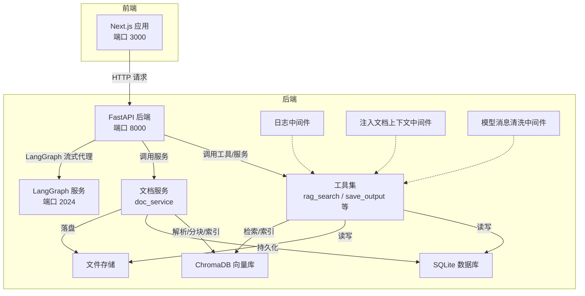
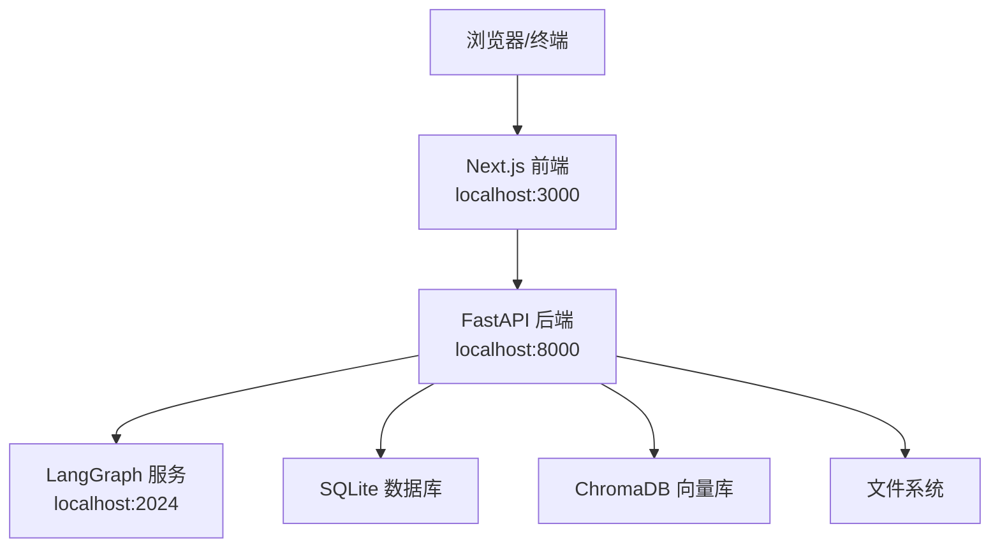
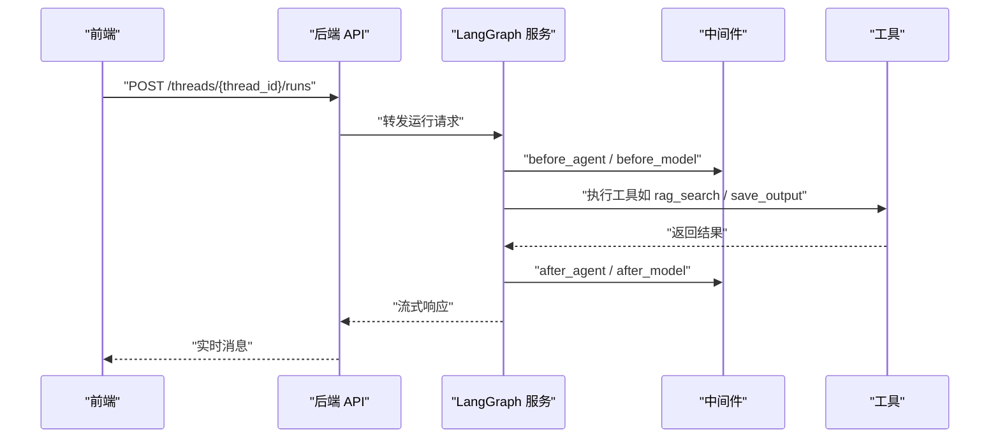
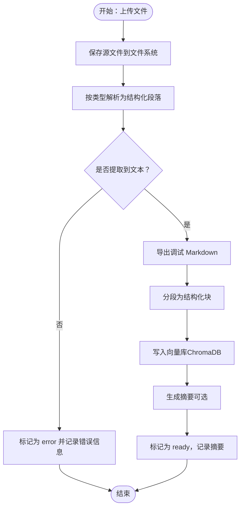
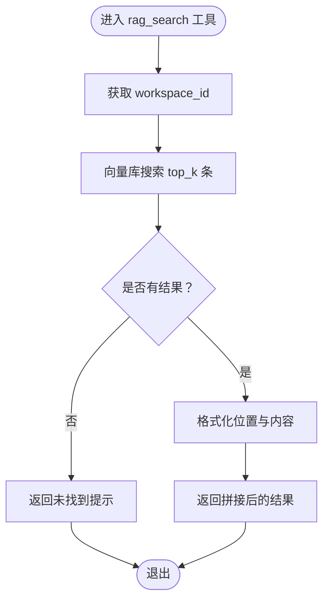
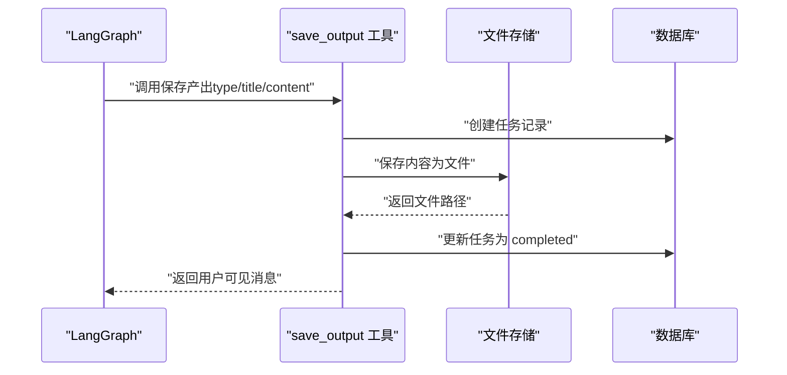
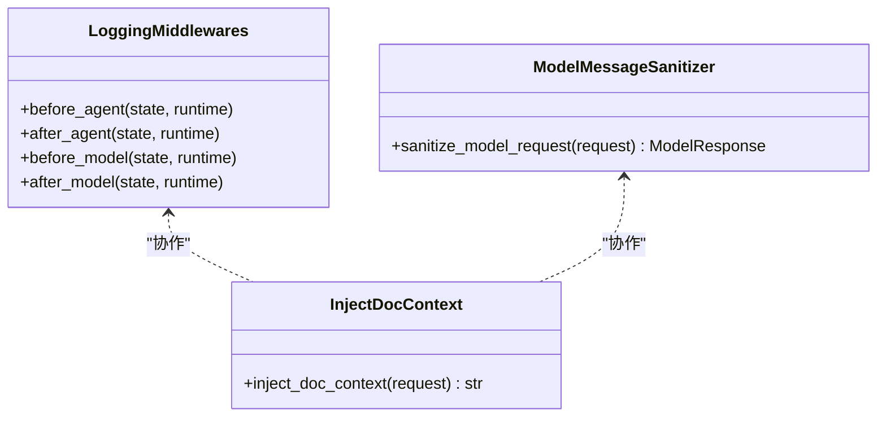
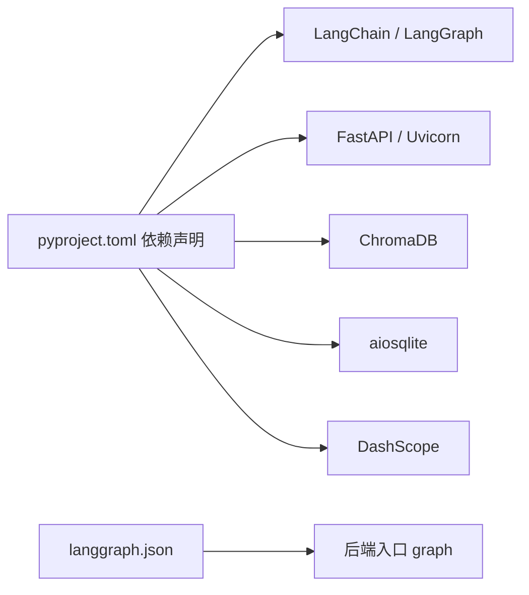

# 故障排查与常见问题

<cite>
**本文引用的文件**
- [README.md](file://README.md)
- [docs/debug-guides.md](file://docs/debug-guides.md)
- [backend/langgraph.json](file://backend/langgraph.json)
- [backend/pyproject.toml](file://backend/pyproject.toml)
- [backend/src/agent/graph.py](file://backend/src/agent/graph.py)
- [backend/src/api/routes.py](file://backend/src/api/routes.py)
- [backend/src/storage/database.py](file://backend/src/storage/database.py)
- [backend/src/storage/file_store.py](file://backend/src/storage/file_store.py)
- [backend/src/storage/vector_store.py](file://backend/src/storage/vector_store.py)
- [backend/src/services/doc_service.py](file://backend/src/services/doc_service.py)
- [backend/src/middlewares/logging_middlewares.py](file://backend/src/middlewares/logging_middlewares.py)
- [backend/src/middlewares/inject_doc_context.py](file://backend/src/middlewares/inject_doc_context.py)
- [backend/src/middlewares/model_message_sanitizer.py](file://backend/src/middlewares/model_message_sanitizer.py)
- [backend/src/tools/rag_search.py](file://backend/src/tools/rag_search.py)
- [backend/src/tools/save_output.py](file://backend/src/tools/save_output.py)
- [scripts/doctor.sh](file://scripts/doctor.sh)
- [scripts/start.sh](file://scripts/start.sh)
- [scripts/stop.sh](file://scripts/stop.sh)
</cite>

## 目录
1. [简介](#简介)
2. [项目结构](#项目结构)
3. [核心组件](#核心组件)
4. [架构总览](#架构总览)
5. [详细组件分析](#详细组件分析)
6. [依赖关系分析](#依赖关系分析)
7. [性能考虑](#性能考虑)
8. [故障排查指南](#故障排查指南)
9. [结论](#结论)
10. [附录](#附录)

## 简介
本指南面向 Train Agent 的开发者与运维人员，提供系统性的故障排查与常见问题解答。内容覆盖启动问题、运行时问题、网络与连接问题、数据与存储问题、性能问题以及紧急恢复流程。文档结合仓库中的脚本、中间件、工具与服务实现，给出可操作的诊断步骤与修复建议。

## 项目结构
Train Agent 采用前后端分离的本地开发栈，包含后端 FastAPI、LangGraph 服务与 Next.js 前端。后端通过中间件、工具与服务层实现文档解析、向量索引、消息记录与任务产出管理，并通过 SQLite、ChromaDB 与文件系统进行持久化。

图表来源
- [backend/src/api/routes.py:1-189](file://backend/src/api/routes.py#L1-L189)
- [backend/src/agent/graph.py:1-49](file://backend/src/agent/graph.py#L1-L49)
- [backend/src/services/doc_service.py:1-218](file://backend/src/services/doc_service.py#L1-L218)
- [backend/src/storage/database.py:1-379](file://backend/src/storage/database.py#L1-L379)
- [backend/src/storage/vector_store.py:1-177](file://backend/src/storage/vector_store.py#L1-L177)
- [backend/src/storage/file_store.py:1-39](file://backend/src/storage/file_store.py#L1-L39)
- [backend/src/middlewares/logging_middlewares.py:1-59](file://backend/src/middlewares/logging_middlewares.py#L1-L59)
- [backend/src/middlewares/inject_doc_context.py:1-41](file://backend/src/middlewares/inject_doc_context.py#L1-L41)
- [backend/src/middlewares/model_message_sanitizer.py:1-122](file://backend/src/middlewares/model_message_sanitizer.py#L1-L122)
- [backend/src/tools/rag_search.py:1-76](file://backend/src/tools/rag_search.py#L1-L76)
- [backend/src/tools/save_output.py:1-99](file://backend/src/tools/save_output.py#L1-L99)

章节来源
- [README.md:1-133](file://README.md#L1-L133)

## 核心组件
- 后端 API（FastAPI）：提供工作区、文档、任务与文件下载接口，启动时初始化数据库。
- LangGraph 代理：流式运行时，接收聊天线程并执行工具链。
- 中间件体系：日志记录、注入文档上下文、模型消息清洗。
- 工具集：RAG 检索、保存产出等。
- 服务层：文档上传、解析、分块、向量化、摘要生成与索引。
- 存储层：SQLite（aiosqlite）、ChromaDB（持久化客户端）、文件系统。

章节来源
- [backend/src/api/routes.py:1-189](file://backend/src/api/routes.py#L1-L189)
- [backend/src/agent/graph.py:1-49](file://backend/src/agent/graph.py#L1-L49)
- [backend/src/middlewares/logging_middlewares.py:1-59](file://backend/src/middlewares/logging_middlewares.py#L1-L59)
- [backend/src/middlewares/inject_doc_context.py:1-41](file://backend/src/middlewares/inject_doc_context.py#L1-L41)
- [backend/src/middlewares/model_message_sanitizer.py:1-122](file://backend/src/middlewares/model_message_sanitizer.py#L1-L122)
- [backend/src/tools/rag_search.py:1-76](file://backend/src/tools/rag_search.py#L1-L76)
- [backend/src/tools/save_output.py:1-99](file://backend/src/tools/save_output.py#L1-L99)
- [backend/src/services/doc_service.py:1-218](file://backend/src/services/doc_service.py#L1-L218)
- [backend/src/storage/database.py:1-379](file://backend/src/storage/database.py#L1-L379)
- [backend/src/storage/vector_store.py:1-177](file://backend/src/storage/vector_store.py#L1-L177)
- [backend/src/storage/file_store.py:1-39](file://backend/src/storage/file_store.py#L1-L39)

## 架构总览
下图展示本地开发栈的服务角色与端口映射，以及前端到后端与 LangGraph 的交互路径。

图表来源
- [README.md:7-13](file://README.md#L7-L13)
- [backend/src/api/routes.py:1-189](file://backend/src/api/routes.py#L1-L189)
- [backend/src/agent/graph.py:1-49](file://backend/src/agent/graph.py#L1-L49)
- [backend/src/storage/database.py:1-379](file://backend/src/storage/database.py#L1-L379)
- [backend/src/storage/vector_store.py:1-177](file://backend/src/storage/vector_store.py#L1-L177)
- [backend/src/storage/file_store.py:1-39](file://backend/src/storage/file_store.py#L1-L39)

## 详细组件分析

### 组件：LangGraph 代理与运行时
- 角色：接收前端聊天线程，注入系统提示与工具，驱动工具链执行。
- 关键点：模型参数、回调、中间件与工具注册。
- 常见问题：模型不可用、工具未注册、线程状态异常。

图表来源
- [backend/src/agent/graph.py:1-49](file://backend/src/agent/graph.py#L1-L49)
- [backend/src/middlewares/logging_middlewares.py:1-59](file://backend/src/middlewares/logging_middlewares.py#L1-L59)
- [backend/src/tools/rag_search.py:1-76](file://backend/src/tools/rag_search.py#L1-L76)
- [backend/src/tools/save_output.py:1-99](file://backend/src/tools/save_output.py#L1-L99)

章节来源
- [backend/src/agent/graph.py:1-49](file://backend/src/agent/graph.py#L1-L49)
- [backend/src/middlewares/logging_middlewares.py:1-59](file://backend/src/middlewares/logging_middlewares.py#L1-L59)

### 组件：文档处理流水线（上传/解析/分块/索引/摘要）
- 角色：接收上传文件，解析结构化内容，生成分块与向量索引，写入 SQLite 与 ChromaDB，并落盘导出调试 Markdown。
- 关键点：解析器选择、分块策略、嵌入函数、错误回退与状态机。

图表来源
- [backend/src/services/doc_service.py:1-218](file://backend/src/services/doc_service.py#L1-L218)
- [backend/src/storage/vector_store.py:1-177](file://backend/src/storage/vector_store.py#L1-L177)
- [backend/src/storage/file_store.py:1-39](file://backend/src/storage/file_store.py#L1-L39)
- [backend/src/storage/database.py:1-379](file://backend/src/storage/database.py#L1-L379)

章节来源
- [backend/src/services/doc_service.py:1-218](file://backend/src/services/doc_service.py#L1-L218)

### 组件：RAG 检索工具
- 角色：基于当前工作区或指定文档 ID，在向量库中检索相关片段，格式化位置信息并返回。
- 关键点：查询过滤、元数据字段、无结果回退。

图表来源
- [backend/src/tools/rag_search.py:1-76](file://backend/src/tools/rag_search.py#L1-L76)
- [backend/src/storage/vector_store.py:124-163](file://backend/src/storage/vector_store.py#L124-L163)

章节来源
- [backend/src/tools/rag_search.py:1-76](file://backend/src/tools/rag_search.py#L1-L76)

### 组件：保存产出工具
- 角色：异步保存产出内容到文件系统，创建任务记录并更新状态。
- 关键点：UTF-8 编码、任务状态机、错误回退与用户提示。

图表来源
- [backend/src/tools/save_output.py:1-99](file://backend/src/tools/save_output.py#L1-L99)
- [backend/src/storage/file_store.py:1-39](file://backend/src/storage/file_store.py#L1-L39)
- [backend/src/storage/database.py:340-379](file://backend/src/storage/database.py#L340-L379)

章节来源
- [backend/src/tools/save_output.py:1-99](file://backend/src/tools/save_output.py#L1-L99)

### 组件：中间件体系
- 日志中间件：记录 Agent 前后与模型调用前后关键指标。
- 注入文档上下文中间件：动态拼接当前工作区文档摘要到系统提示。
- 模型消息清洗中间件：清理不受支持的内容片段与工具调用残留，保证兼容性。

图表来源
- [backend/src/middlewares/logging_middlewares.py:1-59](file://backend/src/middlewares/logging_middlewares.py#L1-L59)
- [backend/src/middlewares/inject_doc_context.py:1-41](file://backend/src/middlewares/inject_doc_context.py#L1-L41)
- [backend/src/middlewares/model_message_sanitizer.py:1-122](file://backend/src/middlewares/model_message_sanitizer.py#L1-L122)

章节来源
- [backend/src/middlewares/logging_middlewares.py:1-59](file://backend/src/middlewares/logging_middlewares.py#L1-L59)
- [backend/src/middlewares/inject_doc_context.py:1-41](file://backend/src/middlewares/inject_doc_context.py#L1-L41)
- [backend/src/middlewares/model_message_sanitizer.py:1-122](file://backend/src/middlewares/model_message_sanitizer.py#L1-L122)

## 依赖关系分析
- 后端依赖：LangChain/LangGraph、FastAPI/Uvicorn、ChromaDB、aiosqlite、DashScope、Python 解析库等。
- LangGraph 配置：通过 langgraph.json 指定入口模块与环境文件。
- 端口占用：本地开发默认占用 8000（后端）、2024（LangGraph）、3000（前端）。

图表来源
- [backend/pyproject.toml:1-41](file://backend/pyproject.toml#L1-L41)
- [backend/langgraph.json:1-9](file://backend/langgraph.json#L1-L9)
- [backend/src/agent/graph.py:1-49](file://backend/src/agent/graph.py#L1-L49)

章节来源
- [backend/pyproject.toml:1-41](file://backend/pyproject.toml#L1-L41)
- [backend/langgraph.json:1-9](file://backend/langgraph.json#L1-L9)

## 性能考虑
- 向量检索：合理设置 top_k，避免过大导致延迟；确保嵌入 API 可用与鉴权正确。
- 文档处理：大文件解析与分块可能耗时，建议分批写入向量库并监控进度。
- 数据库：SQLite 大事务与频繁写入可能导致阻塞，注意批量提交与索引设计。
- 前端渲染：产出文件较大时建议分页或懒加载，减少首屏压力。

## 故障排查指南

### 一、启动问题排查
- 端口占用
  - 现象：服务启动后立即失败或显示端口被占用。
  - 诊断：使用健康检查脚本检测端口占用情况。
  - 修复：释放占用端口或修改端口配置。
  - 参考
    - [scripts/doctor.sh:83-90](file://scripts/doctor.sh#L83-L90)
    - [scripts/start.sh:91-112](file://scripts/start.sh#L91-L112)
- 依赖缺失
  - 现象：启动时报缺少命令或依赖。
  - 诊断：运行健康检查脚本，确认工具链与项目文件存在。
  - 修复：安装缺失的工具（如 uv、node、pnpm/npm），并补齐 .env。
  - 参考
    - [scripts/doctor.sh:20-52](file://scripts/doctor.sh#L20-L52)
    - [README.md:41-61](file://README.md#L41-L61)
- 权限问题
  - 现象：无法写入日志、数据目录或缓存目录。
  - 诊断：检查 DATA_DIR、日志与缓存目录权限。
  - 修复：调整目录权限或切换到有权限的用户。
  - 参考
    - [README.md:126-129](file://README.md#L126-L129)
    - [scripts/start.sh:11-13](file://scripts/start.sh#L11-L13)

### 二、运行时问题诊断
- 内存溢出
  - 现象：进程 OOM 或响应缓慢。
  - 诊断：观察后端与 LangGraph 日志峰值；检查大文件处理与批量写入。
  - 修复：降低批量大小、拆分处理、增加系统内存或限制并发。
  - 参考
    - [backend/src/storage/vector_store.py:57-89](file://backend/src/storage/vector_store.py#L57-L89)
    - [backend/src/services/doc_service.py:94-106](file://backend/src/services/doc_service.py#L94-L106)
- 数据库连接失败
  - 现象：启动即报数据库初始化失败或查询异常。
  - 诊断：确认 SQLite 文件存在与权限；检查数据库初始化逻辑。
  - 修复：重建数据库文件或修正路径；确保外键约束开启。
  - 参考
    - [backend/src/api/routes.py:30-35](file://backend/src/api/routes.py#L30-L35)
    - [backend/src/storage/database.py:14-20](file://backend/src/storage/database.py#L14-L20)
- LangGraph 服务异常
  - 现象：前端无法收到流式响应或报错。
  - 诊断：使用 curl 直连 LangGraph 端点验证；检查中间件与工具链。
  - 修复：确认模型可用与 API 密钥；检查工具注册与回调。
  - 参考
    - [docs/debug-guides.md:70-79](file://docs/debug-guides.md#L70-L79)
    - [backend/src/agent/graph.py:16-37](file://backend/src/agent/graph.py#L16-L37)

### 三、网络与连接问题
- 防火墙与端口
  - 现象：外部无法访问本地服务。
  - 诊断：检查本机防火墙规则与端口监听状态。
  - 修复：放行端口或在局域网内使用固定 IP 访问。
  - 参考
    - [scripts/doctor.sh:83-90](file://scripts/doctor.sh#L83-L90)
- DNS 解析
  - 现象：调用 DashScope 或其他远端服务失败。
  - 诊断：测试域名解析与连通性；检查代理设置。
  - 修复：配置正确的 DNS 或更换上游 DNS。
- 代理设置
  - 现象：LLM/Embedding 请求超时或被拦截。
  - 诊断：确认 HTTP(S) 代理与环境变量；验证证书链。
  - 修复：配置系统代理或在应用内设置代理。

### 四、数据与存储问题
- 文件权限
  - 现象：保存文件失败或删除目录报权限错误。
  - 诊断：检查 DATA_DIR 与文件系统权限。
  - 修复：提升权限或变更存储路径。
  - 参考
    - [backend/src/storage/file_store.py:11-16](file://backend/src/storage/file_store.py#L11-L16)
- 磁盘空间
  - 现象：向量库写入失败或文件保存失败。
  - 诊断：监控磁盘使用率。
  - 修复：清理历史数据或扩容磁盘。
- 数据库损坏
  - 现象：查询异常或初始化失败。
  - 修复：备份后重建数据库；必要时迁移数据。
  - 参考
    - [backend/src/storage/database.py:25-78](file://backend/src/storage/database.py#L25-L78)

### 五、性能问题诊断与优化
- 慢查询
  - 现象：消息列表拉取或检索响应慢。
  - 诊断：检查数据库索引与查询参数；关注分页与游标。
  - 修复：优化查询条件、限制返回条数、建立合适索引。
  - 参考
    - [backend/src/storage/database.py:230-262](file://backend/src/storage/database.py#L230-L262)
- 内存泄漏
  - 现象：长时间运行后内存持续增长。
  - 诊断：对比 GC 前后对象数量；定位长生命周期对象。
  - 修复：避免闭包持有全局引用；及时释放资源。
- 并发瓶颈
  - 现象：高并发下吞吐下降。
  - 诊断：观察线程池与事件循环；评估 I/O 密集度。
  - 修复：异步化 I/O、限流与重试、水平扩展。

### 六、紧急恢复程序
- 快速重启
  - 步骤：停止所有服务，清理 PID 文件，重新启动。
  - 参考
    - [scripts/stop.sh:15-37](file://scripts/stop.sh#L15-L37)
    - [scripts/start.sh:86-129](file://scripts/start.sh#L86-L129)
- 数据备份与恢复
  - 备份：复制 SQLite 数据库文件与 ChromaDB 持久化目录、输出文件。
  - 恢复：替换对应目录后重启服务。
  - 参考
    - [backend/src/storage/database.py:10-12](file://backend/src/storage/database.py#L10-L12)
    - [backend/src/storage/vector_store.py:40-42](file://backend/src/storage/vector_store.py#L40-L42)
    - [backend/src/storage/file_store.py:35-39](file://backend/src/storage/file_store.py#L35-L39)
- 灾难恢复流程
  - 清理：停止服务、删除损坏的数据目录。
  - 重建：重新初始化数据库与向量库，重新导入数据。
  - 验证：运行健康检查脚本与最小回归用例。

## 结论
通过系统化的日志采集、中间件观测、工具链与服务层的可观测性，配合脚本化的启动/停止与健康检查，可以高效定位并解决 Train Agent 在本地开发与运行过程中的各类问题。建议在生产环境中进一步完善日志轮转、告警与自动恢复机制。

## 附录

### 常用命令与入口
- 启动/停止/重启
  - [scripts/start.sh:1-129](file://scripts/start.sh#L1-L129)
  - [scripts/stop.sh:1-40](file://scripts/stop.sh#L1-L40)
- 健康检查
  - [scripts/doctor.sh:1-99](file://scripts/doctor.sh#L1-L99)
- 端口与服务
  - [README.md:7-13](file://README.md#L7-L13)
- LangGraph 配置
  - [backend/langgraph.json:1-9](file://backend/langgraph.json#L1-L9)