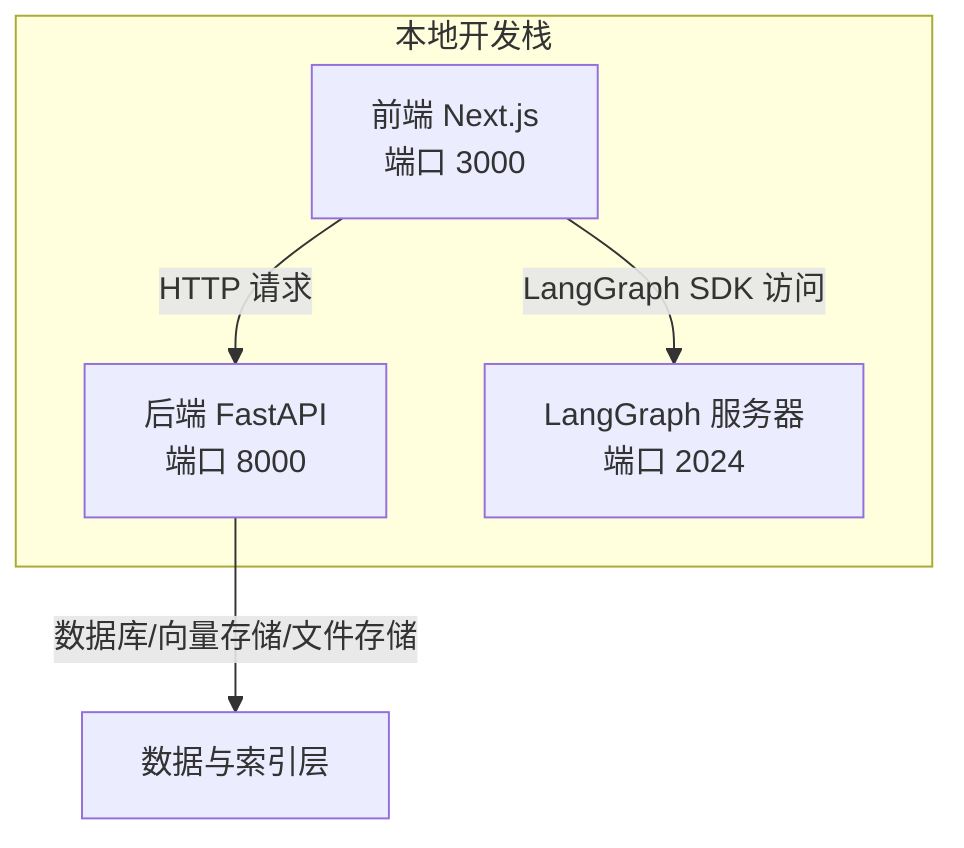
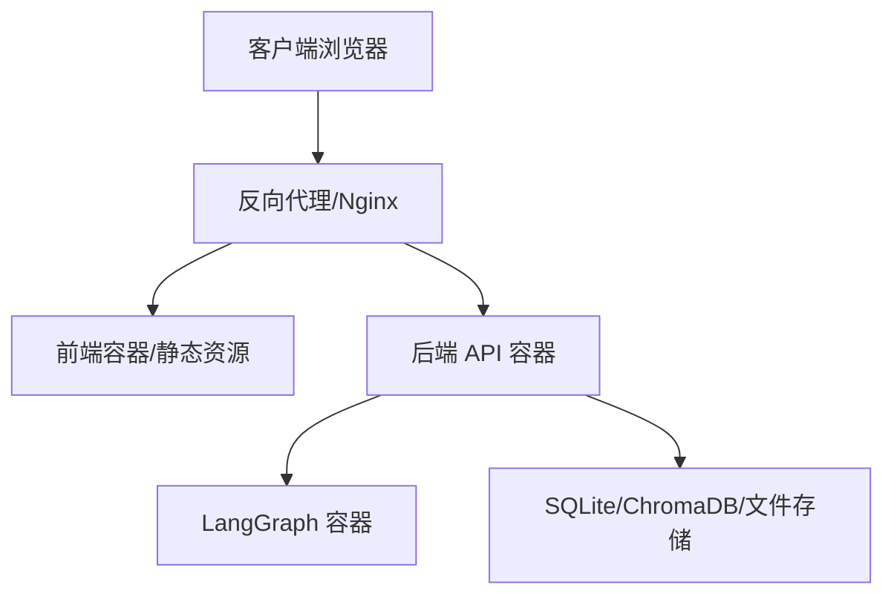
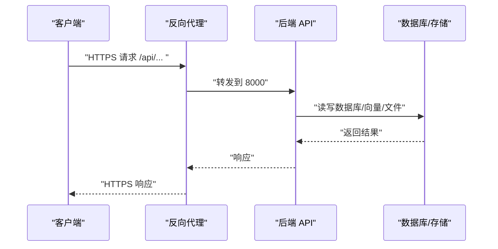
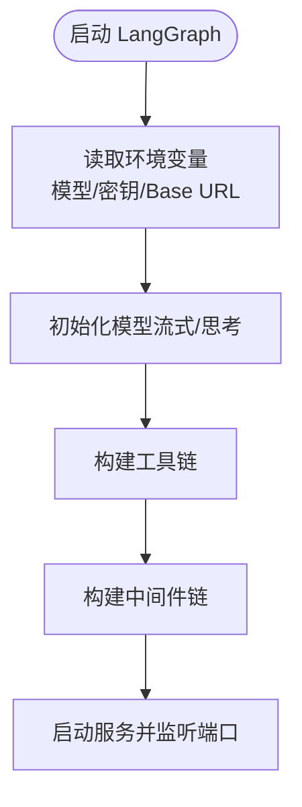
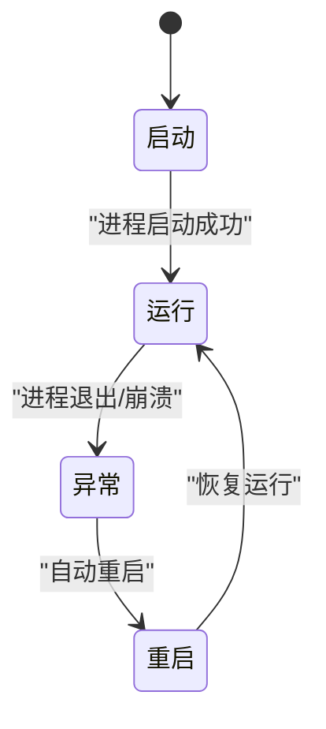
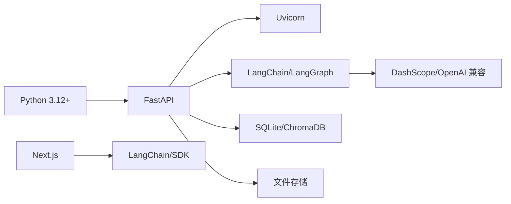

# 生产环境部署

<cite>
**本文引用的文件**
- [README.md](file://README.md)
- [backend/pyproject.toml](file://backend/pyproject.toml)
- [backend/langgraph.json](file://backend/langgraph.json)
- [backend/src/api/routes.py](file://backend/src/api/routes.py)
- [backend/src/agent/graph.py](file://backend/src/agent/graph.py)
- [frontend/package.json](file://frontend/package.json)
- [scripts/start.sh](file://scripts/start.sh)
- [scripts/stop.sh](file://scripts/stop.sh)
- [scripts/restart.sh](file://scripts/restart.sh)
</cite>

## 目录
1. [简介](#简介)
2. [项目结构](#项目结构)
3. [核心组件](#核心组件)
4. [架构总览](#架构总览)
5. [详细组件分析](#详细组件分析)
6. [依赖分析](#依赖分析)
7. [性能考虑](#性能考虑)
8. [故障排查指南](#故障排查指南)
9. [结论](#结论)
10. [附录](#附录)

## 简介
本文件面向生产环境，提供 Train Agent 的完整部署指南，涵盖容器化与系统级部署、服务器配置、负载均衡与高可用、SSL 证书、LangGraph 服务器生产配置、进程管理与自动重启、以及蓝绿/滚动部署等最佳实践。内容基于仓库中的脚本、配置与源码进行提炼与扩展，确保可操作性与可维护性。

## 项目结构
- 后端采用 FastAPI + Uvicorn 提供 REST API，LangGraph 作为流式智能体运行时；前端使用 Next.js。
- 开发脚本统一管理三服务的启动、停止与验证，便于在生产环境中映射为 systemd 或容器编排。
- 关键运行端口：后端 API 8000、LangGraph 2024、前端 3000（开发）。

**章节来源**
- [README.md:1-133](file://README.md#L1-L133)
- [scripts/start.sh:56-82](file://scripts/start.sh#L56-L82)

## 核心组件
- 后端 API（FastAPI）
  - 负责工作区、文档、任务与文件下载等接口。
  - 启动时初始化数据库，支持 CORS。
- LangGraph 智能体
  - 使用 OpenAI 兼容模型，支持流式输出与回调记录消息历史。
  - 通过工具链与中间件实现检索、技能加载、输出保存等功能。
- 前端（Next.js）
  - 提供工作区、文档、聊天与任务面板，通过 SDK 与 LangGraph 交互。

**章节来源**
- [backend/src/api/routes.py:21-27](file://backend/src/api/routes.py#L21-L27)
- [backend/src/api/routes.py:30-34](file://backend/src/api/routes.py#L30-L34)
- [backend/src/agent/graph.py:16-48](file://backend/src/agent/graph.py#L16-L48)
- [frontend/package.json:11-38](file://frontend/package.json#L11-L38)

## 架构总览
生产环境建议采用“反向代理 + 容器编排”的模式：
- 反向代理（如 Nginx）统一入口，负责 TLS 终止、健康检查与路由转发。
- 后端 API 与 LangGraph 分别容器化，前端静态化或容器化，通过服务发现与健康检查协同。
- 数据持久化与缓存分离，确保高可用与弹性伸缩。

## 详细组件分析

### 后端 API（FastAPI）生产配置
- 端口与监听
  - 监听 0.0.0.0:8000，生产建议配合反向代理暴露 443。
- 中间件与安全
  - 默认允许所有来源的 CORS，生产需按域名白名单收紧。
  - 建议启用速率限制、请求大小限制与 WAF。
- 数据库初始化
  - 启动事件中完成数据库初始化，生产需确保迁移脚本与权限正确。
- 文件下载
  - 支持静态文件下载，生产需限制路径与鉴权，避免目录穿越。

**图示来源**
- [backend/src/api/routes.py:21-27](file://backend/src/api/routes.py#L21-L27)
- [backend/src/api/routes.py:30-34](file://backend/src/api/routes.py#L30-L34)
- [backend/src/api/routes.py:163-174](file://backend/src/api/routes.py#L163-L174)

**章节来源**
- [backend/src/api/routes.py:21-27](file://backend/src/api/routes.py#L21-L27)
- [backend/src/api/routes.py:30-34](file://backend/src/api/routes.py#L30-L34)
- [backend/src/api/routes.py:163-174](file://backend/src/api/routes.py#L163-L174)

### LangGraph 服务器生产配置
- 模型与凭据
  - 通过环境变量指定主模型、API Key 与 Base URL，支持流式输出与思考开关。
- 回调与中间件
  - 注入消息历史回调，结合中间件实现上下文注入与工具链执行。
- 运行方式
  - 开发模式下通过 CLI 启动；生产建议容器化并配合反向代理暴露端口。

**图示来源**
- [backend/src/agent/graph.py:16-48](file://backend/src/agent/graph.py#L16-L48)
- [backend/langgraph.json:1-9](file://backend/langgraph.json#L1-L9)

**章节来源**
- [backend/src/agent/graph.py:16-48](file://backend/src/agent/graph.py#L16-L48)
- [backend/langgraph.json:1-9](file://backend/langgraph.json#L1-L9)

### 前端（Next.js）生产配置
- 构建与运行
  - 生产建议构建静态产物并由反向代理提供，或容器化运行。
- 环境变量
  - API 基础地址与 LangGraph 地址需指向生产反向代理后的域名与端口。
- 客户端 SDK
  - 使用 LangChain React SDK 与 LangGraph SDK 进行对话与工具调用。

**章节来源**
- [frontend/package.json:11-38](file://frontend/package.json#L11-L38)
- [README.md:59-60](file://README.md#L59-L60)

### 进程管理与自动重启（systemd）
- 建议为每个服务编写独立的 systemd 单元文件：
  - 后端 API：监听 8000，依赖数据库与向量存储就绪。
  - LangGraph：监听 2024，依赖后端 API 就绪。
  - 前端：静态或容器化，由反向代理统一调度。
- 关键参数
  - Restart=always、RestartSec=10、EnvironmentFile 加载 .env。
  - StandardOutput/StandardError 重定向到日志系统。
  - ExecStart 指向 uvicorn 或 next start。
- 健康检查
  - 在 systemd 中使用 ExecStartPre/ExecStartPost 或外部探针检查 8000/2024 端口。

**章节来源**
- [scripts/start.sh:56-82](file://scripts/start.sh#L56-L82)
- [scripts/stop.sh:15-34](file://scripts/stop.sh#L15-L34)

### 负载均衡与高可用
- 反向代理
  - Nginx/Apache/Traefik 拦截 443，转发至后端 API 与 LangGraph。
  - 健康检查：GET /api/health（建议在后端新增健康端点）。
- 多实例
  - 后端与 LangGraph 均可横向扩展，注意共享存储与会话一致性。
- 自动重启
  - 结合 systemd 的 Restart 与外部监控（Prometheus/Grafana/云监控）。

**章节来源**
- [backend/src/api/routes.py:21-27](file://backend/src/api/routes.py#L21-L27)

### SSL 证书配置（Let’s Encrypt）
- 方案
  - 使用 Certbot 自动签发与续期，Nginx 配置 HTTPS。
  - 将域名解析到服务器公网 IP，开放 80/443。
- 安全加固
  - 仅暴露必要端口，禁用弱密码套件，启用 HSTS。
  - 前端与后端均通过 HTTPS 访问，避免混合内容。

**章节来源**
- [README.md:59-60](file://README.md#L59-L60)

### 部署最佳实践
- 蓝绿/金丝雀发布
  - 使用反向代理的上游组切换，逐步切流量。
- 滚动更新
  - 容器编排中设置 maxUnavailable=0 与滚动策略，确保 0 停机。
- 回滚策略
  - 快速回退到上一版本镜像，保留配置与数据卷不变。
- 配置管理
  - 使用环境变量文件与密钥管理服务，避免硬编码敏感信息。

## 依赖分析
- 运行时依赖
  - Python >= 3.12，FastAPI/Uvicorn，LangChain/LangGraph，DashScope/OpenAI 兼容服务，ChromaDB，SQLite，前端包管理器。
- 端口依赖
  - 后端 API 8000、LangGraph 2024、前端 3000（开发），生产统一由反向代理暴露。

**图示来源**
- [backend/pyproject.toml:6-26](file://backend/pyproject.toml#L6-L26)
- [frontend/package.json:11-25](file://frontend/package.json#L11-L25)

**章节来源**
- [backend/pyproject.toml:6-26](file://backend/pyproject.toml#L6-L26)
- [frontend/package.json:11-25](file://frontend/package.json#L11-L25)

## 性能考虑
- 并发与资源
  - 后端与 LangGraph 均支持多线程/多进程，生产根据 CPU/内存核数与模型吞吐设定 workers 与并发连接数。
- 缓存与索引
  - 向量索引与嵌入缓存预热，减少首次查询延迟。
- I/O 优化
  - 数据库存储与向量库使用 SSD，文件上传走对象存储或共享盘。
- 流式输出
  - LangGraph 流式响应降低首字节时间，前端使用合适的缓冲策略。

## 故障排查指南
- 启动失败
  - 查看各服务 PID 文件与日志，确认端口占用与依赖服务就绪。
- 端口检查
  - 使用 lsof 检查 8000/2024/3000 是否被占用，必要时发送 TERM/INT 信号优雅关闭。
- 日志定位
  - 后端 API、LangGraph、前端分别查看对应日志文件，关注最近 40 行错误堆栈。
- 健康检查
  - 新增 /api/health 接口返回服务状态，配合反向代理与监控系统。

**章节来源**
- [scripts/start.sh:86-128](file://scripts/start.sh#L86-L128)
- [scripts/stop.sh:15-34](file://scripts/stop.sh#L15-L34)

## 结论
通过反向代理与容器编排，Train Agent 可实现高可用、可扩展的生产部署。结合 systemd 自动重启、健康检查与蓝绿/滚动发布策略，可在保证稳定性的同时快速迭代。建议优先完善健康检查端点、统一日志与指标采集，并对敏感配置进行集中化管理。

## 附录

### 环境变量清单（生产建议）
- LLM 与嵌入
  - MAIN_MODEL、DASHSCOPE_API_KEY、DEEPSEEK_API_BASE
- 数据与路径
  - DATA_DIR、DATABASE_URL（如需外部数据库）、向量库地址
- 前端运行时
  - NEXT_PUBLIC_API_BASE、NEXT_PUBLIC_LANGGRAPH_API_URL
- 安全与网络
  - CORS 白名单、TLS 证书路径、防火墙放通 443/80

**章节来源**
- [README.md:50-60](file://README.md#L50-L60)
- [backend/src/agent/graph.py:18-24](file://backend/src/agent/graph.py#L18-L24)