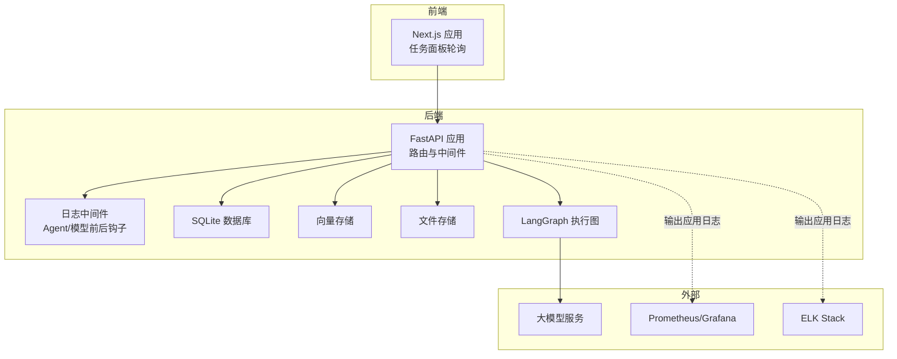
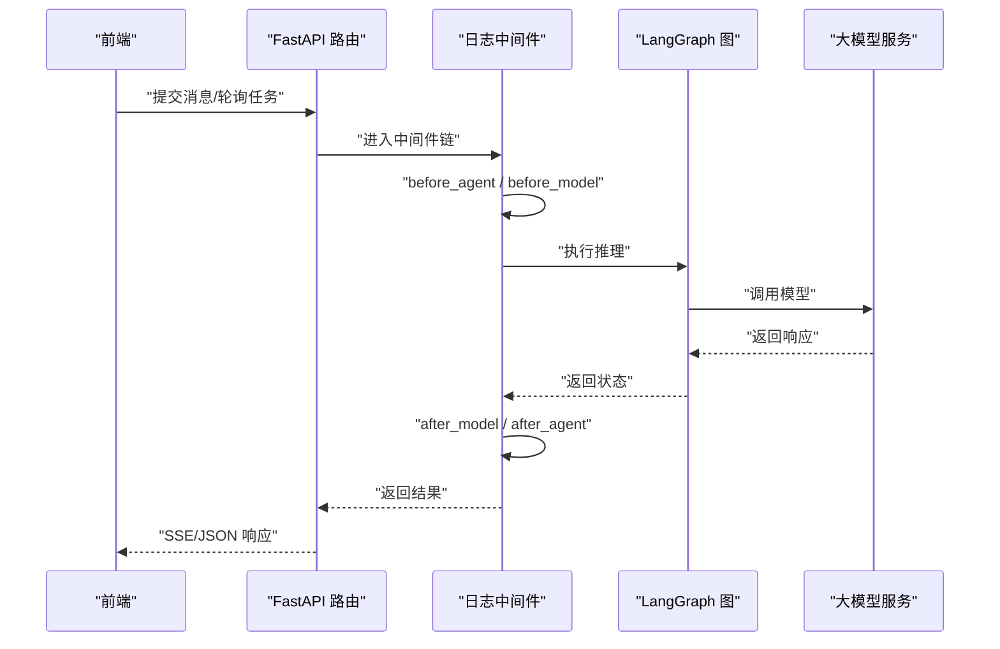
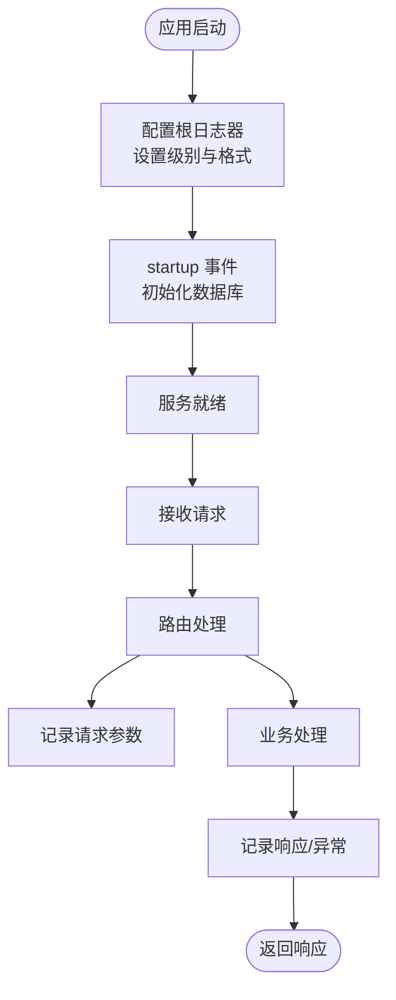
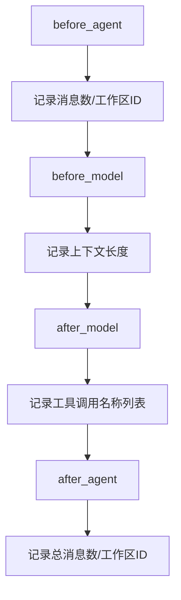
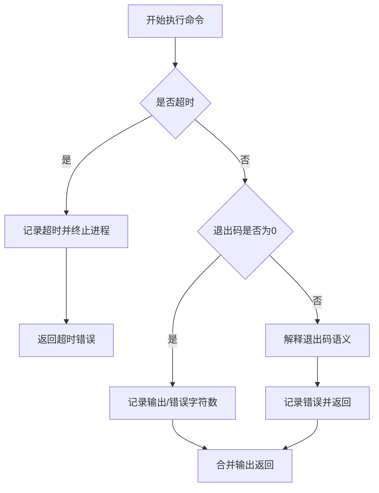
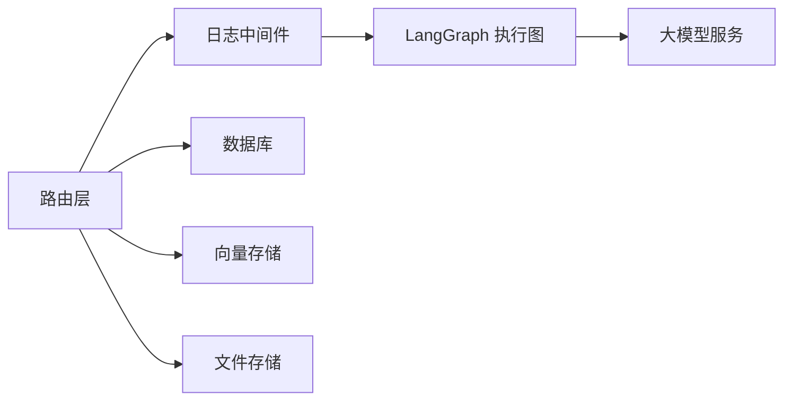

# 监控与日志

<cite>
**本文引用的文件**
- [backend/src/api/routes.py](file://backend/src/api/routes.py)
- [backend/src/middlewares/logging_middlewares.py](file://backend/src/middlewares/logging_middlewares.py)
- [backend/src/middlewares/__init__.py](file://backend/src/middlewares/__init__.py)
- [backend/src/tools/terminal_tool.py](file://backend/src/tools/terminal_tool.py)
- [backend/src/storage/database.py](file://backend/src/storage/database.py)
- [backend/src/app_context.py](file://backend/src/app_context.py)
- [backend/src/agent/graph.py](file://backend/src/agent/graph.py)
- [backend/src/api/deps.py](file://backend/src/api/deps.py)
- [backend/scripts/inspect_chunks.py](file://backend/scripts/inspect_chunks.py)
- [scripts/start.sh](file://scripts/start.sh)
- [docs/backend-architecture.md](file://docs/backend-architecture.md)
- [plans/2026-05-27-train-agent-implementation.md](file://plans/2026-05-27-train-agent-implementation.md)
</cite>

## 目录
1. [简介](#简介)
2. [项目结构](#项目结构)
3. [核心组件](#核心组件)
4. [架构总览](#架构总览)
5. [详细组件分析](#详细组件分析)
6. [依赖关系分析](#依赖关系分析)
7. [性能考虑](#性能考虑)
8. [故障排查指南](#故障排查指南)
9. [结论](#结论)
10. [附录](#附录)

## 简介
本文件面向 Train Agent 的监控与日志管理，覆盖后端 API 日志、LangGraph 日志、前端日志的分类与配置；说明日志级别、轮转策略与存储位置；给出性能监控指标与告警建议；介绍与 Prometheus、Grafana、ELK Stack 的集成思路；并提供日志分析与故障排查技巧及监控仪表板搭建与关键指标解读。

## 项目结构
- 后端采用 FastAPI 提供 REST API，并通过中间件注入日志与消息历史、模型请求清洗、上下文注入、工具调用与总结等能力。
- LangGraph 作为智能体执行引擎，通过中间件记录 Agent 前后与模型前后调用的关键事件。
- 前端基于 Next.js，负责用户交互与任务面板轮询展示。
- 脚本层提供启动脚本，统一输出日志到根目录 logs，并以 nohup 方式守护进程运行后端 API。

图表来源
- [backend/src/api/routes.py:12-27](file://backend/src/api/routes.py#L12-L27)
- [backend/src/middlewares/logging_middlewares.py:15-58](file://backend/src/middlewares/logging_middlewares.py#L15-L58)
- [backend/src/agent/graph.py:18-44](file://backend/src/agent/graph.py#L18-L44)

章节来源
- [backend/src/api/routes.py:12-27](file://backend/src/api/routes.py#L12-L27)
- [scripts/start.sh:56-60](file://scripts/start.sh#L56-L60)

## 核心组件
- 后端 API 日志：在应用启动、路由访问、数据库初始化等关键节点输出结构化日志，格式包含时间戳、模块名、级别与消息。
- LangGraph 日志：通过中间件在 Agent 循环前后、模型调用前后记录上下文长度、工具调用名称等信息，便于追踪推理链路。
- 工具日志：终端工具在成功/失败/超时等场景输出结构化日志，便于定位工具执行异常。
- 存储与上下文：数据库初始化、嵌入模型、向量存储、数据目录等均来自环境变量，确保部署一致性与可观测性。

章节来源
- [backend/src/api/routes.py:14-19](file://backend/src/api/routes.py#L14-L19)
- [backend/src/middlewares/logging_middlewares.py:15-58](file://backend/src/middlewares/logging_middlewares.py#L15-L58)
- [backend/src/tools/terminal_tool.py:108-160](file://backend/src/tools/terminal_tool.py#L108-L160)
- [backend/src/storage/database.py:14-23](file://backend/src/storage/database.py#L14-L23)
- [backend/src/app_context.py:19](file://backend/src/app_context.py#L19)

## 架构总览
后端日志流经 FastAPI 应用层与 LangGraph 中间件层，结合工具层日志形成完整的可观测性闭环。前端通过轮询接口获取任务状态，间接反映后端处理性能与稳定性。

图表来源
- [backend/src/middlewares/logging_middlewares.py:15-58](file://backend/src/middlewares/logging_middlewares.py#L15-L58)
- [backend/src/agent/graph.py:18-44](file://backend/src/agent/graph.py#L18-L44)

## 详细组件分析

### 后端 API 日志体系
- 日志初始化：应用启动时配置根日志器，设置级别与格式，保证统一输出风格。
- 路由级日志：对关键路由（创建工作区、上传文档、任务轮询等）记录请求参数与结果，便于审计与排障。
- 启动与关闭：在 startup 事件中记录数据库初始化状态，确保基础设施可用性可观察。

图表来源
- [backend/src/api/routes.py:14-19](file://backend/src/api/routes.py#L14-L19)
- [backend/src/api/routes.py:30-34](file://backend/src/api/routes.py#L30-L34)

章节来源
- [backend/src/api/routes.py:14-19](file://backend/src/api/routes.py#L14-L19)
- [backend/src/api/routes.py:30-34](file://backend/src/api/routes.py#L30-L34)

### LangGraph 日志中间件
- Agent 生命周期钩子：在 Agent 循环开始与结束时记录消息数量与工作区 ID，便于评估对话规模与频率。
- 模型调用钩子：在模型调用前记录上下文长度，在调用后记录工具调用名称列表，便于定位工具使用与上下文增长趋势。

图表来源
- [backend/src/middlewares/logging_middlewares.py:15-58](file://backend/src/middlewares/logging_middlewares.py#L15-L58)

章节来源
- [backend/src/middlewares/logging_middlewares.py:15-58](file://backend/src/middlewares/logging_middlewares.py#L15-L58)

### 工具日志（以终端工具为例）
- 成功：记录输出字符数与错误字符数，便于评估工具输出规模。
- 失败：解释退出码语义（如 grep/rg/find 的“未匹配”视为语义成功），并记录错误信息。
- 超时：记录超时时间并终止进程，避免僵尸进程与资源泄露。

图表来源
- [backend/src/tools/terminal_tool.py:108-160](file://backend/src/tools/terminal_tool.py#L108-L160)

章节来源
- [backend/src/tools/terminal_tool.py:108-160](file://backend/src/tools/terminal_tool.py#L108-L160)

### 存储与上下文配置
- 数据库：初始化连接与表结构，确保数据一致性与可观测性。
- 上下文：从环境变量加载数据目录、主模型、摘要模型、嵌入模型等，保证部署一致性。

章节来源
- [backend/src/storage/database.py:14-23](file://backend/src/storage/database.py#L14-L23)
- [backend/src/app_context.py:19](file://backend/src/app_context.py#L19)
- [backend/src/agent/graph.py:18-44](file://backend/src/agent/graph.py#L18-L44)
- [backend/src/api/deps.py:21-23](file://backend/src/api/deps.py#L21-L23)
- [backend/scripts/inspect_chunks.py:16](file://backend/scripts/inspect_chunks.py#L16)

## 依赖关系分析
- 中间件装配顺序决定日志采集的粒度与时机，需确保日志中间件位于消息历史与模型调用之间，以便完整记录 Agent 生命周期。
- LangGraph 执行图依赖环境变量配置的大模型与摘要模型，日志中间件可据此关联工作区与工具调用。

图表来源
- [backend/src/middlewares/__init__.py:18-40](file://backend/src/middlewares/__init__.py#L18-L40)
- [backend/src/agent/graph.py:18-44](file://backend/src/agent/graph.py#L18-L44)

章节来源
- [backend/src/middlewares/__init__.py:18-40](file://backend/src/middlewares/__init__.py#L18-L40)

## 性能考虑
- 响应时间：通过路由层记录请求进入与处理完成的时间戳，计算平均/分位响应时间。
- 吞吐量：统计每分钟请求数（QPM/QPS），区分不同路由的处理压力。
- 错误率：统计 HTTP 5xx 与业务异常比例，结合工具失败与超时统计。
- 资源使用：结合系统指标（CPU/内存/IO）与容器指标，关注数据库连接池与向量存储延迟。
- LangGraph 与工具：通过中间件记录模型调用次数与工具调用分布，辅助容量规划。

[本节为通用性能指导，不直接分析具体文件]

## 故障排查指南
- 快速定位
  - 查看后端启动日志与数据库初始化日志，确认服务可用性。
  - 检查 LangGraph 中间件日志，识别 Agent 循环与模型调用异常。
  - 定位工具失败与超时，结合语义成功规则（如 grep/rg/find 的“未匹配”）判断是否为预期行为。
- 前端轮询
  - 参考任务面板轮询机制，确认后端任务接口响应与状态更新是否正常。
- 存储与上下文
  - 核对数据目录、嵌入模型与向量存储配置，避免因路径或密钥缺失导致功能异常。

章节来源
- [backend/src/api/routes.py:30-34](file://backend/src/api/routes.py#L30-L34)
- [backend/src/middlewares/logging_middlewares.py:15-58](file://backend/src/middlewares/logging_middlewares.py#L15-L58)
- [backend/src/tools/terminal_tool.py:108-160](file://backend/src/tools/terminal_tool.py#L108-L160)
- [docs/backend-architecture.md:141-162](file://docs/backend-architecture.md#L141-L162)

## 结论
当前实现已具备基础的日志体系：应用层结构化日志、LangGraph 中间件链路日志、工具层执行日志。建议进一步完善日志轮转、集中化收集与可视化，引入性能指标与告警，以支撑生产环境的稳定运行与快速排障。

[本节为总结性内容，不直接分析具体文件]

## 附录

### 日志系统架构与配置
- 分类
  - 后端 API 日志：应用启动、路由访问、数据库初始化等。
  - LangGraph 日志：Agent 生命周期与模型调用前后钩子。
  - 工具日志：终端工具等外部执行组件的输入输出与错误。
- 级别
  - 开发环境：INFO 级别为主，必要时临时提升至 DEBUG。
  - 生产环境：建议 INFO/ERROR 分离，关键路径 WARNING。
- 轮转策略
  - 建议按大小轮转（如 100MB）与按时间轮转（每日/每周）结合，保留 7–30 天。
- 存储位置
  - 启动脚本统一输出到根目录 logs，建议拆分为 backend.log、langgraph.log、tools.log 等独立文件。

章节来源
- [backend/src/api/routes.py:14-19](file://backend/src/api/routes.py#L14-L19)
- [backend/src/middlewares/logging_middlewares.py:15-58](file://backend/src/middlewares/logging_middlewares.py#L15-L58)
- [backend/src/tools/terminal_tool.py:108-160](file://backend/src/tools/terminal_tool.py#L108-L160)
- [scripts/start.sh:56-60](file://scripts/start.sh#L56-L60)

### 告警配置建议
- 阈值
  - 响应时间 P95 超过 5 秒；错误率超过 1%；吞吐量骤降 30%；工具超时占比超过 5%。
- 通知渠道
  - 邮件/企业微信/钉钉机器人；针对严重告警启用电话通知。
- 自动处理
  - 周期性健康检查失败自动重启；关键依赖不可用时自动切换备用实例。

[本节为通用告警建议，不直接分析具体文件]

### 第三方监控工具集成
- Prometheus
  - 导出自定义指标（QPS、P95、错误率、工具超时率、LangGraph 调用次数）。
- Grafana
  - 展示关键指标面板：吞吐量曲线、错误率堆叠、响应时间箱线图、工具执行时序。
- ELK Stack
  - 收集后端与工具日志，建立查询与聚合面板，支持关键字检索与异常模式识别。

[本节为通用集成建议，不直接分析具体文件]

### 日志分析与故障排查技巧
- 错误追踪
  - 以时间轴串联 API 请求、LangGraph 中间件日志与工具日志，定位首次异常点。
- 性能瓶颈定位
  - 关注模型调用耗时与工具执行耗时，结合上下文长度与工具调用频次判断是否需要优化。
- 用户体验监控
  - 通过任务面板轮询与 SSE 推送的延迟评估整体体验，结合错误率与超时率综合评价。

章节来源
- [docs/backend-architecture.md:141-162](file://docs/backend-architecture.md#L141-L162)
- [plans/2026-05-27-train-agent-implementation.md:312-406](file://plans/2026-05-27-train-agent-implementation.md#L312-L406)

### 监控仪表板搭建与关键指标解读
- 面板建议
  - 后端健康：进程存活、数据库连接、磁盘空间。
  - API 性能：QPS、P95/P99 响应时间、错误率、超时率。
  - LangGraph：Agent 循环次数、模型调用次数、工具调用分布。
  - 工具执行：成功率、平均耗时、超时率、输出大小。
- 关键指标解读
  - QPS 稳定且 P95 低：系统健康。
  - 错误率上升：需检查上游依赖与工具失败。
  - 工具超时增多：需检查外部资源与并发限制。
  - LangGraph 调用激增：需评估提示词复杂度与上下文压缩策略。

[本节为通用仪表板建议，不直接分析具体文件]