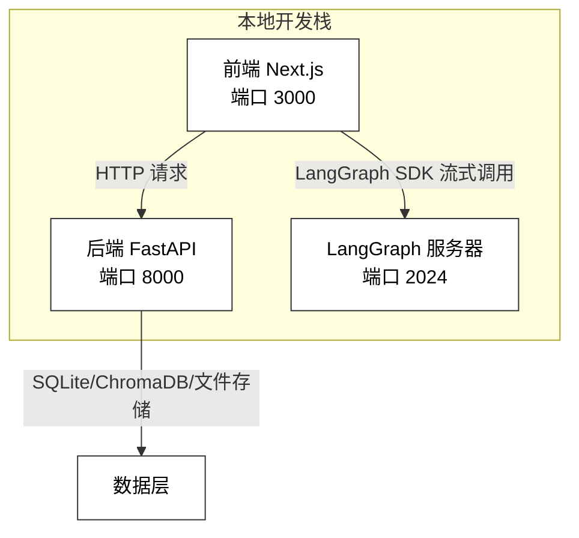
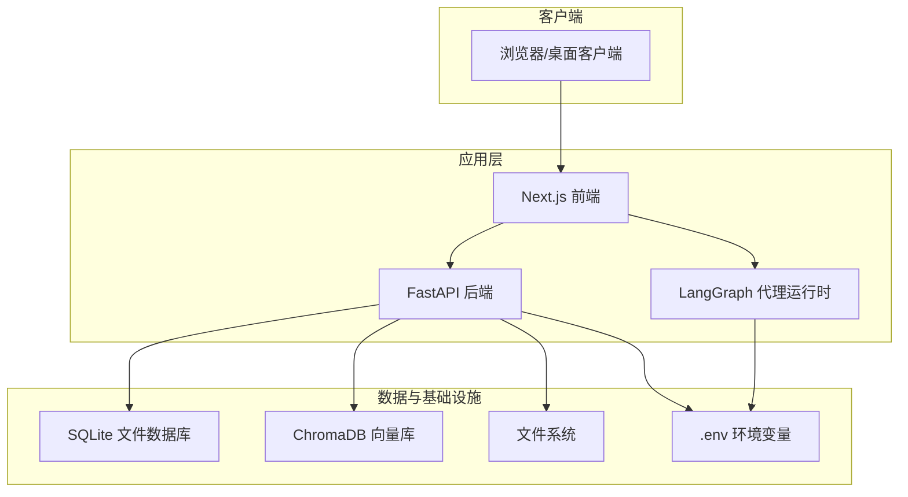
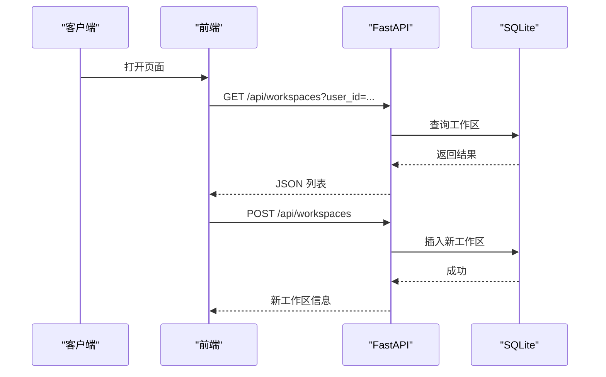
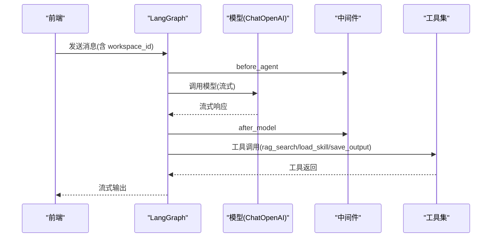
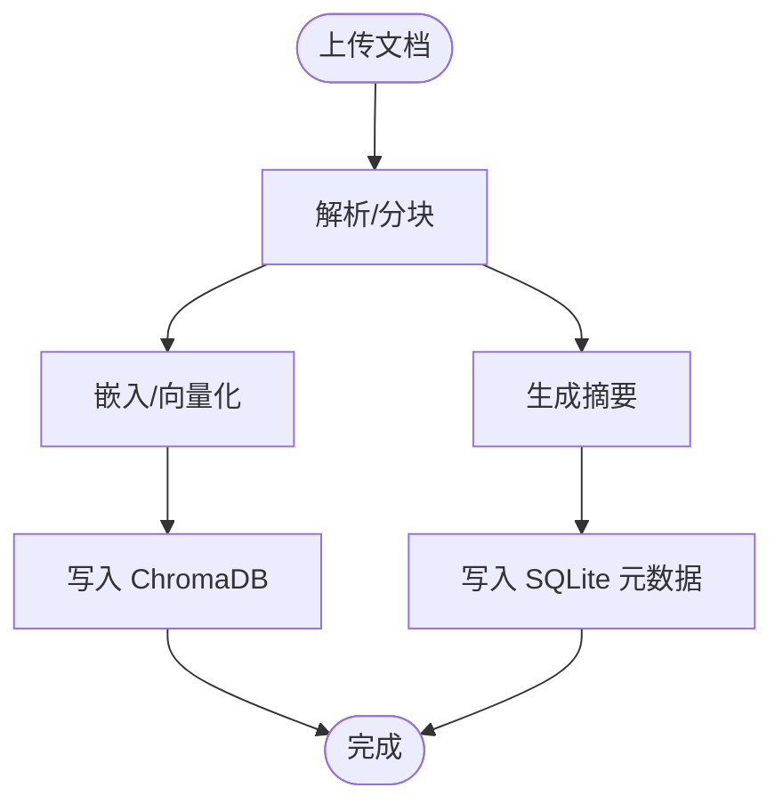
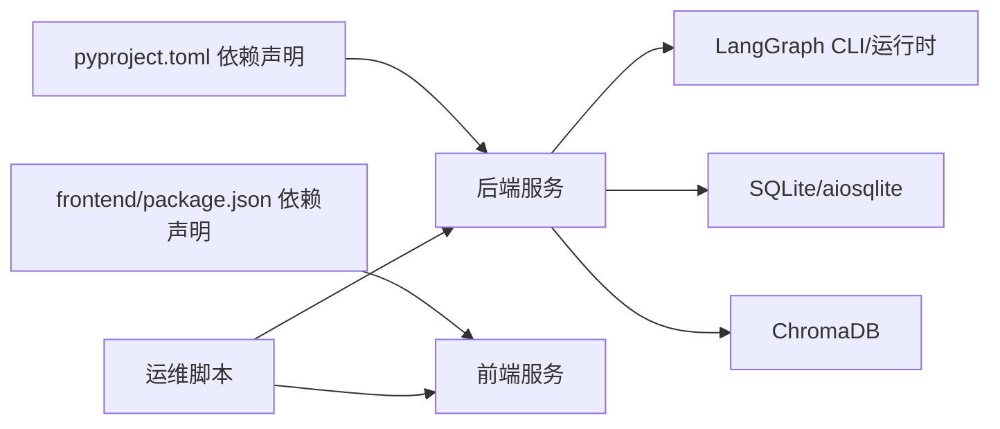

# 部署与运维

<cite>
**本文引用的文件**
- [README.md](file://README.md)
- [pyproject.toml](file://backend/pyproject.toml)
- [langgraph.json](file://backend/langgraph.json)
- [routes.py](file://backend/src/api/routes.py)
- [graph.py](file://backend/src/agent/graph.py)
- [database.py](file://backend/src/storage/database.py)
- [logging_middlewares.py](file://backend/src/middlewares/logging_middlewares.py)
- [start.sh](file://scripts/start.sh)
- [stop.sh](file://scripts/stop.sh)
- [restart.sh](file://scripts/restart.sh)
- [doctor.sh](file://scripts/doctor.sh)
- [package.json](file://frontend/package.json)
</cite>

## 目录
1. [简介](#简介)
2. [项目结构](#项目结构)
3. [核心组件](#核心组件)
4. [架构总览](#架构总览)
5. [详细组件分析](#详细组件分析)
6. [依赖关系分析](#依赖关系分析)
7. [性能考虑](#性能考虑)
8. [故障排查指南](#故障排查指南)
9. [结论](#结论)
10. [附录](#附录)

## 简介
本文件面向运维与平台工程团队，提供 Train Agent 的完整部署与运维指南。内容覆盖开发环境搭建、生产部署流程、LangGraph 服务器配置与管理、运维脚本使用、日志与监控策略、性能优化建议、常见问题排查与灾难恢复等。

## 项目结构
- 后端采用 FastAPI + Uvicorn 提供 REST API；LangGraph 作为流式代理运行时；前端基于 Next.js。
- 开发与运维脚本位于仓库根目录 scripts/，用于一键启动、停止、重启与健康检查。
- 数据层使用 aiosqlite + SQLite 文件数据库，向量存储使用 ChromaDB，文件存储为本地磁盘。
- LangGraph 图通过 langgraph.json 指定入口模块与环境文件，支持独立运行与调试。

图表来源
- [README.md:7-14](file://README.md#L7-L14)
- [routes.py:21](file://backend/src/api/routes.py#L21)
- [graph.py:16-49](file://backend/src/agent/graph.py#L16-L49)

章节来源
- [README.md:7-14](file://README.md#L7-L14)
- [README.md:24-40](file://README.md#L24-L40)

## 核心组件
- 后端 API（FastAPI）：提供工作区、文档、任务与文件下载接口；启动时初始化 SQLite。
- LangGraph 代理：基于 LangChain ChatOpenAI，启用流式输出与思考开关；注册工具与中间件。
- 存储层：SQLite 表结构涵盖 workspace/document/task/message；具备迁移能力；消息表带索引提升查询性能。
- 中间件：记录 Agent/模型调用前后关键指标，便于观测与排障。
- 前端：Next.js 应用，通过 LangGraph SDK 与后端交互，提供工作区、聊天与任务面板。

章节来源
- [routes.py:30-35](file://backend/src/api/routes.py#L30-L35)
- [graph.py:16-49](file://backend/src/agent/graph.py#L16-L49)
- [database.py:25-78](file://backend/src/storage/database.py#L25-L78)
- [logging_middlewares.py:15-59](file://backend/src/middlewares/logging_middlewares.py#L15-L59)
- [package.json:1-39](file://frontend/package.json#L1-L39)

## 架构总览
下图展示本地开发与生产可复用的三层架构：前端应用、后端 API、LangGraph 代理与数据存储。

图表来源
- [README.md:7-14](file://README.md#L7-L14)
- [routes.py:21](file://backend/src/api/routes.py#L21)
- [graph.py:16-49](file://backend/src/agent/graph.py#L16-L49)
- [database.py:9-24](file://backend/src/storage/database.py#L9-L24)

## 详细组件分析

### 后端 API（FastAPI）
- 启动阶段自动初始化数据库连接与表结构，确保服务可用性。
- 提供工作区、文档、任务与消息列表等 REST 接口；上传文档触发后台处理任务。
- 支持静态资源挂载（PPT 资源），便于技能资产分发。

图表来源
- [routes.py:45-71](file://backend/src/api/routes.py#L45-L71)
- [database.py:111-128](file://backend/src/storage/database.py#L111-L128)

章节来源
- [routes.py:30-35](file://backend/src/api/routes.py#L30-L35)
- [routes.py:45-71](file://backend/src/api/routes.py#L45-L71)
- [routes.py:112-129](file://backend/src/api/routes.py#L112-L129)
- [database.py:111-128](file://backend/src/storage/database.py#L111-L128)

### LangGraph 代理与运行时
- 代理模型通过环境变量 MAIN_MODEL、DEEPSEEK_API_KEY、DEEPSEEK_API_BASE 配置，启用流式输出与“思考”开关。
- 注册工具与中间件，记录 Agent/模型调用前后日志，便于观测工具调用与上下文长度。
- 通过 langgraph.json 指定图入口与环境文件，支持独立运行与调试。

图表来源
- [graph.py:16-49](file://backend/src/agent/graph.py#L16-L49)
- [logging_middlewares.py:15-59](file://backend/src/middlewares/logging_middlewares.py#L15-L59)

章节来源
- [graph.py:16-49](file://backend/src/agent/graph.py#L16-L49)
- [langgraph.json:1-9](file://backend/langgraph.json#L1-L9)
- [logging_middlewares.py:15-59](file://backend/src/middlewares/logging_middlewares.py#L15-L59)

### 存储层（SQLite/ChromaDB/文件）
- SQLite 表结构包含 workspace/document/task/message，具备外键约束与迁移逻辑；消息表带复合索引以优化分页查询。
- 文档上传后进行解析、分块、嵌入与向量化，写入 ChromaDB 并保存摘要与元数据到 SQLite。
- 文件存储路径统一由后端管理，支持通过 API 下载生成的输出文件。

图表来源
- [database.py:25-78](file://backend/src/storage/database.py#L25-L78)
- [database.py:285-311](file://backend/src/storage/database.py#L285-L311)

章节来源
- [database.py:25-78](file://backend/src/storage/database.py#L25-L78)
- [database.py:285-311](file://backend/src/storage/database.py#L285-L311)

### 日志与可观测性
- 后端 API 在启动事件中初始化日志格式，便于开发与排障。
- LangGraph 中间件在 Agent/模型调用前后记录关键指标，如消息数量、工具调用名称等。
- 建议生产环境统一接入结构化日志与集中式日志收集系统。

章节来源
- [routes.py:14-19](file://backend/src/api/routes.py#L14-L19)
- [logging_middlewares.py:15-59](file://backend/src/middlewares/logging_middlewares.py#L15-L59)

## 依赖关系分析
- 后端依赖：FastAPI、Uvicorn、LangChain/LangGraph、DashScope/OpenAI 兼容接口、ChromaDB、aiosqlite、Python-Docx/PDF 解析等。
- 前端依赖：Next.js、LangGraph SDK、React 生态等。
- 运维脚本依赖：uv、node/pnpm、lsof、nohup、kill 等系统命令。

图表来源
- [pyproject.toml:6-26](file://backend/pyproject.toml#L6-L26)
- [package.json:11-26](file://frontend/package.json#L11-L26)
- [start.sh:39-81](file://scripts/start.sh#L39-L81)

章节来源
- [pyproject.toml:6-26](file://backend/pyproject.toml#L6-L26)
- [package.json:11-26](file://frontend/package.json#L11-L26)
- [start.sh:39-81](file://scripts/start.sh#L39-L81)

## 性能考虑
- 缓存策略
  - 使用 aiosqlite 连接池与事务批量提交，减少 IO 延迟。
  - 对高频查询（如按 thread_id 分页）利用索引，限制单次查询上限。
- 数据库优化
  - 消息表按 (thread_id, id DESC) 建立复合索引，提升分页查询效率。
  - 迁移逻辑保证新增列的默认值与一致性。
- 内存管理
  - LangGraph 代理启用流式输出，降低单次响应内存峰值。
  - 工具链与中间件避免在回调中累积大对象。
- 并发控制
  - Uvicorn 多进程/多线程模式根据 CPU 核数与负载调整 workers。
  - LangGraph 服务器独立端口运行，避免与 API 端口争用。

章节来源
- [database.py:73-75](file://backend/src/storage/database.py#L73-L75)
- [database.py:238-262](file://backend/src/storage/database.py#L238-L262)
- [graph.py:22-24](file://backend/src/agent/graph.py#L22-L24)
- [routes.py:58-96](file://backend/src/api/routes.py#L58-L96)

## 故障排查指南
- 环境与前置条件检查
  - 使用 doctor.sh 检查工具链、项目文件、端口占用与 .env 是否存在。
  - 若缺少 pnpm/npm，脚本会提示回退或安装。
- 服务状态验证
  - start.sh 启动后会检查端口占用与 PID 文件，失败时输出最近日志尾部。
  - stop.sh 采用优雅关闭（SIGTERM → 强制杀进程），并清理 PID 文件。
- 常见问题定位
  - 端口冲突：doctor.sh 输出端口占用情况；修改端口或释放占用进程。
  - LLM/Embedding 未就绪：确认 DASHSCOPE_API_KEY、OPENAI_API_BASE、MAIN_MODEL 等环境变量。
  - 数据库异常：查看 SQLite 初始化日志与迁移记录；必要时重建数据目录。
  - LangGraph 无法连接：确认 NEXT_PUBLIC_LANGGRAPH_API_URL 与端口 2024 可达。

章节来源
- [doctor.sh:20-90](file://scripts/doctor.sh#L20-L90)
- [start.sh:90-127](file://scripts/start.sh#L90-L127)
- [stop.sh:16-34](file://scripts/stop.sh#L16-L34)
- [README.md:50-61](file://README.md#L50-L61)

## 结论
本指南提供了从开发到生产的全链路部署与运维实践。通过规范的环境变量、完善的日志与中间件、合理的数据库与缓存策略，以及健壮的运维脚本，可稳定支撑 Train Agent 的日常运行与扩展。

## 附录

### 开发环境搭建
- 系统要求
  - Python >= 3.12（推荐使用 uv 管理包与虚拟环境）
  - Node.js（前端运行需要，pnpm 或 npm）
- 依赖安装
  - 后端：使用 uv 安装 pyproject.toml 声明的依赖。
  - 前端：在 frontend/ 目录执行 pnpm install 或 npm install。
- 环境变量配置
  - 复制示例文件并填写密钥与模型参数：
    - 根目录与后端目录各一份示例文件。
    - 关键变量：DASHSCOPE_API_KEY、OPENAI_API_BASE、LLM_MODEL、EMBEDDING_MODEL、DATA_DIR、NEXT_PUBLIC_API_BASE、NEXT_PUBLIC_LANGGRAPH_API_URL。
- 数据库初始化
  - 启动后端 API 即自动初始化 SQLite 表与迁移；首次运行可在日志中确认初始化成功。

章节来源
- [pyproject.toml:5-26](file://backend/pyproject.toml#L5-L26)
- [README.md:45-61](file://README.md#L45-L61)
- [routes.py:30-35](file://backend/src/api/routes.py#L30-L35)
- [database.py:25-78](file://backend/src/storage/database.py#L25-L78)

### 生产环境部署流程
- 容器化部署（建议）
  - 后端镜像：基于 Python 3.12，安装依赖，暴露端口 8000；挂载数据目录与日志目录。
  - LangGraph 镜像：独立容器运行，暴露端口 2024；与后端网络互通。
  - 前端镜像：构建产物交给反向代理或静态托管。
- 负载均衡与反向代理
  - 使用 Nginx/HAProxy 将请求分发至后端多个实例；LangGraph 也可横向扩展。
- SSL 证书
  - 在反向代理层启用 HTTPS，证书由 ACME 或私有 CA 管理。
- 监控与告警
  - 指标：CPU/内存/IO、请求延迟、错误率、LangGraph 工具调用次数。
  - 日志：结构化 JSON，集中采集到 ELK/OTel；设置关键告警阈值。

### LangGraph 服务器配置与管理
- 模型选择
  - 通过环境变量 MAIN_MODEL、DEEPSEEK_API_KEY、DEEPSEEK_API_BASE 控制模型与推理后端。
- 资源限制
  - 限制并发会话数与单次流式输出大小；在反向代理与容器编排层面设置资源配额。
- 健康检查
  - 对端口 2024 进行 TCP/HTTP 健康检查；结合中间件日志判断模型可用性。

章节来源
- [graph.py:18-24](file://backend/src/agent/graph.py#L18-L24)
- [langgraph.json:1-9](file://backend/langgraph.json#L1-L9)

### 运维脚本使用说明
- 启动：./scripts/start.sh
  - 自动安装前端依赖、启动后端 API（8000）、LangGraph（2024）、前端（3000）。
  - 输出最近日志与访问地址；失败时显示失败端口与日志尾部。
- 停止：./scripts/stop.sh
  - 优雅关闭（SIGTERM → 强制杀进程），清理 PID 文件。
- 重启：./scripts/restart.sh
  - 先 stop 再 start。
- 健康检查：./scripts/doctor.sh
  - 检查工具链、项目文件、端口占用、.env 状态。

章节来源
- [start.sh:55-127](file://scripts/start.sh#L55-L127)
- [stop.sh:16-34](file://scripts/stop.sh#L16-L34)
- [restart.sh:1-10](file://scripts/restart.sh#L1-L10)
- [doctor.sh:20-90](file://scripts/doctor.sh#L20-L90)

### 日志管理策略
- 日志级别
  - 开发：INFO；生产：根据场景设置 WARNING/INFO/ERROR。
- 日志轮转
  - 使用 logrotate 或 systemd-journald；按大小/时间切分。
- 错误追踪
  - 结构化日志字段：timestamp、level、service、endpoint、workspace_id、thread_id、error。
- 性能监控
  - 中间件日志记录工具调用与上下文长度；结合 APM（如 OpenTelemetry）采集指标。

章节来源
- [routes.py:14-19](file://backend/src/api/routes.py#L14-L19)
- [logging_middlewares.py:15-59](file://backend/src/middlewares/logging_middlewares.py#L15-L59)

### 性能优化建议
- 缓存策略：对常用查询结果与工具调用结果做短期缓存。
- 数据库优化：合理使用索引与 LIMIT；定期清理过期数据。
- 内存管理：避免在回调中累积大对象；及时释放临时变量。
- 并发控制：根据硬件与业务负载调整 workers 与 LangGraph 会话并发度。

章节来源
- [database.py:73-75](file://backend/src/storage/database.py#L73-L75)
- [database.py:238-262](file://backend/src/storage/database.py#L238-L262)
- [graph.py:22-24](file://backend/src/agent/graph.py#L22-L24)

### 常见问题排查与解决方案
- 端口被占用
  - 使用 doctor.sh 查看端口占用；释放或修改端口。
- LLM/Embedding 失败
  - 校验 DASHSCOPE_API_KEY、OPENAI_API_BASE、MAIN_MODEL；检查网络连通性。
- 数据库异常
  - 查看初始化日志与迁移记录；必要时重建数据目录。
- LangGraph 无法连接
  - 校验 NEXT_PUBLIC_LANGGRAPH_API_URL 与端口可达性；检查中间件日志。

章节来源
- [doctor.sh:84-90](file://scripts/doctor.sh#L84-L90)
- [README.md:50-61](file://README.md#L50-L61)
- [routes.py:30-35](file://backend/src/api/routes.py#L30-L35)
- [logging_middlewares.py:15-59](file://backend/src/middlewares/logging_middlewares.py#L15-L59)

### 灾难恢复与备份策略
- 备份范围
  - SQLite 数据库文件、ChromaDB 向量库目录、上传文件存储目录。
- 备份频率
  - 数据库与向量库每日全备；文件存储按重要性设定周期备份。
- 恢复流程
  - 停机窗口内恢复文件 → 恢复数据库/向量库 → 启动服务并校验数据完整性。
- 灾备建议
  - 使用异地副本与只读副本；自动化演练恢复流程。

章节来源
- [database.py:9-24](file://backend/src/storage/database.py#L9-L24)
- [README.md:128](file://README.md#L128)