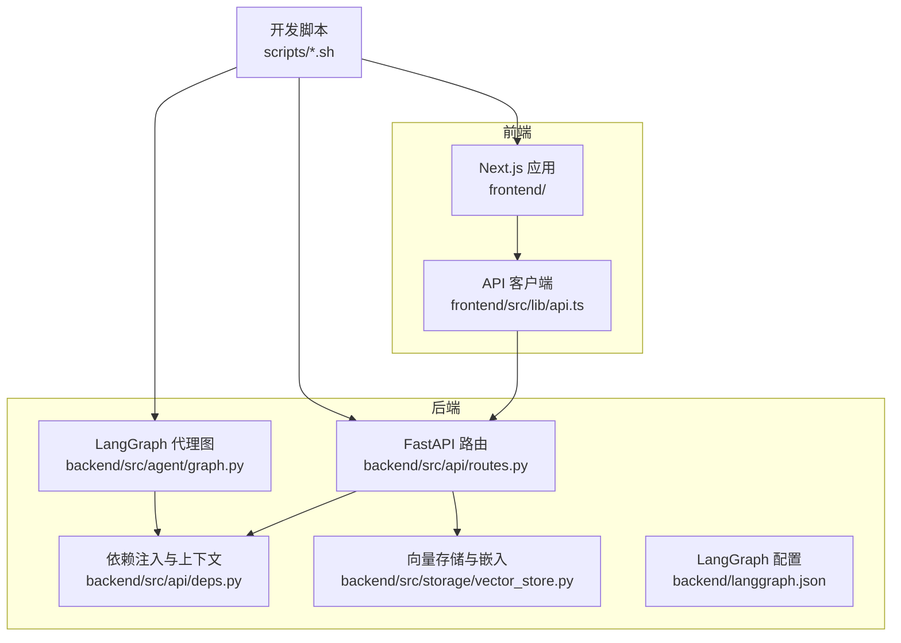
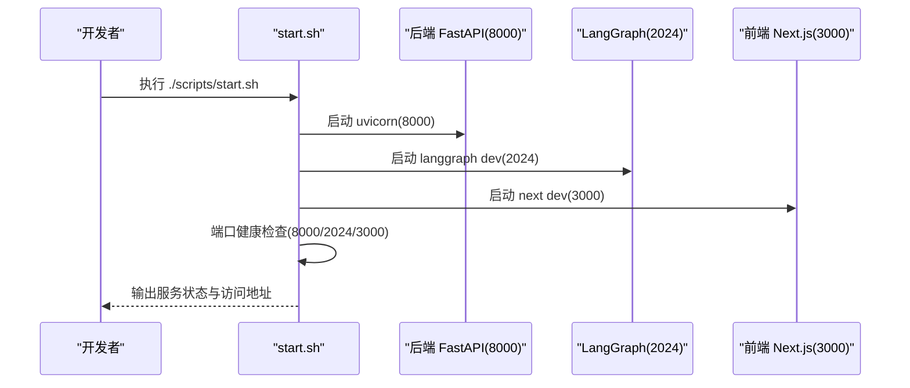
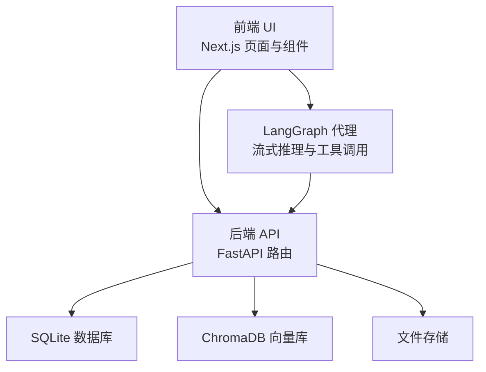

# 快速开始

<cite>
**本文引用的文件**
- [README.md](file://README.md)
- [backend/pyproject.toml](file://backend/pyproject.toml)
- [backend/langgraph.json](file://backend/langgraph.json)
- [backend/src/api/routes.py](file://backend/src/api/routes.py)
- [backend/src/agent/graph.py](file://backend/src/agent/graph.py)
- [backend/src/api/deps.py](file://backend/src/api/deps.py)
- [backend/src/storage/vector_store.py](file://backend/src/storage/vector_store.py)
- [frontend/package.json](file://frontend/package.json)
- [frontend/next.config.ts](file://frontend/next.config.ts)
- [frontend/src/lib/api.ts](file://frontend/src/lib/api.ts)
- [scripts/doctor.sh](file://scripts/doctor.sh)
- [scripts/start.sh](file://scripts/start.sh)
- [scripts/stop.sh](file://scripts/stop.sh)
- [scripts/restart.sh](file://scripts/restart.sh)
</cite>

## 目录
1. [简介](#简介)
2. [项目结构](#项目结构)
3. [前置条件与环境准备](#前置条件与环境准备)
4. [依赖安装](#依赖安装)
5. [环境变量配置](#环境变量配置)
6. [本地开发服务启动](#本地开发服务启动)
7. [健康检查与常见问题排查](#健康检查与常见问题排查)
8. [首次使用操作示例](#首次使用操作示例)
9. [架构概览](#架构概览)
10. [结论](#结论)

## 简介
Train Agent 是一个面向培训领域的智能体产品，当前 MVP 版本聚焦于“工作空间”驱动的知识问答与培训 PPT 生成。本地开发栈由三部分组成：后端 FastAPI、LangGraph 流式代理运行时、前端 Next.js 工作区界面。通过统一的本地脚本，可以一键启动并验证各服务。

## 项目结构
- 后端（Python + FastAPI + LangGraph）位于 backend/，包含 API 路由、代理图、工具与中间件、文档处理与向量存储等模块。
- 前端（Next.js）位于 frontend/，包含页面路由、组件与 API 客户端。
- 开发辅助脚本位于 scripts/，提供健康检查、启动、停止、重启等能力。

图表来源
- [backend/src/api/routes.py:1-189](file://backend/src/api/routes.py#L1-L189)
- [backend/src/agent/graph.py:1-49](file://backend/src/agent/graph.py#L1-L49)
- [backend/src/api/deps.py:1-29](file://backend/src/api/deps.py#L1-L29)
- [backend/src/storage/vector_store.py:1-36](file://backend/src/storage/vector_store.py#L1-L36)
- [backend/langgraph.json:1-9](file://backend/langgraph.json#L1-L9)
- [frontend/src/lib/api.ts:1-196](file://frontend/src/lib/api.ts#L1-L196)
- [scripts/start.sh:1-129](file://scripts/start.sh#L1-L129)

章节来源
- [README.md: 7-40:7-40](file://README.md#L7-L40)

## 前置条件与环境准备
- Python 版本要求：后端项目要求 Python >= 3.12（注意：README 中列出的 pyproject.toml 显示 requires-python = ">=3.12"；而 langgraph.json 指定 python_version: "3.12"）。请确保本地已安装满足要求的 Python。
- Node.js：用于前端 Next.js 开发，脚本会检测 node 是否可用；如需 pnpm 10+，建议使用 Node.js v22+（脚本会在可用时自动切换）。
- Git：用于克隆仓库与版本管理。
- 包管理器：后端使用 uv 进行依赖管理；前端优先使用 pnpm，若未安装则回退到 npm。

章节来源
- [backend/pyproject.toml: 5](file://backend/pyproject.toml#L5)
- [backend/langgraph.json: 2](file://backend/langgraph.json#L2)
- [scripts/start.sh: 40-47:40-47](file://scripts/start.sh#L40-L47)
- [scripts/doctor.sh: 30-41:30-41](file://scripts/doctor.sh#L30-L41)

## 依赖安装
- 后端依赖（uv）：在 backend/ 目录下，使用 uv 安装项目依赖与开发依赖。README 提供了使用 uv 运行测试的示例，表明项目支持 uv 的开发模式。
- 前端依赖（pnpm/npm）：在 frontend/ 目录下，优先使用 pnpm install；若未安装 pnpm，则回退到 npm install。脚本会在首次启动时自动安装前端依赖。

章节来源
- [backend/pyproject.toml: 28-29:28-29](file://backend/pyproject.toml#L28-L29)
- [README.md: 64-71:64-71](file://README.md#L64-L71)
- [scripts/start.sh: 49-54:49-54](file://scripts/start.sh#L49-L54)
- [frontend/package.json: 1-L39:1-39](file://frontend/package.json#L1-L39)

## 环境变量配置
- 复制示例环境文件：
  - 根目录：复制 .env.example 为 .env
  - 后端：复制 backend/.env.example 为 backend/.env
- 关键变量（后端）：
  - DASHSCOPE_API_KEY：调用通义千问相关服务（LLM 与嵌入）所需的密钥。
  - OPENAI_API_BASE：OpenAI 兼容接口地址，默认指向 DashScope 兼容模式。
  - LLM_MODEL：API 服务默认模型；代理图中默认模型可通过 MAIN_MODEL 覆盖。
  - EMBEDDING_MODEL：嵌入模型名称；向量存储使用 DashScope 文本嵌入。
  - DATA_DIR：数据存储根目录（相对 backend/）。
- 关键变量（前端）：
  - NEXT_PUBLIC_API_BASE：后端 API 基础地址，默认 http://localhost:8000。
  - NEXT_PUBLIC_LANGGRAPH_API_URL：LangGraph 服务地址，默认 http://localhost:2024。

章节来源
- [README.md: 43-61:43-61](file://README.md#L43-L61)
- [backend/src/storage/vector_store.py: 19-25:19-25](file://backend/src/storage/vector_store.py#L19-L25)
- [backend/src/agent/graph.py: 18-L24:18-24](file://backend/src/agent/graph.py#L18-L24)
- [frontend/src/lib/api.ts: 1](file://frontend/src/lib/api.ts#L1)
- [backend/langgraph.json: 7](file://backend/langgraph.json#L7)

## 本地开发服务启动
- 启动顺序与端口：
  1) 后端 FastAPI（端口 8000）
  2) LangGraph（端口 2024）
  3) 前端 Next.js（端口 3000）
- 启动方式：
  - 使用脚本一键启动：./scripts/start.sh
  - 健康检查：./scripts/doctor.sh
  - 停止服务：./scripts/stop.sh
  - 重启服务：./scripts/restart.sh
- 启动行为说明：
  - 自动检测 uv、node、pnpm/npm，并在需要时安装前端依赖。
  - 对于 pnpm 10+，若存在 nvm，脚本会尝试切换到 Node.js v22+ 以避免动态导入相关错误。
  - 启动后进行端口健康检查，输出各服务状态与日志位置。

图表来源
- [scripts/start.sh: 56-L82:56-82](file://scripts/start.sh#L56-L82)
- [scripts/start.sh: 86-L128:86-128](file://scripts/start.sh#L86-L128)

章节来源
- [README.md: 7-L13:7-13](file://README.md#L7-L13)
- [scripts/start.sh: 56-L82:56-82](file://scripts/start.sh#L56-L82)
- [scripts/start.sh: 86-L128:86-128](file://scripts/start.sh#L86-L128)

## 健康检查与常见问题排查
- 健康检查命令：./scripts/doctor.sh
  - 检查内容：工具链（uv、node）、包管理器（pnpm/npm）、项目文件、环境文件、Shell 中的 DASHSCOPE_API_KEY、前端 node_modules、端口占用情况。
- 常见问题定位：
  - 缺少工具或文件：根据 doctor.sh 输出补充缺失项。
  - 端口被占用：doctor.sh 会提示端口占用，可释放或调整端口。
  - 前端依赖缺失：doctor.sh 提示缺少 node_modules，按提示在 frontend/ 执行 pnpm install 或 npm install。
  - Node.js 版本不匹配：pnpm 10+ 需要 Node.js v22+，脚本会尝试切换 nvm；若失败，手动升级 Node.js。
  - 启动失败：doctor.sh 会打印对应服务日志文件路径，查看日志定位问题。

章节来源
- [scripts/doctor.sh: 1-L99:1-99](file://scripts/doctor.sh#L1-L99)
- [scripts/start.sh: 86-L128:86-128](file://scripts/start.sh#L86-L128)

## 首次使用操作示例
以下示例基于 README 描述的核心流程，帮助你快速体验核心功能：

- 步骤 1：创建工作空间
  - 在首页创建工作空间，记录返回的工作空间 ID。
- 步骤 2：上传训练文档
  - 在工作空间的文档面板上传训练材料，后台会解析、分块、写入向量库并生成摘要。
- 步骤 3：与智能体对话
  - 在聊天面板发送消息，代理会注入文档摘要到提示词中，并调用工具（如检索、加载技能、保存输出）。
- 步骤 4：生成 PPT
  - 发送 “/ppt 培训主题”，代理加载 PPT 技能，可选进行澄清表单、检索相关文档、生成 PPT 并保存到任务面板，随后可在前端预览与下载。

章节来源
- [README.md: 15-L23:15-23](file://README.md#L15-L23)

## 架构概览
- 后端 API（FastAPI）：提供工作区、文档、任务与文件下载等 REST 接口；启动时初始化数据库。
- LangGraph 代理：作为流式代理运行时，接收聊天面板请求，结合工具与中间件完成推理与执行。
- 前端 Next.js：提供工作区 UI，包含文档、聊天与任务面板，通过 API 客户端与后端交互。

图表来源
- [backend/src/api/routes.py: 30-L35:30-35](file://backend/src/api/routes.py#L30-L35)
- [backend/src/agent/graph.py: 16-L37:16-37](file://backend/src/agent/graph.py#L16-L37)
- [frontend/src/lib/api.ts: 1-L196:1-196](file://frontend/src/lib/api.ts#L1-L196)

## 结论
按照本文档的步骤，你可以完成环境准备、依赖安装、环境变量配置与服务启动，并通过健康检查确认各组件就绪。随后即可按照核心流程体验工作空间创建、文档上传、智能体对话与 PPT 生成等关键功能。遇到问题时，优先使用 doctor.sh 进行诊断，必要时查看对应服务日志文件定位原因。