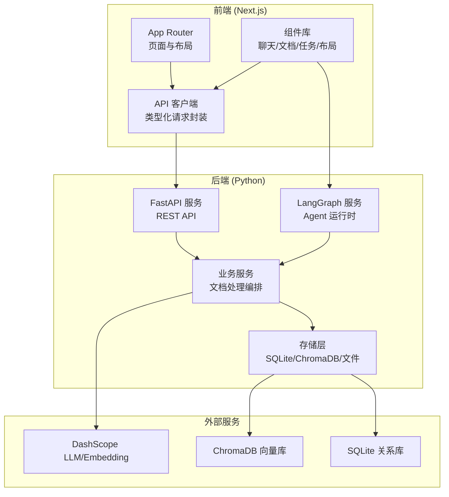
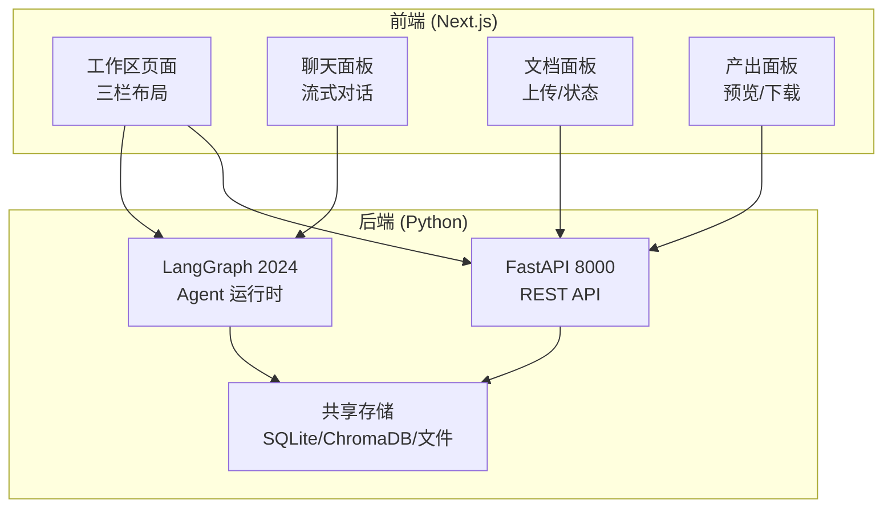
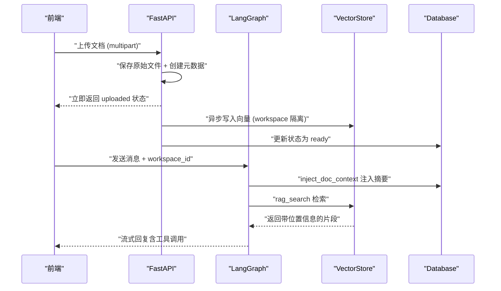
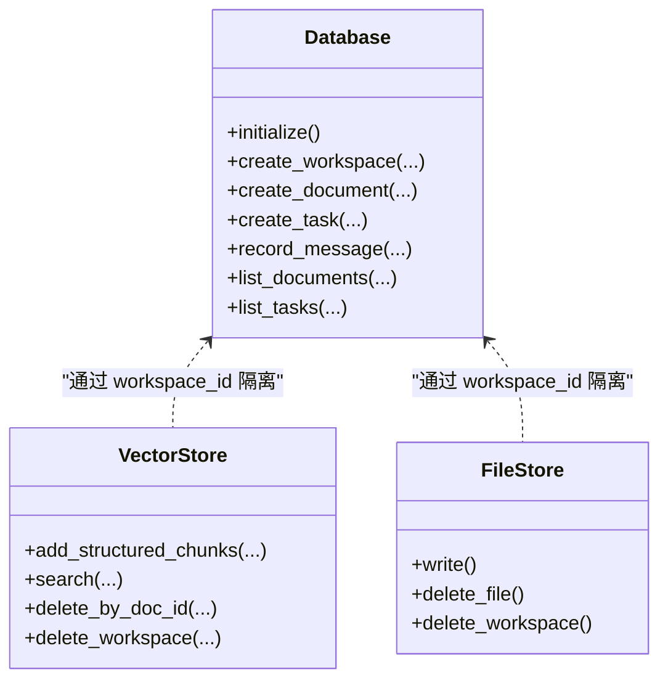
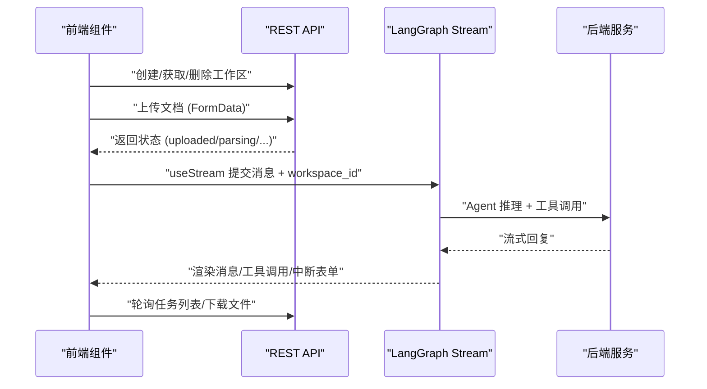
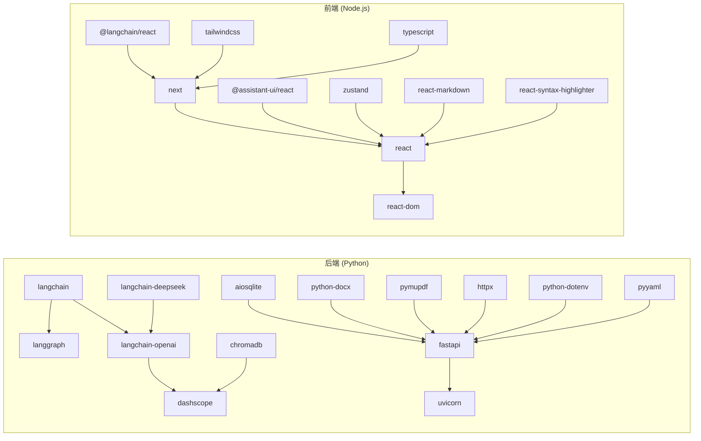

# 技术栈概览

<cite>
**本文档引用的文件**
- [README.md](file://README.md)
- [backend/pyproject.toml](file://backend/pyproject.toml)
- [frontend/package.json](file://frontend/package.json)
- [backend/langgraph.json](file://backend/langgraph.json)
- [docs/backend-architecture.md](file://docs/backend-architecture.md)
- [docs/frontend-architecture.md](file://docs/frontend-architecture.md)
- [backend/src/agent/graph.py](file://backend/src/agent/graph.py)
- [backend/src/storage/vector_store.py](file://backend/src/storage/vector_store.py)
- [backend/src/storage/database.py](file://backend/src/storage/database.py)
- [backend/src/tools/rag_search.py](file://backend/src/tools/rag_search.py)
- [backend/src/agent/skill_manager.py](file://backend/src/agent/skill_manager.py)
- [backend/src/middlewares/inject_doc_context.py](file://backend/src/middlewares/inject_doc_context.py)
- [backend/src/middlewares/logging_middlewares.py](file://backend/src/middlewares/logging_middlewares.py)
- [frontend/src/lib/api.ts](file://frontend/src/lib/api.ts)
- [frontend/src/app/layout.tsx](file://frontend/src/app/layout.tsx)
</cite>

## 目录
1. [简介](#简介)
2. [项目结构](#项目结构)
3. [核心组件](#核心组件)
4. [架构总览](#架构总览)
5. [详细组件分析](#详细组件分析)
6. [依赖分析](#依赖分析)
7. [性能考虑](#性能考虑)
8. [故障排查指南](#故障排查指南)
9. [结论](#结论)
10. [附录](#附录)

## 简介
Train Agent 是一个面向培训领域的智能助手产品，当前 MVP 聚焦于“基于工作区的知识问答”和“培训 PPT 生成”。后端采用 FastAPI + LangGraph + LangChain + DashScope 技术栈，前端采用 Next.js + React + Tailwind CSS 技术栈。整体技术组合围绕“RAG + 技能编排”的核心目标设计，通过双进程架构（FastAPI + LangGraph）实现 REST API 与流式 Agent 推理的职责分离，并以 SQLite、ChromaDB、文件系统构成的存储体系支撑知识抽取、向量化检索与产物管理。

## 项目结构
项目采用前后端分离的双仓库结构，后端包含 API 层、Agent 层、服务层与存储层；前端采用 Next.js App Router，提供工作区、文档、聊天、产出等核心 UI。

图表来源
- [docs/backend-architecture.md](file://docs/backend-architecture.md)
- [docs/frontend-architecture.md](file://docs/frontend-architecture.md)

章节来源
- [README.md](file://README.md)
- [docs/backend-architecture.md](file://docs/backend-architecture.md)
- [docs/frontend-architecture.md](file://docs/frontend-architecture.md)

## 核心组件
- 后端运行时与依赖
  - Python 3.12+（后端 pyproject.toml 要求）
  - Node.js 16.2.6（前端 package.json）
- 后端技术栈
  - Web 框架：FastAPI >= 0.115（异步 REST API）
  - Agent 框架：LangChain >= 1.2 + LangGraph >= 1.1（Agent 编排、中间件、工具注册）
  - LLM 接入：langchain-openai + DashScope（通过 OpenAI 兼容接口调用通义千问系列）
  - 向量数据库：ChromaDB >= 1.0（本地持久化，按 workspace 隔离 collection）
  - 关系数据库：SQLite（aiosqlite 异步，存储 workspace/document/task 元数据）
  - Embedding：DashScope text-embedding-v2
  - 文档解析：PyMuPDF（PDF）、python-docx（DOCX）、langchain-text-splitters（RecursiveCharacterTextSplitter）
- 前端技术栈
  - 框架：Next.js 16（App Router）
  - UI：React 19、Tailwind CSS 4
  - Agent 通信：@langchain/react（useStream）进行 LangGraph 流式对话
  - Markdown：react-markdown + remark-gfm
  - 代码高亮：react-syntax-highlighter（Prism 主题）
  - 状态与工具：Zustand（状态管理）、lucide-react（图标）

章节来源
- [backend/pyproject.toml](file://backend/pyproject.toml)
- [frontend/package.json](file://frontend/package.json)
- [docs/backend-architecture.md](file://docs/backend-architecture.md)
- [docs/frontend-architecture.md](file://docs/frontend-architecture.md)

## 架构总览
后端采用“双进程 + 共享存储”的架构：FastAPI 负责 REST API 与文件操作，LangGraph 负责流式 Agent 推理与工具调用；两者共享 SQLite、ChromaDB、文件系统。前端通过 REST API 管理工作区/文档/任务，通过 LangGraph 流式 API 进行对话与技能交互。

图表来源
- [docs/backend-architecture.md](file://docs/backend-architecture.md)
- [docs/frontend-architecture.md](file://docs/frontend-architecture.md)

## 详细组件分析

### 后端：Agent 与工具链
- Agent 图构建与模型
  - 使用 ChatOpenAI 通过 OpenAI 兼容接口调用 DashScope 的通义千问系列模型，启用 streaming 与 enable_thinking
  - 注册工具与中间件，形成“消息注入 → LLM 推理 → 工具调用 → LLM 继续推理”的循环
- 中间件
  - inject_doc_context：动态注入当前 workspace 的文档摘要到系统提示词
  - patch_tool_call_ids：修复 LLM 返回的空 tool_call id 问题
  - 日志中间件：记录 Agent 前后与模型调用前后状态
- 工具
  - rag_search：基于 ChromaDB 的向量检索，返回带位置信息的片段
  - load_skill：LangChain 渐进式披露技能加载（按需读取技能主提示与参考文件）
  - save_output：创建任务并保存文件至文件系统
  - clarify_form：中断式表单交互，前端提交后恢复 Agent 执行
  - terminal：Shell 命令执行（当前未注册）

图表来源
- [backend/src/agent/graph.py](file://backend/src/agent/graph.py)
- [backend/src/middlewares/inject_doc_context.py](file://backend/src/middlewares/inject_doc_context.py)
- [backend/src/tools/rag_search.py](file://backend/src/tools/rag_search.py)
- [backend/src/storage/vector_store.py](file://backend/src/storage/vector_store.py)
- [backend/src/storage/database.py](file://backend/src/storage/database.py)

章节来源
- [backend/src/agent/graph.py](file://backend/src/agent/graph.py)
- [backend/src/middlewares/inject_doc_context.py](file://backend/src/middlewares/inject_doc_context.py)
- [backend/src/middlewares/logging_middlewares.py](file://backend/src/middlewares/logging_middlewares.py)
- [backend/src/tools/rag_search.py](file://backend/src/tools/rag_search.py)
- [backend/src/agent/skill_manager.py](file://backend/src/agent/skill_manager.py)

### 后端：存储层（SQLite、ChromaDB、文件存储）
- Database（SQLite）
  - 异步 aiosqlite，三张核心表：workspace、document、task
  - 外键级联删除，自动迁移兼容新增列
  - 支持消息记录（用于对话历史与调试）
- VectorStore（ChromaDB）
  - DashscopeEmbeddingFunction 封装 text-embedding-v2
  - 每个 workspace 一个 collection（ws_{workspace_id}），按 doc_id 过滤检索
  - 支持结构化 chunk（携带章节/页码元数据）与批量写入
- FileStore（文件系统）
  - 按 workspace_id 隔离目录，支持同步/异步写入与删除

图表来源
- [backend/src/storage/database.py](file://backend/src/storage/database.py)
- [backend/src/storage/vector_store.py](file://backend/src/storage/vector_store.py)

章节来源
- [backend/src/storage/database.py](file://backend/src/storage/database.py)
- [backend/src/storage/vector_store.py](file://backend/src/storage/vector_store.py)

### 前端：Next.js + React + Tailwind CSS
- 页面与路由
  - 首页：工作区列表（新建/删除）
  - 工作区详情页：三栏布局（文档/聊天/产出）
- 组件架构
  - Assistant Provider：管理 LangGraph 流式连接与中断恢复
  - ChatPanel/Thread：消息渲染、工具调用折叠、引用标记、思考过程
  - DocumentPanel：多文件上传、状态轮询、删除
  - TaskPanel：产出列表、预览、下载、删除
- 通信架构
  - REST API（FastAPI 8000）：工作区/文档/任务 CRUD
  - LangGraph Stream（2024）：Agent 流式对话与中断交互
- UI 设计
  - 暗色主题、卡片/面板/气泡式布局、渐进披露、响应式设计

图表来源
- [frontend/src/lib/api.ts](file://frontend/src/lib/api.ts)
- [docs/frontend-architecture.md](file://docs/frontend-architecture.md)

章节来源
- [frontend/src/lib/api.ts](file://frontend/src/lib/api.ts)
- [docs/frontend-architecture.md](file://docs/frontend-architecture.md)
- [frontend/src/app/layout.tsx](file://frontend/src/app/layout.tsx)

## 依赖分析
- 后端依赖
  - 核心：langchain、langgraph、langgraph-api、langchain-openai、dashscope、fastapi、uvicorn、chromadb、aiosqlite、python-docx、pymupdf、httpx、python-dotenv、pyyaml、langchain-deepseek
  - 开发：pytest、pytest-asyncio、ruff
- 前端依赖
  - 核心：@assistant-ui/react、@assistant-ui/react-langchain、@langchain/react、next、react、react-dom、react-markdown、react-syntax-highlighter、remark-gfm、zustand、lucide-react
  - 开发：@tailwindcss/postcss、@types/node、@types/react、@types/react-dom、@types/react-syntax-highlighter、eslint、tailwindcss、typescript

图表来源
- [backend/pyproject.toml](file://backend/pyproject.toml)
- [frontend/package.json](file://frontend/package.json)

章节来源
- [backend/pyproject.toml](file://backend/pyproject.toml)
- [frontend/package.json](file://frontend/package.json)

## 性能考虑
- 异步文档处理：上传立即返回，后台异步完成解析/分块/索引/摘要，前端轮询状态，降低首屏等待
- 向量检索：ChromaDB 使用余弦相似度，按 workspace 隔离 collection，支持按 doc_id 过滤，提升检索精度与性能
- 批量写入：向量写入默认 batch_size=20，平衡吞吐与内存占用
- 流式对话：LangGraph 与 @langchain/react 的 useStream 提供低延迟的实时交互体验
- 存储隔离：workspace_id 作为维度贯穿文件、向量、元数据，避免跨域扫描，提高检索效率

## 故障排查指南
- 环境变量
  - 后端：DASHSCOPE_API_KEY、OPENAI_API_BASE、LLM_MODEL、EMBEDDING_MODEL、DATA_DIR
  - 前端：NEXT_PUBLIC_API_BASE、NEXT_PUBLIC_LANGGRAPH_API_URL
- 常见问题定位
  - 文档处理卡在某个状态：检查后端日志与数据库状态字段，确认解析/分块/索引/摘要是否成功
  - 向量检索为空：确认 workspace_id 是否正确传入，collection 是否存在，embedding 是否成功
  - Agent 无法恢复中断：确认前端 clarify_form 表单提交后是否调用 resume
  - 前端无法连接 LangGraph：检查 NEXT_PUBLIC_LANGGRAPH_API_URL 与网络连通性
- 日志与中间件
  - 后端中间件提供 before/after 日志，便于定位 Agent 循环与模型调用问题

章节来源
- [docs/backend-architecture.md](file://docs/backend-architecture.md)
- [docs/frontend-architecture.md](file://docs/frontend-architecture.md)

## 结论
Train Agent 的技术栈围绕“RAG + 技能编排”目标进行了精心选型：后端以 FastAPI + LangGraph + LangChain + DashScope 构建高性能、可扩展的智能体系统，结合 SQLite、ChromaDB 与文件系统实现知识抽取与产物管理；前端以 Next.js + React + Tailwind CSS 提供流畅的交互体验与清晰的职责边界。双进程架构与渐进式技能披露进一步提升了系统的可维护性与扩展性。

## 附录
- 运行时与版本要求
  - Python：≥ 3.12（后端 pyproject.toml）
  - Node.js：16.2.6（前端 package.json）
- 关键环境变量
  - 后端：DASHSCOPE_API_KEY、OPENAI_API_BASE、LLM_MODEL、EMBEDDING_MODEL、DATA_DIR
  - 前端：NEXT_PUBLIC_API_BASE、NEXT_PUBLIC_LANGGRAPH_API_URL
- 服务端口
  - FastAPI：8000（REST API）
  - LangGraph：2024（Agent 流式）
  - Next.js：3000（前端 UI）

章节来源
- [backend/pyproject.toml](file://backend/pyproject.toml)
- [frontend/package.json](file://frontend/package.json)
- [README.md](file://README.md)
- [backend/langgraph.json](file://backend/langgraph.json)