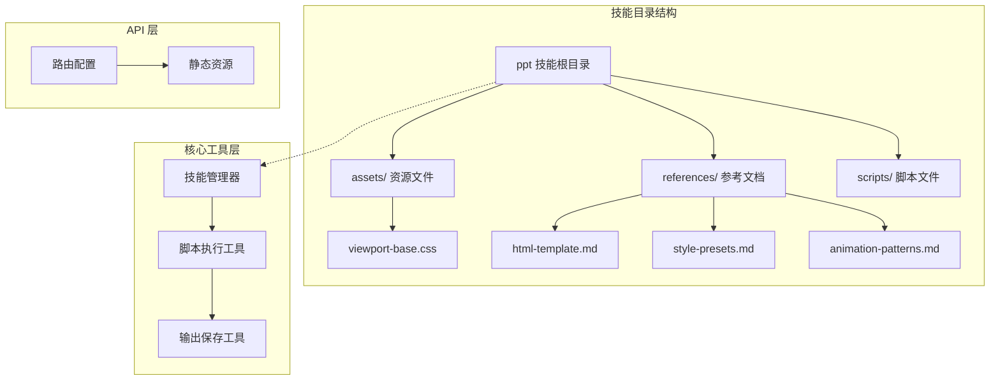
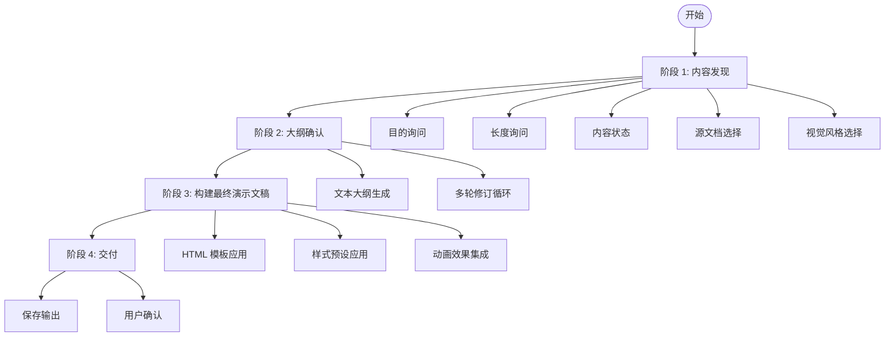
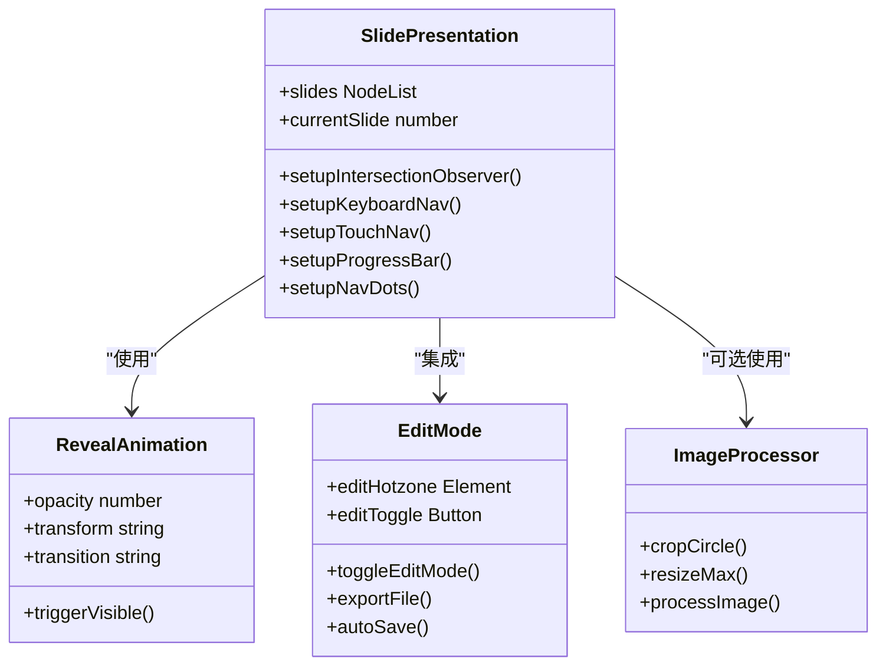
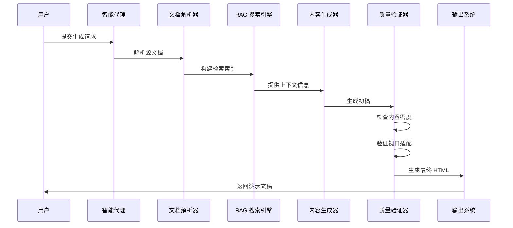
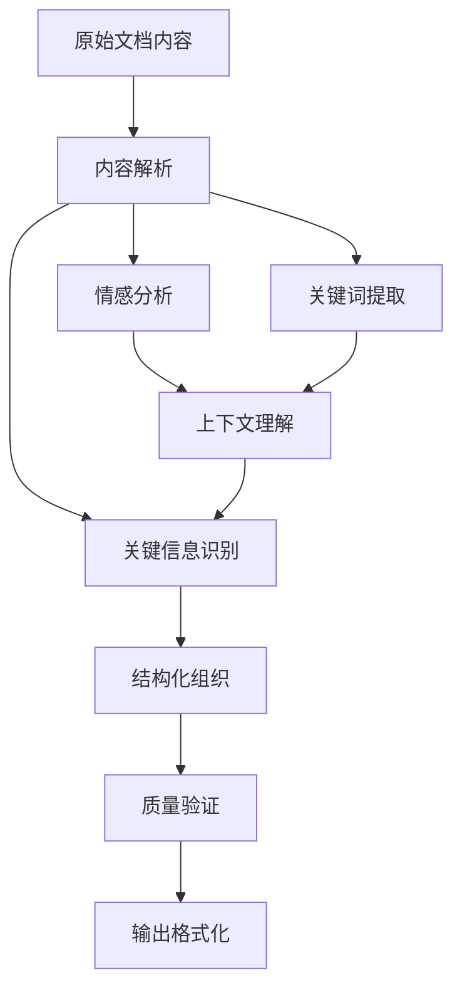
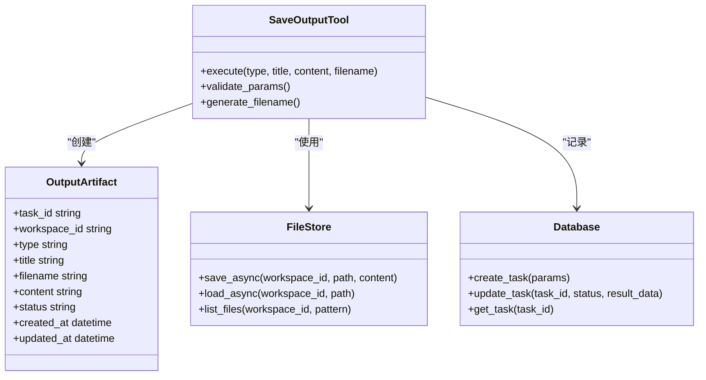
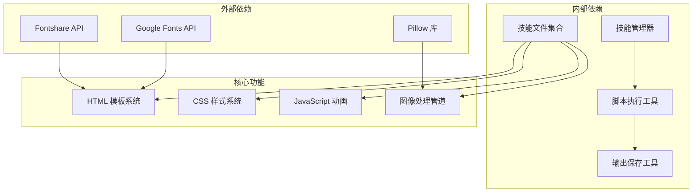

# PPT 生成技能实现

<cite>
**本文档引用的文件**
- [SKILL.md](file://backend/skills/ppt/SKILL.md)
- [viewport-base.css](file://backend/skills/ppt/assets/viewport-base.css)
- [html-template.md](file://backend/skills/ppt/references/html-template.md)
- [style-presets.md](file://backend/skills/ppt/references/style-presets.md)
- [animation-patterns.md](file://backend/skills/ppt/references/animation-patterns.md)
- [skill_manager.py](file://backend/src/agent/skill_manager.py)
- [run_skill_script.py](file://backend/src/tools/run_skill_script.py)
- [save_output.py](file://backend/src/tools/save_output.py)
- [routes.py](file://backend/src/api/routes.py)
- [04-ppt-command.md](file://user-story/04-ppt-command.md)
- [2026-05-27-train-agent-implementation.md](file://plans/2026-05-27-train-agent-implementation.md)
</cite>

## 目录
1. [简介](#简介)
2. [项目结构](#项目结构)
3. [核心组件](#核心组件)
4. [架构概览](#架构概览)
5. [详细组件分析](#详细组件分析)
6. [依赖关系分析](#依赖关系分析)
7. [性能考虑](#性能考虑)
8. [故障排除指南](#故障排除指南)
9. [结论](#结论)
10. [附录](#附录)

## 简介

PPT 生成技能是一个基于文档内容自动生成演示文稿的智能系统。该系统能够从知识库文档中提取信息，通过结构化组织和精心设计的视觉方案，生成零依赖的单文件 HTML 演示文稿。系统采用严格的视口适配规则，确保每页幻灯片精确填充 100vh，同时提供丰富的动画效果和交互体验。

该技能的核心设计理念包括：
- **零依赖**：单个 HTML 文件包含内联 CSS/JS，无需外部构建工具
- **单步决策**：一次性收集所有必要选择，直接生成最终交付物
- **独特设计**：避免通用的"AI 垃圾"美学，追求定制化的视觉体验
- **视口适配**：严格遵守 100vh 视口规则，禁止滑块内滚动

## 项目结构

PPT 生成技能的项目结构遵循清晰的模块化设计：



**图表来源**
- [SKILL.md:1-269](file://backend/skills/ppt/SKILL.md#L1-L269)
- [skill_manager.py:1-117](file://backend/src/agent/skill_manager.py#L1-L117)
- [routes.py:177-188](file://backend/src/api/routes.py#L177-L188)

**章节来源**
- [SKILL.md:1-269](file://backend/skills/ppt/SKILL.md#L1-L269)
- [skill_manager.py:1-117](file://backend/src/agent/skill_manager.py#L1-L117)
- [routes.py:177-188](file://backend/src/api/routes.py#L177-L188)

## 核心组件

### 技能配置与工作流

PPT 技能采用四阶段工作流设计，每个阶段都有明确的目标和约束：



**图表来源**
- [SKILL.md:66-260](file://backend/skills/ppt/SKILL.md#L66-L260)

### 视觉设计系统

系统提供 12 种精心设计的视觉预设，每种预设都包含完整的色彩方案、字体搭配和标志性元素：

| 预设名称 | 主题特性 | 色彩方案 | 字体搭配 | 标志性元素 |
|---------|---------|---------|---------|-----------|
| Swiss Modern | 清晰、精确、包豪斯风格 | 纯白、纯黑、红色强调 | Archivo 800 + Nunito 400 | 可见网格、不对称布局 |
| Bold Signal | 自信、大胆、现代 | 深灰背景 + 橙色强调 | Archivo Black 900 + Space Grotesk | 彩色卡片、大编号 |
| Electric Studio | 大胆、干净、专业 | 深色背景 + 蓝色强调 | Manrope 800 + Manrope 400 | 分割面板、强调条 |
| Creative Voltage | 创意、充满活力 | 电蓝色背景 + 黄色强调 | Syne 700/800 + Space Mono | 半色调纹理、霓虹徽章 |

**章节来源**
- [style-presets.md:1-348](file://backend/skills/ppt/references/style-presets.md#L1-L348)

### 内容密度限制

系统对每种幻灯片类型的容量进行了严格限制，确保内容的可读性和视觉平衡：

| 幻灯片类型 | 最大内容容量 | 设计要点 |
|-----------|-------------|---------|
| 标题页 | 1 个标题 + 1 个副标题 + 可选标语 | 简洁有力，突出主题 |
| 内容页 | 1 个标题 + 4-6 个要点 或 1 个标题 + 2 段文字 | 保持信息密度适中 |
| 功能网格 | 1 个标题 + 最多 6 个卡片 (2x3 或 3x2) | 网格布局，信息层次清晰 |
| 代码页 | 1 个标题 + 8-10 行代码 | 代码高亮，语法正确 |
| 引用页 | 1 条引用 (最多 3 行) + 来源标注 | 强调核心观点 |
| 图像页 | 1 个标题 + 1 张图像 (最大 60vh 高度) | 图像质量优先 |

**章节来源**
- [SKILL.md:51-62](file://backend/skills/ppt/SKILL.md#L51-L62)

## 架构概览

PPT 生成技能采用分层架构设计，确保各组件职责清晰、耦合度低：

```mermaid
graph TB
subgraph "用户界面层"
Chat[聊天界面]
Command[/ppt 命令]
Form[澄清表单]
end
subgraph "业务逻辑层"
Agent[智能代理]
Manager[技能管理器]
Parser[文档解析器]
RAG[RAG 搜索引擎]
end
subgraph "数据处理层"
Storage[存储服务]
Vector[向量存储]
Database[数据库]
end
subgraph "输出层"
HTML[HTML 生成器]
CSS[样式处理器]
JS[JavaScript 编译器]
FileStore[文件存储]
end
Chat --> Agent
Command --> Agent
Form --> Agent
Agent --> Manager
Agent --> Parser
Agent --> RAG
Parser --> Storage
RAG --> Vector
RAG --> Database
Agent --> HTML
HTML --> CSS
CSS --> JS
JS --> FileStore
```

**图表来源**
- [SKILL.md:1-269](file://backend/skills/ppt/SKILL.md#L1-L269)
- [skill_manager.py:1-117](file://backend/src/agent/skill_manager.py#L1-L117)
- [run_skill_script.py:1-143](file://backend/src/tools/run_skill_script.py#L1-L143)

## 详细组件分析

### HTML 模板系统

HTML 模板系统是 PPT 生成的核心基础，提供了完整的结构框架和交互功能：



**图表来源**
- [html-template.md:119-157](file://backend/skills/ppt/references/html-template.md#L119-L157)
- [html-template.md:236-318](file://backend/skills/ppt/references/html-template.md#L236-L318)

#### 视口适配核心规则

系统实现了严格的视口适配机制，确保在各种设备上的一致表现：

```mermaid
flowchart TD
Viewport[视口检测] --> Height[高度检查]
Height --> |≥ 700px| Normal[正常模式]
Height --> |600-700px| Compact[紧凑模式]
Height --> |< 600px| Minimal[极简模式]
Normal --> Typography[正常排版]
Normal --> Elements[完整元素]
Compact --> ReducedTypography[减少排版]
Compact --> HiddenElements[隐藏元素]
Minimal --> MinimalTypography[最小排版]
Minimal --> EssentialElements[仅保留元素]
Typography --> Responsive[响应式缩放]
ReducedTypography --> Responsive
MinimalTypography --> Responsive
Elements --> Clamp[clamp() 缩放]
HiddenElements --> Clamp
EssentialElements --> Clamp
```

**图表来源**
- [viewport-base.css:94-126](file://backend/skills/ppt/assets/viewport-base.css#L94-L126)

**章节来源**
- [viewport-base.css:1-154](file://backend/skills/ppt/assets/viewport-base.css#L1-L154)
- [html-template.md:1-420](file://backend/skills/ppt/references/html-template.md#L1-L420)

### 动画效果系统

动画系统提供了丰富的情感表达和视觉层次：

| 情感类型 | 动画效果 | 视觉线索 | 适用场景 |
|---------|---------|---------|---------|
| 戏剧性/电影感 | 慢速淡入 (1-1.5s)，大尺度过渡 | 深色背景、聚光灯效果、全屏图像 | 重要观点强调 |
| 科技感/未来感 | 荧光辉光、故障/乱码文本、网格揭示 | 粒子系统、网格图案、等宽字体强调 | 科技主题演示 |
| 亲和/友好 | 弹跳缓动、漂浮/摆动 | 圆角、柔和色彩、手绘元素 | 教育培训场景 |
| 专业/企业 | 微妙快速动画 (200-300ms)，简洁页面 | 深蓝/深灰、精确间距、数据可视化 | 商务汇报 |

**章节来源**
- [animation-patterns.md:1-111](file://backend/skills/ppt/references/animation-patterns.md#L1-L111)

### 内容生成算法

内容生成过程采用多阶段算法设计，确保输出质量和一致性：



**图表来源**
- [SKILL.md:137-229](file://backend/skills/ppt/SKILL.md#L137-L229)

#### 段落识别与要点提取

系统采用智能的内容分析算法，自动识别文档中的关键信息：



**图表来源**
- [SKILL.md:154-187](file://backend/skills/ppt/SKILL.md#L154-L187)

**章节来源**
- [SKILL.md:66-229](file://backend/skills/ppt/SKILL.md#L66-L229)

### 输出管理系统

输出管理采用统一的工件保存机制，确保文件的可靠存储和追踪：



**图表来源**
- [save_output.py:13-59](file://backend/src/tools/save_output.py#L13-L59)

**章节来源**
- [save_output.py:1-99](file://backend/src/tools/save_output.py#L1-L99)

## 依赖关系分析

PPT 生成技能的依赖关系体现了清晰的分层设计：



**图表来源**
- [html-template.md:324-348](file://backend/skills/ppt/references/html-template.md#L324-L348)
- [skill_manager.py:63-82](file://backend/src/agent/skill_manager.py#L63-L82)

**章节来源**
- [skill_manager.py:1-117](file://backend/src/agent/skill_manager.py#L1-L117)
- [run_skill_script.py:1-143](file://backend/src/tools/run_skill_script.py#L1-L143)

## 性能考虑

系统在多个层面考虑了性能优化：

### 响应式性能优化

- **视口单位优化**：使用 `vh`、`vw` 单位替代固定像素值
- **CSS 函数优化**：采用 `clamp()` 实现平滑的响应式缩放
- **媒体查询优化**：针对不同屏幕尺寸提供专门的样式优化

### 运行时性能优化

- **Intersection Observer**：使用现代浏览器 API 实现高效的可见性检测
- **CSS 动画优先**：优先使用 GPU 加速的 CSS 变换而非 JavaScript 动画
- **懒加载策略**：图片和重资源按需加载

### 内存管理

- **对象池模式**：复用 DOM 元素和动画对象
- **事件委托**：减少事件监听器数量
- **垃圾回收优化**：及时清理不再使用的变量和引用

## 故障排除指南

### 常见问题诊断

| 问题类型 | 症状 | 可能原因 | 解决方案 |
|---------|------|---------|---------|
| 字体加载失败 | 文档显示系统字体 | Fontshare/Google Fonts URL 错误 | 检查网络连接，验证字体名称 |
| 动画不触发 | 元素无动画效果 | Intersection Observer 未运行 | 确认 JS 初始化完成，检查 .visible 类 |
| 滚动吸附失效 | 页面无法正确滚动 | html 上 scroll-snap-type 设置错误 | 确保在 html 元素上设置强制滚动吸附 |
| 移动端异常 | 触摸事件不响应 | 缺少触摸事件处理 | 检查触摸导航初始化，测试手势识别 |

### 调试工具

系统提供了多种调试辅助功能：

- **编辑模式热区**：左上角 80x80px 区域用于激活编辑模式
- **键盘快捷键**：按 E 键切换编辑模式，Ctrl+S 保存当前状态
- **本地存储**：自动保存编辑进度到 localStorage
- **导出功能**：一键导出干净的 HTML 文件，移除编辑状态

**章节来源**
- [animation-patterns.md:102-111](file://backend/skills/ppt/references/animation-patterns.md#L102-L111)
- [html-template.md:191-318](file://backend/skills/ppt/references/html-template.md#L191-L318)

## 结论

PPT 生成技能通过精心设计的架构和严格的实现规范，成功地将复杂的演示文稿生成过程简化为直观易用的用户体验。系统的核心优势体现在：

1. **一致性保证**：通过严格的视口适配规则和内容密度限制，确保所有生成的演示文稿具有一致的视觉质量和用户体验。

2. **灵活性设计**：12 种视觉预设提供了丰富的设计选择，同时保持了系统的可扩展性。

3. **质量控制**：多阶段的质量验证机制确保输出内容符合预期标准。

4. **用户体验**：零依赖的单文件输出和强大的编辑功能提升了用户的创作体验。

该系统为未来的功能扩展奠定了坚实的基础，包括支持更多视觉风格、增强交互效果、集成更多内容源等可能性。

## 附录

### 扩展开发指南

#### 自定义模板开发

要开发新的 HTML 模板，需要遵循以下步骤：

1. **模板结构**：参考现有模板的结构，确保包含必要的容器和类名
2. **样式集成**：集成 viewport-base.css 的核心样式规则
3. **动画适配**：确保动画效果与新模板的视觉风格协调
4. **测试验证**：在多种设备和浏览器上测试模板的兼容性

#### 样式定制

样式定制可以通过以下方式进行：

- **CSS 变量覆盖**：通过修改 :root 中的 CSS 变量来自定义颜色和间距
- **字体替换**：使用 Fontshare 或 Google Fonts 提供的字体
- **动画效果**：根据需要调整动画持续时间和缓动函数

#### 功能增强

潜在的功能增强方向包括：

- **多语言支持**：扩展国际化能力
- **主题切换**：动态主题切换功能
- **协作编辑**：多人实时协作编辑
- **版本管理**：演示文稿版本控制和历史记录

**章节来源**
- [SKILL.md:261-269](file://backend/skills/ppt/SKILL.md#L261-L269)
- [html-template.md:394-420](file://backend/skills/ppt/references/html-template.md#L394-L420)