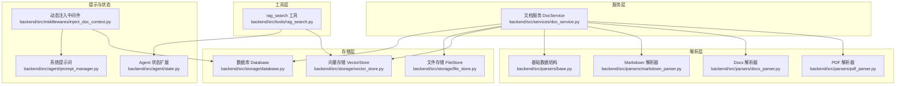
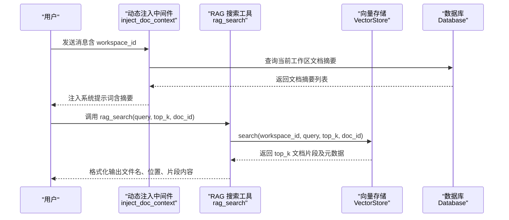
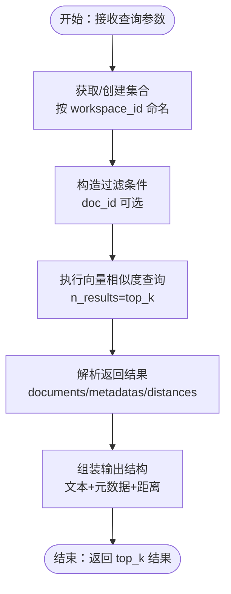
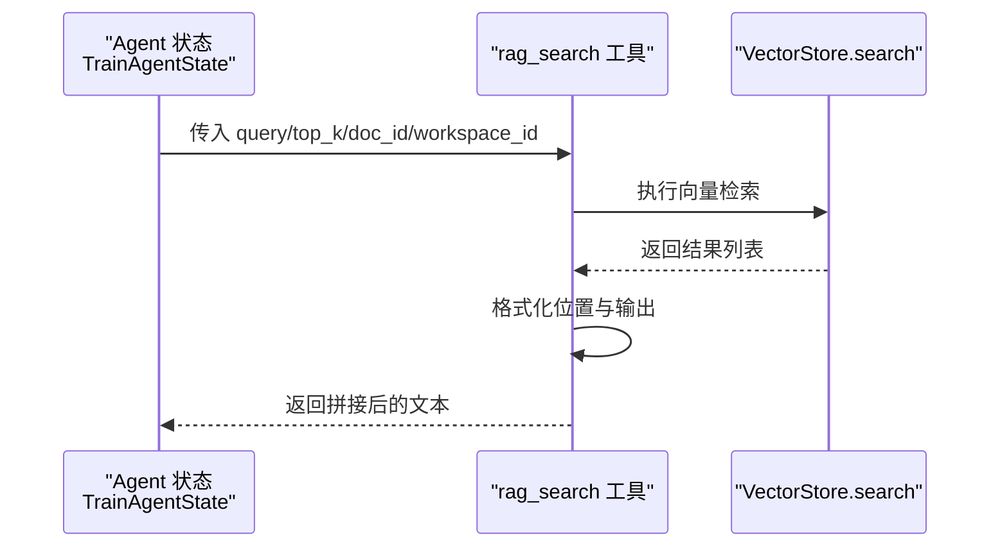
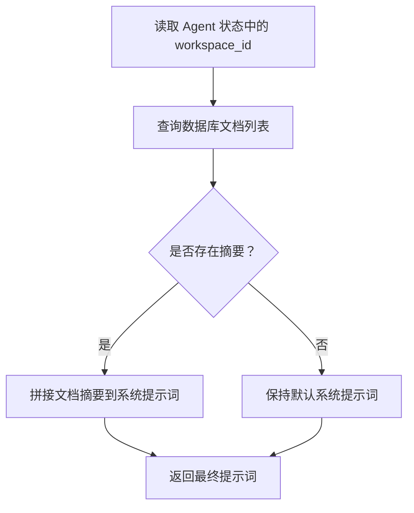
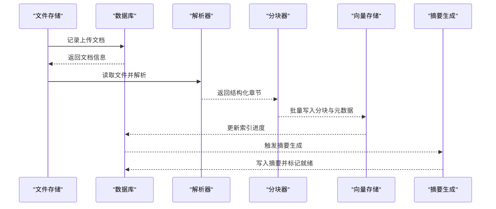
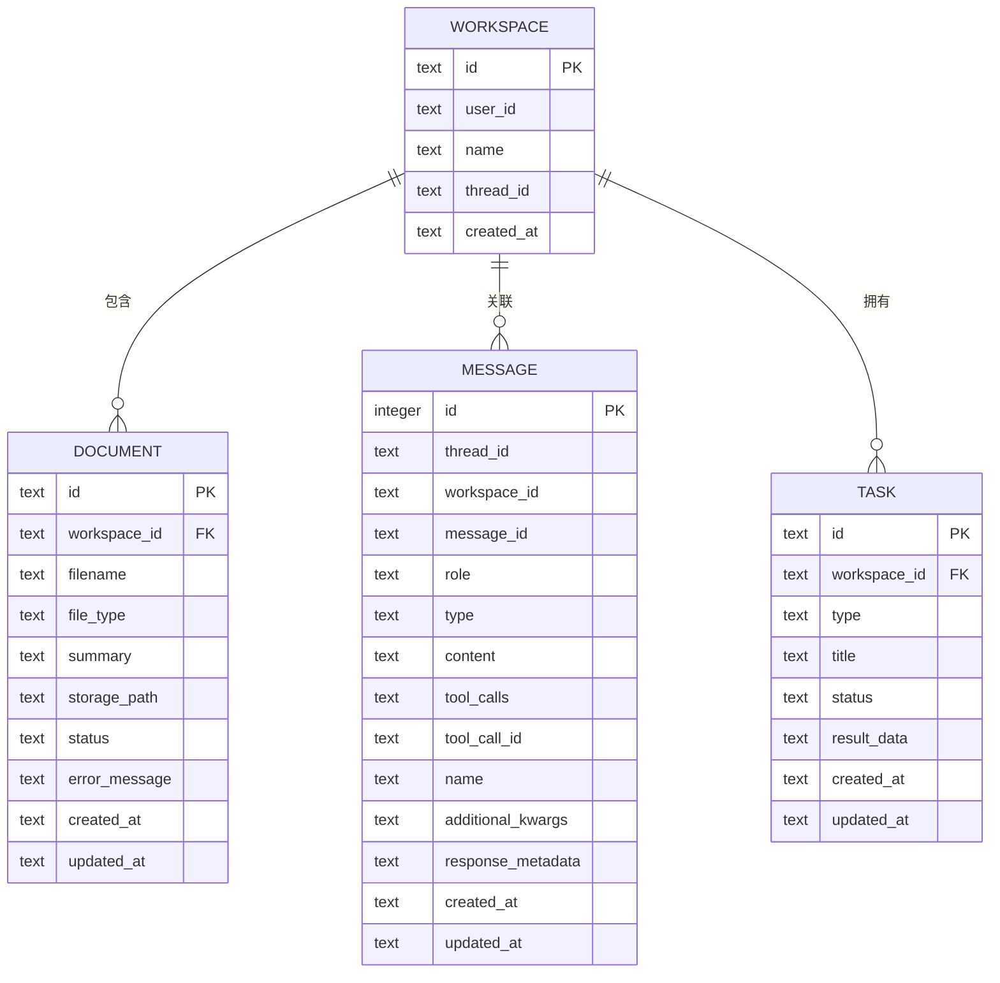
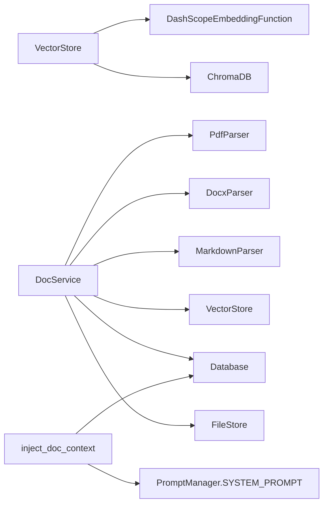

# RAG 检索增强生成机制

<cite>
**本文引用的文件**
- [backend/src/tools/rag_search.py](file://backend/src/tools/rag_search.py)
- [backend/src/storage/vector_store.py](file://backend/src/storage/vector_store.py)
- [backend/src/middlewares/inject_doc_context.py](file://backend/src/middlewares/inject_doc_context.py)
- [backend/src/agent/prompt_manager.py](file://backend/src/agent/prompt_manager.py)
- [backend/src/services/doc_service.py](file://backend/src/services/doc_service.py)
- [backend/src/parsers/base.py](file://backend/src/parsers/base.py)
- [backend/src/parsers/pdf_parser.py](file://backend/src/parsers/pdf_parser.py)
- [backend/src/parsers/markdown_parser.py](file://backend/src/parsers/markdown_parser.py)
- [backend/src/parsers/docx_parser.py](file://backend/src/parsers/docx_parser.py)
- [backend/src/storage/database.py](file://backend/src/storage/database.py)
- [backend/src/storage/file_store.py](file://backend/src/storage/file_store.py)
- [backend/src/agent/state.py](file://backend/src/agent/state.py)
- [backend/pyproject.toml](file://backend/pyproject.toml)
</cite>

## 目录
1. [简介](#简介)
2. [项目结构](#项目结构)
3. [核心组件](#核心组件)
4. [架构总览](#架构总览)
5. [详细组件分析](#详细组件分析)
6. [依赖分析](#依赖分析)
7. [性能考虑](#性能考虑)
8. [故障排查指南](#故障排查指南)
9. [结论](#结论)
10. [附录](#附录)

## 简介
本文件面向 RAG（检索增强生成）机制的技术文档，系统阐述“向量检索、上下文注入与生成式回答”的完整流程。重点覆盖：
- 向量数据库的查询策略、相似度计算与结果排序机制
- 提示词工程在 RAG 中的作用，包括上下文片段的选择、格式化与注入策略
- RAG 搜索工具的实现细节：查询预处理、向量相似度搜索与结果后处理
- 性能优化实践：索引策略、缓存机制与查询优化
- 多场景应用示例与最佳实践

## 项目结构
后端以功能域划分模块，RAG 相关能力主要分布在以下模块：
- 工具层：RAG 搜索工具
- 存储层：向量存储、文件存储、数据库
- 解析层：PDF、Word、Markdown 结构化解析
- 服务层：文档处理流水线（解析 → 分块 → 向量化 → 索引 → 摘要）
- 中间件层：系统提示词动态注入（包含知识库文档摘要）
- 状态与提示词：LangGraph Agent 状态扩展与系统提示词模板

图表来源
- [backend/src/tools/rag_search.py:40-76](file://backend/src/tools/rag_search.py#L40-L76)
- [backend/src/storage/vector_store.py:39-177](file://backend/src/storage/vector_store.py#L39-L177)
- [backend/src/services/doc_service.py:13-218](file://backend/src/services/doc_service.py#L13-L218)
- [backend/src/parsers/pdf_parser.py:17-192](file://backend/src/parsers/pdf_parser.py#L17-L192)
- [backend/src/parsers/docx_parser.py:20-84](file://backend/src/parsers/docx_parser.py#L20-L84)
- [backend/src/parsers/markdown_parser.py:13-62](file://backend/src/parsers/markdown_parser.py#L13-L62)
- [backend/src/parsers/base.py:6-97](file://backend/src/parsers/base.py#L6-L97)
- [backend/src/middlewares/inject_doc_context.py:11-41](file://backend/src/middlewares/inject_doc_context.py#L11-L41)
- [backend/src/agent/prompt_manager.py:1-37](file://backend/src/agent/prompt_manager.py#L1-L37)
- [backend/src/agent/state.py:4-7](file://backend/src/agent/state.py#L4-L7)

章节来源
- [backend/src/tools/rag_search.py:1-76](file://backend/src/tools/rag_search.py#L1-L76)
- [backend/src/storage/vector_store.py:1-177](file://backend/src/storage/vector_store.py#L1-L177)
- [backend/src/services/doc_service.py:1-218](file://backend/src/services/doc_service.py#L1-L218)
- [backend/src/parsers/pdf_parser.py:1-192](file://backend/src/parsers/pdf_parser.py#L1-L192)
- [backend/src/parsers/docx_parser.py:1-84](file://backend/src/parsers/docx_parser.py#L1-L84)
- [backend/src/parsers/markdown_parser.py:1-62](file://backend/src/parsers/markdown_parser.py#L1-L62)
- [backend/src/parsers/base.py:1-97](file://backend/src/parsers/base.py#L1-L97)
- [backend/src/middlewares/inject_doc_context.py:1-41](file://backend/src/middlewares/inject_doc_context.py#L1-L41)
- [backend/src/agent/prompt_manager.py:1-37](file://backend/src/agent/prompt_manager.py#L1-L37)
- [backend/src/agent/state.py:1-7](file://backend/src/agent/state.py#L1-L7)

## 核心组件
- RAG 搜索工具：封装查询参数、调用向量存储检索、格式化输出
- 向量存储：ChromaDB 客户端、DashScope 嵌入函数、集合命名与元数据字段
- 文档服务：解析 → 分块 → 向量化 → 索引 → 摘要 → 状态更新
- 解析器：PDF/Docx/Markdown 的结构化解析，提取章节、层级、页码
- 数据库：工作区、文档、消息、任务的持久化
- 文件存储：本地文件保存与清理
- 动态注入中间件：将知识库文档摘要注入系统提示词
- 系统提示词：定义回答规范、引用规范、技能使用指引
- Agent 状态：扩展 workspace_id 上下文

章节来源
- [backend/src/tools/rag_search.py:40-76](file://backend/src/tools/rag_search.py#L40-L76)
- [backend/src/storage/vector_store.py:39-177](file://backend/src/storage/vector_store.py#L39-L177)
- [backend/src/services/doc_service.py:13-218](file://backend/src/services/doc_service.py#L13-L218)
- [backend/src/parsers/base.py:6-97](file://backend/src/parsers/base.py#L6-L97)
- [backend/src/storage/database.py:9-379](file://backend/src/storage/database.py#L9-L379)
- [backend/src/storage/file_store.py:6-39](file://backend/src/storage/file_store.py#L6-L39)
- [backend/src/middlewares/inject_doc_context.py:11-41](file://backend/src/middlewares/inject_doc_context.py#L11-L41)
- [backend/src/agent/prompt_manager.py:1-37](file://backend/src/agent/prompt_manager.py#L1-L37)
- [backend/src/agent/state.py:4-7](file://backend/src/agent/state.py#L4-L7)

## 架构总览
RAG 流程分为“离线构建”和“在线检索-生成”两大阶段：
- 离线构建：解析文档 → 结构化分块 → 向量化嵌入 → 写入向量库 → 生成摘要并入库
- 在线检索：用户输入 → 动态注入知识库摘要 → 调用 RAG 搜索工具 → 向量相似度检索 → 结果格式化 → 交给模型生成答案

图表来源
- [backend/src/middlewares/inject_doc_context.py:11-41](file://backend/src/middlewares/inject_doc_context.py#L11-L41)
- [backend/src/storage/database.py:313-319](file://backend/src/storage/database.py#L313-L319)
- [backend/src/tools/rag_search.py:40-76](file://backend/src/tools/rag_search.py#L40-L76)
- [backend/src/storage/vector_store.py:124-163](file://backend/src/storage/vector_store.py#L124-L163)

## 详细组件分析

### 向量检索与相似度排序
- 集合命名与空间：每个工作区一个集合，使用余弦距离空间
- 查询接口：支持按 doc_id 过滤、top_k 返回、读取元数据（章节、页码、块索引等）
- 元数据字段：用于后续格式化与溯源
- 相似度与排序：ChromaDB 返回距离数组，越小越相似

图表来源
- [backend/src/storage/vector_store.py:44-49](file://backend/src/storage/vector_store.py#L44-L49)
- [backend/src/storage/vector_store.py:124-163](file://backend/src/storage/vector_store.py#L124-L163)

章节来源
- [backend/src/storage/vector_store.py:13-37](file://backend/src/storage/vector_store.py#L13-L37)
- [backend/src/storage/vector_store.py:39-177](file://backend/src/storage/vector_store.py#L39-L177)

### RAG 搜索工具实现细节
- 输入参数：query、top_k、doc_id（可选）、从 Agent 状态读取 workspace_id
- 查询流程：调用向量存储 search，异常捕获与空结果处理
- 输出格式：逐条格式化“文件名 | 位置 | 片段内容”，位置由章节/页码/块索引组合生成
- 位置格式化规则：优先章节>节，其次节或章，最后页码；若均无则显示块序号

图表来源
- [backend/src/tools/rag_search.py:40-76](file://backend/src/tools/rag_search.py#L40-L76)
- [backend/src/storage/vector_store.py:124-163](file://backend/src/storage/vector_store.py#L124-L163)
- [backend/src/agent/state.py:4-7](file://backend/src/agent/state.py#L4-L7)

章节来源
- [backend/src/tools/rag_search.py:1-76](file://backend/src/tools/rag_search.py#L1-L76)

### 提示词工程与上下文注入
- 系统提示词：定义角色、职责、回答规范、引用规范、场景限定与技能使用
- 动态注入：根据工作区文档生成摘要，追加到系统提示词末尾，供模型参考
- 文档摘要来源：数据库查询当前工作区文档列表及其摘要字段

图表来源
- [backend/src/middlewares/inject_doc_context.py:11-41](file://backend/src/middlewares/inject_doc_context.py#L11-L41)
- [backend/src/storage/database.py:313-319](file://backend/src/storage/database.py#L313-L319)
- [backend/src/agent/prompt_manager.py:1-37](file://backend/src/agent/prompt_manager.py#L1-L37)

章节来源
- [backend/src/middlewares/inject_doc_context.py:1-41](file://backend/src/middlewares/inject_doc_context.py#L1-L41)
- [backend/src/agent/prompt_manager.py:1-37](file://backend/src/agent/prompt_manager.py#L1-L37)
- [backend/src/storage/database.py:313-319](file://backend/src/storage/database.py#L313-L319)

### 文档处理流水线（离线构建）
- 解析：根据文件类型选择解析器，提取结构化章节与页码
- 分块：递归字符分割，控制最大块大小与重叠，保留章节/页码元数据
- 向量化与索引：批量写入向量库，元数据包含文档 ID、文件名、块索引、章节/页码等
- 摘要：生成文档摘要并回写数据库
- 状态管理：记录处理进度与错误信息

图表来源
- [backend/src/services/doc_service.py:57-130](file://backend/src/services/doc_service.py#L57-L130)
- [backend/src/parsers/pdf_parser.py:20-35](file://backend/src/parsers/pdf_parser.py#L20-L35)
- [backend/src/parsers/docx_parser.py:23-83](file://backend/src/parsers/docx_parser.py#L23-L83)
- [backend/src/parsers/markdown_parser.py:16-61](file://backend/src/parsers/markdown_parser.py#L16-L61)
- [backend/src/parsers/base.py:47-97](file://backend/src/parsers/base.py#L47-L97)
- [backend/src/storage/vector_store.py:91-122](file://backend/src/storage/vector_store.py#L91-L122)

章节来源
- [backend/src/services/doc_service.py:13-218](file://backend/src/services/doc_service.py#L13-L218)
- [backend/src/parsers/base.py:6-97](file://backend/src/parsers/base.py#L6-L97)

### 数据模型与元数据
- 文档元数据：doc_id、filename、chunk_index、section_title、chapter_title、page_start、page_end、section_level
- 向量库集合：按 workspace_id 命名，使用余弦距离空间
- 数据库表：document、message、workspace、task

图表来源
- [backend/src/storage/database.py:25-78](file://backend/src/storage/database.py#L25-L78)
- [backend/src/storage/database.py:285-311](file://backend/src/storage/database.py#L285-L311)

章节来源
- [backend/src/storage/database.py:9-379](file://backend/src/storage/database.py#L9-L379)
- [backend/src/storage/vector_store.py:44-49](file://backend/src/storage/vector_store.py#L44-L49)
- [backend/src/parsers/base.py:18-42](file://backend/src/parsers/base.py#L18-L42)

## 依赖分析
- 向量嵌入：DashScope 文本嵌入 API，环境变量控制模型与密钥
- 向量库：ChromaDB 持久化客户端，集合命名与空间配置
- 解析器：PyMuPDF（PDF）、python-docx（Docx）、正则（Markdown）
- 数据库：aiosqlite 异步 SQLite
- 文件存储：本地路径操作
- 语言模型：LangChain Core（摘要生成）

图表来源
- [backend/src/storage/vector_store.py:13-37](file://backend/src/storage/vector_store.py#L13-L37)
- [backend/src/services/doc_service.py:14-27](file://backend/src/services/doc_service.py#L14-L27)
- [backend/src/middlewares/inject_doc_context.py:11-41](file://backend/src/middlewares/inject_doc_context.py#L11-L41)
- [backend/src/agent/prompt_manager.py:1-37](file://backend/src/agent/prompt_manager.py#L1-L37)

章节来源
- [backend/src/storage/vector_store.py:1-11](file://backend/src/storage/vector_store.py#L1-L11)
- [backend/src/services/doc_service.py:1-11](file://backend/src/services/doc_service.py#L1-L11)
- [backend/pyproject.toml:6-26](file://backend/pyproject.toml#L6-L26)

## 性能考虑
- 索引策略
  - 集合按工作区隔离，避免跨域扫描
  - 使用余弦距离空间，适合语义相似度
  - 元数据字段用于二次过滤（如按 doc_id），减少无关检索
- 查询优化
  - 控制 top_k 与批大小，避免一次性返回过多结果
  - 对长查询进行必要裁剪，降低嵌入与检索成本
- 缓存机制
  - 将知识库文档摘要注入系统提示词，减少重复检索
  - 对热点文档可考虑在会话期间缓存其摘要
- 存储与I/O
  - 批量写入向量库，降低网络与磁盘压力
  - 异步文件写入（FileStore 提供异步版本）
- 解析与分块
  - 合理设置最大块大小与重叠，平衡召回与上下文长度
  - 对超大文档先结构化解析再分块，提升语义完整性

## 故障排查指南
- 向量检索失败
  - 检查集合是否存在与命名是否正确
  - 查看嵌入 API 返回状态与日志
- 空结果
  - 确认文档已成功索引且状态为就绪
  - 检查过滤条件（doc_id）是否过严
- 提示词未注入
  - 确认数据库连接初始化与文档摘要存在
  - 检查中间件是否正确注册与调用
- 文档处理报错
  - 检查解析器对目标文件类型的适配
  - 关注分块与向量化过程的日志与异常

章节来源
- [backend/src/storage/vector_store.py:138-143](file://backend/src/storage/vector_store.py#L138-L143)
- [backend/src/middlewares/inject_doc_context.py:18-26](file://backend/src/middlewares/inject_doc_context.py#L18-L26)
- [backend/src/services/doc_service.py:121-130](file://backend/src/services/doc_service.py#L121-L130)

## 结论
本系统以“结构化解析 + 语义分块 + 向量检索 + 动态提示注入”为核心，形成完整的 RAG 能力闭环。通过清晰的模块边界与可扩展的数据结构，既满足企业培训场景的专业性要求，又具备良好的性能与可维护性。建议在生产环境中结合业务特征进一步优化分块策略、缓存与查询参数，并持续完善提示词工程以提升生成质量。

## 附录
- 环境变量与外部依赖
  - 嵌入模型与密钥：通过环境变量配置 DashScope 嵌入
  - 向量库持久化目录：ChromaDB 持久化路径
- 最佳实践清单
  - 明确引用规范，确保溯源可追踪
  - 控制上下文长度，避免超出模型上下文窗口
  - 对高价值文档优先索引，合理设置 top_k
  - 定期清理过期工作区与无用索引

章节来源
- [backend/src/storage/vector_store.py:16-26](file://backend/src/storage/vector_store.py#L16-L26)
- [backend/src/agent/prompt_manager.py:20-31](file://backend/src/agent/prompt_manager.py#L20-L31)
- [backend/pyproject.toml:6-26](file://backend/pyproject.toml#L6-L26)