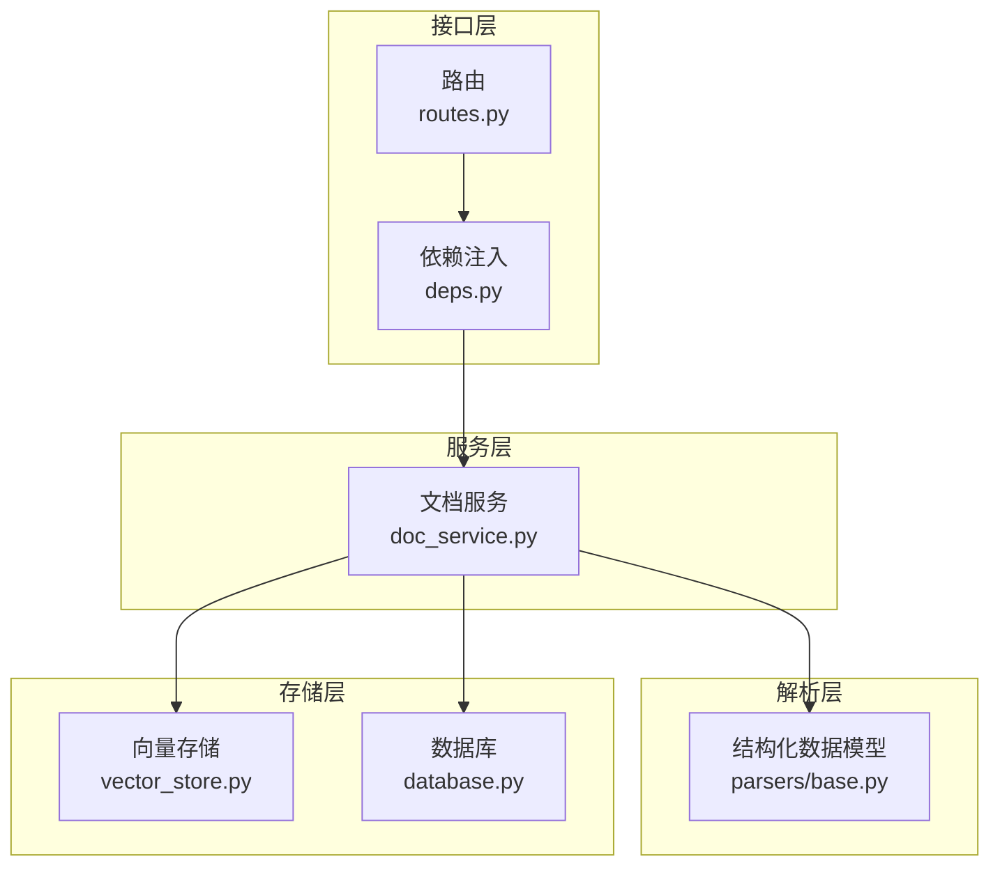
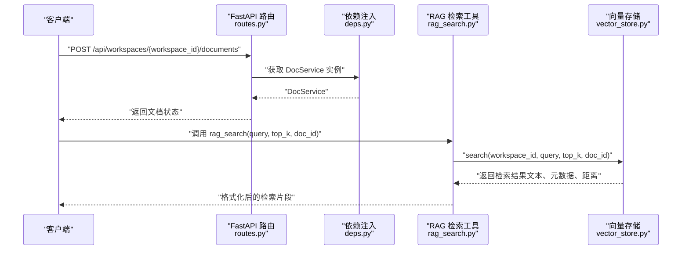
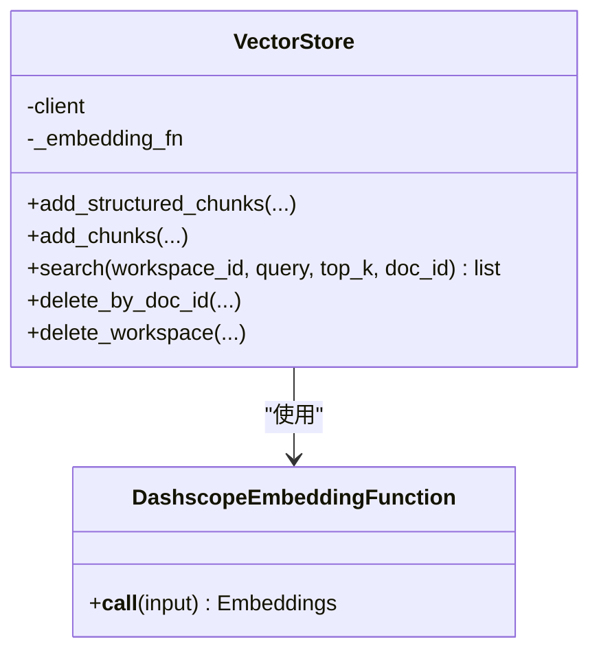
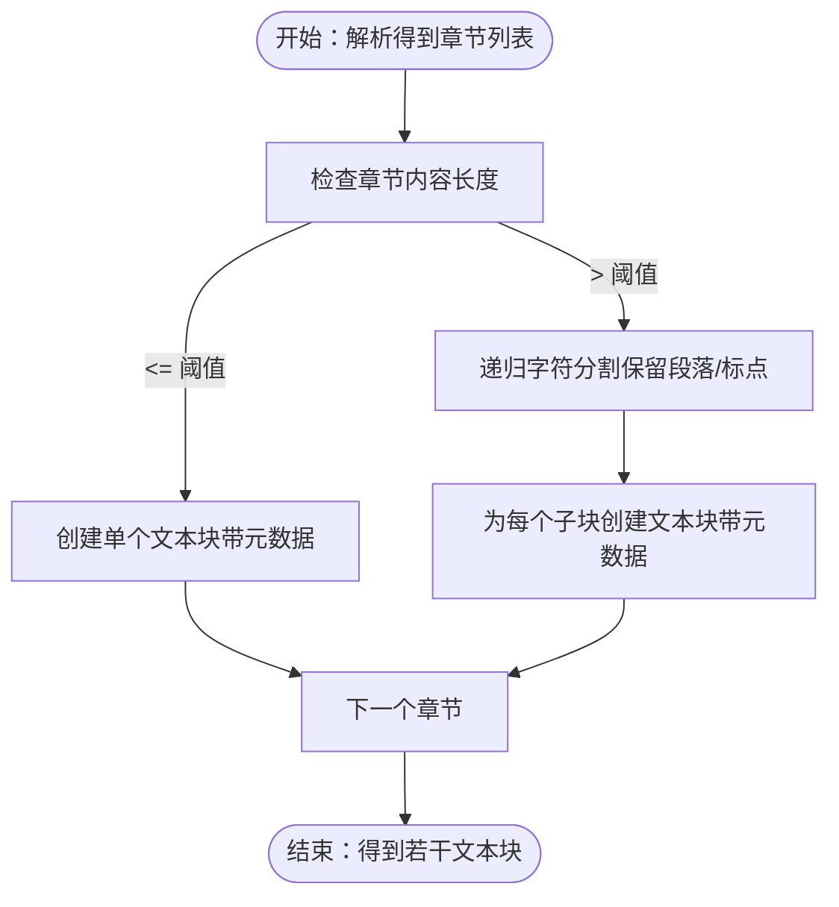
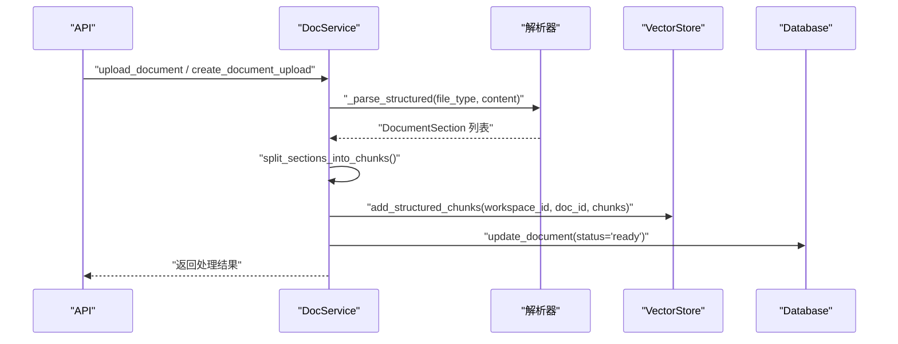
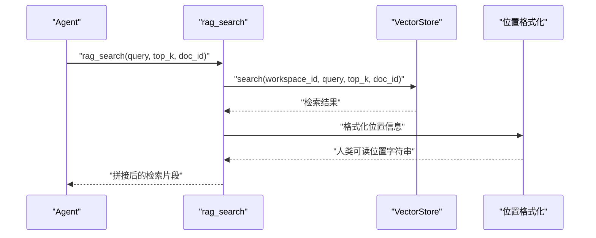
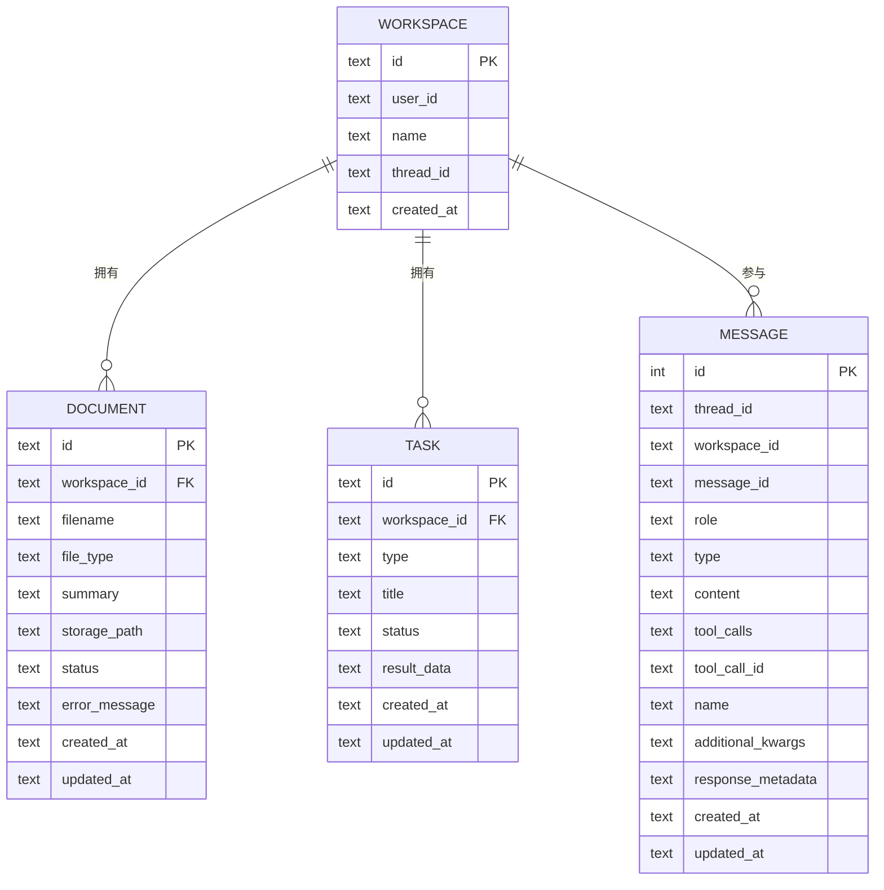
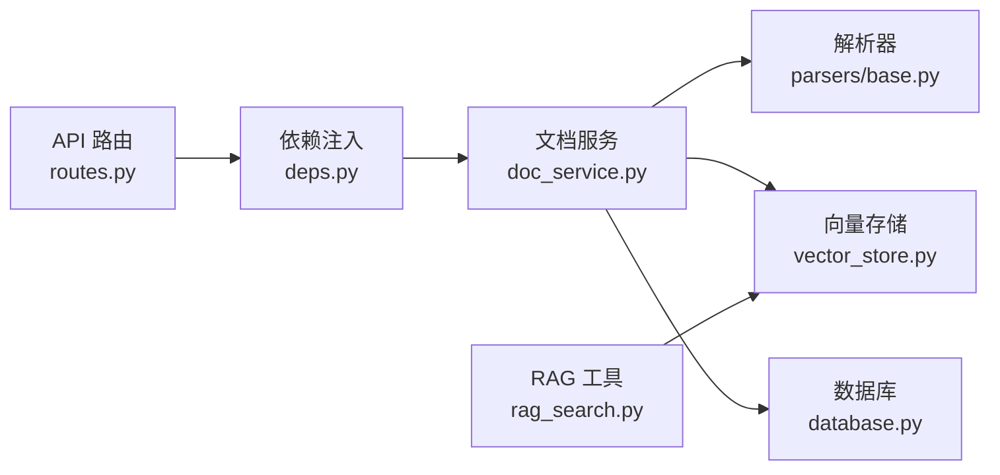

# 向量检索引擎

<cite>
**本文引用的文件**   
- [backend/src/storage/vector_store.py](file://backend/src/storage/vector_store.py)
- [backend/src/tools/rag_search.py](file://backend/src/tools/rag_search.py)
- [backend/src/parsers/base.py](file://backend/src/parsers/base.py)
- [backend/src/services/doc_service.py](file://backend/src/services/doc_service.py)
- [backend/src/storage/database.py](file://backend/src/storage/database.py)
- [backend/src/api/routes.py](file://backend/src/api/routes.py)
- [backend/src/api/deps.py](file://backend/src/api/deps.py)
- [backend/scripts/inspect_chunks.py](file://backend/scripts/inspect_chunks.py)
</cite>

## 目录
1. [简介](#简介)
2. [项目结构](#项目结构)
3. [核心组件](#核心组件)
4. [架构总览](#架构总览)
5. [详细组件分析](#详细组件分析)
6. [依赖关系分析](#依赖关系分析)
7. [性能考量](#性能考量)
8. [故障排查指南](#故障排查指南)
9. [结论](#结论)
10. [附录](#附录)

## 简介
本技术文档围绕向量检索引擎展开，系统性阐述向量数据库的查询实现、相似度计算、索引策略与查询优化机制。文档覆盖嵌入表示、距离度量、检索参数（如 top_k、过滤条件）以及性能优化最佳实践，并结合仓库中的实际代码路径进行说明，帮助读者快速理解并高效使用该向量检索系统。

## 项目结构
向量检索引擎位于后端子模块中，主要由以下层次构成：
- 存储层：向量存储（ChromaDB）、文档元数据存储（SQLite）
- 解析层：结构化解析与分块（基于章节信息生成带元数据的文本块）
- 服务层：文档处理流水线（解析 → 分块 → 向量化 → 入库 → 摘要）
- 工具层：RAG 检索工具封装
- 接口层：FastAPI 路由与依赖注入

图表来源
- [backend/src/api/routes.py:1-189](file://backend/src/api/routes.py#L1-L189)
- [backend/src/api/deps.py:1-30](file://backend/src/api/deps.py#L1-L30)
- [backend/src/services/doc_service.py:1-218](file://backend/src/services/doc_service.py#L1-L218)
- [backend/src/parsers/base.py:1-97](file://backend/src/parsers/base.py#L1-L97)
- [backend/src/storage/vector_store.py:1-177](file://backend/src/storage/vector_store.py#L1-L177)
- [backend/src/storage/database.py:1-379](file://backend/src/storage/database.py#L1-L379)

章节来源
- [backend/src/api/routes.py:1-189](file://backend/src/api/routes.py#L1-L189)
- [backend/src/api/deps.py:1-30](file://backend/src/api/deps.py#L1-L30)
- [backend/src/services/doc_service.py:1-218](file://backend/src/services/doc_service.py#L1-L218)
- [backend/src/parsers/base.py:1-97](file://backend/src/parsers/base.py#L1-L97)
- [backend/src/storage/vector_store.py:1-177](file://backend/src/storage/vector_store.py#L1-L177)
- [backend/src/storage/database.py:1-379](file://backend/src/storage/database.py#L1-L379)

## 核心组件
- 向量存储（VectorStore）
  - 使用 ChromaDB 持久化客户端，按工作区隔离集合（collection），集合元数据指定余弦空间（cosine）以启用余弦相似度检索。
  - 提供添加“结构化分块”与“纯文本分块”的能力，支持批量写入与元数据注入。
  - 提供检索接口，支持 top_k 与按 doc_id 的过滤条件。
- 嵌入函数（DashscopeEmbeddingFunction）
  - 基于 DashScope 文本嵌入模型，通过环境变量配置模型、密钥与基础地址。
- 结构化解析与分块（ChunkWithMetadata、split_sections_into_chunks）
  - 将解析出的章节结构转换为带丰富元数据的文本块，便于检索时定位来源位置。
- 文档服务（DocService）
  - 完整的文档处理流水线：上传 → 解析 → 分块 → 向量化入库 → 摘要生成 → 状态更新。
  - 支持按工作区删除与清理，确保向量与文件存储一致。
- 数据库（Database）
  - 维护工作区、文档、任务、消息等元数据，提供增删改查与迁移能力。
- RAG 检索工具（rag_search）
  - 包装向量检索结果，格式化输出（含文件名、位置信息、片段文本）。

章节来源
- [backend/src/storage/vector_store.py:13-177](file://backend/src/storage/vector_store.py#L13-L177)
- [backend/src/parsers/base.py:18-97](file://backend/src/parsers/base.py#L18-L97)
- [backend/src/services/doc_service.py:1-218](file://backend/src/services/doc_service.py#L1-L218)
- [backend/src/storage/database.py:1-379](file://backend/src/storage/database.py#L1-L379)
- [backend/src/tools/rag_search.py:1-76](file://backend/src/tools/rag_search.py#L1-L76)

## 架构总览
下图展示了从 API 到向量检索的关键调用链路与数据流：

图表来源
- [backend/src/api/routes.py:112-128](file://backend/src/api/routes.py#L112-L128)
- [backend/src/api/deps.py:27-29](file://backend/src/api/deps.py#L27-L29)
- [backend/src/tools/rag_search.py:40-75](file://backend/src/tools/rag_search.py#L40-L75)
- [backend/src/storage/vector_store.py:124-163](file://backend/src/storage/vector_store.py#L124-L163)

## 详细组件分析

### 向量存储（VectorStore）与嵌入函数
- 集合命名与隔离
  - 每个工作区对应一个独立集合，名称为 ws_{workspace_id}，避免跨工作区干扰。
- 空间与索引
  - 集合元数据设置余弦空间（cosine），用于余弦相似度检索。
  - ChromaDB 默认使用 HNSW 索引，适合大规模高维向量的近似最近邻检索。
- 批量写入与元数据
  - 支持批量添加结构化分块（带章节、页码、层级等元数据）与纯文本分块。
  - 元数据包含 doc_id、文件名、chunk_index、章节标题、页码范围、节级等。
- 查询接口
  - 支持 top_k 控制返回数量。
  - 支持按 doc_id 过滤，仅在特定文档内检索。
  - 返回文本、元数据与距离（distance）。
- 删除接口
  - 支持按文档 ID 删除，以及按工作区整体删除集合。

图表来源
- [backend/src/storage/vector_store.py:13-177](file://backend/src/storage/vector_store.py#L13-L177)

章节来源
- [backend/src/storage/vector_store.py:39-177](file://backend/src/storage/vector_store.py#L39-L177)

### 结构化解析与分块（ChunkWithMetadata）
- 数据结构
  - 文档章节（DocumentSection）：标题、层级、内容、页码范围、父标题。
  - 文本块（ChunkWithMetadata）：文本、章节/章节目录标题、页码范围、节级、块索引。
- 分块策略
  - 基于最大块大小与重叠切分，优先按段落与标点分割，保证语义完整性。
  - 保留章节结构信息，便于检索后精确定位来源。

图表来源
- [backend/src/parsers/base.py:47-97](file://backend/src/parsers/base.py#L47-L97)

章节来源
- [backend/src/parsers/base.py:6-97](file://backend/src/parsers/base.py#L6-L97)

### 文档服务（DocService）与处理流水线
- 关键流程
  - 上传文件 → 写入文件存储 → 创建文档记录 → 解析结构化内容 → 生成分块 → 向量化入库 → 生成摘要 → 更新状态。
- 清理与删除
  - 支持按工作区删除：删除文件、向量集合、数据库记录。
  - 支持按文档删除：删除文件与向量条目，同时清理临时导出的 Markdown 文件。

图表来源
- [backend/src/services/doc_service.py:57-130](file://backend/src/services/doc_service.py#L57-L130)
- [backend/src/parsers/base.py:47-97](file://backend/src/parsers/base.py#L47-L97)
- [backend/src/storage/vector_store.py:91-122](file://backend/src/storage/vector_store.py#L91-L122)
- [backend/src/storage/database.py:285-311](file://backend/src/storage/database.py#L285-L311)

章节来源
- [backend/src/services/doc_service.py:13-218](file://backend/src/services/doc_service.py#L13-L218)

### RAG 检索工具（rag_search）
- 功能
  - 从当前工作区检索相关文档片段，支持 top_k 与按 doc_id 过滤。
  - 将检索结果格式化为可读的位置信息（章节、页码）与原文片段。
- 异常处理
  - 捕获检索异常并返回友好提示；无结果时返回空提示。

图表来源
- [backend/src/tools/rag_search.py:40-75](file://backend/src/tools/rag_search.py#L40-L75)
- [backend/src/storage/vector_store.py:124-163](file://backend/src/storage/vector_store.py#L124-L163)

章节来源
- [backend/src/tools/rag_search.py:1-76](file://backend/src/tools/rag_search.py#L1-L76)

### 数据模型与数据库
- 表结构要点
  - workspace：工作区主表，包含用户标识、名称、关联线程等。
  - document：文档记录，包含文件名、类型、存储路径、状态、摘要等。
  - task：任务记录，用于异步处理跟踪。
  - message：消息记录，支持多角色与工具调用元数据。
- 索引与迁移
  - 对常用查询列建立索引，支持迁移扩展列（如错误信息、时间戳等）。

图表来源
- [backend/src/storage/database.py:25-78](file://backend/src/storage/database.py#L25-L78)

章节来源
- [backend/src/storage/database.py:1-379](file://backend/src/storage/database.py#L1-L379)

## 依赖关系分析
- 外部依赖
  - ChromaDB：持久化向量与索引管理。
  - DashScope：文本嵌入服务。
  - LangChain/LangGraph：工具与代理集成。
- 内部耦合
  - DocService 依赖解析器、向量存储与数据库。
  - RAG 工具依赖 VectorStore。
  - API 层通过依赖注入获取 DocService 实例。

图表来源
- [backend/src/api/routes.py:1-189](file://backend/src/api/routes.py#L1-L189)
- [backend/src/api/deps.py:1-30](file://backend/src/api/deps.py#L1-L30)
- [backend/src/services/doc_service.py:1-218](file://backend/src/services/doc_service.py#L1-L218)
- [backend/src/parsers/base.py:1-97](file://backend/src/parsers/base.py#L1-L97)
- [backend/src/storage/vector_store.py:1-177](file://backend/src/storage/vector_store.py#L1-L177)
- [backend/src/storage/database.py:1-379](file://backend/src/storage/database.py#L1-L379)
- [backend/src/tools/rag_search.py:1-76](file://backend/src/tools/rag_search.py#L1-L76)

章节来源
- [backend/src/api/routes.py:1-189](file://backend/src/api/routes.py#L1-L189)
- [backend/src/api/deps.py:1-30](file://backend/src/api/deps.py#L1-L30)
- [backend/src/services/doc_service.py:1-218](file://backend/src/services/doc_service.py#L1-L218)
- [backend/src/parsers/base.py:1-97](file://backend/src/parsers/base.py#L1-L97)
- [backend/src/storage/vector_store.py:1-177](file://backend/src/storage/vector_store.py#L1-L177)
- [backend/src/storage/database.py:1-379](file://backend/src/storage/database.py#L1-L379)
- [backend/src/tools/rag_search.py:1-76](file://backend/src/tools/rag_search.py#L1-L76)

## 性能考量
- 相似度与距离度量
  - 余弦相似度（cosine）适用于方向相近的向量比较，对向量幅度不敏感，适合文本语义匹配。
- 索引策略
  - 使用 HNSW 索引，支持大规模高维向量的近似检索，具备良好的吞吐与延迟特性。
- 查询优化
  - top_k 控制返回规模，建议根据召回质量与响应时间权衡设置。
  - 过滤条件（doc_id）可显著缩小搜索空间，提升检索速度与相关性。
- 写入与批处理
  - 批量写入减少网络往返与事务开销；合理设置 batch_size。
- 缓存与并发
  - 向量检索本身由 ChromaDB 管理索引与查询，建议在应用层对热点查询做结果缓存（需结合业务场景评估一致性）。
  - 并发查询可通过连接池与异步框架（如 FastAPI/aiosqlite）提升吞吐。
- 数据结构与元数据
  - 元数据包含章节、页码、文件名等，有助于后续重排序与去重，但也会增加存储与索引负担，应按需裁剪。

[本节为通用性能指导，无需具体文件引用]

## 故障排查指南
- 常见问题与定位
  - 向量集合不存在：首次检索可能因集合尚未创建而返回空结果，确认文档是否已完成入库。
  - 嵌入失败：检查 DashScope API 密钥、基础地址与网络连通性。
  - 查询无结果：调整 top_k 或移除 doc_id 过滤，确认查询语义与知识库内容匹配度。
- 调试工具
  - 使用脚本列出集合、查看分块与执行语义检索，核对返回的距离与元数据。
- 日志与异常
  - 检索工具捕获异常并返回友好提示；向量存储与文档服务均记录详细日志，便于定位问题。

章节来源
- [backend/src/storage/vector_store.py:124-163](file://backend/src/storage/vector_store.py#L124-L163)
- [backend/src/tools/rag_search.py:55-64](file://backend/src/tools/rag_search.py#L55-L64)
- [backend/scripts/inspect_chunks.py:1-139](file://backend/scripts/inspect_chunks.py#L1-L139)

## 结论
该向量检索引擎以 ChromaDB 为核心，结合结构化解析与分块策略，实现了从文档到向量的完整流水线。通过余弦相似度与 HNSW 索引，系统在召回质量与性能之间取得平衡。检索参数（top_k、过滤条件）与批处理写入是影响性能与效果的关键因素。配合调试脚本与日志体系，可快速定位问题并持续优化。

[本节为总结性内容，无需具体文件引用]

## 附录
- 环境变量与配置
  - EMBEDDING_MODEL、EMBEDDING_API_KEY、EMBEDDING_API_BASE：嵌入模型与服务端点。
  - SUMMARIZATION_MODEL、SUMMARIZATION_API_KEY、SUMMARIZATION_API_BASE：摘要模型配置。
  - DATA_DIR：向量存储目录（默认 ./data）。
- 常用操作
  - 列出集合：python scripts/inspect_chunks.py
  - 查看工作区分块：python scripts/inspect_chunks.py <workspace_id>
  - 按文档过滤检索：python scripts/inspect_chunks.py <workspace_id> -d <doc_id> -q "query" -k 5

章节来源
- [backend/src/storage/vector_store.py:19-36](file://backend/src/storage/vector_store.py#L19-L36)
- [backend/src/api/deps.py:21-25](file://backend/src/api/deps.py#L21-L25)
- [backend/scripts/inspect_chunks.py:1-139](file://backend/scripts/inspect_chunks.py#L1-L139)