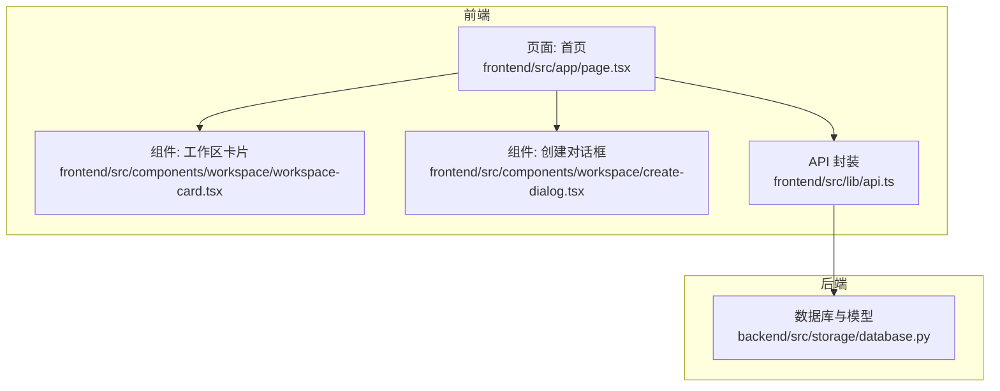
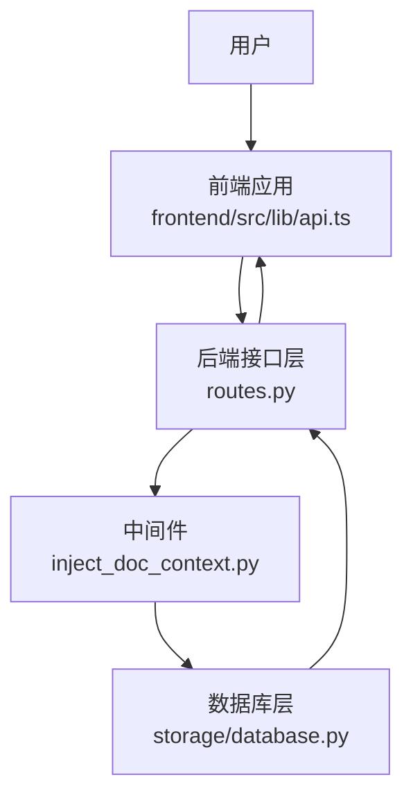
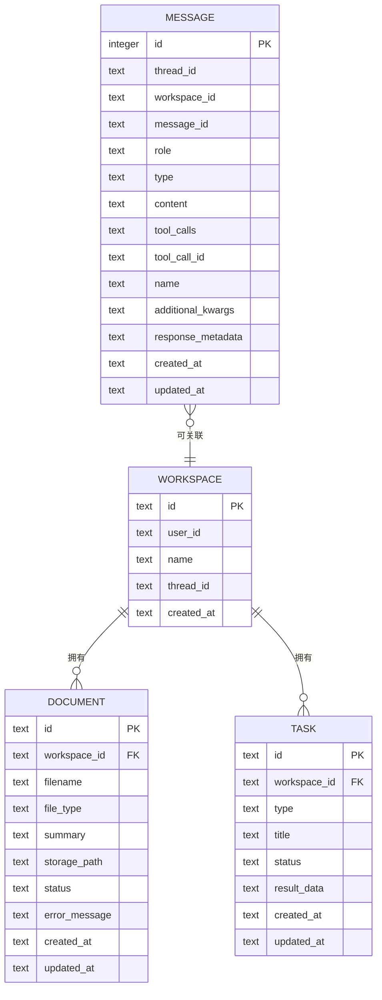
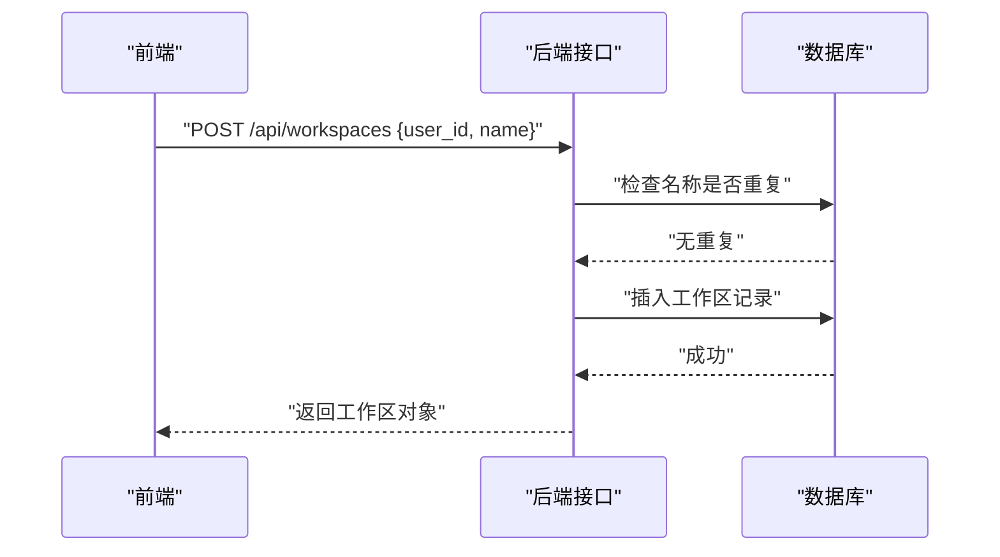
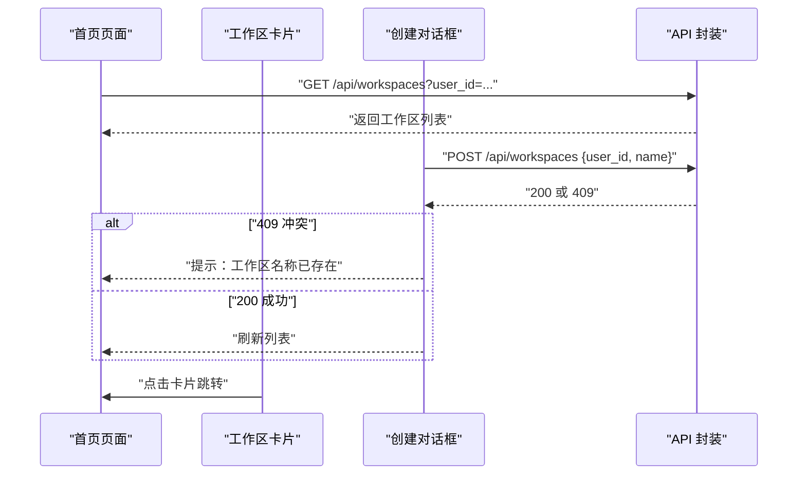
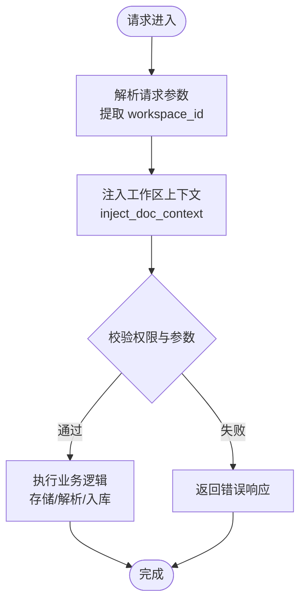
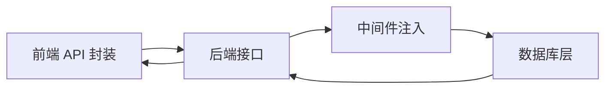

# 工作区（Workspace）概念

<cite>
**本文引用的文件**
- [backend/src/storage/database.py](file://backend/src/storage/database.py)
- [frontend/src/lib/api.ts](file://frontend/src/lib/api.ts)
- [frontend/src/app/page.tsx](file://frontend/src/app/page.tsx)
- [frontend/src/components/workspace/workspace-card.tsx](file://frontend/src/components/workspace/workspace-card.tsx)
- [frontend/src/components/workspace/create-dialog.tsx](file://frontend/src/components/workspace/create-dialog.tsx)
- [plans/2026-05-27-train-agent-implementation.md](file://plans/2026-05-27-train-agent-implementation.md)
</cite>

## 目录
1. [引言](#引言)
2. [项目结构](#项目结构)
3. [核心组件](#核心组件)
4. [架构总览](#架构总览)
5. [详细组件分析](#详细组件分析)
6. [依赖分析](#依赖分析)
7. [性能考虑](#性能考虑)
8. [故障排查指南](#故障排查指南)
9. [结论](#结论)
10. [附录](#附录)

## 引言
本文件围绕“工作区（Workspace）”这一多租户隔离单元进行系统化说明，涵盖其设计理念、创建与配置流程、生命周期管理、与用户权限的关系、数据隔离与访问控制策略，以及在文档处理、智能问答与技能执行中的作用。同时给出核心数据模型与数据库表结构、API 使用方式与参数传递规范，并提供后端服务中处理工作区上下文的实际代码路径参考。

## 项目结构
工作区功能横跨前端与后端：
- 前端负责工作区列表展示、新建与删除交互，并通过统一的 API 模块调用后端接口。
- 后端提供工作区相关的数据库操作与 API 路由（当前以前端直接调用为主），并通过中间件注入上下文信息。

图表来源
- [frontend/src/app/page.tsx:17-120](file://frontend/src/app/page.tsx#L17-L120)
- [frontend/src/components/workspace/workspace-card.tsx:12-50](file://frontend/src/components/workspace/workspace-card.tsx#L12-L50)
- [frontend/src/components/workspace/create-dialog.tsx:36-70](file://frontend/src/components/workspace/create-dialog.tsx#L36-L70)
- [frontend/src/lib/api.ts:44-83](file://frontend/src/lib/api.ts#L44-L83)
- [backend/src/storage/database.py:109-142](file://backend/src/storage/database.py#L109-L142)

章节来源
- [frontend/src/app/page.tsx:17-120](file://frontend/src/app/page.tsx#L17-L120)
- [frontend/src/lib/api.ts:44-83](file://frontend/src/lib/api.ts#L44-L83)
- [backend/src/storage/database.py:109-142](file://backend/src/storage/database.py#L109-L142)

## 核心组件
- 数据模型与数据库层
  - 工作区实体：包含唯一标识、所属用户、名称、可选线程关联、创建时间等字段。
  - 文档与任务实体：均通过外键关联到工作区，实现资源级隔离。
  - 提供工作区的创建、查询、列表与删除等基础能力；文档与任务提供相应 CRUD 操作。
- 前端交互层
  - 首页展示工作区列表，支持新建与删除；新建时校验重复名称并提示错误。
  - 通过 API 封装模块集中管理请求与错误处理。
- 中间件与上下文
  - 存在文档上下文注入中间件，用于在处理文档相关请求时注入工作区上下文，确保后续处理逻辑基于正确的隔离边界。

章节来源
- [backend/src/storage/database.py:25-76](file://backend/src/storage/database.py#L25-L76)
- [backend/src/storage/database.py:111-142](file://backend/src/storage/database.py#L111-L142)
- [frontend/src/lib/api.ts:44-83](file://frontend/src/lib/api.ts#L44-L83)
- [frontend/src/app/page.tsx:23-55](file://frontend/src/app/page.tsx#L23-L55)
- [backend/src/middlewares/inject_doc_context.py](file://backend/src/middlewares/inject_doc_context.py)

## 架构总览
工作区作为多租户隔离单元，通过以下方式实现：
- 数据库层面：以工作区为根实体，文档与任务等子资源均绑定到工作区，利用外键约束与级联删除保障数据一致性与隔离。
- 访问控制：工作区记录包含 user_id 字段，前端在发起请求时携带用户标识，后端据此进行权限校验与数据过滤。
- 上下文注入：中间件在处理文档类请求时注入工作区上下文，保证后续处理（如向量化、检索、技能执行）限定在该工作区内。

图表来源
- [frontend/src/lib/api.ts:44-83](file://frontend/src/lib/api.ts#L44-L83)
- [backend/src/middlewares/inject_doc_context.py](file://backend/src/middlewares/inject_doc_context.py)
- [backend/src/storage/database.py:109-142](file://backend/src/storage/database.py#L109-L142)

## 详细组件分析

### 数据模型与数据库表结构
- 工作区（workspace）
  - 关键字段：id（主键）、user_id（外键关联用户）、name、thread_id（可选，用于关联会话线程）、created_at。
  - 约束与索引：唯一性约束（用户+名称大小写不敏感）防止重名；列表按创建时间倒序。
- 文档（document）
  - 关键字段：id（主键）、workspace_id（外键，级联删除）、filename、file_type、summary、storage_path、status、error_message、created_at、updated_at。
  - 约束：外键约束保证文档归属工作区；级联删除确保工作区删除时自动清理文档。
- 任务（task）
  - 关键字段：id（主键）、workspace_id（外键，级联删除）、type、title、status、result_data、created_at、updated_at。
  - 约束：同上，保证任务与工作区的强关联。
- 消息（message）
  - 关键字段：id（自增主键）、thread_id、workspace_id（可选）、message_id、role、type、content、tool_calls、tool_call_id、name、additional_kwargs、response_metadata、created_at、updated_at。
  - 约束：复合唯一索引（thread_id, message_id, role）避免重复消息；索引优化查询。

图表来源
- [backend/src/storage/database.py:25-76](file://backend/src/storage/database.py#L25-L76)

章节来源
- [backend/src/storage/database.py:25-76](file://backend/src/storage/database.py#L25-L76)

### 工作区创建与生命周期管理
- 创建工作区
  - 前端通过 API 发起 POST 请求，携带 user_id 与 name。
  - 后端对名称进行去空格与大小写不敏感检查，若重复则返回冲突错误。
  - 成功后生成唯一 ID 并持久化。
- 查询与列表
  - 支持按用户 ID 列出工作区并按创建时间倒序排列。
  - 支持按 ID 获取单个工作区详情。
- 删除工作区
  - 删除工作区时，由于文档与任务表设置外键级联删除，相关资源将被一并清理。

图表来源
- [frontend/src/lib/api.ts:54-62](file://frontend/src/lib/api.ts#L54-L62)
- [backend/src/storage/database.py:111-127](file://backend/src/storage/database.py#L111-L127)

章节来源
- [frontend/src/lib/api.ts:54-62](file://frontend/src/lib/api.ts#L54-L62)
- [backend/src/storage/database.py:111-127](file://backend/src/storage/database.py#L111-L127)

### 权限与数据隔离
- 用户维度隔离
  - 工作区记录包含 user_id 字段，所有查询与操作均以 user_id 作为过滤条件，确保不同用户之间资源完全隔离。
- 名称唯一性约束
  - 在同一用户下，工作区名称大小写不敏感且全局唯一，避免命名冲突带来的误用风险。
- 外键与级联删除
  - 文档与任务均以外键关联工作区，删除工作区会级联删除其下的文档与任务，保证数据一致性与边界清晰。

章节来源
- [backend/src/storage/database.py:111-127](file://backend/src/storage/database.py#L111-L127)
- [backend/src/storage/database.py:136-142](file://backend/src/storage/database.py#L136-L142)
- [backend/src/storage/database.py:25-76](file://backend/src/storage/database.py#L25-L76)

### 在文档处理、智能问答与技能执行中的作用
- 文档处理
  - 文档上传、解析、向量化与检索均限定在工作区内，确保不同工作区的数据互不可见。
  - 中间件在处理文档相关请求时注入工作区上下文，使后续处理链路始终基于正确的工作区边界。
- 智能问答
  - 消息表支持与工作区的可选关联，便于在工作区内维护会话历史与工具调用记录，实现上下文的本地化。
- 技能执行
  - 技能执行通常依赖工作区内的文档与任务状态，通过工作区上下文可确保技能仅作用于当前隔离空间内的资源。

章节来源
- [backend/src/middlewares/inject_doc_context.py](file://backend/src/middlewares/inject_doc_context.py)
- [backend/src/storage/database.py:56-76](file://backend/src/storage/database.py#L56-L76)

### API 接口与参数传递
- 工作区相关接口
  - POST /api/workspaces：创建工作区，请求体包含 user_id 与 name。
  - GET /api/workspaces?user_id=...：列出指定用户的全部工作区。
  - GET /api/workspaces/{id}：获取单个工作区详情。
  - PATCH /api/workspaces/{id}/thread：更新工作区关联的线程 ID。
  - DELETE /api/workspaces/{id}：删除工作区。
- 文档与任务相关接口
  - GET /api/workspaces/{workspaceId}/documents：列出工作区内的文档。
  - POST /api/workspaces/{workspaceId}/documents：上传文件至工作区。
  - DELETE /api/workspaces/{workspaceId}/documents/{docId}：删除工作区内的文档。
  - GET /api/workspaces/{workspaceId}/tasks：列出工作区内的任务。
  - DELETE /api/workspaces/{workspaceId}/tasks/{taskId}：删除工作区内的任务。

章节来源
- [frontend/src/lib/api.ts:44-83](file://frontend/src/lib/api.ts#L44-L83)
- [frontend/src/lib/api.ts:142-195](file://frontend/src/lib/api.ts#L142-L195)

### 前端交互与错误处理
- 首页加载与新建
  - 首次进入页面时拉取当前用户的工作区列表；新建对话框输入名称并提交，若出现 409 冲突则提示“工作区名称已存在”。
- 删除与跳转
  - 删除工作区后刷新列表；点击卡片进入对应工作区详情页。
- 错误处理
  - 统一的 ApiError 类封装响应状态与错误详情，便于前端捕获并展示。

图表来源
- [frontend/src/app/page.tsx:23-55](file://frontend/src/app/page.tsx#L23-L55)
- [frontend/src/components/workspace/create-dialog.tsx:36-70](file://frontend/src/components/workspace/create-dialog.tsx#L36-L70)
- [frontend/src/lib/api.ts:44-83](file://frontend/src/lib/api.ts#L44-L83)

章节来源
- [frontend/src/app/page.tsx:23-55](file://frontend/src/app/page.tsx#L23-L55)
- [frontend/src/components/workspace/workspace-card.tsx:12-50](file://frontend/src/components/workspace/workspace-card.tsx#L12-L50)
- [frontend/src/components/workspace/create-dialog.tsx:36-70](file://frontend/src/components/workspace/create-dialog.tsx#L36-L70)
- [frontend/src/lib/api.ts:44-83](file://frontend/src/lib/api.ts#L44-L83)

### 后端上下文注入与处理流程
- 文档上下文注入
  - 中间件在处理文档相关请求时注入工作区上下文，确保后续处理（如解析、向量化、检索）限定在该工作区内。
- 典型流程（以文档上传为例）
  - 前端上传文件至 /api/workspaces/{workspaceId}/documents。
  - 中间件解析请求，提取 workspace_id 并注入上下文。
  - 后端服务根据上下文执行业务逻辑（存储、解析、入库）。

图表来源
- [backend/src/middlewares/inject_doc_context.py](file://backend/src/middlewares/inject_doc_context.py)
- [frontend/src/lib/api.ts:142-164](file://frontend/src/lib/api.ts#L142-L164)

章节来源
- [backend/src/middlewares/inject_doc_context.py](file://backend/src/middlewares/inject_doc_context.py)
- [frontend/src/lib/api.ts:142-164](file://frontend/src/lib/api.ts#L142-L164)

## 依赖分析
- 前端对后端的依赖
  - 所有工作区与文档/任务操作均通过统一 API 封装模块发起请求，降低耦合度。
- 后端对数据库的依赖
  - 工作区、文档、任务与消息表之间通过外键建立强关联，确保数据一致性与隔离。
- 中间件对业务流程的依赖
  - 注入工作区上下文的中间件贯穿文档处理链路，是实现多租户隔离的关键环节。

图表来源
- [frontend/src/lib/api.ts:44-83](file://frontend/src/lib/api.ts#L44-L83)
- [backend/src/middlewares/inject_doc_context.py](file://backend/src/middlewares/inject_doc_context.py)
- [backend/src/storage/database.py:109-142](file://backend/src/storage/database.py#L109-L142)

章节来源
- [frontend/src/lib/api.ts:44-83](file://frontend/src/lib/api.ts#L44-L83)
- [backend/src/storage/database.py:109-142](file://backend/src/storage/database.py#L109-L142)

## 性能考虑
- 查询优化
  - 对消息表按 thread_id 与 id 进行复合索引，提升会话查询效率。
- 写入优化
  - 使用批量更新语句与参数化查询，减少 SQL 拼接开销。
- 隔离与并发
  - 通过外键与事务保证并发场景下的数据一致性；建议在高并发写入场景下合理拆分工作区，避免单点热点。
- 前端渲染
  - 列表采用懒加载与错误兜底，提升用户体验。

## 故障排查指南
- 工作区名称冲突
  - 现象：新建工作区返回 409。
  - 处理：提示用户更换名称或选择其他工作区。
- 权限不足或资源不存在
  - 现象：查询或删除工作区时报错。
  - 处理：确认 user_id 是否正确传入，以及目标资源是否存在。
- 文档上传失败
  - 现象：上传接口返回错误。
  - 处理：检查文件类型、大小限制与网络状况；查看后端日志定位具体异常。

章节来源
- [frontend/src/app/page.tsx:44-49](file://frontend/src/app/page.tsx#L44-L49)
- [frontend/src/lib/api.ts:15-42](file://frontend/src/lib/api.ts#L15-L42)

## 结论
工作区作为多租户隔离单元，在数据库层通过外键与级联删除实现强一致的数据边界；在访问控制上以 user_id 与名称唯一性约束确保用户间资源隔离；在业务流程中通过中间件注入工作区上下文，使文档处理、智能问答与技能执行均限定在正确的工作区范围内。前后端通过统一 API 封装协同，既保证了易用性也兼顾了扩展性。

## 附录
- 历史设计文档参考
  - 工作区、文档与任务表的早期设计与实现思路可参考计划文档中的数据库定义与方法实现。

章节来源
- [plans/2026-05-27-train-agent-implementation.md:191-317](file://plans/2026-05-27-train-agent-implementation.md#L191-L317)