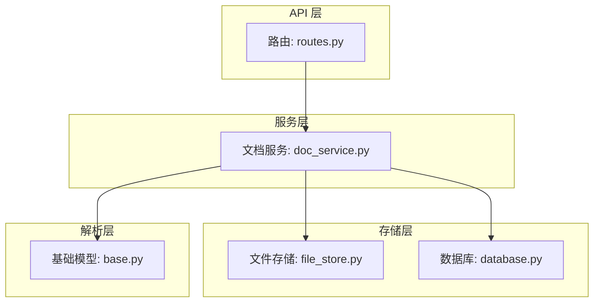
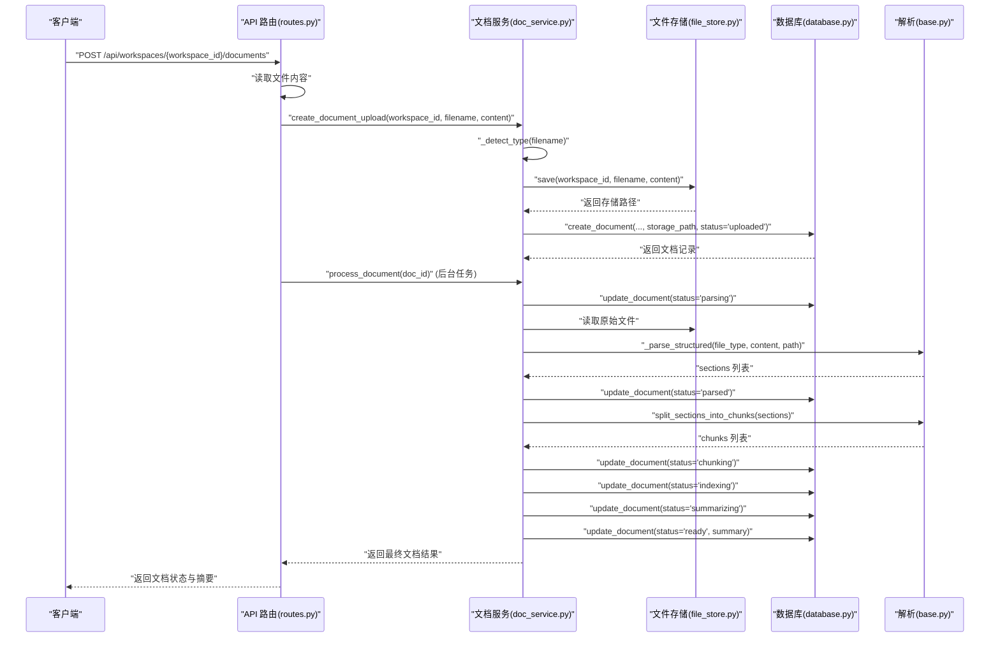
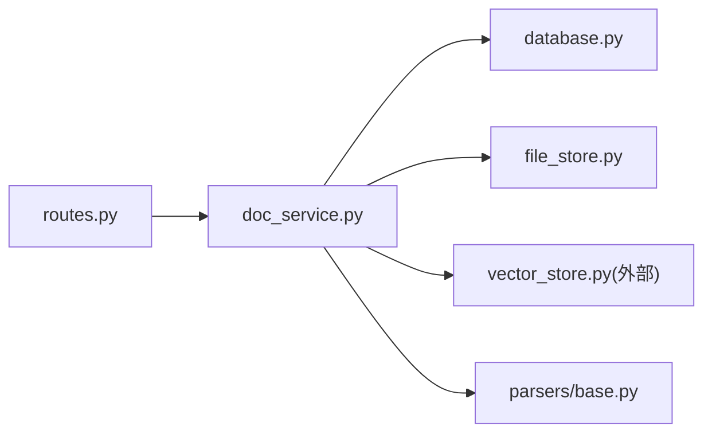

# 文档上传与接收

<cite>
**本文引用的文件**
- [backend/src/api/routes.py](file://backend/src/api/routes.py)
- [backend/src/services/doc_service.py](file://backend/src/services/doc_service.py)
- [backend/src/storage/file_store.py](file://backend/src/storage/file_store.py)
- [backend/src/storage/database.py](file://backend/src/storage/database.py)
- [backend/src/parsers/base.py](file://backend/src/parsers/base.py)
</cite>

## 目录
1. [简介](#简介)
2. [项目结构](#项目结构)
3. [核心组件](#核心组件)
4. [架构总览](#架构总览)
5. [详细组件分析](#详细组件分析)
6. [依赖分析](#依赖分析)
7. [性能考虑](#性能考虑)
8. [故障排查指南](#故障排查指南)
9. [结论](#结论)
10. [附录](#附录)

## 简介
本文件面向“文档上传与接收”功能，提供从接口到存储、解析、向量化与摘要生成的全流程技术说明。重点覆盖：
- 文件类型检测与扩展名映射
- 文件保存机制、存储路径生成与命名规则
- 解析与分块策略、向量索引与摘要生成
- 异步处理的状态更新与进度跟踪
- 常见错误处理与异常恢复策略

## 项目结构
后端采用分层设计：
- API 层：FastAPI 路由定义与请求处理
- 服务层：业务编排（文档上传、解析、索引、摘要）
- 存储层：文件系统存储、SQLite 数据库存储、向量数据库抽象
- 解析层：统一的数据结构与分块算法

图表来源
- [backend/src/api/routes.py:112-128](file://backend/src/api/routes.py#L112-L128)
- [backend/src/services/doc_service.py:29-55](file://backend/src/services/doc_service.py#L29-L55)
- [backend/src/storage/file_store.py:11-16](file://backend/src/storage/file_store.py#L11-L16)
- [backend/src/storage/database.py:285-311](file://backend/src/storage/database.py#L285-L311)
- [backend/src/parsers/base.py:47-97](file://backend/src/parsers/base.py#L47-L97)

章节来源
- [backend/src/api/routes.py:112-128](file://backend/src/api/routes.py#L112-L128)
- [backend/src/services/doc_service.py:29-55](file://backend/src/services/doc_service.py#L29-L55)
- [backend/src/storage/file_store.py:11-16](file://backend/src/storage/file_store.py#L11-L16)
- [backend/src/storage/database.py:285-311](file://backend/src/storage/database.py#L285-L311)
- [backend/src/parsers/base.py:47-97](file://backend/src/parsers/base.py#L47-L97)

## 核心组件
- 文档服务（DocService）：负责上传、解析、分块、索引、摘要与状态管理
- 文件存储（FileStore）：提供同步与异步写入、删除、工作区清理能力
- 数据库（Database）：维护工作区、文档、任务等元数据，支持状态字段与时间戳
- 解析基类（base.py）：定义 DocumentSection、ChunkWithMetadata 以及分块算法

章节来源
- [backend/src/services/doc_service.py:13-28](file://backend/src/services/doc_service.py#L13-L28)
- [backend/src/storage/file_store.py:6-39](file://backend/src/storage/file_store.py#L6-L39)
- [backend/src/storage/database.py:9-78](file://backend/src/storage/database.py#L9-L78)
- [backend/src/parsers/base.py:6-42](file://backend/src/parsers/base.py#L6-L42)

## 架构总览
下图展示了“上传-解析-索引-摘要”的端到端流程，以及状态流转。

图表来源
- [backend/src/api/routes.py:112-128](file://backend/src/api/routes.py#L112-L128)
- [backend/src/services/doc_service.py:29-130](file://backend/src/services/doc_service.py#L29-L130)
- [backend/src/storage/file_store.py:11-16](file://backend/src/storage/file_store.py#L11-L16)
- [backend/src/storage/database.py:285-311](file://backend/src/storage/database.py#L285-L311)
- [backend/src/parsers/base.py:47-97](file://backend/src/parsers/base.py#L47-L97)

## 详细组件分析

### 组件一：API 路由与入口
- 入口：POST /api/workspaces/{workspace_id}/documents
- 行为：读取上传文件内容，调用文档服务创建上传记录，并通过后台任务触发后续处理
- 关键点：使用 BackgroundTasks 将耗时处理移至后台，避免阻塞请求线程

章节来源
- [backend/src/api/routes.py:112-128](file://backend/src/api/routes.py#L112-L128)

### 组件二：文档服务（DocService）
职责与流程：
- create_document_upload
  - 类型检测：基于扩展名映射判断文件类型
  - 文件落盘：调用 FileStore.save 写入文件
  - 记录创建：调用 Database.create_document 插入文档元数据，默认状态为 uploaded
- process_document
  - 状态机：parsing → parsed → chunking → indexing → summarizing → ready/error
  - 结构化解析：根据类型选择 PDF/DOCX/Markdown/Text 解析器
  - 文本导出：将解析后的纯文本保存为同目录下的 .md 文件
  - 分块与索引：按节进行递归分块，写入向量存储
  - 摘要生成：可选 LLM 摘要，失败时回退为截断文本
  - 错误处理：捕获异常并更新状态为 error，保留错误信息

文件类型检测与映射：
- 扩展名到类型映射：pdf、docx、doc、md、txt 映射到对应类型；未知扩展名标记为 unknown

章节来源
- [backend/src/services/doc_service.py:29-55](file://backend/src/services/doc_service.py#L29-L55)
- [backend/src/services/doc_service.py:57-130](file://backend/src/services/doc_service.py#L57-L130)
- [backend/src/services/doc_service.py:172-181](file://backend/src/services/doc_service.py#L172-L181)
- [backend/src/services/doc_service.py:183-196](file://backend/src/services/doc_service.py#L183-L196)

### 组件三：文件存储（FileStore）
- 保存策略：以工作区 ID 为子目录，文件名为最终文件名，自动创建父目录
- 路径生成：base_dir/workspace_id/filename
- 命名规则：保持原文件名；解析阶段会额外生成同目录下的 .md 文件用于调试与摘要
- 异步写入：提供 save_async 包装阻塞 I/O 至线程池，避免事件循环阻塞
- 删除策略：支持单文件删除与工作区级删除（递归删除）

章节来源
- [backend/src/storage/file_store.py:11-16](file://backend/src/storage/file_store.py#L11-L16)
- [backend/src/storage/file_store.py:18-28](file://backend/src/storage/file_store.py#L18-L28)
- [backend/src/storage/file_store.py:30-39](file://backend/src/storage/file_store.py#L30-L39)

### 组件四：数据库（Database）
- 表结构要点：document 表包含 id、workspace_id、filename、file_type、storage_path、status、error_message、created_at、updated_at
- 初始化：首次访问时创建表与必要列（含迁移）
- 文档操作：创建、列表查询、更新状态、删除
- 索引与约束：外键约束、时间戳自动更新

章节来源
- [backend/src/storage/database.py:25-78](file://backend/src/storage/database.py#L25-L78)
- [backend/src/storage/database.py:285-311](file://backend/src/storage/database.py#L285-L311)
- [backend/src/storage/database.py:321-328](file://backend/src/storage/database.py#L321-L328)

### 组件五：解析与分块（base.py）
- 数据模型：DocumentSection（标题、层级、页码范围、父标题）、ChunkWithMetadata（带结构元数据的文本块）
- 分块策略：最大长度 2000，重叠 200，按段落、换行、中文标点与空格分割
- 输出：结构化分块列表，便于后续向量化与检索增强

章节来源
- [backend/src/parsers/base.py:6-42](file://backend/src/parsers/base.py#L6-L42)
- [backend/src/parsers/base.py:47-97](file://backend/src/parsers/base.py#L47-L97)

### 组件六：向量存储（VectorStore）
- 角色：接收结构化分块，写入向量数据库
- 元数据：包含文档 ID、文件名、章节标题、页码范围、分块索引等
- 清理：支持按文档 ID 与工作区清理

章节来源
- [backend/src/services/doc_service.py:100-105](file://backend/src/services/doc_service.py#L100-L105)

### 组件七：摘要生成（LLM 可选）
- 当存在 LLM 时，使用系统提示词生成摘要
- 失败回退：记录警告日志并返回截断文本

章节来源
- [backend/src/services/doc_service.py:202-217](file://backend/src/services/doc_service.py#L202-L217)

## 依赖分析
- 组件耦合
  - DocService 同时依赖 Database、FileStore、VectorStore 与解析器
  - API 路由仅依赖 DocService 与数据库，实现薄路由层
- 外部依赖
  - aiosqlite：异步 SQLite 访问
  - langchain_text_splitters：递归文本分块
  - langchain_core（可选）：摘要 LLM 调用

图表来源
- [backend/src/api/routes.py:112-128](file://backend/src/api/routes.py#L112-L128)
- [backend/src/services/doc_service.py:29-55](file://backend/src/services/doc_service.py#L29-L55)
- [backend/src/storage/file_store.py:11-16](file://backend/src/storage/file_store.py#L11-L16)
- [backend/src/storage/database.py:285-311](file://backend/src/storage/database.py#L285-L311)
- [backend/src/parsers/base.py:47-97](file://backend/src/parsers/base.py#L47-L97)

## 性能考虑
- 异步 I/O：文件写入通过 asyncio.to_thread 避免阻塞事件循环
- 后台任务：解析、分块、索引与摘要在后台执行，提升响应速度
- 分块参数：合理设置最大块大小与重叠，平衡检索精度与向量维度
- 日志与可观测性：关键节点记录状态变更与耗时，便于定位瓶颈

## 故障排查指南
常见问题与处理建议：
- 上传后状态未更新
  - 检查后台任务是否被正确添加与执行
  - 查看数据库中 document.status 是否停留在 parsing 或 chunking
- 解析失败或无文本
  - 确认文件类型映射是否正确
  - 对于扫描版 PDF，需引入 OCR 流程（当前逻辑会报错提示）
- 存储路径异常
  - 确认 base_dir 可写且路径拼接正确
  - 检查工作区目录是否存在权限问题
- 摘要生成失败
  - 若启用 LLM，检查网络与令牌配置；未启用则回退为截断文本属预期

章节来源
- [backend/src/api/routes.py:126-128](file://backend/src/api/routes.py#L126-L128)
- [backend/src/services/doc_service.py:121-130](file://backend/src/services/doc_service.py#L121-L130)
- [backend/src/storage/file_store.py:11-16](file://backend/src/storage/file_store.py#L11-L16)
- [backend/src/storage/database.py:321-328](file://backend/src/storage/database.py#L321-L328)

## 结论
该方案通过清晰的分层与异步化设计，实现了从上传到解析、索引与摘要的完整闭环。文件类型检测与扩展名映射确保了解析器的正确选择；分块与向量化为后续检索增强提供基础；状态机与错误处理保障了流程的可控与可观测。建议在生产环境中结合监控与告警完善可观测性，并针对扫描版 PDF 引入 OCR 能力以提升可用性。

## 附录

### 文件类型检测与扩展名映射
- 支持类型：pdf、docx、doc、markdown、text
- 未知扩展名：标记为 unknown，解析时回退为 Markdown 解析器

章节来源
- [backend/src/services/doc_service.py:172-181](file://backend/src/services/doc_service.py#L172-L181)

### 存储路径与命名规则
- 存储根目录：由 FileStore.base_dir 指定
- 工作区目录：base_dir/workspace_id
- 原始文件：base_dir/workspace_id/original_filename
- 解析导出：base_dir/workspace_id/original_filename.md

章节来源
- [backend/src/storage/file_store.py:11-16](file://backend/src/storage/file_store.py#L11-L16)
- [backend/src/services/doc_service.py:86-88](file://backend/src/services/doc_service.py#L86-L88)

### 状态机与进度跟踪
- 状态序列：uploaded → parsing → parsed → chunking → indexing → summarizing → ready/error
- 更新方式：每次处理阶段调用 Database.update_document 更新 status 与 updated_at

章节来源
- [backend/src/services/doc_service.py:67-120](file://backend/src/services/doc_service.py#L67-L120)
- [backend/src/storage/database.py:321-328](file://backend/src/storage/database.py#L321-L328)

### 核心方法使用示例（路径指引）
- 上传接口
  - 路由：[POST /api/workspaces/{workspace_id}/documents:112-128](file://backend/src/api/routes.py#L112-L128)
  - 服务：[create_document_upload:35-55](file://backend/src/services/doc_service.py#L35-L55)
  - 服务：[process_document:57-130](file://backend/src/services/doc_service.py#L57-L130)
- 文件保存
  - 服务：[FileStore.save:11-16](file://backend/src/storage/file_store.py#L11-L16)
  - 服务：[FileStore.save_async:18-28](file://backend/src/storage/file_store.py#L18-L28)
- 文档记录
  - 服务：[Database.create_document:285-311](file://backend/src/storage/database.py#L285-L311)
  - 服务：[Database.update_document:321-328](file://backend/src/storage/database.py#L321-328)
- 解析与分块
  - 服务：[DocService._parse_structured:183-196](file://backend/src/services/doc_service.py#L183-L196)
  - 服务：[split_sections_into_chunks:47-97](file://backend/src/parsers/base.py#L47-L97)