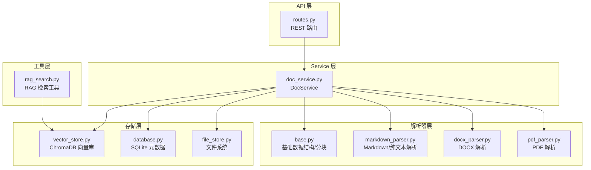
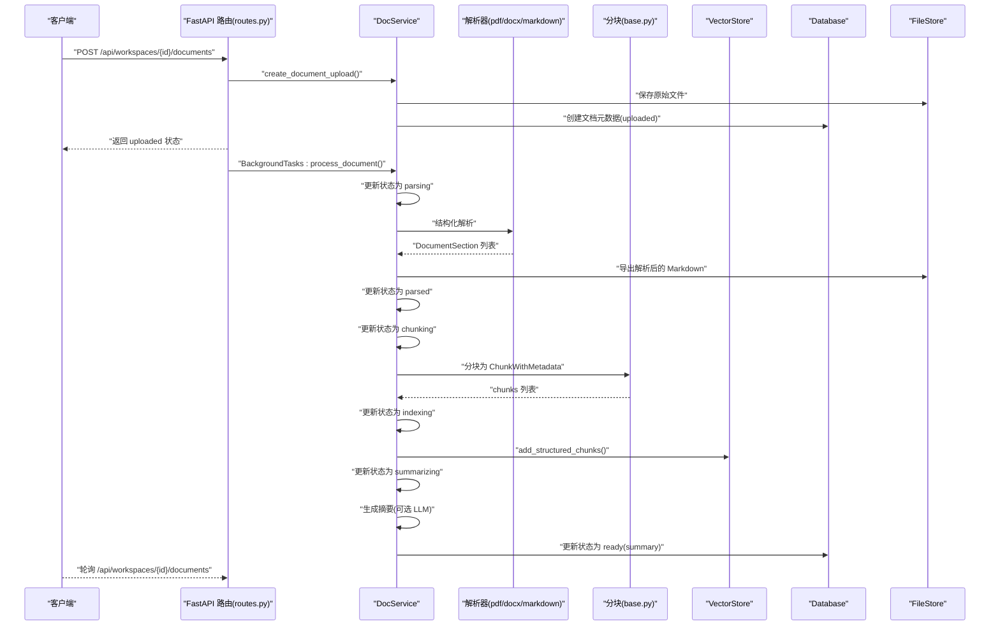
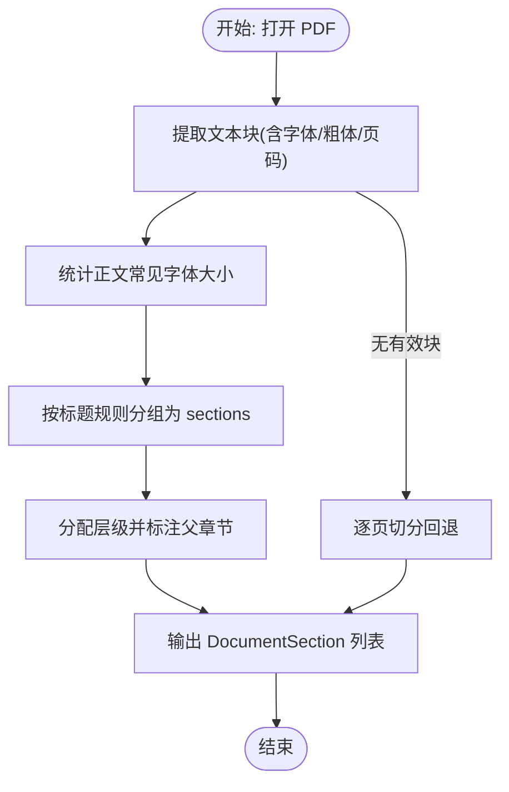
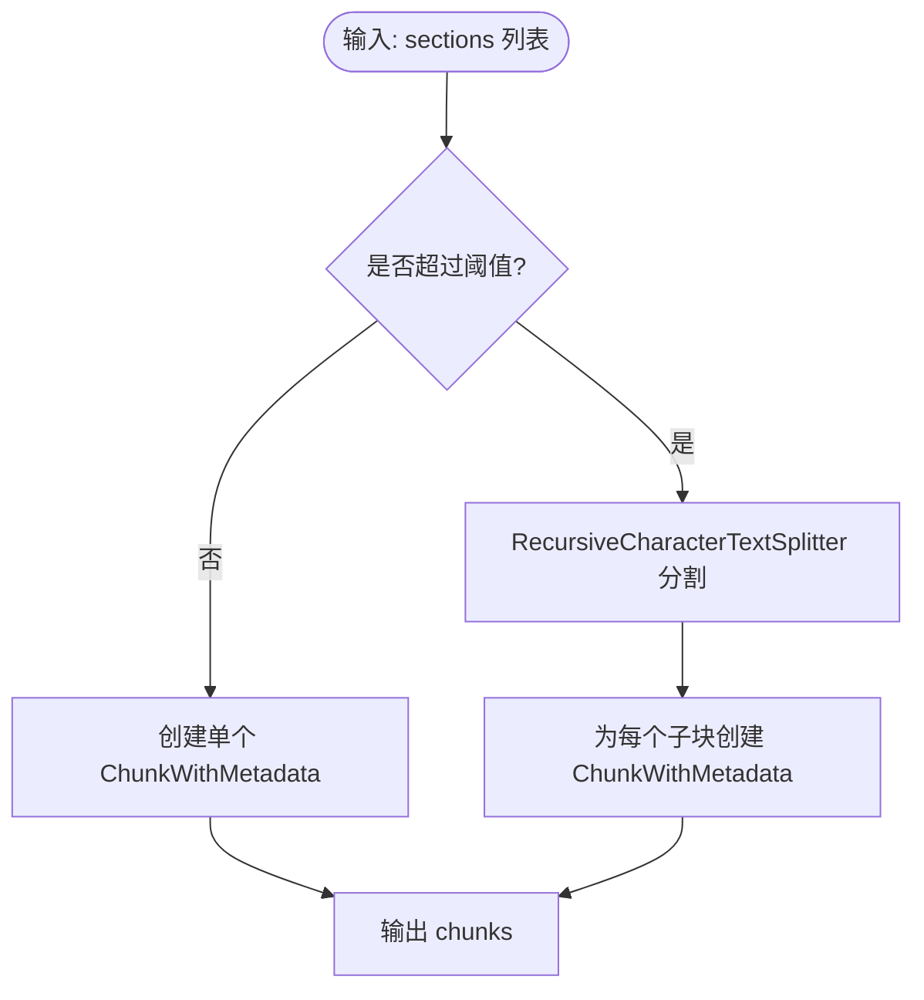
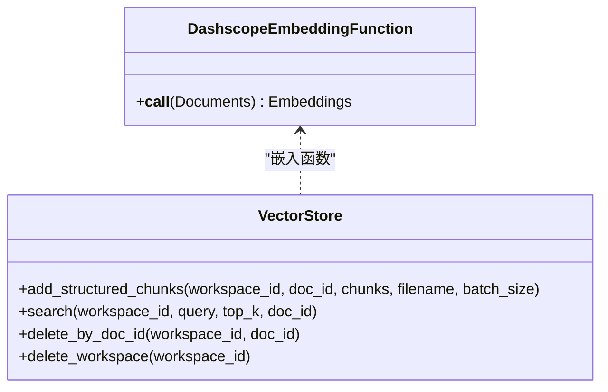
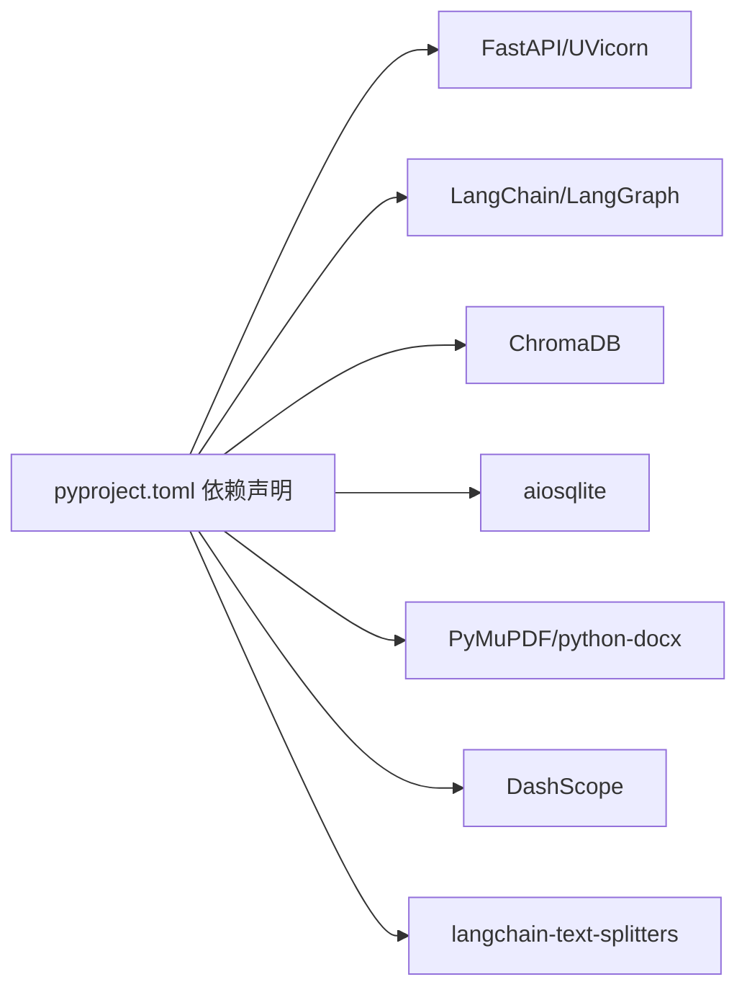

# 文档处理流水线

<cite>
**本文引用的文件**
- [backend/src/parsers/base.py](file://backend/src/parsers/base.py)
- [backend/src/parsers/pdf_parser.py](file://backend/src/parsers/pdf_parser.py)
- [backend/src/parsers/docx_parser.py](file://backend/src/parsers/docx_parser.py)
- [backend/src/parsers/markdown_parser.py](file://backend/src/parsers/markdown_parser.py)
- [backend/src/services/doc_service.py](file://backend/src/services/doc_service.py)
- [backend/src/storage/vector_store.py](file://backend/src/storage/vector_store.py)
- [backend/src/storage/database.py](file://backend/src/storage/database.py)
- [backend/src/storage/file_store.py](file://backend/src/storage/file_store.py)
- [backend/src/tools/rag_search.py](file://backend/src/tools/rag_search.py)
- [backend/src/api/routes.py](file://backend/src/api/routes.py)
- [backend/src/middlewares/inject_doc_context.py](file://backend/src/middlewares/inject_doc_context.py)
- [backend/scripts/inspect_chunks.py](file://backend/scripts/inspect_chunks.py)
- [backend/pyproject.toml](file://backend/pyproject.toml)
- [docs/backend-architecture.md](file://docs/backend-architecture.md)
</cite>

## 目录
1. [简介](#简介)
2. [项目结构](#项目结构)
3. [核心组件](#核心组件)
4. [架构总览](#架构总览)
5. [详细组件分析](#详细组件分析)
6. [依赖分析](#依赖分析)
7. [性能考虑](#性能考虑)
8. [故障排查指南](#故障排查指南)
9. [结论](#结论)
10. [附录](#附录)

## 简介
本技术文档围绕“文档处理流水线”展开，覆盖从文档上传到可用的完整处理流程：文件接收、格式检测、多格式解析器、文本分块、向量化与索引建立、文档摘要生成、元数据提取与存储、以及与 ChromaDB 的集成与查询优化。文档还包含异步处理实现细节、错误处理与性能优化建议，并给出核心类与方法的使用示例路径。

## 项目结构
后端采用四层架构：API 层、Agent 层、Service 层、Storage 层。文档处理流水线主要集中在 Service 层与 Storage 层，解析器位于独立的 parsers 目录，API 层负责接收上传并触发异步处理。

图表来源
- [backend/src/api/routes.py:112-128](file://backend/src/api/routes.py#L112-L128)
- [backend/src/services/doc_service.py:29-130](file://backend/src/services/doc_service.py#L29-L130)
- [backend/src/parsers/pdf_parser.py:20-35](file://backend/src/parsers/pdf_parser.py#L20-L35)
- [backend/src/parsers/docx_parser.py:23-83](file://backend/src/parsers/docx_parser.py#L23-L83)
- [backend/src/parsers/markdown_parser.py:16-61](file://backend/src/parsers/markdown_parser.py#L16-L61)
- [backend/src/parsers/base.py:47-96](file://backend/src/parsers/base.py#L47-L96)
- [backend/src/storage/database.py:285-311](file://backend/src/storage/database.py#L285-L311)
- [backend/src/storage/vector_store.py:39-177](file://backend/src/storage/vector_store.py#L39-L177)
- [backend/src/storage/file_store.py:11-38](file://backend/src/storage/file_store.py#L11-L38)
- [backend/src/tools/rag_search.py:40-75](file://backend/src/tools/rag_search.py#L40-L75)

章节来源
- [docs/backend-architecture.md:65-117](file://docs/backend-architecture.md#L65-L117)
- [backend/src/api/routes.py:112-128](file://backend/src/api/routes.py#L112-L128)
- [backend/src/services/doc_service.py:29-130](file://backend/src/services/doc_service.py#L29-L130)

## 核心组件
- DocService：文档处理编排器，负责文件类型检测、解析、分块、向量化、摘要生成与状态更新。
- 解析器：PdfParser、DocxParser、MarkdownParser，分别针对 PDF、DOCX、Markdown/纯文本进行结构化解析。
- 分块器：base.py 中的 split_sections_into_chunks，使用 RecursiveCharacterTextSplitter 实现段落级切分。
- VectorStore：ChromaDB 封装，提供嵌入函数、集合管理、批量添加与查询。
- Database：SQLite 元数据存储，异步 ORM 风格封装。
- FileStore：文件系统封装，支持同步/异步写入与目录清理。
- RAG 检索工具：rag_search，基于 VectorStore 查询并格式化返回结果。

章节来源
- [backend/src/services/doc_service.py:13-28](file://backend/src/services/doc_service.py#L13-L28)
- [backend/src/parsers/base.py:47-96](file://backend/src/parsers/base.py#L47-L96)
- [backend/src/storage/vector_store.py:39-177](file://backend/src/storage/vector_store.py#L39-L177)
- [backend/src/storage/database.py:9-379](file://backend/src/storage/database.py#L9-L379)
- [backend/src/storage/file_store.py:6-38](file://backend/src/storage/file_store.py#L6-L38)
- [backend/src/tools/rag_search.py:40-75](file://backend/src/tools/rag_search.py#L40-L75)

## 架构总览
文档处理流水线的关键路径如下：

图表来源
- [backend/src/api/routes.py:112-128](file://backend/src/api/routes.py#L112-L128)
- [backend/src/services/doc_service.py:29-130](file://backend/src/services/doc_service.py#L29-L130)
- [backend/src/parsers/pdf_parser.py:20-35](file://backend/src/parsers/pdf_parser.py#L20-L35)
- [backend/src/parsers/docx_parser.py:23-83](file://backend/src/parsers/docx_parser.py#L23-L83)
- [backend/src/parsers/markdown_parser.py:16-61](file://backend/src/parsers/markdown_parser.py#L16-L61)
- [backend/src/parsers/base.py:47-96](file://backend/src/parsers/base.py#L47-L96)
- [backend/src/storage/vector_store.py:91-122](file://backend/src/storage/vector_store.py#L91-L122)
- [backend/src/storage/database.py:285-311](file://backend/src/storage/database.py#L285-L311)
- [backend/src/storage/file_store.py:11-16](file://backend/src/storage/file_store.py#L11-L16)

## 详细组件分析

### 文档上传与异步处理
- API 层接收 multipart 文件，立即保存并创建元数据，返回 uploaded 状态；随后通过 BackgroundTasks 异步执行 DocService.process_document。
- DocService 在各阶段更新状态，便于前端轮询追踪进度。
- 支持的文件类型检测映射至 pdf/docx/markdown/text，对应不同解析策略。

章节来源
- [backend/src/api/routes.py:112-128](file://backend/src/api/routes.py#L112-L128)
- [backend/src/services/doc_service.py:29-130](file://backend/src/services/doc_service.py#L29-L130)
- [backend/src/services/doc_service.py:172-181](file://backend/src/services/doc_service.py#L172-L181)

### PDF 解析策略
- 使用 PyMuPDF 提取文本块及其字体大小、粗体信息与页码。
- 通过“正文字体大小检测 + 字号阈值 + 粗体 + 正则匹配”的启发式规则识别标题，并估计层级。
- 将连续正文归组到最近的标题之下，形成 DocumentSection 列表。
- 若无法检测结构，则回退为逐页切分为章节。

图表来源
- [backend/src/parsers/pdf_parser.py:20-35](file://backend/src/parsers/pdf_parser.py#L20-L35)
- [backend/src/parsers/pdf_parser.py:41-70](file://backend/src/parsers/pdf_parser.py#L41-L70)
- [backend/src/parsers/pdf_parser.py:72-80](file://backend/src/parsers/pdf_parser.py#L72-L80)
- [backend/src/parsers/pdf_parser.py:82-102](file://backend/src/parsers/pdf_parser.py#L82-L102)
- [backend/src/parsers/pdf_parser.py:104-111](file://backend/src/parsers/pdf_parser.py#L104-L111)
- [backend/src/parsers/pdf_parser.py:113-146](file://backend/src/parsers/pdf_parser.py#L113-L146)
- [backend/src/parsers/pdf_parser.py:148-174](file://backend/src/parsers/pdf_parser.py#L148-L174)
- [backend/src/parsers/pdf_parser.py:176-191](file://backend/src/parsers/pdf_parser.py#L176-L191)

章节来源
- [backend/src/parsers/pdf_parser.py:17-192](file://backend/src/parsers/pdf_parser.py#L17-L192)

### DOCX 解析策略
- 使用 python-docx 读取段落，依据段落样式名称映射到标题层级（如 Title、Heading 1/2/3/4）。
- 遍历段落，遇到标题即 flush 上一段内容为一个章节；若无任何标题，回退为整篇文档作为一个章节。

章节来源
- [backend/src/parsers/docx_parser.py:20-84](file://backend/src/parsers/docx_parser.py#L20-L84)

### Markdown/纯文本解析策略
- 使用正则匹配 #/# /##/### 等标题，计算章节内容区间。
- 若无标题，将整段文本作为一级章节。
- 支持 .txt 文件按相同逻辑处理。

章节来源
- [backend/src/parsers/markdown_parser.py:13-62](file://backend/src/parsers/markdown_parser.py#L13-L62)

### 文本分块与元数据增强
- 使用 RecursiveCharacterTextSplitter，chunk_size=2000，overlap=200，按段落/句子/中文标点/空格进行分割。
- 将 DocumentSection 转换为 ChunkWithMetadata，携带章节标题、层级、页码范围、chunk_index 等元数据，便于检索定位。

图表来源
- [backend/src/parsers/base.py:47-96](file://backend/src/parsers/base.py#L47-L96)

章节来源
- [backend/src/parsers/base.py:47-96](file://backend/src/parsers/base.py#L47-L96)

### 向量化与索引建立（ChromaDB）
- VectorStore 使用 DashscopeEmbeddingFunction 生成嵌入，集合命名按 workspace 隔离（ws_{workspace_id}），空间度量为余弦距离。
- 批量写入，默认 batch_size=20，将文本与元数据同时写入，元数据包含 doc_id、filename、chunk_index、section/chapter 标题、页码范围、层级等。
- 查询支持按 doc_id 过滤，返回带结构化位置信息的结果。

图表来源
- [backend/src/storage/vector_store.py:13-37](file://backend/src/storage/vector_store.py#L13-L37)
- [backend/src/storage/vector_store.py:39-177](file://backend/src/storage/vector_store.py#L39-L177)

章节来源
- [backend/src/storage/vector_store.py:39-177](file://backend/src/storage/vector_store.py#L39-L177)

### 文档摘要生成与存储
- DocService 在解析完成后，拼接所有章节为 full_text，导出 Markdown 并更新状态为 parsed。
- 可选地调用 LLM 生成摘要；若未配置 LLM 或失败，使用截断回退策略。
- 将摘要写入数据库记录，最终状态置为 ready。

章节来源
- [backend/src/services/doc_service.py:74-120](file://backend/src/services/doc_service.py#L74-L120)
- [backend/src/services/doc_service.py:202-218](file://backend/src/services/doc_service.py#L202-L218)

### RAG 检索工具与查询优化
- rag_search 工具根据 workspace_id 获取集合，支持按 doc_id 过滤，返回带文件名、章节/页码位置的片段。
- 查询返回包含距离信息，便于排序与过滤。

章节来源
- [backend/src/tools/rag_search.py:40-75](file://backend/src/tools/rag_search.py#L40-L75)
- [backend/src/storage/vector_store.py:124-163](file://backend/src/storage/vector_store.py#L124-L163)

### 中间件注入文档上下文
- inject_doc_context 中间件在每次推理前，从数据库读取当前工作区的文档摘要并注入系统提示词，提升检索与回答质量。

章节来源
- [backend/src/middlewares/inject_doc_context.py:11-40](file://backend/src/middlewares/inject_doc_context.py#L11-L40)

## 依赖分析
- 语言与框架：Python 3.12+、FastAPI、LangChain/LangGraph、ChromaDB、aiosqlite、PyMuPDF、python-docx、DashScope。
- 关键外部库在 pyproject.toml 中声明，确保版本与功能满足解析、分块、嵌入与向量检索需求。

图表来源
- [backend/pyproject.toml:6-26](file://backend/pyproject.toml#L6-L26)

章节来源
- [backend/pyproject.toml:1-41](file://backend/pyproject.toml#L1-L41)

## 性能考虑
- 异步处理：上传接口立即返回，后台异步执行解析、分块、索引与摘要，避免阻塞主线程。
- 批量写入：VectorStore 默认 batch_size=20，降低网络与磁盘 IO 压力。
- 分块策略：chunk_size=2000，overlap=200，兼顾语义完整性与检索精度。
- 集合隔离：按 workspace 隔离 collection，避免跨域检索干扰。
- 嵌入函数：DashscopeEmbeddingFunction 一次性批量请求，减少往返次数。
- 查询过滤：按 doc_id 过滤可显著缩小搜索空间，提高响应速度。

## 故障排查指南
- 文档状态异常：检查 DocService 的状态机流程与异常分支，确认数据库更新是否成功。
- 解析失败：确认解析器对目标格式的支持与回退逻辑是否生效（PDF 回退逐页、Markdown 无标题回退整段）。
- 向量检索为空：确认集合是否存在、是否按 workspace 隔离、是否正确设置 doc_id 过滤。
- 摘要生成失败：确认 LLM 配置与权限，观察回退策略是否被触发。
- 调试工具：使用 inspect_chunks.py 查看集合、过滤 doc_id、执行语义检索，核对元数据与分块情况。

章节来源
- [backend/src/services/doc_service.py:121-130](file://backend/src/services/doc_service.py#L121-L130)
- [backend/src/storage/vector_store.py:140-142](file://backend/src/storage/vector_store.py#L140-L142)
- [backend/scripts/inspect_chunks.py:44-136](file://backend/scripts/inspect_chunks.py#L44-L136)

## 结论
该文档处理流水线以清晰的分层架构与异步处理为核心，结合结构化解析、稳健的分块策略与 ChromaDB 向量索引，实现了从上传到可用的完整闭环。通过元数据增强与检索过滤，RAG 检索具备良好的定位能力；通过摘要生成与中间件注入，提升了问答质量。整体设计在可维护性、可扩展性与性能之间取得平衡。

## 附录

### 使用示例（方法与类）
- 上传文档并触发异步处理
  - 路由调用：[backend/src/api/routes.py:112-128](file://backend/src/api/routes.py#L112-L128)
  - 业务处理：[backend/src/services/doc_service.py:29-130](file://backend/src/services/doc_service.py#L29-L130)
- 解析器调用
  - PDF：[backend/src/parsers/pdf_parser.py:20-35](file://backend/src/parsers/pdf_parser.py#L20-L35)
  - DOCX：[backend/src/parsers/docx_parser.py:23-83](file://backend/src/parsers/docx_parser.py#L23-L83)
  - Markdown/纯文本：[backend/src/parsers/markdown_parser.py:16-61](file://backend/src/parsers/markdown_parser.py#L16-L61)
- 分块与元数据
  - [backend/src/parsers/base.py:47-96](file://backend/src/parsers/base.py#L47-L96)
- 向量索引
  - 批量添加：[backend/src/storage/vector_store.py:91-122](file://backend/src/storage/vector_store.py#L91-L122)
  - 查询：[backend/src/storage/vector_store.py:124-163](file://backend/src/storage/vector_store.py#L124-L163)
- 摘要生成
  - [backend/src/services/doc_service.py:202-218](file://backend/src/services/doc_service.py#L202-L218)
- RAG 检索工具
  - [backend/src/tools/rag_search.py:40-75](file://backend/src/tools/rag_search.py#L40-L75)
- 中间件注入
  - [backend/src/middlewares/inject_doc_context.py:11-40](file://backend/src/middlewares/inject_doc_context.py#L11-L40)