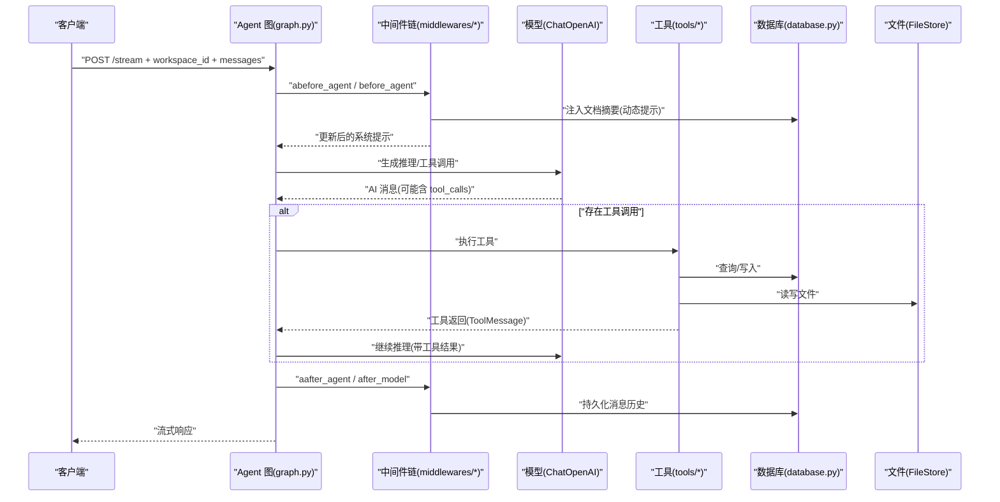
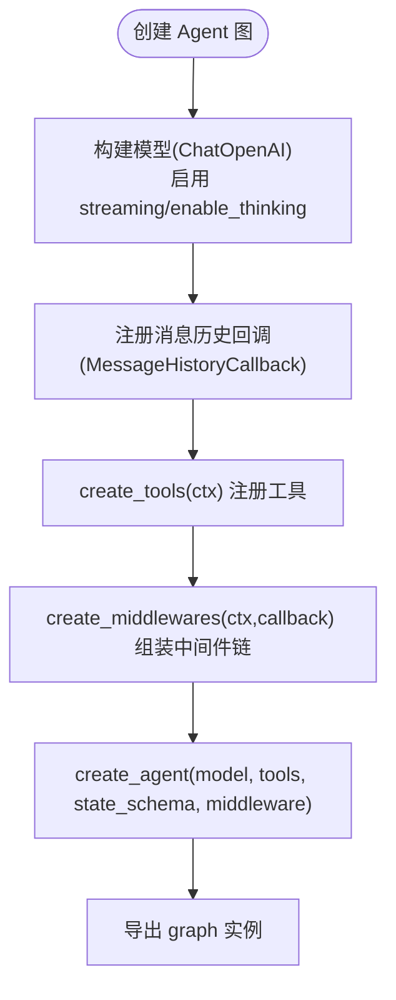
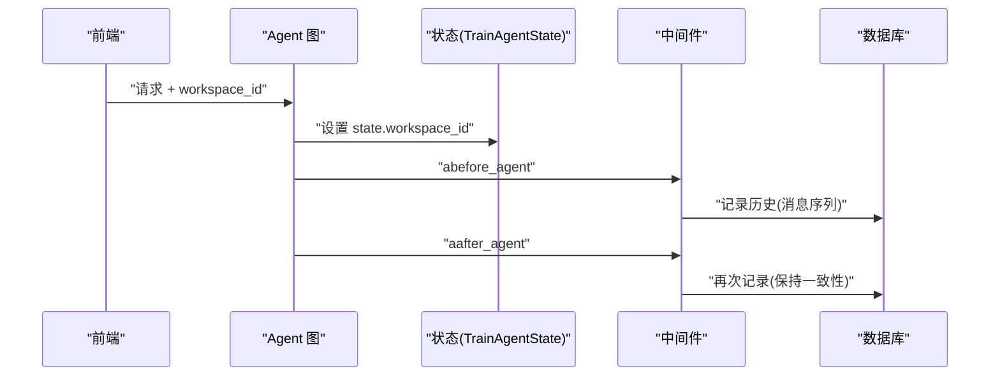
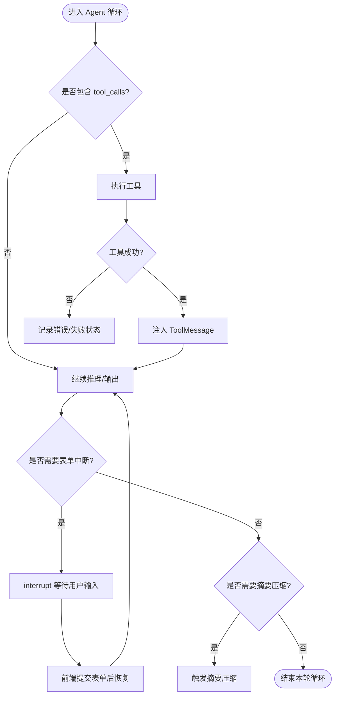
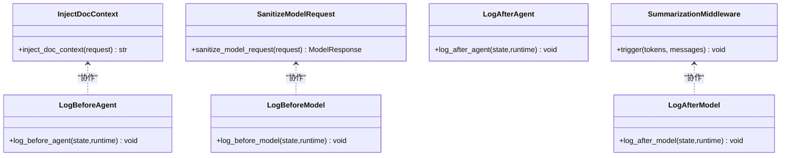
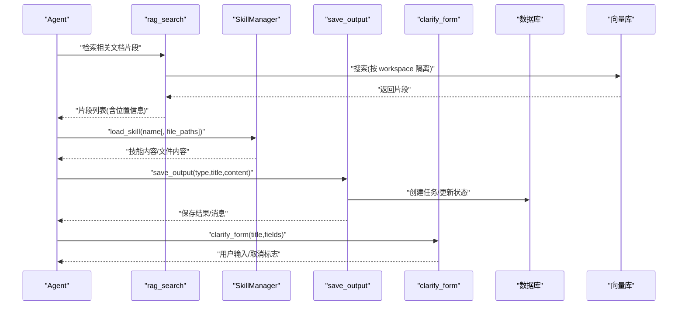
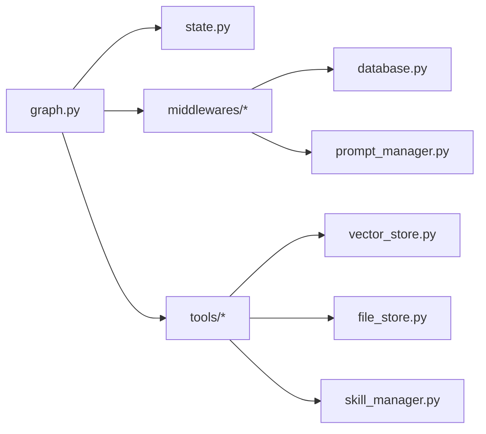

# Agent 图设计与编排

<cite>
**本文引用的文件**
- [backend/src/agent/graph.py](file://backend/src/agent/graph.py)
- [backend/src/agent/state.py](file://backend/src/agent/state.py)
- [backend/src/agent/message_history.py](file://backend/src/agent/message_history.py)
- [backend/src/agent/prompt_manager.py](file://backend/src/agent/prompt_manager.py)
- [backend/src/agent/skill_manager.py](file://backend/src/agent/skill_manager.py)
- [backend/src/middlewares/__init__.py](file://backend/src/middlewares/__init__.py)
- [backend/src/middlewares/inject_doc_context.py](file://backend/src/middlewares/inject_doc_context.py)
- [backend/src/middlewares/logging_middlewares.py](file://backend/src/middlewares/logging_middlewares.py)
- [backend/src/middlewares/model_message_sanitizer.py](file://backend/src/middlewares/model_message_sanitizer.py)
- [backend/src/tools/__init__.py](file://backend/src/tools/__init__.py)
- [backend/src/tools/clarify_form.py](file://backend/src/tools/clarify_form.py)
- [backend/src/tools/save_output.py](file://backend/src/tools/save_output.py)
- [backend/langgraph.json](file://backend/langgraph.json)
- [docs/backend-architecture.md](file://docs/backend-architecture.md)
- [AGENTS.md](file://AGENTS.md)
</cite>

## 目录
1. [简介](#简介)
2. [项目结构](#项目结构)
3. [核心组件](#核心组件)
4. [架构总览](#架构总览)
5. [详细组件分析](#详细组件分析)
6. [依赖分析](#依赖分析)
7. [性能考虑](#性能考虑)
8. [故障排查指南](#故障排查指南)
9. [结论](#结论)
10. [附录](#附录)

## 简介
本文件面向需要设计与编排基于 LangGraph 的 Agent 图的工程师与产品人员，系统阐述 Train Agent 的 Agent 图构建原理、节点与边的连接、状态流转与控制逻辑、执行流程（含条件分支、错误处理与重试思路）、状态管理（传递、验证与持久化）、最佳实践（命名、状态定义与性能优化）以及调试方法。文档以仓库现有实现为依据，结合架构文档与指南，提供可落地的设计与运维建议。

## 项目结构
后端采用“双进程”架构：FastAPI 进程负责 REST API 与文件/索引等后台任务；LangGraph 进程负责 Agent 运行时（流式对话、工具调用、中断恢复）。Agent 图位于独立进程内，通过 langgraph.json 指定入口。

```mermaid
graph TB
subgraph "前端(Next.js :3000)"
FE["聊天界面<br/>流式接收响应"]
end
subgraph "后端"
subgraph "FastAPI(:8000)"
API["路由与依赖<br/>routes.py / deps.py"]
SVC["文档服务<br/>doc_service.py"]
STORE["存储层<br/>database/vector/file"]
end
subgraph "LangGraph(:2024)"
GRAPH["Agent 图<br/>graph.py"]
STATE["Agent 状态<br/>state.py"]
MW["中间件链<br/>middlewares/*"]
TOOLS["工具集<br/>tools/*"]
end
end
FE --> |"REST"/"LangGraph Stream"| API
API --> SVC
SVC --> STORE
FE --> |"流式对话"| GRAPH
GRAPH --> STATE
GRAPH --> MW
GRAPH --> TOOLS
MW --> STORE
TOOLS --> STORE
```

图表来源
- [docs/backend-architecture.md:18-44](file6)
- [backend/src/agent/graph.py:16-48](file://backend/src/agent/graph.py#L16-L48)
- [backend/langgraph.json:4-8](file://backend/langgraph.json#L4-L8)

章节来源
- [docs/backend-architecture.md:7-44](file://docs/backend-architecture.md#L7-L44)
- [backend/langgraph.json:1-9](file://backend/langgraph.json#L1-L9)

## 核心组件
- Agent 图构建器：负责装配模型、工具、中间件与状态，导出可运行的 Agent 实例。
- Agent 状态：扩展标准 AgentState，增加 workspace_id 以实现工作区级隔离。
- 中间件链：日志、消息历史、请求清洗、动态提示注入、摘要压缩等。
- 工具集：RAG 检索、技能加载、产出保存、表单中断、脚本执行。
- 提示词管理：定义角色、规范与引用规则，配合中间件动态注入文档摘要。
- 技能管理器：扫描技能目录，提供渐进式披露与安全加载。

章节来源
- [backend/src/agent/graph.py:16-48](file://backend/src/agent/graph.py#L16-L48)
- [backend/src/agent/state.py:4-7](file://backend/src/agent/state.py#L4-L7)
- [backend/src/middlewares/__init__.py:18-41](file://backend/src/middlewares/__init__.py#L18-L41)
- [backend/src/tools/__init__.py:11-20](file://backend/src/tools/__init__.py#L11-L20)
- [backend/src/agent/prompt_manager.py:1-37](file://backend/src/agent/prompt_manager.py#L1-L37)
- [backend/src/agent/skill_manager.py:14-117](file://backend/src/agent/skill_manager.py#L14-L117)

## 架构总览
Agent 图的核心执行路径为“消息进入 → 中间件链 → LLM 推理 → 工具调用 → LLM 继续推理 → 流式输出”。中间件负责注入上下文、清洗消息、记录历史与摘要压缩；工具负责检索、加载技能、保存产出与表单中断；状态贯穿始终，承载 workspace_id 与消息序列。



图表来源
- [backend/src/agent/graph.py:16-48](file://backend/src/agent/graph.py#L16-L48)
- [backend/src/middlewares/inject_doc_context.py:14-40](file://backend/src/middlewares/inject_doc_context.py#L14-L40)
- [backend/src/middlewares/model_message_sanitizer.py:105-122](file://backend/src/middlewares/model_message_sanitizer.py#L105-L122)
- [backend/src/agent/message_history.py:13-143](file://backend/src/agent/message_history.py#L13-L143)
- [backend/src/tools/save_output.py:61-99](file://backend/src/tools/save_output.py#L61-L99)

章节来源
- [docs/backend-architecture.md:181-286](file://docs/backend-architecture.md#L181-L286)

## 详细组件分析

### Agent 图构建与节点/边/状态
- 模型：ChatOpenAI，启用 streaming 与 enable_thinking，回调集成消息历史持久化。
- 工具：通过 create_tools 统一注册，包含 clarify_form、rag_search、load_skill、save_output、run_skill_script。
- 中间件：按顺序执行 before_agent → MessageHistoryMiddleware → before_model → sanitize_model_request → inject_doc_context → after_model → after_agent → 摘要压缩。
- 状态：TrainAgentState 继承 AgentState 并扩展 workspace_id，贯穿消息与工具调用。



图表来源
- [backend/src/agent/graph.py:16-48](file://backend/src/agent/graph.py#L16-L48)
- [backend/src/tools/__init__.py:11-20](file://backend/src/tools/__init__.py#L11-L20)
- [backend/src/middlewares/__init__.py:18-41](file://backend/src/middlewares/__init__.py#L18-L41)

章节来源
- [backend/src/agent/graph.py:16-48](file://backend/src/agent/graph.py#L16-L48)
- [backend/src/agent/state.py:4-7](file://backend/src/agent/state.py#L4-L7)
- [backend/src/middlewares/__init__.py:18-41](file://backend/src/middlewares/__init__.py#L18-L41)
- [backend/src/tools/__init__.py:11-20](file://backend/src/tools/__init__.py#L11-L20)

### 状态管理：传递、验证与持久化
- 传递：workspace_id 在前端请求时传入，Agent 图在创建时注入到状态；工具通过 runtime.state 获取该值，实现工作区隔离。
- 验证：中间件在 before_agent/after_agent 与 before_model/after_model 时打印日志，便于验证消息数量与工具调用情况。
- 持久化：MessageHistoryCallback 将 human/ai/tool 消息持久化至数据库，跳过摘要生成过程的消息；MessageHistoryMiddleware 在每次 Agent 循环前后记录消息。



图表来源
- [backend/src/agent/state.py:4-7](file://backend/src/agent/state.py#L4-L7)
- [backend/src/middlewares/logging_middlewares.py:15-59](file://backend/src/middlewares/logging_middlewares.py#L15-L59)
- [backend/src/agent/message_history.py:13-143](file://backend/src/agent/message_history.py#L13-L143)

章节来源
- [backend/src/agent/state.py:4-7](file://backend/src/agent/state.py#L4-L7)
- [backend/src/agent/message_history.py:13-143](file://backend/src/agent/message_history.py#L13-L143)
- [backend/src/middlewares/logging_middlewares.py:15-59](file://backend/src/middlewares/logging_middlewares.py#L15-L59)

### 执行流程：条件分支、错误处理与重试思路
- 条件分支：
  - 工具调用：当 LLM 生成 tool_calls 时，Agent 进入工具执行分支；工具返回 ToolMessage 后，Agent 继续推理。
  - 表单中断：clarify_form 触发 interrupt，前端渲染表单，用户提交后恢复执行。
  - 摘要压缩：TrainAgentSummarizationMiddleware 基于 tokens/messages 阈值触发摘要压缩，减少上下文长度。
- 错误处理：
  - 保存产出失败时，工具将任务状态置为 failed 并记录错误信息，便于前端轮询发现异常。
  - 中间件记录异常日志，不影响整体流程，但可用于诊断。
- 重试机制：
  - 代码未内置自动重试；可通过前端轮询任务状态或在工具内部包装重试策略实现。



图表来源
- [backend/src/tools/clarify_form.py:24-46](file://backend/src/tools/clarify_form.py#L24-L46)
- [backend/src/tools/save_output.py:51-58](file://backend/src/tools/save_output.py#L51-L58)
- [backend/src/middlewares/__init__.py:31-40](file://backend/src/middlewares/__init__.py#L31-L40)

章节来源
- [backend/src/tools/clarify_form.py:24-46](file://backend/src/tools/clarify_form.py#L24-L46)
- [backend/src/tools/save_output.py:51-58](file://backend/src/tools/save_output.py#L51-L58)
- [backend/src/middlewares/__init__.py:31-40](file://backend/src/middlewares/__init__.py#L31-L40)

### 中间件链：动态提示注入与消息清洗
- 动态提示注入：inject_doc_context 从数据库读取当前 workspace 的文档摘要，拼接到系统提示词后，确保上下文新鲜且与知识库对齐。
- 消息清洗：sanitize_model_request 移除不受支持的内容片段类型，清理 tool_calls 与 invalid_tool_calls，保证与模型兼容。
- 日志中间件：log_before_agent/log_after_agent、log_before_model/log_after_model 记录消息数与工具调用，辅助可观测性。
- 摘要压缩：TrainAgentSummarizationMiddleware 基于 tokens 与消息数量阈值触发，保留最近 N 条消息，降低上下文成本。



图表来源
- [backend/src/middlewares/inject_doc_context.py:14-40](file://backend/src/middlewares/inject_doc_context.py#L14-L40)
- [backend/src/middlewares/model_message_sanitizer.py:105-122](file://backend/src/middlewares/model_message_sanitizer.py#L105-L122)
- [backend/src/middlewares/logging_middlewares.py:15-59](file://backend/src/middlewares/logging_middlewares.py#L15-L59)
- [backend/src/middlewares/__init__.py:31-40](file://backend/src/middlewares/__init__.py#L31-L40)

章节来源
- [backend/src/middlewares/inject_doc_context.py:14-40](file://backend/src/middlewares/inject_doc_context.py#L14-L40)
- [backend/src/middlewares/model_message_sanitizer.py:105-122](file://backend/src/middlewares/model_message_sanitizer.py#L105-L122)
- [backend/src/middlewares/logging_middlewares.py:15-59](file://backend/src/middlewares/logging_middlewares.py#L15-L59)
- [backend/src/middlewares/__init__.py:31-40](file://backend/src/middlewares/__init__.py#L31-L40)

### 工具集：RAG 检索、技能加载、产出保存与表单中断
- RAG 检索：在当前 workspace 的 ChromaDB collection 中检索，返回带位置信息的片段，供 LLM 生成带引用标记的回答。
- 技能加载：扫描 skills 目录，仅在 Agent 启动时暴露名称与描述；按需加载完整技能内容，支持批量加载关联文件。
- 产出保存：创建任务记录、写入文件、更新任务状态；失败时记录错误信息，便于前端轮询发现异常。
- 表单中断：通过 interrupt 触发，前端渲染交互式表单；用户取消时返回取消标志，尊重用户意愿。



图表来源
- [backend/src/tools/save_output.py:61-99](file://backend/src/tools/save_output.py#L61-L99)
- [backend/src/tools/clarify_form.py:24-46](file://backend/src/tools/clarify_form.py#L24-L46)
- [backend/src/agent/skill_manager.py:57-117](file://backend/src/agent/skill_manager.py#L57-L117)

章节来源
- [backend/src/tools/save_output.py:61-99](file://backend/src/tools/save_output.py#L61-L99)
- [backend/src/tools/clarify_form.py:24-46](file://backend/src/tools/clarify_form.py#L24-L46)
- [backend/src/agent/skill_manager.py:57-117](file://backend/src/agent/skill_manager.py#L57-L117)

### 提示词与引用规范
- 角色与职责：企业培训专家，强调结构化输出、基于事实、引用规范与场景限定。
- 引用规则：使用结构化标记 {{ref:文档名|章节或段落描述}}，紧随被引用观点文本同一行末尾，禁止单独置于段落末尾。
- 技能使用：通过 load_skill 工具查看与加载可用技能，支持 / 命令触发。

章节来源
- [backend/src/agent/prompt_manager.py:1-37](file://backend/src/agent/prompt_manager.py#L1-L37)

## 依赖分析
- Agent 图依赖：模型、工具、中间件、状态；中间件依赖数据库；工具依赖向量库与文件系统；提示词依赖技能管理器。
- 外部依赖：LangChain/LangGraph、OpenAI 兼容接口、ChromaDB、SQLite、DashScope Embedding。
- 配置入口：langgraph.json 指定 graphs.train_agent 对应的 graph 实例路径。



图表来源
- [backend/src/agent/graph.py:16-48](file://backend/src/agent/graph.py#L16-L48)
- [backend/src/middlewares/__init__.py:18-41](file://backend/src/middlewares/__init__.py#L18-L41)
- [backend/src/tools/__init__.py:11-20](file://backend/src/tools/__init__.py#L11-L20)
- [backend/langgraph.json:4-8](file://backend/langgraph.json#L4-L8)

章节来源
- [backend/src/agent/graph.py:16-48](file://backend/src/agent/graph.py#L16-L48)
- [backend/src/middlewares/__init__.py:18-41](file://backend/src/middlewares/__init__.py#L18-L41)
- [backend/src/tools/__init__.py:11-20](file://backend/src/tools/__init__.py#L11-L20)
- [backend/langgraph.json:4-8](file://backend/langgraph.json#L4-L8)

## 性能考虑
- 上下文控制：通过摘要压缩中间件限制 tokens 与消息数量，降低延迟与费用。
- 工具调用批量化：批量加载技能文件与向量写入，减少往返次数。
- 流式输出：启用 streaming，提升用户体验与感知性能。
- 存储隔离：按 workspace_id 隔离数据库与向量集合，避免跨域扫描。
- 日志与监控：利用日志中间件记录关键指标，便于定位热点与瓶颈。

## 故障排查指南
- 无 thread_id：消息历史记录会被跳过，检查前端请求是否正确传入 thread_id。
- 摘要注入失败：确认数据库连接初始化与 workspace_id 正确；查看中间件日志。
- 工具调用异常：关注 after_model 日志中的 tool_calls；保存产出失败时检查任务状态与错误信息。
- 模型兼容问题：若出现内容片段类型不支持，确认消息清洗中间件是否生效。
- 中断恢复：确认前端已正确提交表单并通过 resume API 恢复执行。

章节来源
- [backend/src/agent/message_history.py:19-40](file://backend/src/agent/message_history.py#L19-L40)
- [backend/src/middlewares/inject_doc_context.py:14-40](file://backend/src/middlewares/inject_doc_context.py#L14-L40)
- [backend/src/middlewares/logging_middlewares.py:15-59](file://backend/src/middlewares/logging_middlewares.py#L15-L59)
- [backend/src/middlewares/model_message_sanitizer.py:105-122](file://backend/src/middlewares/model_message_sanitizer.py#L105-L122)
- [backend/src/tools/save_output.py:51-58](file://backend/src/tools/save_output.py#L51-L58)

## 结论
本项目的 Agent 图以“状态驱动 + 中间件治理 + 工具编排”的方式实现了可扩展、可观测、可恢复的智能体运行时。通过 workspace_id 隔离与动态提示注入，Agent 能在多文档知识库中稳定工作；通过消息历史持久化与摘要压缩，兼顾性能与可追溯性。建议在后续迭代中补充自动重试、更细粒度的错误分类与可视化调试面板，以进一步提升稳定性与可维护性。

## 附录
- 命名规范建议
  - 节点/工具：采用动宾短语，如 rag_search、save_output、clarify_form。
  - 状态字段：使用语义明确的小驼峰，如 workspaceId、threadId、messages。
  - 中间件：按生命周期命名，如 before_agent、after_model。
- 状态定义模式
  - 统一在 TrainAgentState 中扩展必要字段，避免散落在工具中。
  - 工具内部通过 runtime.state 读取，避免直接依赖全局变量。
- 性能优化技巧
  - 控制上下文长度，合理设置摘要触发阈值。
  - 批量写入向量与文件，减少 IO 次数。
  - 使用流式输出与增量渲染，缩短首屏时间。
- 调试方法
  - 启用日志中间件，观察消息数与工具调用。
  - 使用 langgraph dev 与浏览器 Network 面板追踪流式事件。
  - 在工具中增加最小化日志与错误回退，便于定位问题。

章节来源
- [AGENTS.md:81-123](file://AGENTS.md#L81-L123)
- [docs/backend-architecture.md:431-465](file://docs/backend-architecture.md#L431-L465)