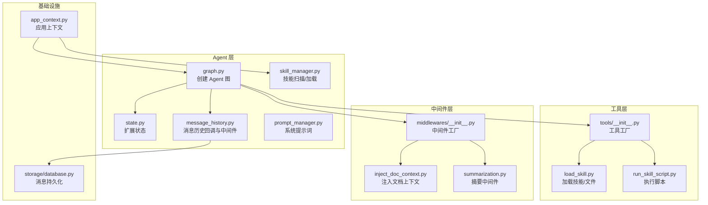
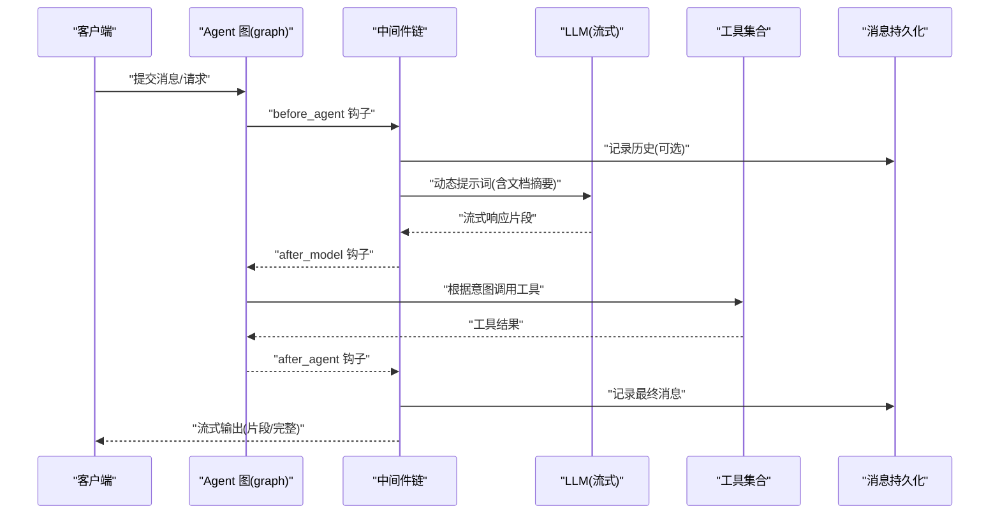
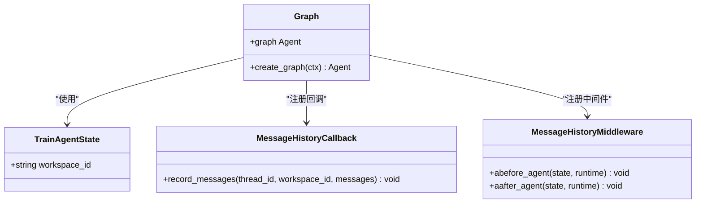
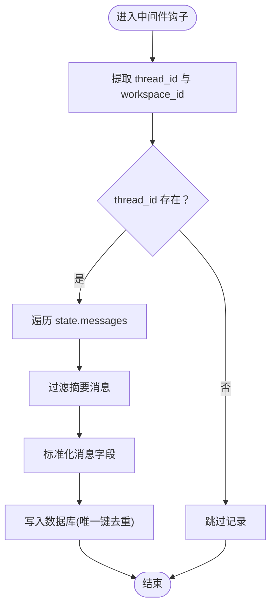
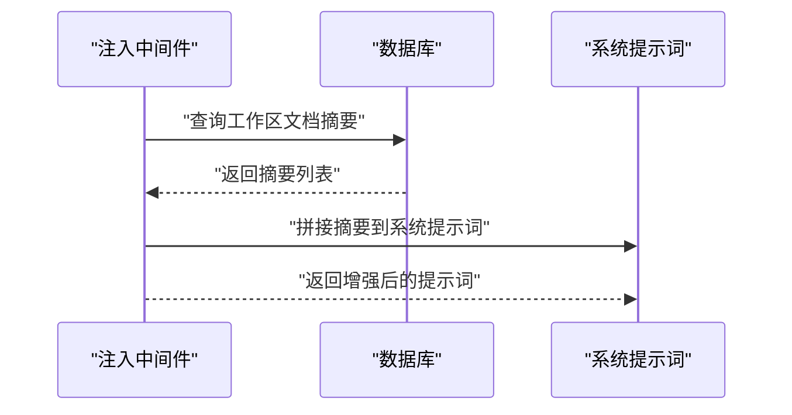
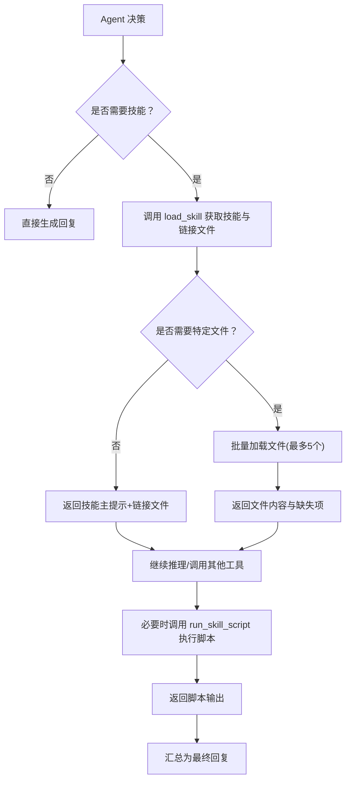
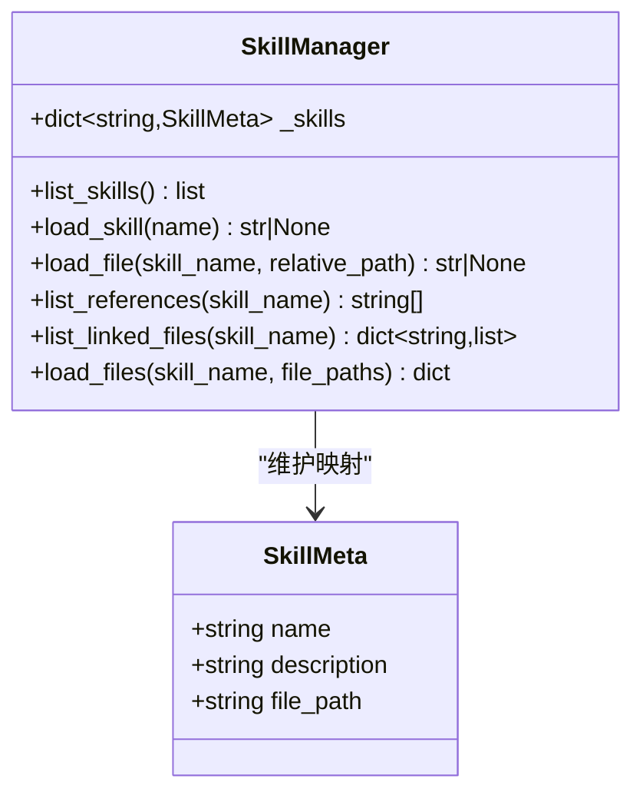
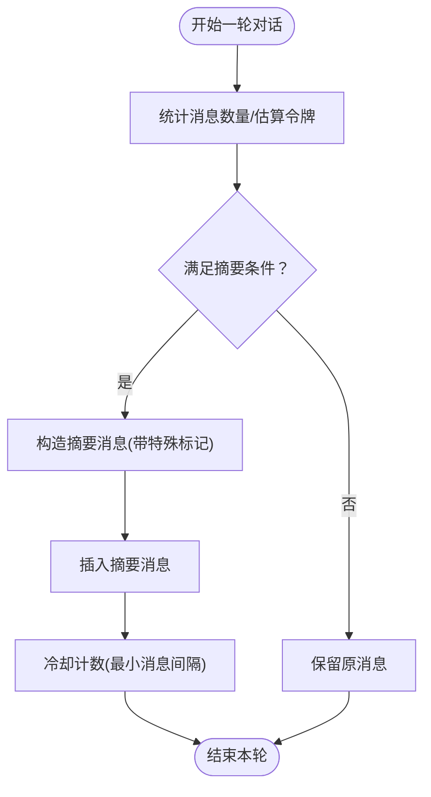
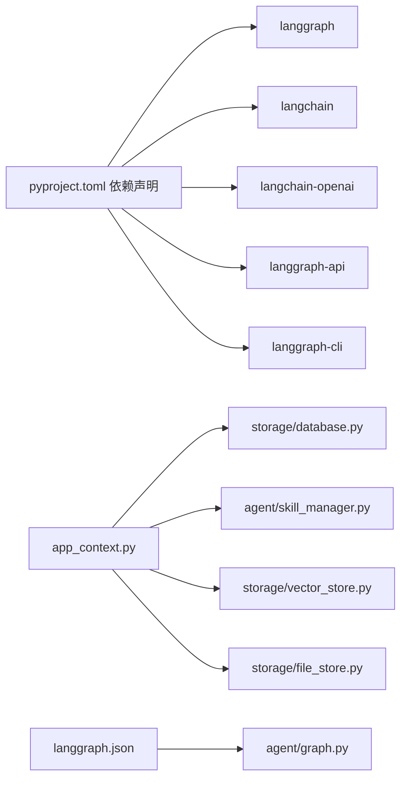

# 智能 Agent 机制

<cite>
**本文档引用的文件**
- [backend/src/agent/graph.py](file://backend/src/agent/graph.py)
- [backend/src/agent/state.py](file://backend/src/agent/state.py)
- [backend/src/agent/message_history.py](file://backend/src/agent/message_history.py)
- [backend/src/agent/prompt_manager.py](file://backend/src/agent/prompt_manager.py)
- [backend/src/agent/skill_manager.py](file://backend/src/agent/skill_manager.py)
- [backend/src/tools/__init__.py](file://backend/src/tools/__init__.py)
- [backend/src/tools/load_skill.py](file://backend/src/tools/load_skill.py)
- [backend/src/tools/run_skill_script.py](file://backend/src/tools/run_skill_script.py)
- [backend/src/middlewares/__init__.py](file://backend/src/middlewares/__init__.py)
- [backend/src/middlewares/inject_doc_context.py](file://backend/src/middlewares/inject_doc_context.py)
- [backend/src/middlewares/summarization.py](file://backend/src/middlewares/summarization.py)
- [backend/src/app_context.py](file://backend/src/app_context.py)
- [backend/src/storage/database.py](file://backend/src/storage/database.py)
- [backend/langgraph.json](file://backend/langgraph.json)
- [backend/pyproject.toml](file://backend/pyproject.toml)
</cite>

## 目录
1. [引言](#引言)
2. [项目结构](#项目结构)
3. [核心组件](#核心组件)
4. [架构总览](#架构总览)
5. [组件详解](#组件详解)
6. [依赖关系分析](#依赖关系分析)
7. [性能考量](#性能考量)
8. [故障排查指南](#故障排查指南)
9. [结论](#结论)
10. [附录](#附录)

## 引言
本文件面向“智能 Agent 机制”的技术文档，围绕基于 LangGraph 与 LangChain 的 Agent 架构展开，重点覆盖以下方面：
- Agent 图的构建与运行时控制流
- 状态模型与消息历史持久化
- 推理流程与提示词工程、工具调用机制、决策逻辑
- 技能管理系统（注册、发现、动态加载）
- 上下文窗口管理与会话恢复
- 配置与自定义实践（提示词模板、工具扩展、性能调优）
- 实时对话中的流式响应实现

## 项目结构
后端以模块化方式组织，核心位于 backend/src 下：
- agent：Agent 图、状态、消息历史回调与中间件、提示词管理、技能管理
- tools：工具工厂与具体工具（RAG 搜索、技能加载、脚本执行、输出保存、澄清表单）
- middlewares：日志、请求净化、文档上下文注入、摘要中间件
- storage：数据库、向量库、文件存储
- api/routes：API 路由（未在本文深入分析）
- langgraph.json：LangGraph 图配置入口
- pyproject.toml：依赖声明

图表来源
- [backend/src/agent/graph.py:16-37](file://backend/src/agent/graph.py#L16-L37)
- [backend/src/agent/state.py:4-7](file://backend/src/agent/state.py#L4-L7)
- [backend/src/agent/message_history.py:13-41](file://backend/src/agent/message_history.py#L13-L41)
- [backend/src/agent/prompt_manager.py:1-37](file://backend/src/agent/prompt_manager.py#L1-L37)
- [backend/src/agent/skill_manager.py:14-62](file://backend/src/agent/skill_manager.py#L14-L62)
- [backend/src/tools/__init__.py:11-19](file://backend/src/tools/__init__.py#L11-L19)
- [backend/src/tools/load_skill.py:13-116](file://backend/src/tools/load_skill.py#L13-L116)
- [backend/src/tools/run_skill_script.py:31-143](file://backend/src/tools/run_skill_script.py#L31-L143)
- [backend/src/middlewares/__init__.py:18-40](file://backend/src/middlewares/__init__.py#L18-L40)
- [backend/src/middlewares/inject_doc_context.py:11-40](file://backend/src/middlewares/inject_doc_context.py#L11-L40)
- [backend/src/middlewares/summarization.py:7-58](file://backend/src/middlewares/summarization.py#L7-L58)
- [backend/src/app_context.py:12-30](file://backend/src/app_context.py#L12-L30)
- [backend/src/storage/database.py:172-228](file://backend/src/storage/database.py#L172-L228)

章节来源
- [backend/langgraph.json:1-9](file://backend/langgraph.json#L1-L9)
- [backend/pyproject.toml:1-41](file://backend/pyproject.toml#L1-L41)

## 核心组件
- Agent 图与运行时
  - 通过模型（OpenAI 兼容接口，启用流式与思考开关）与工具、中间件、状态模式创建 Agent
  - 默认图通过环境变量初始化，供 LangGraph Serve 使用
- 状态模型
  - 扩展 AgentState，增加 workspace_id，用于多工作区隔离与会话恢复
- 消息历史
  - 异步回调记录完整消息（人类、AI、工具），并跳过摘要消息；中间件在前后钩子中触发持久化
- 提示词工程
  - 系统提示词强调结构化输出、引用规范、技能使用指引
  - 动态注入当前工作区文档摘要，增强上下文
- 技能管理
  - 扫描 skills 目录下的 SKILL.md，提取元数据；支持列出、加载技能主提示、批量加载文件、列出引用/脚本/资源等链接文件
- 工具链
  - 工具工厂统一创建：澄清表单、RAG 搜索、加载技能、保存输出、执行脚本
- 中间件链
  - 日志、消息历史中间件、请求净化、文档上下文注入、模型日志、Agent 日志、摘要中间件（含冷却策略）

章节来源
- [backend/src/agent/graph.py:16-48](file://backend/src/agent/graph.py#L16-L48)
- [backend/src/agent/state.py:4-7](file://backend/src/agent/state.py#L4-L7)
- [backend/src/agent/message_history.py:13-143](file://backend/src/agent/message_history.py#L13-L143)
- [backend/src/agent/prompt_manager.py:1-37](file://backend/src/agent/prompt_manager.py#L1-L37)
- [backend/src/agent/skill_manager.py:14-117](file://backend/src/agent/skill_manager.py#L14-L117)
- [backend/src/tools/__init__.py:11-19](file://backend/src/tools/__init__.py#L11-L19)
- [backend/src/middlewares/__init__.py:18-40](file://backend/src/middlewares/__init__.py#L18-L40)

## 架构总览
Agent 运行时从 LangGraph Serve 加载默认图，经由中间件链注入系统提示词与文档上下文，结合工具与状态驱动推理与行动。

图表来源
- [backend/src/agent/graph.py:16-37](file://backend/src/agent/graph.py#L16-L37)
- [backend/src/middlewares/__init__.py:18-40](file://backend/src/middlewares/__init__.py#L18-L40)
- [backend/src/middlewares/inject_doc_context.py:14-38](file://backend/src/middlewares/inject_doc_context.py#L14-L38)
- [backend/src/agent/message_history.py:119-142](file://backend/src/agent/message_history.py#L119-L142)
- [backend/src/storage/database.py:172-228](file://backend/src/storage/database.py#L172-L228)

## 组件详解

### Agent 图与状态模型
- 图构建
  - 创建 ChatOpenAI（流式、启用思考），附加消息历史回调
  - 工具与中间件通过工厂创建并注入
  - 返回 LangGraph Agent，状态模式为 TrainAgentState
- 状态模型
  - 扩展 AgentState，新增 workspace_id，支撑多工作区与会话恢复

图表来源
- [backend/src/agent/state.py:4-7](file://backend/src/agent/state.py#L4-L7)
- [backend/src/agent/message_history.py:13-41](file://backend/src/agent/message_history.py#L13-L41)
- [backend/src/agent/message_history.py:109-142](file://backend/src/agent/message_history.py#L109-L142)
- [backend/src/agent/graph.py:16-37](file://backend/src/agent/graph.py#L16-L37)

章节来源
- [backend/src/agent/graph.py:16-48](file://backend/src/agent/graph.py#L16-L48)
- [backend/src/agent/state.py:4-7](file://backend/src/agent/state.py#L4-L7)

### 消息历史与会话恢复
- 消息历史回调
  - 将消息标准化为统一记录，过滤摘要消息，写入数据库
  - 支持从 BaseMessage 或字典解析，兼容不同消息形态
- 中间件钩子
  - 在 before_agent/after_agent 时记录状态中的 messages
  - 从 runtime.execution_info 或 runtime.context 提取 thread_id
- 数据库持久化
  - 按 (thread_id, message_id, role) 唯一约束去重更新
  - 支持查询线程消息、游标翻页

图表来源
- [backend/src/agent/message_history.py:19-40](file://backend/src/agent/message_history.py#L19-L40)
- [backend/src/agent/message_history.py:119-142](file://backend/src/agent/message_history.py#L119-L142)
- [backend/src/storage/database.py:172-228](file://backend/src/storage/database.py#L172-L228)

章节来源
- [backend/src/agent/message_history.py:13-143](file://backend/src/agent/message_history.py#L13-L143)
- [backend/src/storage/database.py:172-280](file://backend/src/storage/database.py#L172-L280)

### 提示词工程与上下文注入
- 系统提示词
  - 明确角色定位、回答规范、引用规范、技能使用方式
- 文档上下文注入
  - 从数据库读取当前工作区文档摘要，拼接到系统提示词后
  - 仅在 db 初始化后读取，避免阻塞

图表来源
- [backend/src/middlewares/inject_doc_context.py:14-38](file://backend/src/middlewares/inject_doc_context.py#L14-L38)
- [backend/src/agent/prompt_manager.py:1-37](file://backend/src/agent/prompt_manager.py#L1-L37)

章节来源
- [backend/src/middlewares/inject_doc_context.py:11-40](file://backend/src/middlewares/inject_doc_context.py#L11-L40)
- [backend/src/agent/prompt_manager.py:1-37](file://backend/src/agent/prompt_manager.py#L1-L37)

### 工具链与推理决策
- 工具工厂
  - 统一创建：澄清表单、RAG 搜索、加载技能、保存输出、执行脚本
- 加载技能工具
  - 动态生成工具描述，列出可用技能；支持加载技能主提示与链接文件，或批量加载指定文件
  - 对 ${SKILL_DIR} 占位符进行替换
- 执行脚本工具
  - 限制在 skills/{skill_name}/scripts/ 目录内执行，支持 .sh/.py/.js/.ts
  - 超时控制、输出截断、错误码处理

图表来源
- [backend/src/tools/load_skill.py:13-116](file://backend/src/tools/load_skill.py#L13-L116)
- [backend/src/tools/run_skill_script.py:31-143](file://backend/src/tools/run_skill_script.py#L31-L143)
- [backend/src/agent/skill_manager.py:57-82](file://backend/src/agent/skill_manager.py#L57-L82)

章节来源
- [backend/src/tools/__init__.py:11-19](file://backend/src/tools/__init__.py#L11-L19)
- [backend/src/tools/load_skill.py:13-116](file://backend/src/tools/load_skill.py#L13-L116)
- [backend/src/tools/run_skill_script.py:31-143](file://backend/src/tools/run_skill_script.py#L31-L143)
- [backend/src/agent/skill_manager.py:14-117](file://backend/src/agent/skill_manager.py#L14-L117)

### 技能管理系统
- 扫描策略
  - 遍历 skills 目录，查找每个子目录下的 SKILL.md
  - 解析 YAML frontmatter，提取 name/description/file_path
- 列表与加载
  - list_skills 返回技能清单
  - load_skill 返回技能主提示，支持 ${SKILL_DIR} 替换
  - load_files 批量加载文件，返回映射
- 文件安全
  - load_file/list_linked_files 等均进行路径安全校验，防止越权访问

图表来源
- [backend/src/agent/skill_manager.py:7-117](file://backend/src/agent/skill_manager.py#L7-L117)

章节来源
- [backend/src/agent/skill_manager.py:14-117](file://backend/src/agent/skill_manager.py#L14-L117)

### 上下文窗口管理与会话恢复
- 摘要中间件
  - 基于令牌阈值与消息数量触发摘要，设置最小消息间隔，避免频繁摘要
  - 通过 lc_source 标记摘要消息，消息历史回调自动过滤
- 会话恢复
  - 通过 thread_id 与数据库消息表实现线程级消息检索与翻页
  - workspace_id 与 thread_id 联合标识会话，支持跨请求恢复

图表来源
- [backend/src/middlewares/summarization.py:19-47](file://backend/src/middlewares/summarization.py#L19-L47)
- [backend/src/agent/message_history.py:99-106](file://backend/src/agent/message_history.py#L99-L106)

章节来源
- [backend/src/middlewares/summarization.py:7-58](file://backend/src/middlewares/summarization.py#L7-L58)
- [backend/src/agent/message_history.py:13-41](file://backend/src/agent/message_history.py#L13-L41)

### 流式响应与实时对话
- 模型层
  - ChatOpenAI 启用 streaming，底层流式返回片段
- 中间件层
  - 摘要中间件在模型层之后，确保摘要不会被误判为用户可见消息
  - 消息历史中间件在模型层之前/之后记录，保证消息完整性
- 输出层
  - 客户端逐段接收模型输出，结合工具调用结果进行聚合

章节来源
- [backend/src/agent/graph.py:18-26](file://backend/src/agent/graph.py#L18-L26)
- [backend/src/middlewares/__init__.py:23-40](file://backend/src/middlewares/__init__.py#L23-L40)

## 依赖关系分析
- LangGraph 与 LangChain 生态
  - 依赖版本覆盖 LangGraph、LangChain、LangChain OpenAI、LangGraph API/CLI
- 应用上下文
  - AppContext 聚合数据库、向量库、文件存储、技能管理器，作为工厂函数输入
- 图配置
  - langgraph.json 指定入口模块与图对象，便于 Serve/CLI 使用

图表来源
- [backend/pyproject.toml:6-26](file://backend/pyproject.toml#L6-L26)
- [backend/src/app_context.py:12-30](file://backend/src/app_context.py#L12-L30)
- [backend/langgraph.json:4-5](file://backend/langgraph.json#L4-L5)

章节来源
- [backend/pyproject.toml:1-41](file://backend/pyproject.toml#L1-L41)
- [backend/src/app_context.py:12-30](file://backend/src/app_context.py#L12-L30)
- [backend/langgraph.json:1-9](file://backend/langgraph.json#L1-L9)

## 性能考量
- 流式输出
  - 模型层开启 streaming，降低首字节延迟，提升交互体验
- 摘要策略
  - 基于令牌阈值与消息数量触发摘要，减少上下文长度
  - 最小消息间隔避免频繁摘要带来的额外开销
- 输出截断
  - 脚本工具对超长输出进行截断，防止撑满上下文窗口
- I/O 优化
  - 数据库存储采用唯一键去重更新，减少重复写入
  - 查询使用游标翻页，限制单次返回条数

章节来源
- [backend/src/agent/graph.py:18-26](file://backend/src/agent/graph.py#L18-L26)
- [backend/src/middlewares/summarization.py:10-17](file://backend/src/middlewares/summarization.py#L10-L17)
- [backend/src/tools/run_skill_script.py:28-123](file://backend/src/tools/run_skill_script.py#L28-L123)
- [backend/src/storage/database.py:172-228](file://backend/src/storage/database.py#L172-L228)

## 故障排查指南
- 消息历史未记录
  - 检查是否传入 thread_id；确认中间件顺序与钩子是否执行
  - 关注回调异常日志，避免因异常导致记录失败
- 摘要消息干扰显示
  - 确认摘要消息带有特定标记；消息历史回调应过滤该类消息
- 技能加载失败
  - 检查技能名称是否存在；确认文件路径未越权；关注批量加载的缺失文件列表
- 脚本执行失败
  - 查看返回的退出码与标准错误；确认脚本类型受支持且路径在 scripts/ 目录内
- 上下文过长
  - 观察摘要触发频率；适当调整令牌阈值与最小消息间隔

章节来源
- [backend/src/agent/message_history.py:119-142](file://backend/src/agent/message_history.py#L119-L142)
- [backend/src/agent/message_history.py:99-106](file://backend/src/agent/message_history.py#L99-L106)
- [backend/src/tools/load_skill.py:63-74](file://backend/src/tools/load_skill.py#L63-L74)
- [backend/src/tools/run_skill_script.py:112-134](file://backend/src/tools/run_skill_script.py#L112-L134)
- [backend/src/middlewares/summarization.py:19-28](file://backend/src/middlewares/summarization.py#L19-L28)

## 结论
本系统以 LangGraph/LangChain 为核心，结合消息历史持久化、动态提示词注入、技能管理与工具链，实现了可扩展、可观测、可恢复的智能 Agent。通过流式输出与摘要中间件，兼顾了实时性与上下文窗口管理。未来可在提示词模板化、工具扩展点、性能监控等方面进一步演进。

## 附录

### 配置与自定义实践
- 提示词模板
  - 修改系统提示词以适配业务场景；在注入中间件中追加领域知识
- 工具扩展
  - 在工具工厂中注册新工具；遵循 LangChain 工具约定与参数校验
- 性能调优
  - 调整摘要中间件阈值与冷却；优化模型参数与流式片段大小
- 安全加固
  - 保持脚本执行与文件加载的路径安全检查；限制批量操作数量

章节来源
- [backend/src/agent/prompt_manager.py:1-37](file://backend/src/agent/prompt_manager.py#L1-L37)
- [backend/src/middlewares/inject_doc_context.py:14-38](file://backend/src/middlewares/inject_doc_context.py#L14-L38)
- [backend/src/tools/__init__.py:11-19](file://backend/src/tools/__init__.py#L11-L19)
- [backend/src/middlewares/summarization.py:10-17](file://backend/src/middlewares/summarization.py#L10-L17)
- [backend/src/tools/run_skill_script.py:72-75](file://backend/src/tools/run_skill_script.py#L72-L75)
- [backend/src/tools/load_skill.py:49-53](file://backend/src/tools/load_skill.py#L49-L53)