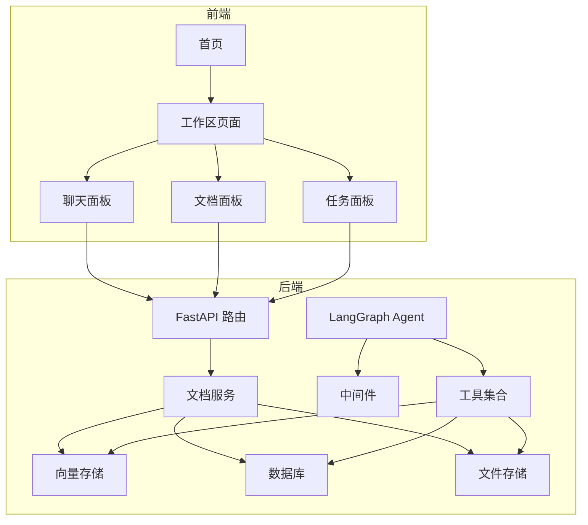
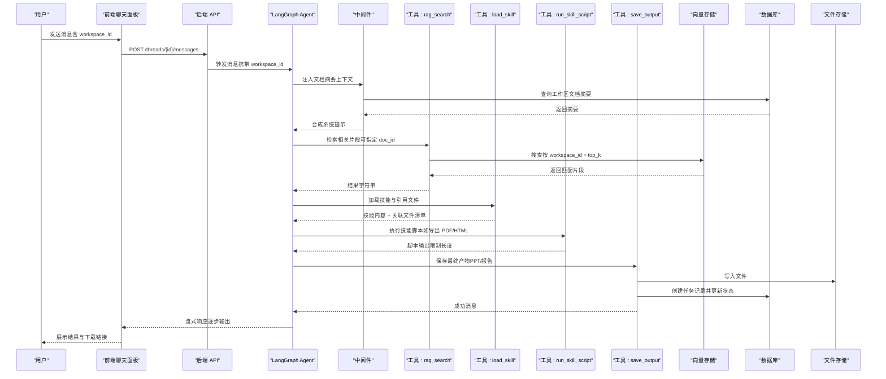
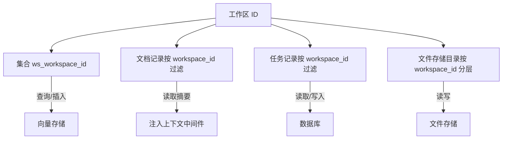
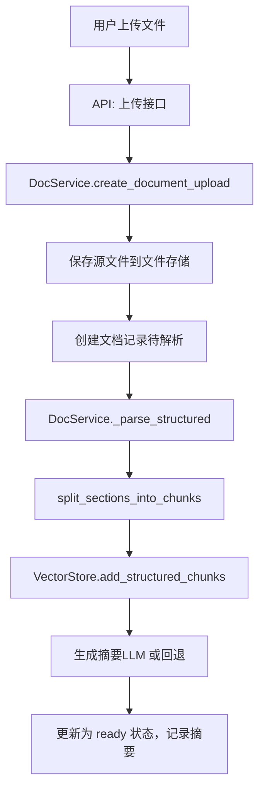
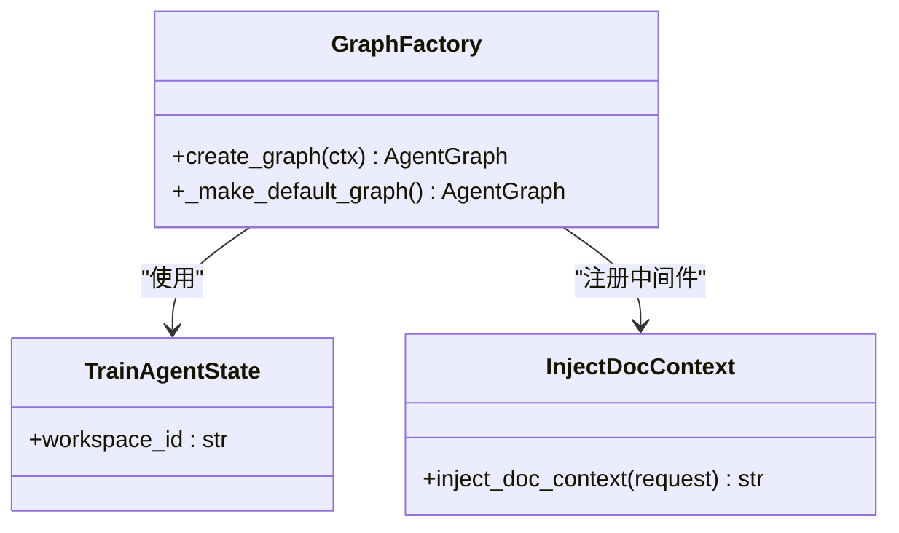
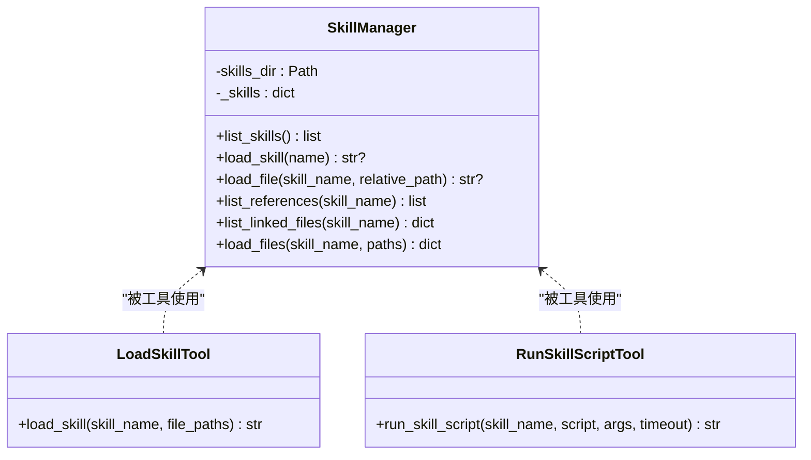
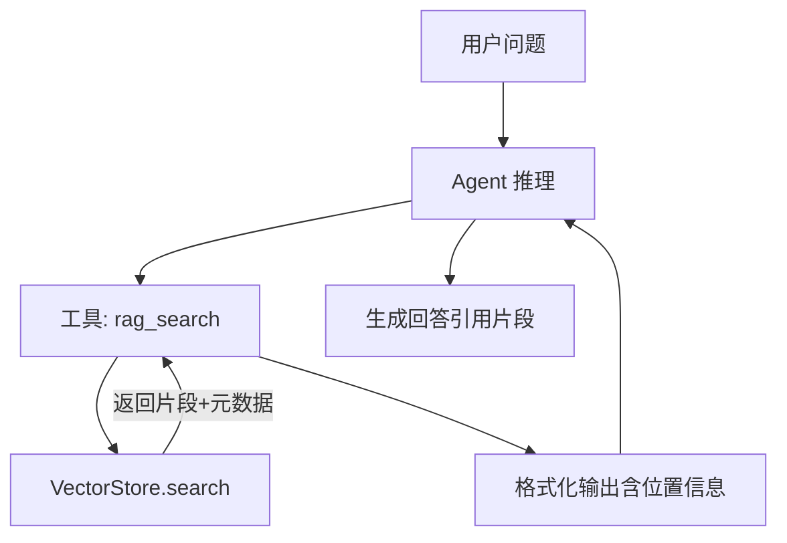
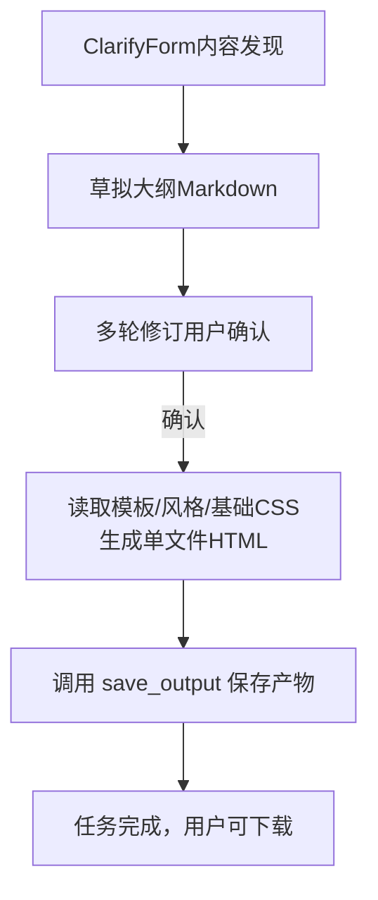
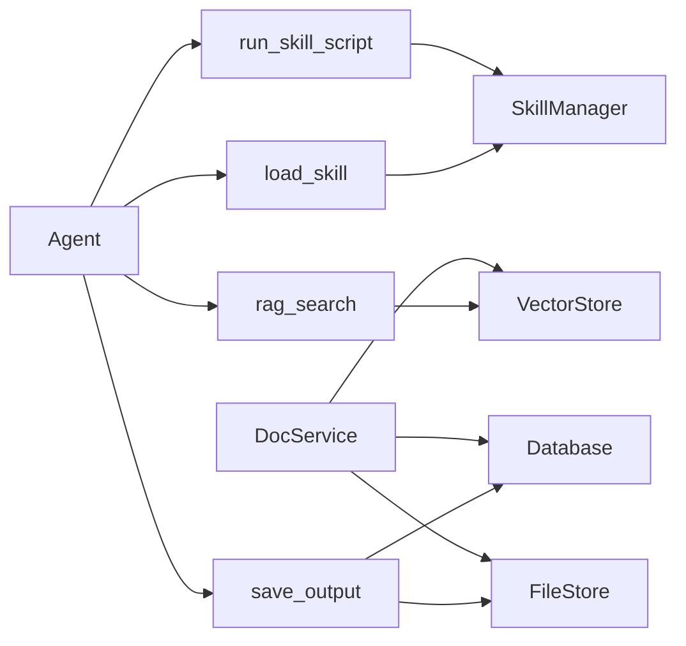

# 核心概念

<cite>
**本文引用的文件**
- [README.md](file://README.md)
- [backend/src/agent/graph.py](file://backend/src/agent/graph.py)
- [backend/src/agent/state.py](file://backend/src/agent/state.py)
- [backend/src/agent/skill_manager.py](file://backend/src/agent/skill_manager.py)
- [backend/src/tools/load_skill.py](file://backend/src/tools/load_skill.py)
- [backend/src/tools/run_skill_script.py](file://backend/src/tools/run_skill_script.py)
- [backend/src/tools/rag_search.py](file://backend/src/tools/rag_search.py)
- [backend/src/tools/save_output.py](file://backend/src/tools/save_output.py)
- [backend/src/storage/vector_store.py](file://backend/src/storage/vector_store.py)
- [backend/src/services/doc_service.py](file://backend/src/services/doc_service.py)
- [backend/src/api/routes.py](file://backend/src/api/routes.py)
- [backend/src/middlewares/inject_doc_context.py](file://backend/src/middlewares/inject_doc_context.py)
- [backend/skills/ppt/SKILL.md](file://backend/skills/ppt/SKILL.md)
- [backend/skills/ppt/references/html-template.md](file://backend/skills/ppt/references/html-template.md)
- [backend/skills/ppt/references/style-presets.md](file://backend/skills/ppt/references/style-presets.md)
</cite>

## 目录
1. [简介](#简介)
2. [项目结构](#项目结构)
3. [核心组件](#核心组件)
4. [架构总览](#架构总览)
5. [详细组件分析](#详细组件分析)
6. [依赖关系分析](#依赖关系分析)
7. [性能考量](#性能考量)
8. [故障排查指南](#故障排查指南)
9. [结论](#结论)
10. [附录](#附录)

## 简介
本文件面向开发者与产品人员，系统性阐释 Train Agent 的核心概念与实现要点，包括：
- 工作区（Workspace）的多租户隔离与权限边界
- 文档处理流水线（上传、解析、分块、向量化、索引、摘要）
- 智能 Agent 的工作机制（LangGraph Agent 推理与工具调用）
- 渐进式披露技能系统（Progressive Disclosure Skills）的设计与实现
- RAG（检索增强生成）的工作原理与在项目中的应用
- PPT 生成技能的技术实现与参数配置
- 实际代码示例与使用场景，帮助理解概念之间的关系与交互

## 项目结构
项目采用前后端分离与多服务协作的架构：
- 后端（FastAPI + LangGraph）：REST API、文档处理、RAG、Agent 推理、工具与中间件
- 前端（Next.js）：工作区、文档、聊天、任务面板
- 数据层：SQLite（元数据）、ChromaDB（向量）、文件存储（本地）

图表来源
- [backend/src/api/routes.py:21-189](file://backend/src/api/routes.py#L21-L189)
- [backend/src/agent/graph.py:16-49](file://backend/src/agent/graph.py#L16-L49)
- [backend/src/services/doc_service.py:13-218](file://backend/src/services/doc_service.py#L13-L218)
- [backend/src/storage/vector_store.py:39-177](file://backend/src/storage/vector_store.py#L39-L177)

章节来源
- [README.md:1-133](file://README.md#L1-L133)
- [backend/src/api/routes.py:21-189](file://backend/src/api/routes.py#L21-L189)

## 核心组件
- 工作区（Workspace）：多租户隔离单元，所有文档、向量集合、任务均以 workspace_id 为边界进行隔离与检索。
- 文档服务（DocService）：负责文件上传、结构化解析、分块、向量化、摘要生成与状态管理。
- 向量存储（VectorStore）：基于 ChromaDB 的持久化向量库，按工作区命名空间隔离集合。
- Agent 与工具：LangGraph Agent 驱动，通过工具实现 RAG 检索、技能加载、脚本执行、产物保存。
- 技能系统（Skill Manager）：扫描技能目录，提供技能清单与文件加载，遵循渐进式披露模式。
- 中间件（inject_doc_context）：在系统提示中注入当前工作区的文档摘要，增强上下文。

章节来源
- [backend/src/services/doc_service.py:13-218](file://backend/src/services/doc_service.py#L13-L218)
- [backend/src/storage/vector_store.py:39-177](file://backend/src/storage/vector_store.py#L39-L177)
- [backend/src/agent/graph.py:16-49](file://backend/src/agent/graph.py#L16-L49)
- [backend/src/agent/skill_manager.py:14-117](file://backend/src/agent/skill_manager.py#L14-L117)
- [backend/src/middlewares/inject_doc_context.py:11-41](file://backend/src/middlewares/inject_doc_context.py#L11-L41)

## 架构总览
Agent 在推理过程中，结合当前工作区上下文与工具链完成端到端任务。其核心控制流如下：

图表来源
- [backend/src/agent/graph.py:16-49](file://backend/src/agent/graph.py#L16-L49)
- [backend/src/middlewares/inject_doc_context.py:11-41](file://backend/src/middlewares/inject_doc_context.py#L11-L41)
- [backend/src/tools/rag_search.py:40-76](file://backend/src/tools/rag_search.py#L40-L76)
- [backend/src/tools/load_skill.py:13-116](file://backend/src/tools/load_skill.py#L13-L116)
- [backend/src/tools/run_skill_script.py:31-143](file://backend/src/tools/run_skill_script.py#L31-L143)
- [backend/src/tools/save_output.py:61-99](file://backend/src/tools/save_output.py#L61-L99)
- [backend/src/storage/vector_store.py:124-177](file://backend/src/storage/vector_store.py#L124-L177)
- [backend/src/api/routes.py:84-97](file://backend/src/api/routes.py#L84-L97)

## 详细组件分析

### 工作区（Workspace）与多租户隔离
- 隔离维度
  - 向量集合：按 workspace_id 命名集合（ws_workspace_id），不同工作区互不干扰
  - 文档与任务：数据库表以 workspace_id 过滤；文件存储按工作区目录组织
- 权限边界
  - 工具与中间件均从 Agent 状态读取 workspace_id，确保检索与写入严格限定在当前工作区内
  - 删除工作区时，同时清理向量集合、文件与数据库记录，避免残留

图表来源
- [backend/src/storage/vector_store.py:44-55](file://backend/src/storage/vector_store.py#L44-L55)
- [backend/src/middlewares/inject_doc_context.py:14-38](file://backend/src/middlewares/inject_doc_context.py#L14-L38)
- [backend/src/api/routes.py:99-106](file://backend/src/api/routes.py#L99-L106)

章节来源
- [backend/src/storage/vector_store.py:39-177](file://backend/src/storage/vector_store.py#L39-L177)
- [backend/src/middlewares/inject_doc_context.py:11-41](file://backend/src/middlewares/inject_doc_context.py#L11-L41)
- [backend/src/api/routes.py:99-106](file://backend/src/api/routes.py#L99-L106)

### 文档处理流水线（上传 → 解析 → 分块 → 向量化 → 索引 → 摘要）
- 入口：API 接收文件上传，异步触发后台处理
- 解析：根据文件类型选择解析器（PDF/DOCX/Mardown/TXT），提取结构化章节
- 分块：按章节切分为可向量化的片段，保留章节/页码等元信息
- 向量化：调用嵌入模型生成向量并写入对应工作区集合
- 索引：将文档元数据与片段写入向量库，便于后续检索
- 摘要：生成文档摘要并存入数据库，供 Agent 注入上下文

图表来源
- [backend/src/api/routes.py:112-128](file://backend/src/api/routes.py#L112-L128)
- [backend/src/services/doc_service.py:29-130](file://backend/src/services/doc_service.py#L29-L130)
- [backend/src/storage/vector_store.py:91-122](file://backend/src/storage/vector_store.py#L91-L122)

章节来源
- [backend/src/api/routes.py:112-128](file://backend/src/api/routes.py#L112-L128)
- [backend/src/services/doc_service.py:13-218](file://backend/src/services/doc_service.py#L13-L218)
- [backend/src/storage/vector_store.py:39-177](file://backend/src/storage/vector_store.py#L39-L177)

### 智能 Agent 与 LangGraph 推理
- Agent 入口：创建 ChatOpenAI 模型实例，启用流式输出与思考开关，并挂载消息历史回调
- 工具注册：统一通过 create_tools 创建工具集（RAG、技能加载、脚本执行、保存输出）
- 中间件：动态注入当前工作区文档摘要到系统提示，形成上下文增强
- 状态：扩展 AgentState，加入 workspace_id 字段，贯穿工具调用与检索

图表来源
- [backend/src/agent/state.py:4-7](file://backend/src/agent/state.py#L4-L7)
- [backend/src/agent/graph.py:16-49](file://backend/src/agent/graph.py#L16-L49)
- [backend/src/middlewares/inject_doc_context.py:11-41](file://backend/src/middlewares/inject_doc_context.py#L11-L41)

章节来源
- [backend/src/agent/graph.py:16-49](file://backend/src/agent/graph.py#L16-L49)
- [backend/src/agent/state.py:4-7](file://backend/src/agent/state.py#L4-L7)
- [backend/src/middlewares/inject_doc_context.py:11-41](file://backend/src/middlewares/inject_doc_context.py#L11-L41)

### 渐进式披露技能系统（Skills）
- 设计理念：将复杂能力封装为“技能”，Agent 仅看到技能清单与描述；按需加载技能内容与关联资源，降低一次性上下文负担
- 目录结构：backend/skills/<skill>/SKILL.md 为技能入口，references/scripts/assets/templates 子目录存放配套文件
- 能力边界：工具加载与脚本执行均受安全检查，禁止路径穿越，仅允许访问技能目录内文件

图表来源
- [backend/src/agent/skill_manager.py:14-117](file://backend/src/agent/skill_manager.py#L14-L117)
- [backend/src/tools/load_skill.py:13-116](file://backend/src/tools/load_skill.py#L13-L116)
- [backend/src/tools/run_skill_script.py:31-143](file://backend/src/tools/run_skill_script.py#L31-L143)

章节来源
- [backend/src/agent/skill_manager.py:14-117](file://backend/src/agent/skill_manager.py#L14-L117)
- [backend/src/tools/load_skill.py:13-116](file://backend/src/tools/load_skill.py#L13-L116)
- [backend/src/tools/run_skill_script.py:31-143](file://backend/src/tools/run_skill_script.py#L31-L143)

### RAG（检索增强生成）
- 检索入口：rag_search 工具接收查询、top_k 与可选 doc_id，按 workspace_id 限定作用域
- 上下文注入：中间件将当前工作区文档摘要拼接到系统提示，提升检索与生成的相关性
- 结果格式：对检索结果进行人类可读的位置格式化（章节/页码/片段索引），便于 Agent 引用

图表来源
- [backend/src/tools/rag_search.py:40-76](file://backend/src/tools/rag_search.py#L40-L76)
- [backend/src/storage/vector_store.py:124-163](file://backend/src/storage/vector_store.py#L124-L163)
- [backend/src/middlewares/inject_doc_context.py:14-38](file://backend/src/middlewares/inject_doc_context.py#L14-L38)

章节来源
- [backend/src/tools/rag_search.py:40-76](file://backend/src/tools/rag_search.py#L40-L76)
- [backend/src/storage/vector_store.py:124-163](file://backend/src/storage/vector_store.py#L124-L163)
- [backend/src/middlewares/inject_doc_context.py:14-38](file://backend/src/middlewares/inject_doc_context.py#L14-L38)

### PPT 生成技能（技术实现与参数）
- 技能入口：backend/skills/ppt/SKILL.md 定义了完整的生成流程（发现内容、确认大纲、构建展示、交付）
- 关键参考文件：
  - html-template.md：HTML 架构、样式变量、动画与交互实现规范
  - style-presets.md：12 套视觉风格的配色、字体与标志性元素
  - viewport-base.css：强制视口适配的基础 CSS（必须内联）
- 生成流程要点
  - 内容发现：收集用途、长度、内容来源、视觉风格等，必要时评估图像素材
  - 大纲确认：输出 Markdown 大纲，经用户确认后方可进入最终生成
  - 最终构建：读取模板与风格文件，生成单文件自包含 HTML，内联 CSS/JS
  - 交付：调用 save_output 工具保存至文件存储并创建任务记录

图表来源
- [backend/skills/ppt/SKILL.md:66-269](file://backend/skills/ppt/SKILL.md#L66-L269)
- [backend/skills/ppt/references/html-template.md:1-420](file://backend/skills/ppt/references/html-template.md#L1-L420)
- [backend/skills/ppt/references/style-presets.md:1-348](file://backend/skills/ppt/references/style-presets.md#L1-L348)
- [backend/src/tools/save_output.py:61-99](file://backend/src/tools/save_output.py#L61-L99)

章节来源
- [backend/skills/ppt/SKILL.md:66-269](file://backend/skills/ppt/SKILL.md#L66-L269)
- [backend/skills/ppt/references/html-template.md:1-420](file://backend/skills/ppt/references/html-template.md#L1-L420)
- [backend/skills/ppt/references/style-presets.md:1-348](file://backend/skills/ppt/references/style-presets.md#L1-L348)
- [backend/src/tools/save_output.py:61-99](file://backend/src/tools/save_output.py#L61-L99)

## 依赖关系分析
- 组件耦合
  - Agent 依赖工具与中间件；工具依赖存储（向量/数据库/文件）
  - 文档服务横跨文件存储、数据库与向量存储，承担数据面职责
- 外部依赖
  - 向量存储：ChromaDB（持久化客户端）
  - 嵌入模型：DashScope 文本嵌入
  - LLM：ChatOpenAI（用于摘要生成与对话）
- 循环依赖
  - 未见循环导入；模块职责清晰，工具与中间件通过工厂函数注入

图表来源
- [backend/src/agent/graph.py:28-37](file://backend/src/agent/graph.py#L28-L37)
- [backend/src/tools/rag_search.py:40-76](file://backend/src/tools/rag_search.py#L40-L76)
- [backend/src/tools/load_skill.py:13-116](file://backend/src/tools/load_skill.py#L13-L116)
- [backend/src/tools/run_skill_script.py:31-143](file://backend/src/tools/run_skill_script.py#L31-L143)
- [backend/src/tools/save_output.py:61-99](file://backend/src/tools/save_output.py#L61-L99)
- [backend/src/services/doc_service.py:13-28](file://backend/src/services/doc_service.py#L13-L28)

章节来源
- [backend/src/agent/graph.py:28-37](file://backend/src/agent/graph.py#L28-L37)
- [backend/src/services/doc_service.py:13-28](file://backend/src/services/doc_service.py#L13-L28)

## 性能考量
- 向量检索
  - 使用 cosine 距离度量与批处理写入，减少网络往返与 IO 开销
  - 按工作区集合隔离，避免无关文档参与检索
- 输出截断
  - 脚本执行输出限制最大字符数，防止上下文溢出
- 异步处理
  - 文档上传后立即返回，后台异步解析与向量化，提升响应速度
- 缓存与复用
  - 中间件注入文档摘要，减少重复检索与重复构造提示的成本

## 故障排查指南
- 向量检索为空
  - 检查工作区是否已建立集合；确认文档已完成“解析→分块→索引→摘要”的完整流程
  - 章节来源：[backend/src/storage/vector_store.py:124-163](file://backend/src/storage/vector_store.py#L124-L163)
- 工具报错“Skill 不存在”
  - 确认技能目录结构与 SKILL.md 前言字段；检查工具调用参数 skill_name 是否正确
  - 章节来源：[backend/src/tools/load_skill.py:56-74](file://backend/src/tools/load_skill.py#L56-L74)
- 脚本执行失败或超时
  - 检查脚本类型映射与解释器；确认脚本位于 scripts/ 目录且未发生路径穿越
  - 章节来源：[backend/src/tools/run_skill_script.py:60-82](file://backend/src/tools/run_skill_script.py#L60-L82)
- 产物未出现
  - 确认已调用 save_output 且 Agent 在用户确认大纲后再调用
  - 章节来源：[backend/skills/ppt/SKILL.md:234-259](file://backend/skills/ppt/SKILL.md#L234-L259)

## 结论
本项目通过“工作区多租户 + 文档处理流水线 + LangGraph Agent + 渐进式披露技能 + RAG”的组合，实现了从知识入库到智能生成的闭环。技能系统与工具链的解耦设计，使得 Agent 能够按需加载能力并安全地执行外部脚本，既保证了灵活性，也维持了边界安全。PPT 生成技能以严格的模板与风格约束，确保输出质量与一致性。

## 附录
- 环境变量与默认值
  - LLM 与嵌入模型、API 基础地址、数据目录等，详见项目说明
  - 章节来源：[README.md:50-61](file://README.md#L50-L61)
- 常用命令
  - 启动/停止/重启、健康检查、测试与开发脚本
  - 章节来源：[README.md:73-125](file://README.md#L73-L125)