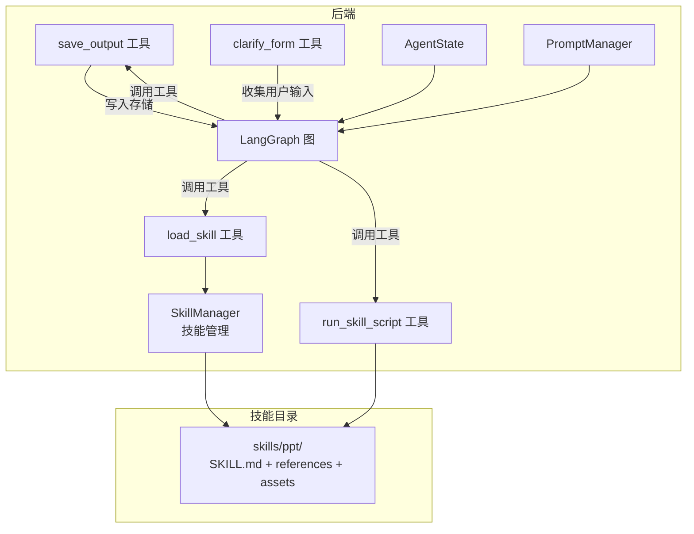
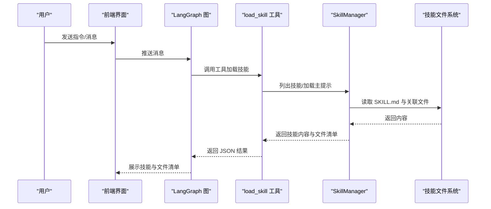
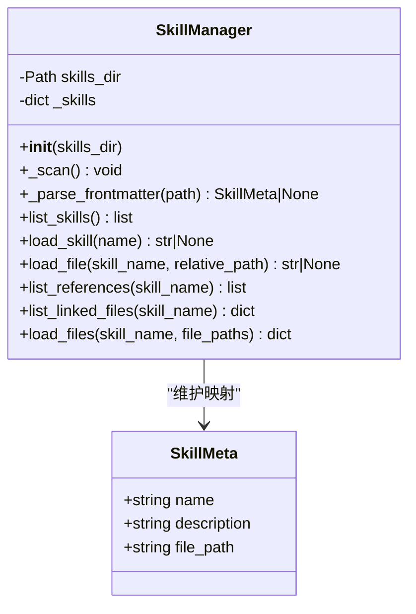
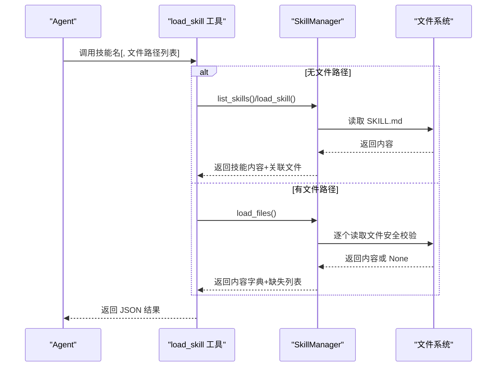
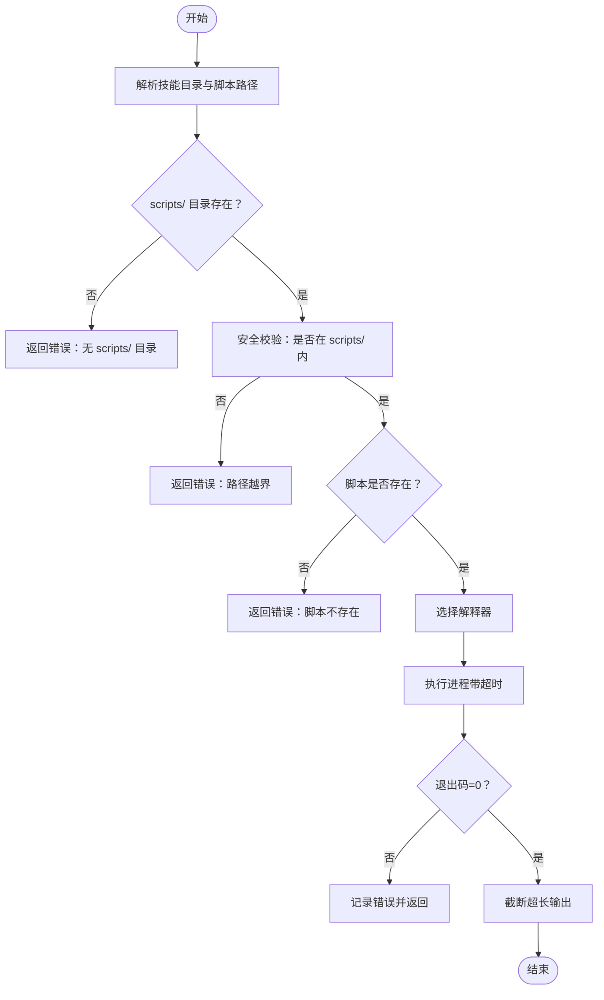
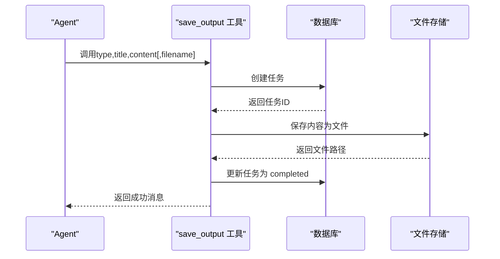
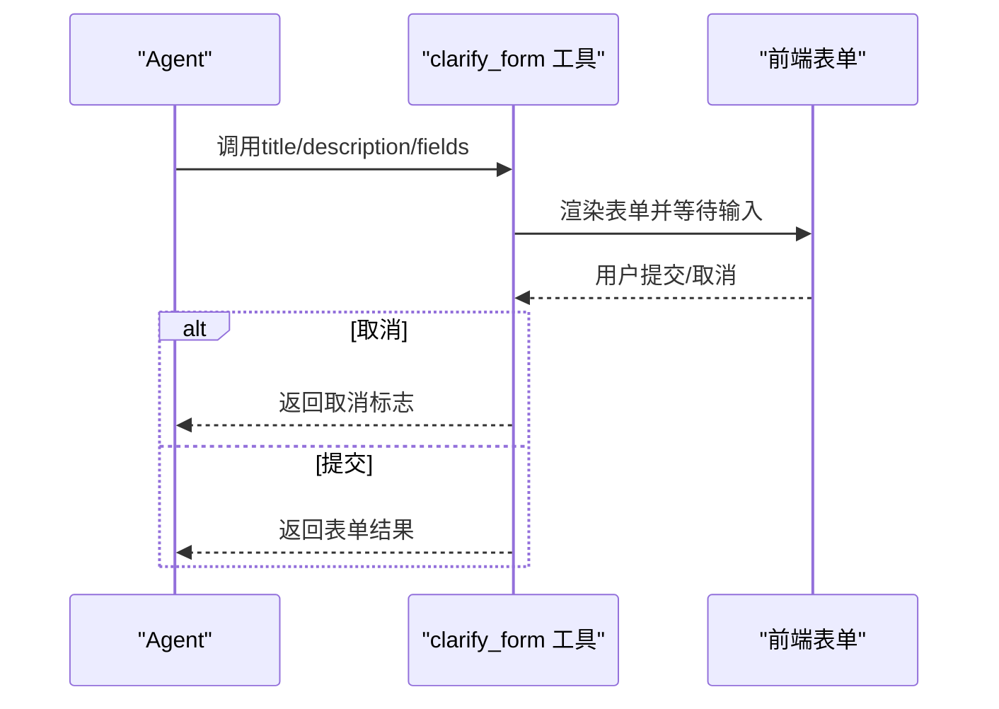
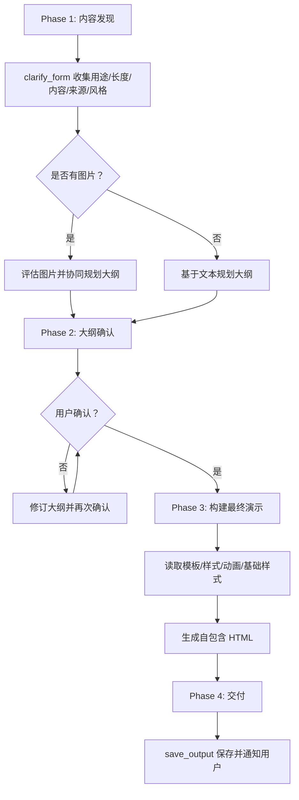
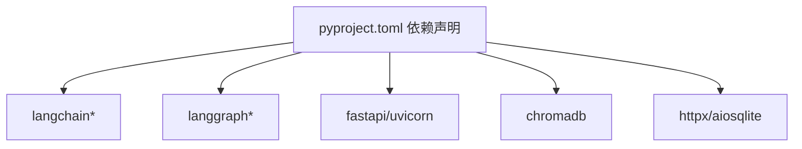

# 渐进式披露技能系统

<cite>
**本文档引用的文件**
- [backend/src/agent/skill_manager.py](file://backend/src/agent/skill_manager.py)
- [backend/src/tools/load_skill.py](file://backend/src/tools/load_skill.py)
- [backend/skills/ppt/SKILL.md](file://backend/skills/ppt/SKILL.md)
- [backend/skills/ppt/references/html-template.md](file://backend/skills/ppt/references/html-template.md)
- [backend/skills/ppt/assets/viewport-base.css](file://backend/skills/ppt/assets/viewport-base.css)
- [backend/skills/ppt/references/style-presets.md](file://backend/skills/ppt/references/style-presets.md)
- [backend/skills/ppt/references/animation-patterns.md](file://backend/skills/ppt/references/animation-patterns.md)
- [backend/src/tools/save_output.py](file://backend/src/tools/save_output.py)
- [backend/src/tools/run_skill_script.py](file://backend/src/tools/run_skill_script.py)
- [backend/src/tools/clarify_form.py](file://backend/src/tools/clarify_form.py)
- [backend/src/agent/graph.py](file://backend/src/agent/graph.py)
- [backend/src/agent/state.py](file://backend/src/agent/state.py)
- [backend/src/agent/prompt_manager.py](file://backend/src/agent/prompt_manager.py)
- [backend/pyproject.toml](file://backend/pyproject.toml)
</cite>

## 目录
1. [引言](#引言)
2. [项目结构](#项目结构)
3. [核心组件](#核心组件)
4. [架构总览](#架构总览)
5. [详细组件分析](#详细组件分析)
6. [依赖分析](#依赖分析)
7. [性能考虑](#性能考虑)
8. [故障排查指南](#故障排查指南)
9. [结论](#结论)
10. [附录](#附录)

## 引言
本技术文档围绕“渐进式披露技能系统”的设计理念与实现进行深入阐述，重点解释如何通过逐步引导用户提供必要信息来完成复杂任务。系统遵循 LangChain Skills 模式，以“先清单、后按需加载”的方式暴露技能能力，确保 Agent 仅在需要时加载技能细节，从而降低初始上下文负担并提升交互效率。

系统的关键特性包括：
- 技能注册与发现：扫描技能目录中的配置文件，自动构建技能清单。
- 动态加载：按需读取技能主提示与配套资源，支持批量文件加载与安全路径限制。
- 渐进式披露：通过表单工具收集必要信息，先确认大纲再生成最终产物，保证质量与可控性。
- 安全与权限：严格的路径解析与访问边界控制，防止越权访问与路径穿越。
- 结果交付：统一的保存工具负责持久化与状态更新，确保用户可访问与下载。

## 项目结构
后端采用模块化分层组织，技能系统位于 backend/skills 下，核心逻辑集中在 backend/src/agent 与 backend/src/tools 中。前端通过聊天界面与工具调用交互，后端通过 LangGraph 与中间件链路驱动 Agent 执行。

图表来源
- [backend/src/agent/skill_manager.py:14-117](file://backend/src/agent/skill_manager.py#L14-L117)
- [backend/src/tools/load_skill.py:13-116](file://backend/src/tools/load_skill.py#L13-L116)
- [backend/src/tools/run_skill_script.py:31-143](file://backend/src/tools/run_skill_script.py#L31-L143)
- [backend/src/tools/save_output.py:61-99](file://backend/src/tools/save_output.py#L61-L99)
- [backend/src/tools/clarify_form.py:24-46](file://backend/src/tools/clarify_form.py#L24-L46)
- [backend/src/agent/graph.py:16-49](file://backend/src/agent/graph.py#L16-L49)
- [backend/src/agent/state.py:4-7](file://backend/src/agent/state.py#L4-L7)
- [backend/src/agent/prompt_manager.py:1-37](file://backend/src/agent/prompt_manager.py#L1-L37)
- [backend/skills/ppt/SKILL.md:1-269](file://backend/skills/ppt/SKILL.md#L1-L269)

章节来源
- [backend/src/agent/skill_manager.py:14-117](file://backend/src/agent/skill_manager.py#L14-L117)
- [backend/src/tools/load_skill.py:13-116](file://backend/src/tools/load_skill.py#L13-L116)
- [backend/src/tools/run_skill_script.py:31-143](file://backend/src/tools/run_skill_script.py#L31-L143)
- [backend/src/tools/save_output.py:61-99](file://backend/src/tools/save_output.py#L61-L99)
- [backend/src/tools/clarify_form.py:24-46](file://backend/src/tools/clarify_form.py#L24-L46)
- [backend/src/agent/graph.py:16-49](file://backend/src/agent/graph.py#L16-L49)
- [backend/src/agent/state.py:4-7](file://backend/src/agent/state.py#L4-L7)
- [backend/src/agent/prompt_manager.py:1-37](file://backend/src/agent/prompt_manager.py#L1-L37)
- [backend/skills/ppt/SKILL.md:1-269](file://backend/skills/ppt/SKILL.md#L1-L269)

## 核心组件
- SkillManager：扫描技能目录，解析 SKILL.md 前言元数据，提供技能清单、主提示与文件加载能力；内置安全路径校验，防止越权访问。
- load_skill 工具：动态生成工具描述，列出可用技能；支持一次性加载技能主提示+关联文件，或批量加载指定文件。
- run_skill_script 工具：在受控工作目录内执行技能脚本，支持多语言解释器，具备超时与输出长度限制。
- save_output 工具：统一产物保存入口，写入文件存储并更新数据库任务状态，确保用户可访问与下载。
- clarify_form 工具：以表单形式收集用户输入，支持单选/多选/文本，中断执行等待用户响应。
- LangGraph 图与中间件：封装模型、工具与中间件，承载 Agent 执行流。
- AgentState：扩展状态，携带工作区上下文。
- PromptManager：系统提示词，指导 Agent 在培训场景下使用技能与引用规范。

章节来源
- [backend/src/agent/skill_manager.py:14-117](file://backend/src/agent/skill_manager.py#L14-L117)
- [backend/src/tools/load_skill.py:13-116](file://backend/src/tools/load_skill.py#L13-L116)
- [backend/src/tools/run_skill_script.py:31-143](file://backend/src/tools/run_skill_script.py#L31-L143)
- [backend/src/tools/save_output.py:61-99](file://backend/src/tools/save_output.py#L61-L99)
- [backend/src/tools/clarify_form.py:24-46](file://backend/src/tools/clarify_form.py#L24-L46)
- [backend/src/agent/graph.py:16-49](file://backend/src/agent/graph.py#L16-L49)
- [backend/src/agent/state.py:4-7](file://backend/src/agent/state.py#L4-L7)
- [backend/src/agent/prompt_manager.py:1-37](file://backend/src/agent/prompt_manager.py#L1-L37)

## 架构总览
系统通过 LangGraph 将模型、工具与中间件串联，Agent 仅通过工具接口与技能系统交互。技能系统以“清单 + 按需加载”模式运行，避免一次性加载全部资源，同时通过安全校验与路径隔离保障执行安全。

图表来源
- [backend/src/agent/graph.py:16-49](file://backend/src/agent/graph.py#L16-L49)
- [backend/src/tools/load_skill.py:13-116](file://backend/src/tools/load_skill.py#L13-L116)
- [backend/src/agent/skill_manager.py:51-117](file://backend/src/agent/skill_manager.py#L51-L117)

## 详细组件分析

### 技能注册与发现（SkillManager）
- 扫描策略：遍历技能目录，定位每个子目录下的 SKILL.md；仅当存在前言块时解析为技能元数据。
- 元数据结构：包含技能名称、描述与文件路径，便于后续按需加载。
- 清单与加载：
  - list_skills：返回技能名称与描述，供工具动态展示。
  - load_skill：返回技能主提示全文，用于 Agent 执行。
  - list_references/list_linked_files：枚举 references、assets、scripts 等子目录中的可用文件。
  - load_file/load_files：安全加载指定相对路径文件，防止路径穿越；返回内容或缺失文件列表。
- 安全边界：通过路径解析与父目录校验，确保文件访问局限于技能根目录。

图表来源
- [backend/src/agent/skill_manager.py:7-117](file://backend/src/agent/skill_manager.py#L7-L117)

章节来源
- [backend/src/agent/skill_manager.py:26-117](file://backend/src/agent/skill_manager.py#L26-L117)

### 动态加载与安全校验（load_skill 工具）
- 动态描述：根据 SkillManager 的技能清单动态生成工具描述，展示可用技能与调用说明。
- 加载行为：
  - 不带 file_paths：返回技能主提示与该技能的关联文件清单（仅包含真实存在的子目录文件）。
  - 带 file_paths：批量加载最多 5 个文件，返回内容字典与缺失文件列表。
- 占位替换：若内容包含占位符，将其替换为实际技能目录路径，便于脚本与模板引用。
- 错误处理：技能不存在或文件缺失时返回结构化错误信息，便于前端与 Agent 侧处理。

图表来源
- [backend/src/tools/load_skill.py:13-116](file://backend/src/tools/load_skill.py#L13-L116)
- [backend/src/agent/skill_manager.py:57-117](file://backend/src/agent/skill_manager.py#L57-L117)

章节来源
- [backend/src/tools/load_skill.py:13-116](file://backend/src/tools/load_skill.py#L13-L116)
- [backend/src/agent/skill_manager.py:57-117](file://backend/src/agent/skill_manager.py#L57-L117)

### 技能执行与脚本运行（run_skill_script 工具）
- 工作目录：始终以技能根目录作为脚本执行的工作目录，保证脚本内相对路径解析正确。
- 路径安全：严格限制脚本必须位于 skills/{skill_name}/scripts/ 子目录内，防止路径穿越。
- 解释器映射：支持 .sh/.py/.js/.ts，分别使用 bash/python/node/npx tsx。
- 输出与超时：设置最大输出长度与超时时间，避免污染上下文与长时间阻塞；非零退出码时汇总错误信息。
- 错误反馈：技能不存在、脚本不存在、类型不支持、越权访问等均返回明确错误信息。

图表来源
- [backend/src/tools/run_skill_script.py:31-143](file://backend/src/tools/run_skill_script.py#L31-L143)

章节来源
- [backend/src/tools/run_skill_script.py:31-143](file://backend/src/tools/run_skill_script.py#L31-L143)

### 产物保存与交付（save_output 工具）
- 任务创建：在数据库中创建任务记录，携带类型与标题。
- 文件存储：将内容编码为字节后写入文件存储，生成稳定文件路径。
- 状态更新：根据保存结果更新任务状态为 completed 或 failed，并附带结果数据。
- 用户可见：保存完成后，用户可在右侧输出面板查看与下载。

图表来源
- [backend/src/tools/save_output.py:61-99](file://backend/src/tools/save_output.py#L61-L99)

章节来源
- [backend/src/tools/save_output.py:61-99](file://backend/src/tools/save_output.py#L61-L99)

### 渐进式披露与用户交互（clarify_form 工具）
- 表单模型：支持文本、单选、多选三种字段类型，字段可声明为必填。
- 中断机制：调用后中断执行，等待用户在前端界面填写并提交；支持取消。
- 返回约定：返回用户填写结果或取消标志，便于 Agent 后续决策。

图表来源
- [backend/src/tools/clarify_form.py:24-46](file://backend/src/tools/clarify_form.py#L24-L46)

章节来源
- [backend/src/tools/clarify_form.py:24-46](file://backend/src/tools/clarify_form.py#L24-L46)

### PPT 技能实现示例与扩展方法
- 技能配置（SKILL.md）：定义技能名称、描述与执行流程，包含渐进式披露的四个阶段（内容发现、大纲确认、构建与交付）。
- 设计原则与约束：强调单文件自包含、视口适配、字体与动画规范、内联编辑能力等。
- 参考材料：html-template.md（模板结构与 JS 功能）、style-presets.md（12 种风格预设）、viewport-base.css（强制视口适配的基础样式）、animation-patterns.md（动效参考）。
- 执行流程：先通过 clarify_form 收集必要信息，再生成文本大纲并经用户确认，最后生成完整 HTML 并通过 save_output 交付。

图表来源
- [backend/skills/ppt/SKILL.md:66-269](file://backend/skills/ppt/SKILL.md#L66-L269)
- [backend/skills/ppt/references/html-template.md:1-420](file://backend/skills/ppt/references/html-template.md#L1-L420)
- [backend/skills/ppt/references/style-presets.md:1-348](file://backend/skills/ppt/references/style-presets.md#L1-L348)
- [backend/skills/ppt/assets/viewport-base.css:1-154](file://backend/skills/ppt/assets/viewport-base.css#L1-L154)
- [backend/skills/ppt/references/animation-patterns.md:1-111](file://backend/skills/ppt/references/animation-patterns.md#L1-L111)

章节来源
- [backend/skills/ppt/SKILL.md:66-269](file://backend/skills/ppt/SKILL.md#L66-L269)
- [backend/skills/ppt/references/html-template.md:1-420](file://backend/skills/ppt/references/html-template.md#L1-L420)
- [backend/skills/ppt/references/style-presets.md:1-348](file://backend/skills/ppt/references/style-presets.md#L1-L348)
- [backend/skills/ppt/assets/viewport-base.css:1-154](file://backend/skills/ppt/assets/viewport-base.css#L1-L154)
- [backend/skills/ppt/references/animation-patterns.md:1-111](file://backend/skills/ppt/references/animation-patterns.md#L1-L111)

## 依赖分析
- LangChain/LangGraph：提供模型、工具、中间件与执行图能力。
- FastAPI/Uvicorn：后端 API 与服务运行。
- ChromaDB/HTTPX/aiosqlite：RAG 与存储基础设施。
- Python 生态：docx/pdf 解析、环境变量加载等。

图表来源
- [backend/pyproject.toml:6-26](file://backend/pyproject.toml#L6-L26)

章节来源
- [backend/pyproject.toml:6-26](file://backend/pyproject.toml#L6-L26)

## 性能考虑
- 按需加载：通过 SkillManager 的动态加载与批量文件加载，避免一次性加载大量资源，降低内存与网络开销。
- 输出截断：run_skill_script 对超长输出进行截断，防止污染上下文窗口。
- 视口适配：PPT 技能强制使用视口适配样式与响应式排版，减少重绘与布局抖动。
- 任务状态：save_output 将产物持久化并更新任务状态，避免重复计算与无效传输。

## 故障排查指南
- 技能未注册/找不到：
  - 确认技能目录下存在 SKILL.md 且前言块格式正确。
  - 检查 SkillManager 是否指向正确的 skills_dir。
- 文件加载失败：
  - 确认 file_paths 为技能根目录下的相对路径。
  - 检查文件是否存在且为文件类型。
- 路径越界/脚本执行失败：
  - 确保脚本位于 skills/{skill_name}/scripts/ 目录内。
  - 检查脚本扩展名是否受支持，参数与工作目录是否正确。
- 产物未保存：
  - 确认调用了 save_output 且已获得用户对大纲的显式确认。
  - 检查数据库与文件存储连接状态。

章节来源
- [backend/src/agent/skill_manager.py:63-82](file://backend/src/agent/skill_manager.py#L63-L82)
- [backend/src/tools/run_skill_script.py:72-82](file://backend/src/tools/run_skill_script.py#L72-L82)
- [backend/src/tools/save_output.py:51-58](file://backend/src/tools/save_output.py#L51-L58)

## 结论
渐进式披露技能系统通过“清单 + 按需加载”的模式，结合严格的路径安全与用户交互工具，实现了复杂任务的可控交付。SkillManager 提供稳定的技能发现与加载能力，load_skill 与 run_skill_script 保障资源与脚本的安全执行，clarify_form 与 save_output 则分别承担信息收集与结果交付的关键环节。PPT 技能作为典型范例，展示了从内容发现到最终产物交付的完整流程与最佳实践。

## 附录
- 最佳实践
  - 用户交互：优先使用 clarify_form 进行一次性信息收集，减少多轮往返。
  - 错误处理：在工具层返回结构化错误，便于前端与 Agent 侧统一处理。
  - 结果验证：在生成最终产物前，务必经过用户对大纲的显式确认。
  - 安全与权限：严格限制文件与脚本访问范围，防止路径穿越与越权操作。
- 扩展方法
  - 新增技能：在 skills/ 下新建目录并编写 SKILL.md，系统将自动发现。
  - 添加资源：在 references/assets/scripts 子目录中放置文件，通过 load_skill/list_linked_files 获取。
  - 自定义脚本：在 scripts/ 中编写受支持类型的脚本，通过 run_skill_script 调用。