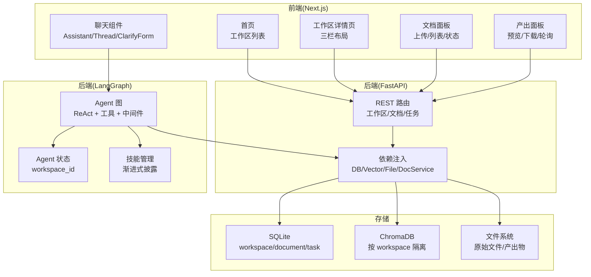
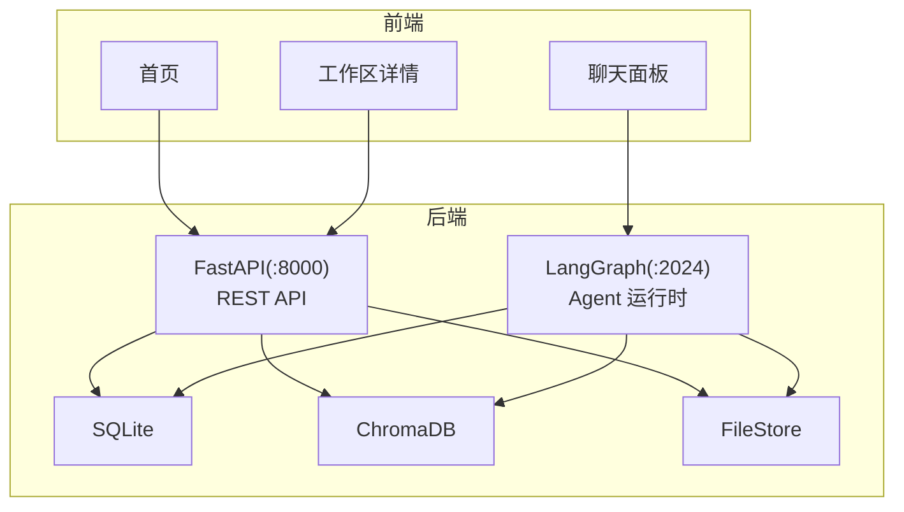
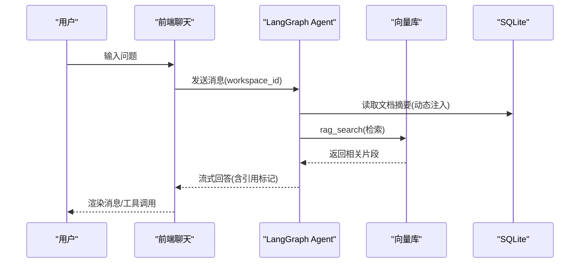
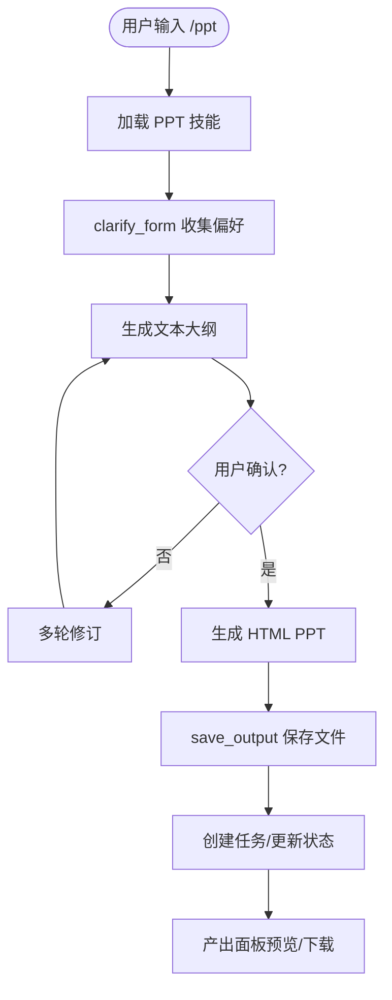
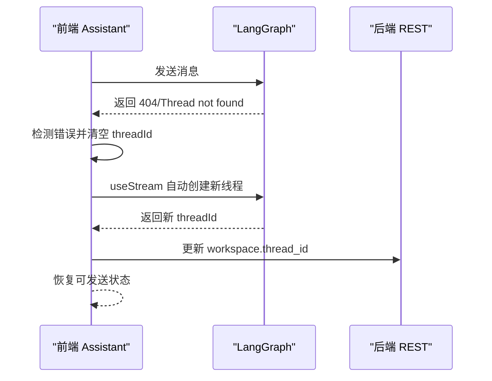
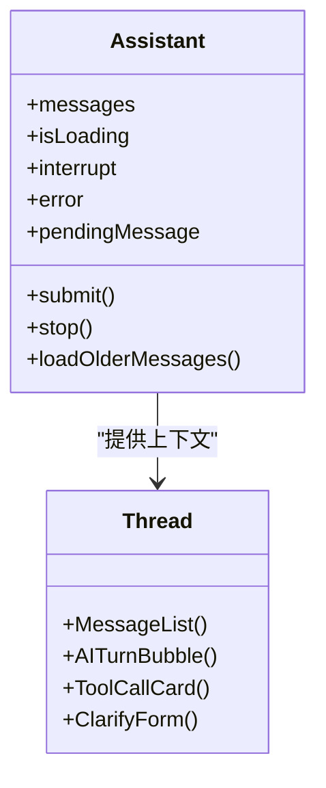
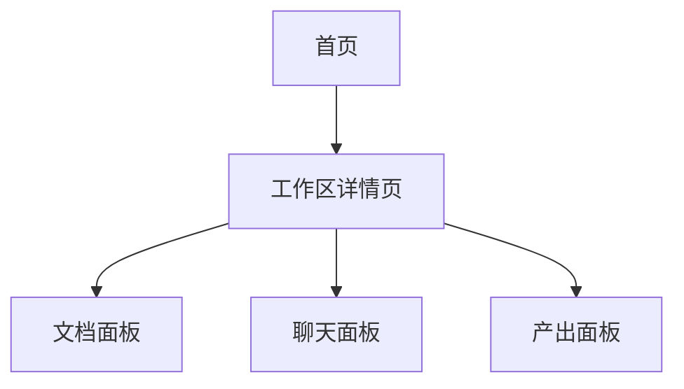
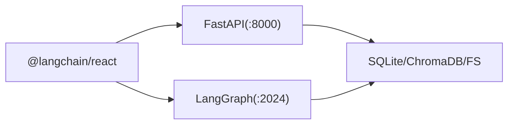

# 项目介绍

<cite>
**本文引用的文件**
- [README.md](file://README.md)
- [AGENTS.md](file://AGENTS.md)
- [docs/backend-architecture.md](file://docs/backend-architecture.md)
- [docs/frontend-architecture.md](file://docs/frontend-architecture.md)
- [backend/skills/ppt/SKILL.md](file://backend/skills/ppt/SKILL.md)
- [user-story/04-ppt-command.md](file://user-story/04-ppt-command.md)
- [user-story/10-thread-recovery.md](file://user-story/10-thread-recovery.md)
- [backend/src/agent/graph.py](file://backend/src/agent/graph.py)
- [backend/src/agent/skill_manager.py](file://backend/src/agent/skill_manager.py)
- [frontend/src/components/chat/assistant.tsx](file://frontend/src/components/chat/assistant.tsx)
- [frontend/src/components/chat/thread.tsx](file://frontend/src/components/chat/thread.tsx)
- [frontend/src/app/page.tsx](file://frontend/src/app/page.tsx)
</cite>

## 目录
1. [简介](#简介)
2. [项目结构](#项目结构)
3. [核心组件](#核心组件)
4. [架构总览](#架构总览)
5. [详细组件分析](#详细组件分析)
6. [依赖分析](#依赖分析)
7. [性能考虑](#性能考虑)
8. [故障排查指南](#故障排查指南)
9. [结论](#结论)
10. [附录](#附录)

## 简介
Train Agent 是一款面向企业培训场景的智能助手产品，当前 MVP 版本聚焦于“基于工作区的知识问答”和“培训 PPT 自动生成”。项目通过“双进程架构”实现前后端协同：FastAPI 负责工作区/文档/任务的 CRUD 与文件管理；LangGraph 作为 Agent 运行时负责流式对话与工具调用；前端基于 Next.js 提供三栏式工作区界面（文档、聊天、产出）。项目强调“简单、稳定、好用”的核心准则，采用渐进式披露技能系统与结构化解析，降低使用门槛并提升可维护性。

- 定位：企业培训领域的智能助手，帮助用户基于上传的培训文档进行知识问答与内容生成（如 PPT）。
- 核心价值：将复杂的人工整理与内容创作过程自动化，降低培训准备成本，提升内容质量与一致性。
- 应用场景：新员工入职培训、岗位技能培训、内部知识沉淀、会议演讲材料准备等。

**章节来源**
- [README.md:1-133](file://README.md#L1-L133)
- [AGENTS.md:3-21](file://AGENTS.md#L3-L21)

## 项目结构
仓库采用“前后端分离 + 双进程 Agent”的组织方式：
- backend：Python 后端，包含 API 层、Agent 层、服务层、存储层与技能目录
- frontend：Next.js 前端，包含工作区页面与三栏布局组件
- docs：后端/前端架构文档与调试指南
- plans/user-story：产品规划与用户故事
- scripts：本地开发与运维脚本

**图表来源**
- [docs/backend-architecture.md:18-44](file://docs/backend-architecture.md#L18-L44)
- [docs/frontend-architecture.md:13-33](file://docs/frontend-architecture.md#L13-L33)

**章节来源**
- [README.md:24-39](file://README.md#L24-L39)
- [docs/backend-architecture.md:67-117](file://docs/backend-architecture.md#L67-L117)
- [docs/frontend-architecture.md:58-94](file://docs/frontend-architecture.md#L58-L94)

## 核心组件
- 后端双进程
  - FastAPI(:8000)：REST API，负责工作区/文档/任务 CRUD、文件上传与下载
  - LangGraph(:2024)：Agent 运行时，流式对话+工具调用+中断恢复
- 存储层
  - SQLite：workspace/document/task 元数据
  - ChromaDB：按 workspace 隔离的向量集合
  - 文件系统：原始文件与 Agent 产出物
- 前端三栏布局
  - 文档面板：上传/列表/状态轮询
  - 聊天面板：流式对话、工具调用展示、表单中断交互
  - 产出面板：PPT/报告预览与下载

**章节来源**
- [AGENTS.md:31-39](file://AGENTS.md#L31-L39)
- [docs/backend-architecture.md:13-16](file://docs/backend-architecture.md#L13-L16)
- [docs/frontend-architecture.md:18-32](file://docs/frontend-architecture.md#L18-L32)

## 架构总览
后端采用“四层架构”：API 层、Agent 层、服务层、存储层；前端通过 REST 与 LangGraph Stream 双通道与后端通信。Agent 通过中间件动态注入文档摘要，结合工具链实现 RAG 检索、技能加载与产出保存。

**图表来源**
- [docs/backend-architecture.md:13-44](file://docs/backend-architecture.md#L13-L44)
- [docs/frontend-architecture.md:30-502](file://docs/frontend-architecture.md#L30-L502)

**章节来源**
- [docs/backend-architecture.md:121-135](file://docs/backend-architecture.md#L121-L135)
- [docs/frontend-architecture.md:482-503](file://docs/frontend-architecture.md#L482-L503)

## 详细组件分析

### 组件 A：知识问答与 RAG 流程
- 流程概览
  - 用户在聊天面板输入问题，Agent 通过中间件注入当前工作区的文档摘要
  - 若问题涉及文档内容，Agent 调用 rag_search 在向量库检索相关片段
  - Agent 基于检索结果生成带引用标记的回答
- 关键实现要点
  - workspace_id 透传贯穿 Agent 调用链，确保按工作区隔离
  - 中间件在每次推理前动态注入文档摘要，减少用户显式上下文
  - 工具调用卡片化展示，便于用户理解 Agent 的思考与行动

**图表来源**
- [docs/backend-architecture.md:403-412](file://docs/backend-architecture.md#L403-L412)
- [frontend/src/components/chat/thread.tsx:492-503](file://frontend/src/components/chat/thread.tsx#L492-L503)

**章节来源**
- [docs/backend-architecture.md:200-226](file://docs/backend-architecture.md#L200-L226)
- [frontend/src/components/chat/thread.tsx:488-486](file://frontend/src/components/chat/thread.tsx#L488-L486)

### 组件 B：PPT 自动生成能力
- 触发方式
  - 用户在聊天输入框输入“/ppt”命令，选择“生成培训PPT”，Agent 加载 PPT 技能并开始执行
- 技能设计
  - 渐进式披露：Agent 启动时仅看到技能名称与描述，按需加载完整技能内容与参考文件
  - 表单中断：通过 clarify_form 收集风格、长度、内容来源等必要信息
  - 大纲确认：生成文本大纲供用户确认，支持多轮修订
  - 产出保存：最终 HTML PPT 通过 save_output 保存至文件系统并更新任务状态
- 产出交付
  - 产出面板轮询任务列表，展示并允许预览/下载

**图表来源**
- [user-story/04-ppt-command.md:16-29](file://user-story/04-ppt-command.md#L16-L29)
- [backend/skills/ppt/SKILL.md:66-269](file://backend/skills/ppt/SKILL.md#L66-L269)

**章节来源**
- [user-story/04-ppt-command.md:1-36](file://user-story/04-ppt-command.md#L1-L36)
- [backend/skills/ppt/SKILL.md:1-269](file://backend/skills/ppt/SKILL.md#L1-L269)

### 组件 C：会话线程恢复机制
- 目标：在网络波动或服务重启导致线程失效时，前端自动重建会话，用户几乎无感知地恢复对话
- 实现要点
  - 前端捕获 LangGraph 错误（含“404/未找到/Thread”关键词），自动清空 threadId
  - useStream 检测到 threadId 为空，自动创建新线程
  - 新 threadId 通过 REST API 持久化回后端，下次进入工作区仍可继续

**图表来源**
- [user-story/10-thread-recovery.md:18-23](file://user-story/10-thread-recovery.md#L18-L23)
- [frontend/src/components/chat/assistant.tsx:148-172](file://frontend/src/components/chat/assistant.tsx#L148-L172)

**章节来源**
- [user-story/10-thread-recovery.md:1-37](file://user-story/10-thread-recovery.md#L1-L37)
- [frontend/src/components/chat/assistant.tsx:131-172](file://frontend/src/components/chat/assistant.tsx#L131-L172)

### 组件 D：前端聊天与工具调用渲染
- 聊天组件
  - Assistant Provider 管理与 LangGraph 的流式连接，向下传递 messages/submit/stop/resume
  - Thread 负责消息渲染：AI 文本通过 Markdown 渲染，工具调用以卡片形式展示，支持展开/折叠
  - 支持“思考过程”折叠、“引用标记”渲染、代码高亮、复制按钮等
- 表单中断
  - Agent 调用 clarify_form 时，前端渲染交互表单，用户填写后通过 resume 恢复 Agent 执行

**图表来源**
- [frontend/src/components/chat/assistant.tsx:13-50](file://frontend/src/components/chat/assistant.tsx#L13-L50)
- [frontend/src/components/chat/thread.tsx:150-236](file://frontend/src/components/chat/thread.tsx#L150-L236)

**章节来源**
- [frontend/src/components/chat/assistant.tsx:59-254](file://frontend/src/components/chat/assistant.tsx#L59-L254)
- [frontend/src/components/chat/thread.tsx:242-302](file://frontend/src/components/chat/thread.tsx#L242-L302)

### 组件 E：工作区与首页
- 首页
  - 展示当前用户的工作区列表，支持新建/删除
  - 用户 ID 通过 localStorage 管理，首次访问生成 UUID
- 工作区详情页
  - 三栏布局：文档面板、聊天面板、产出面板
  - 支持面板宽度拖拽与右侧产出面板折叠

**图表来源**
- [frontend/src/app/page.tsx:17-121](file://frontend/src/app/page.tsx#L17-L121)
- [docs/frontend-architecture.md:128-144](file://docs/frontend-architecture.md#L128-L144)

**章节来源**
- [frontend/src/app/page.tsx:17-121](file://frontend/src/app/page.tsx#L17-L121)
- [docs/frontend-architecture.md:107-144](file://docs/frontend-architecture.md#L107-L144)

## 依赖分析
- 后端依赖
  - LangChain/LangGraph：Agent 编排、中间件、工具注册
  - FastAPI：REST API
  - SQLite/ChromaDB/文件系统：数据持久化
- 前端依赖
  - @langchain/react：LangGraph 流式对话
  - Next.js/App Router：页面与路由
  - Tailwind CSS：样式与主题

**图表来源**
- [docs/frontend-architecture.md:48-54](file://docs/frontend-architecture.md#L48-L54)
- [docs/backend-architecture.md:48-62](file://docs/backend-architecture.md#L48-L62)

**章节来源**
- [docs/frontend-architecture.md:41-55](file://docs/frontend-architecture.md#L41-L55)
- [docs/backend-architecture.md:48-62](file://docs/backend-architecture.md#L48-L62)

## 性能考虑
- 异步文档处理：上传立即返回，后台异步完成解析/分块/索引/摘要，前端通过轮询追踪状态，避免阻塞 UI
- 向量检索：按 workspace 隔离 collection，支持按 doc_id 过滤，减少无关召回
- Token 管理：上下文分层注入与历史压缩，控制模型输入规模
- 前端渲染：工具调用卡片默认折叠，思考过程可展开，降低首屏渲染压力

[本节为通用指导，不直接分析具体文件]

## 故障排查指南
- 线程恢复
  - 现象：对话报错“404/未找到/Thread”
  - 处理：前端自动清空 threadId，useStream 自动创建新线程并持久化
- 会话中断
  - 现象：Agent 调用 clarify_form，前端显示表单
  - 处理：用户填写后通过 resume 恢复，表单卡片显示“已提交”
- 产出未显示
  - 现象：PPT 生成完成但产出面板无内容
  - 处理：检查任务轮询是否正常，确认 save_output 是否成功写入文件系统

**章节来源**
- [user-story/10-thread-recovery.md:18-31](file://user-story/10-thread-recovery.md#L18-L31)
- [frontend/src/components/chat/thread.tsx:709-799](file://frontend/src/components/chat/thread.tsx#L709-L799)

## 结论
Train Agent 以“简单、稳定、好用”为核心设计原则，通过双进程架构与渐进式披露技能系统，为企业培训场景提供了即用性强、可扩展的智能助手解决方案。MVP 版本聚焦知识问答与 PPT 自动生成，具备良好的可维护性与用户体验。未来可围绕技能生态、多模态输入与更丰富的产出类型持续演进。

[本节为总结性内容，不直接分析具体文件]

## 附录
- 开发与运行
  - 环境变量：DASHSCOPE_API_KEY、OPENAI_API_BASE、LLM_MODEL、EMBEDDING_MODEL、DATA_DIR、NEXT_PUBLIC_API_BASE、NEXT_PUBLIC_LANGGRAPH_API_URL
  - 常用命令：健康检查、启动/停止/重启、测试、前后端构建与检查
- 设计决策
  - 双进程架构、workspace 隔离、异步文档处理、渐进式技能披露、中断式交互、动态提示注入

**章节来源**
- [README.md:41-133](file://README.md#L41-L133)
- [AGENTS.md:31-80](file://AGENTS.md#L31-L80)
- [docs/backend-architecture.md:456-465](file://docs/backend-architecture.md#L456-L465)
- [docs/frontend-architecture.md:539-549](file://docs/frontend-architecture.md#L539-L549)