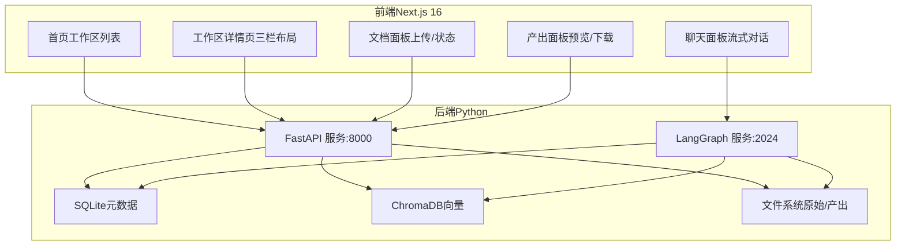
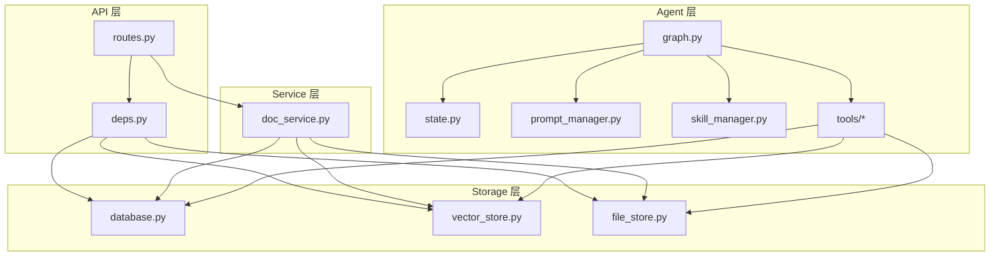
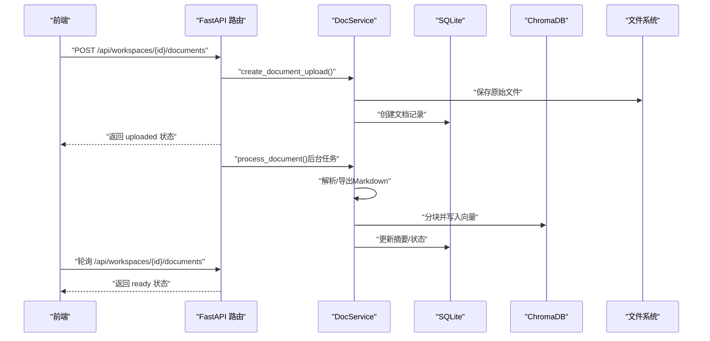
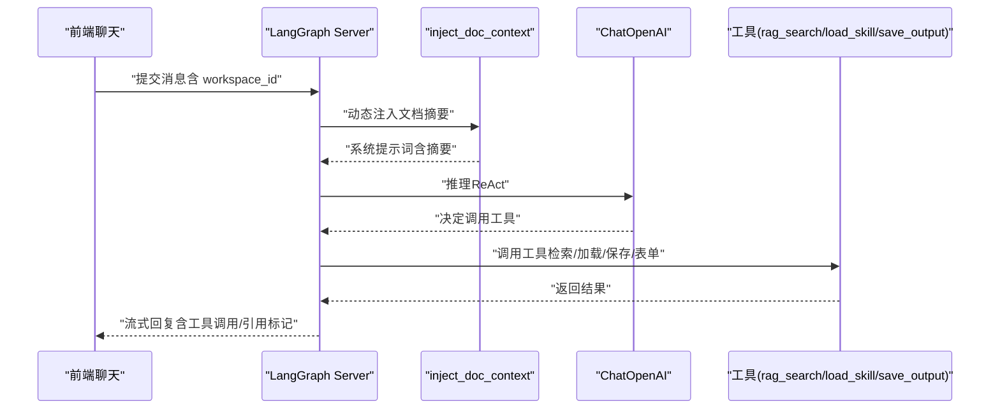
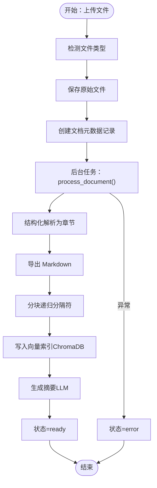
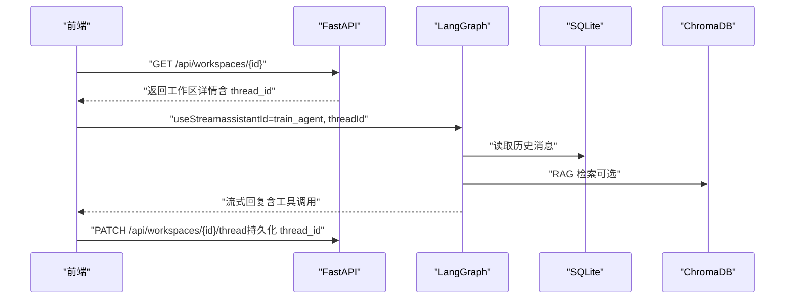
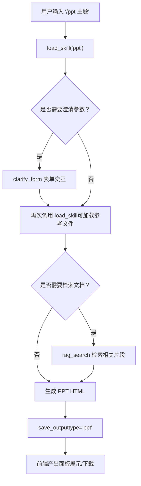

# 项目概述

<cite>
**本文档引用的文件**
- [README.md](file://README.md)
- [backend-architecture.md](file://docs/backend-architecture.md)
- [frontend-architecture.md](file://docs/frontend-architecture.md)
- [backend/pyproject.toml](file://backend/pyproject.toml)
- [frontend/package.json](file://frontend/package.json)
- [backend/langgraph.json](file://backend/langgraph.json)
- [backend/src/api/routes.py](file://backend/src/api/routes.py)
- [backend/src/agent/graph.py](file://backend/src/agent/graph.py)
- [backend/src/services/doc_service.py](file://backend/src/services/doc_service.py)
- [backend/src/middlewares/inject_doc_context.py](file://backend/src/middlewares/inject_doc_context.py)
- [backend/src/tools/rag_search.py](file://backend/src/tools/rag_search.py)
- [backend/src/storage/vector_store.py](file://backend/src/storage/vector_store.py)
- [backend/skills/ppt/SKILL.md](file://backend/skills/ppt/SKILL.md)
- [frontend/src/app/workspace/[id]/page.tsx](file://frontend/src/app/workspace/[id]/page.tsx)
- [frontend/src/components/chat/assistant.tsx](file://frontend/src/components/chat/assistant.tsx)
- [scripts/start.sh](file://scripts/start.sh)
</cite>

## 目录
1. [简介](#简介)
2. [项目结构](#项目结构)
3. [核心组件](#核心组件)
4. [架构总览](#架构总览)
5. [详细组件分析](#详细组件分析)
6. [依赖分析](#依赖分析)
7. [性能考虑](#性能考虑)
8. [故障排查指南](#故障排查指南)
9. [结论](#结论)
10. [附录](#附录)

## 简介
Train Agent 是一个面向企业培训领域的智能助手系统，当前 MVP 聚焦于“基于工作区的知识问答”和“培训 PPT 自动生成”。系统通过前后端分离的双进程架构，结合 LangGraph Agent 的智能推理能力，构建了从文档上传、解析、向量化索引，到智能问答与技能驱动的 PPT 生成的完整闭环。

- 核心价值与目标
  - 降低企业培训知识获取与内容创作门槛：通过 RAG 实现精准问答，通过技能化 Agent 驱动高质量 PPT 生成。
  - 工作区即知识域：以工作区为边界隔离数据，确保不同项目/部门的知识相互独立。
  - 开放扩展：通过“技能”机制支持渐进式披露与按需加载，便于持续扩展新的生成/编辑能力。

- 应用场景
  - 培训资料检索与答疑：将内部文档转化为可检索的知识库，支持结构化引用与溯源。
  - 培训内容生产：通过自然语言指令驱动 PPT 生成，覆盖教学、演讲、内训等多种场景。

- 快速开始
  - 环境准备：复制并填写环境变量文件；安装后端依赖（uv + hatchling）与前端依赖（pnpm/npm）。
  - 启动服务：使用提供的启动脚本一键启动后端 API（8000）、LangGraph（2024）、前端（3000）。
  - 基本流程：创建工作区 → 上传文档 → 在聊天面板发起问答或触发 /ppt 命令 → 查看产出并下载。

**章节来源**
- [README.md:1-133](file://README.md#L1-L133)

## 项目结构
项目采用前后端分离的双进程架构：
- 后端（Python/FastAPI + LangGraph）：提供 REST API、文档处理流水线、Agent 推理与工具调用。
- 前端（Next.js 16 App Router）：提供工作区、文档、聊天、产出等交互界面，并与后端双向通信。

**图表来源**
- [frontend-architecture.md:1-549](file://docs/frontend-architecture.md#L1-L549)
- [backend-architecture.md:1-465](file://docs/backend-architecture.md#L1-L465)

**章节来源**
- [README.md:24-40](file://README.md#L24-L40)
- [frontend-architecture.md:7-34](file://docs/frontend-architecture.md#L7-L34)
- [backend-architecture.md:9-44](file://docs/backend-architecture.md#L9-L44)

## 核心组件
- 前端组件
  - 首页与工作区详情页：负责工作区管理与三栏布局（文档/聊天/产出）。
  - 聊天组件：通过 @langchain/react 的 useStream 与 LangGraph 服务进行流式对话，支持中断与恢复。
  - 文档组件：上传、状态轮询、删除。
  - 产出组件：展示、预览、下载、删除。
- 后端组件
  - API 层：REST 路由（工作区/文档/任务/文件下载），CORS 全开放，静态资源挂载。
  - Agent 层：LangGraph Agent 图、状态、提示词管理、技能管理、中间件与工具。
  - 服务层：文档处理流水线（解析/分块/索引/摘要）。
  - 存储层：SQLite、ChromaDB、文件系统封装。
  - 技能：PPT 生成技能（渐进式披露、参考文件、样式预设、动画模式）。

**章节来源**
- [frontend-architecture.md:58-95](file://docs/frontend-architecture.md#L58-L95)
- [backend-architecture.md:67-117](file://docs/backend-architecture.md#L67-L117)
- [backend-architecture.md:121-135](file://docs/backend-architecture.md#L121-L135)

## 架构总览
系统采用“双进程 + 分层架构”的设计：
- 双进程
  - FastAPI 进程：REST API、文件上传/下载、工作区/文档/任务管理。
  - LangGraph 进程：Agent 推理、工具调用、流式对话、中断恢复。
- 分层架构
  - API 层（routes.py/deps.py）
  - Agent 层（graph.py/state.py/prompt_manager.py/skill_manager.py/tools/*）
  - Service 层（doc_service.py）
  - Storage 层（database.py/vector_store.py/file_store.py）

**图表来源**
- [backend-architecture.md:121-135](file://docs/backend-architecture.md#L121-L135)
- [backend-architecture.md:137-178](file://docs/backend-architecture.md#L137-L178)
- [backend-architecture.md:181-246](file://docs/backend-architecture.md#L181-L246)
- [backend-architecture.md:289-337](file://docs/backend-architecture.md#L289-L337)
- [backend-architecture.md:339-366](file://docs/backend-architecture.md#L339-L366)

**章节来源**
- [backend-architecture.md:121-246](file://docs/backend-architecture.md#L121-L246)
- [backend-architecture.md:289-366](file://docs/backend-architecture.md#L289-L366)

## 详细组件分析

### 后端 API 层（FastAPI）
- 职责
  - 工作区：创建、查询、绑定 LangGraph thread_id、删除（级联清理）。
  - 文档：上传（异步后台处理）、列表、删除（清理文件/向量/记录）。
  - 任务：列表、删除。
  - 文件：通用下载服务。
  - 静态资源：PPT 技能资产与模板挂载。
- 关键设计
  - 文档上传采用异步后台处理，立即返回状态，前端轮询更新。
  - CORS 全开放，便于本地开发。
  - 静态资源挂载，支持 PPT 技能的资产与模板访问。

**图表来源**
- [backend/src/api/routes.py:112-141](file://backend/src/api/routes.py#L112-L141)
- [backend/src/services/doc_service.py:35-130](file://backend/src/services/doc_service.py#L35-L130)

**章节来源**
- [backend/src/api/routes.py:37-189](file://backend/src/api/routes.py#L37-L189)
- [backend-architecture.md:137-178](file://docs/backend-architecture.md#L137-L178)

### 后端 Agent 层（LangGraph）
- Agent 图
  - 使用 ChatOpenAI（qwen3-plus，启用 streaming 与 enable_thinking），ReAct Agent 编排。
  - 中间件：动态注入当前工作区文档摘要；修复空 tool_call id。
  - 工具：rag_search、load_skill、save_output、clarify_form、terminal（预留）。
- 状态与提示
  - TrainAgentState 扩展 workspace_id，贯穿工具调用链。
  - Prompt 管理器定义企业培训专家角色与输出约束。
- 技能管理
  - 渐进式披露：启动时仅可见技能名称与描述，按需加载完整技能内容与参考文件。

**图表来源**
- [backend/src/agent/graph.py:16-49](file://backend/src/agent/graph.py#L16-L49)
- [backend/src/middlewares/inject_doc_context.py:11-41](file://backend/src/middlewares/inject_doc_context.py#L11-L41)
- [backend/src/tools/rag_search.py:40-76](file://backend/src/tools/rag_search.py#L40-L76)

**章节来源**
- [backend/src/agent/graph.py:16-49](file://backend/src/agent/graph.py#L16-L49)
- [backend-architecture.md:181-246](file://docs/backend-architecture.md#L181-L246)

### 后端服务层（文档处理）
- 流水线
  - 上传 → 解析（结构化解析）→ 导出 Markdown → 分块（RecursiveCharacterTextSplitter）→ 向量索引（ChromaDB）→ 摘要（LLM）→ 就绪。
- 状态机
  - uploaded → parsing → chunking → indexing → summarizing → ready（任一阶段失败进入 error）。
- 删除
  - 支持按文档与工作区删除，清理文件、向量集合与数据库记录。

**图表来源**
- [backend/src/services/doc_service.py:57-130](file://backend/src/services/doc_service.py#L57-L130)

**章节来源**
- [backend/src/services/doc_service.py:13-218](file://backend/src/services/doc_service.py#L13-L218)
- [backend-architecture.md:289-337](file://docs/backend-architecture.md#L289-L337)

### 后端存储层
- SQLite（aiosqlite）
  - 表：workspace、document、task；外键级联删除；自动迁移。
- ChromaDB
  - Embedding：Dashscope text-embedding-v2；按 workspace 隔离 collection；元数据包含章节/页码。
- 文件系统
  - 按工作区隔离存储；支持同步/异步写入、删除与目录清理。

**章节来源**
- [backend-architecture.md:339-366](file://docs/backend-architecture.md#L339-L366)
- [backend/src/storage/vector_store.py:39-177](file://backend/src/storage/vector_store.py#L39-L177)

### 前端组件（Next.js）
- 页面与路由
  - 首页：工作区列表、新建、删除。
  - 工作区详情页：三栏布局（文档/聊天/产出）。
- 聊天组件
  - Assistant Provider：管理 LangGraph 流式连接、Thread ID 持久化、中断恢复。
  - ChatPanel/Thread：消息渲染（Markdown/代码高亮/引用标记/思考过程）、工具调用折叠、停止生成。
  - ClarifyForm：Agent 表单中断 UI，支持 text/select/multiselect。
- 文档与产出
  - 文档面板：上传/列表/状态轮询/删除。
  - 产出面板：预览（PPT HTML/报告 Markdown）、下载、删除、自动刷新。

**图表来源**
- [frontend/src/app/workspace/[id]/page.tsx:12-65](file://frontend/src/app/workspace/[id]/page.tsx#L12-L65)
- [frontend/src/components/chat/assistant.tsx:59-254](file://frontend/src/components/chat/assistant.tsx#L59-L254)
- [backend/src/api/routes.py:77-81](file://backend/src/api/routes.py#L77-L81)

**章节来源**
- [frontend-architecture.md:98-145](file://docs/frontend-architecture.md#L98-L145)
- [frontend-architecture.md:181-294](file://docs/frontend-architecture.md#L181-L294)
- [frontend-architecture.md:325-347](file://docs/frontend-architecture.md#L325-L347)

### 技能：PPT 生成
- 渐进式披露：Agent 启动时仅可见技能名称与描述，按需加载完整技能内容与参考文件。
- 生成流程
  - 用户输入 “/ppt 主题” → Agent 识别命令 → 调用 load_skill("ppt") → 可选 clarify_form 收集参数 → 可选 rag_search 检索 → 生成 HTML PPT → save_output 写入任务与文件 → 前端产出面板展示与下载。

**图表来源**
- [backend/skills/ppt/SKILL.md:1-269](file://backend/skills/ppt/SKILL.md#L1-L269)
- [backend/src/tools/rag_search.py:40-76](file://backend/src/tools/rag_search.py#L40-L76)

**章节来源**
- [backend/skills/ppt/SKILL.md:1-269](file://backend/skills/ppt/SKILL.md#L1-L269)

## 依赖分析
- 技术栈选择与架构决策
  - FastAPI + Uvicorn：高性能异步 REST API，适合 CRUD 与文件操作。
  - LangChain + LangGraph：Agent 编排、中间件、工具注册、流式推理与中断恢复。
  - DashScope + OpenAI 兼容接口：统一 LLM 与 Embedding 能力。
  - ChromaDB：本地持久化向量数据库，按工作区隔离 collection。
  - SQLite（aiosqlite）：轻量异步关系数据库，存储元数据。
  - Next.js 16 App Router：现代前端框架，支持流式对话与渐进披露 UI。
  - pnpm：高效前端包管理。
- 关键依赖
  - 后端：langchain、langgraph、chromadb、dashscope、fastapi、uvicorn、python-docx、pymupdf、httpx、aiosqlite、python-dotenv、pyyaml。
  - 前端：@langchain/react、@assistant-ui/react、next、react、react-markdown、tailwindcss、zustand。

**章节来源**
- [backend-architecture.md:48-62](file://docs/backend-architecture.md#L48-L62)
- [frontend-architecture.md:41-55](file://docs/frontend-architecture.md#L41-L55)
- [backend/pyproject.toml:1-41](file://backend/pyproject.toml#L1-L41)
- [frontend/package.json:1-39](file://frontend/package.json#L1-L39)

## 性能考虑
- 异步文档处理：上传立即返回，后台异步完成解析/分块/索引/摘要，前端轮询状态，避免阻塞。
- 向量检索：ChromaDB 使用余弦相似度，按工作区 collection 隔离，支持按 doc_id 过滤，提升检索效率与准确性。
- Agent 推理：中间件动态注入文档摘要，减少重复上下文传输；工具调用指纹去重，避免重复渲染。
- 前端渲染：消息列表按需渲染，工具调用默认折叠，代码块语法高亮与复制按钮优化用户体验。
- 资源挂载：PPT 技能资产与模板通过静态资源挂载，减少网络往返。

[本节为通用指导，不直接分析具体文件，故无“章节来源”]

## 故障排查指南
- 启动与健康检查
  - 使用 doctor.sh 进行健康检查，确认依赖与环境变量。
  - 使用 start.sh 启动全部服务，查看各进程 PID 与日志。
- 常见问题
  - 端口占用：确保 8000（FastAPI）、2024（LangGraph）、3000（Next.js）未被占用。
  - 环境变量：检查 .env 与 backend/.env 是否正确配置 DASHSCOPE_API_KEY、OPENAI_API_BASE、LLM_MODEL、EMBEDDING_MODEL、DATA_DIR 等。
  - LangGraph 流式连接：前端报 404 或 Thread not found 时，前端会自动清空 thread_id 并重新建立会话。
  - 文档处理失败：查看后台日志，常见原因包括无可提取文本（扫描版/图片版需 OCR）或 LLM 摘要失败（回退为截断文本）。
- 日志与调试
  - 后端：logs/backend.log、logs/langgraph.log。
  - LangGraph：通过 langgraph dev 启动，支持本地调试与热重载。
  - 前端：控制台日志与 @langchain/react 的 useStream 调试输出。

**章节来源**
- [README.md:73-107](file://README.md#L73-L107)
- [scripts/start.sh:1-128](file://scripts/start.sh#L1-L128)
- [frontend/src/components/chat/assistant.tsx:148-164](file://frontend/src/components/chat/assistant.tsx#L148-L164)
- [backend/src/services/doc_service.py:202-218](file://backend/src/services/doc_service.py#L202-L218)

## 结论
Train Agent 通过“双进程 + 分层架构 + LangGraph Agent + 工作区知识体系”的设计，在企业培训领域实现了从知识获取到内容生产的闭环。其渐进式披露的技能机制与结构化解析/检索能力，既保证了易用性，也为后续扩展打下了坚实基础。对于初学者，建议从工作区创建、文档上传与智能问答开始；对于有经验的开发者，可围绕 Agent 中间件、工具链与存储层进行深度定制与优化。

[本节为总结性内容，不直接分析具体文件，故无“章节来源”]

## 附录
- 快速开始
  - 环境准备：复制 .env.example 与 backend/.env.example 并填写密钥。
  - 安装依赖：cd frontend && pnpm install；后端使用 uv + hatchling。
  - 启动服务：./scripts/start.sh；或 ./scripts/dev.sh 前台运行。
  - 健康检查：./scripts/doctor.sh。
- 开发建议
  - 新增 Agent 工具：在 backend/src/tools/ 下实现并注册到 graph.py。
  - 新增技能：在 backend/skills/<skill-name>/ 下编写 SKILL.md 与参考文件。
  - 后端测试：cd backend && uv run --extra dev pytest；前端检查：cd frontend && pnpm lint && pnpm build。

**章节来源**
- [README.md:41-133](file://README.md#L41-L133)
- [backend-architecture.md:456-465](file://docs/backend-architecture.md#L456-L465)
- [frontend-architecture.md:539-549](file://docs/frontend-architecture.md#L539-L549)