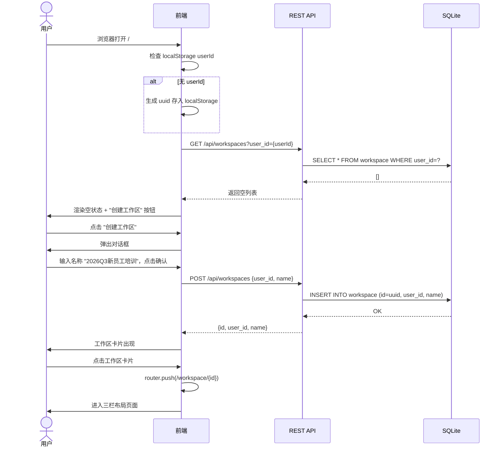
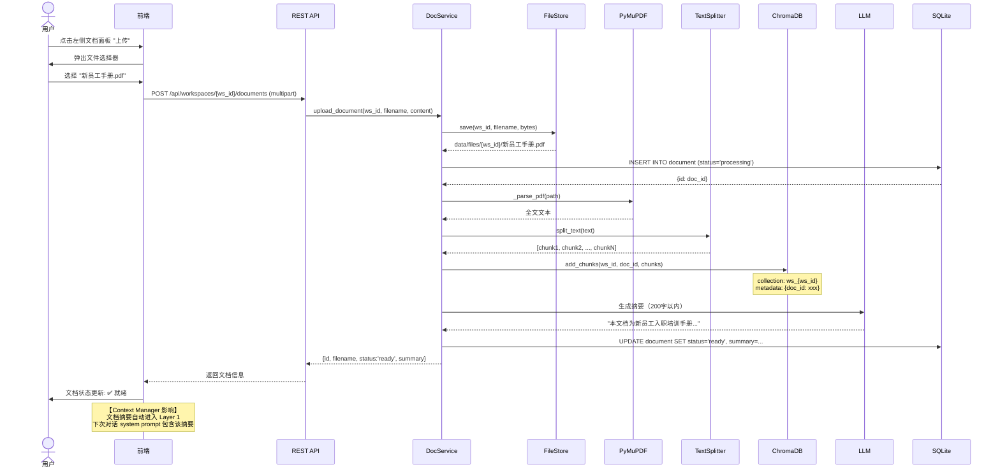
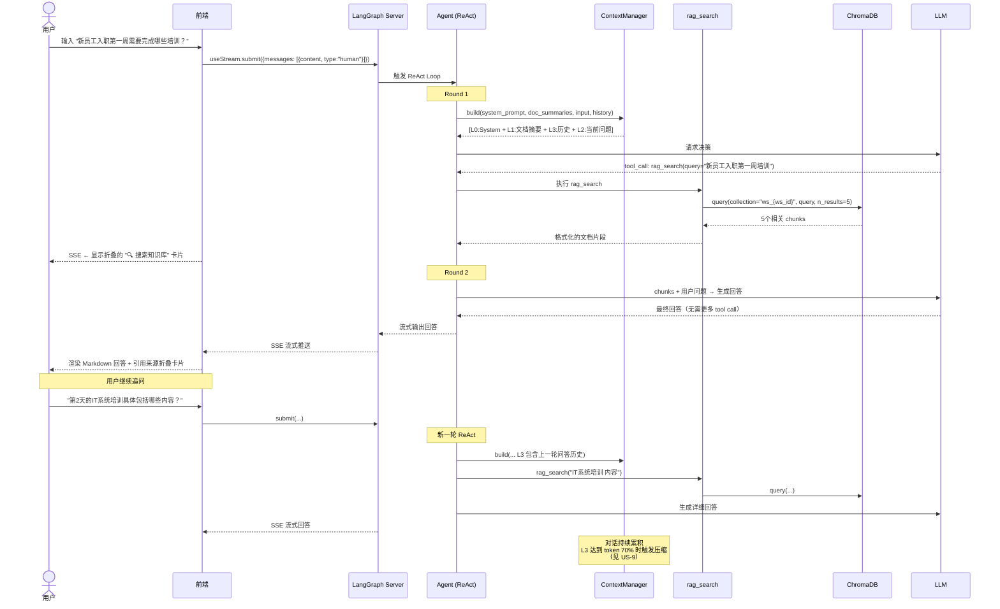
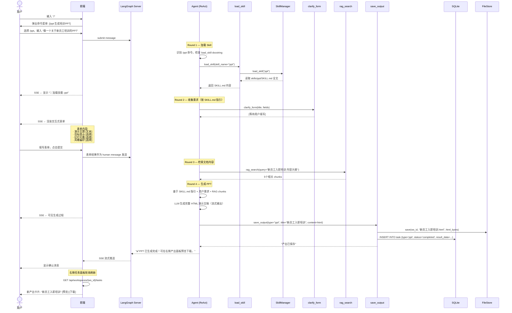
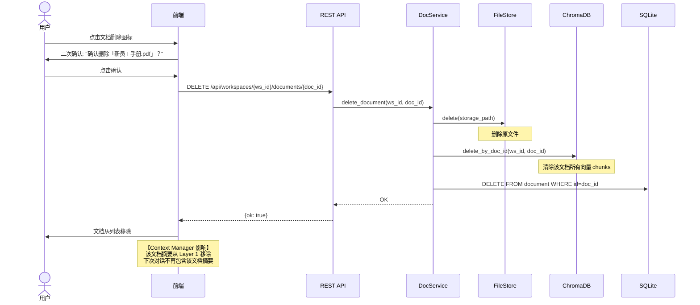
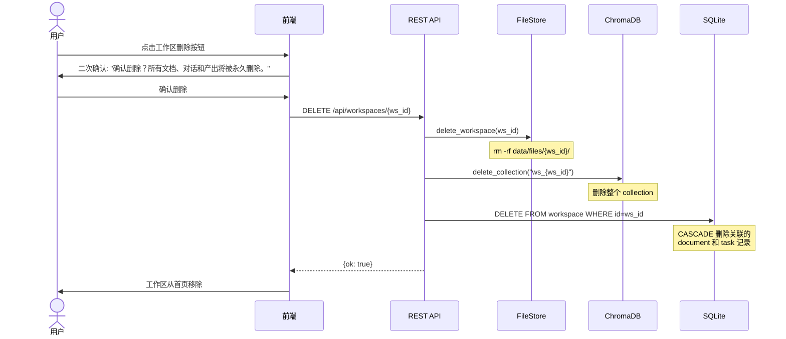
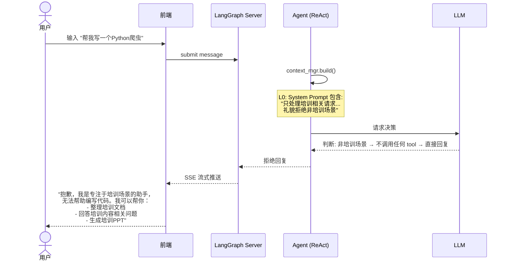
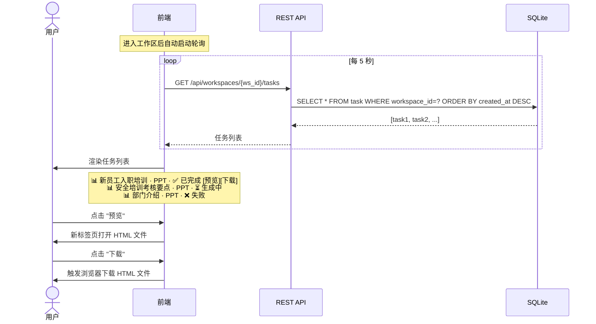
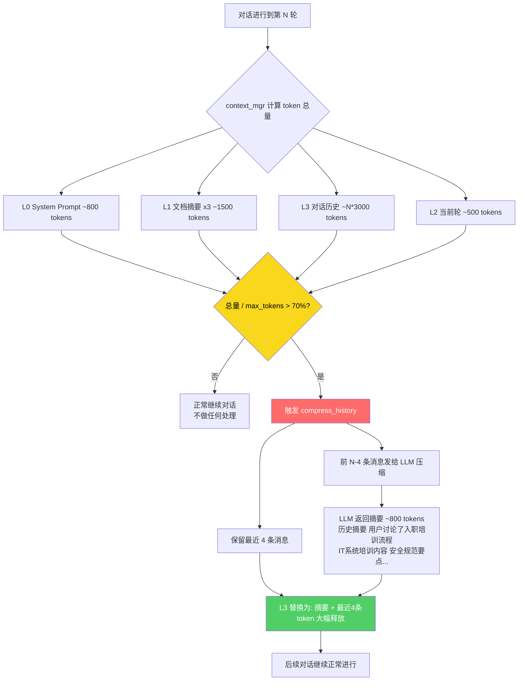

# 培训 Agent — 核心 User Stories & 全链路执行过程

---

## US-1: 首次访问 — 创建工作区

**用户故事：** 作为培训管理员，我希望能创建一个工作区来组织特定培训项目的所有资料和对话。

### 预期执行过程



---

## US-2: 上传文档 — 构建知识库

**用户故事：** 作为培训管理员，我希望上传培训文档后系统自动解析和索引，以便后续基于文档进行问答。

### 预期执行过程



---

## US-3: 基于知识库多轮对话

**用户故事：** 作为培训管理员，我希望基于上传的文档与 Agent 进行问答，Agent 能引用文档内容回答问题。

### 预期执行过程



---

## US-4: /ppt 命令 — 生成培训 PPT

**用户故事：** 作为培训管理员，我希望基于知识库文档快速生成培训 PPT，Agent 通过对话收集需求后自动生成。

### 预期执行过程



---

## US-5: 删除文档

**用户故事：** 作为培训管理员，我希望能删除不再需要的文档，同时清理其向量索引。

### 预期执行过程



---

## US-6: 删除工作区

**用户故事：** 作为培训管理员，我希望能删除整个工作区，包括其中所有文档、对话和产出。

### 预期执行过程



---

## US-7: Agent 拒绝非培训场景

**用户故事：** 作为产品设计者，我希望 Agent 能识别并礼貌拒绝非培训场景的请求。

### 预期执行过程



---

## US-8: 查看产出/任务面板

**用户故事：** 作为培训管理员，我希望在右侧面板中查看所有产出物的状态和结果。

### 预期执行过程



---

## US-9: 上下文压缩 — 长对话场景

**用户故事：** 作为培训管理员，我在长时间多轮对话后，Agent 依然能正常回答问题，不会因为上下文过长而出错。

### 预期执行过程



---

## 全链路关键路径总结

```mermaid
graph LR
    subgraph 用户入口
        WS[创建工作区]
        UPLOAD[上传文档]
    end

    subgraph 核心交互
        CHAT[知识库对话]
        PPT[/ppt 生成]
        REJECT[拒绝非培训]
    end

    subgraph 产出管理
        TASK[任务面板]
        PREVIEW[预览/下载]
    end

    subgraph 内部机制
        CTX[上下文压缩]
    end

    WS --> UPLOAD
    UPLOAD --> CHAT
    CHAT --> PPT
    CHAT --> REJECT
    PPT --> TASK
    TASK --> PREVIEW
    CHAT -.-> CTX

    style WS fill:#4dabf7,color:#fff
    style UPLOAD fill:#4dabf7,color:#fff
    style CHAT fill:#ae3ec9,color:#fff
    style PPT fill:#ae3ec9,color:#fff
    style TASK fill:#20c997,color:#fff
    style CTX fill:#868e96,color:#fff
```

| 路径 | 涉及模块 | 关键接口 |
|------|----------|----------|
| 创建工作区 | Frontend → REST → SQLite | `POST /api/workspaces` |
| 上传文档 | Frontend → REST → DocService → FileStore + PyMuPDF + ChromaDB + LLM | `POST /api/workspaces/{id}/documents` |
| 知识库对话 | Frontend → SSE → Agent(ReAct) → rag_search → ChromaDB | LangGraph SSE stream |
| /ppt 生成 | Frontend → SSE → Agent → load_skill → clarify_form → rag_search → save_output | LangGraph SSE stream |
| 产出查询 | Frontend(polling) → REST → SQLite | `GET /api/workspaces/{id}/tasks` |
| 文档删除 | Frontend → REST → DocService → FileStore + ChromaDB + SQLite | `DELETE .../documents/{id}` |
| 上下文压缩 | Agent 内部 → ContextManager → LLM | 自动触发，用户无感知 |